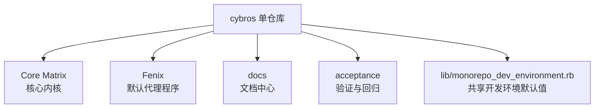

本页是“Get Started”里的起点，目标不是讲细节，而是先帮你建立一个**全局地图**：这个仓库在做什么、文档怎么分层、你应该先读什么，以及哪些信息可以直接当作当前基线。你现在所在的位置是 **Get Started → Overview**。Sources: [wiki.json](https://github.com/jasl/cybros.new/blob/main/.zread/wiki/drafts/wiki.json#L5-L12), [README.md](https://github.com/jasl/cybros.new/blob/main/README.md#L3-L4)

## 这个仓库的核心定位

这个仓库是一个 monorepo，核心对象有两个：**Core Matrix** 和 **Fenix**。Core Matrix 是内核产品，负责代理循环执行、会话状态、工作流调度、人机交互原语、运行时监督和平台级治理；Fenix 则是默认开箱即用的代理程序，同时也是 Core Matrix 整个循环的第一个技术验证程序。Sources: [README.md](https://github.com/jasl/cybros.new/blob/main/README.md#L3-L13)

| 组成部分 | 作用 | 新手可以怎么理解 |
|---|---|---|
| Core Matrix | 内核与平台能力 | “系统底座” |
| Fenix | 默认代理程序 | “第一个跑起来的产品实例” |
| 文档树 | 设计、计划、验证与归档 | “项目记忆与路线图” |
| 验证流程 | 自动化与手工回归结合 | “不是只靠测试就结束” |

上表把仓库里的关键角色压缩成了一个容易记忆的模型：**底座、产品、文档、验证**。如果你先把这四层分清，后面读任何页面都会更快定位自己在看哪一类信息。Sources: [README.md](https://github.com/jasl/cybros.new/blob/main/README.md#L6-L13), [README.md](https://github.com/jasl/cybros.new/blob/main/README.md#L38-L47), [docs/README.md](https://github.com/jasl/cybros.new/blob/main/docs/README.md#L16-L27)

## 仓库结构一眼看懂

如果你第一次看 Mermaid，可以把下面的箭头理解成“属于”或“流向”。这个图只保留了 Overview 需要知道的高层结构：仓库顶层关注 Core Matrix、Fenix 和文档/验证三条主线。Sources: [README.md](https://github.com/jasl/cybros.new/blob/main/README.md#L3-L13), [docs/README.md](https://github.com/jasl/cybros.new/blob/main/docs/README.md#L3-L14)

这个视图的重点不是目录名本身，而是帮助你建立“仓库是一个整体，但内部由多个职责明确的子区域组成”的直觉。后续你读到具体目录时，可以把它们放回这个结构里理解。Sources: [README.md](https://github.com/jasl/cybros.new/blob/main/README.md#L3-L13), [lib/monorepo_dev_environment.rb](https://github.com/jasl/cybros.new/blob/main/lib/monorepo_dev_environment.rb#L3-L19)

## 文档应该怎么读

文档树有明确的生命周期：工作通常从提案开始，经过计划，进入执行，完成后再归档。当前文档索引把目录分成了 proposed-designs、proposed-plans、design、future-plans、plans、research-notes、finished-plans、archived-plans、checklists 和 operations 等几类，其中 **plans** 是当前执行工作，**finished-plans** 是已完成并通过验证的材料。Sources: [docs/README.md](https://github.com/jasl/cybros.new/blob/main/docs/README.md#L3-L14), [docs/README.md](https://github.com/jasl/cybros.new/blob/main/docs/README.md#L35-L48)

| 目录 | 状态/用途 | 适合什么时候看 |
|---|---|---|
| `docs/proposed-designs` | 设计草案 | 还在讨论时 |
| `docs/proposed-plans` | 计划草案 | 还没准备激活时 |
| `docs/design` | 长生命周期设计基线 | 想看稳定设计时 |
| `docs/future-plans` | 已接受但尚未激活的后续工作 | 想看未来批次时 |
| `docs/plans` | 当前执行中的工作 | 想看当前实现状态时 |
| `docs/finished-plans` | 已完成并验证的计划 | 想看已收敛结果时 |
| `docs/archived-plans` | 过时或被替代的材料 | 想追溯历史时 |
| `docs/checklists` | 手工验证清单 | 想做回归时 |
| `docs/operations` | 运行拓扑与运维指导 | 想看运行参数和操作时 |

上表对应的核心规则很简单：**先看当前执行，再回看已完成结果，最后用归档材料做追溯**。同时要注意，旧文档里可能保留了 April 2026 reset 之前的命名，而当前代码库使用的是 `AgentProgram`、`AgentProgramVersion`、`AgentSession`、`ExecutionRuntime` 和 `ExecutionSession` 这一组名称。Sources: [docs/README.md](https://github.com/jasl/cybros.new/blob/main/docs/README.md#L29-L33), [docs/README.md](https://github.com/jasl/cybros.new/blob/main/docs/README.md#L37-L58)

## 本地开发环境的默认端口

仓库里有一个共享的小工具，用来给单仓库开发环境提供默认端口和基础 URL。它的行为很直接：`PORT` 默认跟随 `CORE_MATRIX_PORT`，Core Matrix 默认端口是 `3000`；Fenix 默认端口是 `36173`；`AGENT_FENIX_BASE_URL` 默认指向 `http://127.0.0.1:36173`。Sources: [lib/monorepo_dev_environment.rb](https://github.com/jasl/cybros.new/blob/main/lib/monorepo_dev_environment.rb#L3-L19)

| 变量 | 默认值 | 含义 |
|---|---|---|
| `CORE_MATRIX_PORT` | `3000` | Core Matrix 的默认端口 |
| `PORT` | 跟随 `CORE_MATRIX_PORT` | 通用运行端口 |
| `AGENT_FENIX_PORT` | `36173` | Fenix 的默认端口 |
| `AGENT_FENIX_BASE_URL` | `http://127.0.0.1:36173` | Fenix 的本地访问地址 |

这意味着你在本地启动单仓库环境时，可以先把“Core Matrix 跑在 3000、Fenix 跑在 36173”当成默认心智模型；如果环境变量覆盖了默认值，就以实际配置为准。Sources: [lib/monorepo_dev_environment.rb](https://github.com/jasl/cybros.new/blob/main/lib/monorepo_dev_environment.rb#L10-L19)

## 建议的下一步阅读顺序

如果你是新手，建议按这个顺序继续阅读：先看 [Quick Start](https://github.com/jasl/cybros.new/blob/main/2-quick-start)，再看 [单仓库开发环境与关键命令](https://github.com/jasl/cybros.new/blob/main/3-dan-cang-ku-kai-fa-huan-jing-yu-guan-jian-ming-ling)，然后读 [项目边界与主要角色](https://github.com/jasl/cybros.new/blob/main/4-xiang-mu-bian-jie-yu-zhu-yao-jiao-se)，最后补上 [文档生命周期与阅读路线](https://github.com/jasl/cybros.new/blob/main/5-wen-dang-sheng-ming-zhou-qi-yu-yue-du-lu-xian)。Sources: [README.md](https://github.com/jasl/cybros.new/blob/main/README.md#L15-L37), [docs/README.md](https://github.com/jasl/cybros.new/blob/main/docs/README.md#L35-L48)