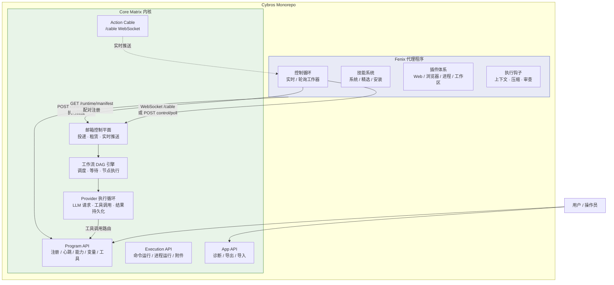
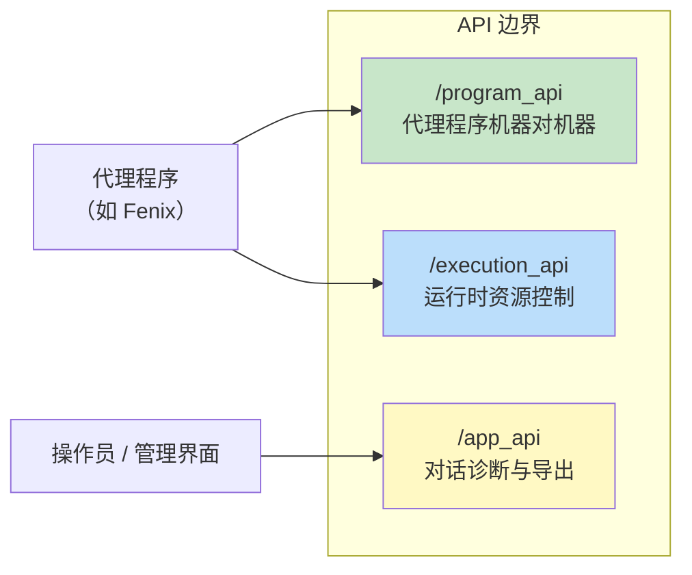

**Cybros** 是一个面向个人、家庭和小型团队的单实例 Agent 内核平台。它的核心设计哲学是将 **内核编排**与**领域行为**严格分离：内核负责代理循环执行、会话状态、工作流调度与平台治理，而具体的业务能力（如编码辅助、网页浏览、文档处理等）由外部的**代理程序**提供。这种架构使得内核本身保持通用性，同时通过可插拔的代理程序验证平台的可复用性。

Sources: [README.md](https://github.com/jasl/cybros.new/blob/main/README.md#L1-L10), [core_matrix/README.md](https://github.com/jasl/cybros.new/blob/main/core_matrix/README.md#L1-L12)

---

## 两大核心产品

Cybros 单仓库包含两个独立但紧密协作的产品，各自拥有完整的 Rails 应用栈、独立的依赖管理和独立的 CI 验证流程。

| 维度 | **Core Matrix（内核）** | **Fenix（代理程序）** |
|------|------------------------|----------------------|
| 定位 | 单安装、单租户的 Agent 内核 | 默认开箱即用的代理程序 |
| 核心职责 | 代理循环执行、会话/轮次状态、工作流 DAG 调度、人类交互原语、运行时监督、审计治理 | 通用助理对话 + 编码助手 + 日常办公辅助 |
| 技术栈 | Ruby on Rails 8.2 + PostgreSQL + Solid Queue + Solid Cable + Bun | Ruby on Rails + Solid Queue（独立拓扑） |
| 运行端口 | 3000（默认） | 36173（默认） |
| API 角色 | 编排真相源，提供 Program API / Execution API / App API | 消费者，通过邮箱控制平面接收指令并回报结果 |
| 代码规模 | 81 个模型、247 个服务对象、375 个测试文件、56 个数据库迁移 | 91 个服务对象，独立 Rails 应用 |

Sources: [README.md](https://github.com/jasl/cybros.new/blob/main/README.md#L8-L12), [core_matrix/README.md](https://github.com/jasl/cybros.new/blob/main/core_matrix/README.md#L1-L12), [agents/fenix/README.md](https://github.com/jasl/cybros.new/blob/main/agents/fenix/README.md#L1-L10), [lib/monorepo_dev_environment.rb](https://github.com/jasl/cybros.new/blob/main/lib/monorepo_dev_environment.rb#L1-L22)

---

## 整体架构总览

下图展示了 Core Matrix 内核与 Fenix 代理程序之间的核心交互关系：



**关键交互模式**：Fenix 不是被动接收请求的 HTTP 服务，而是通过 **邮箱控制平面**与 Core Matrix 协作。Core Matrix 作为编排真相源，将任务（邮箱项）投递到 `agent_control_mailbox_items` 表，Fenix 的持久化控制工作器通过 WebSocket 或轮询获取任务、执行、再回报结果。这种设计确保了内核对所有执行状态的完整可观测性。

Sources: [core_matrix/config/routes.rb](https://github.com/jasl/cybros.new/blob/main/core_matrix/config/routes.rb#L14-L82), [agents/fenix/README.md](https://github.com/jasl/cybros.new/blob/main/agents/fenix/README.md#L88-L135), [core_matrix/app/services/agent_control/poll.rb](https://github.com/jasl/cybros.new/blob/main/core_matrix/app/services/agent_control/poll.rb#L1-L40)

---

## 三层 API 边界

Core Matrix 对外暴露三层 API 命名空间，每层面向不同的消费者和信任边界：



**Program API**（`/program_api`）是代理程序的机器对机器接口，负责注册、心跳、能力握手、对话转录读取、变量读写、人类交互创建、工具调用回报以及控制平面的轮询与上报。

**Execution API**（`/execution_api`）面向运行时资源控制，包括命令运行（`command_runs`）、进程运行（`process_runs`）和附件请求。

**App API**（`/app_api`）提供对话诊断、导出（标准包/调试包）与导入功能，面向操作员和管理工具。

Sources: [core_matrix/config/routes.rb](https://github.com/jasl/cybros.new/blob/main/core_matrix/config/routes.rb#L16-L82), [core_matrix/app/controllers](https://github.com/jasl/cybros.new/blob/main/core_matrix/app/controllers)

---

## Core Matrix 领域模型鸟瞰

Core Matrix 的数据库包含 37 张核心业务表（不含 Active Storage），覆盖了从安装身份到工作流执行的完整生命周期。以下按领域分组展示核心模型：

| 领域分组 | 核心模型 | 职责概述 |
|---------|---------|---------|
| **安装与身份** | `Installation`, `User`, `Identity`, `Invitation`, `Workspace` | 单安装行约束、用户认证、邀请机制、工作区隔离 |
| **代理程序** | `AgentProgram`, `AgentProgramVersion`, `AgentEnrollment`, `AgentSession`, `ExecutionRuntime`, `ExecutionSession` | 代理注册、版本管理、能力握手、会话追踪 |
| **会话与轮次** | `Conversation`, `Turn`, `Message`, `UserMessage`, `AgentMessage` | 对话树（root/branch/fork/checkpoint）、轮次状态机、消息可见性 |
| **工作流 DAG** | `WorkflowRun`, `WorkflowNode`, `WorkflowEdge`, `WorkflowNodeEvent`, `WorkflowArtifact` | DAG 图执行、节点调度、等待状态、意图批次 |
| **Provider 执行** | `ProviderCredential`, `ProviderPolicy`, `ProviderEntitlement`, `UsageEvent`, `UsageRollup`, `ExecutionProfileFact` | LLM 提供商目录、准入控制、使用量计费、执行画像 |
| **邮箱控制** | `AgentControlMailboxItem`, `AgentControlReportReceipt`, `AgentTaskRun` | 邮箱投递、租赁管理、回报确认 |
| **人类交互** | `HumanInteractionRequest`, `ApprovalRequest`, `HumanFormRequest`, `HumanTaskRequest` | 审批、表单、任务请求原语 |
| **工具治理** | `ToolDefinition`, `ToolImplementation`, `ToolBinding`, `ToolInvocation`, `ImplementationSource` | 工具定义、实现路由、绑定快照、调用审计 |
| **子代理** | `SubagentSession`, `ExecutionLease` | 子代理会话树、执行租约 |
| **可关闭资源** | `CommandRun`, `ProcessRun`（含 `ClosableRuntimeResource` concern） | 长生命周期资源的请求→确认→关闭状态机 |

Sources: [core_matrix/db/schema.rb](https://github.com/jasl/cybros.new/blob/main/core_matrix/db/schema.rb#L13-L1635), [core_matrix/app/models](https://github.com/jasl/cybros.new/blob/main/core_matrix/app/models), [core_matrix/app/models/concerns/closable_runtime_resource.rb](https://github.com/jasl/cybros.new/blob/main/core_matrix/app/models/concerns/closable_runtime_resource.rb#L1-L60)

---

## 内核与代理程序的职责边界

理解 Cybros 的关键在于明确 Core Matrix **拥有**什么和**不拥有**什么：

**Core Matrix 拥有：**
- 代理循环执行与工作流推进
- 会话、轮次和运行时资源状态
- 人类交互原语
- 能力治理与执行监督
- 特性门控与恢复行为
- 审计、画像和平台级可观测性

**Core Matrix 不拥有（尚未或永远不会）：**
- 内置的长期记忆或知识子系统
- 每一个通用工具的最终实现
- IM、PWA 和桌面界面
- 扩展和插件打包

**Fenix 的职责则是：**
- 证明端到端的真实代理循环
- 成为内核之上的第一个完整 Web 产品
- 保持作为一个验证产品，同时其他代理程序证明内核的可复用性

这种分离意味着，当 Core Matrix 需要验证显著不同的产品形态时，应该创建独立的代理程序而不是将它们塞入 Fenix。

Sources: [core_matrix/README.md](https://github.com/jasl/cybros.new/blob/main/core_matrix/README.md#L29-L48), [agents/fenix/README.md](https://github.com/jasl/cybros.new/blob/main/agents/fenix/README.md#L19-L30)

---

## 开发环境与单仓库编排

Cybros 使用 **Foreman + Procfile.dev** 编排多进程开发环境，通过根目录的 `bin/dev` 入口统一启动：

```
Procfile.dev
├── job:         Solid Queue 后台任务工作器（core_matrix）
├── js:          JavaScript 构建（core_matrix，Bun --watch）
├── css:         CSS 构建（core_matrix，Bun --watch）
└── agent_fenix: Fenix 代理程序（独立 Rails 服务器）
```

`bin/dev` 脚本首先加载 `MonorepoDevEnvironment` 模块，设置默认端口（Core Matrix: 3000, Fenix: 36173），然后启动 Foreman 管理后台进程，同时直接启动 Core Matrix 的 Rails 服务器。两个 Rails 应用在开发时并行运行，通过环境变量 `CORE_MATRIX_BASE_URL` 和 `AGENT_FENIX_BASE_URL` 互相发现。

Sources: [Procfile.dev](https://github.com/jasl/cybros.new/blob/main/Procfile.dev#L1-L5), [bin/dev](https://github.com/jasl/cybros.new/blob/main/bin/dev#L1-L55), [lib/monorepo_dev_environment.rb](https://github.com/jasl/cybros.new/blob/main/lib/monorepo_dev_environment.rb#L1-L22)

---

## CI 流水线与项目隔离

仓库采用**变更检测驱动的选择性 CI**策略。根 `.github/workflows/ci.yml` 作为唯一权威入口，通过 `changes` Job 检测文件变更路径，决定哪些子项目需要运行验证：

| 检测目标 | 触发条件 | 执行内容 |
|---------|---------|---------|
| `core_matrix` | `core_matrix/*` 或共享根文件变更 | Brakeman 安全扫描、Bundler Audit、RuboCop 代码风格、JS Lint、数据库测试、系统测试 |
| `agents/fenix` | `agents/fenix/*` 或共享根文件变更 | Brakeman、Bundler Audit、RuboCop、数据库测试 |
| `simple_inference` | `core_matrix/vendor/simple_inference/*` 变更 | 内联 gem 的独立测试套件 |

共享根文件（`AGENTS.md`、`.editorconfig`、`.gitattributes`、`.gitignore`、`.github/workflows/*`）的变更会触发所有子项目的 CI。每个子项目使用 Ruby 4.0.2（通过 `.ruby-version` 锁步升级）和独立的 `Gemfile`。

Sources: [.github/workflows/ci.yml](https://github.com/jasl/cybros.new/blob/main/.github/workflows/ci.yml#L1-L200), [AGENTS.md](https://github.com/jasl/cybros.new/blob/main/AGENTS.md#L38-L63)

---

## 运行时拓扑与队列架构

Core Matrix 使用 **Solid Queue** 作为后台任务引擎，通过 `config/runtime_topology.yml` 定义了精细化的队列拓扑：

| 队列类别 | 队列名称 | 用途 | 默认线程数 |
|---------|---------|------|-----------|
| LLM 队列 | `llm_codex_subscription` | Codex 订阅提供商请求 | 2 |
| LLM 队列 | `llm_openai` | OpenAI API 请求 | 3 |
| LLM 队列 | `llm_openrouter` | OpenRouter 路由请求 | 2 |
| LLM 队列 | `llm_dev` / `llm_local` | 开发/本地模型 | 1 |
| 共享队列 | `tool_calls` | 工具调用执行 | 6 |
| 共享队列 | `workflow_default` | 工作流节点调度 | 3 |
| 共享队列 | `maintenance` | 维护任务 | 1 |

这种按 Provider 分区的队列设计确保了 LLM 请求的**准入控制**（每个 Provider 有独立的 `max_concurrent_requests` 和 `cooldown_seconds`），同时为工具调用提供了高并发处理能力。

Sources: [core_matrix/config/runtime_topology.yml](https://github.com/jasl/cybros.new/blob/main/core_matrix/config/runtime_topology.yml#L1-L66), [core_matrix/config/llm_catalog.yml](https://github.com/jasl/cybros.new/blob/main/core_matrix/config/llm_catalog.yml#L1-L50)

---

## LLM Provider 目录

Core Matrix 通过 `config/llm_catalog.yml` 声明式管理 LLM 提供商和模型。当前支持四大提供商：

| 提供商 | 传输协议 | 认证方式 | 特点 |
|--------|---------|---------|------|
| **Codex Subscription** | Responses API (`/responses`) | OAuth Codex | 捆绑订阅模型，支持 GPT-5.3 Codex / GPT-5.4 |
| **OpenAI** | Responses API | API Key | 标准 OpenAI 接口，支持 GPT-5.4 / GPT-5.3 Instant |
| **OpenRouter** | Chat Completions API | API Key | 多模型路由，支持 GPT-5.4 Pro / GPT-5.4 |
| **Dev / Local** | 自定义 | 环境变量 | 开发和本地模型测试 |

每个模型条目声明了上下文窗口、最大输出 token 数、能力矩阵（文本输出/工具调用/结构化输出/多模态输入），以及软限制比率用于上下文截断策略。Provider 目录通过 `ProviderCatalog::Registry` 在运行时加载和缓存，支持配置热重载。

Sources: [core_matrix/config/llm_catalog.yml](https://github.com/jasl/cybros.new/blob/main/core_matrix/config/llm_catalog.yml#L1-L200), [core_matrix/app/services/provider_catalog/registry.rb](https://github.com/jasl/cybros.new/blob/main/core_matrix/app/services/provider_catalog/registry.rb#L1-L30)

---

## 标识符策略：public_id 与 bigint 的边界

Core Matrix 遵循严格的标识符边界规则：内部数据库使用 **bigint** 自增主键（高性能关联查询），而所有外部和代理程序面对的边界使用 **UUIDv7** 格式的 `public_id`。`HasPublicId` concern 为模型统一提供 `public_id` 验证和 `find_by_public_id!` 查找方法。

这意味着代理程序永远不会接触内部 bigint ID，确保了数据库内部优化与外部 API 稳定性的双重目标。

Sources: [core_matrix/app/models/concerns/has_public_id.rb](https://github.com/jasl/cybros.new/blob/main/core_matrix/app/models/concerns/has_public_id.rb#L1-L14), [AGENTS.md](https://github.com/jasl/cybros.new/blob/main/AGENTS.md#L20-L23)

---

## 验收测试体系

Cybros 实行**自动化测试 + 真实 LLM 验证**的双重保障策略。纯粹的自动化测试不足以证明真实的代理循环行为。当某个阶段声称具备真实循环能力时，验证必须包含：

- 单元和集成测试覆盖
- `bin/dev` 本地开发环境运行
- 真实 LLM API 调用
- `docs/checklists/` 下的手动验证清单

顶层 `acceptance/` 目录提供了独立于产品代码库的验收自动化框架，包含 12 个验收场景（如 `bundled_fast_terminal_validation`、`provider_backed_turn_validation`、`external_fenix_validation`、`subagent_wait_all_validation` 等），通过 `bin/rails runner` 在 Core Matrix 环境中执行。

Sources: [README.md](https://github.com/jasl/cybros.new/blob/main/README.md#L43-L51), [acceptance/README.md](https://github.com/jasl/cybros.new/blob/main/acceptance/README.md#L1-L30)

---

## 文档生命周期

Cybros 的设计文档遵循严格的六阶段生命周期，确保设计决策从提案到归档的可追溯性：

1. `docs/proposed-designs` → 新设计提案
2. `docs/proposed-plans` → 新实施计划提案
3. `docs/future-plans` → 已接受但非当前活跃的后续工作
4. `docs/plans` → 当前活跃的实施计划
5. `docs/finished-plans` → 已完成的实施记录
6. `docs/archived-plans` → 归档的历史计划

`docs/design` 目录存放跨多个未来阶段保持稳定的已批准设计基线。当前仓库已积累超过 100 份设计/计划文档，覆盖了从内核绿场设计到架构健康审计的完整工程决策链。

Sources: [README.md](https://github.com/jasl/cybros.new/blob/main/README.md#L15-L30), [docs](https://github.com/jasl/cybros.new/blob/main/docs)

---

## 许可证

仓库采用 **O'Saasy 许可证**，允许自由使用、修改和分发，但禁止将软件本身作为 SaaS 产品向第三方提供。许可证以项目为作用域：每个子目录可包含自己的许可证文件覆盖默认条款。值得注意的是，`core_matrix/vendor/simple_inference`（内嵌的 LLM 协议适配 gem）保持 MIT 许可证独立管理。

Sources: [LICENSE.md](https://github.com/jasl/cybros.new/blob/main/LICENSE.md#L1-L26), [README.md](https://github.com/jasl/cybros.new/blob/main/README.md#L55-L66)

---

## 建议阅读路径

作为入门开发者，建议按以下顺序深入了解 Cybros：

1. **[环境搭建与本地开发启动指南](https://github.com/jasl/cybros.new/blob/main/2-huan-jing-da-jian-yu-ben-di-kai-fa-qi-dong-zhi-nan)** — 搭建本地开发环境，启动 Core Matrix 和 Fenix
2. **[Docker Compose 部署参考](https://github.com/jasl/cybros.new/blob/main/3-docker-compose-bu-shu-can-kao)** — 容器化部署方案
3. **[六大限界上下文与领域模型总览](https://github.com/jasl/cybros.new/blob/main/4-liu-da-xian-jie-shang-xia-wen-yu-ling-yu-mo-xing-zong-lan)** — 深入 Core Matrix 的领域模型设计
4. **[会话、轮次与对话树结构](https://github.com/jasl/cybros.new/blob/main/7-hui-hua-lun-ci-yu-dui-hua-shu-jie-gou)** — 理解对话管理的核心抽象
5. **[工作流 DAG 执行引擎与调度器](https://github.com/jasl/cybros.new/blob/main/8-gong-zuo-liu-dag-zhi-xing-yin-qing-yu-diao-du-qi)** — 掌握工作流执行的运行机制
6. **[Fenix 产品定位与配对清单契约](https://github.com/jasl/cybros.new/blob/main/19-fenix-chan-pin-ding-wei-yu-pei-dui-qing-dan-qi-yue)** — 理解代理程序如何与内核配对