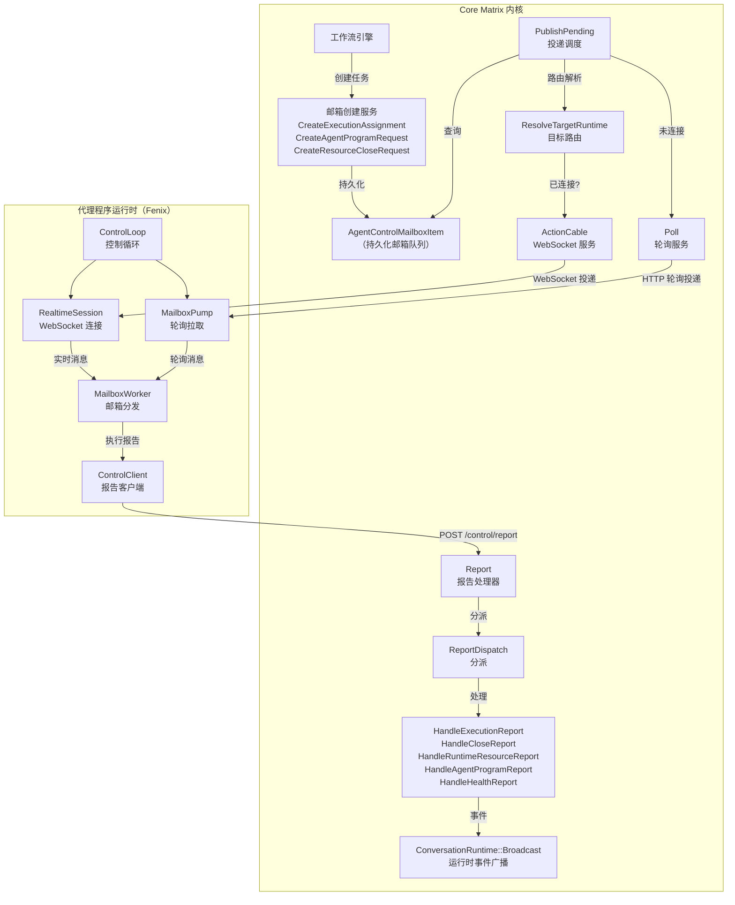
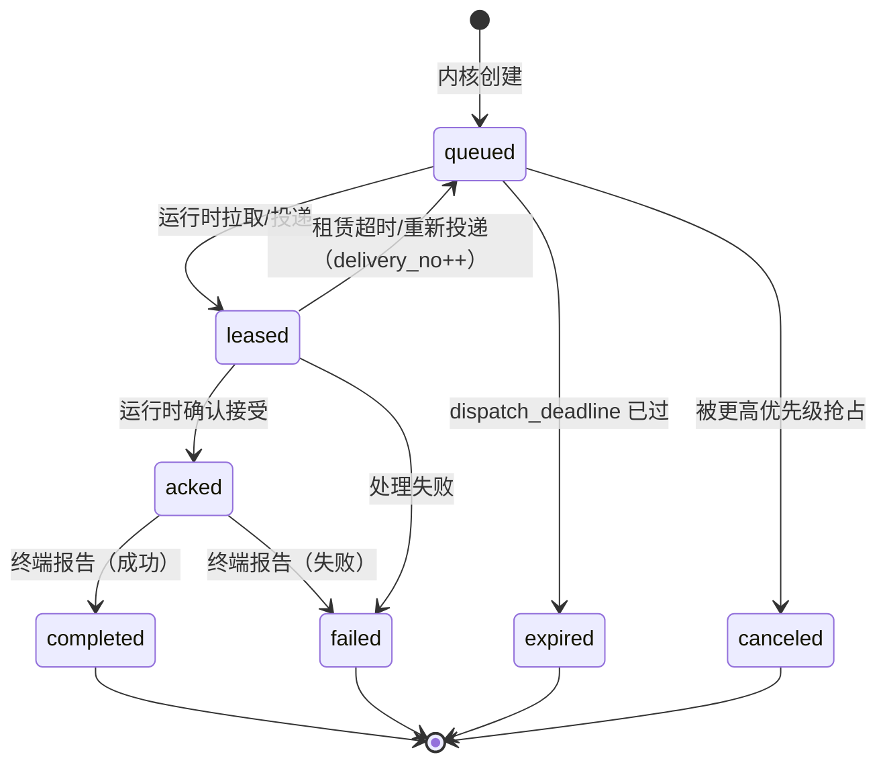
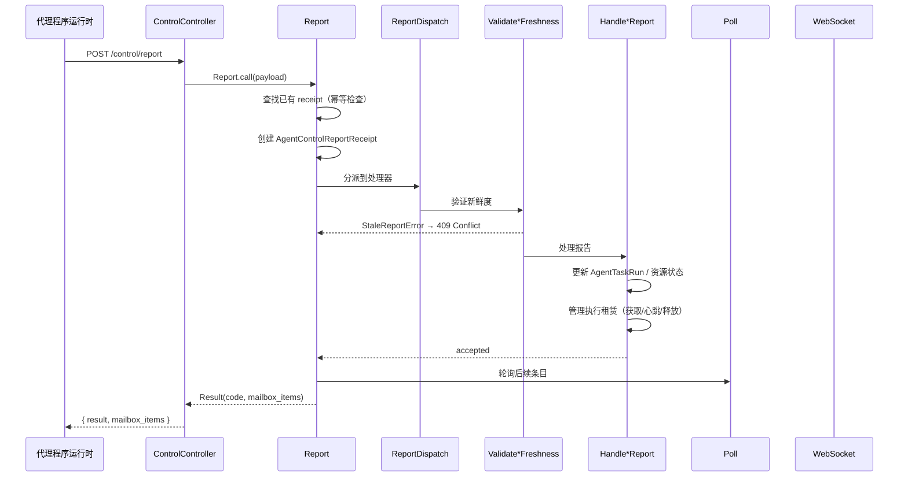
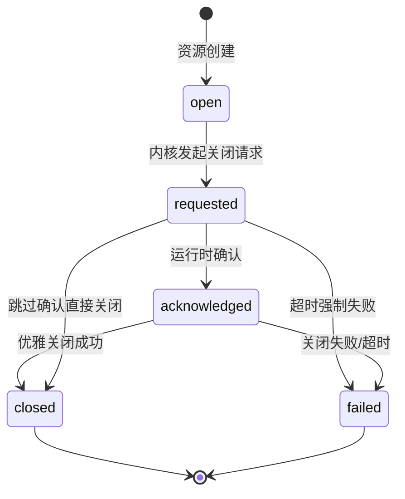

邮箱控制平面（Mailbox Control Plane）是 Core Matrix 内核与代理程序运行时之间的**核心通信协议层**。它不是一个简单的消息队列，而是一个带有租赁、截止时间和幂等处理器的持久化邮箱模型。内核不需要对运行时的回调或入站连接——运行时拥有向外的连接方向，通过 WebSocket 实时接收或通过 HTTP 轮询拉取邮箱投递。这种设计使系统天然适用于家庭部署、私有子网和容器化场景，同时保持了严格的因果一致性、优先级排序和资源生命周期管控。

Sources: [conversation-close-and-mailbox-control-protocol-design.md](https://github.com/jasl/cybros.new/blob/main/docs/design/2026-03-26-core-matrix-conversation-close-and-mailbox-control-protocol-design.md#L1-L39), [websocket-first-runtime-mailbox-control-design.md](https://github.com/jasl/cybros.new/blob/main/docs/finished-plans/2026-03-30-websocket-first-runtime-mailbox-control-design.md#L1-L26)

## 架构总览

控制平面的核心思路是**资源平面**与**控制平面**的分离。资源平面处理无状态的短请求（注册、转录读取、变量操作等），而控制平面则承载有状态的工作调度、执行报告、资源关闭请求和健康报告。两条传输通道——WebSocket 和 HTTP 轮询——投递的是**同一组邮箱条目**，共享相同的序列化信封格式。

Sources: [publish_pending.rb](https://github.com/jasl/cybros.new/blob/main/core_matrix/app/services/agent_control/publish_pending.rb#L15-L32), [control_loop.rb](https://github.com/jasl/cybros.new/blob/main/agents/fenix/app/services/fenix/runtime/control_loop.rb#L30-L47), [report_dispatch.rb](https://github.com/jasl/cybros.new/blob/main/core_matrix/app/services/agent_control/report_dispatch.rb#L39-L61)

## 邮箱条目模型：AgentControlMailboxItem

`AgentControlMailboxItem` 是邮箱控制平面的核心持久化实体。每个条目代表一条从内核发往代理程序运行时的指令，携带完整的投递元数据、租赁状态和截止时间约束。

### 条目类型与优先级体系

| 条目类型 (`item_type`) | 优先级 | 运行时平面 | 说明 |
|---|---|---|---|
| `execution_assignment` | P1 | program | 工作流执行任务分配 |
| `agent_program_request` | P1 | program | 代理程序请求（轮次准备、工具执行） |
| `resource_close_request` | P0 | program/execution | 资源关闭请求，优先级最高 |
| `capabilities_refresh_request` | P3 | program | 能力刷新请求 |
| `recovery_notice` | P4 | program | 恢复通知 |

**关键设计约束**：关闭请求（P0）始终高于所有常规执行工作（P1+）。一旦某资源的关闭请求存在，同一资源的后续重试必须被取消或忽略。

Sources: [agent_control_mailbox_item.rb](https://github.com/jasl/cybros.new/blob/main/core_matrix/app/models/agent_control_mailbox_item.rb#L4-L25), [conversation-close-and-mailbox-control-protocol-design.md](https://github.com/jasl/cybros.new/blob/main/docs/design/2026-03-26-core-matrix-conversation-close-and-mailbox-control-protocol-design.md#L170-L191)

### 状态机与生命周期

邮箱条目遵循严格的状态机：

每个状态转换都有时间戳记录（`leased_at`、`acked_at`、`completed_at`、`failed_at`），确保完整的审计追踪。当租赁过期时，条目不会立即失败，而是递增 `delivery_no` 并重新回到可投递状态，等待下一个运行时实例认领。

Sources: [agent_control_mailbox_item.rb](https://github.com/jasl/cybros.new/blob/main/core_matrix/app/models/agent_control_mailbox_item.rb#L15-L25), [lease_mailbox_item.rb](https://github.com/jasl/cybros.new/blob/main/core_matrix/app/services/agent_control/lease_mailbox_item.rb#L13-L35)

### 双运行时平面：program 与 execution

邮箱条目通过 `runtime_plane` 字段区分两条投递路径：

- **program 平面**：面向代理程序部署（`AgentProgramVersion`），处理执行分配和代理程序请求。目标路由基于 `target_agent_program` 和可选的 `target_agent_program_version`。
- **execution 平面**：面向执行运行时会话（`ExecutionSession`），处理进程管理相关的报告。目标路由基于 `target_execution_runtime`。

这种区分确保了代理程序层面的工作与执行环境层面的工作（如 `ProcessRun` 管理）拥有独立的投递通道，避免了队列混淆。

Sources: [agent_control_mailbox_item.rb](https://github.com/jasl/cybros.new/blob/main/core_matrix/app/models/agent_control_mailbox_item.rb#L52-L58), [resolve_target_runtime.rb](https://github.com/jasl/cybros.new/blob/main/core_matrix/app/services/agent_control/resolve_target_runtime.rb#L68-L74)

## 投递机制：实时推送与轮询回退

邮箱投递遵循 **WebSocket 优先、轮询兜底** 的双通道策略。两条通道投递的是同一组邮箱条目，使用完全相同的信封格式。

### 实时链路（WebSocket）

当代理程序运行时通过 `AgentControlChannel` 建立 WebSocket 连接时：

1. 连接建立后，内核将 `realtime_link_connected` 标记为 `true`，并调用 `PublishPending` 立即推送所有挂起条目
2. 后续新创建的邮箱条目通过 `ActionCable.server.broadcast` 实时推送到 `agent_control:deployment:{public_id}` 流
3. 连接断开时，`realtime_link_connected` 标记为 `false`，但控制活动状态可能仍然保持活跃

WebSocket 流名称通过 `AgentControl::StreamName.for_deployment(deployment)` 生成，格式为 `agent_control:deployment:{public_id}`。

Sources: [agent_control_channel.rb](https://github.com/jasl/cybros.new/blob/main/core_matrix/app/channels/agent_control_channel.rb#L1-L14), [stream_name.rb](https://github.com/jasl/cybros.new/blob/main/core_matrix/app/services/agent_control/stream_name.rb#L1-L7), [open.rb](https://github.com/jasl/cybros.new/blob/main/core_matrix/app/services/agent_control/realtime_links/open.rb#L13-L24)

### 轮询回退（HTTP Poll）

运行时始终可以通过 `POST /program_api/control/poll` 或 `POST /execution_api/control/poll` 拉取待处理条目。`Poll` 服务执行以下步骤：

1. **更新活动时间戳**：调用 `TouchDeploymentActivity` 刷新会话的控制活动状态
2. **推进关闭请求**：遍历所有活跃的关闭请求条目，检查宽限期/强制截止期是否已到
3. **租赁候选条目**：按优先级、可用时间和 ID 排序扫描候选条目，通过 `LeaseMailboxItem` 进行行级锁定认领

轮询返回最多 `DEFAULT_LIMIT`（20）条已租赁的邮箱条目。

Sources: [poll.rb](https://github.com/jasl/cybros.new/blob/main/core_matrix/app/services/agent_control/poll.rb#L17-L41), [control_controller.rb](https://github.com/jasl/cybros.new/blob/main/core_matrix/app/controllers/program_api/control_controller.rb#L3-L13)

### 投递信封格式

`SerializeMailboxItem` 将邮箱条目序列化为统一信封：

| 字段 | 说明 |
|---|---|
| `item_id` | 条目公共标识符 |
| `item_type` | 条目类型 |
| `runtime_plane` | 运行时平面（program/execution） |
| `logical_work_id` | 逻辑工作标识符 |
| `attempt_no` | 尝试编号 |
| `delivery_no` | 投递次数（含重投） |
| `protocol_message_id` | 协议消息唯一标识 |
| `causation_id` | 因果链标识 |
| `priority` | 优先级 |
| `status` | 当前状态 |
| `available_at` | 可用时间 |
| `dispatch_deadline_at` | 投递截止时间 |
| `lease_timeout_seconds` | 租赁超时 |
| `execution_hard_deadline_at` | 执行硬截止时间 |
| `payload` | 业务载荷 |

Sources: [serialize_mailbox_item.rb](https://github.com/jasl/cybros.new/blob/main/core_matrix/app/services/agent_control/serialize_mailbox_item.rb#L1-L23)

## 租赁机制：ExecutionLease 与 MailboxItem Lease

控制平面中有两层租赁机制，分别服务于不同的所有权保证。

### 邮箱条目租赁

邮箱条目级别的租赁由 `LeaseMailboxItem` 管理。当运行时认领一个条目时：

1. 获取行级锁（`with_lock`）
2. 检查截止时间：如果 `dispatch_deadline_at` 已过，标记为 `expired`
3. 检查租赁竞争：如果条目已被其他部署租赁且未过期，跳过
4. 如果租赁过期（`lease_expires_at < now`），允许重新认领，`delivery_no` 递增
5. 记录 `leased_to_agent_session` / `leased_to_execution_session` 和 `lease_expires_at`

租赁超时由 `lease_timeout_seconds` 控制（默认 30 秒），从租赁时刻开始计算。

Sources: [lease_mailbox_item.rb](https://github.com/jasl/cybros.new/blob/main/core_matrix/app/services/agent_control/lease_mailbox_item.rb#L13-L35)

### 执行租赁（ExecutionLease）

`ExecutionLease` 是更细粒度的资源级租赁，绑定到具体的运行时资源（`AgentTaskRun`、`ProcessRun`、`SubagentSession`）。它提供三层操作：

| 操作 | 服务 | 说明 |
|---|---|---|
| `Acquire` | `Leases::Acquire` | 在事务中获取租赁，自动过期陈旧租赁 |
| `Heartbeat` | `Leases::Heartbeat` | 刷新 `last_heartbeat_at`，过期则自动释放 |
| `Release` | `Leases::Release` | 显式释放并记录原因 |

**陈旧检测**：当 `last_heartbeat_at` 超过 `heartbeat_timeout_seconds` 时，租赁被判定为陈旧。新的获取请求会自动释放陈旧租赁。

**持有者验证**：每次心跳和释放都验证 `holder_key`（`AgentProgramVersion.public_id`），确保只有租赁持有者才能操作。

Sources: [execution_lease.rb](https://github.com/jasl/cybros.new/blob/main/core_matrix/app/models/execution_lease.rb#L1-L30), [acquire.rb](https://github.com/jasl/cybros.new/blob/main/core_matrix/app/services/leases/acquire.rb#L17-L41), [heartbeat.rb](https://github.com/jasl/cybros.new/blob/main/core_matrix/app/services/leases/heartbeat.rb#L15-L37), [release.rb](https://github.com/jasl/cybros.new/blob/main/core_matrix/app/services/leases/release.rb#L14-L26)

## 报告协议：从投递到完成

运行时通过 `POST /control/report` 向内核报告执行状态。报告协议是幂等的：相同的 `protocol_message_id` 不会被重复处理。

### 报告处理流程

### 报告类型与分派

`ReportDispatch` 根据 `method_id` 将报告路由到对应的处理器：

| method_id | 处理器 | 说明 |
|---|---|---|
| `execution_started` | `HandleExecutionReport` | 运行时接受执行分配 |
| `execution_progress` | `HandleExecutionReport` | 执行进度更新 |
| `execution_complete` | `HandleExecutionReport` | 执行成功完成 |
| `execution_fail` | `HandleExecutionReport` | 执行失败 |
| `execution_interrupted` | `HandleExecutionReport` | 执行被中断 |
| `process_started` | `HandleRuntimeResourceReport` | 进程启动确认 |
| `process_output` | `HandleRuntimeResourceReport` | 进程输出推送 |
| `process_exited` | `HandleRuntimeResourceReport` | 进程退出 |
| `resource_close_acknowledged` | `HandleCloseReport` | 资源关闭确认 |
| `resource_closed` | `HandleCloseReport` | 资源已关闭 |
| `resource_close_failed` | `HandleCloseReport` | 资源关闭失败 |
| `agent_program_completed` | `HandleAgentProgramReport` | 代理程序请求完成 |
| `agent_program_failed` | `HandleAgentProgramReport` | 代理程序请求失败 |
| `deployment_health_report` | `HandleHealthReport` | 部署健康报告 |

Sources: [report.rb](https://github.com/jasl/cybros.new/blob/main/core_matrix/app/services/agent_control/report.rb#L22-L50), [report_dispatch.rb](https://github.com/jasl/cybros.new/blob/main/core_matrix/app/services/agent_control/report_dispatch.rb#L1-L61)

### 新鲜度验证

每种报告类型都有对应的新鲜度验证器，在处理前检查：

- **执行报告**（`ValidateExecutionReportFreshness`）：验证邮箱条目类型、租赁归属、任务运行状态、逻辑工作标识匹配、执行租赁活跃性
- **关闭报告**（`ValidateCloseReportFreshness**`）：验证关闭请求类型、租赁归属、资源标识匹配、关闭状态未终结
- **代理程序报告**（`ValidateAgentProgramReportFreshness`）：验证请求类型、部署匹配、逻辑工作标识匹配

验证失败抛出 `StaleReportError`，报告结果码为 `stale`，HTTP 状态码为 409 Conflict。

Sources: [validate_execution_report_freshness.rb](https://github.com/jasl/cybros.new/blob/main/core_matrix/app/services/agent_control/validate_execution_report_freshness.rb#L24-L55), [validate_close_report_freshness.rb](https://github.com/jasl/cybros.new/blob/main/core_matrix/app/services/agent_control/validate_close_report_freshness.rb#L16-L32)

### 幂等保证

`AgentControlReportReceipt` 记录每条报告的处理结果，以 `[installation_id, protocol_message_id]` 为唯一约束。重复提交返回 `duplicate` 结果码，不会重复处理。这确保了网络不稳定场景下的可靠交付。

Sources: [report.rb](https://github.com/jasl/cybros.new/blob/main/core_matrix/app/services/agent_control/report.rb#L48-L61), [agent_control_report_receipt.rb](https://github.com/jasl/cybros.new/blob/main/core_matrix/app/models/agent_control_report_receipt.rb#L1-L18)

## 资源关闭协议

资源关闭协议是一套独立于执行报告的通用关闭机制，覆盖 `AgentTaskRun`、`ProcessRun` 和 `SubagentSession` 三类可关闭资源。

### 关闭生命周期

所有可关闭资源通过 `ClosableRuntimeResource` concern 统一管理关闭状态：

| 关闭结果 (`close_outcome_kind`) | 含义 |
|---|---|
| `graceful` | 优雅关闭成功 |
| `forced` | 强制关闭成功 |
| `timed_out_forced` | 强制截止期到达后内核自动标记 |
| `residual_abandoned` | 强制关闭仍未完成，标记为残留放弃 |

Sources: [closable_runtime_resource.rb](https://github.com/jasl/cybros.new/blob/main/core_matrix/app/models/concerns/closable_runtime_resource.rb#L1-L18), [apply_close_outcome.rb](https://github.com/jasl/cybros.new/blob/main/core_matrix/app/services/agent_control/apply_close_outcome.rb#L1-L33)

### 关闭请求创建与路由

`CreateResourceCloseRequest` 在创建关闭请求时：

1. 通过 `ClosableResourceRouting` 解析目标运行时会话——优先查找资源当前持有者的会话
2. 根据资源类型确定运行时平面（`ProcessRun` 走 execution 平面，其他走 program 平面）
3. 创建 `resource_close_request` 类型的邮箱条目（优先级 P0）
4. 在资源上记录关闭元数据（`close_state`、`close_reason_kind`、截止时间等）
5. 通过 `PublishPending` 尝试即时投递

### 关闭推进与升级

`ProgressCloseRequest` 在每次轮询时检查活跃的关闭请求：

- **宽限期到达** → 自动升级为 `forced` 严格级别，重新排队投递
- **强制截止期到达** → 内核直接将资源标记为 `failed`，`close_outcome_kind` 为 `timed_out_forced`

这种分层截止机制给了运行时一个从优雅关闭到强制关闭的缓冲窗口。

Sources: [create_resource_close_request.rb](https://github.com/jasl/cybros.new/blob/main/core_matrix/app/services/agent_control/create_resource_close_request.rb#L20-L85), [progress_close_request.rb](https://github.com/jasl/cybros.new/blob/main/core_matrix/app/services/agent_control/progress_close_request.rb#L14-L51)

### 关闭结果应用

`ApplyCloseOutcome` 执行关闭的终端操作：

1. 更新资源的关闭状态和结果
2. **资源终结化**：根据资源类型执行特定清理——`AgentTaskRun` 更新工作流节点状态，`ProcessRun` 广播终端事件，`SubagentSession` 更新观测状态
3. **释放执行租赁**：调用 `Leases::Release` 释放关联的执行租赁
4. **协调轮次中断/暂停**：如果关闭原因是 `turn_interrupt` 或 `turn_pause`，推进轮次状态
5. **协调会话关闭操作**：触发会话级别的关闭协调（归档/删除流程）

Sources: [apply_close_outcome.rb](https://github.com/jasl/cybros.new/blob/main/core_matrix/app/services/agent_control/apply_close_outcome.rb#L18-L44)

## 实时广播：ConversationRuntime::Broadcast

邮箱控制平面还负责将运行时事件广播给会话的订阅者（如前端界面）。`ConversationRuntime::Broadcast` 通过 `ActionCable.server.broadcast` 将事件推送到 `conversation_runtime:{conversation.public_id}` 流，由 `PublicationRuntimeChannel` 接收。

广播事件包括：

| 事件类型 | 触发时机 |
|---|---|
| `runtime.agent_task.started` | `execution_started` 报告处理 |
| `runtime.agent_task.progress` | `execution_progress` 报告处理 |
| `runtime.agent_task.completed` | `execution_complete` 报告处理 |
| `runtime.agent_task.failed` | `execution_fail` 报告处理 |
| `runtime.agent_task.interrupted` | `execution_interrupted` 报告处理 |
| `runtime.process_run.stopped` | ProcessRun 被关闭 |
| `runtime.process_run.lost` | ProcessRun 关闭失败 |

Sources: [broadcast.rb](https://github.com/jasl/cybros.new/blob/main/core_matrix/app/services/conversation_runtime/broadcast.rb#L15-L27), [handle_execution_report.rb](https://github.com/jasl/cybros.new/blob/main/core_matrix/app/services/agent_control/handle_execution_report.rb#L207-L215)

## 存在感与健康状态

内核将**链路状态**和**部署健康**分离为两个独立的维度，避免将传输层断连误判为运行时故障：

| 维度 | 字段 | 状态值 | 更新时机 |
|---|---|---|---|
| 链路状态 | `realtime_link_connected`（`endpoint_metadata`） | `true` / `false` | WebSocket 连接/断开 |
| 控制活动状态 | `control_activity_state` | `active` / `idle` | 任何控制面交互 |
| 健康状态 | `health_status` | `pending` / `healthy` / `degraded` / ... | 健康报告 |

这意味着：
- WebSocket 断开只是警告，不是硬故障
- 仅靠轮询也是可接受的稳定状态
- 缺乏控制活动时，部署从 `active` 渐进过渡到 `stale`，再到 `offline`

Sources: [open.rb](https://github.com/jasl/cybros.new/blob/main/core_matrix/app/services/agent_control/realtime_links/open.rb#L17-L23), [close.rb](https://github.com/jasl/cybros.new/blob/main/core_matrix/app/services/agent_control/realtime_links/close.rb#L12-L20), [touch_deployment_activity.rb](https://github.com/jasl/cybros.new/blob/main/core_matrix/app/services/agent_control/touch_deployment_activity.rb#L13-L19), [handle_health_report.rb](https://github.com/jasl/cybros.new/blob/main/core_matrix/app/services/agent_control/handle_health_report.rb#L18-L27)

## 代理程序邮箱交换：ProgramMailboxExchange

`ProgramMailboxExchange` 是内核侧的一个特殊组件，用于同步等待代理程序请求的响应。它通过邮箱创建→轮询等待→返回结果的模式，将异步邮箱协议转换为同步调用：

1. 创建 `agent_program_request` 类型的邮箱条目
2. 轮询 `AgentControlReportReceipt`，等待终端方法（`agent_program_completed` / `agent_program_failed`）
3. 超时则抛出 `TimeoutError`

该组件用于 `prepare_round`（轮次上下文准备）和 `execute_program_tool`（代理程序工具执行）两个场景，分别有不同的超时策略（默认 30 秒 vs 5 分钟）。

Sources: [program_mailbox_exchange.rb](https://github.com/jasl/cybros.new/blob/main/core_matrix/app/services/provider_execution/program_mailbox_exchange.rb#L61-L109)

## Fenix 运行时侧：邮箱消费架构

在代理程序（Fenix）侧，邮箱消费由三层架构组成：

| 层 | 组件 | 职责 |
|---|---|---|
| 循环控制 | `ControlWorker` → `ControlLoop` | 驱动持续的控制循环，管理空闲/失败休眠 |
| 会话管理 | `RealtimeSession` + `MailboxPump` | WebSocket 实时接收 + HTTP 轮询回退 |
| 条目处理 | `MailboxWorker` | 根据条目类型分发到对应的处理器 |

`ControlLoop` 每次迭代先尝试 WebSocket 实时接收，然后通过 `MailboxPump` 补偿未实时投递的条目，最后合并去重。`MailboxWorker` 处理五类邮箱条目：`execution_assignment`、`agent_program_request` 和三种 `resource_close_request`（AgentTaskRun、ProcessRun、SubagentSession）。

Sources: [control_worker.rb](https://github.com/jasl/cybros.new/blob/main/agents/fenix/app/services/fenix/runtime/control_worker.rb#L31-L46), [control_loop.rb](https://github.com/jasl/cybros.new/blob/main/agents/fenix/app/services/fenix/runtime/control_loop.rb#L30-L47), [mailbox_worker.rb](https://github.com/jasl/cybros.new/blob/main/agents/fenix/app/services/fenix/runtime/mailbox_worker.rb#L20-L30), [mailbox_pump.rb](https://github.com/jasl/cybros.new/blob/main/agents/fenix/app/services/fenix/runtime/mailbox_pump.rb#L16-L25)

## 连接认证与通道分离

WebSocket 连接认证通过 `ApplicationCable::Connection` 完成，支持两种身份：

- **代理程序部署**：通过 `machine_credential`（Token 认证头或 `token` 参数）识别 `AgentSession`，订阅 `AgentControlChannel`
- **发布访问**：通过 `publication_token` 识别活跃的 `Publication`，订阅 `PublicationRuntimeChannel`

API 路由层面，控制接口分为两个命名空间：

| 路由 | 认证身份 | 用途 |
|---|---|---|
| `POST /program_api/control/poll` | AgentSession | 代理程序平面轮询 |
| `POST /program_api/control/report` | AgentSession | 代理程序平面报告 |
| `POST /execution_api/control/poll` | ExecutionSession | 执行环境平面轮询 |
| `POST /execution_api/control/report` | ExecutionSession | 执行环境平面报告 |

Sources: [connection.rb](https://github.com/jasl/cybros.new/blob/main/core_matrix/app/channels/application_cable/connection.rb#L1-L47), [routes.rb](https://github.com/jasl/cybros.new/blob/main/core_matrix/config/routes.rb#L43-L58)

## 延伸阅读

- **工作流执行引擎如何创建邮箱条目**：参见 [工作流 DAG 执行引擎与调度器](https://github.com/jasl/cybros.new/blob/main/8-gong-zuo-liu-dag-zhi-xing-yin-qing-yu-diao-du-qi)
- **代理程序如何处理执行任务**：参见 [控制循环、邮箱工作器与实时会话](https://github.com/jasl/cybros.new/blob/main/20-kong-zhi-xun-huan-you-xiang-gong-zuo-qi-yu-shi-shi-hui-hua)
- **执行租赁与可关闭资源的完整路由**：参见 [子代理会话、执行租约与可关闭资源路由](https://github.com/jasl/cybros.new/blob/main/14-zi-dai-li-hui-hua-zhi-xing-zu-yue-yu-ke-guan-bi-zi-yuan-lu-you)
- **运行时事件的实时推送与投影**：参见 [发布、实时投影与对话导出/导入](https://github.com/jasl/cybros.new/blob/main/16-fa-bu-shi-shi-tou-ying-yu-dui-hua-dao-chu-dao-ru)
- **API 接口契约**：参见 [Program API：代理程序机器对机器接口](https://github.com/jasl/cybros.new/blob/main/24-program-api-dai-li-cheng-xu-ji-qi-dui-ji-qi-jie-kou) 和 [Execution API：运行时资源控制接口](https://github.com/jasl/cybros.new/blob/main/25-execution-api-yun-xing-shi-zi-yuan-kong-zhi-jie-kou)