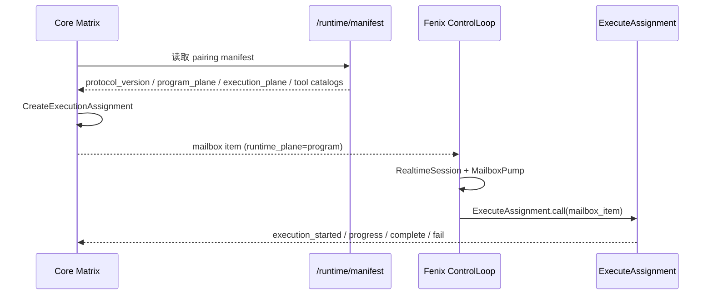

你当前位于 [运行时契约：注册、配对与控制循环](https://github.com/jasl/cybros.new/blob/main/10-yun-xing-shi-qi-yue-zhu-ce-pei-dui-yu-kong-zhi-xun-huan)，这一页只回答三件事：Fenix 如何通过 `/runtime/manifest` 暴露可配对的运行时能力，Core Matrix 如何把 `execution_assignment` 投递到程序平面 mailbox，以及控制循环如何把 mailbox item 变成可审计的开始、进度与结束报告。Sources: [docs/design/2026-04-01-agent-program-runtime-contract.md](https://github.com/jasl/cybros.new/blob/main/docs/design/2026-04-01-agent-program-runtime-contract.md#L38-L63), [agents/fenix/README.md](https://github.com/jasl/cybros.new/blob/main/agents/fenix/README.md#L90-L101)

## **边界分工：内核负责真相，Fenix 负责执行**

从契约角度看，**Core Matrix 仍然是持久化真相的所有者**：它保存 conversation、turn、workflow、runtime resource 生命周期与 mailbox 投递结果；而 **Fenix 是消费投影并产出执行意图与报告的程序运行时**，它负责 prompt 组装、上下文压缩、记忆策略、工具形状与总结生成。这个边界在最新契约设计里被明确收敛为“kernel sends projections，agent program returns intent and reports”。Sources: [docs/design/2026-04-01-agent-program-runtime-contract.md](https://github.com/jasl/cybros.new/blob/main/docs/design/2026-04-01-agent-program-runtime-contract.md#L38-L63), [docs/design/2026-04-01-agent-program-runtime-contract.md](https://github.com/jasl/cybros.new/blob/main/docs/design/2026-04-01-agent-program-runtime-contract.md#L120-L171)

| 归属 | 责任范围 | 代码/设计落点 |
|---|---|---|
| Core Matrix | durable conversation / turn / workflow 状态、mailbox delivery、runtime resource 真相、治理与审计 | `Kernel Responsibilities` 与 `Runtime Events And Reports` |
| Fenix | prompt assembly、context compaction、memory policy、tool shaping、subagent 策略、summary 生成 | `Agent Program Responsibilities` 与 Fenix 的 runtime services |
| 接口层 | sectioned envelope：`task`、`conversation_projection`、`capability_projection`、`provider_context`、`runtime_context`、`task_payload` | 新契约的统一外形 |

Sources: [docs/design/2026-04-01-agent-program-runtime-contract.md](https://github.com/jasl/cybros.new/blob/main/docs/design/2026-04-01-agent-program-runtime-contract.md#L120-L171), [docs/design/2026-04-01-agent-program-runtime-contract.md](https://github.com/jasl/cybros.new/blob/main/docs/design/2026-04-01-agent-program-runtime-contract.md#L233-L385)

## **注册与配对：manifest 是能力广告，不是执行入口**

Fenix 的注册/配对入口是 **manifest 发布**，不是直接执行调用。路由只暴露 `GET /runtime/manifest`，控制器也只是把 `Fenix::Runtime::PairingManifest.call(base_url:)` 原样渲染为 JSON；README 进一步明确：manifest 用于 registration 和 capability advertisement，而不是 direct execution dispatch。Sources: [agents/fenix/config/routes.rb](https://github.com/jasl/cybros.new/blob/main/agents/fenix/config/routes.rb#L10-L12), [agents/fenix/app/controllers/runtime/manifests_controller.rb](https://github.com/jasl/cybros.new/blob/main/agents/fenix/app/controllers/runtime/manifests_controller.rb#L1-L7), [agents/fenix/README.md](https://github.com/jasl/cybros.new/blob/main/agents/fenix/README.md#L90-L101)

| 表面 | 作用 | 可验证实现 |
|---|---|---|
| `/runtime/manifest` | 发布配对信息与能力目录 | `Runtime::ManifestsController#show` |
| `PairingManifest` | 汇总协议版本、程序平面、执行平面、工具目录、profile catalog | `Fenix::Runtime::PairingManifest.call` |
| `program_plane` | 给 mailbox-first 程序执行使用的能力面 | `runtime_plane = "program"` |
| `execution_plane` | 给底层执行运行时使用的能力面 | `runtime_plane = "execution"` |

Sources: [agents/fenix/app/services/fenix/runtime/pairing_manifest.rb](https://github.com/jasl/cybros.new/blob/main/agents/fenix/app/services/fenix/runtime/pairing_manifest.rb#L184-L255), [agents/fenix/app/services/fenix/runtime/pairing_manifest.rb](https://github.com/jasl/cybros.new/blob/main/agents/fenix/app/services/fenix/runtime/pairing_manifest.rb#L262-L345)

上图只描述两条已验证路径：其一是 manifest 发布与能力广告，其二是 mailbox-first 的控制循环与报告回传；它不代表任何直接回调执行模型。Sources: [agents/fenix/README.md](https://github.com/jasl/cybros.new/blob/main/agents/fenix/README.md#L90-L101), [agents/fenix/app/services/fenix/runtime/control_loop.rb](https://github.com/jasl/cybros.new/blob/main/agents/fenix/app/services/fenix/runtime/control_loop.rb#L30-L46), [agents/fenix/app/services/fenix/runtime/control_worker.rb](https://github.com/jasl/cybros.new/blob/main/agents/fenix/app/services/fenix/runtime/control_worker.rb#L31-L46)

## **控制循环：realtime push + poll fallback 的双通道**

Fenix 的控制循环由 `ControlWorker` 驱动，它会反复调用 `ControlLoop`；而 `ControlLoop` 的核心逻辑是先建立 realtime session，再回收 pending mailbox work，最后把 `realtime` / `poll` / `realtime+poll` 归一成一次迭代结果。换句话说，**realtime 是首选，poll 是兜底**，并且 worker 在长生命周期模式下会持续运行、清理本地 process handle，但不会把本地句柄当成内核真相。Sources: [agents/fenix/app/services/fenix/runtime/control_loop.rb](https://github.com/jasl/cybros.new/blob/main/agents/fenix/app/services/fenix/runtime/control_loop.rb#L10-L46), [agents/fenix/app/services/fenix/runtime/control_loop.rb](https://github.com/jasl/cybros.new/blob/main/agents/fenix/app/services/fenix/runtime/control_loop.rb#L51-L106), [agents/fenix/app/services/fenix/runtime/control_worker.rb](https://github.com/jasl/cybros.new/blob/main/agents/fenix/app/services/fenix/runtime/control_worker.rb#L31-L46), [agents/fenix/app/services/fenix/runtime/control_worker.rb](https://github.com/jasl/cybros.new/blob/main/agents/fenix/app/services/fenix/runtime/control_worker.rb#L68-L84)

| 组件 | 责任 | 关键行为 |
|---|---|---|
| `ControlWorker` | 长循环调度器 | 迭代执行、空闲睡眠、失败睡眠、清理本地资源 |
| `ControlLoop` | 单次控制轮次 | 建立 realtime session、合并 realtime 与 poll 结果 |
| `RealtimeSession` | 实时订阅/消费 | 接收 mailbox item 并交给执行器 |
| `MailboxPump` | 补偿性拉取 | 回收 pending mailbox work |
| `MailboxWorker` / `ExecuteAssignment` | 具体执行 | 执行 program 平面 mailbox item 并上报结果 |

Sources: [agents/fenix/app/services/fenix/runtime/control_loop.rb](https://github.com/jasl/cybros.new/blob/main/agents/fenix/app/services/fenix/runtime/control_loop.rb#L10-L106), [agents/fenix/app/services/fenix/runtime/control_worker.rb](https://github.com/jasl/cybros.new/blob/main/agents/fenix/app/services/fenix/runtime/control_worker.rb#L90-L116), [agents/fenix/README.md](https://github.com/jasl/cybros.new/blob/main/agents/fenix/README.md#L103-L132)

## **执行赋形：从 mailbox item 到 report 的最短路径**

`AgentControl::CreateExecutionAssignment` 负责把 kernel 侧的任务上下文化成 mailbox item：它固定 `item_type = execution_assignment`、`runtime_plane = program`，并将 `task`、`conversation_projection`、`capability_projection`、`provider_context`、`runtime_context`、`task_payload` 作为标准 envelope 写入 payload；其中 `runtime_context` 会附带 `logical_work_id`、`attempt_no` 和 `agent_program_version_id`，确保执行侧拿到的是可追踪的运行时边界信息，而不是任意拼接的上下文。Sources: [core_matrix/app/services/agent_control/create_execution_assignment.rb](https://github.com/jasl/cybros.new/blob/main/core_matrix/app/services/agent_control/create_execution_assignment.rb#L31-L79), [core_matrix/app/services/agent_control/create_execution_assignment.rb](https://github.com/jasl/cybros.new/blob/main/core_matrix/app/services/agent_control/create_execution_assignment.rb#L86-L124)

`AgentControlMailboxItem` 也把这条边界写死了：`runtime_plane` 只能是 `program` 或 `execution`，而 `execution_assignment` 只有在 `program` 平面下才成立；若目标 runtime 与平面不匹配，模型层会拒绝保存，Fenix 侧的 `ExecuteAssignment` 也会在收到非 `program` 平面工作时直接返回 `unsupported_runtime_plane`。这说明当前闭环不是“谁都能执行”，而是“**先用平面约束，再进入执行循环**”。Sources: [core_matrix/app/models/agent_control_mailbox_item.rb](https://github.com/jasl/cybros.new/blob/main/core_matrix/app/models/agent_control_mailbox_item.rb#L4-L50), [core_matrix/app/models/agent_control_mailbox_item.rb](https://github.com/jasl/cybros.new/blob/main/core_matrix/app/models/agent_control_mailbox_item.rb#L153-L164), [agents/fenix/app/services/fenix/runtime/execute_assignment.rb](https://github.com/jasl/cybros.new/blob/main/agents/fenix/app/services/fenix/runtime/execute_assignment.rb#L26-L55), [agents/fenix/app/services/fenix/runtime/execute_assignment.rb](https://github.com/jasl/cybros.new/blob/main/agents/fenix/app/services/fenix/runtime/execute_assignment.rb#L262-L275)

在 Fenix 侧，`ExecuteAssignment` 的执行顺序也是明确的：先建立 execution context，再做 `PrepareTurn` 和 `CompactContext`，随后按 `task_payload` 决定是 `raise_error`、`skill_flow` 还是 deterministic tool flow；在工具流里，它会创建 tool invocation / command run / process run，投递 progress report，最后产出 complete 或 fail report。也就是说，控制循环的实际“工作单元”不是整轮对话，而是 **一个带 envelope 的 mailbox item**。Sources: [agents/fenix/app/services/fenix/runtime/execute_assignment.rb](https://github.com/jasl/cybros.new/blob/main/agents/fenix/app/services/fenix/runtime/execute_assignment.rb#L16-L55), [agents/fenix/app/services/fenix/runtime/execute_assignment.rb](https://github.com/jasl/cybros.new/blob/main/agents/fenix/app/services/fenix/runtime/execute_assignment.rb#L89-L159), [agents/fenix/app/services/fenix/runtime/execute_assignment.rb](https://github.com/jasl/cybros.new/blob/main/agents/fenix/app/services/fenix/runtime/execute_assignment.rb#L162-L200), [agents/fenix/app/services/fenix/runtime/execute_assignment.rb](https://github.com/jasl/cybros.new/blob/main/agents/fenix/app/services/fenix/runtime/execute_assignment.rb#L216-L355)

## **控制语义：生命周期状态与控制动作必须分离**

契约设计把 turn 生命周期与 turn control 拆成两条线：生命周期描述 work 是 running、paused、interrupted 还是 completed；控制动作描述 operator 现在要 steer、pause、resume、retry 还是 stop。`steer` 不是状态，而是对活跃或可恢复 turn 的输入修正；而 `interrupted` 的工作不能再原地 steering，必须进入新的 turn。Sources: [docs/design/2026-04-01-agent-program-runtime-contract.md](https://github.com/jasl/cybros.new/blob/main/docs/design/2026-04-01-agent-program-runtime-contract.md#L187-L248)

同一份设计还把新的报文结构收敛成 sectioned envelope，并明确 `runtime_events` 与 `summary_artifacts` 应成为标准输出：前者承载可还原的 typed 事实，后者承载人类可读摘要。对 Fenix 来说，这意味着它只需要消费 `capability_projection`、`provider_context` 与 `runtime_context`，而不应该继续依赖旧式的 `agent_context` 大杂烩。Sources: [docs/design/2026-04-01-agent-program-runtime-contract.md](https://github.com/jasl/cybros.new/blob/main/docs/design/2026-04-01-agent-program-runtime-contract.md#L233-L385), [docs/design/2026-04-01-agent-program-runtime-contract.md](https://github.com/jasl/cybros.new/blob/main/docs/design/2026-04-01-agent-program-runtime-contract.md#L586-L739), [docs/design/2026-04-01-agent-program-runtime-contract.md](https://github.com/jasl/cybros.new/blob/main/docs/design/2026-04-01-agent-program-runtime-contract.md#L741-L766)

## **建议阅读顺序**

如果你要把这条链路和周边系统一起串起来，建议下一步先读 [运行时模型：控制平面、Mailbox 与协作机制](https://github.com/jasl/cybros.new/blob/main/7-yun-xing-shi-mo-xing-kong-zhi-ping-mian-mailbox-yu-xie-zuo-ji-zhi) 来建立 Kernel 侧投递与协作的总图，再读 [工具能力：网页、浏览器与长生命周期进程](https://github.com/jasl/cybros.new/blob/main/11-gong-ju-neng-li-wang-ye-liu-lan-qi-yu-chang-sheng-ming-zhou-qi-jin-cheng) 看 Fenix 的工具面如何嵌入同一 runtime contract，最后用 [接受性测试与手工回归流程](https://github.com/jasl/cybros.new/blob/main/12-jie-shou-xing-ce-shi-yu-shou-gong-hui-gui-liu-cheng) 验证这条闭环在真实流程里是否保持一致。Sources: [docs/design/2026-04-01-agent-program-runtime-contract.md](https://github.com/jasl/cybros.new/blob/main/docs/design/2026-04-01-agent-program-runtime-contract.md#L741-L797), [agents/fenix/README.md](https://github.com/jasl/cybros.new/blob/main/agents/fenix/README.md#L141-L220)