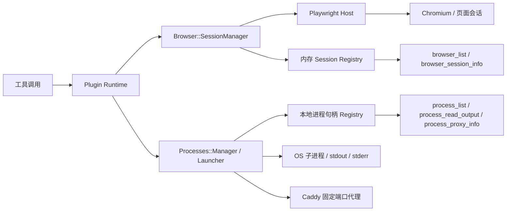

你当前位于目录中的 [工具能力：网页、浏览器与长生命周期进程](https://github.com/jasl/cybros.new/blob/main/11-gong-ju-neng-li-wang-ye-liu-lan-qi-yu-chang-sheng-ming-zhou-qi-jin-cheng)。这一页只处理两组运行时能力：一组是 `browser_session`，对应 Playwright/Chromium 驱动的浏览器会话；另一组是 `process_run`，对应带输出、代理和收尾语义的长生命周期进程对象。两者都不是“网页抓取”的同义词，而是 Fenix 里可被直接发现、枚举和收敛的操作对象。Sources: [docs/finished-plans/fenix/2026-03-31-fenix-operator-surface.md](https://github.com/jasl/cybros.new/blob/main/docs/finished-plans/fenix/2026-03-31-fenix-operator-surface.md#L5-L9), [docs/finished-plans/fenix/2026-03-31-fenix-operator-surface-design.md](https://github.com/jasl/cybros.new/blob/main/docs/finished-plans/fenix/2026-03-31-fenix-operator-surface-design.md#L160-L204), [docs/finished-plans/fenix/2026-03-30-fenix-runtime-appliance-design.md](https://github.com/jasl/cybros.new/blob/main/docs/finished-plans/fenix/2026-03-30-fenix-runtime-appliance-design.md#L338-L360)

## 为什么要把网页、浏览器与进程分开

从架构上看，`web_fetch`/`web_search` 代表的是面向内容的请求-响应能力；浏览器能力代表的是带状态的交互式页面会话；长生命周期进程能力代表的是可持续运行、可读取尾部输出、可通过代理暴露服务的进程对象。设计文档明确要求浏览器自动化不要隐藏在 `web_fetch` 之后，而长生命周期服务应走固定端口代理，而不是附着在短命命令执行上。Sources: [docs/finished-plans/fenix/2026-03-30-fenix-runtime-appliance-design.md](https://github.com/jasl/cybros.new/blob/main/docs/finished-plans/fenix/2026-03-30-fenix-runtime-appliance-design.md#L330-L360), [docs/finished-plans/fenix/2026-03-30-fenix-runtime-appliance-design.md](https://github.com/jasl/cybros.new/blob/main/docs/finished-plans/fenix/2026-03-30-fenix-runtime-appliance-design.md#L380-L390), [docs/finished-plans/fenix/2026-03-31-fenix-operator-surface-design.md](https://github.com/jasl/cybros.new/blob/main/docs/finished-plans/fenix/2026-03-31-fenix-operator-surface-design.md#L183-L204)

下面这张图只表达本页涉及的交互边界：工具调用进入插件 runtime，再落到会话管理器或进程管理器；这两个管理器维护的是运行时本地投影，不是核心事实源。Sources: [agents/fenix/app/services/fenix/runtime/tool_executors/browser.rb](https://github.com/jasl/cybros.new/blob/main/agents/fenix/app/services/fenix/runtime/tool_executors/browser.rb#L5-L11), [agents/fenix/app/services/fenix/runtime/tool_executors/process.rb](https://github.com/jasl/cybros.new/blob/main/agents/fenix/app/services/fenix/runtime/tool_executors/process.rb#L8-L28), [agents/fenix/app/services/fenix/browser/session_manager.rb](https://github.com/jasl/cybros.new/blob/main/agents/fenix/app/services/fenix/browser/session_manager.rb#L53-L104), [agents/fenix/app/services/fenix/processes/manager.rb](https://github.com/jasl/cybros.new/blob/main/agents/fenix/app/services/fenix/processes/manager.rb#L4-L27)

这张图的关键点是：浏览器与进程都保留了“可枚举、可查询、可关闭”的对象模型，但它们的外部引擎不同，浏览器依赖 Playwright host，进程依赖本地子进程与代理注册表。Sources: [agents/fenix/app/services/fenix/browser/session_manager.rb](https://github.com/jasl/cybros.new/blob/main/agents/fenix/app/services/fenix/browser/session_manager.rb#L11-L49), [agents/fenix/app/services/fenix/browser/session_manager.rb](https://github.com/jasl/cybros.new/blob/main/agents/fenix/app/services/fenix/browser/session_manager.rb#L121-L198), [agents/fenix/app/services/fenix/processes/manager.rb](https://github.com/jasl/cybros.new/blob/main/agents/fenix/app/services/fenix/processes/manager.rb#L29-L77), [agents/fenix/app/services/fenix/processes/manager.rb](https://github.com/jasl/cybros.new/blob/main/agents/fenix/app/services/fenix/processes/manager.rb#L123-L172)

## 浏览器能力：以会话为中心，而不是以单次页面抓取为中心

浏览器面向的是 `browser_session` 资源。`SessionManager` 先通过 `Open3.popen3` 启动 Node 侧 host script，再把会话登记到内存 registry；随后通过 `open`、`navigate`、`get_content`、`screenshot`、`close` 和 `list/info` 这一组动作来管理会话生命周期。`browser_list` 与 `browser_session_info` 的加入，目标就是让“当前开了哪些浏览器会话、会话现在在哪个 URL”成为可直接发现的信息。Sources: [agents/fenix/app/services/fenix/browser/session_manager.rb](https://github.com/jasl/cybros.new/blob/main/agents/fenix/app/services/fenix/browser/session_manager.rb#L11-L49), [agents/fenix/app/services/fenix/browser/session_manager.rb](https://github.com/jasl/cybros.new/blob/main/agents/fenix/app/services/fenix/browser/session_manager.rb#L53-L104), [agents/fenix/app/services/fenix/browser/session_manager.rb](https://github.com/jasl/cybros.new/blob/main/agents/fenix/app/services/fenix/browser/session_manager.rb#L121-L198), [docs/finished-plans/fenix/2026-03-31-fenix-operator-surface-design.md](https://github.com/jasl/cybros.new/blob/main/docs/finished-plans/fenix/2026-03-31-fenix-operator-surface-design.md#L162-L182)

浏览器插件把这些动作显式映射到工具名：`browser_open`、`browser_navigate`、`browser_get_content`、`browser_screenshot`、`browser_close`、`browser_list`、`browser_session_info`。插件元数据同时标记了 `operator_group: browser_session`、`resource_identity_kind: browser_session`，并把 `browser_open`/`browser_navigate`/`browser_close` 标为状态变更，把读取类动作保留为只读。Sources: [agents/fenix/app/services/fenix/plugins/system/browser/plugin.yml](https://github.com/jasl/cybros.new/blob/main/agents/fenix/app/services/fenix/plugins/system/browser/plugin.yml#L1-L166), [agents/fenix/app/services/fenix/plugins/system/browser/runtime.rb](https://github.com/jasl/cybros.new/blob/main/agents/fenix/app/services/fenix/plugins/system/browser/runtime.rb#L17-L64)

| 浏览器工具 | 角色 | 是否变更状态 | 资源标识 | 说明 |
|---|---|---:|---|---|
| `browser_open` | 打开会话 | 是 | `browser_session` | 创建 Playwright 会话并返回 `browser_session_id` |
| `browser_navigate` | 页面跳转 | 是 | `browser_session` | 对现有会话导航到新 URL |
| `browser_get_content` | 读取内容 | 否 | `browser_session` | 获取当前页面内容 |
| `browser_screenshot` | 截图 | 否 | `browser_session` | 支持 `full_page` 参数 |
| `browser_list` | 枚举会话 | 否 | `browser_session` | 列出当前可见会话 |
| `browser_session_info` | 读取会话摘要 | 否 | `browser_session` | 读取单个会话快照 |
| `browser_close` | 关闭会话 | 是 | `browser_session` | 关闭并从 registry 移除 |

这些工具的共同点是：它们不把浏览器状态藏在 prompt 里，而是把状态放在 runtime-local registry 中，然后通过显式的查询工具暴露给操作者。Sources: [agents/fenix/app/services/fenix/browser/session_manager.rb](https://github.com/jasl/cybros.new/blob/main/agents/fenix/app/services/fenix/browser/session_manager.rb#L53-L104), [docs/finished-plans/fenix/2026-03-31-fenix-operator-surface-design.md](https://github.com/jasl/cybros.new/blob/main/docs/finished-plans/fenix/2026-03-31-fenix-operator-surface-design.md#L227-L242)

## 长生命周期进程能力：以运行中服务和输出尾部为中心

进程面向的是 `process_run` 资源。`Processes::Manager` 维护的是 `LocalHandle` 投影，记录了标准输入输出、等待线程、输出字节数、尾部内容、终止状态与代理信息；`process_exec` 负责启动子进程并接入监控线程，`process_list` 负责枚举，`process_read_output` 负责读尾部，`process_proxy_info` 负责返回代理路径与目标 URL。这个模型的重点不是“再执行一次命令”，而是“把已运行的服务当成可以继续交互的对象”。Sources: [agents/fenix/app/services/fenix/processes/manager.rb](https://github.com/jasl/cybros.new/blob/main/agents/fenix/app/services/fenix/processes/manager.rb#L4-L27), [agents/fenix/app/services/fenix/processes/manager.rb](https://github.com/jasl/cybros.new/blob/main/agents/fenix/app/services/fenix/processes/manager.rb#L29-L77), [agents/fenix/app/services/fenix/processes/manager.rb](https://github.com/jasl/cybros.new/blob/main/agents/fenix/app/services/fenix/processes/manager.rb#L106-L172), [agents/fenix/app/services/fenix/processes/manager.rb](https://github.com/jasl/cybros.new/blob/main/agents/fenix/app/services/fenix/processes/manager.rb#L209-L305)

`Process::Runtime` 只接受四个工具名：`process_exec`、`process_list`、`process_proxy_info` 和 `process_read_output`。`process_exec` 允许把命令行和代理端口交给 launcher；`process_proxy_info` 和 `process_read_output` 都先检查当前 agent task 是否拥有该 `process_run`，然后再返回只读信息。插件清单则把 `process_exec` 标成 `streaming_support: true`，并把 `process_proxy_info` 明确绑定到 `process_run` 资源。Sources: [agents/fenix/app/services/fenix/plugins/system/process/runtime.rb](https://github.com/jasl/cybros.new/blob/main/agents/fenix/app/services/fenix/plugins/system/process/runtime.rb#L12-L47), [agents/fenix/app/services/fenix/plugins/system/process/plugin.yml](https://github.com/jasl/cybros.new/blob/main/agents/fenix/app/services/fenix/plugins/system/process/plugin.yml#L1-L112), [agents/fenix/app/services/fenix/runtime/tool_executors/process.rb](https://github.com/jasl/cybros.new/blob/main/agents/fenix/app/services/fenix/runtime/tool_executors/process.rb#L8-L28)

| 维度 | 浏览器会话 `browser_session` | 长生命周期进程 `process_run` |
|---|---|---|
| 核心对象 | 页面会话 | 运行中服务/子进程 |
| 管理器 | `Browser::SessionManager` | `Processes::Manager` |
| 外部引擎 | Playwright + Chromium | OS 子进程 + 可选 Caddy 代理 |
| 枚举工具 | `browser_list` | `process_list` |
| 详情工具 | `browser_session_info` | `process_read_output` / `process_proxy_info` |
| 关闭语义 | `browser_close` | 进程终止与收尾报告 |
| 状态来源 | runtime-local registry | runtime-local registry |

这个对照表的含义很简单：浏览器适合“交互式页面状态”，进程适合“持续运行服务状态”，二者都保留可查询的本地投影，但都不替代 Core Matrix 的持久事实。Sources: [docs/finished-plans/fenix/2026-03-31-fenix-operator-surface-design.md](https://github.com/jasl/cybros.new/blob/main/docs/finished-plans/fenix/2026-03-31-fenix-operator-surface-design.md#L227-L242), [agents/fenix/app/services/fenix/browser/session_manager.rb](https://github.com/jasl/cybros.new/blob/main/agents/fenix/app/services/fenix/browser/session_manager.rb#L53-L104), [agents/fenix/app/services/fenix/processes/manager.rb](https://github.com/jasl/cybros.new/blob/main/agents/fenix/app/services/fenix/processes/manager.rb#L4-L27)

## 你应该如何继续阅读

如果你想把这页的能力放回整体运行时语境，下一步建议先看 [运行时契约：注册、配对与控制循环](https://github.com/jasl/cybros.new/blob/main/10-yun-xing-shi-qi-yue-zhu-ce-pei-dui-yu-kong-zhi-xun-huan)，再看 [接受性测试与手工回归流程](https://github.com/jasl/cybros.new/blob/main/12-jie-shou-xing-ce-shi-yu-shou-gong-hui-gui-liu-cheng)。前者会帮助你理解这些工具是如何挂到执行循环上的，后者会把浏览器和长生命周期进程能力放进验证视角。Sources: [docs/finished-plans/fenix/2026-03-31-fenix-operator-surface.md](https://github.com/jasl/cybros.new/blob/main/docs/finished-plans/fenix/2026-03-31-fenix-operator-surface.md#L13-L39), [docs/finished-plans/fenix/2026-03-30-fenix-runtime-appliance.md](https://github.com/jasl/cybros.new/blob/main/docs/finished-plans/fenix/2026-03-30-fenix-runtime-appliance.md#L353-L410)