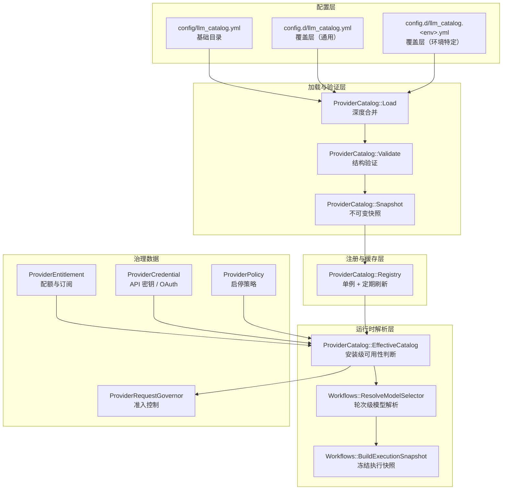
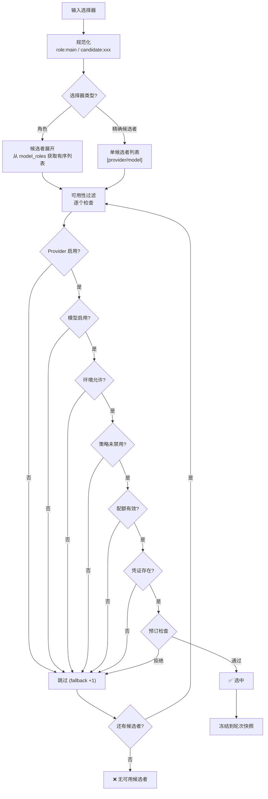

Core Matrix 的 LLM Provider 目录是一个 **配置驱动、安装级作用域、带有序回退机制** 的模型选择系统。它将"哪些 LLM 可用"（静态目录）、"当前安装能用哪些"（运行时凭证与配额）和"选哪个模型"（角色解析管线）三层关注点清晰分离，使得同一个 Core Matrix 实例既能在开发环境用 Mock Provider 快速验证，也能在产线环境通过 Codex Subscription + OpenRouter 双通道实现成本最优的模型调度。

Sources: [llm_catalog.yml](https://github.com/jasl/cybros.new/blob/main/core_matrix/config/llm_catalog.yml#L1-L495)

## 架构全景

Provider 目录系统由以下核心层次组成：



**配置层**负责声明"世界中有哪些 Provider 和模型"；**加载与验证层**将 YAML 解析为不可变的内存快照；**注册与缓存层**提供进程级单例访问并定期检查修订版本；**运行时解析层**结合安装级的凭证、配额和策略数据，将抽象的"角色选择器"解析为具体的 `provider_handle/model_ref`，最终冻结到执行快照中。

Sources: [load.rb](https://github.com/jasl/cybros.new/blob/main/core_matrix/app/services/provider_catalog/load.rb#L1-L67), [registry.rb](https://github.com/jasl/cybros.new/blob/main/core_matrix/app/services/provider_catalog/registry.rb#L1-L117), [effective_catalog.rb](https://github.com/jasl/cybros.new/blob/main/core_matrix/app/services/provider_catalog/effective_catalog.rb#L1-L381), [resolve_model_selector.rb](https://github.com/jasl/cybros.new/blob/main/core_matrix/app/services/workflows/resolve_model_selector.rb#L1-L56)

## 目录配置结构

### Provider 定义

每个 Provider 在 `llm_catalog.yml` 的 `providers` 键下定义，是一个完整的 LLM 服务端点描述。以 `openrouter` 为例：

| 字段 | 含义 | 示例值 |
|------|------|--------|
| `display_name` | UI 展示名称 | `OpenRouter` |
| `enabled` | 全局开关 | `true` |
| `environments` | 允许的 Rails 环境 | `[development, test, production]` |
| `adapter_key` | HTTP 适配器标识 | `openrouter_chat_completions` |
| `base_url` | API 端点基础 URL | `https://openrouter.ai/api/v1` |
| `wire_api` | 线路协议 | `chat_completions` 或 `responses` |
| `transport` | 传输协议 | `https` |
| `responses_path` | 请求路径 | `/chat/completions` |
| `requires_credential` | 是否需要凭证 | `true` |
| `credential_kind` | 凭证类型 | `api_key`、`oauth_codex`、`none` |
| `admission_control` | 准入控制参数 | `max_concurrent_requests: 2` |

Sources: [llm_catalog.yml](https://github.com/jasl/cybros.new/blob/main/core_matrix/config/llm_catalog.yml#L153-L175)

### 模型定义

每个 Provider 下可声明多个模型，每个模型是一个独立的候选者：

| 字段 | 含义 | 示例值 |
|------|------|--------|
| `api_model` | 发往 API 的模型标识 | `openai/gpt-5.4` |
| `tokenizer_hint` | Token 估算器标识 | `o200k_base` |
| `context_window_tokens` | 上下文窗口大小 | `1000000` |
| `max_output_tokens` | 最大输出 Token 数 | `128000` |
| `context_soft_limit_ratio` | 软限制比率 | `0.9` |
| `request_defaults` | 默认请求参数 | `reasoning_effort: high` |
| `capabilities` | 能力声明 | `tool_calls: true` |

`api_model` 是实际发送给 LLM 服务的模型标识，与目录内部的模型引用键（`model_ref`）可以不同。例如 `openrouter` 下的 `openai-gpt-5.4` 模型，其 `api_model` 是 `openai/gpt-5.4`——这是 OpenRouter 要求的命名规范。

Sources: [llm_catalog.yml](https://github.com/jasl/cybros.new/blob/main/core_matrix/config/llm_catalog.yml#L175-L215)

### 当前预装 Provider 总览

| Provider Handle | 显示名称 | 线路协议 | 凭证类型 | 用途 |
|-----------------|----------|----------|----------|------|
| `codex_subscription` | Codex Subscription | `responses` | `oauth_codex` | 捆绑订阅通道 |
| `openai` | OpenAI | `responses` | `api_key` | OpenAI 直连 |
| `openrouter` | OpenRouter | `chat_completions` | `api_key` | 多模型聚合路由 |
| `dev` | Development Mock LLM | `chat_completions` | `none` | 开发/测试 Mock |
| `local` | Local OpenAI-Compatible | `chat_completions` | `none` | 本地模型（默认禁用） |

Sources: [llm_catalog.yml](https://github.com/jasl/cybros.new/blob/main/core_matrix/config/llm_catalog.yml#L1-L480)

### wire_api：两种线路协议

系统支持两种 LLM 线路协议，直接影响请求构造和响应解析：

- **`responses`**：对应 OpenAI Responses API（`POST /responses`），使用 `input` 字段传入消息，支持 `reasoning_effort` 等高级参数。`codex_subscription` 和 `openai` 使用此协议。
- **`chat_completions`**：对应 OpenAI Chat Completions API（`POST /chat/completions`），使用 `messages` 字段传入消息，支持 `temperature`、`top_p` 等参数。`openrouter`、`dev` 和 `local` 使用此协议。

两种协议对应的 `request_defaults` 允许的参数集合不同，由 `ProviderRequestSettingsSchema` 强制约束。例如 `responses` 协议允许 `reasoning_effort`（string 类型），而 `chat_completions` 不允许。

Sources: [provider_request_settings_schema.rb](https://github.com/jasl/cybros.new/blob/main/core_matrix/app/models/provider_request_settings_schema.rb#L4-L22), [dispatch_request.rb](https://github.com/jasl/cybros.new/blob/main/core_matrix/app/services/provider_execution/dispatch_request.rb#L158-L194)

## 覆盖层与合并策略

Core Matrix 采用**基础目录 + 覆盖层**的配置模式。基础目录 `config/llm_catalog.yml` 随代码发布，覆盖层放在 `config.d/` 目录下：

```
config/llm_catalog.yml              ← 基础目录（版本控制）
config.d/llm_catalog.yml            ← 通用覆盖（可选）
config.d/llm_catalog.production.yml ← 环境特定覆盖（可选）
```

合并规则：
- **Hash 类型**：深度递归合并，覆盖层的值优先
- **数组类型**：覆盖层整体替换基础值（不逐项合并）
- **加载顺序**：先基础 → 再通用覆盖 → 最后环境覆盖

这意味着你可以在 `config.d/llm_catalog.yml` 中禁用某个预装模型、修改某个模型的 `request_defaults`，甚至添加全新的 Provider，而无需修改版本控制中的基础文件。密钥不应放在 YAML 中——它们通过数据库中的 `ProviderCredential` 记录管理。

Sources: [load.rb](https://github.com/jasl/cybros.new/blob/main/core_matrix/app/services/provider_catalog/load.rb#L19-L64), [llm_catalog.yml.sample](https://github.com/jasl/cybros.new/blob/main/core_matrix/config.d/llm_catalog.yml.sample#L1-L114)

## 模型角色与选择器

### model_roles 配置

`model_roles` 将抽象的"角色"映射到有序的候选者列表：

```yaml
model_roles:
  main:
    - codex_subscription/gpt-5.4
    - openai/gpt-5.4
    - openrouter/openai-gpt-5.4
  planner:
    - openai/gpt-5.4
  coder:
    - codex_subscription/gpt-5.4
    - codex_subscription/gpt-5.3-codex
    - openrouter/openai-gpt-5.3-codex
  mock:
    - dev/mock-model
```

每个条目格式为 `provider_handle/model_ref`。**候选者顺序即为优先级顺序**——系统总是尝试第一个，失败后才尝试下一个。这种设计让订阅支持的通道优先被使用（如 `codex_subscription`），当配额耗尽时自动降级到按量计费的通道（如 `openrouter`）。

Sources: [llm_catalog.yml](https://github.com/jasl/cybros.new/blob/main/core_matrix/config/llm_catalog.yml#L481-L495)

### 选择器的两种形态

所有执行时模型请求最终规范化为两种内部选择器：

| 选择器形态 | 格式 | 含义 |
|------------|------|------|
| **角色选择器** | `role:<name>` | 按角色解析，支持有序回退 |
| **候选者选择器** | `candidate:<provider/model>` | 精确指定，不回退 |

规范化规则：裸角色名（如 `main`）→ `role:main`；含 `/` 的路径（如 `openai/gpt-5.4`）→ `candidate:openai/gpt-5.4`；空值默认 → `role:main`。

Sources: [effective_catalog.rb](https://github.com/jasl/cybros.new/blob/main/core_matrix/app/services/provider_catalog/effective_catalog.rb#L160-L167)

### 会话级选择模式

会话（`Conversation`）支持两种交互式选择模式：

- **`auto`**：自动模式，通过 `role:main` 解析，这是默认值
- **`explicit_candidate`**：精确模式，用户在 UI 中明确选择一个 `provider_handle/model_ref`

当会话处于 `explicit_candidate` 模式时，`ResolveModelSelector` 直接使用该精确候选者，跳过角色回退逻辑。如果该精确候选者不可用（缺凭证、配额耗尽等），执行立即失败而非尝试其他模型。

Sources: [conversation.rb](https://github.com/jasl/cybros.new/blob/main/core_matrix/app/models/conversation.rb#L46-L51), [resolve_model_selector.rb](https://github.com/jasl/cybros.new/blob/main/core_matrix/app/services/workflows/resolve_model_selector.rb#L39-L44)

## 解析管线详解

模型解析是一个确定性的三阶段管线，从抽象选择器到具体执行上下文：



**第一阶段——候选者展开**：角色选择器展开为有序候选者列表，精确候选者展开为单元素列表。未知角色立即报错。

**第二阶段——可用性过滤**：按列表顺序逐个检查六项条件：Provider 是否启用、模型是否启用、当前环境是否在允许列表中、安装级策略是否未禁用该 Provider、是否存在有效的配额（`ProviderEntitlement`）、是否持有所需凭证（`ProviderCredential`）。

**第三阶段——预订检查**：即使通过了可用性过滤，系统还会检查 `entitlement.metadata["reservation_denied"]` 是否为 `true`。这处理了"配额窗口已耗尽但记录尚未更新"的竞态场景。对于角色选择器，预订失败后继续尝试下一个候选者；对于精确候选者选择器，预订失败立即终止。

Sources: [effective_catalog.rb](https://github.com/jasl/cybros.new/blob/main/core_matrix/app/services/provider_catalog/effective_catalog.rb#L129-L304), [resolve_model_selector.rb](https://github.com/jasl/cybros.new/blob/main/core_matrix/app/services/workflows/resolve_model_selector.rb#L13-L35)

## 不可变性保障：快照与冻结

### ProviderCatalog::Snapshot

加载管线最终产出的是一个 `Snapshot` 实例——**深度冻结的不可变对象**。所有 Hash 和 Array 都被递归 `freeze`，确保在整个进程生命周期中目录数据不会被意外修改。快照还计算一个 SHA-256 修订哈希，用于跨进程的版本一致性检查。

Sources: [snapshot.rb](https://github.com/jasl/cybros.new/blob/main/core_matrix/app/services/provider_catalog/snapshot.rb#L1-L99)

### Registry 的进程级缓存

`ProviderCatalog::Registry` 是进程级单例，内部持有当前快照并每 5 秒检查一次共享修订（存储在 Rails.cache 中）。如果检测到修订变化（例如另一个进程重新加载了目录），当前进程会在下次访问时自动刷新。这种设计确保了多进程部署（如 Puma 多 worker）下的目录一致性，同时避免了每次请求都重新解析 YAML 的性能开销。

Sources: [registry.rb](https://github.com/jasl/cybros.new/blob/main/core_matrix/app/services/provider_catalog/registry.rb#L1-L117)

### 执行快照冻结

当模型选择完成后，解析结果被冻结到 `Turn` 的 `resolved_model_selection_snapshot` 字段中，包含：

| 快照字段 | 含义 |
|----------|------|
| `selector_source` | 选择来源（`conversation`、`slot` 等） |
| `normalized_selector` | 规范化后的选择器 |
| `resolved_role_name` | 解析到的角色名（精确候选者时为 nil） |
| `resolved_provider_handle` | 最终选中的 Provider |
| `resolved_model_ref` | 最终选中的模型 |
| `resolution_reason` | 解析原因（`role_primary`、`role_fallback_after_reservation` 等） |
| `fallback_count` | 回退次数 |
| `entitlement_key` | 使用的配额键 |

一旦写入，这个快照不再变化——即使后续目录配置被修改，历史执行记录中的模型选择也保持准确。这一设计直接回应了"审计追踪"需求：你可以精确知道每次执行用了哪个 Provider 的哪个模型，以及是否经历了回退。

Sources: [resolve_model_selector.rb](https://github.com/jasl/cybros.new/blob/main/core_matrix/app/services/workflows/resolve_model_selector.rb#L24-L34), [turn.rb](https://github.com/jasl/cybros.new/blob/main/core_matrix/app/models/turn.rb#L64-L78)

## 治理三件套：凭证、配额与策略

模型选择不是纯粹的配置问题——它还涉及安装级的运行时治理数据。三张数据表分别对应三个独立的关注点：

### ProviderCredential（凭证）

存储安装级 API 密钥或 OAuth 令牌。`secret` 字段使用 Rails Active Record Encryption 加密存储。每个安装对同一 Provider 只需一种凭证（由 `credential_kind` 区分，唯一约束为 `[installation_id, provider_handle, credential_kind]`）。

Sources: [provider_credential.rb](https://github.com/jasl/cybros.new/blob/main/core_matrix/app/models/provider_credential.rb#L1-L18), [create_provider_credentials.rb](https://github.com/jasl/cybros.new/blob/main/core_matrix/db/migrate/20260324090013_create_provider_credentials.rb#L1-L17)

### ProviderEntitlement（配额）

记录每个安装对每个 Provider 的配额状态。支持多种窗口类型：

| `window_kind` | 含义 |
|---------------|------|
| `unlimited` | 无限制 |
| `rolling_five_hours` | 5 小时滚动窗口 |
| `calendar_day` | 日历日窗口 |
| `calendar_month` | 日历月窗口 |

`metadata` 字段中的 `reservation_denied` 键用于模型选择管线的预订检查阶段——当配额窗口耗尽时，外部系统将其设为 `true`，触发候选者回退。

Sources: [provider_entitlement.rb](https://github.com/jasl/cybros.new/blob/main/core_matrix/app/models/provider_entitlement.rb#L1-L34), [create_provider_entitlements.rb](https://github.com/jasl/cybros.new/blob/main/core_matrix/db/migrate/20260324090014_create_provider_entitlements.rb#L1-L18)

### ProviderPolicy（策略）

安装级的 Provider 启停开关和选择默认值。当 `enabled` 被设为 `false` 时，该 Provider 下的所有模型在可用性过滤阶段即被排除。`selection_defaults` 可存储该 Provider 的默认选择参数。

Sources: [provider_policy.rb](https://github.com/jasl/cybros.new/blob/main/core_matrix/app/models/provider_policy.rb#L1-L13), [create_provider_policies.rb](https://github.com/jasl/cybros.new/blob/main/core_matrix/db/migrate/20260324090015_create_provider_policies.rb#L1-L15)

## 准入控制与请求调速

`ProviderRequestGovernor` 在模型选择完成后、实际发送 HTTP 请求之前介入，实现基于租约的准入控制：

- **最大并发请求**（`max_concurrent_requests`）：同一安装下同一 Provider 同时在飞的请求数上限。例如 `codex_subscription` 允许 4 个并发，`openrouter` 只允许 2 个。
- **冷却期**（`cooldown_seconds`）：当上游返回限速响应时，记录一个 `cooldown_until` 时间戳。在此时间之前，所有新请求被拒绝并返回 `retry_at` 建议时间。
- **租约机制**：每个获批请求获得一个 `ProviderRequestLease`（含 UUID token 和 TTL），请求完成后释放。租约支持心跳续期以应对长耗时请求。

Sources: [provider_request_governor.rb](https://github.com/jasl/cybros.new/blob/main/core_matrix/app/services/provider_execution/provider_request_governor.rb#L1-L200), [create_provider_request_controls_and_leases.rb](https://github.com/jasl/cybros.new/blob/main/core_matrix/db/migrate/20260401090000_create_provider_request_controls_and_leases.rb#L1-L36)

## 请求分派与线路适配

模型选择和准入控制通过后，`DispatchRequest` 构建具体的 HTTP 客户端并发送请求。系统根据 Provider 的 `wire_api` 字段选择协议实现：

| `wire_api` | 协议实现类 | 请求格式 |
|------------|-----------|----------|
| `responses` | `SimpleInference::Protocols::OpenAIResponses` | `{ model:, input:, max_output_tokens: }` |
| `chat_completions` | `SimpleInference::Client` | `{ model:, messages:, max_tokens: }` |

`BuildHttpAdapter` 根据 Provider 的 `adapter_key` 选择底层 HTTP 适配器：大多数 Provider 使用 `Default`（基于 Net::HTTP），部分需要 HTTP/2 的场景使用 `HTTPX` 适配器。`DispatchRequest` 还实现了瞬态错误自动重试（超时和连接错误最多重试 2 次），并从数据库凭证记录中动态注入 API 密钥。

Sources: [dispatch_request.rb](https://github.com/jasl/cybros.new/blob/main/core_matrix/app/services/provider_execution/dispatch_request.rb#L79-L100), [build_http_adapter.rb](https://github.com/jasl/cybros.new/blob/main/core_matrix/app/services/provider_execution/build_http_adapter.rb#L1-L38)

## 可用性检查的不可用原因码

`EffectiveCatalog#availability` 方法在检查候选者时会返回结构化的不可用原因，便于诊断和审计：

| `reason_key` | 含义 |
|--------------|------|
| `unknown_provider` | 目录中不存在该 Provider |
| `unknown_model` | 该 Provider 下不存在该模型 |
| `model_disabled` | 模型 `enabled: false` |
| `provider_disabled` | Provider `enabled: false` |
| `environment_not_allowed` | 当前环境不在 Provider 的 `environments` 列表中 |
| `policy_disabled` | 安装级策略禁用了该 Provider |
| `missing_entitlement` | 该安装没有该 Provider 的有效配额 |
| `missing_credential` | 该安装缺少该 Provider 所需的凭证 |
| `reservation_denied` | 配额预订检查失败 |

Sources: [effective_catalog.rb](https://github.com/jasl/cybros.new/blob/main/core_matrix/app/services/provider_catalog/effective_catalog.rb#L129-L158)

## 验证体系：启动时强校验

`ProviderCatalog::Validate` 在目录加载时执行严格的结构验证，任何违规都会阻止应用启动：

- **版本号**：必须是受支持的整数（当前仅支持 `1`）
- **Provider Handle 格式**：`/^[a-z0-9][a-z0-9_-]*$/`
- **Model Ref 格式**：`/^[a-z0-9][a-z0-9._-]*$/`
- **Role Name 格式**：`/^[a-z0-9][a-z0-9_]*$/`
- **必填字段检查**：`display_name`、`adapter_key`、`base_url`、`wire_api`、`credential_kind` 等均不能为空
- **数值范围检查**：`context_window_tokens` 和 `max_output_tokens` 必须为正整数，`context_soft_limit_ratio` 必须在 (0, 1] 区间
- **能力声明完整性**：`text_output`、`tool_calls`、`structured_output` 三个布尔标志必须显式声明，`multimodal_inputs` 下必须包含 `image`、`audio`、`video`、`file` 四项
- **角色候选者引用完整性**：每个 `model_roles` 中的 `provider/model` 引用必须指向目录中实际存在的模型
- **request_defaults 合法性**：由 `ProviderRequestSettingsSchema` 按协议类型验证

Sources: [validate.rb](https://github.com/jasl/cybros.new/blob/main/core_matrix/app/services/provider_catalog/validate.rb#L1-L273)

## 目录结构速览

与 Provider 目录直接相关的源码文件组织如下：

```
core_matrix/
├── config/
│   └── llm_catalog.yml              # 基础目录配置
├── config.d/
│   └── llm_catalog.yml.sample       # 覆盖层示例
├── app/
│   ├── models/
│   │   ├── provider_credential.rb           # 凭证模型
│   │   ├── provider_entitlement.rb          # 配额模型
│   │   ├── provider_policy.rb               # 策略模型
│   │   └── provider_request_settings_schema.rb  # 请求参数验证
│   └── services/
│       ├── provider_catalog/
│       │   ├── assertions.rb        # 目录断言工具
│       │   ├── effective_catalog.rb  # 安装级可用性判断
│       │   ├── load.rb              # YAML 加载与合并
│       │   ├── registry.rb          # 进程级缓存单例
│       │   ├── snapshot.rb          # 不可变快照
│       │   └── validate.rb          # 结构验证
│       ├── provider_execution/
│       │   ├── build_http_adapter.rb       # HTTP 适配器选择
│       │   ├── build_request_context.rb    # 请求上下文构建
│       │   ├── dispatch_request.rb         # 请求分派
│       │   └── provider_request_governor.rb # 准入控制
│       └── workflows/
│           ├── build_execution_snapshot.rb  # 执行快照构建
│           └── resolve_model_selector.rb    # 模型选择解析
└── vendor/simple_inference/         # LLM 客户端库
```

Sources: [项目结构](https://github.com/jasl/cybros.new/blob/main/core_matrix/app/services/provider_catalog)

---

**继续阅读**：
- 了解解析完成后如何构建执行快照并将其送入 Provider 执行循环：[Provider 执行循环：轮次请求、工具调用与结果持久化](https://github.com/jasl/cybros.new/blob/main/9-provider-zhi-xing-xun-huan-lun-ci-qing-qiu-gong-ju-diao-yong-yu-jie-guo-chi-jiu-hua)
- 了解准入控制如何与 Solid Queue 队列拓扑协作：[运行时拓扑与 Solid Queue 队列配置](https://github.com/jasl/cybros.new/blob/main/18-yun-xing-shi-tuo-bu-yu-solid-queue-dui-lie-pei-zhi)
- 了解会话级覆盖如何与模型选择交互：[会话、轮次与对话树结构](https://github.com/jasl/cybros.new/blob/main/7-hui-hua-lun-ci-yu-dui-hua-shu-jie-gou)