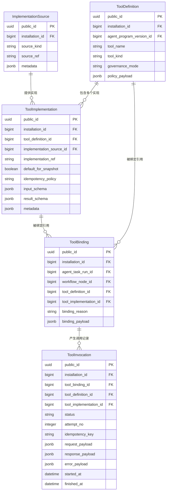
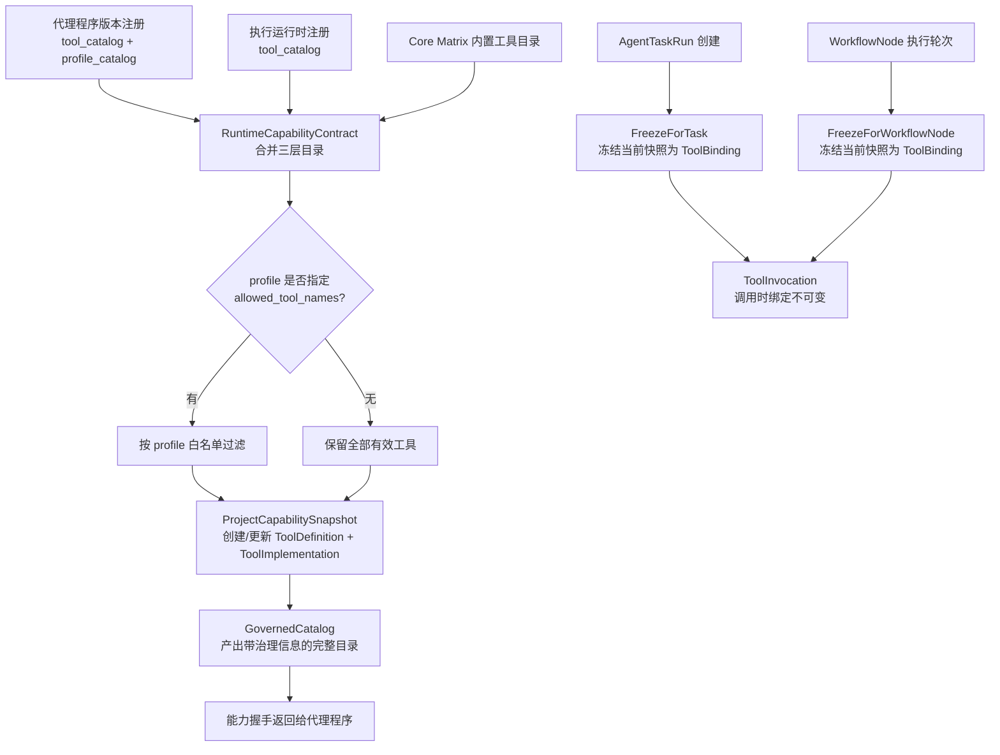
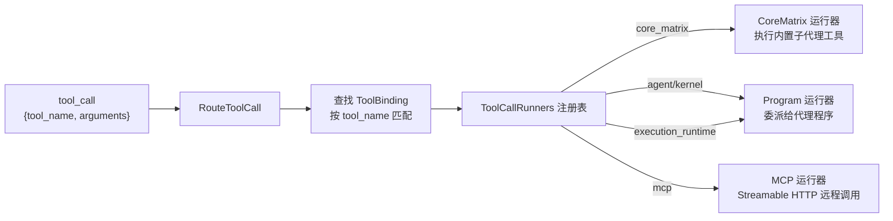
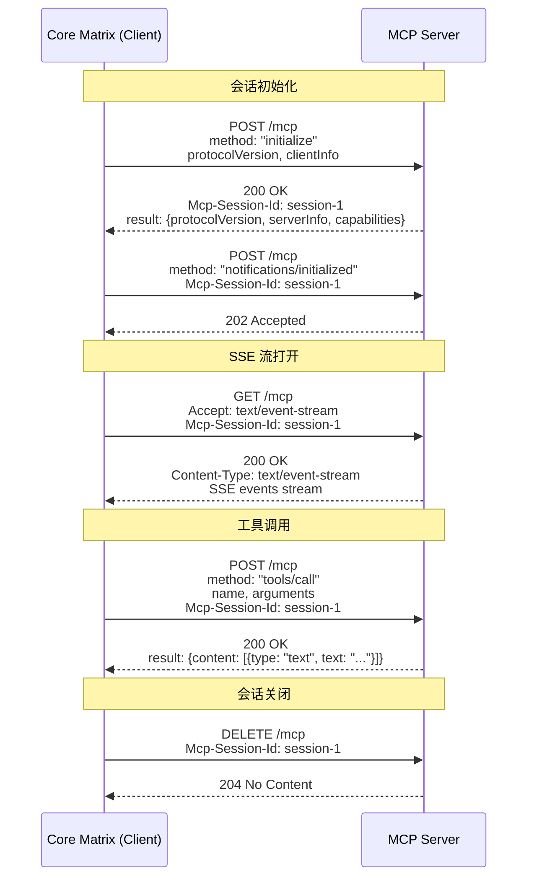

Core Matrix 的工具系统建立在一条从**能力声明**到**绑定冻结**再到**调用执行**的清晰流水线上。这条流水线确保每一次工具调用都经过治理审计、实现路由和结果持久化——无论该工具来自内核内置、执行运行时、代理程序，还是通过 MCP Streamable HTTP 协议接入的外部服务。本文将逐步拆解这条流水线上的每个关键模型、服务与传输协议。

Sources: [tool_definition.rb](https://github.com/jasl/cybros.new/blob/main/core_matrix/app/models/tool_definition.rb#L1-L41), [tool_binding.rb](https://github.com/jasl/cybros.new/blob/main/core_matrix/app/models/tool_binding.rb#L1-L111), [tool_invocation.rb](https://github.com/jasl/cybros.new/blob/main/core_matrix/app/models/tool_invocation.rb#L1-L121)

## 治理模型总览：四张持久化表

工具治理体系围绕四张核心表构建，形成从**定义**到**实现**到**绑定**到**调用**的完整生命周期链：



这四张表之间的引用关系是严格的：`ToolInvocation` 必须同时引用一个 `ToolBinding`、其对应的 `ToolDefinition` 和 `ToolImplementation`，并且在验证层确保它们之间的投影一致性（即 invocation 的 definition 和 implementation 必须来自其 binding 的同一引用）。

Sources: [schema.rb — implementation_sources](https://github.com/jasl/cybros.new/blob/main/core_matrix/db/schema.rb#L672-L682), [schema.rb — tool_bindings](https://github.com/jasl/cybros.new/blob/main/core_matrix/db/schema.rb#L1007-L1026), [schema.rb — tool_definitions](https://github.com/jasl/cybros.new/blob/main/core_matrix/db/schema.rb#L1029-L1042), [schema.rb — tool_implementations](https://github.com/jasl/cybros.new/blob/main/core_matrix/db/schema.rb#L1045-L1066), [schema.rb — tool_invocations](https://github.com/jasl/cybros.new/blob/main/core_matrix/db/schema.rb#L1069-L1096)

## 治理模式：reserved、whitelist_only 与 replaceable

每个 `ToolDefinition` 都有一个 `governance_mode` 枚举字段，它决定了该工具在绑定冻结时的实现选择策略：

| 治理模式 | 含义 | 实现选择约束 |
|---|---|---|
| `reserved` | 内核保留工具（`core_matrix__` 前缀或子代理工具） | 只能使用默认实现，不可替换 |
| `whitelist_only` | 执行运行时提供的工具 | 只能使用已审批的实现 |
| `replaceable` | 代理程序声明的工具 | 允许在多个实现之间选择 |

这个三态枚举由 `ToolBindings::SelectImplementation` 服务执行。当一个 `reserved` 工具被尝试绑定到非默认实现时，服务会抛出 `ActiveRecord::RecordInvalid` 异常。`whitelist_only` 模式则要求实现必须属于已审批列表，而 `replaceable` 允许在定义范围内自由选择。

治理模式的赋值规则由 `ToolBindings::ProjectCapabilitySnapshot` 在投影过程中自动决定：以 `core_matrix__` 为前缀的工具名或属于子代理保留名称列表（`subagent_spawn`、`subagent_send`、`subagent_wait`、`subagent_close`、`subagent_list`）的工具自动标记为 `reserved`；`implementation_source` 为 `execution_runtime` 的工具标记为 `whitelist_only`；其余均为 `replaceable`。

Sources: [tool_definition.rb — governance_mode enum](https://github.com/jasl/cybros.new/blob/main/core_matrix/app/models/tool_definition.rb#L4-L10), [select_implementation.rb](https://github.com/jasl/cybros.new/blob/main/core_matrix/app/services/tool_bindings/select_implementation.rb#L1-L34), [project_capability_snapshot.rb — governance_mode_for](https://github.com/jasl/cybros.new/blob/main/core_matrix/app/services/tool_bindings/project_capability_snapshot.rb#L154-L162)

## 实现来源：五种 source_kind

`ImplementationSource` 记录工具实现的具体来源，它通过 `source_kind` 枚举区分五种来源类型：

| source_kind | 含义 | source_ref 取值 |
|---|---|---|
| `core_matrix` | 内核内置实现 | 固定为 `"built_in"` |
| `execution_runtime` | 执行运行时提供的工具 | 运行时的 `public_id` |
| `agent` | 代理程序自身声明的工具 | `"agent_program_version:{public_id}"` |
| `kernel` | 内核层面注册的工具 | `"agent_program_version:{public_id}"` |
| `mcp` | 通过 MCP 协议接入的外部工具 | 实现引用标识 |

这个来源分类是工具调用路由的基础。`ProviderExecution::ToolCallRunners` 注册表将 `source_kind` 映射到对应的运行器：`"mcp"` 映射到 MCP 运行器，`"agent"` 和 `"kernel"` 映射到 Program 运行器，`"execution_runtime"` 映射到 Program 运行器，`"core_matrix"` 映射到 CoreMatrix 运行器。

Sources: [implementation_source.rb](https://github.com/jasl/cybros.new/blob/main/core_matrix/app/models/implementation_source.rb#L1-L27), [tool_call_runners.rb — REGISTRY](https://github.com/jasl/cybros.new/blob/main/core_matrix/app/services/provider_execution/tool_call_runners.rb#L1-L19), [project_capability_snapshot.rb — source_identity_for](https://github.com/jasl/cybros.new/blob/main/core_matrix/app/services/tool_bindings/project_capability_snapshot.rb#L137-L152)

## 能力投影与绑定冻结流水线

工具从"声明"到"可用"经历两个关键阶段：**能力投影**（projection）和**绑定冻结**（freeze）。下面的流程图展示了这条流水线：



**能力投影**发生在代理程序握手（`AgentProgramVersions::Handshake`）或能力刷新（`ProgramAPI::CapabilitiesController#show`）时。`RuntimeCapabilityContract` 将三层工具目录（Core Matrix 内置、执行运行时、代理程序版本）合并为 `effective_tool_catalog`，优先级为：Core Matrix 内置 > 执行运行时 > 代理程序版本。同名工具在更高优先级已存在时，低优先级的同名条目被忽略。

**绑定冻结**发生在执行被创建的那一刻。`FreezeForTask` 在 `AgentTaskRun` 创建时为该任务的所有允许工具创建 `ToolBinding` 记录；`FreezeForWorkflowNode` 则在工作流节点级别做同样的事。绑定记录冻结了当时的 `ToolDefinition`（含治理模式）和 `ToolImplementation`（含具体实现细节），确保后续的 `ToolInvocation` 始终追溯到一个不可变的绑定决策。

Sources: [runtime_capability_contract.rb — effective_tool_catalog](https://github.com/jasl/cybros.new/blob/main/core_matrix/app/models/runtime_capability_contract.rb#L116-L149), [project_capability_snapshot.rb](https://github.com/jasl/cybros.new/blob/main/core_matrix/app/services/tool_bindings/project_capability_snapshot.rb#L1-L196), [freeze_for_task.rb](https://github.com/jasl/cybros.new/blob/main/core_matrix/app/services/tool_bindings/freeze_for_task.rb#L1-L86), [freeze_for_workflow_node.rb](https://github.com/jasl/cybros.new/blob/main/core_matrix/app/services/tool_bindings/freeze_for_workflow_node.rb#L1-L233)

## 工具调用生命周期

`ToolInvocation` 有四种状态：`running`、`succeeded`、`failed`、`canceled`。其生命周期由四个服务类管理：

| 服务 | 职责 | 关键行为 |
|---|---|---|
| `ToolInvocations::Start` | 创建 `running` 状态的调用记录 | 在 `ToolBinding` 上加锁，自动递增 `attempt_no` |
| `ToolInvocations::Provision` | 幂等创建（先检查 `idempotency_key`） | 已存在则返回现有记录而非重复创建 |
| `ToolInvocations::Complete` | 标记 `succeeded`，写入 `response_payload` | 行级锁保护，仅 `running` 状态可转换 |
| `ToolInvocations::Fail` | 标记 `failed`，写入 `error_payload` | 行级锁保护，仅 `running` 状态可转换 |

幂等性通过 `idempotency_key` 实现。`Provision` 服务首先检查该 binding 下是否已有相同 `idempotency_key` 的 invocation，若有则直接返回，避免在并发场景下产生重复调用。数据库层面有唯一索引 `idx_tool_invocations_binding_idempotency`（条件：`idempotency_key IS NOT NULL`）作为最终保障。

每次 invocation 的 `attempt_no` 自动递增——即使同一 binding 下的前一次 invocation 失败了，新的 invocation 会获得下一个 attempt 编号。这为审计追踪和重试分析提供了清晰的历史视图。

Sources: [tool_invocations/start.rb](https://github.com/jasl/cybros.new/blob/main/core_matrix/app/services/tool_invocations/start.rb#L1-L41), [tool_invocations/provision.rb](https://github.com/jasl/cybros.new/blob/main/core_matrix/app/services/tool_invocations/provision.rb#L1-L43), [tool_invocations/complete.rb](https://github.com/jasl/cybros.new/blob/main/core_matrix/app/services/tool_invocations/complete.rb#L1-L31), [tool_invocations/fail.rb](https://github.com/jasl/cybros.new/blob/main/core_matrix/app/services/tool_invocations/fail.rb#L1-L31), [tool_invocation.rb — status enum](https://github.com/jasl/cybros.new/blob/main/core_matrix/app/models/tool_invocation.rb#L4-L11)

## 工具调用路由：ToolCallRunners 注册表

当 Provider 执行循环收到 LLM 返回的 tool_call 列表后，每个 tool_call 通过 `ProviderExecution::RouteToolCall` 路由到对应的运行器。路由过程分两步：

1. **查找绑定**：在当前轮次的 `round_bindings` 中按 `tool_name` 找到对应的 `ToolBinding`
2. **选择运行器**：根据绑定的 `ToolImplementation` 的 `implementation_source.source_kind` 查找注册表



四种运行器的职责差异显著：

- **CoreMatrix 运行器**：直接在内核执行 `subagent_spawn`、`subagent_send`、`subagent_wait`、`subagent_close`、`subagent_list` 等内置工具
- **Program 运行器**：通过 `ProgramMailboxExchange` 将工具调用发送到代理程序，等待代理程序返回结果
- **MCP 运行器**：委托给 `MCP::InvokeTool`，通过 Streamable HTTP 协议调用外部 MCP 服务器

Sources: [route_tool_call.rb](https://github.com/jasl/cybros.new/blob/main/core_matrix/app/services/provider_execution/route_tool_call.rb#L1-L35), [tool_call_runners.rb](https://github.com/jasl/cybros.new/blob/main/core_matrix/app/services/provider_execution/tool_call_runners.rb#L1-L19), [core_matrix.rb](https://github.com/jasl/cybros.new/blob/main/core_matrix/app/services/provider_execution/tool_call_runners/core_matrix.rb#L1-L84), [program.rb](https://github.com/jasl/cybros.new/blob/main/core_matrix/app/services/provider_execution/tool_call_runners/program.rb#L1-L87), [mcp.rb](https://github.com/jasl/cybros.new/blob/main/core_matrix/app/services/provider_execution/tool_call_runners/mcp.rb#L1-L31)

## MCP Streamable HTTP 传输协议

`MCP::StreamableHttpTransport` 实现了 MCP 协议规范中的 Streamable HTTP 传输方式。该传输协议以单个 HTTP 端点（`base_url`）作为所有 JSON-RPC 交互的入口，通过 `Mcp-Session-Id` 头部维护会话状态。

### 协议交互流程



关键协议细节：

- **协议版本**：默认 `2024-11-05`，在 `initialize` 请求的 `protocolVersion` 字段中声明
- **会话标识**：服务端在 `initialize` 响应中返回 `Mcp-Session-Id` 头部，后续所有请求必须携带该头部
- **SSE 流**：客户端通过 `GET` 请求打开 Server-Sent Events 流，接收服务端推送的通知事件
- **工具调用**：通过 `tools/call` JSON-RPC 方法发送，响应中的 `result.content` 为标准 MCP 内容数组
- **会话关闭**：通过 `DELETE` 请求显式关闭会话

Sources: [streamable_http_transport.rb](https://github.com/jasl/cybros.new/blob/main/core_matrix/app/services/mcp/streamable_http_transport.rb#L1-L234)

### 三层错误分类

`StreamableHttpTransport` 定义了三种错误类型，`MCP::InvokeTool` 在捕获它们时采用不同的失败分类：

| 错误类型 | Ruby 类 | classification | 典型场景 | 可重试 |
|---|---|---|---|---|
| 传输错误 | `MCP::TransportError` | `transport` | 连接失败、HTTP 404（session not found）、超时 | ✅ |
| 协议错误 | `MCP::ProtocolError` | `protocol` | JSON 解析失败、缺少 session_id、无效 SSE 内容类型 | ❌ |
| 语义错误 | `MCP::SemanticError` | `semantic` | 远程 MCP 工具执行失败（JSON-RPC error 响应） | ❌ |

其中 `TransportError` 的 `retryable` 标志为关键信号。当 `code == "session_not_found"` 时，`MCP::InvokeTool` 会清除 `ToolBinding` 上持久化的 session 状态，迫使下一次调用重新初始化会话。

Sources: [streamable_http_transport.rb — error classes](https://github.com/jasl/cybros.new/blob/main/core_matrix/app/services/mcp/streamable_http_transport.rb#L7-L38), [invoke_tool.rb — error handling](https://github.com/jasl/cybros.new/blob/main/core_matrix/app/services/mcp/invoke_tool.rb#L40-L47)

## MCP 会话状态持久化

`MCP::InvokeTool` 在 `ToolBinding` 的 `binding_payload` JSONB 字段中维护 MCP 会话状态。这种设计让 MCP 会话成为绑定生命周期的一部分，而非独立的会话管理机制：

```json
{
  "mcp": {
    "transport_kind": "streamable_http",
    "server_url": "http://mcp-server.example.com/mcp",
    "tool_name": "echo",
    "session_id": "session-1",
    "session_state": "open",
    "last_sse_event": { "jsonrpc": "2.0", "method": "notifications/ready" },
    "initialize_result": { "protocolVersion": "2024-11-05", "serverInfo": { "name": "...", "version": "..." } }
  }
}
```

会话管理遵循"懒初始化"模式：

1. `ensure_session!` 检查 `binding_payload.mcp.session_id` 是否存在
2. 若存在，复用已有会话直接调用工具
3. 若不存在，依次执行 `initialize_session!` → `open_sse_stream!` → `persist_session_state!`
4. 调用完成后更新 `session_state` 为 `"open"`
5. 遇到 `session_not_found` 错误时，`clear_session_state!` 将 `session_id` 置空、`session_state` 置为 `"closed"`

这种将会话状态嵌入 `ToolBinding` 的方式意味着：同一绑定上的多次 MCP 工具调用共享同一个 MCP 会话，直到会话因错误被清除或因绑定生命周期结束而失效。

Sources: [invoke_tool.rb — ensure_session!](https://github.com/jasl/cybros.new/blob/main/core_matrix/app/services/mcp/invoke_tool.rb#L51-L69), [invoke_tool.rb — persist_session_state!](https://github.com/jasl/cybros.new/blob/main/core_matrix/app/services/mcp/invoke_tool.rb#L88-L100), [invoke_tool.rb — clear_session_state!](https://github.com/jasl/cybros.new/blob/main/core_matrix/app/services/mcp/invoke_tool.rb#L102-L112)

## 执行策略与并行安全

`execution_policy` 是工具治理体系中的一个重要元数据维度。当前主要字段为 `parallel_safe`（默认 `false`），它决定了工具在 Provider 轮次中是否可以与其他工具并行执行。

执行策略的解析由 `RuntimeCapabilities::ResolveToolExecutionPolicy` 完成，它按三层合并规则工作：

1. **基础策略**：工具条目自身的 `execution_policy`
2. **来源默认策略**：MCP 来源的工具默认 `parallel_safe = false`
3. **覆盖策略**：来自 `default_config_snapshot["tool_policy_overlays"]` 的匹配覆盖

覆盖机制通过 `match` 字段定位目标工具，支持按 `tool_source`、`server_slug` 等条件匹配。这意味着系统管理员可以通过配置覆盖来放宽 MCP 工具的并行限制，而无需修改工具定义本身。

`BuildToolExecutionBatch` 在 Provider 轮次执行时消费这些策略：相邻的 `parallel_safe = true` 工具被合并到一个 `parallel_safe_group` 阶段中并行执行，不安全的工具则独占一个 `serial_group` 阶段。所有并行阶段使用 `completion_barrier = wait_all` 语义，确保阶段内所有工具完成后才进入下一阶段。

当前内置工具中，仅 `subagent_list` 被标记为 `parallel_safe = true`。

Sources: [resolve_tool_execution_policy.rb](https://github.com/jasl/cybros.new/blob/main/core_matrix/app/services/runtime_capabilities/resolve_tool_execution_policy.rb#L1-L73), [build_tool_execution_batch.rb](https://github.com/jasl/cybros.new/blob/main/core_matrix/app/services/provider_execution/build_tool_execution_batch.rb#L1-L112), [compose_effective_tool_catalog.rb — subagent_list execution_policy](https://github.com/jasl/cybros.new/blob/main/core_matrix/app/services/runtime_capabilities/compose_effective_tool_catalog.rb#L139-L142)

## 可见目录与 Profile 过滤

工具从"有效目录"到"可见目录"还需经过两层过滤，由 `RuntimeCapabilities::ComposeVisibleToolCatalog` 执行：

**Profile 过滤**：当代理程序版本的 `profile_catalog` 中当前 profile 指定了 `allowed_tool_names` 列表时，只有该列表中的工具会出现在可见目录中。Profile 键的解析顺序为：子代理会话的 `profile_key` → 默认配置中的 `interactive.profile` → `"main"`。

**子代理策略过滤**：根据对话的子代理配置（`default_config_snapshot.subagents` 合并 `conversation.override_payload.subagents`），可能过滤掉子代理相关工具。具体规则包括：

- `enabled: false` 时，移除所有子代理工具
- `allow_nested: false` 或达到 `max_depth` 时，移除 `subagent_spawn`
- `subagent_spawn` 工具的 `input_schema` 会被上下文化，注入当前可用的 profile 键列表

Sources: [compose_visible_tool_catalog.rb](https://github.com/jasl/cybros.new/blob/main/core_matrix/app/services/runtime_capabilities/compose_visible_tool_catalog.rb#L1-L110), [compose_for_turn.rb](https://github.com/jasl/cybros.new/blob/main/core_matrix/app/services/runtime_capabilities/compose_for_turn.rb#L1-L53)

## 能力握手与 GovernedCatalog 集成

当代理程序通过 `POST /program_api/capabilities` 发起能力握手时，`CapabilitiesController` 调用 `AgentProgramVersions::Handshake`，该服务将代理程序声明的工具目录与执行运行时的目录合并，然后返回包含 `governed_effective_tool_catalog` 的完整能力响应。

`GovernedCatalog` 在此流程中扮演核心角色：它先调用 `ProjectCapabilitySnapshot` 确保 `ToolDefinition` 和 `ToolImplementation` 记录已创建/更新，然后从 `RuntimeCapabilityContract.effective_tool_catalog` 获取有效目录，再按 profile 白名单过滤，最终为每个工具条目附加 `tool_definition_id`、`tool_implementation_id` 和 `governance_mode` 元数据。

代理程序收到的响应中包含两个平面：**执行平面**（`execution_plane`：运行时能力与工具目录）和**程序平面**（`program_plane`：程序版本指纹、协议方法、工具目录、profile 目录、配置 schema），加上合并后的 `effective_tool_catalog` 和治理后的 `governed_effective_tool_catalog`。

Sources: [capabilities_controller.rb](https://github.com/jasl/cybros.new/blob/main/core_matrix/app/controllers/program_api/capabilities_controller.rb#L1-L57), [governed_catalog.rb](https://github.com/jasl/cybros.new/blob/main/core_matrix/app/services/tool_bindings/governed_catalog.rb#L1-L56), [runtime_capability_contract.rb — capability_response](https://github.com/jasl/cybros.new/blob/main/core_matrix/app/models/runtime_capability_contract.rb#L165-L178)

## 验收测试验证场景

系统提供了两个验收测试场景来验证工具治理和 MCP 集成的端到端行为：

**governed_tool_validation**：引导一个带有 `subagent_spawn` 工具的运行时，创建任务上下文后验证绑定冻结、调用创建和完成的全流程，检查治理模式（`reserved`）是否正确记录。

**governed_mcp_validation**：启动一个 `FakeStreamableHttpMcpServer`，注册一个通过 MCP Streamable HTTP 提供的 `remote_echo` 工具，执行三次调用：第一次成功、第二次模拟 `session_not_found` 错误（验证传输错误分类和会话恢复）、第三次在新会话上成功。该场景验证了 MCP 会话的懒初始化、错误恢复和跨调用会话复用。

Sources: [governed_tool_validation.rb](https://github.com/jasl/cybros.new/blob/main/acceptance/scenarios/governed_tool_validation.rb#L1-L107), [governed_mcp_validation.rb](https://github.com/jasl/cybros.new/blob/main/acceptance/scenarios/governed_mcp_validation.rb#L1-L125), [fake_streamable_http_mcp_server.rb](https://github.com/jasl/cybros.new/blob/main/core_matrix/test/support/fake_streamable_http_mcp_server.rb#L1-L256)

## 关键设计决策总结

| 决策 | 选择 | 理由 |
|---|---|---|
| 绑定冻结时机 | AgentTaskRun / WorkflowNode 创建时 | 确保执行期间工具实现不可变 |
| MCP 会话存储位置 | ToolBinding.binding_payload JSONB | 会话与绑定生命周期一致，无需独立管理 |
| MCP 并行安全默认值 | `false` | MCP 远程调用的延迟和副作用不可预测 |
| 实现来源区分 | 五种 source_kind 枚举 | 支持运行器路由和治理策略差异化 |
| 幂等性保障 | idempotency_key + 数据库唯一索引 | 并发安全的重复调用检测 |
| 治理模式三态 | reserved / whitelist_only / replaceable | 覆盖从内核保留到自由替换的完整光谱 |

Sources: [agent-protocol-and-tool-surface-design.md — Binding Freeze Boundary](https://github.com/jasl/cybros.new/blob/main/docs/design/2026-03-24-core-matrix-agent-protocol-and-tool-surface-design.md#L164-L177), [parallel-tool-execution-design.md — Decision Summary](https://github.com/jasl/cybros.new/blob/main/docs/finished-plans/2026-03-31-core-matrix-parallel-tool-execution-design.md#L34-L52), [streamable-http-mcp-under-governance.md](https://github.com/jasl/cybros.new/blob/main/docs/finished-plans/2026-03-25-core-matrix-phase-2-task-streamable-http-mcp-under-governance.md#L1-L128)

---

**相关阅读**：
- 要了解工具治理在完整执行循环中的位置，参见 [Provider 执行循环：轮次请求、工具调用与结果持久化](https://github.com/jasl/cybros.new/blob/main/9-provider-zhi-xing-xun-huan-lun-ci-qing-qiu-gong-ju-diao-yong-yu-jie-guo-chi-jiu-hua)
- 要了解 MCP 工具如何通过代理程序声明和握手进入系统，参见 [代理注册、能力握手与部署生命周期](https://github.com/jasl/cybros.new/blob/main/6-dai-li-zhu-ce-neng-li-wo-shou-yu-bu-shu-sheng-ming-zhou-qi)
- 要了解子代理工具（`subagent_spawn` 等）的具体行为，参见 [子代理会话、执行租约与可关闭资源路由](https://github.com/jasl/cybros.new/blob/main/14-zi-dai-li-hui-hua-zhi-xing-zu-yue-yu-ke-guan-bi-zi-yuan-lu-you)
- 要了解并行执行的 DAG 图结构，参见 [工作流 DAG 执行引擎与调度器](https://github.com/jasl/cybros.new/blob/main/8-gong-zuo-liu-dag-zhi-xing-yin-qing-yu-diao-du-qi)