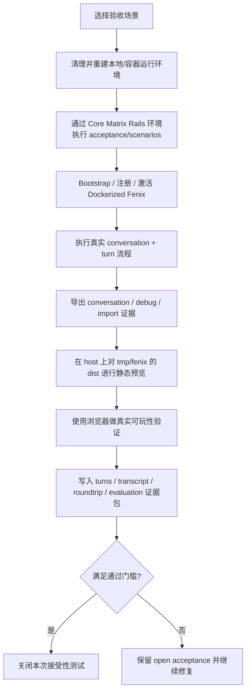

本页说明的是：当 `Core Matrix` 与 `Fenix` 已经连通后，如何通过“真实运行 + 真实浏览器 + 真实导出/导入证据”来完成接受性测试与手工回归，而不是只依赖单元测试或静态检查。你当前位于验证与维护分组中的 [接受性测试与手工回归流程](https://github.com/jasl/cybros.new/blob/main/12-jie-shou-xing-ce-shi-yu-shou-gong-hui-gui-liu-cheng)；本页只覆盖这条验收链路本身，不展开产品架构或运行时契约的其他专题。Sources: [docs/README.md](https://github.com/jasl/cybros.new/blob/main/docs/README.md#L16-L27), [acceptance/README.md](https://github.com/jasl/cybros.new/blob/main/acceptance/README.md#L3-L10)

## 流程总览

这条流程的核心顺序是固定的：先用 fresh-start 入口把主机服务与 Dockerized `Fenix` 拉到干净状态，再通过 `core_matrix/bin/rails runner` 执行场景，随后在主机侧对导出的 `dist/` 做可玩性验证，最后把回归所需的转录、导出、诊断与评估材料写回 `acceptance/artifacts/<run-stamp>/`。Sources: [acceptance/bin/run_with_fresh_start.sh](https://github.com/jasl/cybros.new/blob/main/acceptance/bin/run_with_fresh_start.sh#L1-L27), [acceptance/bin/fresh_start_stack.sh](https://github.com/jasl/cybros.new/blob/main/acceptance/bin/fresh_start_stack.sh#L11-L20), [acceptance/scenarios/fenix_capstone_app_api_roundtrip_validation.rb](https://github.com/jasl/cybros.new/blob/main/acceptance/scenarios/fenix_capstone_app_api_roundtrip_validation.rb#L1459-L1649), [acceptance/README.md](https://github.com/jasl/cybros.new/blob/main/acceptance/README.md#L6-L10)

## 入口与职责分工

| 入口 | 职责 | 什么时候用 |
|---|---|---|
| `acceptance/bin/run_with_fresh_start.sh` | 默认总入口；若目标场景是 capstone 场景，会直接转交到专用脚本 | 你要“从头跑一遍”任意 acceptance 场景时 |
| `acceptance/bin/fresh_start_stack.sh` | 重置主机服务与 Docker 栈，检查依赖并准备运行环境 | 任何要求“fresh start” 的验收前置步骤 |
| `acceptance/bin/fenix_capstone_app_api_roundtrip_validation.sh` | capstone 专用入口：先 bootstrap，再激活 Docker runtime，再执行最终场景 | 需要跑完整的 Fenix 端到端验收时 |
| `core_matrix/bin/rails runner acceptance/scenarios/...` | 在 `Core Matrix` Rails 环境中执行 Ruby 场景 | 需要直接运行单个场景脚本时 |

上表对应的实现关系很清楚：`run_with_fresh_start.sh` 会把默认 capstone 场景导向专用脚本；`fresh_start_stack.sh` 负责清场、端口/容器准备与健康检查；capstone 专用脚本则分两阶段运行场景，先 bootstrap 注册 runtime，再激活 Dockerized `Fenix`，最后进入 execute 阶段。Sources: [acceptance/bin/run_with_fresh_start.sh](https://github.com/jasl/cybros.new/blob/main/acceptance/bin/run_with_fresh_start.sh#L9-L27), [acceptance/bin/fresh_start_stack.sh](https://github.com/jasl/cybros.new/blob/main/acceptance/bin/fresh_start_stack.sh#L11-L20), [acceptance/bin/activate_fenix_docker_runtime.sh](https://github.com/jasl/cybros.new/blob/main/acceptance/bin/activate_fenix_docker_runtime.sh#L11-L21), [acceptance/bin/fenix_capstone_app_api_roundtrip_validation.sh](https://github.com/jasl/cybros.new/blob/main/acceptance/bin/fenix_capstone_app_api_roundtrip_validation.sh#L13-L37)

## 标准执行步骤

1. 先确认本次运行是否需要 capstone 专用链路；如果是，就让专用脚本接管 fresh-start、注册和 Docker runtime 激活。  
2. 再让场景脚本进入真实 conversation/turn 路径，要求代理在正常工具面上完成工作，而不是通过离线文件注入或特殊调试入口。  
3. 接着在主机侧验证 `tmp/fenix` 里的最终应用：`npm test`、`npm run build`、静态预览和浏览器操作都要基于同一份导出产物。  
4. 最后把 `turns.md`、`conversation-transcript.md`、`export-roundtrip.md`、`playability-verification.md`、`workspace-validation.md`、`agent-evaluation.md` 等证据写入同一运行批次目录，作为可审计输出。Sources: [acceptance/scenarios/fenix_capstone_app_api_roundtrip_validation.rb](https://github.com/jasl/cybros.new/blob/main/acceptance/scenarios/fenix_capstone_app_api_roundtrip_validation.rb#L1504-L1649), [docs/checklists/2026-03-31-fenix-provider-backed-agent-capstone-acceptance.md](https://github.com/jasl/cybros.new/blob/main/docs/checklists/2026-03-31-fenix-provider-backed-agent-capstone-acceptance.md#L358-L366), [acceptance/README.md](https://github.com/jasl/cybros.new/blob/main/acceptance/README.md#L6-L10)

## 手工回归要检查什么

| 检查项 | 目的 | 最低可接受信号 |
|---|---|---|
| 浏览器能打开导出的 `dist/` | 证明最终交付物可从主机侧消费 | 页面从本机静态预览成功加载 |
| 真实键盘输入能驱动游戏 | 证明不是静态 mockup | 方向键或 WASD 产生有效移动 |
| 合并规则正确 | 证明 2048 规则成立 | 相邻同值方块合并且得分增加 |
| 每次有效移动后产生新方块 | 证明随机生成逻辑存在 | 新 tile 出现 |
| 游戏结束可复现 | 证明状态机完整 | 能到达 game-over |
| 重开有效 | 证明回归入口可重复 | 分数回到 0，棋盘回到起始状态 |

手工回归的最小集就是这些；文档明确要求用真实浏览器会话和主机侧预览来做，而不是用 `web_fetch` 之类替代 loopback 或本机开发地址的方式。对 2048 这种固定规则游戏，回归时最好记录一段确定性的移动序列，至少要能证明四个方向的移动、合并、刷新新方块和重开状态都正常。Sources: [docs/checklists/2026-03-31-fenix-provider-backed-agent-capstone-acceptance.md](https://github.com/jasl/cybros.new/blob/main/docs/checklists/2026-03-31-fenix-provider-backed-agent-capstone-acceptance.md#L196-L239), [acceptance/scenarios/fenix_capstone_app_api_roundtrip_validation.rb](https://github.com/jasl/cybros.new/blob/main/acceptance/scenarios/fenix_capstone_app_api_roundtrip_validation.rb#L747-L840)

## 证据包与回归产物

| 产物 | 作用 |
|---|---|
| `turns.md` | 记录每轮的 `public_id`、DAG 形状、状态与结果 |
| `conversation-transcript.md` | 保存真实用户/代理对话 |
| `export-roundtrip.md` | 记录导出、调试导出与导入是否闭环 |
| `playability-verification.md` | 记录浏览器可玩性结论 |
| `workspace-validation.md` | 记录主机侧 `dist/`、`npm test`、`npm run build` 等可移植性诊断 |
| `agent-evaluation.md` / `.json` | 记录结果质量、运行时健康、收敛性和成本效率的结构化评估 |

这些产物不是“可选日志”，而是接受性关闭所需的主要证据。场景脚本会把它们统一写到 `acceptance/artifacts/<run-stamp>/`，并且 `acceptance/README.md` 明确说明 `artifacts/` 与 `logs/` 都是生成输出目录，不应当作为 git 内容提交。Sources: [acceptance/scenarios/fenix_capstone_app_api_roundtrip_validation.rb](https://github.com/jasl/cybros.new/blob/main/acceptance/scenarios/fenix_capstone_app_api_roundtrip_validation.rb#L1459-L1700), [acceptance/README.md](https://github.com/jasl/cybros.new/blob/main/acceptance/README.md#L6-L10)

## 判定规则

| 维度 | 通过时看什么 | 失败时看什么 |
|---|---|---|
| 运行链路 | stack 成功部署，真实 conversation/turn 跑完 | 必须绕过正常 turn 流程才能成功 |
| 产物完整性 | `tmp/fenix` 中有最终应用，且导出/导入 roundtrip 成功 | 源码没落到挂载 workspace，或 roundtrip 不成立 |
| 浏览器验证 | 主机预览可访问，浏览器里可实际玩 | 只是能看到静态页面，规则不对或无法互动 |
| 证据可审计性 | turn、transcript、diagnostics、evaluation 都齐全 | 无法解释观测到的 DAG 或 conversation state |
| 结果与质量 | 应用本身正确，评估可说明质量与效率 | 只能说“跑通了”，却没有可验证结论 |

通过门槛不是单一布尔值；某次运行即使功能上成功，也仍然可以在评估里被标成收敛性弱或成本效率差。相反，只要缺少关键证据、无法完成可玩性验证、或必须绕开标准 conversation/turn 路径，接受性就不能关闭。Sources: [docs/checklists/2026-03-31-fenix-provider-backed-agent-capstone-acceptance.md](https://github.com/jasl/cybros.new/blob/main/docs/checklists/2026-03-31-fenix-provider-backed-agent-capstone-acceptance.md#L322-L356), [docs/checklists/2026-03-31-fenix-provider-backed-agent-capstone-acceptance.md](https://github.com/jasl/cybros.new/blob/main/docs/checklists/2026-03-31-fenix-provider-backed-agent-capstone-acceptance.md#L348-L356), [acceptance/scenarios/fenix_capstone_app_api_roundtrip_validation.rb](https://github.com/jasl/cybros.new/blob/main/acceptance/scenarios/fenix_capstone_app_api_roundtrip_validation.rb#L843-L860)

## 回归时的操作纪律

手工回归要坚持“真实环境纪律”：用 shell、HTTP、Docker、Rails runner 和浏览器去做验证；工作区保持可抛弃；如果容器写入了平台相关的 `node_modules`，允许在主机侧重装后再做可移植性诊断，但要把这一步明确记录进证据包。对这类回归而言，真正的结论来自“产品路径 + 证据包 + 主机侧可玩性”三者同时成立，而不是某个局部检查单独通过。Sources: [docs/checklists/2026-03-31-fenix-provider-backed-agent-capstone-acceptance.md](https://github.com/jasl/cybros.new/blob/main/docs/checklists/2026-03-31-fenix-provider-backed-agent-capstone-acceptance.md#L358-L366), [docs/checklists/2026-03-31-fenix-provider-backed-agent-capstone-acceptance.md](https://github.com/jasl/cybros.new/blob/main/docs/checklists/2026-03-31-fenix-provider-backed-agent-capstone-acceptance.md#L219-L232), [acceptance/scenarios/fenix_capstone_app_api_roundtrip_validation.rb](https://github.com/jasl/cybros.new/blob/main/acceptance/scenarios/fenix_capstone_app_api_roundtrip_validation.rb#L548-L550)

## 下一步阅读

如果你要继续往下追踪这条链路，建议按文档目录里的当前真相顺序阅读：先看 [运行时契约：注册、配对与控制循环](https://github.com/jasl/cybros.new/blob/main/10-yun-xing-shi-qi-yue-zhu-ce-pei-dui-yu-kong-zhi-xun-huan)，再看 [工具能力：网页、浏览器与长生命周期进程](https://github.com/jasl/cybros.new/blob/main/11-gong-ju-neng-li-wang-ye-liu-lan-qi-yu-chang-sheng-ming-zhou-qi-jin-cheng)，最后回到 [计划、设计与结项文档的协作方式](https://github.com/jasl/cybros.new/blob/main/13-ji-hua-she-ji-yu-jie-xiang-wen-dang-de-xie-zuo-fang-shi)；这与 `docs/README.md` 里把当前验收材料放在 `docs/checklists`、把运行产物放在 `acceptance/` 的目录组织方式是一致的。Sources: [docs/README.md](https://github.com/jasl/cybros.new/blob/main/docs/README.md#L18-L27), [acceptance/README.md](https://github.com/jasl/cybros.new/blob/main/acceptance/README.md#L3-L10)