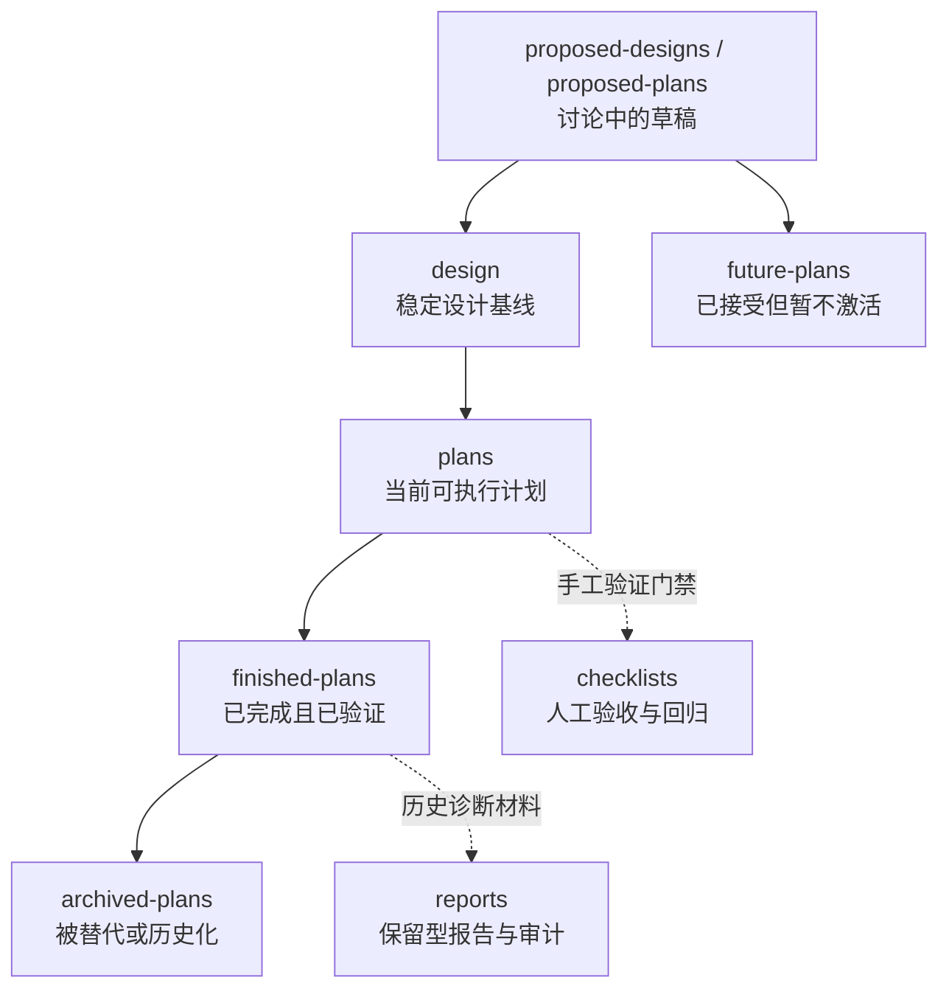

本页的目标不是解释某个功能，而是说明 **`docs/` 体系里不同阶段的文档该放在哪里、怎么交接、什么时候收束**。仓库已经明确区分了“当前真相”和“历史记录”，而且很多旧文档会保留 April 2026 reset 之前的命名，所以协作时要先看目录职责，再看文档状态与日期。Sources: [docs/README.md](https://github.com/jasl/cybros.new/blob/main/docs/README.md#L16-L33), [docs/README.md](https://github.com/jasl/cybros.new/blob/main/docs/README.md#L35-L58)

## 生命周期总览

下面这张图只描述文档流转，不描述代码执行流程。它的核心意思是：草稿先在提案目录里讨论，成熟后进入设计基线；可以执行的工作再进入计划目录；完成并验证后进入结项目录；被替代或失效的内容最后归档。Sources: [docs/README.md](https://github.com/jasl/cybros.new/blob/main/docs/README.md#L35-L49), [docs/proposed-designs/README.md](https://github.com/jasl/cybros.new/blob/main/docs/proposed-designs/README.md#L3-L17), [docs/proposed-plans/README.md](https://github.com/jasl/cybros.new/blob/main/docs/proposed-plans/README.md#L3-L16), [docs/design/README.md](https://github.com/jasl/cybros.new/blob/main/docs/design/README.md#L3-L24), [docs/plans/README.md](https://github.com/jasl/cybros.new/blob/main/docs/plans/README.md#L3-L38), [docs/finished-plans/README.md](https://github.com/jasl/cybros.new/blob/main/docs/finished-plans/README.md#L3-L58), [docs/archived-plans/README.md](https://github.com/jasl/cybros.new/blob/main/docs/archived-plans/README.md#L1-L6)

这条流转关系与仓库的目录说明是一致的：`proposed-*` 是“还在讨论中”的草稿区，`design` 是长期稳定的基线，`plans` 只放当前可执行、尚未完成的执行计划，`finished-plans` 只接收已完成并通过验证的记录，而 `archived-plans` 只收纳被替代、撤回或失活的内容。Sources: [docs/proposed-designs/README.md](https://github.com/jasl/cybros.new/blob/main/docs/proposed-designs/README.md#L3-L17), [docs/proposed-plans/README.md](https://github.com/jasl/cybros.new/blob/main/docs/proposed-plans/README.md#L3-L16), [docs/design/README.md](https://github.com/jasl/cybros.new/blob/main/docs/design/README.md#L3-L24), [docs/plans/README.md](https://github.com/jasl/cybros.new/blob/main/docs/plans/README.md#L3-L38), [docs/finished-plans/README.md](https://github.com/jasl/cybros.new/blob/main/docs/finished-plans/README.md#L3-L58), [docs/archived-plans/README.md](https://github.com/jasl/cybros.new/blob/main/docs/archived-plans/README.md#L1-L6)

## 各目录的职责边界

| 阶段 | 目录 | 进入条件 | 退出条件 | 关键含义 |
|---|---|---|---|---|
| 提案草稿 | `docs/proposed-designs` | 设计方向仍在探索、边界还不稳定 | 被批准后进入 `docs/design`，或改写为未来路线进入 `docs/future-plans` | 还不能视为稳定基线 |
| 提案草稿 | `docs/proposed-plans` | 早期计划草稿还没准备好成为活跃执行文档 | 被接受并延后则进 `docs/future-plans`，可执行则进 `docs/plans` | 还不是当前队列 |
| 稳定基线 | `docs/design` | 已批准的长期设计基线 | 进入具体执行后由计划文档承接 | 不是逐任务执行说明 |
| 执行中 | `docs/plans` | 当前可执行、未完成的计划 | 完成验证后转入 `docs/finished-plans` | 只放活跃执行文档 |
| 已完成 | `docs/finished-plans` | 已完成、已验证、过了阶段级验收 | 若被替代或过时，转入 `docs/archived-plans` | 需要自洽、可独立理解 |
| 历史归档 | `docs/archived-plans` | 已废弃、撤回、被替代 | 通常不再回流到活跃目录 | 仅保留追溯性 |
| 延后未来工作 | `docs/future-plans` | 已接受但明确不激活的后续工作 | 真正进入执行时改放 `docs/plans` | 代表“保留但不执行” |
| 验证材料 | `docs/checklists` | 手工验证与回归需要 | 作为验收门禁被引用 | 关注验证步骤与结果 |
| 报告材料 | `docs/reports` | 架构审计、叙述性报告等已成文材料 | 不作为当前产品契约 | 是快照，不是执行计划 |

表中的边界不是推断出来的，而是各目录 README 里直接写明的职责说明。尤其要注意：`docs/finished-plans` 强调“已完成且通过阶段级验收”，并要求记录“历史上自洽”，而 `docs/reports` 明确说它保存的是报告快照，不再承载运行时产物。Sources: [docs/proposed-designs/README.md](https://github.com/jasl/cybros.new/blob/main/docs/proposed-designs/README.md#L3-L17), [docs/proposed-plans/README.md](https://github.com/jasl/cybros.new/blob/main/docs/proposed-plans/README.md#L3-L16), [docs/design/README.md](https://github.com/jasl/cybros.new/blob/main/docs/design/README.md#L3-L24), [docs/plans/README.md](https://github.com/jasl/cybros.new/blob/main/docs/plans/README.md#L3-L38), [docs/finished-plans/README.md](https://github.com/jasl/cybros.new/blob/main/docs/finished-plans/README.md#L3-L11), [docs/archived-plans/README.md](https://github.com/jasl/cybros.new/blob/main/docs/archived-plans/README.md#L1-L6), [docs/future-plans/README.md](https://github.com/jasl/cybros.new/blob/main/docs/future-plans/README.md#L3-L23), [docs/checklists/README.md](https://github.com/jasl/cybros.new/blob/main/docs/checklists/README.md#L3-L13), [docs/reports/README.md](https://github.com/jasl/cybros.new/blob/main/docs/reports/README.md#L3-L18)

## 设计、计划与结项如何衔接

**设计文档**负责把长期边界说清楚。`docs/design` 的定位是“durable design baseline”，并明确它不是 task-by-task 的执行计划；换句话说，它回答的是“应该是什么”，而不是“今天怎么做”。Sources: [docs/design/README.md](https://github.com/jasl/cybros.new/blob/main/docs/design/README.md#L3-L24)

**计划文档**负责把可执行工作排进当前队列。`docs/plans` 只收“active execution plans”，并明确要求只放“currently executable, not-yet-completed” 的内容；这意味着计划文档是从设计基线向实际落地的过渡层。Sources: [docs/plans/README.md](https://github.com/jasl/cybros.new/blob/main/docs/plans/README.md#L3-L38)

**结项文档**负责把已经完成的工作收束成自洽记录。`docs/finished-plans` 不接收进行中的执行文档，而是接收已完成的计划、里程碑和 closeout 记录；它还要求这些记录在历史上自洽，如果曾经依赖外部参考，就要把保留结论直接写进本地文档。Sources: [docs/finished-plans/README.md](https://github.com/jasl/cybros.new/blob/main/docs/finished-plans/README.md#L3-L11), [docs/README.md](https://github.com/jasl/cybros.new/blob/main/docs/README.md#L50-L58)

一个很典型的协作样式，是先有批准过的设计，再有面向执行的实施计划，最后在完成后补上结项与验证证据。仓库里已经有这种写法的实例：`2026-04-03-agent-program-execution-runtime-reset.md` 先声明所依赖的 approved design，再列出 guardrails，最后要求用 fresh verification output 通过最终验收门禁。Sources: [docs/finished-plans/2026-04-03-agent-program-execution-runtime-reset.md](https://github.com/jasl/cybros.new/blob/main/docs/finished-plans/2026-04-03-agent-program-execution-runtime-reset.md#L1-L45)

## 引用、验证与历史保留

如果一份设计、计划、研究或结项记录用到了 `references/`、外部仓库或暂时性的参考路径，仓库的原则不是把链接留在那里就结束，而是把 **保留结论、权衡和已观察到的行为** 写回本地文档；这样即使上游材料移动或消失，本地记录仍然能独立理解。Sources: [docs/README.md](https://github.com/jasl/cybros.new/blob/main/docs/README.md#L50-L58)

这也解释了为什么 `docs/finished-plans` 特别强调“historically self-contained”：结项不是把执行过程简单搬运过去，而是把真正留下来的知识沉淀成可长期阅读的记录。另一方面，`docs/checklists` 负责提供人工验收与回归的门禁，而不是替代计划或设计本身。Sources: [docs/finished-plans/README.md](https://github.com/jasl/cybros.new/blob/main/docs/finished-plans/README.md#L3-L11), [docs/checklists/README.md](https://github.com/jasl/cybros.new/blob/main/docs/checklists/README.md#L3-L13)

## 下一步阅读

如果你要把这套协作方式继续落到实际工作上，建议先看 [接受性测试与手工回归流程](https://github.com/jasl/cybros.new/blob/main/12-jie-shou-xing-ce-shi-yu-shou-gong-hui-gui-liu-cheng)，因为结项文档最终要通过的就是这类门禁；再回看 [文档生命周期与阅读路线](https://github.com/jasl/cybros.new/blob/main/5-wen-dang-sheng-ming-zhou-qi-yu-yue-du-lu-xian)，可以把本页的目录流转规则和整个文档树对齐；如果你想区分文档协作与运行基线，再读 [运维参数：数据库池、队列与单机部署基线](https://github.com/jasl/cybros.new/blob/main/14-yun-wei-can-shu-shu-ju-ku-chi-dui-lie-yu-dan-ji-bu-shu-ji-xian)。Sources: [docs/README.md](https://github.com/jasl/cybros.new/blob/main/docs/README.md#L16-L27), [docs/checklists/README.md](https://github.com/jasl/cybros.new/blob/main/docs/checklists/README.md#L3-L13), [docs/plans/README.md](https://github.com/jasl/cybros.new/blob/main/docs/plans/README.md#L15-L38), [docs/finished-plans/README.md](https://github.com/jasl/cybros.new/blob/main/docs/finished-plans/README.md#L3-L11)