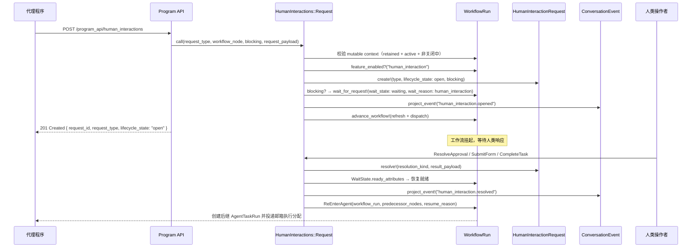
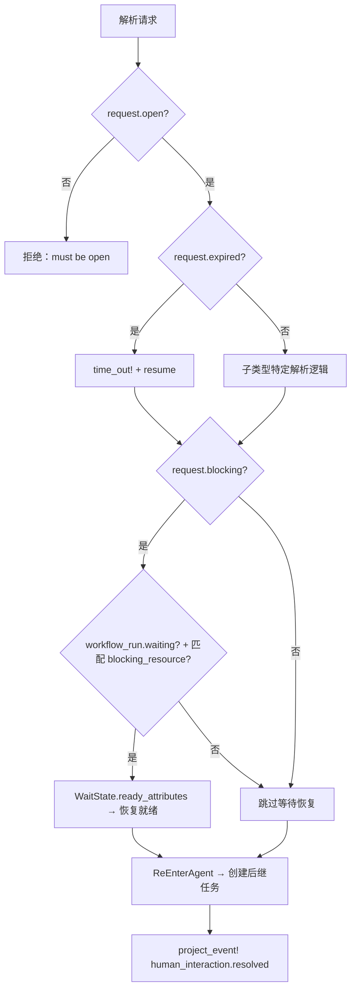

Core Matrix 的人类交互系统是工作流执行引擎中 **"机器暂停、人类裁决"** 这一核心协作模式的形式化实现。当代理程序在执行过程中需要人类操作者的判断、数据输入或手动操作确认时，系统通过三种标准化的交互原语——**审批请求（ApprovalRequest）、表单请求（HumanFormRequest）和任务请求（HumanTaskRequest）**——将工作流挂起于可恢复的等待状态，待人类响应后精确恢复执行。这套机制的关键设计目标是：在不阻塞数据库连接的前提下实现持久化的等待-恢复语义，同时保证会话生命周期各阶段的完整性约束。

Sources: [human_interaction_request.rb](https://github.com/jasl/cybros.new/blob/main/core_matrix/app/models/human_interaction_request.rb#L1-L143), [workflow_run.rb](https://github.com/jasl/cybros.new/blob/main/core_matrix/app/models/workflow_run.rb#L12-L28)

## 领域模型：单表继承与生命周期状态机

**HumanInteractionRequest** 采用 Rails 单表继承（STI）模式，通过 `type` 列区分三种子类型。基类定义了统一的 `lifecycle_state` 枚举和 `resolution_kind` 枚举，前者管控请求从创建到终结的状态流转，后者记录终结的具体原因。三种子类型共享基类的所有字段和校验逻辑，但各自施加子类型特有的约束。

### 生命周期状态矩阵

`lifecycle_state` 枚举定义了四种状态，其合法转换路径如下：

| 状态 | 含义 | 合法后续状态 | 触发条件 |
|------|------|-------------|---------|
| `open` | 请求已创建，等待人类响应 | `resolved`, `canceled`, `timed_out` | `HumanInteractions::Request` 创建 |
| `resolved` | 人类已成功响应 | 终态 | 子类型对应的 resolve 操作 |
| `canceled` | 请求被系统取消 | 终态 | 工作流或会话级取消 |
| `timed_out` | 请求超过 `expires_at` 时限 | 终态 | 解析时检测到已过期 |

`resolution_kind` 枚举包含六种终结原因：`approved`、`denied`、`submitted`、`completed`、`canceled`、`timed_out`。基类通过 `resolution_state_consistency` 校验器确保：当请求处于 `open` 状态时，`resolution_kind`、`resolved_at` 和 `result_payload` 必须为空；一旦离开 `open` 状态，`resolution_kind` 和 `resolved_at` 必须存在。

Sources: [human_interaction_request.rb](https://github.com/jasl/cybros.new/blob/main/core_matrix/app/models/human_interaction_request.rb#L1-L143), [20260324090035_create_human_interaction_requests.rb](https://github.com/jasl/cybros.new/blob/main/core_matrix/db/migrate/20260324090035_create_human_interaction_requests.rb#L1-L27)

### 三种子类型的差异化约束

每种子类型通过独立的校验器对 `request_payload` 和 `resolution_kind` 施加特定约束，确保语义正确性：

| 子类型 | `request_payload` 必需字段 | 合法 `resolution_kind` | 用途 |
|--------|--------------------------|----------------------|------|
| **ApprovalRequest** | `approval_scope` | `approved`, `denied` | 二值决策门控（如：发布审批） |
| **HumanFormRequest** | `input_schema`（含 `required` 列表），可选 `defaults` | `submitted` | 结构化数据采集（如：工单信息） |
| **HumanTaskRequest** | `instructions` | `completed` | 离线手动操作确认（如：供应商电话确认） |

**ApprovalRequest** 的 `request_payload` 必须包含 `approval_scope` 字符串，用于标识审批的范围（例如 `"publish"` 表示发布审批）。**HumanFormRequest** 要求 `input_schema` 为 Hash，其中可嵌套 `required` 数组指定必填字段；可选的 `defaults` Hash 为表单提供预填充值。**HumanTaskRequest** 的 `request_payload` 必须包含 `instructions` 字符串，描述人类操作者需要完成的手动任务。

Sources: [approval_request.rb](https://github.com/jasl/cybros.new/blob/main/core_matrix/app/models/approval_request.rb#L1-L21), [human_form_request.rb](https://github.com/jasl/cybros.new/blob/main/core_matrix/app/models/human_form_request.rb#L1-L19), [human_task_request.rb](https://github.com/jasl/cybros.new/blob/main/core_matrix/app/models/human_task_request.rb#L1-L19)

### 安装级完整性约束

基类通过九个校验器确保所有关联实体属于同一安装（Installation），形成严格的租户隔离边界。这些校验覆盖：`workflow_run`、`workflow_node`、`conversation`、`turn` 均属于同一 `installation`；`workflow_node` 属于 `workflow_run`；`turn` 属于 `workflow_run` 的 `conversation`。这种多层交叉校验确保任何跨租户的数据关联都会被拒绝。

Sources: [human_interaction_request.rb](https://github.com/jasl/cybros.new/blob/main/core_matrix/app/models/human_interaction_request.rb#L76-L123)

## 架构总览：请求-等待-恢复管线

上图展示了阻塞式人类交互的完整生命周期。代理程序通过 Program API 发起交互请求，系统创建请求记录后将工作流置于 `waiting` 状态，工作流调度器在此期间不再派发该工作流的任何节点。当人类操作者完成响应后，系统恢复工作流为 `ready` 状态，通过 `ReEnterAgent` 创建后继节点和任务运行，重新进入代理执行循环。

Sources: [request.rb](https://github.com/jasl/cybros.new/blob/main/core_matrix/app/services/human_interactions/request.rb#L1-L143), [resolve_approval.rb](https://github.com/jasl/cybros.new/blob/main/core_matrix/app/services/human_interactions/resolve_approval.rb#L1-L100)

## 请求创建：HumanInteractions::Request 服务

**HumanInteractions::Request** 是所有人类交互请求的统一入口服务。它接收 `request_type`、`workflow_node`、`blocking`、`request_payload` 和可选的 `expires_at` 参数，在 `Workflows::WithMutableWorkflowContext` 的事务上下文中执行以下步骤：

1. **类型解析**：通过 `REQUEST_TYPES` 映射将字符串类型名解析为具体的 STI 子类
2. **上下文校验**：验证会话 `deletion_state` 为 `retained`、`lifecycle_state` 为 `active`、且无进行中的关闭操作
3. **特性门控**：检查 `workflow_run.feature_enabled?("human_interaction")`，该特性通过会话的 `enabled_feature_ids` 列表管控
4. **轮次中断检查**：拒绝在已被轮次中断（`turn_interrupted`）的上下文中创建新请求
5. **等待状态互斥**：对于阻塞式请求，拒绝在工作流已处于 `waiting` 状态时创建第二个阻塞式请求
6. **请求创建**：实例化子类型记录，写入 `request_payload` 和 `blocking` 标志
7. **节点元数据更新**：将 `human_interaction_request_id` 和 `blocking` 写入 `workflow_node.metadata`
8. **节点完成**：调用 `Workflows::CompleteNode` 标记交互节点为已完成
9. **条件等待**：若 `blocking: true`，将工作流转为 `waiting` 状态并记录 `wait_reason_kind: "human_interaction"`
10. **事件投影**：投影 `human_interaction.opened` 对话事件
11. **工作流推进**：刷新生命周期并派发可运行节点

Sources: [request.rb](https://github.com/jasl/cybros.new/blob/main/core_matrix/app/services/human_interactions/request.rb#L21-L72)

### 阻塞与非阻塞语义

`blocking` 参数决定交互请求是否挂起整个工作流。阻塞式请求（默认）将 `workflow_run` 置于 `waiting` 状态，阻塞所有后续节点派发，直到请求被解决。非阻塞式请求仅创建请求记录并完成对应节点，工作流继续派发后继节点。非阻塞语义适用于"发后即忘"的人类通知场景，例如可选的确认步骤。

Sources: [request.rb](https://github.com/jasl/cybros.new/blob/main/core_matrix/app/services/human_interactions/request.rb#L82-L93), [request_test.rb](https://github.com/jasl/cybros.new/blob/main/core_matrix/test/services/human_interactions/request_test.rb#L135-L167)

### 特性门控：human_interaction 特性标志

`human_interaction` 是 `Conversation::FEATURE_IDS` 中的五个特性标志之一。对于自动化类型的会话（`automation?`），该特性在默认特性列表中被移除，意味着自动化会话默认不具备人类交互能力。工作流在创建请求前显式检查此标志，如果未启用则抛出 `feature_not_enabled` 校验错误。

Sources: [conversation.rb](https://github.com/jasl/cybros.new/blob/main/core_matrix/app/models/conversation.rb#L4-L10), [conversation.rb](https://github.com/jasl/cybros.new/blob/main/core_matrix/app/models/conversation.rb#L165-L168), [request.rb](https://github.com/jasl/cybros.new/blob/main/core_matrix/app/services/human_interactions/request.rb#L31-L34)

## 三种解析服务：从人类响应到工作流恢复

每种子类型拥有独立的解析服务，但三者共享相同的高层模式：在 `HumanInteractions::WithMutableRequestContext` 事务中获取行级锁，检查请求状态和过期时间，执行子类型特定的解析逻辑，恢复工作流等待状态，投影对话事件，并通过 `Workflows::ReEnterAgent` 重新进入代理执行循环。

### WithMutableRequestContext：并发安全的上下文门控

**WithMutableRequestContext** 是三个解析服务共享的基础设施层。它嵌套调用 `Workflows::WithMutableWorkflowContext`（校验会话的 retained/active/非关闭中约束），然后对请求记录执行 `with_lock` 获取行级排他锁。这保证了：即使并发线程尝试解析同一请求，只有一个能成功获取锁并执行解析，其余将看到已解析的状态并被拒绝。

Sources: [with_mutable_request_context.rb](https://github.com/jasl/cybros.new/blob/main/core_matrix/app/services/human_interactions/with_mutable_request_context.rb#L1-L38)

### ResolveApproval：二值决策解析

**HumanInteractions::ResolveApproval** 接受 `approval_request`、`decision`（`"approved"` 或 `"denied"`）和可选的 `result_payload`。解析时将 `approved` 布尔值注入 `result_payload`，确保下游消费者可以统一读取 `result_payload["approved"]` 而无需字符串比较。如果请求已过期，系统自动执行超时处理流程。

Sources: [resolve_approval.rb](https://github.com/jasl/cybros.new/blob/main/core_matrix/app/services/human_interactions/resolve_approval.rb#L1-L100)

### SubmitForm：结构化数据提交

**HumanInteractions::SubmitForm** 接受 `human_form_request` 和 `submission_payload`。提交时首先将 `submission_payload` 与请求中的 `defaults` 合并（用户值覆盖默认值），然后校验合并结果是否满足 `input_schema.required` 中声明的所有必填字段。只有通过必填校验的数据才会被写入 `result_payload`。

Sources: [submit_form.rb](https://github.com/jasl/cybros.new/blob/main/core_matrix/app/services/human_interactions/submit_form.rb#L1-L103)

### CompleteTask：手动操作确认

**HumanInteractions::CompleteTask** 是三种解析服务中最简单的，接受 `human_task_request` 和 `completion_payload`。它不施加额外的结构校验，直接将 `completion_payload` 写入 `result_payload`，`resolution_kind` 固定为 `"completed"`。这反映了任务请求的语义：人类操作者自由决定完成方式和结果格式。

Sources: [complete_task.rb](https://github.com/jasl/cybros.new/blob/main/core_matrix/app/services/human_interactions/complete_task.rb#L1-L90)

### 过期处理：统一的超时路径

三个解析服务均内置相同的过期处理逻辑：在解析前检查 `request.expired?`，如果已过期则调用 `request.time_out!` 将生命周期状态设为 `timed_out`、`resolution_kind` 设为 `"timed_out"`，投影 `human_interaction.timed_out` 事件，并恢复工作流。这意味着即使人类在超时后尝试响应，系统也不会接受过期的提交——而是将其视为超时处理。

Sources: [resolve_approval.rb](https://github.com/jasl/cybros.new/blob/main/core_matrix/app/services/human_interactions/resolve_approval.rb#L42-L48), [submit_form.rb](https://github.com/jasl/cybros.new/blob/main/core_matrix/app/services/human_interactions/submit_form.rb#L45-L51), [complete_task.rb](https://github.com/jasl/cybros.new/blob/main/core_matrix/app/services/human_interactions/complete_task.rb#L32-L38)

## 工作流等待状态：与执行引擎的集成

人类交互请求与工作流执行引擎的集成通过 `WorkflowRun` 的等待状态机制实现。当阻塞式请求被创建时，`HumanInteractions::Request` 将工作流转入等待状态：

| 字段 | 值 | 含义 |
|------|-----|------|
| `wait_state` | `"waiting"` | 工作流暂停派发 |
| `wait_reason_kind` | `"human_interaction"` | 等待原因为人类交互 |
| `wait_reason_payload` | `{ "request_id" => ..., "request_type" => ... }` | 具体请求信息 |
| `waiting_since_at` | 当前时间 | 等待开始时刻 |
| `blocking_resource_type` | `"HumanInteractionRequest"` | 阻塞资源类型 |
| `blocking_resource_id` | 请求的 `public_id` | 阻塞资源标识 |

`WorkflowWaitSnapshot` 类封装了等待状态的快照和恢复逻辑。其 `resolved_for?` 方法通过查询 `HumanInteractionRequest` 是否仍存在 `lifecycle_state: "open"` 且 `blocking: true` 的记录来判断等待是否已解除。当所有阻塞式人类交互请求离开 `open` 状态时，等待条件满足。

Sources: [request.rb](https://github.com/jasl/cybros.new/blob/main/core_matrix/app/services/human_interactions/request.rb#L82-L93), [workflow_wait_snapshot.rb](https://github.com/jasl/cybros.new/blob/main/core_matrix/app/models/workflow_wait_snapshot.rb#L67-L77), [workflow_run.rb](https://github.com/jasl/cybros.new/blob/main/core_matrix/app/models/workflow_run.rb#L12-L28)

### 恢复后的代理重入

工作流恢复后，系统通过 `Workflows::ReEnterAgent` 创建后继节点和任务运行。该服务从 `workflow_run.resume_metadata` 读取后继节点定义，根据人类交互节点作为前驱节点建立 DAG 边，创建新的 `AgentTaskRun`（含 `resume_reason: "human_interaction_resolved"` 和完整的 `wait_context`），并通过 `AgentControl::CreateExecutionAssignment` 将执行分配投递到代理邮箱。这使得代理程序在恢复后能够获知等待期间的完整上下文信息。

Sources: [re_enter_agent.rb](https://github.com/jasl/cybros.new/blob/main/core_matrix/app/services/workflows/re_enter_agent.rb#L1-L154), [resolve_approval.rb](https://github.com/jasl/cybros.new/blob/main/core_matrix/app/services/human_interactions/resolve_approval.rb#L84-L93)

## Program API：机器对机器接口

代理程序通过 `POST /program_api/human_interactions` 端点创建人类交互请求。该端点属于 [Program API：代理程序机器对机器接口](https://github.com/jasl/cybros.new/blob/main/24-program-api-dai-li-cheng-xu-ji-qi-dui-ji-qi-jie-kou) 的一部分，需要有效的代理会话凭证认证。请求体接受以下参数：

| 参数 | 类型 | 必需 | 说明 |
|------|------|------|------|
| `workflow_node_id` | UUID | 是 | 工作流节点的 public_id |
| `request_type` | String | 是 | `"ApprovalRequest"` / `"HumanFormRequest"` / `"HumanTaskRequest"` |
| `blocking` | Boolean | 否（默认 true） | 是否阻塞工作流 |
| `request_payload` | Hash | 否（默认 {}） | 子类型特定的请求载荷 |

控制器通过 `BaseController#find_workflow_node!` 查找节点，强制使用 `public_id` 而非内部 `bigint`——直接传递 `bigint` ID 将返回 404，这是[标识符策略](https://github.com/jasl/cybros.new/blob/main/17-biao-shi-fu-ce-lue-public_id-yu-bigint-nei-bu-jian-de-bian-jie-gui-ze)的强制执行。

响应序列化通过 `serialize_human_interaction_request` 方法完成，返回包含 `request_id`、`request_type`、`workflow_run_id`、`workflow_node_id`、`conversation_id`、`turn_id`、`lifecycle_state`、`blocking`、`request_payload` 和 `result_payload` 的 JSON 对象，所有外键均使用 `public_id`。

Sources: [human_interactions_controller.rb](https://github.com/jasl/cybros.new/blob/main/core_matrix/app/controllers/program_api/human_interactions_controller.rb#L1-L17), [base_controller.rb](https://github.com/jasl/cybros.new/blob/main/core_matrix/app/controllers/program_api/base_controller.rb#L191-L204), [human_interactions_test.rb](https://github.com/jasl/cybros.new/blob/main/core_matrix/test/requests/program_api/human_interactions_test.rb#L1-L49)

## 意图批次与等待转换：从代理执行到交互创建

人类交互请求的另一种创建路径通过 **Workflows::HandleWaitTransitionRequest** 实现。当代理程序在执行完成报告（`execution_complete`）中包含 `wait_transition_requested` 载荷时，系统解析其中的 `batch_manifest`，为每个 `intent_kind: "human_interaction_request"` 的意图自动调用 `HumanInteractions::Request`。

这种机制允许代理程序在单次执行中声明意图批次，系统按阶段（stage）串行物化，每个阶段中的人类交互节点和子代理生成节点可以并行处理。当阶段包含阻塞式人类交互时，工作流在该阶段即进入等待状态，后续阶段暂停物化。

Sources: [handle_wait_transition_request.rb](https://github.com/jasl/cybros.new/blob/main/core_matrix/app/services/workflows/handle_wait_transition_request.rb#L1-L130), [workflow_wait_transition_test_support.rb](https://github.com/jasl/cybros.new/blob/main/core_matrix/test/support/workflow_wait_transition_test_support.rb#L48-L88)

## 对话事件投影与实时流

每个人类交互请求的生命周期转换都通过 `ConversationEvents::Project` 服务投影为对话事件。投影使用 `stream_key` 格式 `"human_interaction_request:#{request.id}"` 和递增的 `stream_revision`，确保同一请求的事件可以按时间顺序查询。

| 事件类型 | 触发时机 | stream_revision |
|---------|---------|----------------|
| `human_interaction.opened` | 请求创建 | 0 |
| `human_interaction.resolved` | 请求解析（审批/表单/任务） | 1 |
| `human_interaction.timed_out` | 请求超时 | 1 |

`live_projection` 查询返回每个流最新的修订版本事件，消费者可以借此获取当前生效的交互状态。所有事件通过 `projection_sequence` 保证全对话级别的严格递增序号，形成仅追加（append-only）的事件日志。

Sources: [project.rb](https://github.com/jasl/cybros.new/blob/main/core_matrix/app/services/conversation_events/project.rb#L1-L46), [resolve_approval.rb](https://github.com/jasl/cybros.new/blob/main/core_matrix/app/services/human_interactions/resolve_approval.rb#L67-L82), [human_interaction_flow_test.rb](https://github.com/jasl/cybros.new/blob/main/core_matrix/test/integration/human_interaction_flow_test.rb#L1-L28)

## 阻塞快照：屏障查询中的交互计数

[BlockerSnapshotQuery](https://github.com/jasl/cybros.new/blob/main/core_matrix/app/queries/conversations/blocker_snapshot_query.rb) 将人类交互请求纳入对话级阻塞快照，提供两个维度的计数：`open_interaction_count`（所有处于 `open` 状态的交互请求数）和 `open_blocking_interaction_count`（其中 `blocking: true` 的数量）。这些计数在对话关闭的安全检查中使用——当存在阻塞式人类交互请求时，对话无法安全关闭。

Sources: [blocker_snapshot_query.rb](https://github.com/jasl/cybros.new/blob/main/core_matrix/app/queries/conversations/blocker_snapshot_query.rb#L22-L23)

## 执行画像追踪

**ExecutionProfileFact** 模型包含 `human_interaction_request_id` 字段，允许将执行画像事实关联到具体的人类交互请求。这使得运营分析可以追踪每次人类交互对执行时间和资源使用的影响，例如：人类响应延迟如何影响工作流总执行时间。

Sources: [record_fact.rb](https://github.com/jasl/cybros.new/blob/main/core_matrix/app/services/execution_profiling/record_fact.rb#L1-L47), [schema.rb](https://github.com/jasl/cybros.new/blob/main/core_matrix/db/schema.rb#L578)

## 并发安全：行级锁与乐观重载

人类交互系统通过三层并发保护确保正确性：

1. **WithMutableRequestContext** 在事务中对请求记录执行 `request.with_lock`，获取 PostgreSQL 行级排他锁
2. **WithMutableWorkflowContext** 校验会话生命周期约束，通过 `conversation.with_lock` 保证会话状态的读写原子性
3. **resolve 操作内部的 `request.reload`** 确保在锁内读取最新数据，防止陈旧对象导致的重复解析

并发测试（`RequestConcurrencyTest`）验证了当请求线程和归档线程竞争同一会话锁时的行为：请求线程等待会话锁释放后，会重新读取会话状态并正确拒绝在已归档会话上创建请求。测试使用 `NonTransactionalConcurrencyTestCase` 基类，确保每个线程拥有独立的数据库连接。

Sources: [with_mutable_request_context.rb](https://github.com/jasl/cybros.new/blob/main/core_matrix/app/services/human_interactions/with_mutable_request_context.rb#L19-L36), [request_concurrency_test.rb](https://github.com/jasl/cybros.new/blob/main/core_matrix/test/services/human_interactions/request_concurrency_test.rb#L1-L82)

## 用户查询：开放请求视图

**HumanInteractions::OpenForUserQuery** 为前端应用提供"我的待办"查询能力。它连接 `conversation` 和 `workspace` 表，过滤条件包括：请求属于用户所在安装、`lifecycle_state` 为 `open`、会话未被删除且处于活跃状态、工作区属于该用户且为私有类型。查询结果按创建时间排序，预加载关联实体以避免 N+1 查询。

Sources: [open_for_user_query.rb](https://github.com/jasl/cybros.new/blob/main/core_matrix/app/queries/human_interactions/open_for_user_query.rb#L1-L22)

## 端到端验收：从执行完成到交互恢复

验收测试场景 `human_interaction_wait_resume_validation.rb` 演示了完整的端到端流程：

1. 注册代理运行时并引导工作区
2. 创建会话、用户轮次和工作流（含 `root → agent_turn_step` DAG）
3. 代理执行 `agent_turn_step`，通过 `execution_complete` 报告携带 `wait_transition_requested` 载荷
4. 系统物化 `human_gate` 节点并创建阻塞式 `HumanTaskRequest`
5. 工作流进入 `waiting` 状态，DAG 扩展为 `root → agent_turn_step → human_gate`
6. 人类操作者完成请求，系统恢复工作流为 `ready`
7. `ReEnterAgent` 创建后继节点 `agent_step_2`，DAG 最终形态为 `root → agent_turn_step → human_gate → agent_step_2`

验收标准验证了 DAG 形态、等待状态转换、后继任务创建和邮箱投递的完整正确性。

Sources: [human_interaction_wait_resume_validation.rb](https://github.com/jasl/cybros.new/blob/main/acceptance/scenarios/human_interaction_wait_resume_validation.rb#L1-L256)

## 与相关主题的关联

人类交互系统与多个架构层深度交织：

- **[工作流 DAG 执行引擎与调度器](https://github.com/jasl/cybros.new/blob/main/8-gong-zuo-liu-dag-zhi-xing-yin-qing-yu-diao-du-qi)**：交互请求通过工作流等待状态和意图批次机制与 DAG 执行引擎集成
- **[会话、轮次与对话树结构](https://github.com/jasl/cybros.new/blob/main/7-hui-hua-lun-ci-yu-dui-hua-shu-jie-gou)**：交互请求的生命周期受会话 retained/active/非关闭中 约束保护
- **[Provider 执行循环：轮次请求、工具调用与结果持久化](https://github.com/jasl/cybros.new/blob/main/9-provider-zhi-xing-xun-huan-lun-ci-qing-qiu-gong-ju-diao-yong-yu-jie-guo-chi-jiu-hua)**：代理程序通过执行完成报告声明交互意图
- **[子代理会话、执行租约与可关闭资源路由](https://github.com/jasl/cybros.new/blob/main/14-zi-dai-li-hui-hua-zhi-xing-zu-yue-yu-ke-guan-bi-zi-yuan-lu-you)**：等待转换中人类交互与子代理生成可并行物化
- **[使用量计费、执行画像与审计日志](https://github.com/jasl/cybros.new/blob/main/15-shi-yong-liang-ji-fei-zhi-xing-hua-xiang-yu-shen-ji-ri-zhi)**：交互请求关联执行画像事实