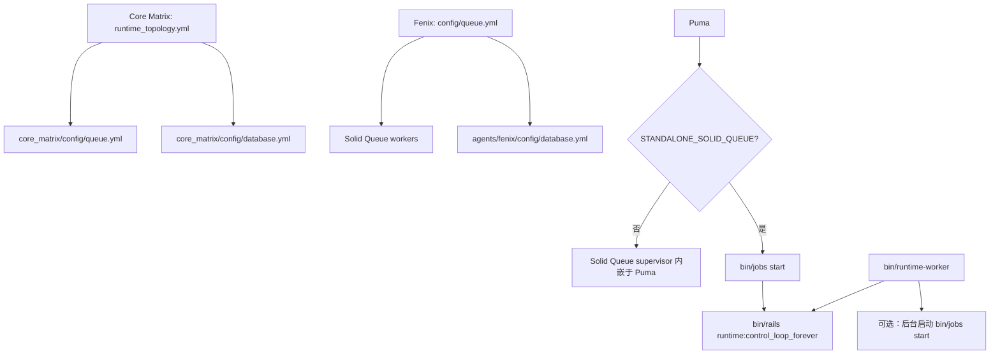

你当前位于目录导航中的 [运维参数：数据库池、队列与单机部署基线](https://github.com/jasl/cybros.new/blob/main/14-yun-wei-can-shu-shu-ju-ku-chi-dui-lie-yu-dan-ji-bu-shu-ji-xian)；本页只收束**数据库连接池、Solid Queue 线程/进程参数，以及 Fenix 的单机部署边界**，不展开更上游的运行时协议或提供方治理细节。Sources: [docs/operations/queue-topology-and-provider-governor.md](https://github.com/jasl/cybros.new/blob/main/docs/operations/queue-topology-and-provider-governor.md#L11-L18)

## 1. 作用域与基线关系

当前仓库的运维基线不是“单一默认值”，而是两条并行的约束链：`core_matrix` 以 `runtime_topology.yml` 驱动队列拓扑，`agents/fenix` 则把**单机运行时**、**队列工作进程**和**数据库池**显式拆开；两者都以 4 核 / 8GB 的入库默认作为起点，而不是终点。Sources: [docs/operations/queue-topology-and-provider-governor.md](https://github.com/jasl/cybros.new/blob/main/docs/operations/queue-topology-and-provider-governor.md#L11-L18) [core_matrix/env.sample](https://github.com/jasl/cybros.new/blob/main/core_matrix/env.sample#L122-L140) [agents/fenix/env.sample](https://github.com/jasl/cybros.new/blob/main/agents/fenix/env.sample#L85-L113)

这个关系图的重点是：`core_matrix` 的队列参数是“拓扑渲染结果”，而 `Fenix` 的队列与数据库参数是“运行时边界声明”；前者强调按工作类型分层，后者强调**单机持久状态不可被多个 worker pool 拆分**。Sources: [core_matrix/config/runtime_topology.yml](https://github.com/jasl/cybros.new/blob/main/core_matrix/config/runtime_topology.yml#L1-L66) [core_matrix/config/queue.yml](https://github.com/jasl/cybros.new/blob/main/core_matrix/config/queue.yml#L1-L37) [agents/fenix/config/queue.yml](https://github.com/jasl/cybros.new/blob/main/agents/fenix/config/queue.yml#L1-L35) [agents/fenix/bin/runtime-worker](https://github.com/jasl/cybros.new/blob/main/agents/fenix/bin/runtime-worker#L1-L27)

如果你要继续追踪“队列如何分层”和“运行时生命周期如何闭环”，下一步建议顺序阅读 [队列拓扑与提供方准入控制](https://github.com/jasl/cybros.new/blob/main/8-dui-lie-tuo-bu-yu-ti-gong-fang-zhun-ru-kong-zhi) 与 [运行时契约：注册、配对与控制循环](https://github.com/jasl/cybros.new/blob/main/10-yun-xing-shi-qi-yue-zhu-ce-pei-dui-yu-kong-zhi-xun-huan)。Sources: [docs/operations/queue-topology-and-provider-governor.md](https://github.com/jasl/cybros.new/blob/main/docs/operations/queue-topology-and-provider-governor.md#L19-L40) [agents/fenix/README.md](https://github.com/jasl/cybros.new/blob/main/agents/fenix/README.md#L103-L132)

## 2. Core Matrix：队列拓扑与数据库池

`core_matrix` 的队列配置不是手写静态表，而是从 `config/runtime_topology.yml` 读取 `llm_queues` 与 `shared_queues` 后渲染到 `config/queue.yml`；因此，线程数、进程数和轮询间隔都以拓扑文件为源头，`queue.yml` 只是落地目标。Sources: [core_matrix/config/runtime_topology.yml](https://github.com/jasl/cybros.new/blob/main/core_matrix/config/runtime_topology.yml#L1-L66) [core_matrix/config/queue.yml](https://github.com/jasl/cybros.new/blob/main/core_matrix/config/queue.yml#L1-L37)

| 队列组 | 队列名 | 默认线程 | 默认进程 | 环境变量前缀 | 用途定位 |
|---|---:|---:|---:|---|---|
| LLM | `llm_codex_subscription` | 2 | 1 | `SQ_THREADS_LLM_CODEX_SUBSCRIPTION` / `SQ_PROCESSES_LLM_CODEX_SUBSCRIPTION` | 订阅型 LLM 请求 |
| LLM | `llm_openai` | 3 | 1 | `SQ_THREADS_LLM_OPENAI` / `SQ_PROCESSES_LLM_OPENAI` | OpenAI 请求 |
| LLM | `llm_openrouter` | 2 | 1 | `SQ_THREADS_LLM_OPENROUTER` / `SQ_PROCESSES_LLM_OPENROUTER` | OpenRouter 请求 |
| LLM | `llm_dev` | 1 | 1 | `SQ_THREADS_LLM_DEV` / `SQ_PROCESSES_LLM_DEV` | 开发提供方 |
| LLM | `llm_local` | 1 | 1 | `SQ_THREADS_LLM_LOCAL` / `SQ_PROCESSES_LLM_LOCAL` | 本地提供方 |
| Shared | `tool_calls` | 6 | 1 | `SQ_THREADS_TOOL_CALLS` / `SQ_PROCESSES_TOOL_CALLS` | 工具调用 |
| Shared | `workflow_default` | 3 | 1 | `SQ_THREADS_WORKFLOW_DEFAULT` / `SQ_PROCESSES_WORKFLOW_DEFAULT` | 工作流协调 |
| Shared | `maintenance` | 1 | 1 | `SQ_THREADS_MAINTENANCE` / `SQ_PROCESSES_MAINTENANCE` | 维护任务 |

上表说明的关键不是“线程越多越好”，而是**每类工作负载拥有独立的队列边界**；其中 `turn_step` 节点会路由到 `llm_<resolved_provider_handle>`，`tool_call` 节点路由到 `tool_calls`，工作流协调与维护则分别落在 `workflow_default` 与 `maintenance`。Sources: [docs/operations/queue-topology-and-provider-governor.md](https://github.com/jasl/cybros.new/blob/main/docs/operations/queue-topology-and-provider-governor.md#L24-L40) [core_matrix/config/runtime_topology.yml](https://github.com/jasl/cybros.new/blob/main/core_matrix/config/runtime_topology.yml#L7-L65)

`core_matrix/config/database.yml` 采用的是统一的 Rails `pool` 基线：默认优先读取 `RAILS_DB_POOL`，否则回退到 `RAILS_MAX_THREADS`，再否则使用 16；这意味着 `primary`、`queue` 与 `cable` 并不是各自独立推导池大小，而是共享同一套连接池默认。Sources: [core_matrix/config/database.yml](https://github.com/jasl/cybros.new/blob/main/core_matrix/config/database.yml#L15-L20) [core_matrix/config/database.yml](https://github.com/jasl/cybros.new/blob/main/core_matrix/config/database.yml#L22-L45) [core_matrix/config/database.yml](https://github.com/jasl/cybros.new/blob/main/core_matrix/config/database.yml#L88-L103)

## 3. Fenix：单机部署边界、队列与数据库池

`Fenix` 的当前基线是**单机型运行时**，不是无状态水平 worker 池；仓库中的说明已经把这一点写死在文档和配置里，并明确要求将其视为“向一台机器上扩展”，而不是“多机横向拆分”的起点。Sources: [docs/operations/queue-topology-and-provider-governor.md](https://github.com/jasl/cybros.new/blob/main/docs/operations/queue-topology-and-provider-governor.md#L77-L90) [agents/fenix/README.md](https://github.com/jasl/cybros.new/blob/main/agents/fenix/README.md#L123-L132)

| 维度 | 默认值 / 约束 | 配置落点 | 解释 |
|---|---|---|---|
| 主库池 | `FENIX_PRIMARY_DB_POOL=8` | `agents/fenix/config/database.yml` | 主业务连接池 |
| 队列池 | `FENIX_QUEUE_DB_POOL=16` | `agents/fenix/config/database.yml` | Solid Queue 连接池 |
| 部署模式 | Puma 默认内嵌 Solid Queue supervisor | `agents/fenix/config/puma.rb` | 单服务部署默认形态 |
| 独立队列模式 | `STANDALONE_SOLID_QUEUE=true` | `agents/fenix/config/puma.rb` / `agents/fenix/bin/runtime-worker` | 将队列处理移出 Puma |
| 运行器封装 | `bin/runtime-worker` | `agents/fenix/bin/runtime-worker` | 可选地先起 `bin/jobs start`，再进入控制循环 |

Fenix 的数据库池被显式拆成 `primary` 与 `queue` 两个池，且在 development、test、production 三个环境里都保留同样的独立上限；这比 Core Matrix 更直接地表达了“主业务读写”和“队列消费”是两条不同的资源线。Sources: [agents/fenix/config/database.yml](https://github.com/jasl/cybros.new/blob/main/agents/fenix/config/database.yml#L11-L21) [agents/fenix/config/database.yml](https://github.com/jasl/cybros.new/blob/main/agents/fenix/config/database.yml#L25-L35) [agents/fenix/config/database.yml](https://github.com/jasl/cybros.new/blob/main/agents/fenix/config/database.yml#L42-L52)

Fenix 的队列拓扑同样是按职责分层：`runtime_prepare_round`、`runtime_pure_tools`、`runtime_process_tools`、`runtime_control` 与 `maintenance` 分别拥有独立的线程与进程默认值；其中注册表型工具、浏览器会话、命令句柄与进程句柄都被归入 `runtime_process_tools`，因此该队列必须保持保守。Sources: [agents/fenix/config/queue.yml](https://github.com/jasl/cybros.new/blob/main/agents/fenix/config/queue.yml#L1-L25) [docs/operations/queue-topology-and-provider-governor.md](https://github.com/jasl/cybros.new/blob/main/docs/operations/queue-topology-and-provider-governor.md#L91-L126)

`bin/runtime-worker` 的行为是这个基线的核心：当 `STANDALONE_SOLID_QUEUE` 为真时，它会先后台启动 `bin/jobs start`，再执行 `bin/rails runtime:control_loop_forever`；否则它只保留控制循环。换句话说，**是否把 Solid Queue 从 Puma 中拆出去**，由这个开关决定，而不是由部署脚本临时拼接。Sources: [agents/fenix/bin/runtime-worker](https://github.com/jasl/cybros.new/blob/main/agents/fenix/bin/runtime-worker#L1-L27) [agents/fenix/config/puma.rb](https://github.com/jasl/cybros.new/blob/main/agents/fenix/config/puma.rb#L25-L38) [agents/fenix/README.md](https://github.com/jasl/cybros.new/blob/main/agents/fenix/README.md#L103-L132)

## 4. 启动模式选择：什么时候内嵌，什么时候拆分

| 模式 | Puma | `bin/jobs start` | `runtime:control_loop_forever` | 适用性 | 风险点 |
|---|---|---|---|---|---|
| 默认单服务 | 内嵌 Solid Queue supervisor | 不单独启动 | 需要额外启动 | 推荐基线 | 进程数少、结构最简单 |
| 独立队列模式 | 不内嵌 | 单独启动 | 单独启动 | 需要拆分 Web 与 Worker 时 | 需要维护两个长期进程 |
| `bin/runtime-worker` 封装 | 按开关决定 | 由封装脚本决定 | 必定启动 | 外部运行时/容器化场景 | 需要保证同一运行时只保留一套 worker |

`Fenix` 明确要求：**每个 Dockerized runtime 只运行一套 worker 组**。如果在同一运行时上起第二个 `bin/runtime-worker`，或者再起一组独立的 `bin/jobs start`，注册表型浏览器会话、命令句柄与进程句柄会被拆到不同 pool，后续工具调用就可能出现 `unknown ... session/run` 一类校验失败。Sources: [docs/operations/queue-topology-and-provider-governor.md](https://github.com/jasl/cybros.new/blob/main/docs/operations/queue-topology-and-provider-governor.md#L117-L126) [agents/fenix/README.md](https://github.com/jasl/cybros.new/blob/main/agents/fenix/README.md#L127-L132)

## 5. 调参顺序：先池，再队列，最后才是扩容形态

在这个仓库里，调参顺序应当保持固定：先把数据库池分别校准，再确认队列线程/进程是否足够，最后才决定是否把 Solid Queue 从 Puma 中拆出来；不要反过来先拉高队列并发，再回头补连接池。Sources: [core_matrix/config/database.yml](https://github.com/jasl/cybros.new/blob/main/core_matrix/config/database.yml#L15-L20) [agents/fenix/config/database.yml](https://github.com/jasl/cybros.new/blob/main/agents/fenix/config/database.yml#L15-L20) [agents/fenix/config/puma.rb](https://github.com/jasl/cybros.new/blob/main/agents/fenix/config/puma.rb#L25-L38)

| 优先级 | 调整对象 | 参考基线 | 调整原则 |
|---|---|---|---|
| 1 | 数据库池 | Core Matrix 统一 `pool`；Fenix `8 / 16` | 先保证连接数不成为瓶颈 |
| 2 | 队列线程/进程 | 各队列默认值 | 按实际排队深度分层放大 |
| 3 | 部署形态 | 内嵌或独立 Solid Queue | 只有当进程职责必须拆分时才切换 |

仓库已经给出一个可直接起步的 32 核单机档位，但文本也明确它只是“starting point, not an endpoint”；对应地，Fenix 的 `env.sample` 还给出了 16 核生产机的放大提示，强调应当**先加进程，再谨慎增加线程**。Sources: [docs/operations/queue-topology-and-provider-governor.md](https://github.com/jasl/cybros.new/blob/main/docs/operations/queue-topology-and-provider-governor.md#L137-L190) [agents/fenix/env.sample](https://github.com/jasl/cybros.new/blob/main/agents/fenix/env.sample#L129-L139)

## 6. 当前页的落地结论

如果你只需要一条可执行的运维结论，那么就是：**Core Matrix 负责按工作类型分层的队列拓扑，Fenix 负责单机运行时的持久状态与队列进程边界；两边的数据库池都应独立看待，且 Fenix 在同一运行时上只能有一套 worker 组**。Sources: [docs/operations/queue-topology-and-provider-governor.md](https://github.com/jasl/cybros.new/blob/main/docs/operations/queue-topology-and-provider-governor.md#L19-L40) [docs/operations/queue-topology-and-provider-governor.md](https://github.com/jasl/cybros.new/blob/main/docs/operations/queue-topology-and-provider-governor.md#L77-L135) [agents/fenix/bin/runtime-worker](https://github.com/jasl/cybros.new/blob/main/agents/fenix/bin/runtime-worker#L1-L27)