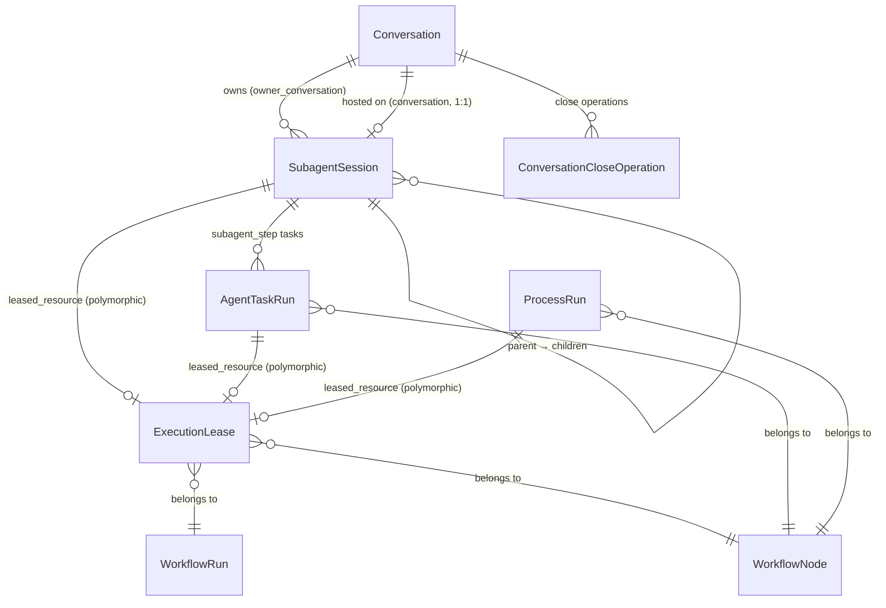
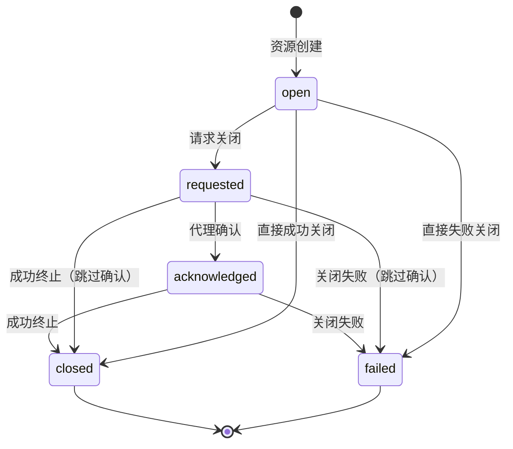
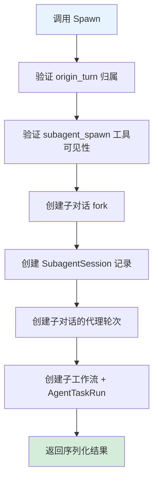
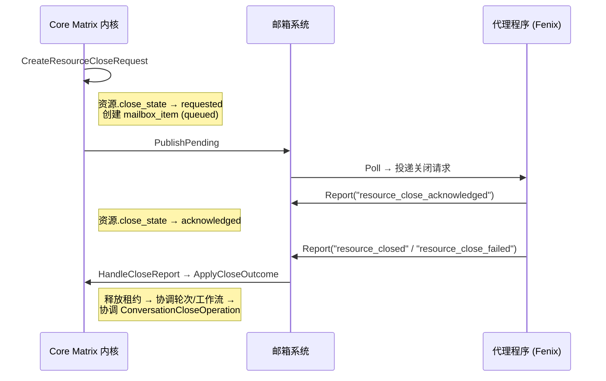
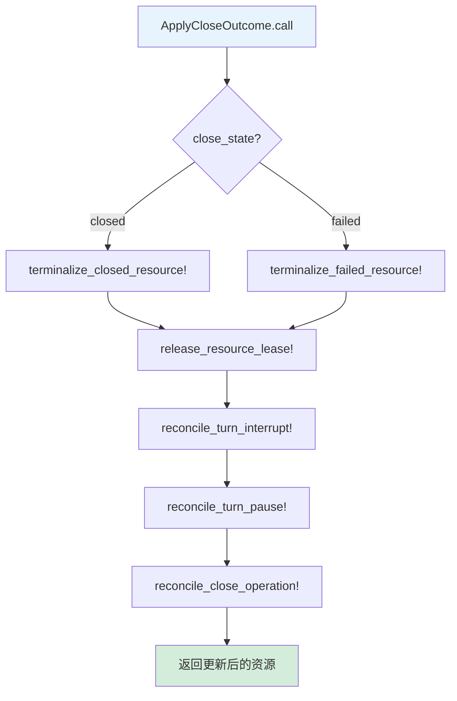
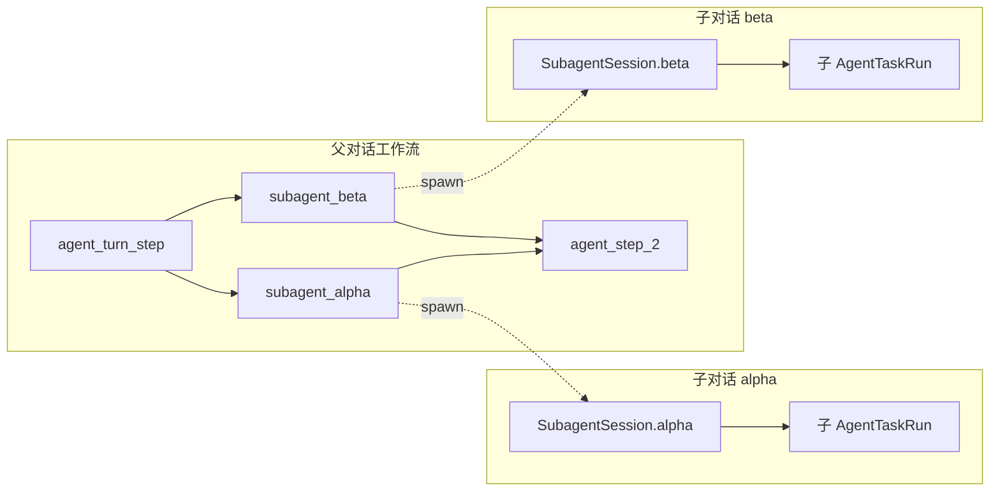
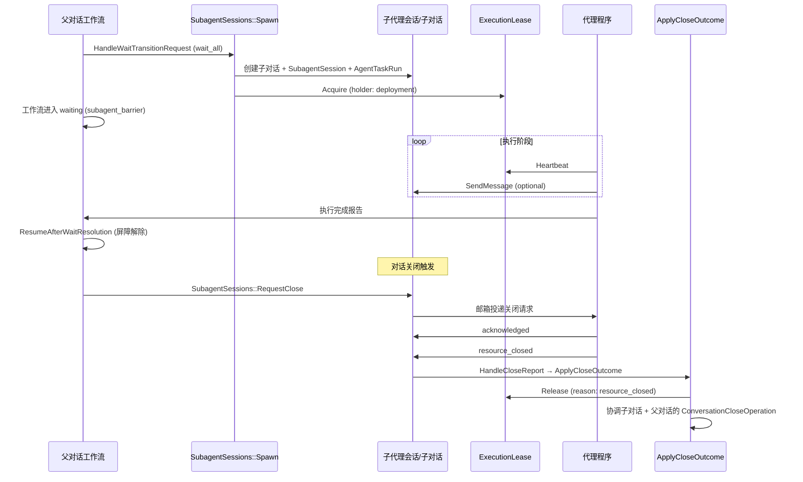

Core Matrix 的运行时资源层由三个互锁概念组成：**子代理会话 (SubagentSession)** 实现代理任务的分层委派与结果聚合，**执行租约 (ExecutionLease)** 提供分布式独占控制以防止并发冲突，**可关闭资源路由 (ClosableResourceRouting)** 则统一 `AgentTaskRun`、`ProcessRun`、`SubagentSession` 三类运行时资源的关闭协议。三者协同构成一个从「资源创建 → 独占占用 → 优雅/强制关闭 → 上游状态协调」的完整生命周期管理框架，是理解系统如何安全回收运行时资源的关键入口。

Sources: [subagent_session.rb](https://github.com/jasl/cybros.new/blob/main/core_matrix/app/models/subagent_session.rb#L1-L12), [execution_lease.rb](https://github.com/jasl/cybros.new/blob/main/core_matrix/app/models/execution_lease.rb#L1-L24), [closable_runtime_resource.rb](https://github.com/jasl/cybros.new/blob/main/core_matrix/app/models/concerns/closable_runtime_resource.rb#L1-L18)

## 领域模型关系总览

系统中的三类可关闭资源共享同一套关闭状态机（由 `ClosableRuntimeResource` concern 统一注入），但各自承载不同的运行时语义：`AgentTaskRun` 代表工作流 DAG 中的任务执行单元，`ProcessRun` 代表后台进程（如 `background_service`），`SubagentSession` 则桥接父对话与子对话，实现嵌套的代理委派。



上图揭示了几个关键结构约束：每个子代理会话通过 `conversation_id` 唯一索引绑定到一个子对话，同时通过 `owner_conversation_id` 关联到其拥有者对话。`SubagentSession` 递归引用自身形成树状嵌套结构（`parent_subagent_session_id`），`depth` 字段记录嵌套层级。`ExecutionLease` 通过多态关联 (`leased_resource`) 持有三种资源类型的独占锁，数据库层面以条件唯一索引 `(leased_resource_type, leased_resource_id) WHERE released_at IS NULL` 保证同一时刻每个活跃资源最多只有一个未释放的租约。

Sources: [schema.rb](https://github.com/jasl/cybros.new/blob/main/core_matrix/db/schema.rb#L976-L1004), [schema.rb](https://github.com/jasl/cybros.new/blob/main/core_matrix/db/schema.rb#L547-L568), [conversation.rb](https://github.com/jasl/cybros.new/blob/main/core_matrix/app/models/conversation.rb#L68-L75)

## ClosableRuntimeResource：统一的关闭状态机

`ClosableRuntimeResource` 是一个 ActiveRecord concern，为所有可关闭资源注入一套五态关闭状态机和配套验证规则。其核心设计原则是**关闭元数据的生命周期配对严格性**——状态的每一次推进都必须携带完整的审计字段。



状态推进时的字段约束由 `close_lifecycle_pairings` 校验器严格执行：

| 状态 | 必须存在的字段 | 必须为空的字段 |
|------|-------------|-------------|
| `open` | — | 全部关闭元数据 |
| `requested` | `close_reason_kind`, `close_requested_at` | `close_outcome_kind` |
| `acknowledged` | 上述 + `close_acknowledged_at` | `close_outcome_kind` |
| `closed` / `failed` | 上述 + `close_outcome_kind`, `close_outcome_payload` | — |

这套严格的配对规则确保关闭过程可审计、可追溯。`close_grace_deadline_at` 和 `close_force_deadline_at` 为可选字段，用于控制优雅关闭→强制关闭的升级时间窗口（默认 grace 为 30 秒，force 为 60 秒）。

Sources: [closable_runtime_resource.rb](https://github.com/jasl/cybros.new/blob/main/core_matrix/app/models/concerns/closable_runtime_resource.rb#L1-L59), [request_resource_closes.rb](https://github.com/jasl/cybros.new/blob/main/core_matrix/app/services/conversations/request_resource_closes.rb#L1-L53)

## SubagentSession：分层代理委派的会话管理

### 核心职责与数据结构

`SubagentSession` 将一个**子对话**（`conversation`，类型为 `fork`，`addressability: agent_addressable`）绑定到其**拥有者对话**（`owner_conversation`），形成一个具有明确所有权边界的委派单元。其关键字段包括：

| 字段 | 用途 |
|------|------|
| `scope` | `turn`（绑定到特定轮次）或 `conversation`（绑定到整个对话） |
| `profile_key` | 使用的运行时 profile（如 `main`、`researcher`） |
| `depth` | 嵌套层级（根为 0，每层 +1，由验证器保证 `depth == parent.depth + 1`） |
| `observed_status` | 代理报告的运行状态：`idle` / `running` / `waiting` / `completed` / `failed` / `interrupted` |

`SubagentSession` 通过 `DERIVED_CLOSE_STATUS_BY_CLOSE_STATE` 将内部关闭状态映射为面向消费者的 `derived_close_status`：`open` → `"open"`，`requested`/`acknowledged` → `"close_requested"`，`closed`/`failed` → `"closed"`。这种双重状态模型（关闭状态 + 观测状态）使得系统可以同时表达「内核视角的关闭进度」和「代理视角的执行状态」。

Sources: [subagent_session.rb](https://github.com/jasl/cybros.new/blob/main/core_matrix/app/models/subagent_session.rb#L1-L84)

### Spawn 流程：从委派意图到完整执行上下文

`SubagentSessions::Spawn` 是子代理会话的创建入口，其执行过程在单个事务内完成所有资源的原子化初始化：



整个流程在 `Conversations::WithMutableStateLock` 保护下执行，确保父对话处于可变状态（`retained` + `active` + 非 `closing`）。Spawn 的关键步骤包括：

1. **Profile 解析**：若未指定 `profile_key`，从 runtime capability contract 中查找标记为 `default_subagent_profile: true` 的 profile；若无标记，则选择非交互式 profile 的第一个键。若指定了 `DEFAULT_SUBAGENT_PROFILE_ALIAS`（即 `default`），则自动解析为上述默认 profile。

2. **深度继承**：若父对话自身也是子代理会话的宿主，则 `depth = parent.depth + 1`，否则 `depth = 0`。

3. **工作流创建**：通过 `Workflows::CreateForTurn` 为子对话创建独立工作流，`root_node_type: "agent_task_run"`，`decision_source: "system"`，关联的 `origin_turn` 指向父对话中触发 spawn 的原始轮次。

Sources: [spawn.rb](https://github.com/jasl/cybros.new/blob/main/core_matrix/app/services/subagent_sessions/spawn.rb#L1-L91), [spawn.rb](https://github.com/jasl/cybros.new/blob/main/core_matrix/app/services/subagent_sessions/spawn.rb#L110-L160)

### 消息投递与会话可变性保护

`SubagentSessions::SendMessage` 实现了从外部向子代理会话投递消息的能力。投递方分为三类：`owner_agent`（来自父对话的代理）、`subagent_self`（子代理自身）、`system`（系统消息）。每种发送方都有严格的身份校验——`owner_agent` 必须匹配 `subagent_session.owner_conversation`，`subagent_self` 必须匹配子对话本身。

消息投递前会执行双重保护：第一层通过 `WithMutableStateLock` 确保对话处于活跃可变状态，第二层通过 `validate_session_mutable!` 确保子代理会话的关闭状态为 `open`（一旦进入 `requested`/`acknowledged`/`closed`/`failed` 即拒绝投递）。此外还通过 `ValidateAddressability` 校验对话的 `addressability` 为 `agent_addressable`（仅允许代理类型的发送方投递）。

Sources: [send_message.rb](https://github.com/jasl/cybros.new/blob/main/core_matrix/app/services/subagent_sessions/send_message.rb#L1-L125), [validate_addressability.rb](https://github.com/jasl/cybros.new/blob/main/core_matrix/app/services/subagent_sessions/validate_addressability.rb#L1-L32)

### OwnedTree：递归子代理树的遍历

`SubagentSessions::OwnedTree` 实现了一种广度优先遍历算法，用于收集某个对话拥有的**全部子代理会话**（包括多层嵌套）。算法使用 `frontier_owner_ids` 作为广度优先队列，逐层展开子代理会话并记录到 `collected` 数组中，同时通过 `seen_session_ids` 集合防止循环引用。

```ruby
# OwnedTree 的核心 BFS 遍历（伪代码）
frontier = [owner_conversation.id]
sessions = []
while frontier.any?
  batch = SubagentSession.where(owner_conversation_id: frontier)
  frontier = []
  batch.each do |session|
    sessions << session unless seen[session.id]
    frontier << session.conversation_id  # 子对话可能拥有自己的子代理
  end
end
```

该遍历在 `Conversations::ProgressCloseRequests` 和 `BlockerSnapshotQuery` 中被广泛使用——关闭对话时需要遍历整个子代理树来发出关闭请求，阻塞快照查询需要统计所有运行中的子代理数量。

Sources: [owned_tree.rb](https://github.com/jasl/cybros.new/blob/main/core_matrix/app/services/subagent_sessions/owned_tree.rb#L1-L50), [progress_close_requests.rb](https://github.com/jasl/cybros.new/blob/main/core_matrix/app/services/conversations/progress_close_requests.rb#L30-L39), [blocker_snapshot_query.rb](https://github.com/jasl/cybros.new/blob/main/core_matrix/app/queries/conversations/blocker_snapshot_query.rb#L59-L66)

### Wait 机制：同步等待子代理终止

`SubagentSessions::Wait` 提供了一个基于轮询的同步等待原语，在指定的超时时间内持续 reload 子代理会话状态直到达到终止条件。终止判定包含两个维度：**关闭状态**（`closed` 或 `failed`）和**观测状态**（`completed`、`failed`、`interrupted`）。

该机制主要在代理程序本地使用（如 fenix 代理在执行 `subagent_wait_all` 工具调用时的阻塞等待）。返回结果包含 `timed_out` 标志、`derived_close_status`、`observed_status` 和 `close_state`，使调用方可以区分「正常完成但超时」和「实际已完成」的语义。

Sources: [wait.rb](https://github.com/jasl/cybros.new/blob/main/core_matrix/app/services/subagent_sessions/wait.rb#L1-L43)

## ExecutionLease：分布式独占控制原语

### 租约模型与字段语义

`ExecutionLease` 为运行时资源提供独占占用保证，防止同一资源被多个代理程序版本 (AgentProgramVersion) 或执行会话 (ExecutionSession) 并发操作。其核心字段语义如下：

| 字段 | 说明 |
|------|------|
| `holder_key` | 持有者标识（通常为 `AgentProgramVersion.public_id`） |
| `leased_resource` | 多态关联，指向 `AgentTaskRun`/`ProcessRun`/`SubagentSession` |
| `acquired_at` | 租约获取时间 |
| `last_heartbeat_at` | 最后心跳时间 |
| `heartbeat_timeout_seconds` | 心跳超时阈值（秒） |
| `released_at` | 释放时间（NULL 表示活跃） |
| `release_reason` | 释放原因（`resource_closed`、`resource_close_failed`、`heartbeat_timeout`） |
| `metadata` | 附带元数据（JSONB） |

`active?` 判定简单而精确：`released_at.blank?`。`stale?` 判定则通过 `last_heartbeat_at < now - heartbeat_timeout_seconds` 实现超时检测。数据库层面的条件唯一索引 `idx_execution_leases_active_resource` 确保同一资源不会有多个活跃租约。

Sources: [execution_lease.rb](https://github.com/jasl/cybros.new/blob/main/core_matrix/app/models/execution_lease.rb#L1-L46), [schema.rb](https://github.com/jasl/cybros.new/blob/main/core_matrix/db/schema.rb#L547-L568)

### Acquire / Heartbeat / Release 三段式协议

租约的生命周期遵循严格的三段式协议，每一步都包含持有者身份校验：

**Acquire**（`Leases::Acquire`）在事务内先以 `SELECT ... FOR UPDATE` 锁定已有活跃租约，若存在且未过期则抛出 `LeaseConflictError`；若存在但已过期（`stale?`），先自动释放旧租约（`release_reason: heartbeat_timeout`）再创建新租约。

**Heartbeat**（`Leases::Heartbeat`）在行锁保护下校验 `holder_key` 一致性和租约活跃状态，然后检测是否超时——若已超时则直接释放租约并抛出 `StaleLeaseError`，否则更新 `last_heartbeat_at`。

**Release**（`Leases::Release`）在行锁保护下校验持有者身份和活跃状态后，设置 `released_at` 和 `release_reason`。

三段式协议保证了：即使持有者进程意外终止（心跳超时），新请求者也能通过 stale 检测安全接管资源。`ApplyCloseOutcome` 在关闭资源时通过 `release_resource_lease!` 自动释放关联租约（包含 `ArgumentError` 的容错处理，以应对租约已被提前释放的情况）。

Sources: [acquire.rb](https://github.com/jasl/cybros.new/blob/main/core_matrix/app/services/leases/acquire.rb#L1-L52), [heartbeat.rb](https://github.com/jasl/cybros.new/blob/main/core_matrix/app/services/leases/heartbeat.rb#L1-L39), [release.rb](https://github.com/jasl/cybros.new/blob/main/core_matrix/app/services/leases/release.rb#L1-L27), [apply_close_outcome.rb](https://github.com/jasl/cybros.new/blob/main/core_matrix/app/services/agent_control/apply_close_outcome.rb#L107-L121)

## 可关闭资源路由：关闭协议的统一分发层

### ClosableResourceRegistry：类型注册表

`ClosableResourceRegistry` 维护了系统支持的三种可关闭资源类型的注册表：

```ruby
RESOURCE_TYPES = {
  "AgentTaskRun" => AgentTaskRun,
  "ProcessRun"   => ProcessRun,
  "SubagentSession" => SubagentSession,
}.freeze
```

该注册表为关闭协议提供了类型安全的查找机制（`find` / `find!`）和类型兼容性校验（`supported?`），确保只有注册过的资源类型才能进入关闭流程。

Sources: [closable_resource_registry.rb](https://github.com/jasl/cybros.new/blob/main/core_matrix/app/services/agent_control/closable_resource_registry.rb#L1-L33)

### ClosableResourceRouting：上下文解析路由

`ClosableResourceRouting` 是一套纯函数模块，负责从任意可关闭资源中解析出**执行运行时**、**所属对话**、**所属轮次**和**所属代理程序**。其解析策略因资源类型而异：

| 资源类型 | 对话解析 | 轮次解析 | 代理程序解析 |
|---------|---------|---------|------------|
| `SubagentSession` | `owner_conversation` | `origin_turn` | `turn.agent_program_version.agent_program` |
| `AgentTaskRun` | `conversation` | `turn` | `agent_program` |
| `ProcessRun` | `conversation` | `turn` | `turn.agent_program_version.agent_program` |

该路由模块在 `CreateResourceCloseRequest` 中用于确定关闭请求的目标投递端点，在 `ApplyCloseOutcome` 中用于确定关闭后需要协调的上游对话和轮次。

Sources: [closable_resource_routing.rb](https://github.com/jasl/cybros.new/blob/main/core_matrix/app/services/agent_control/closable_resource_routing.rb#L1-L35)

### 关闭协议的完整生命周期



关闭协议的关键步骤说明：

1. **创建关闭请求**（`CreateResourceCloseRequest`）：将资源状态推进到 `requested`，创建邮箱条目（`item_type: resource_close_request`），设置 `grace_deadline_at` 和 `force_deadline_at`。邮箱条目携带完整的关闭上下文（资源类型/ID、严格级别、截止时间）。

2. **代理确认**（`HandleCloseReport` → `handle_resource_close_acknowledged!`）：代理程序收到关闭请求后发送确认，资源状态推进到 `acknowledged`，邮箱条目状态更新为 `acked`。

3. **终态报告**（`HandleCloseReport` → `handle_terminal_close_report!`）：代理完成清理后发送终态报告（`resource_closed` 或 `resource_close_failed`），触发 `ApplyCloseOutcome` 执行完整的善后协调。

4. **超时升级**（`ProgressCloseRequest`）：内核定时推进关闭请求，检查 grace/force 截止时间。Grace 截止后，请求从 `graceful` 升级为 `forced`（重新排队）；force 截止后，内核直接以 `timed_out_forced` 终态关闭资源。

Sources: [create_resource_close_request.rb](https://github.com/jasl/cybros.new/blob/main/core_matrix/app/services/agent_control/create_resource_close_request.rb#L1-L121), [handle_close_report.rb](https://github.com/jasl/cybros.new/blob/main/core_matrix/app/services/agent_control/handle_close_report.rb#L1-L96), [progress_close_request.rb](https://github.com/jasl/cybros.new/blob/main/core_matrix/app/services/agent_control/progress_close_request.rb#L1-L83)

## ApplyCloseOutcome：关闭终态的善后协调

`ApplyCloseOutcome` 是关闭协议中最复杂的协调器，在资源达到终态（`closed` 或 `failed`）后执行四个层级的善后操作：



### 资源终态化（按类型）

**SubagentSession** 终态化最为简洁——仅更新 `observed_status`：关闭成功时设为 `completed`（除非是 `turn_interrupt`/`turn_pause` 请求则设为 `interrupted`），关闭失败时设为 `failed`。

**AgentTaskRun** 终态化最为复杂——更新 `lifecycle_state`（`canceled`/`interrupted`/`failed`）、终态化所有运行中的 `ToolInvocation`（设置 `status` 和错误信息）、终态化所有运行中的 `CommandRun`、协调工作流节点状态、协调工作流运行状态、协调轮次状态。对于 `turn_pause` 请求的特殊处理：工作流节点被重置为 `queued`（而非终止），以便暂停恢复后重新执行。

**ProcessRun** 终态化涉及进程运行时的特殊语义——关闭成功时设置 `lifecycle_state: "stopped"`（若 `close_outcome_kind: "residual_abandoned"` 则设为 `"lost"`），关闭失败时设为 `"lost"`，同时广播进程终止事件。

### 关闭协调的对话范围

`conversations_for_close_reconciliation` 收集需要协调的所有对话。对于 `SubagentSession`，需要协调**两个对话**：`owner_conversation`（父对话，通过 `ClosableResourceRouting` 解析）和 `conversation`（子对话自身）。这意味着子代理的关闭会同时推进父对话和子对话的关闭操作状态。

Sources: [apply_close_outcome.rb](https://github.com/jasl/cybros.new/blob/main/core_matrix/app/services/agent_control/apply_close_outcome.rb#L1-L105), [apply_close_outcome.rb](https://github.com/jasl/cybros.new/blob/main/core_matrix/app/services/agent_control/apply_close_outcome.rb#L320-L327)

## 子代理屏障：工作流中的并行等待语义

### wait_all 屏障机制

当工作流中的代理任务通过 `wait_transition_requested` 提交一个包含 `subagent_spawn` 意图的批量操作时，`Workflows::HandleWaitTransitionRequest` 会执行以下流程：

1. 调用 `IntentBatchMaterialization` 将批量意图转化为 DAG 节点
2. 对每个 `subagent_spawn` 节点调用 `SubagentSessions::Spawn`，创建子代理会话及其完整的执行上下文
3. 若该 stage 的 `completion_barrier` 为 `wait_all`，工作流进入 `waiting` 状态，`wait_reason_kind: "subagent_barrier"`
4. 工作流记录阻塞资源信息，包含所有子代理会话 ID、批次 ID、屏障 artifact 键等



### 屏障解析与工作流恢复

`WorkflowWaitSnapshot.resolved_for?` 中对 `subagent_barrier` 的解析逻辑为：检查所有 `subagent_session_ids` 对应的会话是否都已达到终端状态（`terminal_for_wait?` 判定：关闭终态 或 观测状态为 `completed`/`failed`/`interrupted`）。只有全部子代理都终止后，屏障才被解除。

`Workflows::ResumeAfterWaitResolution` 在屏障解除后执行恢复：将工作流状态重置为 `ready`，收集屏障涉及的子代理节点作为 `predecessor_nodes`，然后调用 `ReEnterAgent` 创建后续执行步骤。验收场景 `subagent_wait_all_validation` 完整验证了这一流程——两个并行子代理全部完成后，DAG 中出现连接到后续节点 `agent_step_2` 的边，后续 `AgentTaskRun` 被创建为 `queued` 状态。

Sources: [handle_wait_transition_request.rb](https://github.com/jasl/cybros.new/blob/main/core_matrix/app/services/workflows/handle_wait_transition_request.rb#L69-L119), [workflow_wait_snapshot.rb](https://github.com/jasl/cybros.new/blob/main/core_matrix/app/models/workflow_wait_snapshot.rb#L82-L93), [resume_after_wait_resolution.rb](https://github.com/jasl/cybros.new/blob/main/core_matrix/app/services/workflows/resume_after_wait_resolution.rb#L1-L65), [subagent_wait_all_validation.rb](https://github.com/jasl/cybros.new/blob/main/acceptance/scenarios/subagent_wait_all_validation.rb#L341-L371)

## ConversationCloseOperation：对话级关闭的编排器

当对话请求归档或删除时（`Conversations::RequestClose`），系统创建 `ConversationCloseOperation` 来编排所有运行时资源的有序关闭。该操作的生命周期包括五个阶段：

| 阶段 | lifecycle_state | 含义 |
|------|----------------|------|
| 请求 | `requested` | 关闭操作已创建 |
| 静默 | `quiescing` | 正在等待活跃资源完成 |
| 处置 | `disposing` | 尚有尾部资源或依赖阻塞 |
| 降级 | `degraded` | 部分资源关闭失败 |
| 完成 | `completed` | 所有资源成功关闭 |

`ReconcileCloseOperation` 每次被调用时（通常由资源关闭的善后流程触发），会执行 `ProgressCloseRequests` 推进所有待关闭资源的状态，然后通过 `BlockerSnapshotQuery` 重新计算阻塞快照，据此决定关闭操作的生命周期状态转换。

阻塞快照将阻塞因素分为三个层次：
- **主线阻塞** (`mainline`)：活跃轮次、活跃工作流、活跃任务、阻塞式交互、运行中子代理——所有计数必须归零
- **尾部阻塞** (`tail`)：运行中后台进程、游离工具进程、降级关闭——用于判断是否进入 `disposing`/`degraded`
- **依赖阻塞** (`dependency`)：后代对话的 lineage 阻塞、根 lineage store 阻塞、变量/导入来源阻塞

对话关闭时，`RequestClose` 会遍历 `OwnedTree` 获取全部子代理会话（包括多层嵌套），对每个仍处于 `open` 状态的会话调用 `SubagentSessions::RequestClose`。这确保了对话关闭的级联传播——父对话的关闭会递归触发所有子代理会话的关闭请求。

Sources: [conversation_close_operation.rb](https://github.com/jasl/cybros.new/blob/main/core_matrix/app/models/conversation_close_operation.rb#L1-L65), [request_close.rb](https://github.com/jasl/cybros.new/blob/main/core_matrix/app/services/conversations/request_close.rb#L1-L155), [reconcile_close_operation.rb](https://github.com/jasl/cybros.new/blob/main/core_matrix/app/services/conversations/reconcile_close_operation.rb#L1-L68), [conversation_blocker_snapshot.rb](https://github.com/jasl/cybros.new/blob/main/core_matrix/app/models/conversation_blocker_snapshot.rb#L1-L156), [blocker_snapshot_query.rb](https://github.com/jasl/cybros.new/blob/main/core_matrix/app/queries/conversations/blocker_snapshot_query.rb#L1-L35)

## 三层协作的完整生命周期

以下时序图展示了一个典型的子代理会话从创建到关闭的完整生命周期：



整个流程体现了三层协作的核心设计理念：**SubagentSession** 管理语义层面的代理委派关系，**ExecutionLease** 管理物理层面的独占占用，**ClosableResourceRouting** 统一关闭协议的分发和协调。三者共同确保运行时资源从创建到回收的每个阶段都有明确的所有权边界和状态转换规则。

Sources: [apply_close_outcome.rb](https://github.com/jasl/cybros.new/blob/main/core_matrix/app/services/agent_control/apply_close_outcome.rb#L1-L44), [handle_close_report.rb](https://github.com/jasl/cybros.new/blob/main/core_matrix/app/services/agent_control/handle_close_report.rb#L1-L49), [workflow_wait_snapshot.rb](https://github.com/jasl/cybros.new/blob/main/core_matrix/app/models/workflow_wait_snapshot.rb#L67-L93)

## 延伸阅读

- **[工作流 DAG 执行引擎与调度器](https://github.com/jasl/cybros.new/blob/main/8-gong-zuo-liu-dag-zhi-xing-yin-qing-yu-diao-du-qi)** — 理解子代理屏障在工作流 DAG 中的位置和 wait_all 调度语义
- **[邮箱控制平面：消息投递、租赁与实时推送](https://github.com/jasl/cybros.new/blob/main/10-you-xiang-kong-zhi-ping-mian-xiao-xi-tou-di-zu-ren-yu-shi-shi-tui-song)** — 邮箱系统如何承载关闭请求的投递、确认和超时升级
- **[会话、轮次与对话树结构](https://github.com/jasl/cybros.new/blob/main/7-hui-hua-lun-ci-yu-dui-hua-shu-jie-gou)** — 子代理会话与对话 fork 结构的关系
- **[Provider 执行循环：轮次请求、工具调用与结果持久化](https://github.com/jasl/cybros.new/blob/main/9-provider-zhi-xing-xun-huan-lun-ci-qing-qiu-gong-ju-diao-yong-yu-jie-guo-chi-jiu-hua)** — 理解 AgentTaskRun 在执行循环中的角色
- **[Execution API：运行时资源控制接口](https://github.com/jasl/cybros.new/blob/main/25-execution-api-yun-xing-shi-zi-yuan-kong-zhi-jie-kou)** — 租约和进程运行时的外部 API 表面