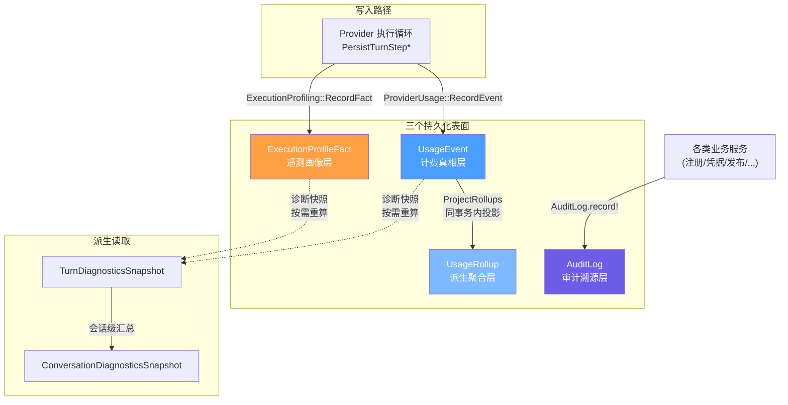
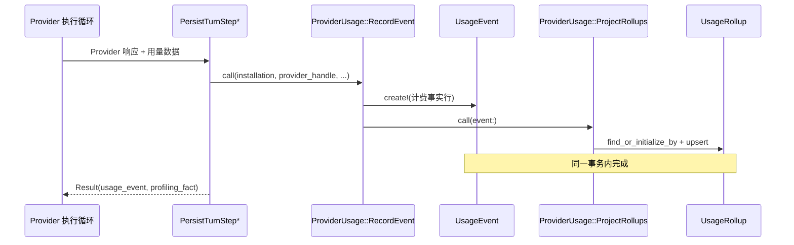
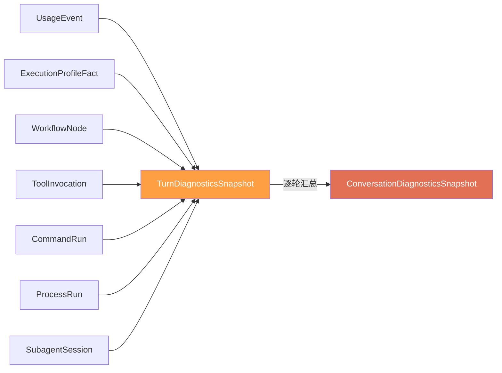

Core Matrix 将「谁在什么时候花了多少钱、执行了什么操作、谁做了什么变更」三个治理维度拆解为三个独立的持久化表面：**使用量事件**（`UsageEvent`）负责 Provider 级别的计费事实归档，**执行画像**（`ExecutionProfileFact`）负责运行时遥测与性能画像，**审计日志**（`AuditLog`）负责不可变的操作溯源。三者共享 installation 作用域隔离，但各自的数据生命周期、写入路径和查询模式完全正交——即使后续分析需要 JOIN 联查，存储层始终物理分离。这种「事件真相 + 派生聚合 + 独立遥测 + 审计溯源」四层分离的架构，是平台治理与合规分析的基石。

Sources: [usage_event.rb](https://github.com/jasl/cybros.new/blob/main/core_matrix/app/models/usage_event.rb#L1-L69), [execution_profile_fact.rb](https://github.com/jasl/cybros.new/blob/main/core_matrix/app/models/execution_profile_fact.rb#L1-L46), [audit_log.rb](https://github.com/jasl/cybros.new/blob/main/core_matrix/app/models/audit_log.rb#L1-L40)

## 架构总览：四个分离表面

三个表面与一个派生聚合之间的关系清晰明了：`UsageEvent` 是计费真相源，`UsageRollup` 是其派生投影，`ExecutionProfileFact` 是独立遥测，而诊断快照是从前两者按需计算的读模型。审计日志则由各类业务服务在执行关键操作时写入，与前三个表面完全解耦。

Sources: [persist_turn_step_success.rb](https://github.com/jasl/cybros.new/blob/main/core_matrix/app/services/provider_execution/persist_turn_step_success.rb#L28-L105), [persist_turn_step_failure.rb](https://github.com/jasl/cybros.new/blob/main/core_matrix/app/services/provider_execution/persist_turn_step_failure.rb#L20-L69), [persist_turn_step_yield.rb](https://github.com/jasl/cybros.new/blob/main/core_matrix/app/services/provider_execution/persist_turn_step_yield.rb#L29-L73)

---

## 使用量事件：Provider 计费的真相层

**`UsageEvent`** 是 Core Matrix 中 Provider 使用量计费的唯一权威数据源。每当 Provider 执行循环完成一个 turn step（无论成功、yield 工具调用还是失败），系统都会在事务内创建一条 `UsageEvent` 记录，将 Provider 返回的 token 用量、延迟和费用估算作为不可变事实持久化。

### 数据模型与维度

| 维度列 | 类型 | 说明 |
|---|---|---|
| `installation_id` | bigint, NOT NULL | 租户隔离边界 |
| `user_id` | bigint, nullable | 触发用户 |
| `workspace_id` | bigint, nullable | 工作区归属 |
| `conversation_id` | bigint, nullable | 会话标识（松散引用） |
| `turn_id` | bigint, nullable | 轮次标识（松散引用） |
| `workflow_node_key` | string, nullable | 工作流节点键 |
| `agent_program_id` | bigint, nullable | 代理程序 FK |
| `agent_program_version_id` | bigint, nullable | 代理程序版本 FK |
| `provider_handle` | string, NOT NULL | Provider 标识（如 `openai`） |
| `model_ref` | string, NOT NULL | 模型标识（如 `gpt-4o`） |
| `operation_kind` | enum, NOT NULL | 操作类型枚举 |
| `input_tokens` / `output_tokens` | integer, nullable | Token 用量 |
| `media_units` | integer, nullable | 媒体单位（图像/视频等） |
| `latency_ms` | integer, nullable | 端到端延迟（毫秒） |
| `estimated_cost` | decimal(12,6), nullable | 费用估算 |
| `success` | boolean, NOT NULL | 请求是否成功 |
| `entitlement_window_key` | string, nullable | 配额窗口键 |
| `occurred_at` | datetime, NOT NULL | 事件发生时间 |

`operation_kind` 枚举覆盖了七种 AI 操作类型：`text_generation`、`image_generation`、`video_generation`、`embeddings`、`speech`、`transcription`、`media_analysis`。当前 Provider 执行循环统一记录为 `text_generation`，后续图像/语音等操作类型将在相应能力落地后启用。

一个关键的设计决策是：**Provider 和模型标识以字符串原样保存为运行时观察到的事实**，而非在写入时重新校验当前 LLM 目录的合法性。这保证了当目录配置发生漂移时，历史使用量数据仍然准确可查。

Sources: [usage_event.rb](https://github.com/jasl/cybros.new/blob/main/core_matrix/app/models/usage_event.rb#L1-L69), [create_usage_events migration](https://github.com/jasl/cybros.new/blob/main/core_matrix/db/migrate/20260324090016_create_usage_events.rb#L1-L30)

### 写入路径：从 Provider 响应到持久化

使用量事件的写入发生在 Provider 执行循环的**终端持久化阶段**（`PersistTurnStepSuccess`、`PersistTurnStepYield`）。具体流程如下：

1. Provider 请求完成后，`normalize_usage` 将不同 API 的字段名（如 OpenAI 的 `prompt_tokens` → 统一的 `input_tokens`）归一化
2. 在 `WithFreshExecutionStateLock` 保护的事务内调用 `ProviderUsage::RecordEvent`
3. `RecordEvent` 创建 `UsageEvent` 行并**在同一事务内**调用 `ProviderUsage::ProjectRollups` 投影聚合
4. 事务提交后，使用量事实和聚合投影同时可见

Sources: [record_event.rb](https://github.com/jasl/cybros.new/blob/main/core_matrix/app/services/provider_usage/record_event.rb#L1-L58), [persist_turn_step_success.rb](https://github.com/jasl/cybros.new/blob/main/core_matrix/app/services/provider_execution/persist_turn_step_success.rb#L29-L56)

---

## 使用量聚合：时序桶投影

**`UsageRollup`** 是从 `UsageEvent` 派生的聚合表面，服务于报表查询和未来的配额/权益检查。它不是真相源——所有聚合数据都可以从 `UsageEvent` 重新计算。

### 桶类型与维度摘要

系统维护三种桶类型：

| 桶类型 (`bucket_kind`) | 桶键格式 (`bucket_key`) | 用途 |
|---|---|---|
| `hour` | `2026-04-03T14`（UTC） | 小时级细粒度聚合 |
| `day` | `2026-04-03`（UTC） | 日级聚合 |
| `rolling_window` | 由 `entitlement_window_key` 决定 | 配额窗口聚合（仅当事件携带 `entitlement_window_key` 时投影） |

聚合维度由 `DIMENSION_KEYS` 定义，包含 10 个维度：`user_id`、`workspace_id`、`conversation_id`、`turn_id`、`workflow_node_key`、`agent_program_id`、`agent_program_version_id`、`provider_handle`、`model_ref`、`operation_kind`。系统将这些维度值的 JSON 序列化后进行 SHA-256 哈希，生成 `dimension_digest`，配合 `(installation_id, bucket_kind, bucket_key)` 形成唯一约束。这一设计避免了在大量可空维度列上建立巨大的复合唯一索引。

### 聚合行为

`ProjectRollups` 采用**累加式**（additive）策略：每次投影都在现有聚合行上递增计数器（`event_count`、`success_count`、`failure_count`、`input_tokens_total` 等）。这意味着投影操作本身不是幂等的——同一事件重复投影会导致计数翻倍。当前设计中，每次 `RecordEvent` 调用恰好触发一次投影，因此不会出现重复。

Sources: [usage_rollup.rb](https://github.com/jasl/cybros.new/blob/main/core_matrix/app/models/usage_rollup.rb#L1-L80), [project_rollups.rb](https://github.com/jasl/cybros.new/blob/main/core_matrix/app/services/provider_usage/project_rollups.rb#L1-L84)

---

## 执行画像：运行时遥测表面

**`ExecutionProfileFact`** 回答的问题是「工作是怎么执行的」，而非「Provider 收了多少钱」。它与 `UsageEvent` 物理分离，但在后续分析中可以通过 `(conversation_id, turn_id, workflow_node_key)` 等维度进行关联。

### 画像事实类型

| `fact_kind` | 含义 | 典型 `fact_key` |
|---|---|---|
| `provider_request` | Provider 请求执行画像 | 工作流节点键 |
| `tool_call` | 工具调用画像 | 工具标识符 |
| `subagent_outcome` | 子代理结果画像 | 子代理角色 |
| `approval_wait` | 审批等待画像 | 审批门键 |
| `process_failure` | 进程失败画像 | 进程标签 |

### 记录时机与内容

执行画像在 Provider 执行循环的三个终端路径中均有记录：

**成功路径**（`PersistTurnStepSuccess`）记录 `fact_kind = provider_request`，metadata 包含：Provider 请求关联 ID、Provider/模型标识、Wire API 类型、实际发送的执行设置、硬性限制与建议提示、以及包含阈值评估的使用量评估报告。其中 `usage_evaluation` 会特别标注是否跨越了建议的上下文压缩阈值（`recommended_compaction_threshold`）。

**失败路径**（`PersistTurnStepFailure`）同样记录 `provider_request` 画像，但 `success = false`，metadata 包含错误类名和错误消息，同时触发工作流节点的失败阻塞策略（`BlockNodeForFailure`）。

**工具调用 yield 路径**（`PersistTurnStepYield`）在 Provider 返回工具调用时记录画像，metadata 结构与成功路径一致，但额外反映了 yield 当次的用量评估。

### 松散引用设计

`ExecutionProfileFact` 对运行时资源（`process_run_id`、`subagent_session_id`、`human_interaction_request_id`）使用**松散的标量 bigint 引用**而非外键约束。这是有意为之的阶段性设计：在 Phase 1 建立画像表面时，对应的运行时资源表可能尚未存在；后续里程碑落地这些表后，可以选择性地添加外键约束，但不影响当前的写入和查询路径。

Sources: [execution_profile_fact.rb](https://github.com/jasl/cybros.new/blob/main/core_matrix/app/models/execution_profile_fact.rb#L1-L46), [create_execution_profile_facts migration](https://github.com/jasl/cybros.new/blob/main/core_matrix/db/migrate/20260324090018_create_execution_profile_facts.rb#L1-L24), [persist_turn_step_success.rb](https://github.com/jasl/cybros.new/blob/main/core_matrix/app/services/provider_execution/persist_turn_step_success.rb#L58-L71), [persist_turn_step_failure.rb](https://github.com/jasl/cybros.new/blob/main/core_matrix/app/services/provider_execution/persist_turn_step_failure.rb#L27-L47)

---

## 审计日志：不可变操作溯源

**`AuditLog`** 是一个通用的、安装级作用域的操作审计记录，采用多态关联模型捕获「谁（actor）对什么（subject）做了什么（action）」这一核心三元组。

### 数据模型

| 列 | 类型 | 说明 |
|---|---|---|
| `installation_id` | bigint, NOT NULL | 租户隔离 |
| `actor_type` / `actor_id` | polymorphic, nullable | 操作发起者 |
| `action` | string, NOT NULL | 操作标识（点分隔命名空间） |
| `subject_type` / `subject_id` | polymorphic, nullable | 操作对象 |
| `metadata` | jsonb, NOT NULL | 结构化上下文 |
| `created_at` / `updated_at` | datetime | 时间戳 |

多态对（actor_type/actor_id、subject_type/subject_id）要么同时存在，要么同时为空——模型层验证确保这一配对完整性。`metadata` 必须是 Hash，用于携带无法放入标量列的上下文信息。

### 已记录的审计操作

以下是系统中当前通过 `AuditLog.record!` 记录的完整操作清单：

| 操作 (`action`) | 触发服务 | 说明 |
|---|---|---|
| `installation.bootstrapped` | `Installations::BootstrapFirstAdmin` | 安装首次引导 |
| `invitation.consumed` | `Invitations::Consume` | 邀请被消费 |
| `user.admin_granted` | `Users::GrantAdmin` | 授予管理员角色 |
| `user.admin_revoked` | `Users::RevokeAdmin` | 撤销管理员角色 |
| `agent_enrollment.issued` | `AgentEnrollments::Issue` | 代理注册令牌签发 |
| `agent_session.registered` | `AgentProgramVersions::Register` | 代理会话注册 |
| `agent_program_version.bootstrap_started` | `AgentProgramVersions::Bootstrap` | 代理版本引导启动 |
| `agent_program_version.retired` | `AgentProgramVersions::Retire` | 代理版本退役 |
| `agent_program_version.paused_agent_unavailable` | `AgentProgramVersions::ApplyRecoveryPlan` | 代理不可用导致暂停 |
| `agent_program_version.machine_credential_rotated` | `AgentProgramVersions::RotateMachineCredential` | 凭据轮换 |
| `agent_program_version.machine_credential_revoked` | `AgentProgramVersions::RevokeMachineCredential` | 凭据撤销 |
| `provider_credential.upserted` | `ProviderCredentials::UpsertSecret` | Provider 凭据变更 |
| `provider_policy.upserted` | `ProviderPolicies::Upsert` | Provider 策略变更 |
| `provider_entitlement.upserted` | `ProviderEntitlements::Upsert` | Provider 配额权益变更 |
| `publication.live_published` / `publication.published` | `Publications::PublishLive` | 发布上线 |
| `publication.revoked` | `Publications::Revoke` | 发布撤销 |
| `process_run.started` | `Processes::Activate` | 进程启动 |
| `workflow.manual_resumed` | `Workflows::ManualResume` | 工作流手动恢复 |
| `workflow.manual_retried` | `Workflows::ManualRetry` | 工作流手动重试 |

审计日志的写入统一通过 `AuditLog.record!` 类方法完成，这是一个薄封装，确保所有必填字段在一次 `create!` 调用中被原子写入。设计上，服务层（而非模型回调）负责审计写入——这保证了审计行为是显式的、可追踪的，不会因为意外的模型操作而遗漏审计记录。

Sources: [audit_log.rb](https://github.com/jasl/cybros.new/blob/main/core_matrix/app/models/audit_log.rb#L1-L40), [create_audit_logs migration](https://github.com/jasl/cybros.new/blob/main/core_matrix/db/migrate/20260324090005_create_audit_logs.rb#L1-L16), [installation-identity-and-audit-foundations.md](https://github.com/jasl/cybros.new/blob/main/core_matrix/docs/behavior/installation-identity-and-audit-foundations.md#L44-L49)

---

## 诊断快照：对话级使用量分析

在使用量事件和执行画像的原始数据之上，Core Matrix 提供了**诊断快照**（Diagnostics Snapshots）作为按需计算的读模型，服务于对话级的使用量和执行质量分析。

### 两级快照结构

**`TurnDiagnosticsSnapshot`** 以轮次为粒度，从 `UsageEvent`、`ExecutionProfileFact`、`WorkflowNode`、`ToolInvocation`、`CommandRun`、`ProcessRun`、`SubagentSession` 等多张运行时表聚合数据，生成包含以下度量的快照：

- 使用量指标：事件计数、输入/输出 token 总量、费用估算
- 归属用户使用量：仅计入 workspace 归属用户的使用量
- Provider 轮次计数、工具调用计数与失败率
- 命令运行计数与失败率（自动分类为 test/build/preview）
- 进程运行计数、子代理会话计数
- 输入/输出变体数、恢复/重试尝试次数
- 延迟摘要（平均/最大）、费用覆盖完整性评估

**`ConversationDiagnosticsSnapshot`** 通过 `RecomputeConversationSnapshot` 从所有轮次快照汇总生成，额外计算最昂贵轮次（`most_expensive_turn`）和最多轮次（`most_rounds_turn`）的异常值引用。

### 重算语义

诊断快照采用「按需重算」（on-demand canonical recompute）策略：`RecomputeTurnSnapshot` 每次调用都会重新查询所有运行时事实并覆盖写入快照行。`RecomputeConversationSnapshot` 先重算该会话下所有轮次快照，再汇总为会话级快照。这保证了诊断数据始终可以从真相源完全重建。

Sources: [turn_diagnostics_snapshot.rb](https://github.com/jasl/cybros.new/blob/main/core_matrix/app/models/turn_diagnostics_snapshot.rb#L1-L36), [conversation_diagnostics_snapshot.rb](https://github.com/jasl/cybros.new/blob/main/core_matrix/app/models/conversation_diagnostics_snapshot.rb#L1-L32), [recompute_turn_snapshot.rb](https://github.com/jasl/cybros.new/blob/main/core_matrix/app/services/conversation_diagnostics/recompute_turn_snapshot.rb#L35-L94), [recompute_conversation_snapshot.rb](https://github.com/jasl/cybros.new/blob/main/core_matrix/app/services/conversation_diagnostics/recompute_conversation_snapshot.rb#L11-L68)

---

## 配额权益与使用量窗口

`ProviderEntitlement` 模型将配额管理作为使用量计费的一个扩展维度。每个权益记录定义了某个 Provider 在特定窗口内的用量上限：

| `window_kind` | 窗口时长 | 说明 |
|---|---|---|
| `unlimited` | 无限制 | 无配额限制 |
| `rolling_five_hours` | 5 小时滚动窗口 | 短期高频使用场景 |
| `calendar_day` | 自然日 | 日级配额 |
| `calendar_month` | 自然月 | 月级配额 |

当 `UsageEvent` 携带 `entitlement_window_key` 时，`ProjectRollups` 会在小时桶和日桶之外，额外投影一个 `rolling_window` 类型的聚合行。后续的配额检查逻辑可以查询这些窗口聚合来判定是否接近或超过配额限制。

Sources: [provider_entitlement.rb](https://github.com/jasl/cybros.new/blob/main/core_matrix/app/models/provider_entitlement.rb#L1-L34), [project_rollups.rb](https://github.com/jasl/cybros.new/blob/main/core_matrix/app/services/provider_usage/project_rollups.rb#L16-L19)

---

## 关键设计不变式

| 不变式 | 含义 |
|---|---|
| 使用量事件是真相源 | `UsageEvent` 是唯一权威计费事实，`UsageRollup` 始终可从事件重建 |
| 计费与遥测物理分离 | `UsageEvent` 和 `ExecutionProfileFact` 存储在独立表中，不会互相污染 |
| 审计与业务逻辑耦合 | 审计日志由服务层显式写入，不依赖模型回调 |
| 运行时引用松散化 | Phase 1 对运行时资源（`conversation_id`、`turn_id` 等）使用标量引用而非 FK 约束 |
| Provider/模型标识快照化 | 使用量事件中的 `provider_handle` 和 `model_ref` 保存为观察时的事实，不回查目录 |
| 聚合投影累加式 | `ProjectRollups` 采用增量累加而非全量重算，依赖单次投影语义保证一致性 |
| 安装级隔离 | 所有四个表面都通过 `installation_id` 进行严格的多租户隔离，跨安装引用被验证拒绝 |

Sources: [provider-usage-events-and-rollups.md](https://github.com/jasl/cybros.new/blob/main/core_matrix/docs/behavior/provider-usage-events-and-rollups.md#L61-L79), [execution-profiling-facts.md](https://github.com/jasl/cybros.new/blob/main/core_matrix/docs/behavior/execution-profiling-facts.md#L61-L79)

---

## 失败模式与数据完整性

三个表面各自在模型层实施了严格的数据完整性验证：

**UsageEvent**：拒绝跨安装引用（user、workspace、agent_program 必须属于同一 installation）、拒绝负值的 token/media/latency/cost、拒绝未知的 `operation_kind`。

**ExecutionProfileFact**：拒绝未知的 `fact_kind`、拒绝缺失的 `fact_key` 或 `occurred_at`、拒绝负值的 `count_value` 或 `duration_ms`、拒绝非 Hash 的 `metadata`。

**UsageRollup**：通过 `(installation_id, bucket_kind, bucket_key, dimension_digest)` 唯一约束拒绝同一桶和维度的重复聚合行。

**AuditLog**：强制 actor 和 subject 多态对的完整性（type 和 id 必须同时出现或同时为空）、拒绝非 Hash 的 `metadata`。

Sources: [usage_event.rb](https://github.com/jasl/cybros.new/blob/main/core_matrix/app/models/usage_event.rb#L20-L32), [execution_profile_fact.rb](https://github.com/jasl/cybros.new/blob/main/core_matrix/app/models/execution_profile_fact.rb#L16-L23), [usage_rollup.rb](https://github.com/jasl/cybros.new/blob/main/core_matrix/app/models/usage_rollup.rb#L31-L41), [audit_log.rb](https://github.com/jasl/cybros.new/blob/main/core_matrix/app/models/audit_log.rb#L6-L9)

---

## 延伸阅读

- 使用量事件和聚合的写入发生在 [Provider 执行循环](https://github.com/jasl/cybros.new/blob/main/9-provider-zhi-xing-xun-huan-lun-ci-qing-qiu-gong-ju-diao-yong-yu-jie-guo-chi-jiu-hua) 中，理解完整的轮次执行流程有助于把握计费时机
- 配额权益模型依赖于 [LLM Provider 目录与模型选择解析](https://github.com/jasl/cybros.new/blob/main/11-llm-provider-mu-lu-yu-mo-xing-xuan-ze-jie-xi) 中的 Provider 注册与配置
- 诊断快照通过 [App API](https://github.com/jasl/cybros.new/blob/main/26-app-api-dui-hua-zhen-duan-dao-chu-yu-dao-ru-jie-kou) 暴露给外部消费者
- 审计日志的写入模式与 [安装、身份与用户模型](https://github.com/jasl/cybros.new/blob/main/5-an-zhuang-shen-fen-yu-yong-hu-mo-xing) 中的安装引导流程紧密关联
- 诊断快照中的轮次/会话数据来源于 [会话、轮次与对话树结构](https://github.com/jasl/cybros.new/blob/main/7-hui-hua-lun-ci-yu-dui-hua-shu-jie-gou) 和 [工作流 DAG 执行引擎与调度器](https://github.com/jasl/cybros.new/blob/main/8-gong-zuo-liu-dag-zhi-xing-yin-qing-yu-diao-du-qi)