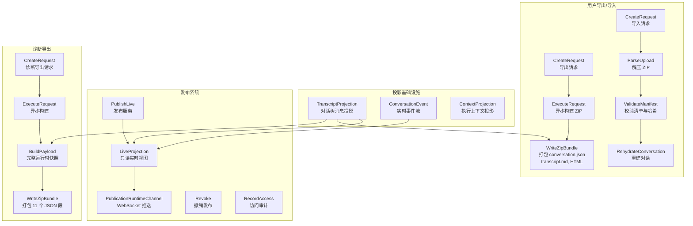
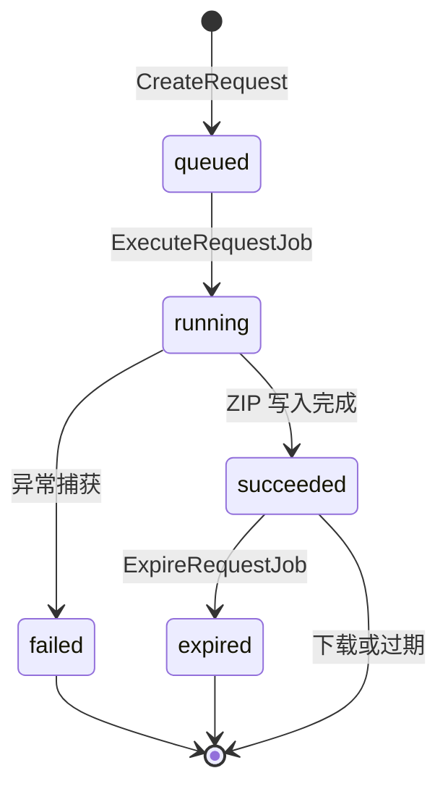
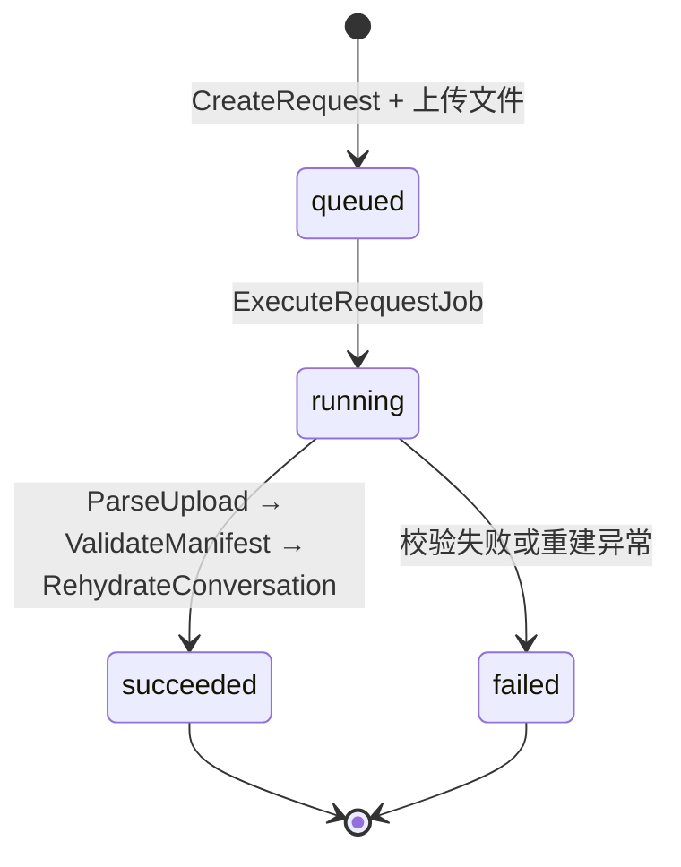

Core Matrix 的**发布**、**实时投影**和**对话导出/导入**三大子系统共同构成了对话数据的"只读暴露层"——它们在不修改对话内部状态的前提下，向人类用户、外部消费者以及诊断流程提供结构化的对话视图。这三个子系统虽然共享相同的对话投影基础设施，但各自拥有独立的生命周期模型、请求模型和授权边界。

## 整体架构总览

在深入每个子系统之前，理解它们如何共享底层的投影原语至关重要。以下架构图展示了三条数据路径的交汇点与分叉点：

Sources: [live_projection.rb](https://github.com/jasl/cybros.new/blob/main/core_matrix/app/projections/publications/live_projection.rb#L1-L71), [transcript_projection.rb](https://github.com/jasl/cybros.new/blob/main/core_matrix/app/services/conversations/transcript_projection.rb#L1-L88), [write_zip_bundle.rb](https://github.com/jasl/cybros.new/blob/main/core_matrix/app/services/conversation_exports/write_zip_bundle.rb#L1-L78), [build_payload.rb](https://github.com/jasl/cybros.new/blob/main/core_matrix/app/services/conversation_debug_exports/build_payload.rb#L1-L353)

## 对话投影基础设施

**对话投影**是三个子系统共同依赖的只读数据层。Core Matrix 定义了两级投影原语：

| 投影原语 | 职责 | 消费者 |
|---|---|---|
| `TranscriptProjection` | 从对话树中提取可见消息序列，处理继承（fork/branch）、可见性覆盖和时间线排序 | 发布、导出、诊断导出 |
| `ContextProjection` | 在 `TranscriptProjection` 基础上增加 `excluded_from_context` 过滤，供代理程序执行循环消费 | 执行引擎 |
| `PageProjection` | 对 `TranscriptProjection` 结果进行游标分页，限制每页 50~100 条 | App API / Program API 翻录接口 |
| `LiveProjection` | 将消息序列与 `ConversationEvent` 实时事件流合并，形成确定性的读写混合视图 | 发布只读推送 |

`TranscriptProjection` 的核心逻辑是从对话树的根节点沿 `parent_conversation` 链向上追溯，收集**继承消息**（fork 场景下的全部父对话消息，branch 场景下到历史锚点为止的消息），再追加本对话自身轮次的**已选消息**（`selected_input_message` + `selected_output_message`）。在返回前，它会通过 `ConversationMessageVisibility` 覆盖层过滤被标记为 `hidden` 的消息。

Sources: [transcript_projection.rb](https://github.com/jasl/cybros.new/blob/main/core_matrix/app/services/conversations/transcript_projection.rb#L15-L86), [context_projection.rb](https://github.com/jasl/cybros.new/blob/main/core_matrix/app/services/conversations/context_projection.rb#L1-L79), [page_projection.rb](https://github.com/jasl/cybros.new/blob/main/core_matrix/app/projections/conversation_transcripts/page_projection.rb#L1-L49)

## 发布模型与可见性控制

### Publication 模型

`Publication` 是一对一绑定到 `Conversation` 的发布状态模型。每条对话至多拥有一个 `Publication` 记录，它控制着该对话是否可以通过只读通道被外部访问。

Publication 的 `visibility_mode` 枚举定义了三种状态：

| 可见性模式 | 含义 | 访问者要求 |
|---|---|---|
| `disabled` | 未发布（默认值），撤销后也回到此状态 | 无访问 |
| `internal_public` | 安装内部公开 | 必须是同一 `Installation` 下的已认证 `User` |
| `external_public` | 完全外部公开 | 可匿名通过 `slug` 或 `access_token` 访问 |

发布时系统通过 `Publication.issue_access_token_pair` 生成一对令牌：明文令牌（仅返回一次）和 SHA-256 摘要（持久化存储）。访问令牌的摘要验证机制确保数据库泄露不会直接暴露访问凭证。`slug` 则使用 `pub-` 前缀加 16 位十六进制随机数格式（如 `pub-a1b2c3d4e5f6g7h8`）。

Sources: [publication.rb](https://github.com/jasl/cybros.new/blob/main/core_matrix/app/models/publication.rb#L1-L92), [publish_live.rb](https://github.com/jasl/cybros.new/blob/main/core_matrix/app/services/publications/publish_live.rb#L1-L80)

### 发布服务 PublishLive

`Publications::PublishLive` 是发布操作的入口服务，其执行流程如下：

1. **校验可见性模式**：拒绝不在 `internal_public` / `external_public` 之中的值
2. **获取对话保留状态锁**（`WithRetainedStateLock`）：确保对话处于 `retained` 状态
3. **查找或初始化 Publication**：`find_or_initialize_by` 保证一对一关系
4. **分配属性**：设置 `visibility_mode`，首次发布时记录 `published_at`，撤销后重新发布会重置 `revoked_at`
5. **条件性令牌轮换**：首次发布或可见性模式变更时，生成新的访问令牌对
6. **审计记录**：`publication.enabled` 或 `publication.visibility_changed` 事件写入 `AuditLog`

`Publications::Revoke` 执行撤销操作：将 `visibility_mode` 置为 `disabled`，设置 `revoked_at` 时间戳，并写入 `publication.revoked` 审计记录。撤销操作在事务中完成。

Sources: [publish_live.rb](https://github.com/jasl/cybros.new/blob/main/core_matrix/app/services/publications/publish_live.rb#L16-L78), [revoke.rb](https://github.com/jasl/cybros.new/blob/main/core_matrix/app/services/publications/revoke.rb#L13-L37)

### 访问审计 RecordAccess

`Publications::RecordAccess` 在每次只读投影访问时记录访问事件。它支持三种查找路径：直接传入 Publication 对象、通过 `slug` 查找、或通过明文 `access_token` 查找。访问验证会检查发布是否处于 `active` 状态、对话是否 `retained`，以及 `internal_public` 模式下访问者是否属于同一安装。每次访问写入一条 `PublicationAccessEvent`，记录 `access_via`（`publication`/`slug`/`access_token`）和 `request_metadata`。

Sources: [record_access.rb](https://github.com/jasl/cybros.new/blob/main/core_matrix/app/services/publications/record_access.rb#L1-L69), [publication_access_event.rb](https://github.com/jasl/cybros.new/blob/main/core_matrix/app/models/publication_access_event.rb#L1-L32)

## 实时投影与 WebSocket 推送

### LiveProjection 合并算法

`Publications::LiveProjection` 是发布系统的核心读端投影，它将两个独立的数据流合并为一个确定性的条目序列：

- **消息流**：来自 `TranscriptProjection` 的可见消息序列
- **事件流**：来自 `ConversationEvent.live_projection` 的实时事件

`ConversationEvent.live_projection` 实现了一个基于 `stream_key` 的**流折叠算法**：对于拥有相同 `stream_key` 的事件，只保留最新版本（按 `projection_sequence` 排序的最后一个）。这确保了状态卡片等流式更新不会在投影中产生历史堆积。

LiveProjection 的合并算法按以下步骤执行：

1. 遍历 `transcript_messages`，每条消息生成一个 `message` 类型条目
2. 对于 `input` 角色的消息，如果存在绑定到该轮次的**锚定事件**（`anchored_events`，即 `turn_id` 不为空的事件），则在该消息之后立即插入这些事件
3. 已消费的轮次 ID 被记录，避免重复
4. 遍历结束后，处理**剩余锚定事件**（绑定了 `turn_id` 但未被任何消息消费的事件）
5. 最后追加**未锚定事件**（`turn_id` 为空的事件）

这种设计确保了事件在投影中的位置是确定性的——锚定事件紧跟其所属轮次的输入消息，不会因为渲染器端的排序逻辑而产生歧义。

Sources: [live_projection.rb](https://github.com/jasl/cybros.new/blob/main/core_matrix/app/projections/publications/live_projection.rb#L13-L69), [conversation_event.rb](https://github.com/jasl/cybros.new/blob/main/core_matrix/app/models/conversation_event.rb#L19-L37)

### ConversationEvent 投影序列

`ConversationEvents::Project` 服务负责创建新的对话事件。每个事件携带两个排序字段：

| 字段 | 作用 |
|---|---|
| `projection_sequence` | 全局单调递增序列号（会话维度唯一），决定事件在投影中的绝对顺序 |
| `stream_key` / `stream_revision` | 可选的流标识符和流内版本号，用于 `live_projection` 的流折叠逻辑 |

事件创建时使用对话级行锁（`with_lock`）保证 `projection_sequence` 的原子递增，避免并发写入导致序列冲突。

Sources: [project.rb](https://github.com/jasl/cybros.new/blob/main/core_matrix/app/services/conversation_events/project.rb#L16-L30)

### 实时推送通道

Core Matrix 通过 ActionCable 提供两个 WebSocket 通道：

| 通道 | 订阅条件 | 推送内容 |
|---|---|---|
| `PublicationRuntimeChannel` | 验证当前 Publication 有效性后订阅 | `ConversationRuntime::Broadcast` 推送的对话运行时事件 |
| `AgentControlChannel` | 验证当前 deployment 身份后订阅 | `AgentControl::PublishPending` 推送的邮箱消息 |

`PublicationRuntimeChannel` 订阅到 `conversation_runtime:{conversation_public_id}` 流，接收由 `ConversationRuntime::Broadcast` 发出的实时事件。后者将 `event_kind`、`turn_id`、`occurred_at` 和 `payload` 打包广播。

`AgentControlChannel` 在订阅时触发 `RealtimeLinks::Open`，将连接标记为活跃状态并刷新待投递消息；断开时触发 `RealtimeLinks::Close`，标记连接空闲。这种设计确保了 WebSocket 连接状态与邮箱投递系统的同步。

Sources: [publication_runtime_channel.rb](https://github.com/jasl/cybros.new/blob/main/core_matrix/app/channels/publication_runtime_channel.rb#L1-L8), [agent_control_channel.rb](https://github.com/jasl/cybros.new/blob/main/core_matrix/app/channels/agent_control_channel.rb#L1-L15), [broadcast.rb](https://github.com/jasl/cybros.new/blob/main/core_matrix/app/services/conversation_runtime/broadcast.rb#L15-L27), [publish_pending.rb](https://github.com/jasl/cybros.new/blob/main/core_matrix/app/services/agent_control/publish_pending.rb#L15-L73)

## 对话导出：用户级资产包

### 设计决策

对话导出系统遵循 ChatGPT 式的**异步生成、限时下载**模型，与 RisuAI 式的版本化资产包理念结合。关键设计决策包括：

- 导出请求是**异步**的，通过后台 Job 执行
- 下载链接有时效性（默认 24 小时 `TTL`），过期后返回 `410 Gone`
- 导出包仅包含**对话级附件**（`MessageAttachment`），不扫描工作区文件
- 导出格式是**产品专有格式**，使用 `bundle_kind` + `bundle_version` 标识版本

Sources: [design.md](https://github.com/jasl/cybros.new/blob/main/docs/finished-plans/2026-04-02-conversation-export-import-and-debug-bundles-design.md#L54-L83)

### 导出请求生命周期

`ConversationExportRequest` 的状态机如下：

| 字段 | 含义 |
|---|---|
| `lifecycle_state` | 上述五态之一 |
| `queued_at` | 请求创建时间 |
| `started_at` | Job 开始执行时间 |
| `finished_at` | 成功或失败时间 |
| `expires_at` | 下载链接过期时间（默认 24 小时后） |
| `request_payload` | 包含 `bundle_kind` 和 `bundle_version` |
| `result_payload` | 成功后包含 `message_count`、`attachment_count` 等统计 |
| `failure_payload` | 失败时包含 `error_class` 和 `message` |
| `bundle_file` | ActiveStorage 附加的 ZIP 文件 |

Sources: [conversation_export_request.rb](https://github.com/jasl/cybros.new/blob/main/core_matrix/app/models/conversation_export_request.rb#L1-L77), [create_request.rb](https://github.com/jasl/cybros.new/blob/main/core_matrix/app/services/conversation_exports/create_request.rb#L1-L36)

### ZIP 包结构

导出的 ZIP 包包含以下文件：

| 文件 | 内容 |
|---|---|
| `manifest.json` | 包清单：`bundle_kind`、`bundle_version`、消息/附件计数、文件索引、SHA-256 校验和 |
| `conversation.json` | 完整对话载荷：对话元数据 + 所有消息（含附件元数据） |
| `transcript.md` | Markdown 格式的对话文本渲染 |
| `conversation.html` | 自包含 HTML 格式的对话渲染（ERB 转义，无外部依赖） |
| `files/{public_id}-{filename}` | 附件二进制文件 |

`BuildConversationPayload` 使用 `TranscriptProjection` 获取可见消息序列，为每条消息提取角色、内容、变体索引和附件列表。附件的 SHA-256 校验和在构建时计算并嵌入载荷，确保导入时可以验证完整性。

`RenderTranscriptMarkdown` 生成简洁的 Markdown：一级标题为对话标题（取自首条用户消息截断至 80 字符），二级标题按 `{role} {slot}` 格式化。`RenderTranscriptHtml` 生成等效的自包含 HTML，所有内容经过 `ERB::Util.html_escape` 转义。

Sources: [write_zip_bundle.rb](https://github.com/jasl/cybros.new/blob/main/core_matrix/app/services/conversation_exports/write_zip_bundle.rb#L15-L62), [build_conversation_payload.rb](https://github.com/jasl/cybros.new/blob/main/core_matrix/app/services/conversation_exports/build_conversation_payload.rb#L16-L96), [build_manifest.rb](https://github.com/jasl/cybros.new/blob/main/core_matrix/app/services/conversation_exports/build_manifest.rb#L12-L48)

## 对话导入：从导出包重建对话

### 导入请求生命周期

`ConversationBundleImportRequest` 与导出请求共享类似的状态机，但没有 `expired` 状态——导入是一次性操作：

导入请求需要指定 `target_agent_program_version_id`——即重建后的对话将绑定到哪个代理程序版本。这意味着导入操作总是发生在某个代理程序部署的上下文中。

Sources: [conversation_bundle_import_request.rb](https://github.com/jasl/cybros.new/blob/main/core_matrix/app/models/conversation_bundle_import_request.rb#L1-L74), [create_request.rb](https://github.com/jasl/cybros.new/blob/main/core_matrix/app/services/conversation_bundle_imports/create_request.rb#L1-L64)

### 四阶段导入流水线

`ExecuteRequest` 在事务中顺序执行四个步骤：

**阶段一：ParseUpload**——从上传的 ZIP 中提取所有条目，解析 `manifest.json` 和 `conversation.json`，分离出 `file_bytes`（`files/` 前缀的二进制内容）。

**阶段二：ValidateManifest**——执行多层完整性校验：

| 校验层 | 检查内容 |
|---|---|
| 格式校验 | `manifest` 和 `conversation_payload` 必须为 Hash |
| 版本校验 | `bundle_kind` 必须为 `conversation_export`，`bundle_version` 必须匹配 |
| 一致性校验 | conversation payload 与 manifest 之间的 `public_id`、消息数、附件数必须一致 |
| 顶层校验和 | `conversation.json`、`transcript.md`、`conversation.html` 的 SHA-256 必须匹配 |
| 附件校验和 | 每个附件文件的 SHA-256 必须匹配 manifest 中的记录 |
| 元数据匹配 | manifest 中每个附件条目的 `kind`、`filename`、`mime_type`、`byte_size`、`relative_path` 必须与 payload 一致 |

**阶段三：RehydrateConversation**——创建新对话并重建轮次和消息：

1. 通过 `Conversations::CreateRoot` 创建新的根对话，绑定目标代理程序版本
2. 恢复原始对话时间戳（`update_columns` 绕过回调）
3. 按原始轮次顺序重建每个轮次：创建 `Turn`（`lifecycle_state: "completed"`，`origin_kind: "system_internal"`），为每条消息创建 `UserMessage` 或 `AgentMessage`
4. 从 ZIP 中读取附件二进制并通过 ActiveStorage 附加
5. 延迟处理附件溯源关系（`origin_attachment` / `origin_message`），因为溯源目标可能在当前轮次尚未创建

**阶段四：结果记录**——更新请求状态为 `succeeded`，记录导入对话 ID、消息数和附件数。

整个导入过程在 `ApplicationRecord.transaction(requires_new: true)` 中执行，任何阶段的失败都会回滚全部变更。

Sources: [execute_request.rb](https://github.com/jasl/cybros.new/blob/main/core_matrix/app/services/conversation_bundle_imports/execute_request.rb#L1-L51), [parse_upload.rb](https://github.com/jasl/cybros.new/blob/main/core_matrix/app/services/conversation_bundle_imports/parse_upload.rb#L14-L32), [validate_manifest.rb](https://github.com/jasl/cybros.new/blob/main/core_matrix/app/services/conversation_bundle_imports/validate_manifest.rb#L15-L106), [rehydrate_conversation.rb](https://github.com/jasl/cybros.new/blob/main/core_matrix/app/services/conversation_bundle_imports/rehydrate_conversation.rb#L12-L181)

## 诊断导出：内部运行时证据包

### 与用户导出的区别

诊断导出（`ConversationDebugExport`）是面向内部运维和调试的完整运行时快照。它与用户导出的核心区别在于：

| 维度 | 用户导出 | 诊断导出 |
|---|---|---|
| `bundle_kind` | `conversation_export` | `conversation_debug_export` |
| 目标受众 | 终端用户 | 运维/开发者 |
| 内容范围 | 消息 + 附件 | 消息 + 工作流 + 工具调用 + 进程 + 子代理 + 使用量 |
| 可导入性 | 可导入为新对话 | 不可导入 |
| 过期机制 | 24 小时 TTL 后过期 | 24 小时 TTL 后过期 |
| 诊断快照 | 不包含 | 包含对话级和轮次级诊断快照 |

Sources: [build_payload.rb](https://github.com/jasl/cybros.new/blob/main/core_matrix/app/services/conversation_debug_exports/build_payload.rb#L1-L38), [design.md](https://github.com/jasl/cybros.new/blob/main/docs/finished-plans/2026-04-02-conversation-export-import-and-debug-bundles-design.md#L54-L73)

### 诊断包结构

诊断导出的 ZIP 包包含 11 个 JSON 段文件，外加附件二进制：

| 文件 | 内容 |
|---|---|
| `manifest.json` | 包清单 + 各段文件的 SHA-256 校验和 |
| `conversation.json` | 复用 `BuildConversationPayload` 的用户导出格式 |
| `diagnostics.json` | 会话级和轮次级诊断快照 |
| `workflow_runs.json` | 所有工作流运行记录 |
| `workflow_nodes.json` | 所有工作流节点记录 |
| `workflow_node_events.json` | 所有节点事件记录 |
| `agent_task_runs.json` | 所有代理任务运行记录 |
| `tool_invocations.json` | 所有工具调用记录 |
| `command_runs.json` | 所有命令运行记录 |
| `process_runs.json` | 所有进程运行记录 |
| `subagent_sessions.json` | 所有子代理会话记录 |
| `usage_events.json` | 所有使用量事件记录 |

`BuildPayload` 在构建时首先调用 `RecomputeConversationSnapshot` 重新计算会话和每个轮次的诊断快照，确保导出的诊断数据反映最新状态。快照包含令牌用量、成本估算、工具调用统计、失败计数等聚合指标。

Sources: [write_zip_bundle.rb](https://github.com/jasl/cybros.new/blob/main/core_matrix/app/services/conversation_debug_exports/write_zip_bundle.rb#L15-L52), [build_manifest.rb](https://github.com/jasl/cybros.new/blob/main/core_matrix/app/services/conversation_debug_exports/build_manifest.rb#L6-L72), [recompute_conversation_snapshot.rb](https://github.com/jasl/cybros.new/blob/main/core_matrix/app/services/conversation_diagnostics/recompute_conversation_snapshot.rb#L11-L69)

## API 路由与控制器

三个子系统的 API 端点全部位于 `app_api` 命名空间下，复用 `ProgramAPI::BaseController` 的部署身份认证（当前阶段通过 `AgentSession` 的 Bearer Token 认证）：

| 路由 | 方法 | 控制器 | 用途 |
|---|---|---|---|
| `/app_api/conversation_transcripts` | GET | `ConversationTranscriptsController#index` | 游标分页获取对话翻译 |
| `/app_api/conversation_diagnostics/show` | GET | `ConversationDiagnosticsController#show` | 会话级诊断快照 |
| `/app_api/conversation_diagnostics/turns` | GET | `ConversationDiagnosticsController#turns` | 轮次级诊断快照列表 |
| `/app_api/conversation_export_requests` | POST | `ConversationExportRequestsController#create` | 创建导出请求 |
| `/app_api/conversation_export_requests/:id` | GET | `ConversationExportRequestsController#show` | 查询导出状态 |
| `/app_api/conversation_export_requests/:id/download` | GET | `ConversationExportRequestsController#download` | 下载导出文件 |
| `/app_api/conversation_debug_export_requests` | POST | `ConversationDebugExportRequestsController#create` | 创建诊断导出请求 |
| `/app_api/conversation_debug_export_requests/:id` | GET | `ConversationDebugExportRequestsController#show` | 查询诊断导出状态 |
| `/app_api/conversation_debug_export_requests/:id/download` | GET | `ConversationDebugExportRequestsController#download` | 下载诊断导出文件 |
| `/app_api/conversation_bundle_import_requests` | POST | `ConversationBundleImportRequestsController#create` | 创建导入请求 |
| `/app_api/conversation_bundle_import_requests/:id` | GET | `ConversationBundleImportRequestsController#show` | 查询导入状态 |

导出下载端点在文件不存在或已过期时返回 `410 Gone`。

Sources: [routes.rb](https://github.com/jasl/cybros.new/blob/main/core_matrix/config/routes.rb#L61-L80), [conversation_export_requests_controller.rb](https://github.com/jasl/cybros.new/blob/main/core_matrix/app/controllers/app_api/conversation_export_requests_controller.rb#L1-L70), [conversation_bundle_import_requests_controller.rb](https://github.com/jasl/cybros.new/blob/main/core_matrix/app/controllers/app_api/conversation_bundle_import_requests_controller.rb#L1-L60), [conversation_debug_export_requests_controller.rb](https://github.com/jasl/cybros.new/blob/main/core_matrix/app/controllers/app_api/conversation_debug_export_requests_controller.rb#L1-L70)

## 后台 Job 拓扑

三个子系统共使用 5 个后台 Job：

| Job | 调度时机 | 职责 |
|---|---|---|
| `ConversationExports::ExecuteRequestJob` | 创建导出请求时立即调度 | 构建 ZIP 包并附加到请求记录 |
| `ConversationExports::ExpireRequestJob` | 创建时设置 `wait_until: expires_at` | 标记导出请求为 `expired` |
| `ConversationDebugExports::ExecuteRequestJob` | 创建诊断导出请求时立即调度 | 构建诊断 ZIP 包 |
| `ConversationDebugExports::ExpireRequestJob` | 创建时设置 `wait_until: expires_at` | 标记诊断导出为 `expired` |
| `ConversationBundleImports::ExecuteRequestJob` | 创建导入请求时立即调度 | 解析、校验、重建对话 |

所有 Job 使用 `perform_later` 异步执行。过期 Job 使用 Solid Queue 的 `set(wait_until:)` 延迟调度机制，确保精确的 TTL 控制。

Sources: [create_request.rb](https://github.com/jasl/cybros.new/blob/main/core_matrix/app/services/conversation_exports/create_request.rb#L30-L31), [execute_request.rb](https://github.com/jasl/cybros.new/blob/main/core_matrix/app/services/conversation_exports/execute_request.rb#L38-L62), [create_request.rb](https://github.com/jasl/cybros.new/blob/main/core_matrix/app/services/conversation_debug_exports/create_request.rb#L30-L31), [execute_request.rb](https://github.com/jasl/cybros.new/blob/main/core_matrix/app/services/conversation_debug_exports/execute_request.rb#L57-L65)

## 安全与隔离边界

三个子系统在设计时遵循严格的边界隔离原则：

**发布系统**通过 `Publication` 的一对一关系和 `visibility_mode` 枚举控制访问边界。`internal_public` 模式要求访问者属于同一安装，`external_public` 模式允许匿名但需要有效的 `slug` 或 `access_token`。所有访问通过 `RecordAccess` 审计，所有状态变更通过 `AuditLog` 记录。

**用户导出/导入**采用独立模型（`ConversationExportRequest` 和 `ConversationBundleImportRequest`），不与诊断导出共享格式或请求模型。导入系统仅接受产品自身版本化的导出格式（`bundle_kind: "conversation_export"`），并在 `ValidateManifest` 中执行多层完整性校验。导入总是创建新对话，绝不修改现有对话。

**诊断导出**使用独立的 `bundle_kind`（`conversation_debug_export`），明确禁止被导入流程消费。诊断包包含的运行时内部数据（工作流、工具调用、使用量事件）不暴露给用户级导出。

三个模型都执行 `installation_match`、`workspace_match` 等安装边界校验，确保多租户场景下的数据隔离。

Sources: [publish_live.rb](https://github.com/jasl/cybros.new/blob/main/core_matrix/app/services/publications/publish_live.rb#L17-L18), [validate_manifest.rb](https://github.com/jasl/cybros.new/blob/main/core_matrix/app/services/conversation_bundle_imports/validate_manifest.rb#L16-L31), [design.md](https://github.com/jasl/cybros.new/blob/main/docs/finished-plans/2026-04-02-conversation-export-import-and-debug-bundles-design.md#L132-L189)

## 关键阅读路径

- 要理解投影底层如何处理对话树继承和可见性覆盖，请参阅 [会话、轮次与对话树结构](https://github.com/jasl/cybros.new/blob/main/7-hui-hua-lun-ci-yu-dui-hua-shu-jie-gou)
- 要了解 WebSocket 通道如何与代理程序控制循环配合，请参阅 [邮箱控制平面：消息投递、租赁与实时推送](https://github.com/jasl/cybros.new/blob/main/10-you-xiang-kong-zhi-ping-mian-xiao-xi-tou-di-zu-ren-yu-shi-shi-tui-song)
- 要查看完整的 API 端点参考，请参阅 [App API：对话诊断、导出与导入接口](https://github.com/jasl/cybros.new/blob/main/26-app-api-dui-hua-zhen-duan-dao-chu-yu-dao-ru-jie-kou)
- 要了解诊断快照中的使用量聚合如何被计算，请参阅 [使用量计费、执行画像与审计日志](https://github.com/jasl/cybros.new/blob/main/15-shi-yong-liang-ji-fei-zhi-xing-hua-xiang-yu-shen-ji-ri-zhi)