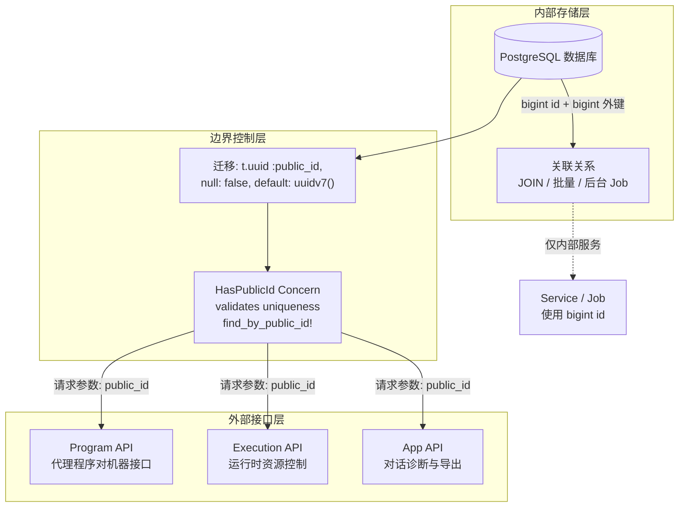
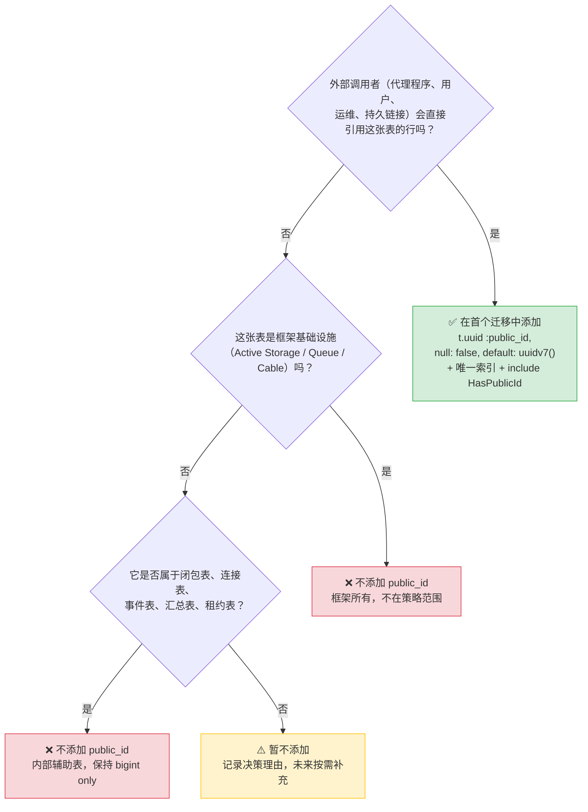

Core Matrix 采用**双轨标识符体系**：数据库内部使用紧凑的 `bigint` 自增主键维系关联关系与存储性能，对外则通过 PostgreSQL 18 原生的 `uuidv7()` 生成不可枚举的 `public_id`，在所有公开 HTTP 接口、代理程序契约、UI 路由和共享链接中充当唯一资源标识。本文档为初学者系统梳理这一策略的设计动机、分类规则、运行时执行边界，以及常见开发场景下的决策方法。

Sources: [identifier-policy-design.md](https://github.com/jasl/cybros.new/blob/main/docs/finished-plans/2026-03-25-core-matrix-phase-1-identifier-policy-design.md#L1-L206), [identifier-policy.md](https://github.com/jasl/cybros.new/blob/main/core_matrix/docs/behavior/identifier-policy.md#L1-L109)

## 为什么不用 UUID 做主键？

一个自然的疑问是：既然要对外隐藏可枚举的数字 ID，为什么不直接把所有表的主键都换成 UUID？答案在于 Core Matrix 的设计把**两个独立关注点**解耦了：

1. **内部关系身份**——数据库行的关联、JOIN、批量处理、外键图需要紧凑、有序的 `bigint`
2. **外部不透明身份**——API 参数、UI URL、审计日志需要不可猜测、不可枚举的标识符

如果用 UUID 做主键，就把这两个关注点耦合在了一起，代价是：更大的索引体积、更复杂的外键维护、以及外部契约变更时对存储层的连锁影响。保持 `bigint` 主键并在**边界资源**上追加 `public_id`，用更低的工程成本解决了实际产品问题。

Sources: [identifier-policy-design.md](https://github.com/jasl/cybros.new/blob/main/docs/finished-plans/2026-03-25-core-matrix-phase-1-identifier-policy-design.md#L39-L57)

## 双轨体系架构总览

下面的图展示了标识符在系统各层中的流转规则：



**关键原则**：`public_id` 的生成和约束完全由数据库层负责（`default: -> { "uuidv7()" }`，`null: false`，唯一索引），`HasPublicId` concern 仅提供应用层的唯一性校验和便捷查找方法。这意味着即使跳过 Rails 验证直接写入数据库，`public_id` 也永远不会缺失。

Sources: [has_public_id.rb](https://github.com/jasl/cybros.new/blob/main/core_matrix/app/models/concerns/has_public_id.rb#L1-L14), [create_users.rb](https://github.com/jasl/cybros.new/blob/main/core_matrix/db/migrate/20260324090002_create_users.rb#L1-L18)

## 哪些资源需要 public_id？

策略的判断标准是**一张表是否建模了外部调用者、用户、运维或持久链接可能直接引用的资源**。如果答案是"是"，就属于 in-scope 资源。下面按领域分组列出当前已纳入策略的资源：

| 领域 | 资源（模型） | 典型外部引用场景 |
|------|-------------|-----------------|
| 身份与安装 | `User`, `Invitation`, `Session` | 用户资料页、邀请链接、会话令牌 |
| 工作空间 | `Workspace` | 工作空间切换、多租户隔离 |
| 代理程序 | `AgentProgram`, `AgentProgramVersion`, `AgentSession` | 代理注册、版本握手、会话凭证 |
| 执行环境 | `ExecutionRuntime`, `ExecutionSession` | 运行时配对、心跳凭证 |
| 对话 | `Conversation`, `Turn`, `Message`, `MessageAttachment` | 对话列表、轮次追溯、消息读取、附件下载 |
| 工作流 | `WorkflowRun`, `WorkflowNode`, `ProcessRun`, `AgentTaskRun` | 工作流状态查询、节点执行、进程管理 |
| 工具治理 | `ToolBinding`, `ToolDefinition`, `ToolImplementation`, `ToolInvocation`, `CommandRun` | 工具审查、调用追踪、命令执行 |
| 人类交互 | `HumanInteractionRequest` | 审批/表单/任务请求 |
| 邮箱控制 | `AgentControlMailboxItem` | 邮箱消息投递与报告 |
| 发布与导入导出 | `Publication`, `ConversationExportRequest`, `ConversationDebugExportRequest`, `ConversationBundleImportRequest`, `ConversationCloseOperation`, `ImplementationSource`, `SubagentSession` | 分享链接、导出请求、调试包、导入操作、关闭操作 |

以上全部模型都通过 `include HasPublicId` 引入了统一的查找接口。

Sources: [identifier-policy.md](https://github.com/jasl/cybros.new/blob/main/core_matrix/docs/behavior/identifier-policy.md#L16-L44), [identifier-policy-design.md](https://github.com/jasl/cybros.new/blob/main/docs/finished-plans/2026-03-25-core-matrix-phase-1-identifier-policy-design.md#L59-L95)

## 哪些资源不需要 public_id？

以下表格类别在设计上被**明确排除**，不追加 `public_id`：

| 排除类别 | 代表表 | 排除理由 |
|----------|--------|----------|
| 闭包表 | `conversation_closures` | 纯粹的树形路径计算，仅供内部查询 |
| 叠加/投影表 | `conversation_message_visibilities`, `conversation_summary_segments` | 运行时投影产物，不暴露给外部 |
| 事件表 | `conversation_events`, `workflow_node_events` | 追加式事件流，通过父资源间接访问 |
| 汇总表 | `usage_rollups`, `conversation_diagnostics_snapshots`, `turn_diagnostics_snapshots` | 聚合计算产物，不需要独立寻址 |
| 租约表 | `execution_leases`, `provider_request_leases` | 内部并发控制机制 |
| 连接表 | `user_program_bindings`, `agent_enrollments` | 多对多关系中间表 |
| 事实表 | `usage_events`, `execution_profile_facts`, `audit_logs` | 不可变审计数据，通过范围查询访问 |
| 血统存储 | `lineage_store_entries`, `lineage_store_references`, `lineage_store_snapshots`, `lineage_store_values` | 内部血统追踪，绝不泄漏到外部 |
| Provider 治理内部表 | `provider_credentials`, `provider_entitlements`, `provider_policies`, `provider_request_controls` | 凭证与策略的内部存储 |
| 框架基础设施 | `active_storage_*`, Solid Queue, Action Cable | Rails 框架所有，不在本策略范围内 |
| 工作流辅助 | `workflow_edges`, `workflow_artifacts`, `canonical_variables` | DAG 边关系、临时产物、投影变量 |

**核心判断逻辑**：如果一张表只服务于内部溯源、投影、记账或性能优化，它就保持纯 `bigint` 身份。如果未来某张表变成了外部可寻址资源（例如 `workflow_artifacts` 需要直接下载链接），则在该时刻通过**增量式前向迁移**补充 `public_id`。

Sources: [identifier-policy-design.md](https://github.com/jasl/cybros.new/blob/main/docs/finished-plans/2026-03-25-core-matrix-phase-1-identifier-policy-design.md#L97-L119), [identifier-policy.md](https://github.com/jasl/cybros.new/blob/main/core_matrix/docs/behavior/identifier-policy.md#L79-L93)

## 六条边界规则

以下是标识符策略的六条核心执行规则，每一条都可以在代码中找到对应实现：

**规则 1：外部查找必须通过 public_id**。所有 Program API、Execution API、App API 的控制器查找方法（如 `find_workspace!`、`find_conversation!`、`find_turn!`）一律使用 `public_id` 作为查询条件。

Sources: [base_controller.rb (Program API)](https://github.com/jasl/cybros.new/blob/main/core_matrix/app/controllers/program_api/base_controller.rb#L31-L88), [base_controller.rb (Execution API)](https://github.com/jasl/cybros.new/blob/main/core_matrix/app/controllers/execution_api/base_controller.rb#L22-L60)

**规则 2：外部载荷必须输出 public_id**。序列化方法（如 `serialize_message`、`serialize_tool_invocation`、`serialize_command_run`）中的所有资源引用字段（`"id"`、`"conversation_id"`、`"turn_id"`、`"workspace_id"` 等）都使用 `.public_id` 取值，即使字段名仍为 `*_id`。

Sources: [base_controller.rb (Program API)](https://github.com/jasl/cybros.new/blob/main/core_matrix/app/controllers/program_api/base_controller.rb#L139-L243)

**规则 3：内部服务可继续使用 bigint**。Service 层、Job 层、数据库关联（`belongs_to`、`has_many`）和外键关系全部维持 `bigint`。例如 `execution_leases` 表的 `leased_resource_id`、`workflow_node_id` 都是 `bigint` 外键。

Sources: [schema.rb (execution_leases)](https://github.com/jasl/cybros.new/blob/main/core_matrix/db/schema.rb#L547-L565)

**规则 4：禁止混合查找语义**。外部边界上不允许出现"接受 `id` 或 `public_id` 二选一"的降级逻辑。`find_by!` 方法始终只匹配 `public_id` 列。

Sources: [identifier-policy-design.md](https://github.com/jasl/cybros.new/blob/main/docs/finished-plans/2026-03-25-core-matrix-phase-1-identifier-policy-design.md#L121-L130)

**规则 5：删除敏感资源需额外校验可见性**。代理程序查找对话时，`find_conversation!` 方法在 `public_id` 匹配之外还叠加了 `deletion_state: "retained"` 条件，已删除或待删除的对话不会作为有效的外部查找目标返回。

Sources: [base_controller.rb (Program API)](https://github.com/jasl/cybros.new/blob/main/core_matrix/app/controllers/program_api/base_controller.rb#L37-L45)

**规则 6：无 public_id 的资源不得泄漏内部 id**。`CanonicalVariable`、`LineageStore` 系列表、`UsageEvent` 等内部资源在任何代理程序面向的载荷中都不暴露原始 `bigint` 行 id。

Sources: [identifier-policy.md](https://github.com/jasl/cybros.new/blob/main/core_matrix/docs/behavior/identifier-policy.md#L54-L60)

## HasPublicId Concern 的实现细节

整个策略的模型层实现集中在 `HasPublicId` 这个轻量级 concern 中：

```ruby
module HasPublicId
  extend ActiveSupport::Concern

  included do
    validates :public_id, uniqueness: true, allow_nil: true
  end

  class_methods do
    def find_by_public_id!(public_id)
      find_by!(public_id: public_id)
    end
  end
end
```

这段代码只有三处要点值得注意：① 唯一性校验使用 `allow_nil: true` 是因为数据库默认值在 `before_validation` 阶段尚未触发，模型层校验作为数据库唯一索引的**应用层安全网**；② `find_by_public_id!` 封装了标准的 `find_by!` 调用，为所有纳入策略的模型提供一致的查找接口；③ concern 完全不触碰内部 `id` 列，两者在模型上和平共存。

Sources: [has_public_id.rb](https://github.com/jasl/cybros.new/blob/main/core_matrix/app/models/concerns/has_public_id.rb#L1-L14)

## 迁移与数据库层的写法

每张纳入策略的资源表在迁移中都遵循固定的声明模式。以 `users` 表为例：

```ruby
create_table :users do |t|
  t.belongs_to :installation, null: false, foreign_key: true
  t.uuid :public_id, null: false, default: -> { "uuidv7()" }
  # ... 其他列 ...
end

add_index :users, :public_id, unique: true
```

三要素固定不变：① `t.uuid` 列类型声明为 PostgreSQL UUID；② `null: false` 确保数据库层面不允许空值；③ `default: -> { "uuidv7()" }` 使用 PostgreSQL 18 的内置函数生成**时间有序的不透明标识符**，并附带唯一索引。这种声明方式意味着任何通过 SQL 直接插入的行（绕过 Rails）也会自动获得合法的 `public_id`。

Sources: [create_users.rb](https://github.com/jasl/cybros.new/blob/main/core_matrix/db/migrate/20260324090002_create_users.rb#L1-L18), [create_message_attachments.rb](https://github.com/jasl/cybros.new/blob/main/core_matrix/db/migrate/20260324090025_create_message_attachments.rb#L1-L17)

## 排序规则：uuidv7 ≠ 业务排序

`uuidv7()` 是一种时间有序的 UUID 变体，它比随机 UUID（如 `uuidv4`）有更好的 B-tree 索引局部性。但策略明确规定：**`public_id` 不是业务的排序依据**。业务排序必须依赖显式的领域字段：

| 排序场景 | 排序字段 | 说明 |
|----------|---------|------|
| 资源时间线 | `created_at` | 资源创建的时间先后 |
| 对话轮次 | `sequence` | 同一对话内轮次的严格顺序 |
| 事件投影 | `projection_sequence` | 事件追加时的投影序列号 |
| 工作流节点 | `ordinal` 或领域计数器 | 工作流内节点的执行顺序 |

这条规则防止了隐含的排序假设泄漏到 API、测试和查询对象中。例如，翻页投影（`PageProjection`）在构建游标时使用 `public_id` 作为游标令牌，但实际的分页排序依据仍然是消息的 `created_at` 或其他显式字段。

Sources: [identifier-policy-design.md](https://github.com/jasl/cybros.new/blob/main/docs/finished-plans/2026-03-25-core-matrix-phase-1-identifier-policy-design.md#L132-L146), [page_projection.rb](https://github.com/jasl/cybros.new/blob/main/core_matrix/app/projections/conversation_transcripts/page_projection.rb#L26-L42)

## PostgreSQL 18 基线要求

`uuidv7()` 是 PostgreSQL 18 引入的内置函数，因此 Core Matrix 将 **PostgreSQL 18 定为最低支持版本**。CI 流水线通过 GitHub Actions 的 Docker 服务容器强制固定 `postgres:18` 镜像：

```yaml
services:
  postgres:
    image: postgres:18
    env:
      POSTGRES_USER: postgres
      POSTGRES_PASSWORD: postgres
```

如果数据库不支持 `uuidv7()`，迁移中的 `default: -> { "uuidv7()" }` 将在 `db:test:prepare` 阶段立即失败——不需要额外的基线检测测试。

Sources: [ci.yml](https://github.com/jasl/cybros.new/blob/main/.github/workflows/ci.yml#L248-L252), [identifier-policy-design.md](https://github.com/jasl/cybros.new/blob/main/docs/finished-plans/2026-03-25-core-matrix-phase-1-identifier-policy-design.md#L148-L160)

## 初学者决策流程：我的新表需要 public_id 吗？

当你为 Core Matrix 新增一张数据库表时，按照以下流程决策：



**开发护栏总结**（四要四不要）：

| ✅ 要做 | ❌ 不要做 |
|---------|----------|
| 在首个迁移中为外部资源添加 `public_id` | 不要把已有 `bigint` 主键改成 UUID |
| 在外部载荷中使用 `public_id` 取值 | 不要为了"看起来统一"给所有表加 `public_id` |
| 用 `created_at`、`sequence` 等字段做业务排序 | 不要用 `public_id` 替代显式排序字段 |
| 新增外部资源时在迁移中就声明 `public_id` | 不要在外部边界接受混合 `id`/`public_id` 查找 |

Sources: [identifier-policy-design.md](https://github.com/jasl/cybros.new/blob/main/docs/finished-plans/2026-03-25-core-matrix-phase-1-identifier-policy-design.md#L170-L194), [AGENTS.md](https://github.com/jasl/cybros.new/blob/main/AGENTS.md#L18-L22)

## 系统中的实际运行示例

以**代理程序注册**（`ProgramAPI::RegistrationsController`）为例，展示 `public_id` 在完整请求链路中的使用：

**请求阶段**：代理程序携带 `session_credential`（令牌）发起注册请求。控制器通过 `authenticate_agent_session!` 用令牌匹配 `AgentSession`（内部使用 `bigint` 关联定位）。

**响应阶段**：注册成功后，响应载荷中所有资源引用全部使用 `public_id`：

```ruby
{
  agent_program_id: registration.deployment.agent_program.public_id,         # UUID
  agent_program_version_id: registration.deployment.public_id,               # UUID
  agent_session_id: registration.agent_session.public_id,                    # UUID
  execution_runtime_id: registration.execution_runtime&.public_id,           # UUID
  execution_session_id: registration.execution_session&.public_id,           # UUID
}
```

**后续请求阶段**：代理程序在后续 API 调用中使用这些 `public_id` 值作为路径参数。控制器的 `find_workspace!`、`find_conversation!` 等方法将 `public_id` 转换回数据库行后，Service 层继续使用 `bigint` `id` 完成业务操作。

Sources: [registrations_controller.rb](https://github.com/jasl/cybros.new/blob/main/core_matrix/app/controllers/program_api/registrations_controller.rb#L25-L46)

## 延伸阅读

- [会话、轮次与对话树结构](https://github.com/jasl/cybros.new/blob/main/7-hui-hua-lun-ci-yu-dui-hua-shu-jie-gou)——了解 `Conversation`、`Turn`、`Message` 如何在标识符策略下被外部引用
- [Program API：代理程序机器对机器接口](https://github.com/jasl/cybros.new/blob/main/24-program-api-dai-li-cheng-xu-ji-qi-dui-ji-qi-jie-kou)——查看 `public_id` 在代理程序协议中的完整使用方式
- [Execution API：运行时资源控制接口](https://github.com/jasl/cybros.new/blob/main/25-execution-api-yun-xing-shi-zi-yuan-kong-zhi-jie-kou)——了解执行运行时如何通过 `public_id` 管理资源生命周期
- [发布、实时投影与对话导出/导入](https://github.com/jasl/cybros.new/blob/main/16-fa-bu-shi-shi-tou-ying-yu-dui-hua-dao-chu-dao-ru)——查看 `Publication`、导出/导入请求的 `public_id` 使用模式