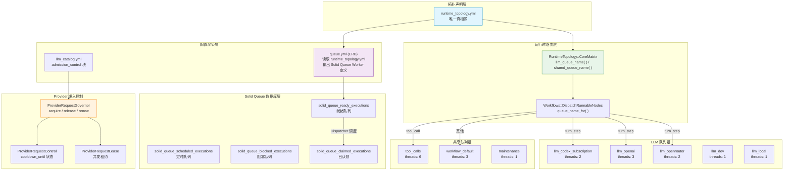
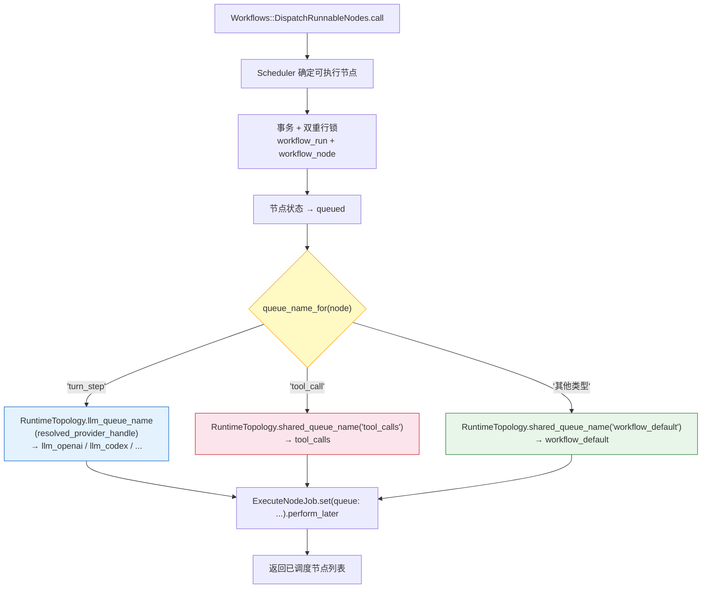
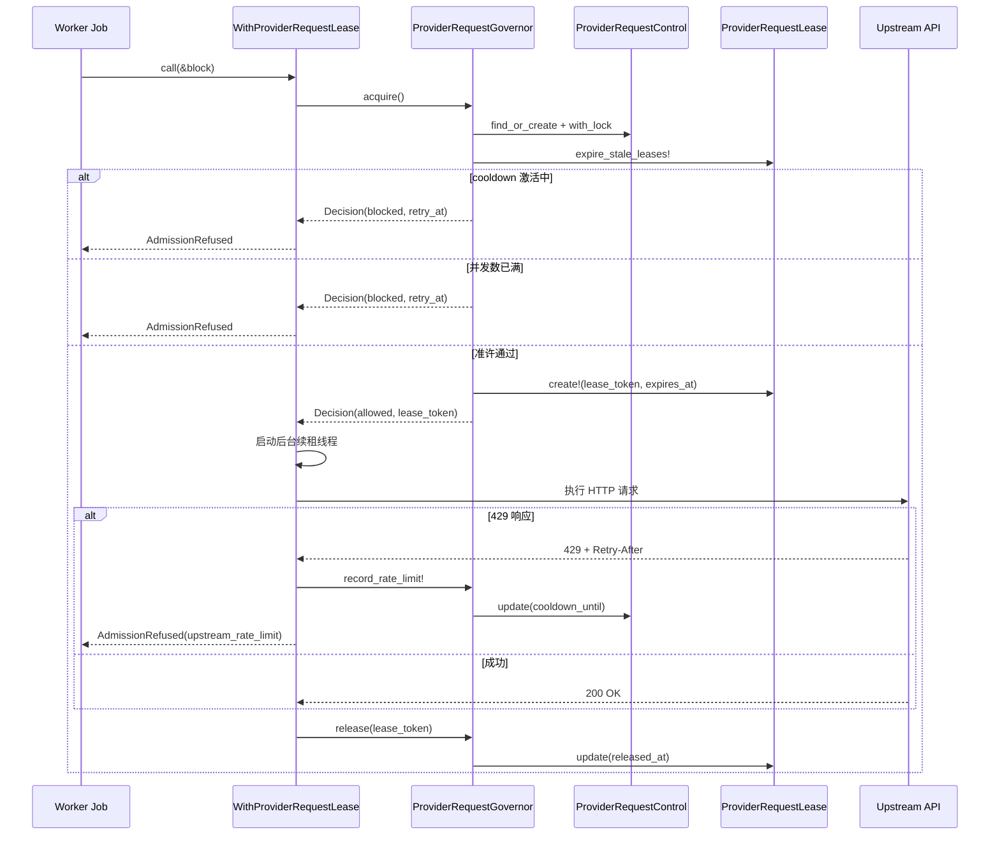
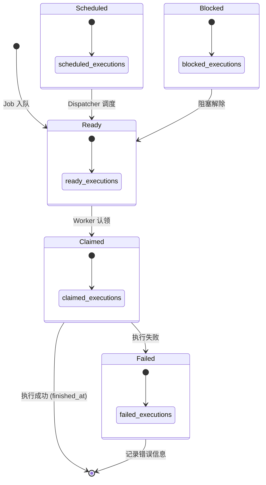

Core Matrix 采用 **声明式运行时拓扑** 架构：一个 YAML 声明文件定义全部队列与工作器参数，ERB 模板将其渲染为 Solid Queue 原生配置，Ruby 服务对象在运行时读取同一份声明来路由任务。三层结构——**拓扑声明 → 配置渲染 → 运行时路由**——确保了队列定义的唯一真相源，同时为每个 Provider 保留独立的并发线程池与可调参数。

Sources: [runtime_topology.yml](https://github.com/jasl/cybros.new/blob/main/core_matrix/config/runtime_topology.yml#L1-L66), [queue.yml](https://github.com/jasl/cybros.new/blob/main/core_matrix/config/queue.yml#L1-L47), [core_matrix.rb](https://github.com/jasl/cybros.new/blob/main/core_matrix/app/services/runtime_topology/core_matrix.rb#L1-L55)

## 架构全景：从拓扑声明到任务执行

下图展示了 Core Matrix 运行时拓扑的完整数据流——从 YAML 声明出发，经过 Solid Queue 的数据库持久化，最终被不同类型的工作器消费执行：

Sources: [runtime_topology.yml](https://github.com/jasl/cybros.new/blob/main/core_matrix/config/runtime_topology.yml#L1-L66), [queue.yml](https://github.com/jasl/cybros.new/blob/main/core_matrix/config/queue.yml#L1-L47), [core_matrix.rb](https://github.com/jasl/cybros.new/blob/main/core_matrix/app/services/runtime_topology/core_matrix.rb#L1-L55), [dispatch_runnable_nodes.rb](https://github.com/jasl/cybros.new/blob/main/core_matrix/app/services/workflows/dispatch_runnable_nodes.rb#L50-L59), [provider_request_governor.rb](https://github.com/jasl/cybros.new/blob/main/core_matrix/app/services/provider_execution/provider_request_governor.rb#L73-L113)

## 拓扑声明：runtime_topology.yml

`config/runtime_topology.yml` 是整个队列系统的 **唯一真相源**。它声明了三大拓扑分区：`dispatchers`、`llm_queues` 和 `shared_queues`，每个队列项都包含实际队列名、线程数、进程数、环境变量覆盖键和轮询间隔。

**声明结构**如下：

| 分区 | 用途 | 队列数量 | 调度策略 |
|------|------|----------|----------|
| `dispatchers` | Solid Queue 调度器配置 | 1 个调度器 | 批量拉取（batch_size=500），1 秒轮询 |
| `llm_queues` | 按 Provider 隔离的 LLM 请求队列 | 5 个 Provider 队列 | 每个 Provider 独立线程池，0.1 秒轮询 |
| `shared_queues` | 跨 Provider 共享的后台工作队列 | 3 个通用队列 | 按职责分池，0.1 秒轮询 |

每个队列项支持两个维度的运行时覆盖：

- **线程数**：通过 `SQ_THREADS_*` 环境变量覆盖 `default_threads`
- **进程数**：通过 `SQ_PROCESSES_*` 环境变量覆盖 `default_processes`

Sources: [runtime_topology.yml](https://github.com/jasl/cybros.new/blob/main/core_matrix/config/runtime_topology.yml#L1-L66)

### LLM 队列组详解

LLM 队列组为每个已注册的 Provider 创建独立的队列，实现 **Provider 级别的线程池隔离**。这意味着某个 Provider（如 OpenRouter）的请求积压不会阻塞另一个 Provider（如 OpenAI）的执行。

| 队列名 | Provider | 默认线程 | 默认进程 | 环境变量前缀 | 典型场景 |
|--------|----------|----------|----------|-------------|----------|
| `llm_codex_subscription` | Codex Subscription | 2 | 1 | `SQ_THREADS_LLM_CODEX_SUBSCRIPTION` | 订阅型 Codex 调用 |
| `llm_openai` | OpenAI | 3 | 1 | `SQ_THREADS_LLM_OPENAI` | OpenAI Responses API |
| `llm_openrouter` | OpenRouter | 2 | 1 | `SQ_THREADS_LLM_OPENROUTER` | 多模型路由网关 |
| `llm_dev` | Dev | 1 | 1 | `SQ_THREADS_LLM_DEV` | 开发/测试 Provider |
| `llm_local` | Local | 1 | 1 | `SQ_THREADS_LLM_LOCAL` | 本地自部署模型 |

一个关键的设计约束是：**LLM 队列名必须与 LLM Provider 目录中的 handle 精确对应**。测试 `RuntimeTopology::CoreMatrixTest` 通过断言 `topology_handles == catalog_handles` 强制维护了这一一致性约束。如果新增了一个 Provider handle 但未在拓扑中声明对应队列，测试会立即失败。

Sources: [runtime_topology.yml](https://github.com/jasl/cybros.new/blob/main/core_matrix/config/runtime_topology.yml#L7-L42), [core_matrix_test.rb](https://github.com/jasl/cybros.new/blob/main/core_matrix/test/services/runtime_topology/core_matrix_test.rb#L6-L12)

### 共享队列组详解

共享队列承载不依赖特定 Provider 的后台工作，按职责分为三个独立池：

| 队列名 | 默认线程 | 默认进程 | 环境变量前缀 | 消费者 |
|--------|----------|----------|-------------|--------|
| `tool_calls` | 6 | 1 | `SQ_THREADS_TOOL_CALLS` | 工具调用执行（Web、MCP、Program） |
| `workflow_default` | 3 | 1 | `SQ_THREADS_WORKFLOW_DEFAULT` | 工作流编排（DAG 节点调度、阻塞恢复） |
| `maintenance` | 1 | 1 | `SQ_THREADS_MAINTENANCE` | 维护操作（导出/导入、过期清理、GC） |

**工具调用队列获得最多线程（6）**，反映了工具执行的 I/O 密集特征和较高的并发需求。维护队列仅分配 1 个线程，确保清理操作不与核心业务争抢资源。

Sources: [runtime_topology.yml](https://github.com/jasl/cybros.new/blob/main/core_matrix/config/runtime_topology.yml#L44-L65)

## 配置渲染：queue.yml 的 ERB 代码生成

`config/queue.yml` 并非手工维护的配置文件，而是一个 **ERB 渲染目标**。它在加载时解析 `runtime_topology.yml`，遍历 `llm_queues` 和 `shared_queues` 两个分区，将每个声明项转换为 Solid Queue 所需的 Worker 哈希结构。

渲染逻辑的核心流程：

1. 读取并解析 `runtime_topology.yml`，将所有键字符串化
2. 遍历 `llm_queues`，为每个 Provider 生成包含 `queues`、`threads`、`processes`、`polling_interval` 的 Worker 定义
3. 遍历 `shared_queues`，执行相同的 Worker 生成
4. 渲染 Dispatcher 配置（`polling_interval` 和 `batch_size`）
5. 使用 YAML 锚点（`&default` / `<<: *default`）确保 `development`、`test`、`production` 三个环境共享同一份拓扑

**线程数的解析优先级**为：环境变量 > `default_threads` 默认值。这允许运维人员在不修改代码的情况下动态调整并发度。

Sources: [queue.yml](https://github.com/jasl/cybros.new/blob/main/core_matrix/config/queue.yml#L1-L47)

## 运行时路由：任务如何进入正确的队列

任务路由发生在 `Workflows::DispatchRunnableNodes` 服务对象中。当调度器确定了可执行的 DAG 节点后，该方法根据节点类型（`node_type`）动态选择目标队列：

**关键实现细节**：`ExecuteNodeJob` 本身静态声明为 `queue_as :workflow_default`，但 `DispatchRunnableNodes` 通过 `Workflows::ExecuteNodeJob.set(queue: queue_name_for(workflow_node)).perform_later(...)` 在入队时动态覆盖了目标队列。这使得同一个 Job 类可以根据节点上下文被路由到不同的 Provider 队列。

Sources: [dispatch_runnable_nodes.rb](https://github.com/jasl/cybros.new/blob/main/core_matrix/app/services/workflows/dispatch_runnable_nodes.rb#L33-L59), [execute_node_job.rb](https://github.com/jasl/cybros.new/blob/main/core_matrix/app/jobs/workflows/execute_node_job.rb#L1-L13)

### Job 与队列的完整映射

下表列出了系统中所有 ActiveJob 类及其路由规则：

| Job 类 | 静态队列 | 动态覆盖 | 路由触发点 |
|--------|---------|----------|-----------|
| `Workflows::ExecuteNodeJob` | `workflow_default` | ✅ `set(queue:)` | `DispatchRunnableNodes` 根据 node_type 路由 |
| `Workflows::ResumeBlockedStepJob` | `workflow_default` | — | 阻塞恢复场景 |
| `ConversationBundleImports::ExecuteRequestJob` | `maintenance` | — | `CreateRequest` 服务 |
| `ConversationDebugExports::ExecuteRequestJob` | `maintenance` | — | `CreateRequest` 服务 |
| `ConversationDebugExports::ExpireRequestJob` | `maintenance` | — | 定时过期（`set(wait_until:)`） |
| `ConversationExports::ExecuteRequestJob` | `maintenance` | — | `CreateRequest` 服务 |
| `ConversationExports::ExpireRequestJob` | `maintenance` | — | 定时过期（`set(wait_until:)`） |
| `LineageStores::GarbageCollectJob` | `maintenance` | — | `FinalizeDeletion` 服务 |

**所有 Job 均通过 `public_id` 寻址而非内部 `id`**，这是系统标识符策略的一致性体现——`find_by_public_id!` 确保了 Job 参数不暴露内部数据库键。

Sources: [execute_node_job.rb](https://github.com/jasl/cybros.new/blob/main/core_matrix/app/jobs/workflows/execute_node_job.rb#L1-L13), [resume_blocked_step_job.rb](https://github.com/jasl/cybros.new/blob/main/core_matrix/app/jobs/workflows/resume_blocked_step_job.rb#L1-L16), [execute_request_job.rb](https://github.com/jasl/cybros.new/blob/main/core_matrix/app/jobs/conversation_exports/execute_request_job.rb#L1-L13), [garbage_collect_job.rb](https://github.com/jasl/cybros.new/blob/main/core_matrix/app/jobs/lineage_stores/garbage_collect_job.rb#L1-L10)

## Provider 准入控制：从配置到租约

队列拓扑解决了任务路由问题，而 **Provider 准入控制**（Admission Control）则解决了上游 API 并发限制问题。`llm_catalog.yml` 中每个 Provider 定义的 `admission_control` 块声明了两个参数：

| 参数 | 含义 | 默认值 |
|------|------|--------|
| `max_concurrent_requests` | 单个安装的最大并发请求数 | 各 Provider 不同（2-4） |
| `cooldown_seconds` | 遇到 429 后的默认冷却时间 | 各 Provider 不同（15-20s） |

准入控制的执行流程如下：

**租约机制的核心设计**：

- **租约获取**（acquire）：通过行锁保护 `ProviderRequestControl`，检查 cooldown 状态和活跃租约数，在限额内创建新租约
- **租约续租**（renew）：`WithProviderRequestLease` 启动一个后台线程，每 60 秒续租一次，防止长时间运行的 LLM 请求因 TTL 过期被误判为过期
- **租约释放**（release）：请求完成后（无论成功失败），通过 `ensure` 块保证释放
- **429 处理**：上游返回 429 时，优先使用 `Retry-After` 头计算冷却时间，否则回退到 `cooldown_seconds`；冷却状态持久化到数据库，不依赖缓存

Sources: [provider_request_governor.rb](https://github.com/jasl/cybros.new/blob/main/core_matrix/app/services/provider_execution/provider_request_governor.rb#L1-L236), [with_provider_request_lease.rb](https://github.com/jasl/cybros.new/blob/main/core_matrix/app/services/provider_execution/with_provider_request_lease.rb#L1-L121), [provider_request_control.rb](https://github.com/jasl/cybros.new/blob/main/core_matrix/app/models/provider_request_control.rb#L1-L13), [provider_request_lease.rb](https://github.com/jasl/cybros.new/blob/main/core_matrix/app/models/provider_request_lease.rb#L1-L21), [llm_catalog.yml](https://github.com/jasl/cybros.new/blob/main/core_matrix/config/llm_catalog.yml#L23-L24)

## Solid Queue 数据库拓扑

Core Matrix 使用 **独立数据库** 承载 Solid Queue 的持久化状态。在 `database.yml` 中，`queue` 角色指向独立的 PostgreSQL 数据库（如 `core_matrix_queue_production`），通过 `config.solid_queue.connects_to = { database: { writing: :queue } }` 配置。

Solid Queue 的核心数据表通过 `queue_schema.rb` 管理，其状态机如下：

关键表说明：

| 表名 | 用途 | 关键索引 |
|------|------|---------|
| `solid_queue_jobs` | 所有 Job 的主表 | `queue_name + finished_at`（过滤查询）、`scheduled_at + finished_at`（告警查询） |
| `solid_queue_ready_executions` | 就绪执行 | `queue_name + priority + job_id`（按队列轮询） |
| `solid_queue_scheduled_executions` | 定时执行 | `scheduled_at + priority + job_id`（Dispatcher 调度） |
| `solid_queue_blocked_executions` | 阻塞执行（并发控制） | `concurrency_key + priority + job_id`（阻塞释放） |
| `solid_queue_claimed_executions` | 已认领执行 | `process_id + job_id`（Worker 绑定） |
| `solid_queue_failed_executions` | 失败执行 | `job_id`（唯一，错误信息） |
| `solid_queue_processes` | Worker 进程注册 | `name + supervisor_id`（唯一，心跳检测） |
| `solid_queue_semaphores` | 并发信号量 | `key`（唯一）、`key + value`（信号量控制） |

**Dispatcher 配置**（来自 `runtime_topology.yml`）设置为每 1 秒轮询一次，批量大小 500。这意味着定时任务和调度任务的投递延迟约为 1 秒。Worker 的 `polling_interval` 统一为 0.1 秒（100ms），确保任务被认领后快速进入执行。

Sources: [queue_schema.rb](https://github.com/jasl/cybros.new/blob/main/core_matrix/db/queue_schema.rb#L13-L144), [database.yml](https://github.com/jasl/cybros.new/blob/main/core_matrix/config/database.yml#L96-L103), [development.rb](https://github.com/jasl/cybros.new/blob/main/core_matrix/config/environments/development.rb#L32-L33)

## 定时任务与维护操作

`config/recurring.yml` 定义了一个生产环境的定时任务：

| 任务 | 命令 | 调度规则 |
|------|------|---------|
| `clear_solid_queue_finished_jobs` | `SolidQueue::Job.clear_finished_in_batches(sleep_between_batches: 0.3)` | 每小时第 12 分钟 |

该任务清理已完成的 Solid Queue Job 记录，使用批量清理 + 批次间休眠（0.3 秒）策略，避免一次性大量删除对数据库造成压力。

维护队列上的 Job 本身也遵循 "快速失败、幂等重试" 的模式——所有 `ExecuteRequestJob` 在执行前都检查请求是否已处于终态（`succeeded?` / `failed?` / `expired?`），确保重复消费不会产生副作用。

Sources: [recurring.yml](https://github.com/jasl/cybros.new/blob/main/core_matrix/config/recurring.yml#L12-L16), [execute_request_job.rb](https://github.com/jasl/cybros.new/blob/main/core_matrix/app/jobs/conversation_exports/execute_request_job.rb#L5-L9), [expire_request_job.rb](https://github.com/jasl/cybros.new/blob/main/core_matrix/app/jobs/conversation_debug_exports/expire_request_job.rb#L5-L16)

## 进程架构与部署拓扑

在开发环境中，`Procfile.dev` 定义了四个进程角色：

| 进程 | 命令 | 职责 |
|------|------|------|
| `web` | `bin/rails server -b 0.0.0.0` | HTTP 服务器（Puma） |
| `job` | `bin/jobs` | Solid Queue Worker（所有队列） |
| `js` | `bun run build --watch` | JavaScript 热编译 |
| `css` | `bun run build:css --watch` | CSS 热编译 |

在 Docker 生产环境中（`compose.yaml.sample`），`jobs` 服务作为独立容器运行，资源限制为 1 CPU / 1GB RAM。它与 `app`（Web 服务器）容器共享同一个 PostgreSQL 实例，通过 `queue` 数据库角色独立访问队列数据。

`bin/jobs` 入口脚本加载 Solid Queue CLI，Worker 进程启动后会在 `solid_queue_processes` 表中注册自身信息（PID、hostname、心跳时间），Dispatcher 和 Supervisor 通过心跳检测识别僵死进程。

Sources: [Procfile.dev](https://github.com/jasl/cybros.new/blob/main/core_matrix/Procfile.dev#L1-L5), [bin/jobs](https://github.com/jasl/cybros.new/blob/main/core_matrix/bin/jobs#L1-L7), [compose.yaml.sample](https://github.com/jasl/cybros.new/blob/main/core_matrix/compose.yaml.sample#L100-L122)

## 环境变量速查表

以下是所有可用于调优队列拓扑的环境变量及其默认值：

| 环境变量 | 默认值 | 对应队列 |
|---------|--------|---------|
| `SQ_THREADS_LLM_CODEX_SUBSCRIPTION` | 2 | `llm_codex_subscription` |
| `SQ_PROCESSES_LLM_CODEX_SUBSCRIPTION` | 1 | `llm_codex_subscription` |
| `SQ_THREADS_LLM_OPENAI` | 3 | `llm_openai` |
| `SQ_PROCESSES_LLM_OPENAI` | 1 | `llm_openai` |
| `SQ_THREADS_LLM_OPENROUTER` | 2 | `llm_openrouter` |
| `SQ_PROCESSES_LLM_OPENROUTER` | 1 | `llm_openrouter` |
| `SQ_THREADS_LLM_DEV` | 1 | `llm_dev` |
| `SQ_PROCESSES_LLM_DEV` | 1 | `llm_dev` |
| `SQ_THREADS_LLM_LOCAL` | 1 | `llm_local` |
| `SQ_PROCESSES_LLM_LOCAL` | 1 | `llm_local` |
| `SQ_THREADS_TOOL_CALLS` | 6 | `tool_calls` |
| `SQ_PROCESSES_TOOL_CALLS` | 1 | `tool_calls` |
| `SQ_THREADS_WORKFLOW_DEFAULT` | 3 | `workflow_default` |
| `SQ_PROCESSES_WORKFLOW_DEFAULT` | 1 | `workflow_default` |
| `SQ_THREADS_MAINTENANCE` | 1 | `maintenance` |
| `SQ_PROCESSES_MAINTENANCE` | 1 | `maintenance` |

**调优原则**：线程数控制单个进程内的并发度（适用于 I/O 等待型任务），进程数控制横向扩展（适用于 CPU 密集型任务）。对于 LLM 请求这类网络 I/O 密集的操作，优先增加线程数；对于工具执行这类可能涉及本地计算的操作，可考虑增加进程数。

Sources: [runtime_topology.yml](https://github.com/jasl/cybros.new/blob/main/core_matrix/config/runtime_topology.yml#L1-L66), [queue-topology-and-provider-governor.md](https://github.com/jasl/cybros.new/blob/main/docs/operations/queue-topology-and-provider-governor.md#L138-L160)

## 32 核扩容参考配置

当部署环境从基线（4 核 / 8GB）扩展到 32 核单机时，建议的起始配置如下。该配置应作为 **调优起点**，而非终点——在生产负载稳定后再逐步提升 Provider 准入上限：

| 队列 | 线程 | 进程 | 备注 |
|------|------|------|------|
| `llm_codex_subscription` | 6 | 1 | 配合 admission `max_concurrent_requests=10` |
| `llm_openai` | 8 | 2 | 配合 admission `max_concurrent_requests=12` |
| `llm_openrouter` | 4 | 1 | 配合 admission `max_concurrent_requests=6` |
| `llm_dev` | 2 | 1 | 配合 admission `max_concurrent_requests=4` |
| `llm_local` | 2 | 1 | — |
| `tool_calls` | 8 | 2 | 高并发工具执行 |
| `workflow_default` | 4 | 2 | DAG 编排吞吐 |
| `maintenance` | 2 | 1 | 适度提高清理速度 |

**重要提示**：仅在队列深度、超时率和 429 率均稳定后，才提升 Provider 准入上限。盲目提高并发而不考虑上游速率限制只会增加 429 错误和冷却频率。

Sources: [queue-topology-and-provider-governor.md](https://github.com/jasl/cybros.new/blob/main/docs/operations/queue-topology-and-provider-governor.md#L138-L170)

## 设计决策与约束

**拓扑声明的强制一致性**：`RuntimeTopology::CoreMatrixTest` 断言 `llm_queues` 的键集合必须与 `ProviderCatalog::Registry` 中已注册的 Provider 键集合完全一致。这意味着新增或删除 Provider 时，必须同步修改 `runtime_topology.yml`，否则测试立即失败。这是一个刻意的设计决策——确保队列拓扑与 Provider 目录永不失同步。

**Fenix 的队列独立性**：Core Matrix 的队列拓扑与 Fenix 代理程序的队列拓扑完全独立。Fenix 拥有自己的 `config/queue.yml`（`runtime_prepare_round`、`runtime_pure_tools`、`runtime_process_tools`、`runtime_control`、`maintenance`），且 Fenix 被设计为单主机有状态运行——它的浏览器会话、命令句柄和进程句柄都是内存中的本地状态，不支持无状态水平扩展。

**数据库隔离**：Solid Queue 使用独立的 PostgreSQL 数据库（`core_matrix_queue_*`），与主业务数据库（`core_matrix_primary_*`）完全隔离。这避免了队列操作的高频写入影响主库的查询性能，同时允许独立进行备份和清理策略。

Sources: [core_matrix_test.rb](https://github.com/jasl/cybros.new/blob/main/core_matrix/test/services/runtime_topology/core_matrix_test.rb#L1-L19), [queue-topology-and-provider-governor.md](https://github.com/jasl/cybros.new/blob/main/docs/operations/queue-topology-and-provider-governor.md#L78-L126), [database.yml](https://github.com/jasl/cybros.new/blob/main/core_matrix/config/database.yml#L89-L103)

---

**延伸阅读**：

- 了解 LLM Provider 目录与模型选择机制，参见 [LLM Provider 目录与模型选择解析](https://github.com/jasl/cybros.new/blob/main/11-llm-provider-mu-lu-yu-mo-xing-xuan-ze-jie-xi)
- 了解工作流 DAG 调度与节点执行流程，参见 [工作流 DAG 执行引擎与调度器](https://github.com/jasl/cybros.new/blob/main/8-gong-zuo-liu-dag-zhi-xing-yin-qing-yu-diao-du-qi)
- 了解 Provider 执行循环中的工具调用与结果持久化，参见 [Provider 执行循环：轮次请求、工具调用与结果持久化](https://github.com/jasl/cybros.new/blob/main/9-provider-zhi-xing-xun-huan-lun-ci-qing-qiu-gong-ju-diao-yong-yu-jie-guo-chi-jiu-hua)
- 了解 Fenix 的运行时队列与控制循环，参见 [控制循环、邮箱工作器与实时会话](https://github.com/jasl/cybros.new/blob/main/20-kong-zhi-xun-huan-you-xiang-gong-zuo-qi-yu-shi-shi-hui-hua)
- 了解 Docker Compose 部署中的进程编排，参见 [Docker Compose 部署参考](https://github.com/jasl/cybros.new/blob/main/3-docker-compose-bu-shu-can-kao)