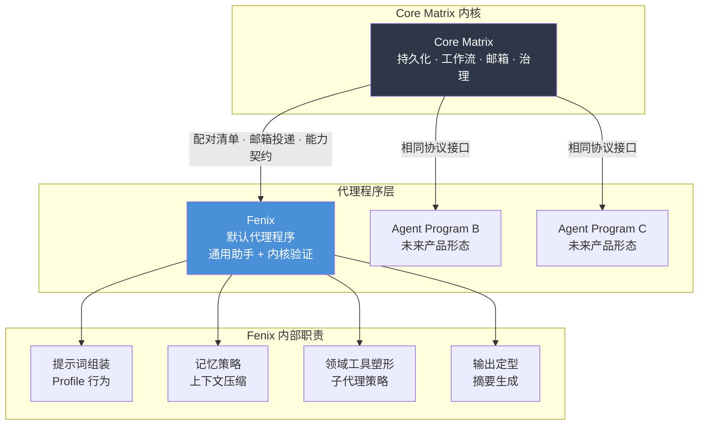
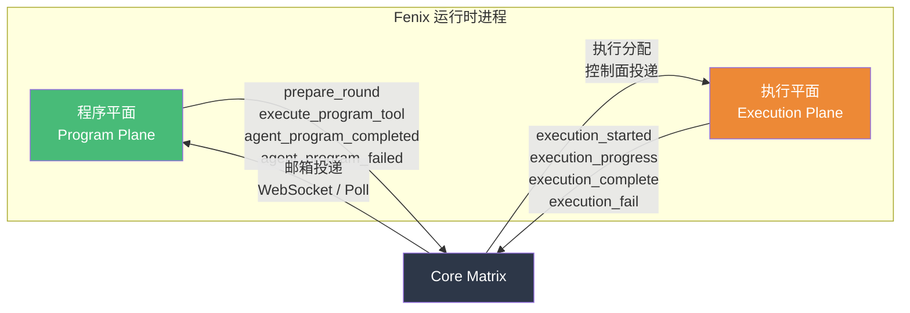
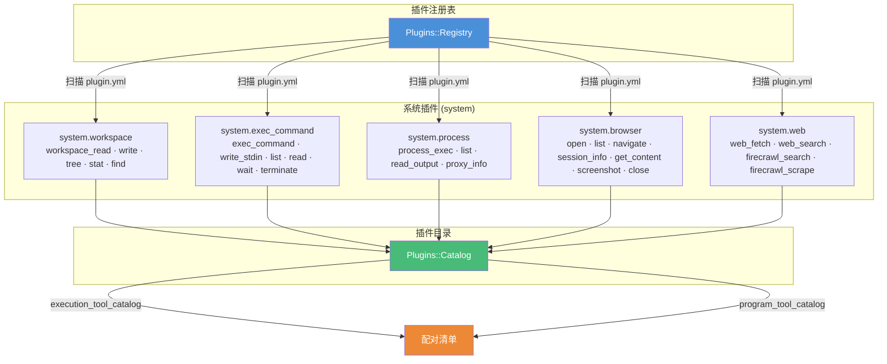
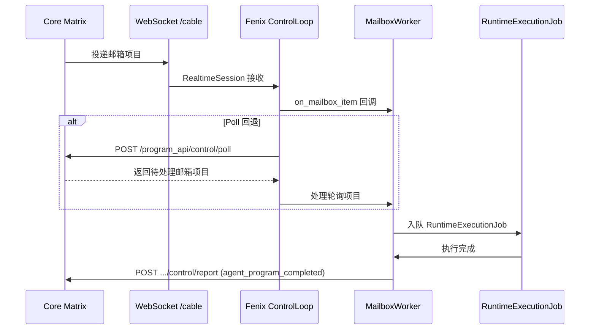

Fenix 是 Core Matrix 平台的**默认代理程序**（Agent Program），承担双重使命：作为开箱即用的通用助手产品交付给终端用户，同时作为第一个通过真实执行循环验证内核协议的技术验证程序。本文档聚焦 Fenix 的产品定位、能力边界、配对清单（Pairing Manifest）契约以及与 Core Matrix 内核之间的通信模型，帮助开发者理解 Fenix 在整个 Cybros 架构中的角色定位和集成接口。

Sources: [README.md](https://github.com/jasl/cybros.new/blob/main/agents/fenix/README.md#L1-L38)

## 产品定位与边界

**Fenix 的双重身份**决定它在架构中的特殊位置。一方面，它是面向用户的实用助手，融合了三类助手行为范式：以 `openclaw` 为灵感的一般对话助手行为、以 Codex 风格工作流为灵感的编码助手行为、以及以 `accomplish` 和 `maxclaw` 为灵感的日常办公辅助行为。另一方面，它是内核验证的首个完整代理程序——负责端到端证明真实的代理循环（agent loop），成为建立在内核之上的第一个完整 Web 产品，并在其他代理程序出现后继续证明内核的可复用性。

Sources: [README.md](https://github.com/jasl/cybros.new/blob/main/agents/fenix/README.md#L10-L38)

**Fenix 明确不是什么**同样重要。它不是内核本身，不是所有未来产品形态的归宿，也不是一个意图吸收所有实验的万能代理。当 Core Matrix 需要验证本质上不同的产品形态时，那些形态应该落地到独立的代理程序中，而非强塞进 Fenix。这种边界意识保证了 Fenix 能够保持聚焦和可维护性。

Sources: [README.md](https://github.com/jasl/cybros.new/blob/main/agents/fenix/README.md#L22-L31)



Sources: [agent-program-runtime-contract.md](https://github.com/jasl/cybros.new/blob/main/docs/design/2026-04-01-agent-program-runtime-contract.md#L37-L57)

## 职责分界模型

Fenix 与 Core Matrix 之间遵循严格的**职责分界契约**。Core Matrix 拥有持久化会话、轮次、工作流状态、邮箱投递、治理审计等内核关注点。Fenix 拥有提示词组装、上下文压缩策略、记忆策略、Profile 行为、领域工具塑形、子代理策略和输出定型等业务执行关注点。

下表总结了这一职责分界：

| 关注点 | 归属方 | 说明 |
|--------|--------|------|
| 持久会话/轮次/工作流状态 | Core Matrix | 内核拥有所有持久化真相 |
| 邮箱投递与等待/恢复语义 | Core Matrix | 工作流重入和报告新鲜度检查 |
| 能力可见性与治理审计 | Core Matrix | 工具治理、Profile 可见性 |
| Transcript 与上下文投影 | Core Matrix | 内核发送投影而非原始模型 |
| 提示词组装与缓存边界 | Fenix | 含 few-shot 示例、人设措辞 |
| 上下文压缩策略 | Fenix | 压缩阈值和摘要策略 |
| 记忆读写与提取策略 | Fenix | 记忆分类学和合并策略 |
| Profile 特定行为 | Fenix | main、researcher 等 Profile 语义 |
| 领域工具塑形 | Fenix | 工具措辞、展示摘要 |
| 子代理/专家编排策略 | Fenix | 派生与协调模式 |
| 输出定型与摘要生成 | Fenix | 进度摘要和结果摘要 |

Sources: [agent-program-runtime-contract.md](https://github.com/jasl/cybros.new/blob/main/docs/design/2026-04-01-agent-program-runtime-contract.md#L120-L171)

Fenix **必须不**将本地文件视为内核拥有的运行时资源的真相来源，不得在内核契约之外持久化持久工作流状态，不得通过显式协议方法之外的途径变更内核资源，也不得假设能从当前配置重新解释历史。

Sources: [agent-program-runtime-contract.md](https://github.com/jasl/cybros.new/blob/main/docs/design/2026-04-01-agent-program-runtime-contract.md#L166-L171)

## 配对清单契约

配对清单（Pairing Manifest）是 Fenix 与 Core Matrix 之间的**机器对机器能力声明**，通过唯一稳定的配对端点 `GET /runtime/manifest` 发布。当 Core Matrix 需要注册一个新的 Fenix 部署时，它读取此端点获取所有注册元数据。

Sources: [README.md](https://github.com/jasl/cybros.new/blob/main/agents/fenix/README.md#L42-L59), [manifests_controller.rb](https://github.com/jasl/cybros.new/blob/main/agents/fenix/app/controllers/runtime/manifests_controller.rb#L1-L9)

### 清单结构与核心字段

清单的完整结构由 `Fenix::Runtime::PairingManifest` 类构建，包含以下顶级字段：

| 字段 | 类型 | 说明 |
|------|------|------|
| `agent_key` | string | 固定为 `"fenix"` |
| `display_name` | string | 显示名称 `"Fenix"` |
| `includes_execution_runtime` | boolean | 是否内含执行运行时（当前为 `true`） |
| `runtime_kind` | string | 运行时类型，当前为 `"local"` |
| `runtime_fingerprint` | string | 格式 `fenix:<hostname>` 的运行时指纹 |
| `protocol_version` | string | 协议版本，当前为 `"agent-program/2026-04-01"` |
| `sdk_version` | string | SDK 版本，当前为 `"fenix-0.1.0"` |
| `program_contract` | object | 程序契约声明（传输模式、投递方式、方法列表） |
| `protocol_methods` | array | 支持的协议方法 ID 列表 |
| `tool_catalog` | array | 程序拥有的工具目录 |
| `execution_tool_catalog` | array | 执行运行时工具目录 |
| `effective_tool_catalog` | array | 合并后的有效工具目录 |
| `profile_catalog` | object | Profile 目录（main、researcher） |
| `program_plane` | object | 程序平面完整声明 |
| `execution_plane` | object | 执行平面完整声明 |
| `config_schema_snapshot` | object | 配置 schema 快照 |
| `default_config_snapshot` | object | 默认配置快照 |
| `execution_capability_payload` | object | 执行能力声明（含 runtime_foundation） |

Sources: [pairing_manifest.rb](https://github.com/jasl/cybros.new/blob/main/agents/fenix/app/services/fenix/runtime/pairing_manifest.rb#L184-L209)

### 协议方法

清单声明的 `PROTOCOL_METHOD_IDS` 定义了 Fenix 支持的全部协议方法：

| 方法 ID | 类别 | 说明 |
|---------|------|------|
| `agent_health` | 生命周期 | 健康状态上报 |
| `capabilities_handshake` | 能力协商 | 能力握手交换 |
| `capabilities_refresh` | 能力协商 | 能力刷新查询 |
| `agent_program_completed` | 执行完成 | 程序请求成功完成 |
| `agent_program_failed` | 执行完成 | 程序请求执行失败 |
| `execution_started` | 执行生命周期 | 执行开始通知 |
| `execution_progress` | 执行生命周期 | 执行进度上报 |
| `execution_complete` | 执行生命周期 | 执行完成通知 |
| `execution_fail` | 执行生命周期 | 执行失败通知 |
| `resource_close_request` | 资源关闭 | 资源关闭请求 |
| `resource_close_acknowledged` | 资源关闭 | 资源关闭确认 |
| `resource_closed` | 资源关闭 | 资源已关闭 |
| `resource_close_failed` | 资源关闭 | 资源关闭失败 |

Sources: [pairing_manifest.rb](https://github.com/jasl/cybros.new/blob/main/agents/fenix/app/services/fenix/runtime/pairing_manifest.rb#L8-L22)

### 程序契约

`program_contract` 字段声明了 Fenix 的通信模式：

```json
{
  "version": "v1",
  "transport": "mailbox-first",
  "delivery": ["websocket_push", "poll"],
  "methods": ["prepare_round", "execute_program_tool"]
}
```

这表示 Fenix 采用**邮箱优先**（mailbox-first）传输模式，通过 WebSocket 实时推送和 HTTP 轮询两种投递方式接收工作项，并支持 `prepare_round`（轮次准备）和 `execute_program_tool`（程序工具执行）两种请求类型。

Sources: [pairing_manifest.rb](https://github.com/jasl/cybros.new/blob/main/agents/fenix/app/services/fenix/runtime/pairing_manifest.rb#L225-L232)

## 双平面架构

Fenix 在配对清单中声明了**双平面**（Dual Plane）身份：同时充当 `AgentRuntime`（程序平面）和 `ExecutionRuntime`（执行平面）。这种双角色在清单的 `includes_execution_runtime: true` 字段中显式声明。



Sources: [README.md](https://github.com/jasl/cybros.new/blob/main/agents/fenix/README.md#L83-L88), [pairing_manifest.rb](https://github.com/jasl/cybros.new/blob/main/agents/fenix/app/services/fenix/runtime/pairing_manifest.rb#L238-L256)

**程序平面**承载代理程序的核心逻辑——轮次准备、上下文压缩、工具审查、输出定型。**执行平面**承载运行时工具的实际执行——工作区操作、命令运行、进程管理、浏览器会话、Web 请求。两个平面的工具目录分别声明，最终合并为 `effective_tool_catalog`。

Sources: [pairing_manifest.rb](https://github.com/jasl/cybros.new/blob/main/agents/fenix/app/services/fenix/runtime/pairing_manifest.rb#L315-L330)

## Profile 目录与子代理策略

清单的 `profile_catalog` 声明了 Fenix 支持的行为 Profile。当前定义了两个 Profile：

| Profile | 标签 | 说明 | 可用工具范围 |
|---------|------|------|-------------|
| `main` | Main | 主交互 Profile | 全部工具 + 全部子代理工具 |
| `researcher` | Researcher | 委托研究 Profile | 全部工具 + 子代理工具（不含 `subagent_spawn`） |

`researcher` Profile 通过 `default_subagent_profile: true` 标记为子代理的默认 Profile，且不允许嵌套派生新的子代理（不包含 `subagent_spawn`）。

Sources: [pairing_manifest.rb](https://github.com/jasl/cybros.new/blob/main/agents/fenix/app/services/fenix/runtime/pairing_manifest.rb#L262-L278)

清单还通过 `conversation_override_schema_snapshot` 暴露了对话级别的子代理覆盖配置，以及通过 `default_config_snapshot` 声明默认配置：

| 配置项 | 默认值 | 说明 |
|--------|--------|------|
| `sandbox` | `"workspace-write"` | 沙箱模式 |
| `interactive.profile` | `"main"` | 交互式对话默认 Profile |
| `interactive.selector` | `"role:main"` | 主 Profile 选择器 |
| `model_slots.research.selector` | `"role:researcher"` | 研究 Profile 选择器 |
| `subagents.enabled` | `true` | 子代理是否启用 |
| `subagents.allow_nested` | `true` | 是否允许嵌套子代理 |
| `subagents.max_depth` | `3` | 最大嵌套深度 |

Sources: [pairing_manifest.rb](https://github.com/jasl/cybros.new/blob/main/agents/fenix/app/services/fenix/runtime/pairing_manifest.rb#L113-L170)

## 插件驱动的工具体系

Fenix 的工具体系采用**插件驱动**架构而非硬编码。每个工具族通过 `plugin.yml` 声明元数据，由 `Fenix::Plugins::Registry` 自动发现并注册到工具目录中。



Sources: [registry.rb](https://github.com/jasl/cybros.new/blob/main/agents/fenix/app/services/fenix/plugins/registry.rb#L1-L41), [catalog.rb](https://github.com/jasl/cybros.new/blob/main/agents/fenix/app/services/fenix/plugins/catalog.rb#L1-L38)

### 操作器分组

工具按**操作器分组**（Operator Group）组织为六个族，每组对应一类运行时资源：

| 操作器分组 | 标签 | 管理的资源类型 | 插件来源 |
|-----------|------|--------------|---------|
| `agent_core` | Agent Core | 代理上下文 | 代码内建（calculator、estimate_*、compact_context） |
| `workspace` | Workspace | 工作区路径 | system.workspace 插件 |
| `memory` | Memory | 运行时记忆 | 代码内建（memory_* 系列） |
| `command_run` | Command Run | 附加命令 | system.exec_command 插件 |
| `process_run` | Process Run | 分离进程 | system.process 插件 |
| `browser_session` | Browser Session | 浏览器会话 | system.browser 插件 |
| `web` | Web | 网络请求 | system.web 插件 |

Sources: [catalog.rb](https://github.com/jasl/cybros.new/blob/main/agents/fenix/app/services/fenix/operator/catalog.rb#L4-L33), [system_tool_registry.rb](https://github.com/jasl/cybros.new/blob/main/agents/fenix/app/services/fenix/runtime/system_tool_registry.rb#L36-L62)

### 完整工具清单

下表列出配对清单中声明的全部工具及其所属平面：

| 工具名 | 平面 | 操作器分组 | 可变性 | 流式支持 |
|--------|------|-----------|--------|---------|
| `compact_context` | program | agent_core | 否 | 否 |
| `estimate_messages` | program | agent_core | 否 | 否 |
| `estimate_tokens` | program | agent_core | 否 | 否 |
| `calculator` | program | agent_core | 否 | 否 |
| `workspace_read` | execution | workspace | 否 | 否 |
| `workspace_write` | execution | workspace | 是 | 否 |
| `workspace_tree` | execution | workspace | 否 | 否 |
| `workspace_stat` | execution | workspace | 否 | 否 |
| `workspace_find` | execution | workspace | 否 | 否 |
| `memory_store` | execution | memory | 是 | 否 |
| `memory_get` | execution | memory | 否 | 否 |
| `memory_list` | execution | memory | 否 | 否 |
| `memory_search` | execution | memory | 否 | 否 |
| `memory_append_daily` | execution | memory | 是 | 否 |
| `memory_compact_summary` | execution | memory | 是 | 否 |
| `exec_command` | execution | command_run | 是 | 是 |
| `write_stdin` | execution | command_run | 是 | 是 |
| `command_run_list` | execution | command_run | 否 | 否 |
| `command_run_read_output` | execution | command_run | 否 | 否 |
| `command_run_wait` | execution | command_run | 否 | 是 |
| `command_run_terminate` | execution | command_run | 是 | 否 |
| `process_exec` | execution | process_run | 是 | 是 |
| `process_list` | execution | process_run | 否 | 否 |
| `process_read_output` | execution | process_run | 否 | 否 |
| `process_proxy_info` | execution | process_run | 否 | 否 |
| `browser_open` | execution | browser_session | 是 | 否 |
| `browser_list` | execution | browser_session | 否 | 否 |
| `browser_navigate` | execution | browser_session | 是 | 否 |
| `browser_session_info` | execution | browser_session | 否 | 否 |
| `browser_get_content` | execution | browser_session | 否 | 否 |
| `browser_screenshot` | execution | browser_session | 否 | 否 |
| `browser_close` | execution | browser_session | 是 | 否 |
| `web_fetch` | execution | web | 否 | 否 |
| `web_search` | execution | web | 否 | 否 |
| `firecrawl_search` | execution | web | 否 | 否 |
| `firecrawl_scrape` | execution | web | 否 | 否 |

Sources: [pairing_manifest.rb](https://github.com/jasl/cybros.new/blob/main/agents/fenix/app/services/fenix/runtime/pairing_manifest.rb#L23-L105), [system_tool_registry.rb](https://github.com/jasl/cybros.new/blob/main/agents/fenix/app/services/fenix/runtime/system_tool_registry.rb#L36-L62)

## 控制平面与邮箱投递

Fenix 不依赖内核回调端点进行正常执行和关闭控制。Core Matrix 是编排真相，通过控制平面投递邮箱项目。投递通道包括：

1. **实时 WebSocket 推送**（通过 `/cable`）：`Fenix::Runtime::RealtimeSession` 连接 Core Matrix 的 ActionCable 频道 `AgentControlChannel`，实时接收邮箱项目
2. **HTTP 轮询回退**（通过 `POST /program_api/control/poll` 和 `POST /execution_api/control/poll`）：当 WebSocket 不可用时，通过轮询获取待处理邮箱项目
3. **报告回传**（通过 `POST /program_api/control/report` 和 `POST /execution_api/control/report`）：Fenix 向内核报告执行进度、完成和失败状态



Sources: [control_loop.rb](https://github.com/jasl/cybros.new/blob/main/agents/fenix/app/services/fenix/runtime/control_loop.rb#L30-L47), [realtime_session.rb](https://github.com/jasl/cybros.new/blob/main/agents/fenix/app/services/fenix/runtime/realtime_session.rb#L50-L71), [control_client.rb](https://github.com/jasl/cybros.new/blob/main/agents/fenix/app/services/fenix/runtime/control_client.rb#L28-L41)

### 邮箱项目处理流程

`MailboxWorker` 根据邮箱项目类型分发处理逻辑：

| 项目类型 | 处理逻辑 |
|---------|---------|
| `resource_close_request` (AgentTaskRun) | 终止关联命令运行、取消活跃执行、报告关闭生命周期 |
| `resource_close_request` (ProcessRun) | 委托 Processes::Manager 关闭进程 |
| `resource_close_request` (SubagentSession) | 报告关闭生命周期 |
| `execution_assignment` | 创建 RuntimeExecution 并入队执行 |
| `agent_program_request` | 创建 RuntimeExecution 并入队执行 |

Sources: [mailbox_worker.rb](https://github.com/jasl/cybros.new/blob/main/agents/fenix/app/services/fenix/runtime/mailbox_worker.rb#L20-L30)

### 执行拓扑与队列分派

Fenix 使用 Solid Queue 作为后台任务适配器，定义了五个专用队列来分派不同性质的工作：

| 队列名 | 用途 | 默认线程数 |
|--------|------|-----------|
| `runtime_prepare_round` | 轮次准备任务 | 3 |
| `runtime_pure_tools` | 纯工具执行（不涉及注册表资源） | 8 |
| `runtime_process_tools` | 进程类工具执行（涉及注册表资源） | 3 |
| `runtime_control` | 控制类任务 | 2 |
| `maintenance` | 维护任务 | 1 |

`ExecutionTopology` 模块根据工具名和项目类型自动选择队列——注册表支持的工具（命令运行、进程管理、浏览器会话）路由到 `runtime_process_tools`，其他工具路由到 `runtime_pure_tools`。

Sources: [execution_topology.rb](https://github.com/jasl/cybros.new/blob/main/agents/fenix/app/services/fenix/runtime/execution_topology.rb#L1-L86), [queue.yml](https://github.com/jasl/cybros.new/blob/main/agents/fenix/config/queue.yml#L1-L35)

## 注册与配对流程

Fenix 注册为外部运行时时，通过 `ControlClient#register!` 向 Core Matrix 的 `POST /program_api/registrations` 发送注册请求，携带 enrollment token、运行时指纹、完整配对清单和端点元数据。Core Matrix 通过 `AgentProgramVersions::Register` 服务创建部署记录并返回会话凭证。

Sources: [control_client.rb](https://github.com/jasl/cybros.new/blob/main/agents/fenix/app/services/fenix/runtime/control_client.rb#L43-L79), [registrations_controller.rb](https://github.com/jasl/cybros.new/blob/main/core_matrix/app/controllers/program_api/registrations_controller.rb#L5-L43)

注册成功后，Core Matrix 返回以下关键凭证和标识：

| 返回字段 | 说明 |
|---------|------|
| `agent_program_id` | 代理程序逻辑标识 |
| `agent_program_version_id` | 部署版本标识 |
| `agent_session_id` | 程序平面会话标识 |
| `execution_session_id` | 执行平面会话标识 |
| `machine_credential` | 程序平面凭证 |
| `execution_machine_credential` | 执行平面凭证 |

这些凭证随后用于 WebSocket 连接认证、轮询请求授权和报告回传鉴权。

Sources: [registrations_controller.rb](https://github.com/jasl/cybros.new/blob/main/core_matrix/app/controllers/program_api/registrations_controller.rb#L29-L42)

## 运行时基础设施声明

配对清单的 `execution_capability_payload.runtime_foundation` 块声明了 Fenix 预期的运行时基础设施基线，让运维人员无需先读部署文档即可检查宿主/工具链要求：

| 声明项 | 值 |
|--------|-----|
| 容器基线 | Ubuntu 24.04 |
| Ruby 版本 | 由 `.ruby-version` 文件决定 |
| Node 版本 | 由 `.node-version` 文件决定 |
| Python 版本 | 由 `.python-version` 文件决定 |
| 引导脚本 | `bootstrap-runtime-deps.sh`（Linux）、`bootstrap-runtime-deps-darwin.sh`（macOS） |

此外，`execution_capability_payload` 还声明了固定端口开发代理（dev proxy）的配置：外部端口默认 `3310`，路径模板 `/dev/<process_run_id>`，用于暴露分离进程的代理访问。

Sources: [pairing_manifest.rb](https://github.com/jasl/cybros.new/blob/main/agents/fenix/app/services/fenix/runtime/pairing_manifest.rb#L280-L313), [Dockerfile](https://github.com/jasl/cybros.new/blob/main/agents/fenix/Dockerfile#L18-L19)

## 部署形态

Fenix 文档化了三种部署目标，与配对清单声明一致：

| 部署形态 | 说明 | 关键配置 |
|---------|------|---------|
| **Docker Compose** | 默认部署路径 | 两个服务：`fenix`（主运行时，端口 3101）和 `fenix-dev-proxy`（代理，端口 3310） |
| **Ubuntu 24.04 裸机** | 规范宿主目标 | 使用 `bootstrap-runtime-deps.sh` 安装依赖 |
| **macOS 开发** | 开发验证环境 | 使用 `bootstrap-runtime-deps-darwin.sh`，非规范基线 |

Sources: [README.md](https://github.com/jasl/cybros.new/blob/main/agents/fenix/README.md#L382-L434), [docker-compose.fenix.yml](https://github.com/jasl/cybros.new/blob/main/agents/fenix/docker-compose.fenix.yml#L1-L31)

### 关键环境变量

| 变量 | 必需 | 说明 |
|------|------|------|
| `FENIX_PUBLIC_BASE_URL` | 是 | 清单发布的外部可达 URL |
| `CORE_MATRIX_BASE_URL` | 是 | Core Matrix 控制平面 URL |
| `CORE_MATRIX_MACHINE_CREDENTIAL` | 是 | Core Matrix 机器凭证 |
| `CORE_MATRIX_EXECUTION_MACHINE_CREDENTIAL` | 否 | 独立执行平面凭证（默认复用机器凭证） |
| `PLAYWRIGHT_BROWSERS_PATH` | 推荐 | Playwright 浏览器安装路径 |
| `FENIX_DEV_PROXY_PORT` | 否 | 开发代理端口（默认 3310） |
| `SECRET_KEY_BASE` | 条件 | 可由 Rails credentials 替代 |
| `STANDALONE_SOLID_QUEUE` | 否 | 设为 `true` 时分离队列工作进程 |

Sources: [env.sample](https://github.com/jasl/cybros.new/blob/main/agents/fenix/env.sample#L36-L98)

## 部署轮换模型

Fenix 将版本变更视为**部署轮换**（Deployment Rotation）：

1. 启动新 Fenix 版本作为新部署
2. 暴露相同的配对清单和邮箱控制契约
3. 向 Core Matrix 注册
4. 新部署达到健康运行时参与后，将未来工作切换到新部署

当前运行时中**没有就地自更新器**。升级和降级是相同的内核面向操作——启动新的 Fenix 实例并注册为新部署。

Sources: [README.md](https://github.com/jasl/cybros.new/blob/main/agents/fenix/README.md#L369-L378)

## 延伸阅读

本文档聚焦 Fenix 的产品定位和配对清单契约。以下页面提供了更深入的相关主题：

- [控制循环、邮箱工作器与实时会话](https://github.com/jasl/cybros.new/blob/main/20-kong-zhi-xun-huan-you-xiang-gong-zuo-qi-yu-shi-shi-hui-hua)：深入了解 ControlLoop、MailboxWorker 和 RealtimeSession 的执行细节
- [技能系统：系统技能、精选技能与安装管理](https://github.com/jasl/cybros.new/blob/main/21-ji-neng-xi-tong-xi-tong-ji-neng-jing-xuan-ji-neng-yu-an-zhuang-guan-li)：技能边界与 `.system`/`.curated`/live 三层技能根
- [执行钩子：上下文准备、压缩、工具审查与输出定型](https://github.com/jasl/cybros.new/blob/main/22-zhi-xing-gou-zi-shang-xia-wen-zhun-bei-ya-suo-gong-ju-shen-cha-yu-shu-chu-ding-xing)：六个阶段化运行时钩子的调用链
- [插件体系与工具执行器（Web、浏览器、进程、工作区）](https://github.com/jasl/cybros.new/blob/main/23-cha-jian-ti-xi-yu-gong-ju-zhi-xing-qi-web-liu-lan-qi-jin-cheng-gong-zuo-qu)：插件发现、清单解析与工具执行器实现
- [Program API：代理程序机器对机器接口](https://github.com/jasl/cybros.new/blob/main/24-program-api-dai-li-cheng-xu-ji-qi-dui-ji-qi-jie-kou)：Core Matrix 侧的 Program API 端点详细规格
- [Execution API：运行时资源控制接口](https://github.com/jasl/cybros.new/blob/main/25-execution-api-yun-xing-shi-zi-yuan-kong-zhi-jie-kou)：执行平面的 API 契约