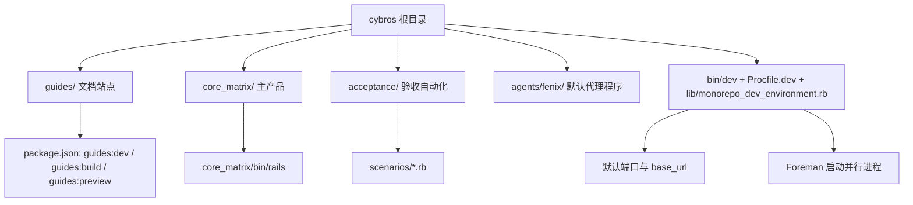
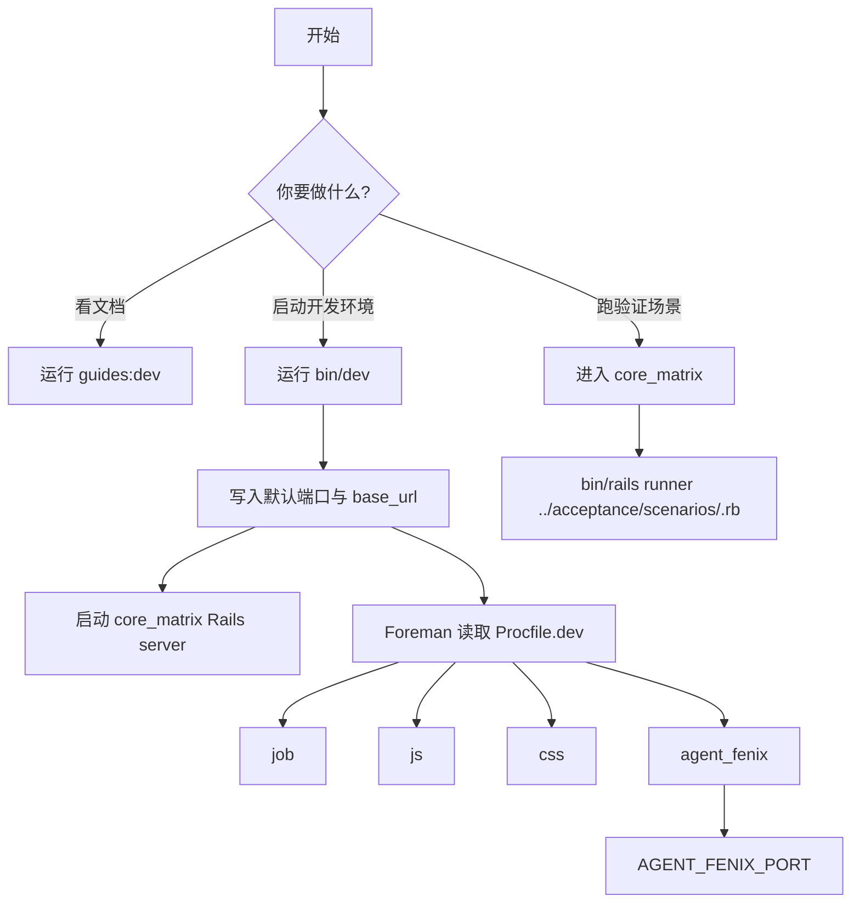

本页是给初学者的最短上手路径：先知道仓库里有什么，再知道应该先跑哪一个入口。这个 monorepo 以 `Core Matrix` 作为内核产品、以 `Fenix` 作为默认代理程序；文档维护顺序也被固定在仓库根 README 中，所以本页只负责把“阅读文档”和“启动开发环境”两条最短路径讲清楚。Sources: [README.md](https://github.com/jasl/cybros.new/blob/main/README.md#L3-L13) [README.md](https://github.com/jasl/cybros.new/blob/main/README.md#L17-L28)

## 先看仓库入口
如果你只记一个原则：**文档站点走 `guides`，本地开发走 `bin/dev`**。前者由根目录 `package.json` 里的 `guides:dev`、`guides:build`、`guides:preview` 脚本提供；后者由 `bin/dev` 统一设置环境变量，再启动 `core_matrix` 的 Rails 服务和 `Procfile.dev` 中定义的并行进程。Sources: [package.json](https://github.com/jasl/cybros.new/blob/main/package.json#L7-L10) [bin/dev](https://github.com/jasl/cybros.new/blob/main/bin/dev#L4-L19) [Procfile.dev](https://github.com/jasl/cybros.new/blob/main/Procfile.dev#L1-L5)

Sources: [package.json](https://github.com/jasl/cybros.new/blob/main/package.json#L7-L10) [bin/dev](https://github.com/jasl/cybros.new/blob/main/bin/dev#L11-L19) [bin/dev](https://github.com/jasl/cybros.new/blob/main/bin/dev#L22-L54) [Procfile.dev](https://github.com/jasl/cybros.new/blob/main/Procfile.dev#L1-L5) [lib/monorepo_dev_environment.rb](https://github.com/jasl/cybros.new/blob/main/lib/monorepo_dev_environment.rb#L3-L19) [acceptance/README.md](https://github.com/jasl/cybros.new/blob/main/acceptance/README.md#L12-L29)

## 最小启动流程
第一步，先把文档站点当作“读说明书”的入口：VitePress 已在 `guides/.vitepress/config.mjs` 配好站点标题与导航，而根脚本已经把文档开发、构建、预览三种模式列出来。对新手来说，最重要的不是记住站点内部细节，而是知道“文档相关任务先看 `guides` 目录”。Sources: [guides/.vitepress/config.mjs](https://github.com/jasl/cybros.new/blob/main/guides/.vitepress/config.mjs#L1-L28) [package.json](https://github.com/jasl/cybros.new/blob/main/package.json#L7-L10)

第二步，如果你的目标是把整个开发栈跑起来，直接使用 `bin/dev`。它会先加载 `MonorepoDevEnvironment.defaults`，把 `PORT`、`CORE_MATRIX_PORT`、`AGENT_FENIX_PORT`、`AGENT_FENIX_BASE_URL` 写入环境；其中默认端口分别是 `3000`、`36173`，代理主机是 `127.0.0.1`。接着脚本会在需要时安装 `foreman`，然后同时启动 `core_matrix/bin/rails server` 和 `Procfile.dev` 定义的其他进程。Sources: [lib/monorepo_dev_environment.rb](https://github.com/jasl/cybros.new/blob/main/lib/monorepo_dev_environment.rb#L3-L19) [bin/dev](https://github.com/jasl/cybros.new/blob/main/bin/dev#L11-L19) [bin/dev](https://github.com/jasl/cybros.new/blob/main/bin/dev#L22-L54)

Sources: [lib/monorepo_dev_environment.rb](https://github.com/jasl/cybros.new/blob/main/lib/monorepo_dev_environment.rb#L3-L19) [bin/dev](https://github.com/jasl/cybros.new/blob/main/bin/dev#L11-L19) [bin/dev](https://github.com/jasl/cybros.new/blob/main/bin/dev#L22-L54) [Procfile.dev](https://github.com/jasl/cybros.new/blob/main/Procfile.dev#L1-L5) [acceptance/README.md](https://github.com/jasl/cybros.new/blob/main/acceptance/README.md#L12-L29)

## 入口速查表
| 场景 | 你该看什么 | 说明 |
|---|---|---|
| 只想读指南 | `guides` 目录与 `guides` 脚本 | 文档站点由 VitePress 提供 |
| 想启动本地开发 | `bin/dev` | 统一启动 Rails、前端构建和 `agent_fenix` |
| 想跑接受性场景 | `acceptance/README.md` | 通过 `core_matrix` 的 Rails 环境执行场景脚本 |

Sources: [package.json](https://github.com/jasl/cybros.new/blob/main/package.json#L7-L10) [bin/dev](https://github.com/jasl/cybros.new/blob/main/bin/dev#L4-L19) [Procfile.dev](https://github.com/jasl/cybros.new/blob/main/Procfile.dev#L1-L5) [acceptance/README.md](https://github.com/jasl/cybros.new/blob/main/acceptance/README.md#L12-L29)

## 环境变量速查
| 变量 | 默认值 | 作用 |
|---|---|---|
| `PORT` | `3000` | `core_matrix` 的主端口 |
| `CORE_MATRIX_PORT` | `PORT` 或 `3000` | `core_matrix` 使用的端口来源 |
| `AGENT_FENIX_PORT` | `36173` | `agent_fenix` 的端口 |
| `AGENT_FENIX_HOST` | `127.0.0.1` | `agent_fenix` 的主机 |
| `AGENT_FENIX_BASE_URL` | `http://127.0.0.1:36173` | `agent_fenix` 的基础地址 |

Sources: [lib/monorepo_dev_environment.rb](https://github.com/jasl/cybros.new/blob/main/lib/monorepo_dev_environment.rb#L3-L19) [Procfile.dev](https://github.com/jasl/cybros.new/blob/main/Procfile.dev#L1-L5)

## 接下来读什么
当你已经知道“文档站点”和“本地开发环境”这两个入口之后，下一步建议按目录继续读：[单仓库开发环境与关键命令](https://github.com/jasl/cybros.new/blob/main/3-dan-cang-ku-kai-fa-huan-jing-yu-guan-jian-ming-ling)、[项目边界与主要角色](https://github.com/jasl/cybros.new/blob/main/4-xiang-mu-bian-jie-yu-zhu-yao-jiao-se)、[文档生命周期与阅读路线](https://github.com/jasl/cybros.new/blob/main/5-wen-dang-sheng-ming-zhou-qi-yu-yue-du-lu-xian)。这三页会把本页提到的入口放回更完整的仓库语境里。Sources: [README.md](https://github.com/jasl/cybros.new/blob/main/README.md#L17-L28) [docs/README.md](https://github.com/jasl/cybros.new/blob/main/docs/README.md#L16-L18)