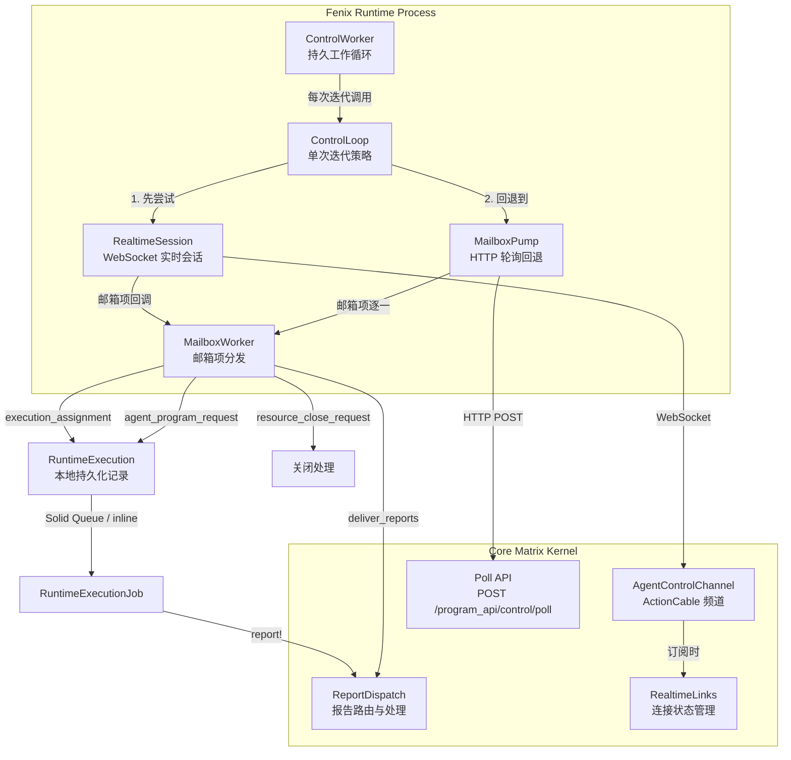
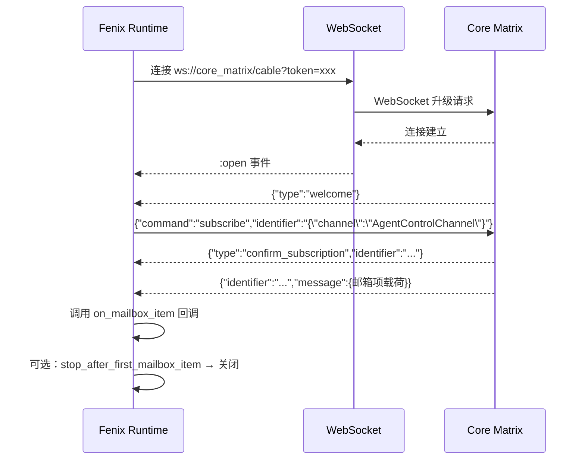
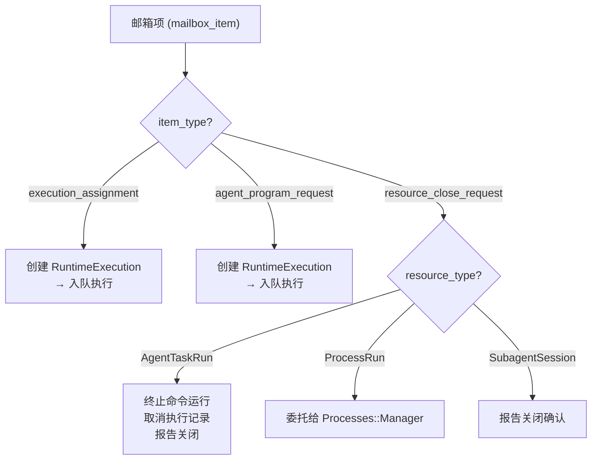
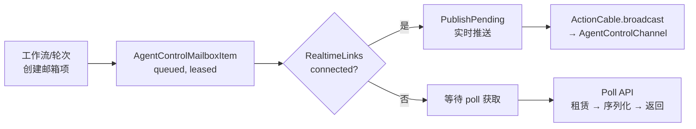
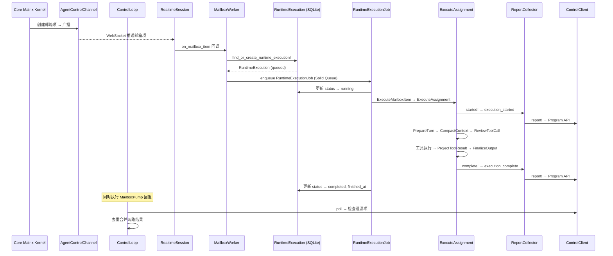

Fenix 运行时的控制循环是 Core Matrix 内核与 Fenix 代理程序之间的**唯一执行通道**。它将三种传输机制——WebSocket 实时推送、HTTP 长轮询回退、邮箱租约交付——统一为一个**邮箱优先**（mailbox-first）的控制平面。本文深入解析 `ControlWorker`（持久工作循环）、`ControlLoop`（单次迭代策略）、`RealtimeSession`（WebSocket 会话管理）与 `MailboxWorker`（邮箱项分发）四层架构的协作机制、数据流路径与容错语义。

Sources: [control_worker.rb](https://github.com/jasl/cybros.new/blob/main/agents/fenix/app/services/fenix/runtime/control_worker.rb#L1-L124), [control_loop.rb](https://github.com/jasl/cybros.new/blob/main/agents/fenix/app/services/fenix/runtime/control_loop.rb#L1-L110)

## 架构总览：四层控制栈

在深入每一层之前，先建立整体心智模型。Fenix 运行时的控制栈遵循**从外到内、从宏观到微观**的四层结构：



**ControlWorker** 是最外层的持久循环，负责迭代调度、退避策略和生命周期管理。**ControlLoop** 是单次迭代的策略单元，执行"先实时、后轮询"的双通道获取。**RealtimeSession** 管理 WebSocket 连接的生命周期，从握手到订阅、消息处理到超时断开。**MailboxWorker** 是所有邮箱项的统一入口点，负责类型路由和本地执行记录的创建与分发。

Sources: [control_worker.rb](https://github.com/jasl/cybros.new/blob/main/agents/fenix/app/services/fenix/runtime/control_worker.rb#L31-L46), [control_loop.rb](https://github.com/jasl/cybros.new/blob/main/agents/fenix/app/services/fenix/runtime/control_loop.rb#L30-L47), [realtime_session.rb](https://github.com/jasl/cybros.new/blob/main/agents/fenix/app/services/fenix/runtime/realtime_session.rb#L50-L71)

## ControlWorker：持久工作循环

`ControlWorker` 是 Fenix 运行时的**主入口进程**。通过 `rake runtime:control_loop_forever` 启动后，它会持续运行直到收到 `INT` 或 `TERM` 信号。其核心职责不是执行具体工作，而是**编排迭代节奏**。

### 迭代循环与退避策略

每一次迭代，ControlWorker 委托给 `ControlLoop` 执行一次完整的"实时+轮询"周期。迭代完成后，根据结果决定休眠策略：

| 迭代结果 | 休眠行为 | 持续时间 |
|---------|---------|---------|
| 处理了邮箱项 | 不休眠，立即进入下一轮 | 0 |
| 空闲（无工作） | 正常空闲退避 | `idle_sleep_seconds`（默认 0.25s） |
| 实时会话失败 | 故障退避 | `failure_sleep_seconds`（默认 1.0s） |

退避期间，休眠被分割为 100ms 的小段，以便在收到 `stop!` 信号时能够**快速响应退出**。这避免了在长休眠中被信号阻塞的问题。

Sources: [control_worker.rb](https://github.com/jasl/cybros.new/blob/main/agents/fenix/app/services/fenix/runtime/control_worker.rb#L31-L76)

### 生命周期管理

ControlWorker 在启动时调用 `sweep_local_process_handles!` 清理残留的已终止进程句柄，在退出时通过 `cleanup!` 重置 `CommandRunRegistry`。注意一个关键设计决策：**长生命周期进程句柄不会被清理**——它们保留在进程管理器中，因为它们是内核拥有的 `ProcessRun` 资源的本地投影，可能需要在后续迭代中响应关闭请求。

Sources: [control_worker.rb](https://github.com/jasl/cybros.new/blob/main/agents/fenix/app/services/fenix/runtime/control_worker.rb#L78-L88)

### 错误恢复

ControlWorker 捕获 `ControlLoop` 抛出的所有异常，将其转化为一个错误状态的 `Result` 对象而非崩溃。这意味着**瞬态故障（如网络闪断、WebSocket 握手失败）不会终止工作循环**。测试套件验证了：即使第一次迭代抛出 "transient control failure"，ControlWorker 仍会在第二次迭代中恢复正常运行。

Sources: [control_worker.rb](https://github.com/jasl/cybros.new/blob/main/agents/fenix/app/services/fenix/runtime/control_worker.rb#L90-L116), [control_worker_test.rb](https://github.com/jasl/cybros.new/blob/main/agents/fenix/test/services/fenix/runtime/control_worker_test.rb#L174-L200)

## ControlLoop：双通道获取策略

`ControlLoop` 封装了**单次迭代的双通道获取逻辑**。它的核心不变量是：**实时推送是首选路径，HTTP 轮询是补偿路径，两者可能同时产出结果，需要去重合并**。

### 执行序列

```
1. 构建并执行 RealtimeSession（WebSocket 连接 → 订阅 → 接收 → 处理/超时）
2. 执行 MailboxPump（HTTP 轮询获取遗漏项）
3. 去重合并两路结果
4. 返回 Result（包含 transport 标记、realtime_result、mailbox_results）
```

### Transport 标记与结果合并

ControlLoop 返回的 `transport` 字段标记本次迭代实际使用的通道：

| transport 值 | 含义 |
|-------------|------|
| `"realtime"` | 实时通道处理了邮箱项，轮询未发现额外工作 |
| `"realtime+poll"` | 实时通道和轮询都产出了工作 |
| `"poll"` | 实时通道未处理任何项，所有工作来自轮询 |

去重逻辑基于 `mailbox_item_id`：如果同一个邮箱项同时被实时通道和轮询获取（竞态场景），只保留第一次出现的结果。这确保了**幂等性**——即使存在交付竞态，同一个工作项也不会被执行两次。

Sources: [control_loop.rb](https://github.com/jasl/cybros.new/blob/main/agents/fenix/app/services/fenix/runtime/control_loop.rb#L30-L86)

### 内联模式

当 `inline: true` 时，所有邮箱项在当前线程同步执行（`perform_now`），而非通过 Solid Queue 异步调度。这是测试场景的关键入口，使得单次 ControlWorker 迭代可以在同一进程内完成完整的"获取→创建→执行→报告"周期。

Sources: [mailbox_worker.rb](https://github.com/jasl/cybros.new/blob/main/agents/fenix/app/services/fenix/runtime/mailbox_worker.rb#L170-L178)

## RealtimeSession：WebSocket 实时会话

`RealtimeSession` 是 Fenix 与 Core Matrix 之间**低延迟双向通道**的实现。它基于 ActionCable 协议，通过 `websocket-client-simple` 建立 WebSocket 连接，订阅 `AgentControlChannel`，并处理实时推送的邮箱项。

### ActionCable 握手序列



连接建立后，Core Matrix 的 `AgentControlChannel.subscribed` 回调会触发 `RealtimeLinks::Open`，将该部署标记为 `realtime_link_connected: true` 并推送所有待投递的邮箱项。这意味着**连接建立本身就会触发积压工作的刷新**。

Sources: [realtime_session.rb](https://github.com/jasl/cybros.new/blob/main/agents/fenix/app/services/fenix/runtime/realtime_session.rb#L50-L171), [agent_control_channel.rb](https://github.com/jasl/cybros.new/blob/main/core_matrix/app/channels/agent_control_channel.rb#L1-L15), [open.rb](https://github.com/jasl/cybros.new/blob/main/core_matrix/app/services/agent_control/realtime_links/open.rb#L1-L34)

### 事件处理模型

RealtimeSession 使用 `Queue` 作为线程安全的事件缓冲区。WebSocket 回调将事件推入队列，主循环通过 `next_event` 方法以**非阻塞弹出+忙等待**的方式消费事件。这种设计避免了回调地狱，同时保持了单线程的消息处理顺序。

ActionCable 协议消息类型及其处理方式：

| 消息类型 | ActionCable 常量 | 处理行为 |
|---------|-----------------|---------|
| welcome | `welcome` | 触发 subscribe 命令 |
| confirm_subscription | `confirmation` | 标记订阅已确认 |
| reject_subscription | `rejection` | 抛出异常（订阅被拒绝） |
| disconnect | `disconnect` | 记录原因和重连标记，关闭会话 |
| ping | `ping` | 忽略（保持连接活跃） |
| 邮箱项消息 | 其他 | 调用 `on_mailbox_item` 回调 |

Sources: [realtime_session.rb](https://github.com/jasl/cybros.new/blob/main/agents/fenix/app/services/fenix/runtime/realtime_session.rb#L105-L171)

### 超时机制

RealtimeSession 具有双层超时控制：

- **全局超时** (`timeout_seconds`，默认 5s)：从 `next_event` 调用开始，如果在该时间内没有收到任何 WebSocket 事件，会话超时
- **邮箱项超时** (`mailbox_item_timeout_seconds`)：从会话开始或上次邮箱项处理后，如果在该时间内没有收到新的邮箱项，会话超时

在 ControlWorker 的持久循环模式下，`stop_after_first_mailbox_item` 被设为 `false`，`mailbox_item_timeout_seconds` 等于 `timeout_seconds`。这意味着 WebSocket 会话会持续保持，直到超时或服务器主动断开。每次超时后，ControlWorker 会创建新的 RealtimeSession，形成**连接轮转**。

Sources: [realtime_session.rb](https://github.com/jasl/cybros.new/blob/main/agents/fenix/app/services/fenix/runtime/realtime_session.rb#L184-L193), [control_worker.rb](https://github.com/jasl/cybros.new/blob/main/agents/fenix/test/services/fenix/runtime/control_worker_test.rb#L145-L172)

## MailboxWorker：邮箱项分发与资源生命周期

`MailboxWorker` 是所有邮箱项的**统一分发入口**。无论是从 RealtimeSession 的回调路径还是从 MailboxPump 的轮询路径进入，最终都汇聚到 MailboxWorker 进行类型路由。

### 邮箱项类型路由



三种 `resource_close_request` 分别路由到不同的关闭处理器。`AgentTaskRun` 关闭会终止所有关联的命令运行（`CommandRunRegistry.terminate_for_agent_task`）并取消所有排队中的 `RuntimeExecution`。`ProcessRun` 关闭委托给进程管理器执行优雅终止。`SubagentSession` 关闭仅发送确认报告。

Sources: [mailbox_worker.rb](https://github.com/jasl/cybros.new/blob/main/agents/fenix/app/services/fenix/runtime/mailbox_worker.rb#L20-L155)

### RuntimeExecution 本地持久化

每个可执行的邮箱项（`execution_assignment` 或 `agent_program_request`）在分发前都会创建或查找一个 `RuntimeExecution` 记录。这是 Fenix 本地 SQLite 数据库中的持久化状态机：

| 状态 | 含义 |
|-----|------|
| `queued` | 已创建，等待执行 |
| `running` | 正在执行中 |
| `completed` | 执行成功完成 |
| `failed` | 执行失败 |
| `canceled` | 被关闭请求取消 |

`dispatchable?` 方法确保只有 `queued` 且从未被启动或入队的记录才会被调度执行。重复收到相同邮箱项时（`mailbox_item_id` + `attempt_no` 唯一约束），会返回已存在的记录而非重复创建。

Sources: [runtime_execution.rb](https://github.com/jasl/cybros.new/blob/main/agents/fenix/app/models/runtime_execution.rb#L1-L97), [mailbox_worker.rb](https://github.com/jasl/cybros.new/blob/main/agents/fenix/app/services/fenix/runtime/mailbox_worker.rb#L34-L76)

### SQLite 锁定重试

Fenix 使用 SQLite 作为本地数据库，在并发场景下可能遇到 `database is locked` 错误。MailboxWorker 内置了 `with_transient_sqlite_retry` 机制：最多重试 5 次，每次退避时间随尝试次数线性增长（`0.05s × attempts`）。这只针对可识别的 SQLite 锁定错误，其他异常会立即上抛。

Sources: [mailbox_worker.rb](https://github.com/jasl/cybros.new/blob/main/agents/fenix/app/services/fenix/runtime/mailbox_worker.rb#L84-L102)

### 队列路由拓扑

邮箱项被创建为 `RuntimeExecution` 后，通过 `RuntimeExecutionJob` 入队执行。`ExecutionTopology` 根据邮箱项类型和工具名称决定目标队列：

| 队列名 | 路由条件 |
|-------|---------|
| `runtime_prepare_round` | `agent_program_request` + `request_kind=prepare_round` |
| `runtime_process_tools` | 注册表支持的进程工具（exec_command, process_exec, browser_* 等） |
| `runtime_pure_tools` | 非进程工具（calculator, workspace_*, web_*, memory_*） |
| `runtime_control` | 其他所有情况 |

Sources: [execution_topology.rb](https://github.com/jasl/cybros.new/blob/main/agents/fenix/app/services/fenix/runtime/execution_topology.rb#L1-L87)

## 执行报告与控制客户端

### 报告生命周期

每个邮箱项的执行过程通过 `ReportCollector` 产出一系列协议报告，经 `ControlClient` 回传 Core Matrix：

| method_id | 阶段 | 含义 |
|-----------|------|------|
| `execution_started` | 开始 | 通知内核执行已启动，包含预期时长 |
| `execution_progress` | 进行中 | 工具调用审查通过、命令运行创建等中间状态 |
| `execution_complete` | 终止 | 执行成功完成，包含输出和工具调用结果 |
| `execution_fail` | 终止 | 执行失败，包含错误分类和重试建议 |
| `agent_program_completed` | 终止 | 代理程序请求（prepare_round / execute_program_tool）完成 |
| `agent_program_failed` | 终止 | 代理程序请求失败 |
| `resource_close_acknowledged` | 关闭 | 确认收到关闭请求 |
| `resource_closed` | 关闭 | 资源已优雅关闭 |

Sources: [report_collector.rb](https://github.com/jasl/cybros.new/blob/main/agents/fenix/app/services/fenix/runtime_surface/report_collector.rb#L1-L58), [report_dispatch.rb](https://github.com/jasl/cybros.new/blob/main/core_matrix/app/services/agent_control/report_dispatch.rb#L1-L63)

### 双凭证控制客户端

`ControlClient` 维护两个凭证：`machine_credential`（用于 Program API）和 `execution_machine_credential`（用于 Execution API）。`poll` 方法同时从两个端点获取邮箱项并合并返回。`report!` 方法根据 `method_id` 自动路由到正确的 API 端点：进程相关报告（`process_started`, `process_output`, `process_exited`）走 Execution API，其他走 Program API。

Sources: [control_client.rb](https://github.com/jasl/cybros.new/blob/main/agents/fenix/app/services/fenix/runtime/control_client.rb#L28-L41), [control_client.rb](https://github.com/jasl/cybros.new/blob/main/agents/fenix/app/services/fenix/runtime/control_client.rb#L339-L345)

## Core Matrix 侧：邮箱投递与实时链路

### 邮箱投递流水线

Core Matrix 内核侧的邮箱投递遵循严格的流水线：



当 Fenix 连接 WebSocket 时，`AgentControlChannel.subscribed` 触发 `RealtimeLinks::Open`，将部署标记为在线并立即推送所有积压的待投递邮箱项。断开时 `RealtimeLinks::Close` 将部署标记为空闲（`idle`）。这种设计确保了**连接事件本身就是工作刷新的触发器**。

Sources: [publish_pending.rb](https://github.com/jasl/cybros.new/blob/main/core_matrix/app/services/agent_control/publish_pending.rb#L1-L75), [open.rb](https://github.com/jasl/cybros.new/blob/main/core_matrix/app/services/agent_control/realtime_links/open.rb#L1-L34), [close.rb](https://github.com/jasl/cybros.new/blob/main/core_matrix/app/services/agent_control/realtime_links/close.rb#L1-L25)

### 租赁与交付候选筛选

`Poll` 服务在每次 poll 请求时执行三步操作：**更新运行时活跃时间**、**推进关闭请求状态**、**筛选并租赁候选邮箱项**。候选筛选考虑：

- 邮箱项状态为 `queued` 或 `leased`
- `available_at` 不晚于当前时间
- 运行时平面匹配（program vs execution）
- 目标部署匹配当前轮询者

租赁机制确保**同一邮箱项不会被多个运行时实例同时执行**。如果租约过期（`lease_stale?`），其他运行时可以接管。每个邮箱项的 `delivery_no` 记录了被投递的次数，防止无限重试。

Sources: [poll.rb](https://github.com/jasl/cybros.new/blob/main/core_matrix/app/services/agent_control/poll.rb#L1-L125), [lease_mailbox_item.rb](https://github.com/jasl/cybros.new/blob/main/core_matrix/app/services/agent_control/lease_mailbox_item.rb#L1-L75)

## 端到端数据流：一次完整的工作执行

将上述所有组件串联，一个典型的 `execution_assignment` 从创建到完成的完整路径如下：



Sources: [execute_assignment.rb](https://github.com/jasl/cybros.new/blob/main/agents/fenix/app/services/fenix/runtime/execute_assignment.rb#L26-L160), [runtime_execution_job.rb](https://github.com/jasl/cybros.new/blob/main/agents/fenix/app/jobs/runtime_execution_job.rb#L1-L111)

## 关键设计决策与不变量

| 设计决策 | 不变量 | 原因 |
|---------|--------|------|
| 运行时出站连接 | 内核永不回调运行时 | 支持 NAT/防火墙/私有网络部署 |
| 邮箱优先协议 | poll 和 WebSocket 共享相同的邮箱项信封 | 传输无关的语义保证 |
| 双通道去重 | 同一 mailbox_item_id 只处理一次 | 防止重复执行 |
| 本地持久化 | RuntimeExecution 在 SQLite 中记录状态 | 崩溃恢复和取消传播 |
| 连接轮转 | 每次迭代创建新 RealtimeSession | 避免长连接漂移和资源泄漏 |
| 优雅降级 | 实时失败后仍可回退到轮询 | 确保工作不丢失 |
| 租赁过期 | 过期租约允许其他运行时接管 | 防止工作项永久卡住 |

Sources: [websocket-first-runtime-mailbox-control-design.md](https://github.com/jasl/cybros.new/blob/main/docs/finished-plans/2026-03-30-websocket-first-runtime-mailbox-control-design.md#L1-L100), [mailbox-control-protocol-design.md](https://github.com/jasl/cybros.new/blob/main/docs/design/2026-03-26-core-matrix-conversation-close-and-mailbox-control-protocol-design.md#L26-L41)

## 操作入口

Fenix 运行时通过以下 Rake 任务操作控制循环：

| 任务 | 用途 |
|------|------|
| `rake runtime:control_loop_forever` | 生产模式：持久 WebSocket 工作循环 |
| `rake runtime:control_loop_once` | 调试模式：单次实时+轮询迭代 |
| `rake runtime:mailbox_pump_once` | 调试模式：纯轮询获取 |
| `rake runtime:pair_with_core_matrix` | 初始注册、握手与心跳 |

环境变量控制运行时行为：

| 环境变量 | 用途 | 默认值 |
|---------|------|--------|
| `CORE_MATRIX_BASE_URL` | Core Matrix 内核地址 | 必填 |
| `CORE_MATRIX_MACHINE_CREDENTIAL` | Program API 认证令牌 | 必填 |
| `CORE_MATRIX_EXECUTION_MACHINE_CREDENTIAL` | Execution API 认证令牌 | 同 MACHINE_CREDENTIAL |
| `REALTIME_TIMEOUT_SECONDS` | WebSocket 会话超时 | 5 |
| `LIMIT` | 每次轮询最大邮箱项数 | 10 |

Sources: [runtime.rake](https://github.com/jasl/cybros.new/blob/main/agents/fenix/lib/tasks/runtime.rake#L98-L126)

---

**继续阅读**：
- 了解 Core Matrix 侧的邮箱控制协议设计，参见 [邮箱控制平面：消息投递、租赁与实时推送](https://github.com/jasl/cybros.new/blob/main/10-you-xiang-kong-zhi-ping-mian-xiao-xi-tou-di-zu-ren-yu-shi-shi-tui-song)
- 了解执行钩子如何准备上下文、压缩消息和定型输出，参见 [执行钩子：上下文准备、压缩、工具审查与输出定型](https://github.com/jasl/cybros.new/blob/main/22-zhi-xing-gou-zi-shang-xia-wen-zhun-bei-ya-suo-gong-ju-shen-cha-yu-shu-chu-ding-xing)
- 了解工具执行的完整实现，参见 [插件体系与工具执行器（Web、浏览器、进程、工作区）](https://github.com/jasl/cybros.new/blob/main/23-cha-jian-ti-xi-yu-gong-ju-zhi-xing-qi-web-liu-lan-qi-jin-cheng-gong-zuo-qu)
- 了解 Program API 和 Execution API 的端点契约，参见 [Program API：代理程序机器对机器接口](https://github.com/jasl/cybros.new/blob/main/24-program-api-dai-li-cheng-xu-ji-qi-dui-ji-qi-jie-kou)