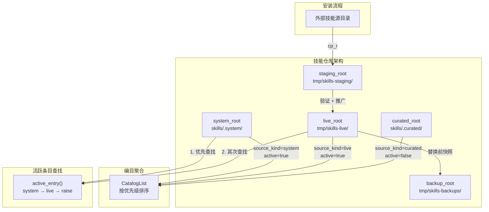
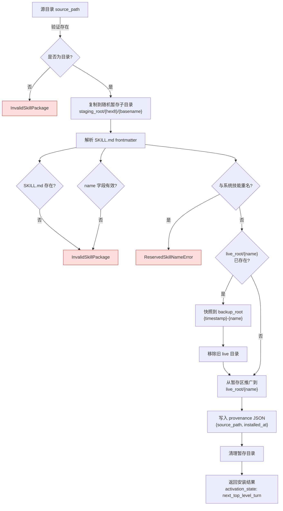
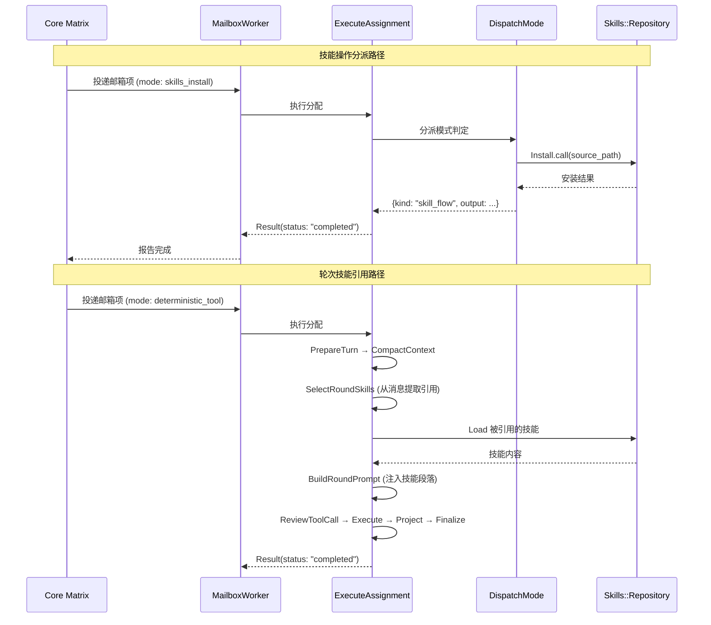

Fenix 的技能系统是代理程序侧的扩展机制，它遵循 **Agent Skills 规范**的目录布局与渐进式披露原则，同时保留 Fenix 自身的私有系统能力边界。本文档解析技能的三层分类（系统、精选、实时安装）、基于仓库的文件系统架构、四项核心操作的完整数据流、以及与执行循环的集成路径。技能系统的设计决策是：技能生命周期完全由 Fenix 代理程序拥有，Core Matrix 内核不参与技能的注册、安装或存储——内核只通过工具表面和能力握手间接感知技能的存在。

Sources: [design](https://github.com/jasl/cybros.new/blob/main/docs/design/2026-03-25-fenix-phase-2-validation-and-skills-design.md#L107-L113), [research-note](https://github.com/jasl/cybros.new/blob/main/docs/research-notes/2026-03-25-fenix-skills-and-agent-skills-spec-research-note.md#L1-L20)

## 三层技能分类与优先级模型

Fenix 将技能来源明确划分为三个隔离的类别，每个类别对应不同的文件系统根目录、不同的激活语义和不同的覆盖保护策略。

| 分类 | 文件系统根目录 | 环境变量覆盖 | 激活状态 | 可被安装覆盖 |
|---|---|---|---|---|
| **系统技能** (system) | `skills/.system/<name>/` | `FENIX_SYSTEM_SKILLS_ROOT` | `active: true` | 否 — 名称保留 |
| **精选技能** (curated) | `skills/.curated/<name>/` | `FENIX_CURATED_SKILLS_ROOT` | `active: false` | 不适用 |
| **实时安装技能** (live) | `tmp/skills-live/<name>/` | `FENIX_LIVE_SKILLS_ROOT` | `active: true` | 是 — 安装时替换 |

系统技能随代码仓库发布，代表 Fenix 自身的平台能力，其名称被保留——任何第三方安装都不得与系统技能重名。精选技能是随仓库分发的第三方目录条目，但在编目中标记为 **非激活** 状态；它们的定位是"可用但尚未主动参与执行"。实时安装技能是运行时通过安装流程从外部来源部署到 `live_root` 的技能，它们在安装完成后自动激活，但遵循 **next_top-level turn** 激活策略——即安装效果仅在下一个顶层轮次生效。

Sources: [repository.rb](https://github.com/jasl/cybros.new/blob/main/agents/fenix/app/services/fenix/skills/repository.rb#L28-L46), [design](https://github.com/jasl/cybros.new/blob/main/docs/design/2026-03-25-fenix-phase-2-validation-and-skills-design.md#L187-L203)

## 仓库架构：五目录布局与源优先级

`Fenix::Skills::Repository` 是技能系统的核心数据访问层，它管理五个隔离的文件系统目录：

```
Repository 五目录布局
├── system_root   → skills/.system/       # 随仓库版本控制的系统技能
├── curated_root  → skills/.curated/      # 随仓库版本控制的精选目录
├── live_root     → tmp/skills-live/      # 运行时安装的第三方技能
├── staging_root  → tmp/skills-staging/   # 安装过程中的暂存区
└── backup_root   → tmp/skills-backups/   # 被替换技能的快照备份
```

编目列表 (`catalog_list`) 的排序遵循源优先级：`system (0)` → `live (1)` → `curated (2)`，同优先级内按名称字母序排列。这意味着系统技能始终排在最前，精选技能始终排在最后。

Sources: [repository.rb](https://github.com/jasl/cybros.new/blob/main/agents/fenix/app/services/fenix/skills/repository.rb#L28-L53), [repository.rb](https://github.com/jasl/cybros.new/blob/main/agents/fenix/app/services/fenix/skills/repository.rb#L127-L145)



上图展示了仓库的静态目录结构与动态安装流之间的关系。编目聚合从三个源目录读取，安装流程则通过暂存区进行安全推广。活跃条目查找只覆盖 `system` 和 `live` 两个源——精选技能需要先被安装到 `live_root` 才能成为可加载的活跃技能。

Sources: [repository.rb](https://github.com/jasl/cybros.new/blob/main/agents/fenix/app/services/fenix/skills/repository.rb#L147-L183)

## 技能包格式与 Frontmatter 解析

每个技能是一个包含至少 `SKILL.md` 文件的目录。`SKILL.md` 采用 YAML frontmatter 格式：

```markdown
---
name: deploy-agent
description: Deploy another agent runtime through the current operational flow.
---

Use this skill when Fenix needs to prepare or verify an agent deployment flow.
```

`Fenix::Skills::Frontmatter` 解析器从 `SKILL.md` 中提取三个字段：`name`（技能标识符）、`description`（简短描述）和 `body`（Markdown 正文）。解析策略采用 **宽容降级**：当 frontmatter 缺失或 YAML 格式错误时，不会抛出异常，而是返回 `name: nil`、`description: nil`、`body: 原始内容` 的默认负载。这种宽容性仅限于解析层——在安装流程中，缺失 `SKILL.md` 或缺失 `name` 字段仍会触发严格的校验错误。

Sources: [frontmatter.rb](https://github.com/jasl/cybros.new/blob/main/agents/fenix/app/services/fenix/skills/frontmatter.rb#L6-L27), [repository.rb](https://github.com/jasl/cybros.new/blob/main/agents/fenix/app/services/fenix/skills/repository.rb#L196-L207)

技能目录可以包含任意子目录和文件（如 `scripts/`、`references/`、`assets/`），这些附属文件通过 `relative_files` 方法枚举，但 **排除** `SKILL.md` 本身和来源追踪文件 `.fenix-skill-provenance.json`。文件读取时执行路径穿越保护——`resolved_file_path` 方法确保请求的相对路径不会逃逸出技能根目录。

Sources: [repository.rb](https://github.com/jasl/cybros.new/blob/main/agents/fenix/app/services/fenix/skills/repository.rb#L209-L234)

## 四项核心操作

Fenix 的技能表面由四项操作组成，每项操作对应一个门面服务类和一个运行时分派模式：

| 操作 | 服务类 | 分派模式 (mode) | 用途 |
|---|---|---|---|
| **编目列表** | `CatalogList` | `skills_catalog_list` | 列出所有技能及其元数据 |
| **加载技能** | `Load` | `skills_load` | 加载完整技能内容和文件清单 |
| **读取文件** | `ReadFile` | `skills_read_file` | 读取技能内的特定附属文件 |
| **安装技能** | `Install` | `skills_install` | 从外部路径安装第三方技能 |

这四项操作通过 `DispatchMode` 路由到 `ExecuteAssignment` 的 `execute_skill_flow` 分支——一个简化的执行路径，跳过工具调用审查、投影和输出定型的完整钩子链，直接将操作结果作为输出返回。

Sources: [dispatch_mode.rb](https://github.com/jasl/cybros.new/blob/main/agents/fenix/app/services/fenix/runtime/assignments/dispatch_mode.rb#L14-L51), [execute_assignment.rb](https://github.com/jasl/cybros.new/blob/main/agents/fenix/app/services/fenix/runtime/execute_assignment.rb#L203-L214)

### 编目列表 (CatalogList)

编目列表操作聚合三个源目录的所有技能条目，按源优先级排序后返回每个条目的负载摘要。`Entry` 结构体包含 `name`、`description`、`source_kind`、`active`、`root` 和 `provenance` 六个字段，其中 `provenance` 仅对经过安装流程的实时技能有效。目录扫描时排除以 `.` 开头的隐藏目录名，确保 `.system` 和 `.curated` 这两个根目录本身不会被当作技能条目扫描。

Sources: [catalog_list.rb](https://github.com/jasl/cybros.new/blob/main/agents/fenix/app/services/fenix/skills/catalog_list.rb#L3-L9), [repository.rb](https://github.com/jasl/cybros.new/blob/main/agents/fenix/app/services/fenix/skills/repository.rb#L163-L177)

### 加载技能 (Load)

加载操作定位指定名称的 **活跃** 技能条目（仅搜索 `system` 和 `live` 两个源），读取其 `SKILL.md` 完整内容，并枚举所有附属文件的相对路径。返回的负载包含技能元数据、Markdown 正文和文件清单。如果请求的技能仅存在于 `curated` 源中（未安装），则会抛出 `SkillNotFound` 异常。

Sources: [load.rb](https://github.com/jasl/cybros.new/blob/main/agents/fenix/app/services/fenix/skills/load.rb#L3-L9), [repository.rb](https://github.com/jasl/cybros.new/blob/main/agents/fenix/app/services/fenix/skills/repository.rb#L55-L63)

### 读取文件 (ReadFile)

文件读取操作在指定技能根目录内解析相对路径，执行路径穿越保护校验，然后返回文件内容。这是技能 **按需加载** 的关键机制——LLM 可以在需要时才读取技能包内的特定参考文件，而非在加载技能时一次性读取所有内容。

Sources: [read_file.rb](https://github.com/jasl/cybros.new/blob/main/agents/fenix/app/services/fenix/skills/read_file.rb#L3-L9), [repository.rb](https://github.com/jasl/cybros.new/blob/main/agents/fenix/app/services/fenix/skills/repository.rb#L65-L76)

### 安装技能 (Install)

安装是最复杂的操作，执行以下多步安全流程：



安装流程的关键安全属性：

- **暂存区隔离**：源目录首先被复制到 `staging_root` 下的随机命名的临时子目录，所有验证在暂存副本上执行，原始源目录不受影响
- **系统技能保护**：安装前检查技能名是否与任何系统技能冲突，冲突时抛出 `ReservedSkillNameError`
- **替换前快照**：如果 `live_root` 中已存在同名技能，旧版本被复制到 `backup_root` 并以 `{timestamp}-{name}` 命名，确保回滚能力
- **来源追踪**：推广完成后写入 `.fenix-skill-provenance.json`，记录原始源路径和安装时间
- **暂存区清理**：无论安装成功或失败，暂存目录都会被清理

Sources: [repository.rb](https://github.com/jasl/cybros.new/blob/main/agents/fenix/app/services/fenix/skills/repository.rb#L78-L123)

## 技能在执行循环中的集成路径

技能系统与 Fenix 执行循环有两条集成路径：**邮箱工作器的技能流分派** 和 **轮次提示构建中的技能引用**。

### 邮箱工作器分派路径

当 Core Matrix 通过邮箱投递一个 `task_payload.mode` 为技能操作名称的执行分配时，`ExecuteAssignment` 通过 `DispatchMode` 将其路由到 `execute_skill_flow` 方法。这条路径是 **直通式** 的——跳过 PrepareTurn、CompactContext、ReviewToolCall、ProjectToolResult 和 FinalizeOutput 的完整钩子链，仅在进入时执行一次取消检查，然后直接将操作结果作为 `completed` 状态返回。

Sources: [execute_assignment.rb](https://github.com/jasl/cybros.new/blob/main/agents/fenix/app/services/fenix/runtime/execute_assignment.rb#L26-L55), [execute_assignment.rb](https://github.com/jasl/cybros.new/blob/main/agents/fenix/app/services/fenix/runtime/execute_assignment.rb#L203-L214)

### 轮次提示中的技能引用与注入

在 LLM 驱动的轮次执行中，`SelectRoundSkills` 服务从对话消息中提取技能引用，并将匹配的活跃技能注入到提示中。引用匹配支持两种语法：

| 引用语法 | 正则模式 | 示例 |
|---|---|---|
| Markdown 风格 | `[\$name](https://github.com/jasl/cybros.new/blob/main/...)` | `[$deploy-agent](https://github.com/jasl/cybros.new/blob/main/skills://deploy-agent)` |
| 内联引用 | `$name` | `请使用 $research-brief` |

匹配流程为：(1) 从所有消息中提取引用名称并去重；(2) 过滤出存在于活跃编目中的名称；(3) 对每个匹配名称调用 `Load` 加载完整技能内容。加载失败的技能被静默跳过（`filter_map` + `rescue nil`），不会中断轮次执行。

Sources: [select_round_skills.rb](https://github.com/jasl/cybros.new/blob/main/agents/fenix/app/services/fenix/runtime/select_round_skills.rb#L1-L55)

加载后的技能通过 `BuildRoundPrompt` 注入到最终提示中。注入分两段：

- **Active Skills** 段落：列出所有活跃技能的名称和描述，让 LLM 知道哪些技能可用
- **Selected Skills** 段落：展开被引用技能的完整 `SKILL.md` 内容，让 LLM 获得具体的操作指令

Sources: [build_round_prompt.rb](https://github.com/jasl/cybros.new/blob/main/agents/fenix/app/services/fenix/runtime/build_round_prompt.rb#L45-L65)



## 内置系统技能：deploy-agent

当前仓库包含一个系统技能 `deploy-agent`，作为 Fenix 使用自身技能机制的验证实例。该技能的定位是"当 Fenix 需要准备或验证代理部署流程时使用"，它携带一个 `scripts/deploy_agent.rb` 脚本文件。该技能的存在证明了系统技能机制不仅适用于被动指令加载，还能支持操作型工作流。

Sources: [SKILL.md](https://github.com/jasl/cybros.new/blob/main/agents/fenix/skills/.system/deploy-agent/SKILL.md#L1-L10), [deploy_agent.rb](https://github.com/jasl/cybros.new/blob/main/agents/fenix/skills/.system/deploy-agent/scripts/deploy_agent.rb#L1-L2)

## 内置精选技能：research-brief

`research-brief` 是随仓库分发的精选目录条目，其描述为"将原始发现转化为操作简报"。作为 `curated` 类别的技能，它在编目列表中显示但 **不会** 被视为活跃技能——无法通过 `Load` 操作直接加载，也无法被轮次技能引用机制自动匹配。要使用精选技能，需要先通过 `Install` 操作将其安装到 `live_root`。

Sources: [SKILL.md](https://github.com/jasl/cybros.new/blob/main/agents/fenix/skills/.curated/research-brief/SKILL.md#L1-L8)

## 环境变量与配置参考

所有技能仓库的根目录均可通过环境变量覆盖，支持容器化部署和测试隔离：

| 环境变量 | 默认值 | 用途 |
|---|---|---|
| `FENIX_SYSTEM_SKILLS_ROOT` | `skills/.system` | 系统技能根目录 |
| `FENIX_CURATED_SKILLS_ROOT` | `skills/.curated` | 精选技能根目录 |
| `FENIX_LIVE_SKILLS_ROOT` | `tmp/skills-live` | 实时安装技能根目录 |
| `FENIX_STAGING_SKILLS_ROOT` | `tmp/skills-staging` | 安装暂存区根目录 |
| `FENIX_BACKUP_SKILLS_ROOT` | `tmp/skills-backups` | 替换备份根目录 |

测试套件通过 `with_skill_roots` 辅助方法在临时目录中创建完整的五目录布局，并在测试结束后恢复原始环境变量。

Sources: [repository.rb](https://github.com/jasl/cybros.new/blob/main/agents/fenix/app/services/fenix/skills/repository.rb#L127-L145), [test_helper.rb](https://github.com/jasl/cybros.new/blob/main/agents/fenix/test/test_helper.rb#L332-L367)

## 错误类型与异常边界

`Repository` 定义了四种专用异常类型，每种对应不同的安全边界：

| 异常类型 | 触发场景 | 处理策略 |
|---|---|---|
| `SkillNotFound` | 加载/读取的技能名不在活跃条目中 | `SelectRoundSkills` 静默跳过；直接调用传播给调用方 |
| `InvalidSkillPackage` | 安装源缺少 `SKILL.md`、缺少 `name`、或其他格式问题 | 安装失败，暂存区被清理 |
| `ReservedSkillNameError` | 安装源与系统技能名称冲突 | 安装被拒绝，保护平台技能不被覆盖 |
| `InvalidFileReference` | 读取文件的路径为空或逃逸出技能根目录 | 读取失败，防止目录遍历攻击 |

Sources: [repository.rb](https://github.com/jasl/cybros.new/blob/main/agents/fenix/app/services/fenix/skills/repository.rb#L10-L13), [repository.rb](https://github.com/jasl/cybros.new/blob/main/agents/fenix/app/services/fenix/skills/repository.rb#L222-L234)

## 验收验证场景

技能系统的验收通过 `fenix_skills_validation` 场景执行，该场景分为两组验证：

**Scenario 12（系统技能验证）**：编目列表 → 加载系统技能 `deploy-agent` → 读取系统技能脚本文件。验证系统技能在编目中以 `source_kind: "system"`、`active: true` 出现，加载返回完整的技能内容和文件清单，文件读取返回脚本内容。

**Scenario 13（第三方安装验证）**：安装第三方技能 `portable-notes` → 加载已安装技能 → 读取已安装技能的附属文件。验证安装返回 `activation_state: "next_top_level_turn"`，后续加载和读取操作正常工作。

每组验证都检查对话状态（`active`）、工作流生命周期（`completed`）、DAG 形状（`["agent_turn_step"]`）和任务运行状态（`completed`）的完整一致性。

Sources: [fenix_skills_validation.rb](https://github.com/jasl/cybros.new/blob/main/acceptance/scenarios/fenix_skills_validation.rb#L1-L194)

## 架构边界与设计决策

技能系统的设计遵循一个核心边界：**技能是代理程序侧的概念，不是内核侧的概念**。Core Matrix 不需要知道技能的存在——它只看到 Fenix 通过配对握手暴露的工具表面。这意味着：

- 技能的注册、发现、安装、加载完全在 Fenix 进程内完成
- 内核通过 `capability_projection.tool_surface` 和 `program_contract.methods` 与 Fenix 交互
- 技能操作的执行通过标准邮箱分配机制完成，不需要特殊的传输通道
- 技能的 **生命周期管理**（安装、替换、快照）对内核完全透明

Phase 2 明确排除了以下能力：内核级技能子系统、插件市场、热重载技能运行时、同轮次即时技能变更生效。

Sources: [design](https://github.com/jasl/cybros.new/blob/main/docs/design/2026-03-25-fenix-phase-2-validation-and-skills-design.md#L107-L118), [design](https://github.com/jasl/cybros.new/blob/main/docs/design/2026-03-25-fenix-phase-2-validation-and-skills-design.md#L259-L268)

## 延伸阅读

- [Fenix 产品定位与配对清单契约](https://github.com/jasl/cybros.new/blob/main/19-fenix-chan-pin-ding-wei-yu-pei-dui-qing-dan-qi-yue) — 理解 Fenix 如何通过配对握手向 Core Matrix 暴露能力表面
- [控制循环、邮箱工作器与实时会话](https://github.com/jasl/cybros.new/blob/main/20-kong-zhi-xun-huan-you-xiang-gong-zuo-qi-yu-shi-shi-hui-hua) — 理解邮箱工作器如何将技能操作分派到执行路径
- [执行钩子：上下文准备、压缩、工具审查与输出定型](https://github.com/jasl/cybros.new/blob/main/22-zhi-xing-gou-zi-shang-xia-wen-zhun-bei-ya-suo-gong-ju-shen-cha-yu-shu-chu-ding-xing) — 理解技能流如何跳过完整钩子链
- [工具治理、绑定与 MCP Streamable HTTP 传输](https://github.com/jasl/cybros.new/blob/main/12-gong-ju-zhi-li-bang-ding-yu-mcp-streamable-http-chuan-shu) — 理解工具表面在内核侧的治理模型