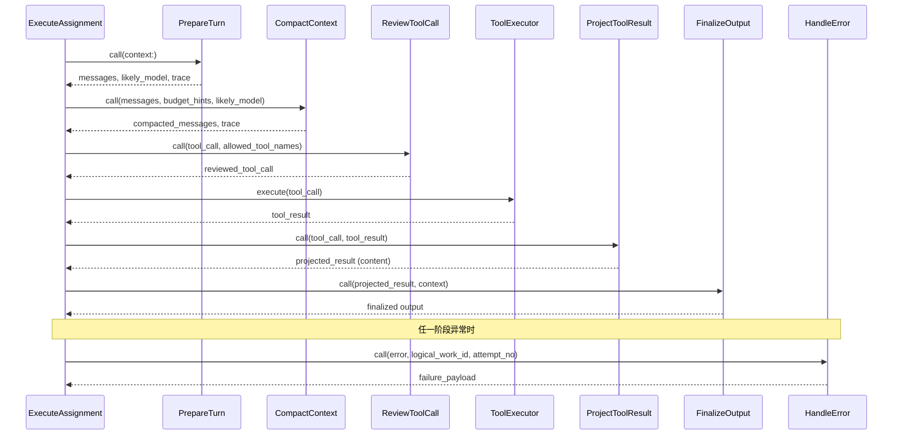
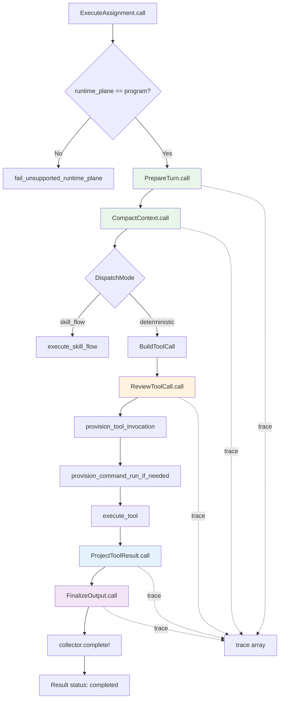

Fenix 代理程序在处理 Core Matrix 内核派发的执行分配（execution assignment）时，并不直接将裸数据丢给 LLM——它通过一组**阶段化的执行钩子（execution hooks）** 对上下文进行准备、压缩、工具调用审查和输出定型。这些钩子构成了 Fenix 运行时的"脊椎"，确保每次工具调用都经过规范的组装、治理和投影。本文将逐一拆解这六个钩子及其辅助设施的职责、数据流和设计权衡。

Sources: [runtime_hooks_test.rb](https://github.com/jasl/cybros.new/blob/main/agents/fenix/test/services/fenix/hooks/runtime_hooks_test.rb#L1-L48), [2026-03-25-core-matrix-phase-2-task-fenix-runtime-surface-and-execution-hooks.md](https://github.com/jasl/cybros.new/blob/main/docs/finished-plans/2026-03-25-core-matrix-phase-2-task-fenix-runtime-surface-and-execution-hooks.md#L1-L129)

## 钩子生命周期全景

Fenix 的执行钩子按照严格的线性管道排列。每个钩子接收上游产物、执行单一职责、输出结构化结果并附带 `trace` 条目。下图展示了 `ExecuteAssignment`（确定性工具流）中钩子的完整编排顺序：

**两条入口路径共享同一钩子族**：`ExecuteAssignment` 路径（通过邮箱派发的 `execution_assignment` 类型）和 `PrepareRound` 路径（通过 `agent_program_request` 的 `prepare_round` 请求）都调用 `PrepareTurn` → `CompactContext` 链。区别在于前者继续走完整的工具执行管道，后者在压缩后直接返回消息供内核侧 LLM 消费。

Sources: [execute_assignment.rb](https://github.com/jasl/cybros.new/blob/main/agents/fenix/app/services/fenix/runtime/execute_assignment.rb#L26-L85), [prepare_round.rb](https://github.com/jasl/cybros.new/blob/main/agents/fenix/app/services/fenix/runtime/prepare_round.rb#L14-L29)

## PrepareTurn：上下文组装与技能选择

`PrepareTurn` 是管道的第一个钩子，负责从原始执行上下文中组装出完整的消息序列。它的核心工作分为三步：

1. **提取对话转录**：从 `context_messages` 中规范化出 `transcript_messages`（每条消息仅保留 `role` 和 `content`）。
2. **技能选择**：调用 `SelectRoundSkills`，扫描消息内容中的 Markdown 链接引用 `[$SkillName](https://github.com/jasl/cybros.new/blob/main/...)` 和内联引用 `$SkillName`，匹配激活目录中的技能并加载完整的技能包。
3. **提示组装**：调用 `BuildRoundPrompt`，将 `agent_prompt`、`soul`、`user`、`memory`、`conversation_summary`、`operator_prompt`、`operator_state`、激活技能目录、选中技能内容和上下文导入按段落拼接为系统提示消息。

最终输出将系统提示消息置于转录消息之前，形成 `[system_prompt] + transcript_messages` 的消息序列。同时附带 `estimated_message_count`、`estimated_token_count` 和详尽的 `trace` 记录，包含模型推断、代理配置、技能选择等信息。

**模型推断策略**采用降级链：`model_context.likely_model` → `model_context.model_ref` → `model_context.api_model` → `provider_execution.model_ref`，确保在多种内核契约格式下都能获取模型标识。

Sources: [prepare_turn.rb](https://github.com/jasl/cybros.new/blob/main/agents/fenix/app/services/fenix/hooks/prepare_turn.rb#L1-L52), [select_round_skills.rb](https://github.com/jasl/cybros.new/blob/main/agents/fenix/app/services/fenix/runtime/select_round_skills.rb#L1-L55), [build_round_prompt.rb](https://github.com/jasl/cybros.new/blob/main/agents/fenix/app/services/fenix/runtime/build_round_prompt.rb#L1-L75)

### 提示组装的分层结构

`BuildRoundPrompt` 拼接的提示段落具有明确的层次关系，下表展示了各段落的来源和用途：

| 段落 | 来源 | 用途 |
|------|------|------|
| Agent Prompt | 代码内硬编码常量 | 代理基本身份声明 |
| Soul | `prompts/SOUL.md`（可被工作区覆盖） | 代理人格与风格 |
| User | `prompts/USER.md`（可被工作区覆盖） | 用户特定上下文 |
| Memory | `Fenix::Memory::Store.root_memory` | 持久化记忆 |
| Conversation Summary | `Fenix::Memory::Store.conversation_summary` | 对话级摘要 |
| Operator Prompt | `prompts/OPERATOR.md`（仅主配置非子代理） | 资源优先操作指引 |
| Operator State | 会话级 `operator_state.json` 快照（仅主配置） | 当前运行时状态投影 |
| Active Skills | 技能仓库激活目录 | 可用技能清单 |
| Selected Skills | 消息引用匹配的技能包 | 具体技能指令 |
| Context Imports | 内核侧 `context_imports` 投影 | 外部上下文注入 |

`Operator` 层仅在 `profile == "main"` 且 `is_subagent == false` 时注入，确保子代理不会误操作主代理的运行时资源。

Sources: [assembler.rb](https://github.com/jasl/cybros.new/blob/main/agents/fenix/app/services/fenix/prompts/assembler.rb#L20-L34), [OPERATOR.md](https://github.com/jasl/cybros.new/blob/main/agents/fenix/prompts/OPERATOR.md#L1-L17)

## CompactContext：自适应上下文压缩

`CompactContext` 负责在上下文消息接近或超过模型上下文窗口预算时执行压缩。其决策逻辑基于两个输入：

- **`estimated_tokens`**：通过 `EstimateTokens` 对当前消息序列的粗略 token 估算（以词数 + 4/消息作为近似）。
- **`threshold`**：从 `budget_hints` 中提取压缩阈值，支持 `advisory_hints.recommended_compaction_threshold` 和 `advisory_compaction_threshold_tokens` 两个键名（前者优先）。

**压缩策略**采用"首尾保留 + 中间摘要"的三明治模式：

1. 保留 `system` 角色的首条消息（通常是提示）
2. 保留最后两条消息（最近对话上下文）
3. 在两者之间插入一条系统消息："Earlier context compacted for {model_name}."

仅当阈值大于 0、估算 token 超过阈值、且消息数大于 2 时才触发压缩。`trace` 中记录 `compacted` 布尔标记和前后消息计数，使压缩决策可观测。

Sources: [compact_context.rb](https://github.com/jasl/cybros.new/blob/main/agents/fenix/app/services/fenix/hooks/compact_context.rb#L1-L49), [estimate_tokens.rb](https://github.com/jasl/cybros.new/blob/main/agents/fenix/app/services/fenix/hooks/estimate_tokens.rb#L1-L12), [estimate_messages.rb](https://github.com/jasl/cybros.new/blob/main/agents/fenix/app/services/fenix/hooks/estimate_messages.rb#L1-L10)

## ReviewToolCall：双层工具调用审查

`ReviewToolCall` 是 Fenix 工具治理的第一道防线，实施**双层审查**：

1. **支持性检查**（`UnsupportedToolError`）：验证 `tool_name` 是否存在于 `SystemToolRegistry` 中。任何未注册的工具名称都会立即被拒绝。
2. **可见性检查**（`ToolNotVisibleError`）：验证该工具是否在当前分配的 `allowed_tool_names` 列表中。即使工具受系统支持，如果内核未将其授权给当前代理配置，调用仍会被阻止。

`ToolNotVisibleError` 继承自 `UnsupportedToolError`，两者形成语义化的异常层级。调用方（如 `ProgramToolExecutor`）可以根据异常类型生成不同的错误分类载荷——`authorization`（未授权）或 `semantic`（语义不支持），为上层诊断提供精确的错误类型信号。

Sources: [review_tool_call.rb](https://github.com/jasl/cybros.new/blob/main/agents/fenix/app/services/fenix/hooks/review_tool_call.rb#L1-L26), [program_tool_executor.rb](https://github.com/jasl/cybros.new/blob/main/agents/fenix/app/services/fenix/runtime/program_tool_executor.rb#L40-L75)

### SystemToolRegistry：工具注册中心

`SystemToolRegistry` 是所有工具的中央注册表，每个条目包含 `executor`（执行器）、`projector`（投影器）和 `registry_backed`（是否需要队列支持）三个属性。下表展示了当前的完整工具注册：

| 工具族 | 工具名称 | 执行器 | 投影器 | 队列支持 |
|--------|----------|--------|--------|----------|
| Calculator | `calculator` | `ToolExecutors::Calculator` | `ToolResultProjectors::Calculator` | ✗ |
| Command Run | `exec_command`, `command_run_list`, `command_run_read_output`, `command_run_terminate`, `command_run_wait`, `write_stdin` | `ToolExecutors::ExecCommand` | `ToolResultProjectors::ExecCommand` | ✓ |
| Process Run | `process_exec`, `process_list`, `process_proxy_info`, `process_read_output` | `ToolExecutors::Process` | `ToolResultProjectors::Process` | ✓ |
| Browser | `browser_open`, `browser_list`, `browser_navigate`, `browser_get_content`, `browser_screenshot`, `browser_close`, `browser_session_info` | `ToolExecutors::Browser` | `ToolResultProjectors::Browser` | ✓ |
| Workspace | `workspace_find`, `workspace_read`, `workspace_stat`, `workspace_tree`, `workspace_write` | `ToolExecutors::Workspace` | `ToolResultProjectors::Workspace` | ✗ |
| Memory | `memory_append_daily`, `memory_compact_summary`, `memory_get`, `memory_list`, `memory_search`, `memory_store` | `ToolExecutors::Memory` | `ToolResultProjectors::Memory` | ✗ |
| Web | `firecrawl_scrape`, `firecrawl_search`, `web_fetch`, `web_search` | `ToolExecutors::Web` | `ToolResultProjectors::Web` | ✗ |

标记为 `registry_backed` 的工具需要 Solid Queue 或进程内 ActiveJob 适配器才能执行，因为它们管理有状态的外部资源（如命令运行会话、进程实例）。`ExecutionTopology` 模块在执行前通过 `assert_registry_backed_execution_supported!` 进行前置断言。

Sources: [system_tool_registry.rb](https://github.com/jasl/cybros.new/blob/main/agents/fenix/app/services/fenix/runtime/system_tool_registry.rb#L1-L66), [execution_topology.rb](https://github.com/jasl/cybros.new/blob/main/agents/fenix/app/services/fenix/runtime/execution_topology.rb#L1-L86)

## ProjectToolResult：工具结果的结构化投影

`ProjectToolResult` 是一个分派器，它从 `SystemToolRegistry` 查找目标工具的 `projector` 并委托执行。每个投影器的职责是将执行器返回的原始工具结果转换为具有**人类可读 `content` 字段**的结构化字典。

投影器的关键设计原则是：**`content` 是对结果的叙述性摘要**，不是原始数据转储。例如：

- **Workspace Read**：`"Workspace file README.md:\n{file_content}"`——将路径和内容组合为叙述
- **Exec Command**：`"Command exited with status 0 after streaming output."`——将退出码和流状态翻译为自然语言
- **Web Search**：`"1. Fenix - https://example.test/fenix"`——将搜索结果格式化为编号列表
- **Process Exec**：`"Background service started as process run {id}. Available at {proxy_path}."`——根据是否有代理路由动态拼接
- **Calculator**：`"The calculator returned 4."`——最简单的直接包装

每个投影器还保留结构化的元数据字段（如 `command_run_id`、`exit_status`、`browser_session_id`），使上层消费者既能阅读摘要，又能访问机器可读的完整数据。

Sources: [project_tool_result.rb](https://github.com/jasl/cybros.new/blob/main/agents/fenix/app/services/fenix/hooks/project_tool_result.rb#L1-L12), [workspace.rb](https://github.com/jasl/cybros.new/blob/main/agents/fenix/app/services/fenix/hooks/tool_result_projectors/workspace.rb#L1-L55), [exec_command.rb](https://github.com/jasl/cybros.new/blob/main/agents/fenix/app/services/fenix/hooks/tool_result_projectors/exec_command.rb#L1-L149)

## FinalizeOutput：输出定型与上下文锚定

`FinalizeOutput` 是管道的终点站，负责将投影结果"锚定"到执行上下文的具体会话和轮次上。它的逻辑极其简洁——从投影结果中提取 `content` 作为输出，并附加 `conversation_id` 和 `turn_id` 作为定位标记。

这种设计确保了：无论工具执行产生多么复杂的结果，最终返回给内核的始终是一个**带有会话定位的结构化输出**，内核可以将其直接写入对话转录的对应轮次。

Sources: [finalize_output.rb](https://github.com/jasl/cybros.new/blob/main/agents/fenix/app/services/fenix/hooks/finalize_output.rb#L1-L13)

## HandleError：统一错误处理与故障载荷

当管道中任一阶段抛出异常时，`HandleError` 被调用于生成标准化的故障载荷。它输出一个包含 `failure_kind`（固定为 `"runtime_error"`）、`retryable`（固定为 `false`）、`logical_work_id`、`attempt_no` 和 `last_error_summary` 的字典。

在 `ExecuteAssignment` 的 `rescue` 块中，错误处理还会额外构建失败的工具调用载荷（如果异常发生时存在活跃的工具调用），并将 `handle_error` 条目追加到 `trace` 中。`ReportCollector` 随后通过 `fail!` 方法发出 `execution_fail` 终端报告，整个执行结果以 `status: "failed"` 返回。

`ProgramToolExecutor` 提供了更精细的错误分类，将 `ToolNotVisibleError` 映射为 `authorization` 类、`UnsupportedToolError` 和 `ValidationError` 映射为 `semantic` 类、其他异常映射为 `runtime` 类，每类都有独立的错误代码和不可重试标记。

Sources: [handle_error.rb](https://github.com/jasl/cybros.new/blob/main/agents/fenix/app/services/fenix/hooks/handle_error.rb#L1-L16), [execute_assignment.rb](https://github.com/jasl/cybros.new/blob/main/agents/fenix/app/services/fenix/runtime/execute_assignment.rb#L56-L85), [program_tool_executor.rb](https://github.com/jasl/cybros.new/blob/main/agents/fenix/app/services/fenix/runtime/program_tool_executor.rb#L40-L75)

## 执行上下文构建：钩子的数据来源

所有钩子共享的数据来源于 `BuildExecutionContext` 和 `PayloadContext` 两个服务对象。`BuildExecutionContext` 从邮箱条目中提取 `payload`，通过 `PayloadContext` 将其规范化为包含以下关键维度的完整上下文字典：

| 维度 | 键名 | 来源 |
|------|------|------|
| 会话标识 | `conversation_id`, `turn_id`, `agent_task_run_id` | `task` |
| 运行时平面 | `runtime_plane` | `runtime_context` 或默认 `"program"` |
| 对话消息 | `context_messages` | `conversation_projection.messages` |
| 预算提示 | `budget_hints` | `provider_context.budget_hints` |
| 代理配置 | `agent_context`（profile, is_subagent, allowed_tool_names） | `capability_projection` |
| 模型信息 | `model_context`, `provider_execution` | `provider_context` |
| 工作区上下文 | `workspace_context`（prompts, env_overlay） | 工作区引导 + 提示组装器 |

在构建上下文的同时，`BuildExecutionContext` 还会调用 `Operator::Snapshot` 将当前工作区状态（文件列表、内存条目、命令运行、进程运行、浏览器会话）快照到会话级的 `operator_state.json` 文件中，供后续提示组装使用。

Sources: [build_execution_context.rb](https://github.com/jasl/cybros.new/blob/main/agents/fenix/app/services/fenix/context/build_execution_context.rb#L1-L31), [payload_context.rb](https://github.com/jasl/cybros.new/blob/main/agents/fenix/app/services/fenix/runtime/payload_context.rb#L1-L123), [snapshot.rb](https://github.com/jasl/cybros.new/blob/main/agents/fenix/app/services/fenix/operator/snapshot.rb#L16-L29)

## 完整管道在 ExecuteAssignment 中的编排

`ExecuteAssignment` 是钩子管道最完整的编排者。以下是其确定性工具流 (`execute_deterministic_tool_flow`) 的阶段概览，每阶段间均插入取消检查：

除了确定性工具流外，还有两条分支路径：**技能流**（`execute_skill_flow`）直接返回预设输出，跳过工具执行；**进程工具流**（`execute_process_tool_flow`）使用 `process_run` 资源而非 `tool_invocation` + `command_run` 组合，但仍经过完整的审查→投影→定型管道。

Sources: [execute_assignment.rb](https://github.com/jasl/cybros.new/blob/main/agents/fenix/app/services/fenix/runtime/execute_assignment.rb#L89-L200)

## 可观测性：trace 数组与报告收集

钩子管道的每一步都将结构化的 `trace` 条目追加到 `ExecuteAssignment` 实例的 `@trace` 数组中。每个条目至少包含 `"hook"` 字段标识来源钩子，加上该钩子特有的观测数据（如 `message_count`、`compacted`、`tool_name`、`content`）。

与 `trace` 并行的还有 `ReportCollector` 驱动的报告通道，通过 `started!` → `progress!` → `complete!`/`fail!` 四个阶段向内核实时反馈执行进度。`progress!` 在工具审查通过后发出 `tool_reviewed` 阶段报告，包含完整的工具调用载荷。最终执行的 `Result` 结构体将 `status`、`reports`、`trace`、`output` 和 `error` 统一打包返回。

Sources: [report_collector.rb](https://github.com/jasl/cybros.new/blob/main/agents/fenix/app/services/fenix/runtime_surface/report_collector.rb#L1-L58), [runtime_flow_test.rb](https://github.com/jasl/cybros.new/blob/main/agents/fenix/test/integration/runtime_flow_test.rb#L4-L14)

## 设计决策与权衡

**为什么使用阶段化钩子而非单一服务？** 阶段化设计使得每个关注点（上下文组装、预算压缩、工具授权、结果投影、输出定型）都可以独立测试、独立替换、独立追踪。当需要调整压缩策略或新增工具投影时，修改范围严格限定在单一钩子内。

**为什么压缩使用简单的首尾保留策略？** 当前实现选择了最保守的压缩方案——保留系统提示和最近上下文，用占位符替换中间内容。这是一种有意的技术债：它确保在任何模型配置下都不会丢失关键上下文，但牺牲了中间对话的保留。未来可替换为基于摘要的压缩策略，只需修改 `CompactContext` 一个文件。

**为什么投影器与执行器分离？** 执行器处理的是与外部系统的交互（运行命令、打开浏览器、写入文件），返回原始技术结果。投影器将技术结果转换为叙述性的 `content`，这是"机器可读"到"对话可消费"的格式转换层。分离两者意味着同一份工具结果可以被不同的投影策略处理（如为不同模型生成不同详细程度的摘要）。

Sources: [2026-03-25-core-matrix-phase-2-task-fenix-runtime-surface-and-execution-hooks.md](https://github.com/jasl/cybros.new/blob/main/docs/finished-plans/2026-03-25-core-matrix-phase-2-task-fenix-runtime-surface-and-execution-hooks.md#L79-L87)

## 延伸阅读

- 要理解钩子管道的上游——邮箱投递和控制循环如何将内核工作派发到 Fenix，参见 [控制循环、邮箱工作器与实时会话](https://github.com/jasl/cybros.new/blob/main/20-kong-zhi-xun-huan-you-xiang-gong-zuo-qi-yu-shi-shi-hui-hua)
- 要了解工具执行器（钩子管道中 `execute_tool` 阶段的实际执行逻辑），参见 [插件体系与工具执行器（Web、浏览器、进程、工作区）](https://github.com/jasl/cybros.new/blob/main/23-cha-jian-ti-xi-yu-gong-ju-zhi-xing-qi-web-liu-lan-qi-jin-cheng-gong-zuo-qu)
- 要理解 `allowed_tool_names` 的来源——内核侧如何构建能力投影，参见 [工具治理、绑定与 MCP Streamable HTTP 传输](https://github.com/jasl/cybros.new/blob/main/12-gong-ju-zhi-li-bang-ding-yu-mcp-streamable-http-chuan-shu)
- 要查看技能选择机制的完整细节，参见 [技能系统：系统技能、精选技能与安装管理](https://github.com/jasl/cybros.new/blob/main/21-ji-neng-xi-tong-xi-tong-ji-neng-jing-xuan-ji-neng-yu-an-zhuang-guan-li)