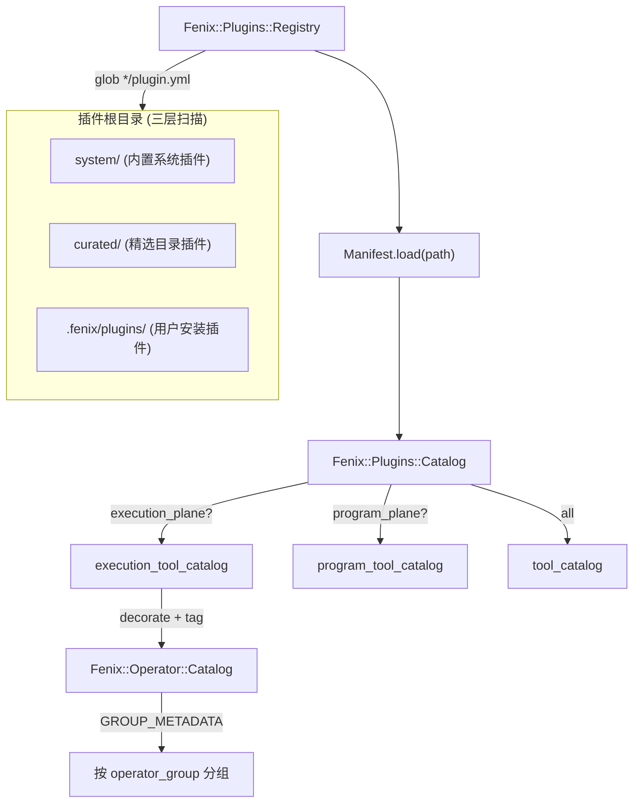
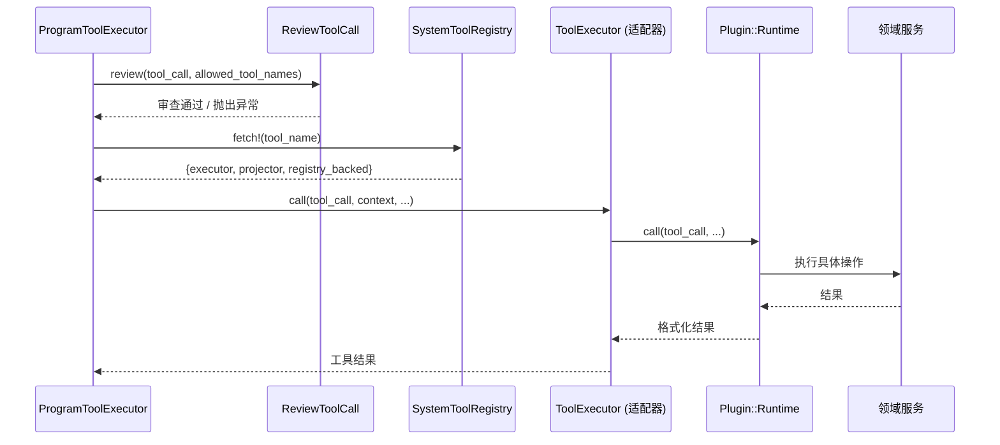

Fenix 代理程序的工具能力通过一套声明式**插件体系**（Plugin System）向外暴露，而非在代码中硬编码工具列表。每个插件以 `plugin.yml` 声明其工具目录、输入输出 schema、依赖契约和环境变量需求；由 `Fenix::Plugins::Registry` 自动扫描并加载为运行时可用清单。当前系统内置六个系统插件：**Web**（网络获取与搜索）、**Browser**（浏览器会话自动化）、**Exec Command**（附带式命令执行）、**Process**（脱离式进程管理）、**Workspace**（工作区文件操作）以及 **Memory**（持久化运行时记忆）。本文聚焦于前五个工具执行器的架构设计、分层职责与安全边界。

Sources: [plugins.rb](https://github.com/jasl/cybros.new/blob/main/agents/fenix/app/services/fenix/plugins.rb#L1-L5), [registry.rb](https://github.com/jasl/cybros.new/blob/main/agents/fenix/app/services/fenix/plugins/registry.rb#L1-L42)

---

## 插件架构总览

Fenix 的插件体系遵循**三层分离**原则：**声明层**（`plugin.yml`）定义工具的元数据和契约，**调度层**（`ToolExecutor` → `Plugin::Runtime`）负责参数适配和所有权校验，**实现层**（领域服务如 `Fenix::Web::Fetch`）执行具体的业务逻辑。这种分层使得工具声明可以独立于运行时进行版本化和治理。

### 插件发现与注册流程

`Fenix::Plugins::Registry` 在初始化时扫描三个插件根目录：内置系统插件（`app/services/fenix/plugins/system`）、精选目录插件（`app/services/fenix/plugins/curated`）以及用户安装的第三方插件（`{workspace_root}/.fenix/plugins`）。每个根目录下包含 `plugin.yml` 的子目录被识别为一个插件。扫描到的路径被统一加载为 `Manifest` 对象，再由 `Catalog` 聚合为完整的工具目录。

`Catalog` 根据 `default_runtime_plane` 将工具分为两类：**execution 平面**的工具会附加 `execution_runtime` 标签，用于运行时执行路径；**program 平面**的工具则保留原始分类，用于程序 API 暴露。

Sources: [registry.rb](https://github.com/jasl/cybros.new/blob/main/agents/fenix/app/services/fenix/plugins/registry.rb#L8-L14), [catalog.rb](https://github.com/jasl/cybros.new/blob/main/agents/fenix/app/services/fenix/plugins/catalog.rb#L10-L28), [manifest.rb](https://github.com/jasl/cybros.new/blob/main/agents/fenix/app/services/fenix/plugins/manifest.rb#L1-L39)

---

## Plugin Manifest 声明规范

每个插件的核心是 `plugin.yml`，它定义了工具的全部元数据契约：

| 字段 | 类型 | 用途 |
|------|------|------|
| `plugin_id` | string | 插件唯一标识（如 `system.web`） |
| `version` | integer | 插件版本号 |
| `display_name` | string | 人类可读名称 |
| `default_runtime_plane` | `execution` / `program` | 决定工具被归类到哪个执行平面 |
| `tool_catalog` | array | 工具定义列表 |
| `config_schema` | object | 配置 schema（当前均为空） |
| `requirements` | object | 运行时依赖声明 |
| `env_contract` | object | 环境变量需求与可选性 |

每个工具条目包含完整的 JSON Schema 定义，关键属性如下：

| 工具属性 | 用途 |
|----------|------|
| `tool_name` | 工具名称，全局唯一标识 |
| `tool_kind` | 固定为 `kernel_primitive`，表示内核原语工具 |
| `operator_group` | 归属分组，用于 UI 展示和权限治理 |
| `resource_identity_kind` | 资源身份类型，用于运行时资源追踪 |
| `mutates_state` | 是否改变系统状态 |
| `implementation_source` / `implementation_ref` | 实现定位信息 |
| `streaming_support` | 是否支持流式输出 |
| `idempotency_policy` | 幂等策略（当前均为 `best_effort`） |

Sources: [web/plugin.yml](https://github.com/jasl/cybros.new/blob/main/agents/fenix/app/services/fenix/plugins/system/web/plugin.yml#L1-L114), [manifest.rb](https://github.com/jasl/cybros.new/blob/main/agents/fenix/app/services/fenix/plugins/manifest.rb#L15-L27)

---

## 工具执行链：从请求到实现

### 完整调用路径

工具执行的入口是 `Fenix::Runtime::ProgramToolExecutor`，它首先通过 `Fenix::Hooks::ReviewToolCall` 进行工具可见性审查——验证工具名称是否在当前执行分配的 `allowed_tool_names` 列表中。审查通过后，从 `Fenix::Runtime::SystemToolRegistry` 查找对应的执行器和结果投影器。执行器作为适配器层，负责参数标准化和委托给具体的插件 Runtime。

`SystemToolRegistry` 是一个静态注册表，在类加载时一次性注册所有工具与执行器的映射关系。它还维护 `registry_backed` 标志——标记为 `true` 的工具（如进程、浏览器、命令执行类工具）受**执行拓扑约束**：当 ActiveJob 适配器不是本地类型（async / inline / test）或 Solid Queue 时，会拒绝执行，因为这些工具依赖进程内的本地状态注册表。

Sources: [program_tool_executor.rb](https://github.com/jasl/cybros.new/blob/main/agents/fenix/app/services/fenix/runtime/program_tool_executor.rb#L84-L127), [system_tool_registry.rb](https://github.com/jasl/cybros.new/blob/main/agents/fenix/app/services/fenix/runtime/system_tool_registry.rb#L1-L66), [review_tool_call.rb](https://github.com/jasl/cybros.new/blob/main/agents/fenix/app/services/fenix/hooks/review_tool_call.rb#L1-L26), [execution_topology.rb](https://github.com/jasl/cybros.new/blob/main/agents/fenix/app/services/fenix/runtime/execution_topology.rb#L14-L24)

---

## 五大工具执行器详解

### 执行器特征对比

| 维度 | Web | Browser | Exec Command | Process | Workspace |
|------|-----|---------|-------------|---------|-----------|
| **插件 ID** | `system.web` | `system.browser` | `system.exec_command` | `system.process` | `system.workspace` |
| **工具数量** | 4 | 7 | 6 | 4 | 5 |
| **状态变更** | 否 | 是（会话管理） | 是（进程创建） | 是（进程创建） | 是（文件写入） |
| **流式输出** | 否 | 否 | 是 | 是 | 否 |
| **registry_backed** | 否 | 是 | 是 | 是 | 否 |
| **外部依赖** | Firecrawl API（可选） | Playwright + Chromium | 无 | Caddy（可选） | 工作区挂载 |
| **所有权模型** | 无状态 | `agent_task_run_id` | `agent_task_run_id` | `agent_task_run_id` | 无状态 |

Sources: [web/plugin.yml](https://github.com/jasl/cybros.new/blob/main/agents/fenix/app/services/fenix/plugins/system/web/plugin.yml#L1-L114), [browser/plugin.yml](https://github.com/jasl/cybros.new/blob/main/agents/fenix/app/services/fenix/plugins/system/browser/plugin.yml#L1-L166), [exec_command/plugin.yml](https://github.com/jasl/cybros.new/blob/main/agents/fenix/app/services/fenix/plugins/system/exec_command/plugin.yml#L1-L176), [process/plugin.yml](https://github.com/jasl/cybros.new/blob/main/agents/fenix/app/services/fenix/plugins/system/process/plugin.yml#L1-L112), [workspace/plugin.yml](https://github.com/jasl/cybros.new/blob/main/agents/fenix/app/services/fenix/plugins/system/workspace/plugin.yml#L1-L129)

---

### Web 执行器：网络获取与搜索

Web 执行器提供四种工具：`web_fetch`（原始 HTTP 获取）、`web_search`（搜索聚合）、`firecrawl_search`（Firecrawl 搜索直达）和 `firecrawl_scrape`（Firecrawl 页面抓取）。它的核心设计特征是**严格的网络安全边界**。

**SSRF 防护机制**：`Fenix::Web::Fetch` 在发起任何 HTTP 请求前执行两级 DNS 校验。首先拒绝 `localhost`、`.local` 等本地主机名；然后通过 `Addrinfo.getaddrinfo` 解析目标主机的所有 IP 地址，逐一检查是否落入私有地址段（10.0.0.0/8、172.16.0.0/12、192.168.0.0/16、127.0.0.0/8、fc00::/7 等）。这意味着即使 DNS 记录被篡改指向内部地址，请求也会被拦截。

**Firecrawl 集成**：`Fenix::Web::FirecrawlClient` 封装了 Firecrawl API v2 的搜索和抓取端点。它通过 `FIRECRAWL_API_KEY` 和 `FIRECRAWL_BASE_URL` 环境变量配置，当 API Key 缺失时抛出 `UnconfiguredError`，不会静默失败。

**重定向跟踪**：`web_fetch` 支持最多 3 次重定向跟踪，每次重定向同样经过完整的 SSRF 校验。HTML 响应会被自动去标签提取文本内容，输出限制在 20,000 字节以内。

Sources: [fetch.rb](https://github.com/jasl/cybros.new/blob/main/agents/fenix/app/services/fenix/web/fetch.rb#L23-L73), [fetch.rb](https://github.com/jasl/cybros.new/blob/main/agents/fenix/app/services/fenix/web/fetch.rb#L140-L155), [search.rb](https://github.com/jasl/cybros.new/blob/main/agents/fenix/app/services/fenix/web/search.rb#L1-L43), [firecrawl_client.rb](https://github.com/jasl/cybros.new/blob/main/agents/fenix/app/services/fenix/web/firecrawl_client.rb#L1-L79)

---

### Browser 执行器：浏览器会话自动化

Browser 执行器管理 Playwright 驱动的 Chromium 浏览器会话，提供从创建到销毁的完整生命周期工具集：`browser_open`、`browser_list`、`browser_navigate`、`browser_session_info`、`browser_get_content`、`browser_screenshot`、`browser_close`。

**架构模式：进程外 Node.js 宿主**。浏览器会话通过 `Fenix::Browser::SessionManager` 管理，其核心是 `PlaywrightHost`——一个通过 `Open3.popen3` 启动的持久化 Node.js 子进程（`scripts/browser/session_host.mjs`）。Ruby 与 Node.js 之间通过 **stdin/stdout 的 JSON 行协议**通信：Ruby 端写入 `{"command": "open", "arguments": {...}}\n`，Node.js 端同步返回 `{"payload": {...}}\n`。

**会话所有权**：每个浏览器会话绑定创建它的 `agent_task_run_id`。`SessionManager` 内部使用 Mutex 保护的注册表（`@registry`）存储活跃会话。所有操作（除 `browser_list`）都通过 `lookup_session!` 校验会话存在性和所有权，防止跨任务越权访问。

**Playwright 生命周期**：Node.js 脚本在首次收到命令时懒加载启动 Chromium。每个会话拥有独立的浏览器实例和页面。`screenshot` 工具返回 base64 编码的 PNG 图片；`get_content` 优先提取 `body` 的 `innerText`，回退到完整 HTML。

Sources: [session_manager.rb](https://github.com/jasl/cybros.new/blob/main/agents/fenix/app/services/fenix/browser/session_manager.rb#L1-L206), [session_host.mjs](https://github.com/jasl/cybros.new/blob/main/agents/fenix/scripts/browser/session_host.mjs#L1-L92), [browser/plugin.yml](https://github.com/jasl/cybros.new/blob/main/agents/fenix/app/services/fenix/plugins/system/browser/plugin.yml#L1-L166)

---

### Exec Command 执行器：附带式命令执行

Exec Command 执行器是 Fenix 中最复杂的工具集，提供**两种命令执行模式**和完整的会话生命周期管理。

**两种执行模式**：

| 模式 | 触发条件 | 行为 |
|------|----------|------|
| **一次性执行** | `exec_command` 且 `pty: false`（默认） | 启动进程 → 等待完成 → 收集全部输出 → 返回结果 |
| **会话式执行** | `exec_command` 且 `pty: true` | 启动进程 → 注册到 `CommandRunRegistry` → 返回会话 ID → 通过 `write_stdin` 交互 → 通过 `command_run_wait` 等待结束 |

**CommandRunRegistry** 是一个进程内的本地状态注册表，使用 `Mutex` 保证线程安全。它维护 `LocalHandle` 结构，包含 stdin/stdout/stderr 的 IO 句柄、等待线程、输出字节数和尾缓冲区（tail buffer，最近 8192 字节）。所有 handle 绑定 `agent_task_run_id`，操作前进行所有权校验。

**流式输出机制**：命令执行过程中的 stdout/stderr 输出通过 `emit_tool_output!` 方法以 `progress!` 回调的形式实时推送给调用方。输出使用 `IO.select` 非阻塞读取，每次读取 4096 字节，同时通过 `sanitize_output_text` 确保输出文本的 UTF-8 编码有效性。

**进程生命周期管理**：包括超时终止（TERM → 等待 0.1s → KILL）、进程组信号传播（使用负 PID 向整个进程组发送信号）、以及 `ensure` 块中的 IO 资源清理。`cancel` 探针允许外部请求中断正在执行的命令。

Sources: [exec_command/runtime.rb](https://github.com/jasl/cybros.new/blob/main/agents/fenix/app/services/fenix/plugins/system/exec_command/runtime.rb#L1-L200), [exec_command/runtime.rb](https://github.com/jasl/cybros.new/blob/main/agents/fenix/app/services/fenix/plugins/system/exec_command/runtime.rb#L266-L310), [command_run_registry.rb](https://github.com/jasl/cybros.new/blob/main/agents/fenix/app/services/fenix/runtime/command_run_registry.rb#L1-L100)

---

### Process 执行器：脱离式进程管理

Process 执行器与 Exec Command 的根本区别在于**进程脱离度**：Process 工具启动的进程由 `Fenix::Processes::Manager` 持续监控，而非由工具调用方直接等待。

**三层架构**：

| 层级 | 组件 | 职责 |
|------|------|------|
| **调度** | `Fenix::Processes::Launcher` | 编排 spawn + 代理注册 |
| **管理** | `Fenix::Processes::Manager` | 进程注册、输出监控、生命周期报告 |
| **代理** | `Fenix::Processes::ProxyRegistry` | Caddy 反向代理路由管理 |

**Manager 的监控线程模型**：每个进程注册后自动启动三个监控线程——stdout 读取线程、stderr 读取线程和 watcher 线程。读取线程通过 `readpartial` 持续收集输出并报告给控制平面。watcher 线程在进程退出时通过 `control_client` 报告终止事件（`process_exited`）或关闭确认（`resource_closed`）。

**代理路由**：当 `process_exec` 指定 `proxy_port` 时，`ProxyRegistry` 会为该进程分配一个 `/dev/{process_run_id}/*` 的路径前缀，指向 `127.0.0.1:{proxy_port}`。路由信息持久化到 JSON 文件，同时生成 Caddy 配置文件。这允许前端开发服务器等需要 HTTP 访问的进程通过统一的反向代理暴露。

**关闭协议**：Process Manager 通过 `close!` 方法实现邮箱驱动的关闭流程，支持 `graceful`（TERM 信号）和 `forced`（KILL 信号）两种严格级别。关闭请求通过 `close_request_id` 跟踪，响应报告包含 `close_outcome_kind` 用于审计。

Sources: [launcher.rb](https://github.com/jasl/cybros.new/blob/main/agents/fenix/app/services/fenix/processes/launcher.rb#L1-L43), [manager.rb](https://github.com/jasl/cybros.new/blob/main/agents/fenix/app/services/fenix/processes/manager.rb#L1-L78), [manager.rb](https://github.com/jasl/cybros.new/blob/main/agents/fenix/app/services/fenix/processes/manager.rb#L134-L172), [proxy_registry.rb](https://github.com/jasl/cybros.new/blob/main/agents/fenix/app/services/fenix/processes/proxy_registry.rb#L1-L128)

---

### Workspace 执行器：工作区文件操作

Workspace 执行器提供五个工具：`workspace_read`、`workspace_write`、`workspace_tree`、`workspace_stat`、`workspace_find`，覆盖文件读取、写入、目录遍历、元数据查询和模糊搜索。

**路径沙箱安全**：`resolve_workspace_path!` 方法实现两层安全边界。第一层是**工作区逃逸防护**——所有解析后的路径必须以 `workspace_root` 为前缀，否则抛出 `ValidationError`。第二层是**保留目录防护**——任何指向 `.fenix` 目录（运行时状态目录）的路径都被拒绝，防止工具意外读写运行时内部状态。

**Workspace Layout**：`Fenix::Workspace::Layout` 定义了工作区的目录结构：根目录下的 `.fenix` 为运行时状态区，包含 `memory`（记忆文件）、`agent_program_versions`（程序版本化状态）和 `conversations`（会话级数据）三个子树。`Bootstrap` 服务负责在会话创建时初始化这些目录和种子文件。

**Env Overlay**：`Fenix::Workspace::EnvOverlay` 实现了分层环境变量覆盖机制，按优先级从低到高加载 `.env`、`.env.agent`、程序版本级 `.env` 和会话级 `.env`，后加载的覆盖先加载的，实现从全局到会话的配置粒度递进。

Sources: [workspace/runtime.rb](https://github.com/jasl/cybros.new/blob/main/agents/fenix/app/services/fenix/plugins/system/workspace/runtime.rb#L1-L180), [layout.rb](https://github.com/jasl/cybros.new/blob/main/agents/fenix/app/services/fenix/workspace/layout.rb#L1-L68), [bootstrap.rb](https://github.com/jasl/cybros.new/blob/main/agents/fenix/app/services/fenix/workspace/bootstrap.rb#L1-L62), [env_overlay.rb](https://github.com/jasl/cybros.new/blob/main/agents/fenix/app/services/fenix/workspace/env_overlay.rb#L1-L53)

---

## Operator 分组与工具目录装饰

`Fenix::Operator::Catalog` 为工具目录添加展示元数据层。它定义了七个 `GROUP_METADATA` 条目，每个 `operator_group` 对应一个人类可读的标签和描述：

| 分组 | 标签 | 工具数量 |
|------|------|----------|
| `web` | Web | 4（web_fetch, web_search, firecrawl_search, firecrawl_scrape） |
| `browser_session` | Browser Session | 7（browser_open/close/list/navigate/session_info/get_content/screenshot） |
| `command_run` | Command Run | 6（exec_command, write_stdin, command_run_list/read_output/wait/terminate） |
| `process_run` | Process Run | 4（process_exec, process_list, process_proxy_info, process_read_output） |
| `workspace` | Workspace | 5（workspace_read/write/tree/stat/find） |
| `memory` | Memory | 6（memory_get/search/store/list/append_daily/compact_summary） |
| `agent_core` | Agent Core | 0（保留用于未来内置推理辅助工具） |

`decorate_tool_entry` 方法为每个工具条目添加 `supports_streaming_output`、`mutates_state` 和 `operator_group_label` 三个标准化的展示字段，确保 UI 层可以统一渲染工具信息。

Sources: [catalog.rb](https://github.com/jasl/cybros.new/blob/main/agents/fenix/app/services/fenix/operator/catalog.rb#L1-L74)

---

## 插件体系的扩展性设计

当前插件体系虽然只包含系统级插件，但其扫描机制已经为未来扩展预留了路径：

**三层插件来源**对应不同的信任级别和治理策略。`system/` 插件随 Fenix 发布，享有最高信任；`curated/` 插件是精选目录的一部分，由平台审核；`.fenix/plugins/` 下的用户安装插件需要经过安装验证和权限审查。这种分层设计与 [技能系统](https://github.com/jasl/cybros.new/blob/main/21-ji-neng-xi-tong-xi-tong-ji-neng-jing-xuan-ji-neng-yu-an-zhuang-guan-li) 的 `.system` / `.curated` / 安装技能 三级结构保持一致。

**Plugin Manifest 的 `env_contract`** 允许每个插件声明其环境变量需求与可选性。当环境变量缺失时，不会阻止系统启动，而是在实际调用工具时由具体实现抛出明确的错误（如 `FirecrawlClient::UnconfiguredError`），实现**渐进式降级**。

**`default_runtime_plane`** 的 `execution` / `program` 分区为未来的工具路由提供了基础设施——execution 平面的工具走运行时执行路径（受执行拓扑约束），program 平面的工具走程序 API 路径（面向外部集成）。

Sources: [registry.rb](https://github.com/jasl/cybros.new/blob/main/agents/fenix/app/services/fenix/plugins/registry.rb#L8-L14), [catalog.rb](https://github.com/jasl/cybros.new/blob/main/agents/fenix/app/services/fenix/plugins/catalog.rb#L14-L28)

---

## 延伸阅读

- [技能系统：系统技能、精选技能与安装管理](https://github.com/jasl/cybros.new/blob/main/21-ji-neng-xi-tong-xi-tong-ji-neng-jing-xuan-ji-neng-yu-an-zhuang-guan-li) — 插件体系与技能系统的分层关系
- [执行钩子：上下文准备、压缩、工具审查与输出定型](https://github.com/jasl/cybros.new/blob/main/22-zhi-xing-gou-zi-shang-xia-wen-zhun-bei-ya-suo-gong-ju-shen-cha-yu-shu-chu-ding-xing) — `ReviewToolCall` 审查钩子在执行链中的位置
- [控制循环、邮箱工作器与实时会话](https://github.com/jasl/cybros.new/blob/main/20-kong-zhi-xun-huan-you-xiang-gong-zuo-qi-yu-shi-shi-hui-hua) — Process Manager 的关闭协议如何与邮箱控制平面集成
- [Provider 执行循环：轮次请求、工具调用与结果持久化](https://github.com/jasl/cybros.new/blob/main/9-provider-zhi-xing-xun-huan-lun-ci-qing-qiu-gong-ju-diao-yong-yu-jie-guo-chi-jiu-hua) — Core Matrix 侧如何发起和持久化工具调用结果