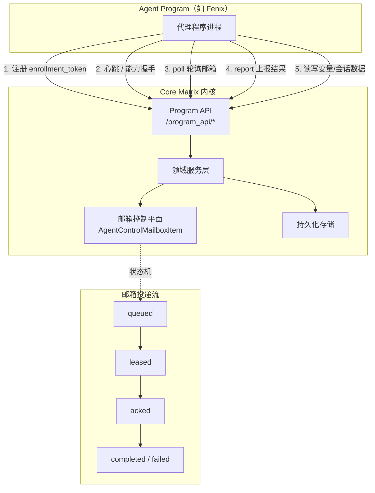
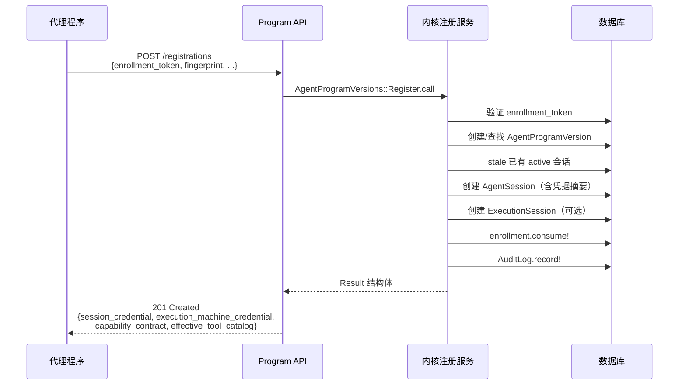
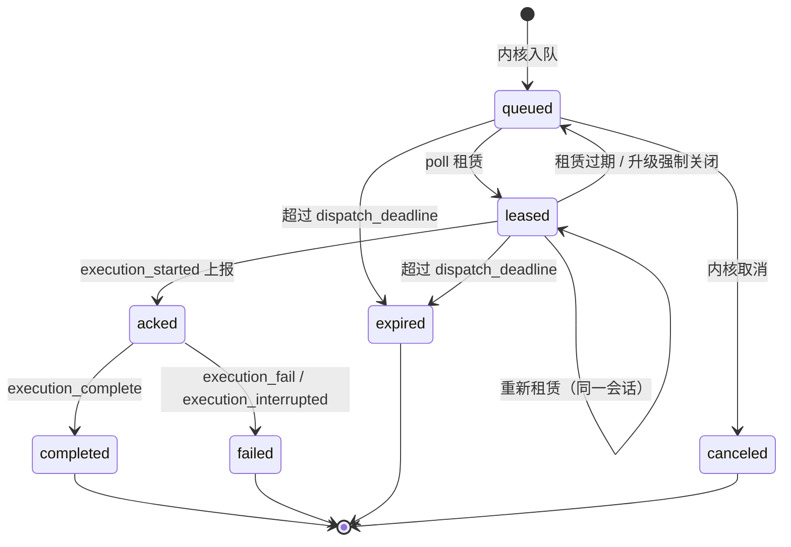
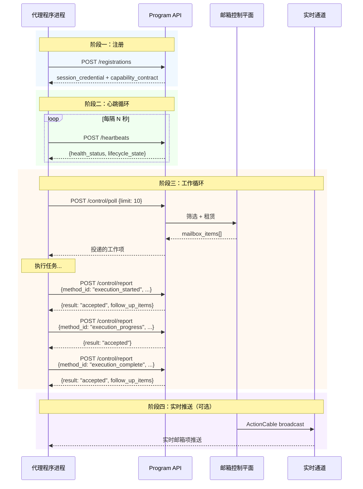

**Program API** 是 Core Matrix 内核与外部代理程序（如 Fenix）之间的**机器对机器（M2M）协议接口**。它定义了代理程序从注册上线、心跳保活、能力握手、邮箱轮询/上报，到会话数据读写的完整生命周期通道。与面向终端用户的 REST 接口不同，Program API 的调用者是经过凭据认证的自动化代理进程，承载的是内核与代理程序之间的运行时控制平面协议。该接口采用 `Bearer Token` 认证，通过 `/program_api` 命名空间暴露，所有端点均以 JSON 请求/响应交互。

Sources: [base_controller.rb](https://github.com/jasl/cybros.new/blob/main/core_matrix/app/controllers/program_api/base_controller.rb#L1-L27), [routes.rb](https://github.com/jasl/cybros.new/blob/main/core_matrix/config/routes.rb#L22-L47)

## 架构定位与双平面模型

Program API 建立在 Core Matrix 的**双平面运行时架构**之上。内核将工作负载分为两个调度平面：**program 平面**（代理程序自身处理的消息，如执行指派、准备轮次、程序工具调用）和 **execution 平面**（执行运行时处理的底层资源操作，如进程启动/输出/退出）。这种分离确保代理程序逻辑与基础设施操作可以独立伸缩和路由。

Sources: [agent_control_mailbox_item.rb](https://github.com/jasl/cybros.new/blob/main/core_matrix/app/models/agent_control_mailbox_item.rb#L4-L58), [resolve_target_runtime.rb](https://github.com/jasl/cybros.new/blob/main/core_matrix/app/services/agent_control/resolve_target_runtime.rb#L1-L36)

**认证模型**：所有端点（`registrations#create` 除外）均要求 HTTP Bearer Token 认证。`BaseController` 通过 `authenticate_with_http_token` 提取令牌，查找匹配的 `AgentSession`，并将 `current_agent_session`、`current_deployment`（即 `AgentProgramVersion`）和 `current_execution_runtime` 暴露给子控制器使用。注册端点跳过此认证，因为它在认证建立之前执行。

Sources: [base_controller.rb](https://github.com/jasl/cybros.new/blob/main/core_matrix/app/controllers/program_api/base_controller.rb#L1-L27)

## 端点总览

| 端点 | HTTP 方法 | 认证 | 职责 |
|------|-----------|------|------|
| `/program_api/registrations` | POST | 无（enrollment_token） | 注册新代理程序版本，建立会话凭据 |
| `/program_api/heartbeats` | POST | Bearer Token | 上报健康状态和心跳 |
| `/program_api/health` | GET | Bearer Token | 查询当前会话健康状态 |
| `/program_api/capabilities` | GET/POST | Bearer Token | 刷新/握手能力契约 |
| `/program_api/control/poll` | POST | Bearer Token | 轮询邮箱获取待处理工作项 |
| `/program_api/control/report` | POST | Bearer Token | 上报工作执行结果 |
| `/program_api/conversation_transcripts` | GET | Bearer Token | 获取会话消息记录 |
| `/program_api/conversation_variables/*` | 多种 | Bearer Token | 对话级变量 CRUD |
| `/program_api/workspace_variables/*` | 多种 | Bearer Token | 工作区级变量读写 |
| `/program_api/human_interactions` | POST | Bearer Token | 创建人类交互请求 |
| `/program_api/tool_invocations` | POST | Bearer Token | 创建工具调用实例 |

Sources: [routes.rb](https://github.com/jasl/cybros.new/blob/main/core_matrix/config/routes.rb#L22-L47)

## 注册与认证生命周期

注册是代理程序与 Core Matrix 建立信任关系的**唯一入口**。它将一次性 `enrollment_token`（由管理员通过 `AgentEnrollments::Issue` 签发）兑换为长期有效的 `session_credential`。

**注册流程**的输入是 enrollment_token 加上代理程序的完整自描述信息：`fingerprint`（版本指纹）、`protocol_version`、`sdk_version`、`protocol_methods`（支持的协议方法列表）、`tool_catalog`（程序自带工具目录）、`profile_catalog`（配置档目录）、`config_schema_snapshot`、`conversation_override_schema_snapshot` 和 `default_config_snapshot`。如果代理程序关联了执行运行时（通过 `runtime_fingerprint` 标识），还会同步注册 `ExecutionRuntime` 和 `ExecutionSession`，并返回独立的 `execution_machine_credential`。

注册完成后，内核执行以下关键操作：将同一 `AgentProgram` 下的已有 `active` 会话标记为 `stale`（确保单一活跃会话约束）；消费 enrollment 使其不可重用；创建审计日志条目。返回的响应包含完整的 `RuntimeCapabilityContract`——包含 `program_plane`、`execution_plane`、`effective_tool_catalog` 和治理后的工具目录。

Sources: [registrations_controller.rb](https://github.com/jasl/cybros.new/blob/main/core_matrix/app/controllers/program_api/registrations_controller.rb#L1-L45), [register.rb](https://github.com/jasl/cybros.new/blob/main/core_matrix/app/services/agent_program_versions/register.rb#L57-L105), [agent_session.rb](https://github.com/jasl/cybros.new/blob/main/core_matrix/app/models/agent_session.rb#L29-L49)

**安全模型要点**：`session_credential` 使用 `SHA-256` 单向摘要存储，内核只保留摘要值，永远不存储明文。代理程序必须在注册响应中获取并安全保存凭据，后续所有 API 调用都以 `Authorization: Bearer <session_credential>` 方式携带。

Sources: [agent_session.rb](https://github.com/jasl/cybros.new/blob/main/core_matrix/app/models/agent_session.rb#L39-L49)

## 心跳与健康监控

代理程序通过 `/program_api/heartbeats` 端点定期上报健康状态。心跳请求携带 `health_status`（`pending`、`healthy`、`degraded`、`offline`、`retired` 之一）、`health_metadata`（任意键值元数据）、`auto_resume_eligible` 标志以及可选的 `unavailability_reason`。

内核在每次心跳时更新 `AgentSession` 的 `last_heartbeat_at`、`health_status`、`health_metadata` 和 `auto_resume_eligible`。`auto_resume_eligible` 标志用于调度器判断：当代理程序从不可用状态恢复时，内核可以自动恢复之前挂起的工作流，而不需要人工干预。`/program_api/health` 端点（GET）则提供当前会话的只读健康快照，包含 `fingerprint`、`protocol_version`、`sdk_version` 等完整元数据。

Sources: [heartbeats_controller.rb](https://github.com/jasl/cybros.new/blob/main/core_matrix/app/controllers/program_api/heartbeats_controller.rb#L1-L25), [health_controller.rb](https://github.com/jasl/cybros.new/blob/main/core_matrix/app/controllers/program_api/health_controller.rb#L1-L22)

## 能力契约与握手

能力契约是内核与代理程序之间的**双向同步协议**，由 `RuntimeCapabilityContract` 模型统一管理。它综合三个来源的工具目录：(1) Core Matrix 内核工具（`subagent_spawn`、`subagent_send`、`subagent_wait`、`subagent_close`、`subagent_list` 等保留工具）；(2) 执行运行时工具目录（`execution_tool_catalog`）；(3) 代理程序工具目录（`program_tool_catalog`）——生成最终的 `effective_tool_catalog`。

**GET `/program_api/capabilities`** 用于刷新当前能力快照，返回最新的 `governed_effective_tool_catalog`（经过工具治理层过滤的可见目录）和完整的 `program_plane`/`execution_plane` 契约。

**POST `/program_api/capabilities`** 执行**完整握手**，代理程序提交最新的 `fingerprint`、`protocol_version`、`sdk_version` 和所有目录快照。内核验证指纹匹配后，更新执行运行时能力记录，重新投影工具能力快照，返回包含 `reconciliation_report` 的完整契约。这用于代理程序版本更新后的重新同步。

Sources: [capabilities_controller.rb](https://github.com/jasl/cybros.new/blob/main/core_matrix/app/controllers/program_api/capabilities_controller.rb#L1-L57), [runtime_capability_contract.rb](https://github.com/jasl/cybros.new/blob/main/core_matrix/app/models/runtime_capability_contract.rb#L116-L178), [handshake.rb](https://github.com/jasl/cybros.new/blob/main/core_matrix/app/services/agent_program_versions/handshake.rb#L52-L95)

## 邮箱控制平面：Poll 与 Report

邮箱控制平面是 Program API 的**核心交互模式**，采用"拉取工作 → 执行 → 上报结果"的循环范式。所有工作项以 `AgentControlMailboxItem` 记录持久化，每个工作项包含类型化的 `payload`、优先级、租赁超时、截止期限等元数据。

### 邮箱工作项类型

| `item_type` | 投递平面 | 说明 |
|--------------|----------|------|
| `execution_assignment` | program | 执行指派——内核请求代理程序执行一个具体任务 |
| `agent_program_request` | program | 程序请求——如 `prepare_round`、`execute_program_tool` |
| `resource_close_request` | program/execution | 资源关闭请求——请求终止可关闭资源 |
| `capabilities_refresh_request` | program | 能力刷新请求 |
| `recovery_notice` | program | 恢复通知 |

Sources: [agent_control_mailbox_item.rb](https://github.com/jasl/cybros.new/blob/main/core_matrix/app/models/agent_control_mailbox_item.rb#L6-L14)

### 邮箱状态机

邮箱工作项遵循严格的状态机：`queued` → `leased` → `acked` → `completed`/`failed`，以及异常分支 `expired`/`canceled`。

Sources: [agent_control_mailbox_item.rb](https://github.com/jasl/cybros.new/blob/main/core_matrix/app/models/agent_control_mailbox_item.rb#L15-L25), [lease_mailbox_item.rb](https://github.com/jasl/cybros.new/blob/main/core_matrix/app/services/agent_control/lease_mailbox_item.rb#L13-L35), [progress_close_request.rb](https://github.com/jasl/cybros.new/blob/main/core_matrix/app/services/agent_control/progress_close_request.rb#L14-L51)

### Poll：拉取工作项

`POST /program_api/control/poll` 是代理程序获取待处理工作的唯一方式。代理程序发送 `{ limit: N }` 请求，内核执行以下逻辑：

1. **更新活跃度**：`TouchDeploymentActivity` 将会话的 `control_activity_state` 设为 `active`。
2. **推进关闭请求**：遍历当前安装下所有活跃的 `resource_close_request`，执行 `ProgressCloseRequest`——检查宽限期/强制期限是否到期，必要时升级为强制关闭或标记超时失败。
3. **筛选候选工作项**：按优先级升序、可用时间升序、ID 升序排列候选邮箱项；通过 `ResolveTargetRuntime` 验证目标匹配（program 平面匹配 `AgentProgramVersion`/`AgentProgram`，execution 平面匹配 `ExecutionRuntime`）。
4. **租赁投递**：对匹配的工作项执行 `LeaseMailboxItem`——使用行锁确保并发安全，设置租赁过期时间，递增 `delivery_no`。

返回的每个邮箱项包含标准化信封：`item_id`、`item_type`、`runtime_plane`、`logical_work_id`、`attempt_no`、`delivery_no`、`protocol_message_id`、`priority`、`status`、`available_at`、`dispatch_deadline_at`、`lease_timeout_seconds`、`execution_hard_deadline_at` 和完整的 `payload`。

Sources: [control_controller.rb](https://github.com/jasl/cybros.new/blob/main/core_matrix/app/controllers/program_api/control_controller.rb#L3-L13), [poll.rb](https://github.com/jasl/cybros.new/blob/main/core_matrix/app/services/agent_control/poll.rb#L17-L41), [serialize_mailbox_item.rb](https://github.com/jasl/cybros.new/blob/main/core_matrix/app/services/agent_control/serialize_mailbox_item.rb#L3-L23)

### Report：上报执行结果

`POST /program_api/control/report` 是代理程序向内核报告工作进展的统一入口。每个上报请求携带 `method_id`（标识报告类型）和 `protocol_message_id`（幂等键）。内核通过 `ReportDispatch` 路由到对应的处理器：

| `method_id` | 处理器 | 说明 |
|-------------|--------|------|
| `execution_started` | `HandleExecutionReport` | 确认接受执行指派 |
| `execution_progress` | `HandleExecutionReport` | 上报执行进度 |
| `execution_complete` | `HandleExecutionReport` | 执行成功完成 |
| `execution_fail` | `HandleExecutionReport` | 执行失败 |
| `execution_interrupted` | `HandleExecutionReport` | 执行被中断 |
| `process_started` | `HandleRuntimeResourceReport` | 进程已启动 |
| `process_output` | `HandleRuntimeResourceReport` | 进程输出 |
| `process_exited` | `HandleRuntimeResourceReport` | 进程退出 |
| `resource_close_acknowledged` | `HandleCloseReport` | 确认收到关闭请求 |
| `resource_closed` | `HandleCloseReport` | 资源已关闭 |
| `resource_close_failed` | `HandleCloseReport` | 资源关闭失败 |
| `agent_program_completed` | `HandleAgentProgramReport` | 程序请求完成 |
| `agent_program_failed` | `HandleAgentProgramReport` | 程序请求失败 |
| `deployment_health_report` | `HandleHealthReport` | 健康状态报告 |

Sources: [control_controller.rb](https://github.com/jasl/cybros.new/blob/main/core_matrix/app/controllers/program_api/control_controller.rb#L15-L26), [report_dispatch.rb](https://github.com/jasl/cybros.new/blob/main/core_matrix/app/services/agent_control/report_dispatch.rb#L1-L61)

**幂等性与新鲜度保障**：Report 服务通过 `AgentControlReportReceipt` 实现消息级幂等——相同 `protocol_message_id` 的重复上报返回之前的处理结果（`duplicate`），不会重复执行业务逻辑。对于执行报告，`ValidateExecutionReportFreshness` 确保上报的上下文仍然有效：`execution_started` 验证邮箱项已租赁、任务处于 `queued` 状态；后续进度/终态报告验证任务处于 `running` 状态、租赁仍然活跃、且上报者确实是持有者。

Sources: [report.rb](https://github.com/jasl/cybros.new/blob/main/core_matrix/app/services/agent_control/report.rb#L22-L50), [validate_execution_report_freshness.rb](https://github.com/jasl/cybros.new/blob/main/core_matrix/app/services/agent_control/validate_execution_report_freshness.rb#L24-L63)

### 执行报告处理器详解

`HandleExecutionReport` 是最复杂的报告处理器，管理 `AgentTaskRun` 的完整生命周期：

- **`execution_started`**：将任务状态从 `queued` 转为 `running`，设置 `holder_agent_session`，为任务获取执行租赁（`Leases::Acquire`），将邮箱项标记为 `acked`，广播 `runtime.agent_task.started` 实时事件。
- **`execution_progress`**：续约执行租赁心跳，更新任务的 `progress_payload`，广播进度事件，协调工具调用进度。
- **终态处理**（`execution_complete`/`execution_fail`/`execution_interrupted`）：将任务和关联的 `WorkflowNode` 标记为终态，释放执行租赁，终止残留的命令运行，触发工作流后续调度（`workflow_follow_up`），广播终态事件。

Sources: [handle_execution_report.rb](https://github.com/jasl/cybros.new/blob/main/core_matrix/app/services/agent_control/handle_execution_report.rb#L25-L134)

### 关闭报告处理器

`HandleCloseReport` 处理可关闭资源（`AgentTaskRun`、`ProcessRun`、`SubagentSession`）的生命周期终止协议。使用双重行锁（邮箱项 + 资源）保证并发安全。`resource_close_acknowledged` 表示代理程序已收到关闭请求，`resource_closed` 表示资源已优雅关闭，`resource_close_failed` 表示关闭失败。关闭结果通过 `ApplyCloseOutcome` 统一应用。

Sources: [handle_close_report.rb](https://github.com/jasl/cybros.new/blob/main/core_matrix/app/services/agent_control/handle_close_report.rb#L20-L69), [closable_resource_registry.rb](https://github.com/jasl/cybros.new/blob/main/core_matrix/app/services/agent_control/closable_resource_registry.rb#L1-L33)

## 规范信封结构

根据 `agent-program/2026-04-01` 协议版本，内核发送给代理程序的邮箱项 `payload` 遵循**分节信封**结构，每个信封包含以下命名节：

| 节名 | 说明 | 出现条件 |
|------|------|----------|
| `protocol_version` | 协议版本标识 | 所有请求 |
| `request_kind` | 请求类型（`execution_assignment`/`prepare_round`/`execute_program_tool`） | 所有请求 |
| `task` | 内核工作项标识（`agent_task_run_id`、`workflow_run_id`、`conversation_id`、`turn_id`、`kind`） | 所有请求 |
| `conversation_projection` | 会话只读投影（`messages`、`context_imports`、`prior_tool_results`） | `execution_assignment`/`prepare_round` |
| `capability_projection` | 能力投影（`tool_surface`、`profile_key`、`is_subagent`、`subagent_policy`） | 所有请求 |
| `provider_context` | 模型与循环设置（`budget_hints`、`provider_execution`、`model_context`） | `execution_assignment`/`prepare_round` |
| `runtime_context` | 运行时元数据（`runtime_plane`、`logical_work_id`、`attempt_no`） | 所有请求 |
| `task_payload` | 仅包含请求的作业描述 | `execution_assignment`（可选） |

这一设计遵循**内核发送投影、代理程序返回意图**的核心原则：`task` 仅标识工作项，`conversation_projection` 是内核拥有的只读模型，`capability_projection` 替代了旧的 `agent_context` 混合载荷，`task_payload` 严格限制为作业本身，不得夹带工具目录或 provider 元数据。

Sources: [2026-04-01-agent-program-runtime-contract.md](https://github.com/jasl/cybros.new/blob/main/docs/design/2026-04-01-agent-program-runtime-contract.md#L233-L295), [core_matrix_fenix_execution_assignment.json](https://github.com/jasl/cybros.new/blob/main/shared/fixtures/contracts/core_matrix_fenix_execution_assignment.json#L1-L123), [core_matrix_fenix_prepare_round_mailbox_item.json](https://github.com/jasl/cybros.new/blob/main/shared/fixtures/contracts/core_matrix_fenix_prepare_round_mailbox_item.json#L1-L83)

## 会话数据接口

Program API 提供代理程序在执行过程中读写上下文数据的接口，分为**对话变量**和**工作区变量**两个作用域层级。

### 对话变量

对话变量（`/program_api/conversation_variables/*`）绑定到特定对话，支持完整的 CRUD 操作：

| 操作 | HTTP | 路由参数 | 说明 |
|------|------|----------|------|
| `get` | GET | `workspace_id`, `conversation_id`, `key` | 获取单个变量 |
| `mget` | POST | `workspace_id`, `conversation_id`, `keys[]` | 批量获取 |
| `exists` | GET | `workspace_id`, `conversation_id`, `key` | 检查存在性 |
| `list_keys` | GET | `workspace_id`, `conversation_id` | 分页列出键 |
| `resolve` | GET | `workspace_id`, `conversation_id` | 解析所有可见变量值 |
| `set` | POST | `workspace_id`, `conversation_id`, `key`, `typed_value_payload` | 写入变量 |
| `delete` | POST | `workspace_id`, `conversation_id`, `key` | 删除变量 |
| `promote` | POST | `workspace_id`, `conversation_id`, `key` | 提升为工作区变量 |

`resolve` 操作特别重要——它调用 `ConversationVariables::VisibleValuesResolver` 将对话级和工作区级变量合并为一个完整的可见值映射，代理程序通常在构建上下文时使用此接口。

Sources: [conversation_variables_controller.rb](https://github.com/jasl/cybros.new/blob/main/core_matrix/app/controllers/program_api/conversation_variables_controller.rb#L1-L134)

### 工作区变量

工作区变量（`/program_api/workspace_variables/*`）是跨对话共享的持久化存储：

| 操作 | HTTP | 说明 |
|------|------|------|
| `index` | GET | 列出工作区所有变量 |
| `show_value` | GET | 获取单个变量值 |
| `bulk_show` | POST | 批量获取变量 |
| `write` | POST | 写入变量（含 `source_kind`、`projection_policy` 等元数据） |

`write` 操作支持完整的溯源信息：`source_kind`（来源类型）、`source_turn`（来源轮次）、`source_workflow_run`（来源工作流运行）和 `projection_policy`（投影策略，默认 `silent`）。对话变量的 `promote` 操作可以将对话级变量提升为工作区变量，实现从临时状态到持久状态的升级。

Sources: [workspace_variables_controller.rb](https://github.com/jasl/cybros.new/blob/main/core_matrix/app/controllers/program_api/workspace_variables_controller.rb#L1-L77)

## 会话记录与人类交互

**`/program_api/conversation_transcripts`**（GET）提供对话消息的分页投影，支持 `cursor` 和 `limit` 参数。返回的每条消息包含 `id`、`conversation_id`、`turn_id`、`role`、`slot`、`variant_index` 和 `content`。

**`/program_api/human_interactions`**（POST）允许代理程序在工作流执行过程中创建人类交互请求（审批、表单、任务请求）。请求必须关联到特定的 `workflow_node_id`，包含 `request_type`、`blocking` 标志和 `request_payload`。内核将此请求持久化并通过实时通道通知前端，等待人类响应后通过工作流恢复机制重新激活。

Sources: [conversation_transcripts_controller.rb](https://github.com/jasl/cybros.new/blob/main/core_matrix/app/controllers/program_api/conversation_transcripts_controller.rb#L1-L19), [human_interactions_controller.rb](https://github.com/jasl/cybros.new/blob/main/core_matrix/app/controllers/program_api/human_interactions_controller.rb#L1-L17)

## 工具调用实例化

**`/program_api/tool_invocations`**（POST）是代理程序在执行过程中创建工具调用实例的接口。该端点执行严格的授权链验证：(1) 验证 `AgentTaskRun` 属于当前代理程序且正在运行；(2) 验证请求的工具名在任务的工具绑定中存在；(3) 调用 `ToolInvocations::Provision` 创建工具调用实例，支持 `idempotency_key` 实现幂等创建。返回的响应包含完整的工具调用序列化信息：`tool_invocation_id`、`tool_binding_id`、`tool_definition_id`、`tool_implementation_id`、`tool_name`、`status` 和 `request_payload`。

Sources: [tool_invocations_controller.rb](https://github.com/jasl/cybros.new/blob/main/core_matrix/app/controllers/program_api/tool_invocations_controller.rb#L1-L22), [base_controller.rb](https://github.com/jasl/cybros.new/blob/main/core_matrix/app/controllers/program_api/base_controller.rb#L93-L120)

## 实时推送通道

除了轮询模式外，Program API 还通过 ActionCable WebSocket 支持**实时邮箱投递**。`AgentControl::PublishPending` 服务在工作项入队后主动检查目标代理程序是否已建立实时连接（`realtime_link_connected?`），如果是，则通过 `agent_control:deployment:<public_id>` 频道直接推送序列化后的邮箱项，跳过轮询延迟。代理程序可以同时保持 WebSocket 连接和定期轮询，实现低延迟和可靠性的平衡。

Sources: [publish_pending.rb](https://github.com/jasl/cybros.new/blob/main/core_matrix/app/services/agent_control/publish_pending.rb#L15-L32), [stream_name.rb](https://github.com/jasl/cybros.new/blob/main/core_matrix/app/services/agent_control/stream_name.rb#L1-L7)

## 完整交互流程

以下序列图展示了代理程序通过 Program API 与 Core Matrix 交互的典型生命周期：

## 错误处理与响应约定

Program API 遵循一致的错误响应约定：

| 场景 | HTTP 状态码 | 响应体 |
|------|------------|--------|
| 认证失败 | 401 Unauthorized | `{ "error": "session credential is invalid" }` |
| 资源未找到 | 404 Not Found | `{ "error": "<message>" }` |
| 记录验证失败 | 422 Unprocessable Entity | `{ "error": "<validation messages>" }` |
| 注册令牌无效/过期 | 422 Unprocessable Entity | `{ "error": "<message>" }` |
| 指纹不匹配 | 422 Unprocessable Entity | `{ "error": "<message>" }` |
| 上报已过时 | 409 Conflict | `{ "result": "stale", "mailbox_items": [] }` |
| 重复上报 | 200 OK | `{ "result": "duplicate", "mailbox_items": [...] }` |

`BaseController` 通过 `rescue_from` 统一捕获 `ActiveRecord::RecordInvalid`、`ActiveRecord::RecordNotFound`、`InvalidEnrollment`、`ExpiredEnrollment`、`FingerprintMismatch` 和 `MissingRuntimeFingerprint` 异常，确保所有错误响应遵循相同的 JSON 格式。

Sources: [base_controller.rb](https://github.com/jasl/cybros.new/blob/main/core_matrix/app/controllers/program_api/base_controller.rb#L7-L12), [base_controller.rb](https://github.com/jasl/cybros.new/blob/main/core_matrix/app/controllers/program_api/base_controller.rb#L245-L257)

## 内核与代理程序的职责边界

Program API 的设计严格遵循**职责分离原则**，确保内核保持通用性和持久性：

**内核拥有（通过 Program API 管理）**：对话/轮次/工作流的持久状态；工具调用、命令运行、进程运行的生命周期管理；邮箱投递、等待/恢复语义和工作流重入；能力可见性、治理和审计；记录和上下文投影；所有内核资源的最终持久化权限。

**代理程序拥有（在 Program API 之外）**：提示词组装；上下文压缩策略；记忆策略和提取；配置档行为；领域特定工具塑形；子代理/专家策略；输出塑形和摘要生成。

Sources: [2026-04-01-agent-program-runtime-contract.md](https://github.com/jasl/cybros.new/blob/main/docs/design/2026-04-01-agent-program-runtime-contract.md#L120-L148)

## 延伸阅读

- [Execution API：运行时资源控制接口](https://github.com/jasl/cybros.new/blob/main/25-execution-api-yun-xing-shi-zi-yuan-kong-zhi-jie-kou)——执行平面的对应接口，处理进程运行、命令运行和附件等底层运行时资源
- [App API：对话诊断、导出与导入接口](https://github.com/jasl/cybros.new/blob/main/26-app-api-dui-hua-zhen-duan-dao-chu-yu-dao-ru-jie-kou)——面向应用的对话管理接口
- [代理注册、能力握手与部署生命周期](https://github.com/jasl/cybros.new/blob/main/6-dai-li-zhu-ce-neng-li-wo-shou-yu-bu-shu-sheng-ming-zhou-qi)——代理程序注册和能力握手的领域模型细节
- [邮箱控制平面：消息投递、租赁与实时推送](https://github.com/jasl/cybros.new/blob/main/10-you-xiang-kong-zhi-ping-mian-xiao-xi-tou-di-zu-ren-yu-shi-shi-tui-song)——邮箱系统的完整设计说明
- [Provider 执行循环：轮次请求、工具调用与结果持久化](https://github.com/jasl/cybros.new/blob/main/9-provider-zhi-xing-xun-huan-lun-ci-qing-qiu-gong-ju-diao-yong-yu-jie-guo-chi-jiu-hua)——provider 执行循环如何与 Program API 的 `prepare_round` 请求交互
- [Fenix 产品定位与配对清单契约](https://github.com/jasl/cybros.new/blob/main/19-fenix-chan-pin-ding-wei-yu-pei-dui-qing-dan-qi-yue)——Fenix 作为参考代理程序的实现视角