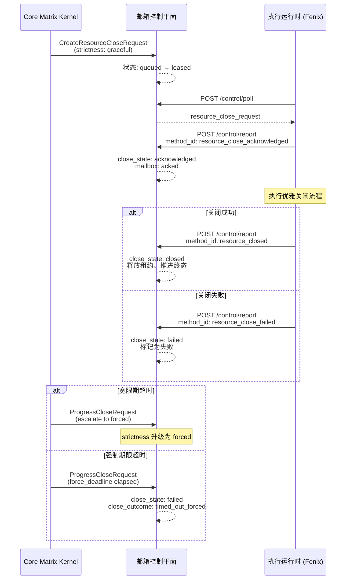

Execution API 是 Core Matrix 面向**运行时执行环境**（而非代理程序本身）的机器对机器控制接口。与 [Program API](https://github.com/jasl/cybros.new/blob/main/24-program-api-dai-li-cheng-xu-ji-qi-dui-ji-qi-jie-kou) 的区别在于身份锚定模型——Program API 验证的是 `AgentSession`（代理程序部署会话），而 Execution API 验证的是 `ExecutionSession`（运行时执行会话），这使得该接口能够在不依赖特定代理程序身份的情况下，直接操控命令运行、进程管理、附件获取以及邮箱控制平面上的轮询与报告操作。该接口的消费者是 Fenix 等代理程序运行时基础设施，负责在实际的操作系统层面执行命令、管理进程生命周期并回报执行结果。

Sources: [base_controller.rb](https://github.com/jasl/cybros.new/blob/main/core_matrix/app/controllers/execution_api/base_controller.rb#L1-L98), [routes.rb](https://github.com/jasl/cybros.new/blob/main/core_matrix/config/routes.rb#L56-L69)

## 认证与会话模型

Execution API 采用 **HTTP Bearer Token 认证**，与 Program API 共享相同的 `ActionController::HttpAuthentication::Token` 机制，但身份解析路径完全不同。`ExecutionAPI::BaseController` 继承自 `ProgramAPI::BaseController`，通过 `skip_before_action :authenticate_agent_session!` 显式跳过程序会话认证，随后注册自己的 `before_action :authenticate_execution_session!`，建立独立的认证链路。

认证过程从 HTTP `Authorization` 头提取 token，通过 `ExecutionSession.find_by_plaintext_session_credential` 方法将明文凭据进行 SHA-256 摘要比对，解析出 `current_execution_session` 和 `current_execution_runtime` 两个核心上下文对象。`ExecutionSession` 模型维护了一个 `lifecycle_state` 枚举（`active` / `stale` / `closed`），并在数据库层面通过 `single_active_session` 验证确保每个 `ExecutionRuntime` 最多只有一个活跃会话。

Sources: [base_controller.rb](https://github.com/jasl/cybros.new/blob/main/core_matrix/app/controllers/execution_api/base_controller.rb#L1-L18), [execution_session.rb](https://github.com/jasl/cybros.new/blob/main/core_matrix/app/models/execution_session.rb#L1-L63)

### 授权层级与资源可见性

`ExecutionAPI::BaseController` 定义了一套严格的授权方法链，所有资源操作必须同时通过**安装隔离**和**运行时归属**两个维度的验证：

| 授权方法 | 验证逻辑 | 使用场景 |
|---|---|---|
| `authorize_turn_execution_runtime!` | `turn.execution_runtime_id == current_execution_runtime.id` | 附件请求 |
| `authorize_agent_task_run!` | 任务所属轮次的 `execution_runtime_id` 匹配 | 所有任务级操作 |
| `authorize_active_agent_task_run!` | 在上述基础上，要求 `running?` 且 `close_requested_at` 为空 | 创建资源 |
| `authorize_running_tool_invocation!` | 工具调用必须处于 `running` 状态 | 命令运行创建 |
| `authorize_live_command_run!` | 命令运行 + 任务活跃 + 工具调用运行 | 命令运行激活 |

这种多层授权设计确保了一个运行时环境只能操控自己被分配到的轮次及其衍生资源，即使请求携带了正确的 token，也无法跨运行时访问其他执行环境的资源。当授权失败时，统一抛出 `ActiveRecord::RecordNotFound`，避免泄露资源的实际存在状态。

Sources: [base_controller.rb](https://github.com/jasl/cybros.new/blob/main/core_matrix/app/controllers/execution_api/base_controller.rb#L59-L97)

## 端点总览

Execution API 的路由定义在 `namespace :execution_api` 下，包含五个端点，覆盖命令执行、进程管理、附件获取和控制平面通信四个领域：

```ruby
namespace :execution_api do
  resources :command_runs, only: :create do
    post :activate, on: :member
  end
  resources :process_runs, only: :create
  resources :attachments, only: [] do
    collection do
      post "request", action: :create
    end
  end
  post "control/poll", to: "control#poll"
  post "control/report", to: "control#report"
end
```

| 端点 | HTTP 方法 | 路径 | 功能 |
|---|---|---|---|
| 命令运行创建 | POST | `/execution_api/command_runs` | 为工具调用配置命令运行 |
| 命令运行激活 | POST | `/execution_api/command_runs/:id/activate` | 将 starting 状态转为 running |
| 进程运行创建 | POST | `/execution_api/process_runs` | 配置后台服务进程 |
| 附件请求 | POST | `/execution_api/attachments/request` | 获取轮次快照中的附件签名 URL |
| 控制轮询 | POST | `/execution_api/control/poll` | 拉取邮箱投递项 |
| 控制报告 | POST | `/execution_api/control/report` | 上报执行状态和关闭确认 |

Sources: [routes.rb](https://github.com/jasl/cybros.new/blob/main/core_matrix/config/routes.rb#L56-L69)

## 命令运行（CommandRun）生命周期

CommandRun 代表一个短生命周期的命令执行单元，挂载在 `ToolInvocation` 之下，遵循 `starting → running → 终态` 的三阶段生命周期。Execution API 暴露了创建和激活两个端点，由运行时环境分步调用，在内核中先建立持久化身份，再在实际操作系统层面启动进程。

### 创建命令运行

`POST /execution_api/command_runs` 端点接收以下参数：

| 参数 | 必需 | 说明 |
|---|---|---|
| `tool_invocation_id` | 是 | 目标工具调用的 `public_id` |
| `command_line` | 是 | 待执行的命令行字符串 |
| `timeout_seconds` | 否 | 超时时间（秒） |
| `pty` | 否 | 是否分配伪终端，默认 `false` |
| `metadata` | 否 | 元数据哈希，如 `{"sandbox": "workspace-write"}` |

创建过程委托给 `CommandRuns::Provision` 服务，该服务在 `ToolInvocation` 上获取行锁后执行幂等检查——如果该工具调用已经关联了一个 CommandRun，则直接返回已有记录（`result: "duplicate"`），确保网络重试不会产生重复的命令运行。新创建的 CommandRun 初始状态为 `starting`，调用方在获得内核确认后才应在本机执行命令。

授权检查要求工具调用必须处于 `running` 状态，且其所属的 `AgentTaskRun` 处于活跃状态且未被请求关闭。

Sources: [command_runs_controller.rb](https://github.com/jasl/cybros.new/blob/main/core_matrix/app/controllers/execution_api/command_runs_controller.rb#L1-L31), [provision.rb](https://github.com/jasl/cybros.new/blob/main/core_matrix/app/services/command_runs/provision.rb#L1-L38)

### 激活命令运行

`POST /execution_api/command_runs/:id/activate` 端点将 CommandRun 从 `starting` 状态推进到 `running` 状态，表示运行时环境已在本机成功启动了该命令进程。`CommandRuns::Activate` 同样在行锁保护下操作，对已经是 `running` 状态的请求返回 `result: "noop"`，实现激活幂等性。

授权层通过 `authorize_live_command_run!` 执行三重检查：命令运行归属正确、任务运行活跃且无关闭请求、工具调用处于运行中。如果任务已被请求关闭（`close_requested_at` 不为空），激活将被拒绝为 404，防止在关闭流程进行中创建新的执行活动。

Sources: [command_runs_controller.rb](https://github.com/jasl/cybros.new/blob/main/core_matrix/app/controllers/execution_api/command_runs_controller.rb#L20-L30), [activate.rb](https://github.com/jasl/cybros.new/blob/main/core_matrix/app/services/command_runs/activate.rb#L1-L32)

### CommandRun 状态机

```
                ┌──────────────────────────────────────┐
                │            starting                   │
                │  (已创建，等待运行时激活)               │
                └───────────┬──────────┬────────────────┘
                    activate│          │ (任务关闭/中断)
                            ▼          ▼
                ┌──────────────────┐  ┌────────────────┐
                │     running      │  │   interrupted   │
                │  (进程执行中)     │  │  (被外部中断)   │
                └──┬───┬───┬───────┘  └────────────────┘
                   │   │   │
        正常退出 ──┘   │   └── 被中断
                       │
                ┌──────▼──────┐  ┌─────────────┐
                │  completed   │  │   failed    │
                │  (正常完成)  │  │  (执行失败)  │
                └──────────────┘  └─────────────┘
```

CommandRun 的终态转换不通过 Execution API 直接触发，而是由 [Program API](https://github.com/jasl/cybros.new/blob/main/24-program-api-dai-li-cheng-xu-ji-qi-dui-ji-qi-jie-kou) 的 `control/report` 路径中的执行报告处理器间接完成。当代理程序报告 `execution_complete`、`execution_fail` 或 `execution_interrupted` 时，`HandleExecutionReport` 会调用 `CommandRuns::Terminalize` 将所有残留的 `starting/running` 命令运行推进到对应的终态。

Sources: [command_run.rb](https://github.com/jasl/cybros.new/blob/main/core_matrix/app/models/command_run.rb#L1-L95)

## 进程运行（ProcessRun）生命周期

ProcessRun 代表长生命周期的后台服务进程（如 `bin/dev` 开发服务器），它与 CommandRun 的关键区别在于：ProcessRun 直接挂载在 `WorkflowNode` 下，拥有自己的 `execution_runtime_id`，并实现了 `ClosableRuntimeResource` 关注点，支持完整的关闭协议。

### 创建进程运行

`POST /execution_api/process_runs` 端点接收以下参数：

| 参数 | 必需 | 说明 |
|---|---|---|
| `agent_task_run_id` | 是 | 所属代理任务运行的 `public_id` |
| `tool_name` | 是 | 必须为 `"process_exec"` |
| `kind` | 是 | 进程类型，当前仅支持 `"background_service"` |
| `command_line` | 是 | 待执行的命令行 |
| `timeout_seconds` | 否 | 对于 `background_service` 必须为空 |
| `metadata` | 否 | 元数据哈希 |
| `idempotency_key` | 否 | 幂等键，基于 `workflow_node` + `idempotency_key` 去重 |

创建过程首先验证 `tool_name` 必须严格等于 `"process_exec"`，然后通过 `find_tool_binding_for_agent_task_run!` 确认该任务确实绑定了 `process_exec` 工具。`Processes::Provision` 服务在事务中完成创建，包括：获取进程租约（通过 `ExecutionSessions::ResolveActiveSession` 解析当前活跃会话，再调用 `Leases::Acquire`），以及追加工作流节点状态事件。

`background_service` 类型的 ProcessRun 在模型验证中强制要求 `timeout_seconds` 为空——后台服务没有预设超时，其终止完全由关闭协议控制。

Sources: [process_runs_controller.rb](https://github.com/jasl/cybros.new/blob/main/core_matrix/app/controllers/execution_api/process_runs_controller.rb#L1-L27), [provision.rb](https://github.com/jasl/cybros.new/blob/main/core_matrix/app/services/processes/provision.rb#L1-L109)

### ProcessRun 状态机与关闭协议

```
    ┌───────────────────────────────────────────────────┐
    │                    starting                        │
    │  (已配置，等待进程启动)                              │
    └──────────┬──────────────────┬──────────────────────┘
   process_started│                 │ (关闭请求/超时)
               ▼                   │
    ┌──────────────────┐           │    ┌─────────────────┐
    │     running      │◄──────────┤    │  close: open     │
    │  (进程运行中)     │           │    │  (初始关闭状态)  │
    └──┬──────┬────────┘           │    └────────┬────────┘
       │      │                    │             │
  自然退出│      │ 关闭请求          │             ▼
       │      └────────────────────┤    ┌─────────────────┐
       ▼                           │    │close: requested  │
    ┌──────────┐  ┌───────────┐   │    └────────┬────────┘
    │ stopped   │  │  failed   │   │             │
    │(正常停止) │  │ (执行失败) │   │             ▼
    └──────────┘  └───────────┘   │    ┌─────────────────────┐
                                  │    │close: acknowledged   │
                                  │    └────────┬────────────┘
                                  │             │
                                  │             ▼
                                  │    ┌────────────────┐
                                  │    │close: closed    │
                                  │    │ (优雅关闭完成)  │
                                  │    └────────────────┘
                                  │    ┌────────────────┐
                                  └───►│close: failed    │
                                       │ (关闭超时/失败) │
                                       └────────────────┘
```

ProcessRun 通过 `ClosableRuntimeResource` 关注点引入了五态关闭协议：`open → requested → acknowledged → closed/failed`。关闭流程由内核通过 `CreateResourceCloseRequest` 创建邮箱投递项发起，运行时环境通过 `control/poll` 接收请求后逐步回报关闭进展。

Sources: [process_run.rb](https://github.com/jasl/cybros.new/blob/main/core_matrix/app/models/process_run.rb#L1-L144), [closable_runtime_resource.rb](https://github.com/jasl/cybros.new/blob/main/core_matrix/app/models/concerns/closable_runtime_resource.rb#L1-L59)

## 附件请求

`POST /execution_api/attachments/request` 端点允许运行时环境获取轮次执行快照中声明的附件的签名下载 URL。该端点执行双层验证：首先确认目标轮次归属于当前运行时（`authorize_turn_execution_runtime!`），然后在轮次的 `execution_snapshot.attachment_manifest` 中查找请求的附件条目——只有在快照中预先声明的附件才能被获取。

响应包含附件的完整元数据（从快照 manifest 中读取）、Active Storage 的 `blob_signed_id`（5 分钟有效期）以及可直接下载的 `download_url`。这种设计确保了运行时环境在执行上下文准备阶段能够安全地获取输入附件，而不需要代理程序的参与。

Sources: [attachments_controller.rb](https://github.com/jasl/cybros.new/blob/main/core_matrix/app/controllers/execution_api/attachments_controller.rb#L1-L27)

## 控制平面：轮询与报告

Execution API 的控制平面与 Program API 共享同一套 `AgentControl` 服务架构，但通过 `runtime_plane: "execution"` 标识进行投递路由。控制平面的核心是 **poll/report 双向通信模式**：运行时通过 poll 拉取待处理的邮箱投递项（如资源关闭请求、执行分配），通过 report 上报执行状态变更和关闭确认。

### 轮询（control/poll）

`POST /execution_api/control/poll` 委托给 `AgentControl::Poll` 服务。当传入 `execution_session` 参数时，轮询进入执行平面模式（`execution_poll?` 为 true），通过 `ResolveTargetRuntime.candidate_scope_for_execution_session` 筛选 `runtime_plane = "execution"` 且 `target_execution_runtime_id` 匹配的邮箱项。投递流程包括：

1. **推进关闭请求**：扫描所有活跃状态的 `resource_close_request` 类型邮箱项，检查宽限期和强制期限
2. **候选筛选**：从队列中按优先级和可用时间排序获取候选投递项
3. **租约获取**：对未租赁的候选项执行 `LeaseMailboxItem`，绑定到当前执行会话
4. **序列化输出**：通过 `SerializeMailboxItem` 将邮箱项转为 JSON 响应

`limit` 参数控制单次轮询的最大投递量（默认 20），内部查询获取 `limit * 10` 条候选以提高有效投递率。

Sources: [control_controller.rb](https://github.com/jasl/cybros.new/blob/main/core_matrix/app/controllers/execution_api/control_controller.rb#L12-L21), [poll.rb](https://github.com/jasl/cybros.new/blob/main/core_matrix/app/services/agent_control/poll.rb#L1-L125)

### 报告（control/report）

`POST /execution_api/control/report` 接受 `method_id` 驱动的报告分发。`ControlController` 通过 `EXECUTION_REPORT_METHODS` 白名单限定 Execution API 可接受的报告方法：

| 方法 | 分类 | 说明 |
|---|---|---|
| `process_started` | 运行时资源报告 | 进程已启动，激活 ProcessRun |
| `process_output` | 运行时资源报告 | 进程输出块，广播到实时通道 |
| `process_exited` | 运行时资源报告 | 进程退出，推进到终态并结算关闭请求 |
| `resource_close_acknowledged` | 关闭报告 | 运行时确认收到关闭请求 |
| `resource_closed` | 关闭报告 | 资源已优雅关闭 |
| `resource_close_failed` | 关闭报告 | 关闭失败 |

报告处理遵循严格的**幂等性协议**：`AgentControl::Report` 通过 `AgentControlReportReceipt` 的 `protocol_message_id` 唯一约束检测重复提交，对已接受的历史报告返回 `result: "duplicate"`，对已标记为 stale 的报告返回 409 Conflict。每个报告在事务中创建回执、验证新鲜度、执行副作用、更新回执状态，保证 Exactly-Once 语义。

Sources: [control_controller.rb](https://github.com/jasl/cybros.new/blob/main/core_matrix/app/controllers/execution_api/control_controller.rb#L23-L66), [report.rb](https://github.com/jasl/cybros.new/blob/main/core_matrix/app/services/agent_control/report.rb#L1-L115), [report_dispatch.rb](https://github.com/jasl/cybros.new/blob/main/core_matrix/app/services/agent_control/report_dispatch.rb#L1-L62)

### 部署解析与资源路由

`ControlController#resolve_deployment!` 从报告负载中解析出 `ProcessRun`，并验证其 `execution_runtime_id` 匹配当前会话。该过程通过 `ClosableResourceRegistry.find!` 查找资源，注册表支持三种可关闭资源类型：`AgentTaskRun`、`ProcessRun` 和 `SubagentSession`。对于 Execution API 的报告，只接受 ProcessRun 类型的资源（非 ProcessRun 资源会触发 404），这体现了执行平面与程序平面的职责边界。

Sources: [control_controller.rb](https://github.com/jasl/cybros.new/blob/main/core_matrix/app/controllers/execution_api/control_controller.rb#L39-L65), [closable_resource_registry.rb](https://github.com/jasl/cybros.new/blob/main/core_matrix/app/services/agent_control/closable_resource_registry.rb#L1-L33)

## 新鲜度验证与过期防护

Execution API 的报告处理在每个操作前都执行严格的新鲜度验证，防止过期或冲突的操作破坏状态一致性：

- **关闭报告新鲜度**（`ValidateCloseReportFreshness`）：验证邮箱项确实为 `resource_close_request` 类型、租约持有者匹配、资源类型和 ID 与请求一致、资源尚未达到终态、执行平面运行时 ID 匹配
- **执行报告新鲜度**（`ValidateExecutionReportFreshness`）：对 `execution_started` 验证邮箱项为 `execution_assignment` 且租约有效；对后续方法验证任务处于 `running`、持有者匹配、执行租约活跃且无关闭请求
- **运行时资源报告新鲜度**（`HandleRuntimeResourceReport` 内联验证）：验证 ProcessRun 处于允许的状态转换窗口、执行租约活跃且能成功心跳

所有新鲜度验证失败统一抛出 `Report::StaleReportError`，由 `AgentControl::Report` 捕获并设置 `result_code: "stale"` 和 409 HTTP 状态码，让调用方明确知道需要重新同步状态。

Sources: [validate_close_report_freshness.rb](https://github.com/jasl/cybros.new/blob/main/core_matrix/app/services/agent_control/validate_close_report_freshness.rb#L1-L46), [validate_execution_report_freshness.rb](https://github.com/jasl/cybros.new/blob/main/core_matrix/app/services/agent_control/validate_execution_report_freshness.rb#L1-L65), [handle_runtime_resource_report.rb](https://github.com/jasl/cybros.new/blob/main/core_matrix/app/services/agent_control/handle_runtime_resource_report.rb#L65-L97)

## 关闭协议的完整流程

当内核决定关闭一个 ProcessRun 时，完整的协议交互遵循以下时序：



`ProgressCloseRequest` 在每次 `control/poll` 调用时被触发，检查所有活跃关闭请求的期限状态。当宽限期（`grace_deadline_at`）到达时，将 `strictness` 从 `graceful` 升级为 `forced` 并重置邮箱项状态为 `queued`；当强制期限（`force_deadline_at`）到达时，直接将资源标记为 `close_state: failed`，`close_outcome_kind: "timed_out_forced"`。

Sources: [create_resource_close_request.rb](https://github.com/jasl/cybros.new/blob/main/core_matrix/app/services/agent_control/create_resource_close_request.rb#L1-L121), [progress_close_request.rb](https://github.com/jasl/cybros.new/blob/main/core_matrix/app/services/agent_control/progress_close_request.rb#L1-L83), [apply_close_outcome.rb](https://github.com/jasl/cybros.new/blob/main/core_matrix/app/services/agent_control/apply_close_outcome.rb#L1-L328)

## 进程报告的处理细节

### process_started

`HandleRuntimeResourceReport#handle_process_started!` 调用 `Processes::Activate`，将 ProcessRun 从 `starting` 推进到 `running`，同时创建 `WorkflowNodeEvent`（状态事件），记录审计日志（`process_run.started`），并通过 `Processes::BroadcastRuntimeEvent` 将 `runtime.process_run.started` 事件广播到会话的实时通道。

Sources: [handle_runtime_resource_report.rb](https://github.com/jasl/cybros.new/blob/main/core_matrix/app/services/agent_control/handle_runtime_resource_report.rb#L35-L41), [activate.rb](https://github.com/jasl/cybros.new/blob/main/core_matrix/app/services/processes/activate.rb#L1-L80)

### process_output

`handle_process_output!` 接收 `output_chunks` 数组，对每个包含非空 `text` 的块调用 `Processes::BroadcastOutputChunks`，通过 `ConversationRuntime::Broadcast` 将 `runtime.process_run.output` 事件广播到实时通道，让前端和其他订阅者能够实时看到进程输出。

Sources: [handle_runtime_resource_report.rb](https://github.com/jasl/cybros.new/blob/main/core_matrix/app/services/agent_control/handle_runtime_resource_report.rb#L43-L49), [broadcast_output_chunks.rb](https://github.com/jasl/cybros.new/blob/main/core_matrix/app/services/processes/broadcast_output_chunks.rb#L1-L27)

### process_exited

`handle_process_exited!` 是最复杂的报告处理路径。它调用 `Processes::Exit` 将 ProcessRun 推进到 `stopped` 或 `failed` 终态，释放执行租约，创建工作流节点状态事件，并广播终端运行时事件。随后执行 `settle_pending_process_close!`——如果进程在关闭请求进行中自然退出，该方法会在双重行锁保护下自动将关闭状态推进为 `closed`（`close_outcome_kind: "graceful"`），并触发对话层的关闭协调（`Conversations::ReconcileCloseOperation`）。

Sources: [handle_runtime_resource_report.rb](https://github.com/jasl/cybros.new/blob/main/core_matrix/app/services/agent_control/handle_runtime_resource_report.rb#L51-L63), [exit.rb](https://github.com/jasl/cybros.new/blob/main/core_matrix/app/services/processes/exit.rb#L1-L96)

## Execution API 与 Program API 的职责边界

两个 API 共享 `ProgramAPI::BaseController` 作为共同祖先，但在身份模型、投递平面和资源操控范围上严格分离：

| 维度 | Program API | Execution API |
|---|---|---|
| 认证身份 | `AgentSession`（代理程序会话） | `ExecutionSession`（运行时会话） |
| 投递平面 | `runtime_plane: "program"` | `runtime_plane: "execution"` |
| 资源创建 | 工具调用、人类交互 | 命令运行、进程运行、附件获取 |
| 报告方法 | 执行报告、代理程序报告、健康报告 | 运行时资源报告、关闭报告 |
| 关闭路由 | 针对 AgentTaskRun、SubagentSession | 针对 ProcessRun |
| 部署解析 | 通过 `agent_program_version` | 通过 `agent_program_version`（间接，从 Turn 获取） |

这种分离使得运行时环境能够在不持有代理程序会话的情况下独立管理其执行资源，为多运行时并行执行和运行时热替换提供了架构基础。

Sources: [base_controller.rb](https://github.com/jasl/cybros.new/blob/main/core_matrix/app/controllers/execution_api/base_controller.rb#L1-L4), [base_controller.rb (ProgramAPI)](https://github.com/jasl/cybros.new/blob/main/core_matrix/app/controllers/program_api/base_controller.rb#L1-L27)

## 邮箱项序列化契约

`SerializeMailboxItem` 生成统一的邮箱项 JSON 结构，Execution API 的 poll 响应和 report 响应中的 `mailbox_items` 数组均使用此格式：

| 字段 | 类型 | 说明 |
|---|---|---|
| `item_id` | string | 邮箱项的 `public_id` |
| `item_type` | string | 类型标识（如 `resource_close_request`） |
| `runtime_plane` | string | 投递平面（`"execution"` 或 `"program"`） |
| `logical_work_id` | string | 逻辑工作标识 |
| `attempt_no` | integer | 尝试序号 |
| `delivery_no` | integer | 投递序号 |
| `protocol_message_id` | string | 协议消息唯一标识 |
| `causation_id` | string | 因果链标识 |
| `priority` | integer | 优先级（0 = 最高） |
| `status` | string | 当前状态 |
| `available_at` | ISO8601 | 可投递时间 |
| `dispatch_deadline_at` | ISO8601 | 调度截止时间 |
| `lease_timeout_seconds` | integer | 租约超时 |
| `execution_hard_deadline_at` | ISO8601 | 执行硬截止时间 |
| `payload` | object | 类型特定的负载内容 |

Sources: [serialize_mailbox_item.rb](https://github.com/jasl/cybros.new/blob/main/core_matrix/app/services/agent_control/serialize_mailbox_item.rb#L1-L23)

## 相关阅读

- **[Program API：代理程序机器对机器接口](https://github.com/jasl/cybros.new/blob/main/24-program-api-dai-li-cheng-xu-ji-qi-dui-ji-qi-jie-kou)**：理解 Execution API 的父类认证链和共享的序列化方法
- **[邮箱控制平面：消息投递、租赁与实时推送](https://github.com/jasl/cybros.new/blob/main/10-you-xiang-kong-zhi-ping-mian-xiao-xi-tou-di-zu-ren-yu-shi-shi-tui-song)**：深入理解 poll/report 机制和邮箱项生命周期
- **[子代理会话、执行租约与可关闭资源路由](https://github.com/jasl/cybros.new/blob/main/14-zi-dai-li-hui-hua-zhi-xing-zu-yue-yu-ke-guan-bi-zi-yuan-lu-you)**：理解 `ClosableResourceRegistry` 和执行租约的详细机制
- **[工作流 DAG 执行引擎与调度器](https://github.com/jasl/cybros.new/blob/main/8-gong-zuo-liu-dag-zhi-xing-yin-qing-yu-diao-du-qi)**：理解 `WorkflowNode`、`WorkflowNodeEvent` 与 ProcessRun 的关系