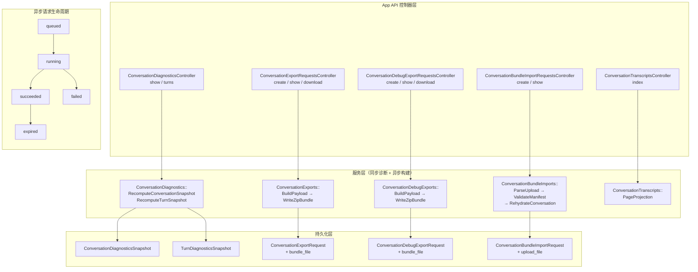
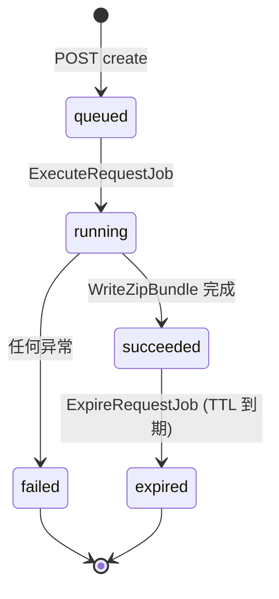
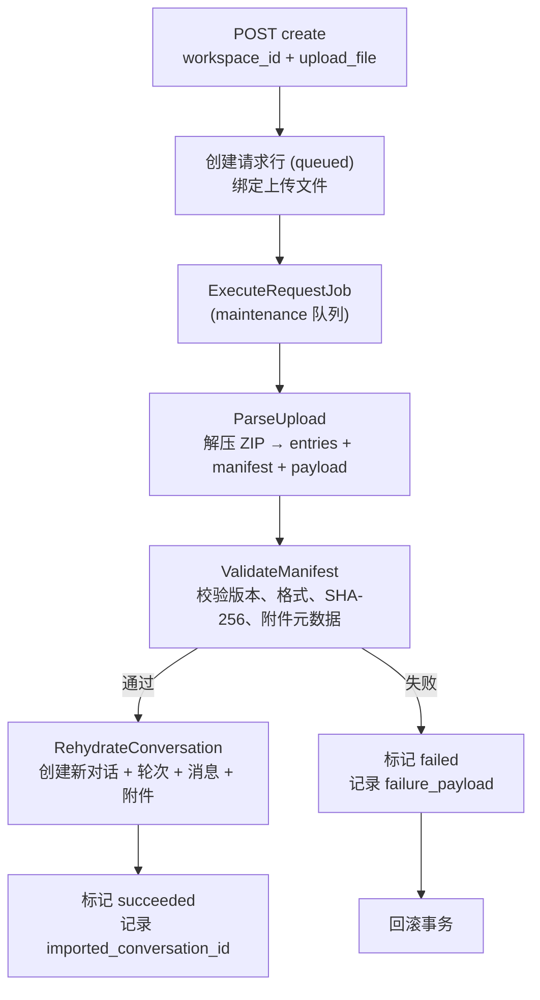

App API 是 Core Matrix 中面向产品层面的接口命名空间，承载数据导出、诊断分析和对话重水合三类核心能力。该命名空间在当前实现阶段复用了部署凭证认证（`ProgramAPI::BaseController` 的 `AgentSession` HTTP Token 机制），但通过独立控制器家族将产品级读写/导出表面与运行时资源 API 严格隔离，确保未来用户会话层出现时可以平滑过渡认证模型而不影响接口语义。

Sources: [base_controller.rb](https://github.com/jasl/cybros.new/blob/main/core_matrix/app/controllers/app_api/base_controller.rb#L1-L7), [base_controller.rb](https://github.com/jasl/cybros.new/blob/main/core_matrix/app/controllers/program_api/base_controller.rb#L1-L27)

## 架构全景：三大表面与数据流向

App API 暴露的三组接口遵循"**关注点分离先于抽象复用**"的设计原则——用户导出（`ConversationExportRequest`）、调试导出（`ConversationDebugExportRequest`）和捆绑导入（`ConversationBundleImportRequest`）各自拥有独立的请求模型、ActiveJob、状态机和捆绑格式，共享行为仅在实现层面提取，不进入产品契约。这一架构决策源自对"统一模式控制器"方案的明确拒绝：用户资产可移植性和内部运行时诊断是本质不同的产品意图，混合它们将导致授权错误、格式漂移和验证复杂度的累积。

Sources: [2026-04-02-conversation-export-import-and-debug-bundles-design.md](https://github.com/jasl/cybros.new/blob/main/docs/finished-plans/2026-04-02-conversation-export-import-and-debug-bundles-design.md#L212-L248)



Sources: [routes.rb](https://github.com/jasl/cybros.new/blob/main/core_matrix/config/routes.rb#L61-L80)

## 路由拓扑与认证边界

所有 App API 端点挂载在 `/app_api` 命名空间下，通过 `BaseController` 继承链复用 `ProgramAPI::BaseController` 的 HTTP Token 认证机制。每个请求通过 `Authorization: Bearer <token>` 头部携带 `AgentSession` 的明文凭证，控制器据此解析 `current_deployment`（即 `AgentProgramVersion`），并以此作为 `installation_id` 的安全边界——所有数据查询均被限定在当前部署所属的安装实例范围内。

Sources: [routes.rb](https://github.com/jasl/cybros.new/blob/main/core_matrix/config/routes.rb#L61-L80), [base_controller.rb](https://github.com/jasl/cybros.new/blob/main/core_matrix/app/controllers/program_api/base_controller.rb#L18-L27)

| HTTP 方法 | 路由 | 控制器动作 | 用途 |
|-----------|------|-----------|------|
| `GET` | `/app_api/conversation_diagnostics/show` | `show` | 获取对话级诊断快照 |
| `GET` | `/app_api/conversation_diagnostics/turns` | `turns` | 获取所有轮次诊断快照 |
| `POST` | `/app_api/conversation_export_requests` | `create` | 创建用户导出请求 |
| `GET` | `/app_api/conversation_export_requests/:id` | `show` | 查询导出请求状态 |
| `GET` | `/app_api/conversation_export_requests/:id/download` | `download` | 下载导出捆绑包 |
| `POST` | `/app_api/conversation_debug_export_requests` | `create` | 创建调试导出请求 |
| `GET` | `/app_api/conversation_debug_export_requests/:id` | `show` | 查询调试导出状态 |
| `GET` | `/app_api/conversation_debug_export_requests/:id/download` | `download` | 下载调试捆绑包 |
| `POST` | `/app_api/conversation_bundle_import_requests` | `create` | 创建捆绑导入请求 |
| `GET` | `/app_api/conversation_bundle_import_requests/:id` | `show` | 查询导入请求状态 |
| `GET` | `/app_api/conversation_transcripts` | `index` | 分页获取对话转录 |

Sources: [routes.rb](https://github.com/jasl/cybros.new/blob/main/core_matrix/config/routes.rb#L61-L80)

## 对话诊断：实时快照与聚合指标

对话诊断系统提供**按需重算**的分析能力——每次调用都会从权威运行时事实（`UsageEvent`、`WorkflowNode`、`ToolInvocation` 等）重新计算诊断快照并持久化到 `TurnDiagnosticsSnapshot` 和 `ConversationDiagnosticsSnapshot` 两张读模型表中。这种"先写后读"的设计意味着诊断端点始终返回最新鲜的聚合数据，但调用本身会触发计算开销。

### 轮次级诊断（Turn Diagnostics）

`RecomputeTurnSnapshot` 服务对一个轮次执行全方位指标聚合，数据源映射关系如下：

| 指标类别 | 数据源表 | 聚合逻辑 |
|---------|---------|---------|
| Token 使用量 / 成本 | `UsageEvent` | 按 `turn_id` 聚合 `input_tokens`、`output_tokens`、`estimated_cost` |
| 归属用户指标 | `UsageEvent`（where `user_id = workspace.user_id`） | 同上，但仅限工作区所有者用户 |
| Provider 轮次 | `UsageEvent`（where `operation_kind = text_generation`） | 计数 |
| 工具调用/失败 | `ToolInvocation`（via `WorkflowNode` 或 `AgentTaskRun`） | 按 `status` 分类计数 |
| 命令执行/失败 | `CommandRun` | 按 `lifecycle_state` 分类计数，含命令分类（test/build/preview） |
| 进程运行/失败 | `ProcessRun` | 按 `lifecycle_state` 分类计数 |
| 子代理会话 | `SubagentSession`（where `origin_turn_id`） | 计数 + `observed_status` 分布 |
| Steer/重试代理 | `AgentTaskRun`（`delivery_kind`） | `turn_resume` → resume，`step_retry/paused_retry` → retry |
| 输入/输出变体 | `Message`（where `slot`） | 按 `input`/`output` 计数 |

Sources: [recompute_turn_snapshot.rb](https://github.com/jasl/cybros.new/blob/main/core_matrix/app/services/conversation_diagnostics/recompute_turn_snapshot.rb#L35-L95)

轮次诊断的 `metadata` JSON 字段携带丰富的结构化细分数据：`provider_usage_breakdown` 按 `(provider_handle, model_ref, operation_kind)` 三元组分组并包含延迟统计（`avg_latency_ms`、`max_latency_ms`）；`tool_breakdown` 按工具名称分组并提供调用/失败计数；`command_classification_counts` 通过正则模式匹配将命令行分类为 `test`（如 `rspec`、`vitest`、`bin/rails test`）、`build`（如 `npm run build`、`tsc -b`）和 `preview` 三类；`cost_summary` 报告成本数据可用性和完整性状态。

Sources: [recompute_turn_snapshot.rb](https://github.com/jasl/cybros.new/blob/main/core_matrix/app/services/conversation_diagnostics/recompute_turn_snapshot.rb#L75-L94), [recompute_turn_snapshot.rb](https://github.com/jasl/cybros.new/blob/main/core_matrix/app/services/conversation_diagnostics/recompute_turn_snapshot.rb#L186-L224)

### 对话级诊断（Conversation Diagnostics）

`RecomputeConversationSnapshot` 通过对对话内所有轮次的 `TurnDiagnosticsSnapshot` 进行汇总来构建对话级快照。核心聚合策略是"轮次先行、逐层上卷"——先保证每个轮次快照是最新鲜的，再对其求和/求极值。对话级快照额外提供两个**异常值引用**：`most_expensive_turn`（按 `estimated_cost_total` 最大值）和 `most_rounds_turn`（按 `provider_round_count` 最大值），帮助审阅者快速定位成本热点和执行轮次最重的节点。

Sources: [recompute_conversation_snapshot.rb](https://github.com/jasl/cybros.new/blob/main/core_matrix/app/services/conversation_diagnostics/recompute_conversation_snapshot.rb#L11-L69)

`steer_count` 在对话级通过 `input_variant_count - turn_count` 计算（表示用户在已有轮次上额外发起的引导操作数），在轮次级通过 `input_variant_count - 1` 计算（减去首次输入本身）。`attributed_user_*` 字段始终指向工作区的归属用户，使得诊断可以在总消耗和归属用户消耗之间建立精确对比。

Sources: [conversation_diagnostics_controller.rb](https://github.com/jasl/cybros.new/blob/main/core_matrix/app/controllers/app_api/conversation_diagnostics_controller.rb#L62-L64), [conversation_diagnostics_controller.rb](https://github.com/jasl/cybros.new/blob/main/core_matrix/app/controllers/app_api/conversation_diagnostics_controller.rb#L100-L100)

### 诊断 API 端点

**`GET /app_api/conversation_diagnostics/show`** 返回对话级聚合快照，包含 `turn_count`、各状态轮次分布、token 总计、成本总计、工具/命令/进程计数、子代理会话数、异常值引用和完整 `metadata`。

**`GET /app_api/conversation_diagnostics/turns`** 返回按 `turns.sequence ASC` 排序的所有轮次诊断快照数组，每个条目包含该轮次的独立指标和 `metadata`。

两个端点在返回前都会调用 `RecomputeConversationSnapshot`，确保快照是最新的。所有外键引用（`conversation_id`、`turn_id`、`attributed_user_id` 等）均以 `public_id`（UUID v7）形式暴露，**绝不泄漏 bigint 内部键**——测试套件通过 `refute_includes` 显式断言了这一点。

Sources: [conversation_diagnostics_controller.rb](https://github.com/jasl/cybros.new/blob/main/core_matrix/app/controllers/app_api/conversation_diagnostics_controller.rb#L1-L107), [conversation_diagnostics_test.rb](https://github.com/jasl/cybros.new/blob/main/core_matrix/test/requests/app_api/conversation_diagnostics_test.rb#L4-L97)

## 对话导出：异步捆绑包生成与限时下载

用户导出将对话可视历史封装为**版本化的可移植 ZIP 捆绑包**，设计灵感同时借鉴了 RisuAI 的版本化资产包和 ChatGPT 的异步限时下载模式。导出请求的完整生命周期通过 `ActiveJob` 驱动，确保生成过程不阻塞 API 调用。

Sources: [2026-04-02-conversation-export-import-and-debug-bundles-design.md](https://github.com/jasl/cybros.new/blob/main/docs/finished-plans/2026-04-02-conversation-export-import-and-debug-bundles-design.md#L18-L53)

### 请求生命周期



`CreateRequest` 服务创建请求行后立即将 `ExecuteRequestJob` 入队（队列：`maintenance`），同时调度一个延迟执行到 `expires_at` 时刻的 `ExpireRequestJob`。默认 TTL 为 24 小时。`ExecuteRequest` 在事务中执行捆绑构建、Active Storage 附件绑定和状态更新的原子操作；任何异常都会将请求标记为 `failed` 并记录 `failure_payload`（包含 `error_class` 和 `message`）。

Sources: [create_request.rb](https://github.com/jasl/cybros.new/blob/main/core_matrix/app/services/conversation_exports/create_request.rb#L15-L33), [execute_request.rb](https://github.com/jasl/cybros.new/blob/main/core_matrix/app/services/conversation_exports/execute_request.rb#L11-L52), [expire_request_job.rb](https://github.com/jasl/cybros.new/blob/main/core_matrix/app/jobs/conversation_exports/expire_request_job.rb#L5-L17)

### ZIP 捆绑包内部结构

用户导出捆绑包遵循稳定的顶层布局，由 `manifest.json` 作为验证入口、`conversation.json` 作为导入唯一真相源：

```
conversation-export-<public_id>.zip
├── manifest.json           # 捆绑描述符 + SHA-256 校验和
├── conversation.json       # 结构化对话 + 消息 + 附件引用
├── transcript.md           # 人类可读 Markdown 转录
├── conversation.html       # 静态 HTML 渲染
└── files/
    └── <attachment_id>-<filename>  # 消息绑定文件
```

Sources: [write_zip_bundle.rb](https://github.com/jasl/cybros.new/blob/main/core_matrix/app/services/conversation_exports/write_zip_bundle.rb#L15-L51), [2026-04-02-conversation-export-import-and-debug-bundles-design.md](https://github.com/jasl/cybros.new/blob/main/docs/finished-plans/2026-04-02-conversation-export-import-and-debug-bundles-design.md#L250-L260)

**`manifest.json`** 记录 `bundle_kind: "conversation_export"`、`bundle_version: "2026-04-02"`、导出时间戳、消息/附件计数、每个附件的文件条目（含 `sha256` 校验和）以及三个顶层文件的 SHA-256 校验和。**`conversation.json`** 包含对话元数据（`public_id`、`kind`、`purpose`、`addressability`、`lifecycle_state`）和有序消息数组，每条消息携带 `role`、`slot`、`variant_index`、`content` 和附件引用（指向 `files/` 目录）。附件的 `sha256` 通过流式读取 16KB 块计算，确保大文件不会耗尽内存。

Sources: [build_manifest.rb](https://github.com/jasl/cybros.new/blob/main/core_matrix/app/services/conversation_exports/build_manifest.rb#L12-L28), [build_conversation_payload.rb](https://github.com/jasl/cybros.new/blob/main/core_matrix/app/services/conversation_exports/build_conversation_payload.rb#L16-L23), [build_conversation_payload.rb](https://github.com/jasl/cybros.new/blob/main/core_matrix/app/services/conversation_exports/build_conversation_payload.rb#L80-L95)

**导出边界**严格限定为消息级附件（`MessageAttachment`），排除工作区文件、瞬态运行时输出和工作流证明构件。转录源复用已有的 `Conversations::TranscriptProjection`，该投影处理可见性覆盖、继承转录和分支锚定逻辑——导出系统不发明第二套"可见历史"定义。

Sources: [build_conversation_payload.rb](https://github.com/jasl/cybros.new/blob/main/core_matrix/app/services/conversation_exports/build_conversation_payload.rb#L70-L72), [2026-04-02-conversation-export-import-and-debug-bundles-design.md](https://github.com/jasl/cybros.new/blob/main/docs/finished-plans/2026-04-02-conversation-export-import-and-debug-bundles-design.md#L97-L114)

### 下载与过期

`download` 端点检查四个条件后返回 `send_data`：附件已绑定（`bundle_file.attached?`）、`expires_at` 存在且未过期（`expires_at.future?`）、请求未被标记为 `expired`。任何条件不满足时返回 `410 Gone`。`show` 端点通过 `bundle_available` 布尔字段让客户端在尝试下载前判断可用性。过期 Job 通过 `bundle_file.purge` 清理 Active Storage 附件，但保留请求元数据行供审计追溯。

Sources: [conversation_export_requests_controller.rb](https://github.com/jasl/cybros.new/blob/main/core_matrix/app/controllers/app_api/conversation_export_requests_controller.rb#L27-L37), [conversation_export_requests_controller.rb](https://github.com/jasl/cybros.new/blob/main/core_matrix/app/controllers/app_api/conversation_export_requests_controller.rb#L66-L68)

## 调试导出：运行时诊断证据包

调试导出是**内部诊断表面**，与用户导出在格式、请求模型和导入路径上完全独立。它不生成人类可读的 Markdown 或 HTML，而是将整个对话的运行时状态序列化为独立的 JSON 文件，供内部审查和问题排查使用。

Sources: [2026-04-02-conversation-export-import-and-debug-bundles-design.md](https://github.com/jasl/cybros.new/blob/main/docs/finished-plans/2026-04-02-conversation-export-import-and-debug-bundles-design.md#L368-L384)

### 调试捆绑包结构

```
conversation-debug-export-<public_id>.zip
├── manifest.json               # 含 section_checksums 和 counts
├── conversation.json           # 复用用户导出的对话载荷
├── diagnostics.json            # 对话 + 轮次诊断快照
├── workflow_runs.json
├── workflow_nodes.json
├── workflow_node_events.json
├── agent_task_runs.json
├── tool_invocations.json
├── command_runs.json
├── process_runs.json
├── subagent_sessions.json
├── usage_events.json
└── files/...                   # 附件二进制
```

Sources: [write_zip_bundle.rb](https://github.com/jasl/cybros.new/blob/main/core_matrix/app/services/conversation_debug_exports/write_zip_bundle.rb#L15-L41)

`BuildPayload` 首先调用 `RecomputeConversationSnapshot` 确保诊断快照是最新的，然后按时间顺序（`created_at, id`）序列化 11 种运行时实体。每个序列化器将所有外键引用转换为 `public_id`，并包含完整的生命周期状态、载荷和时间戳。`ToolInvocation` 的序列化包含 `tool_name`、`request_payload`、`response_payload` 和 `error_payload`；`UsageEvent` 的序列化包含 `provider_handle`、`model_ref`、`operation_kind`、token 计数、成本和延迟。

Sources: [build_payload.rb](https://github.com/jasl/cybros.new/blob/main/core_matrix/app/services/conversation_debug_exports/build_payload.rb#L14-L38), [build_payload.rb](https://github.com/jasl/cybros.new/blob/main/core_matrix/app/services/conversation_debug_exports/build_payload.rb#L251-L271)

`BuildManifest` 为每个 section 文件计算 SHA-256 校验和，并提供详细的 `counts` 对象记录各类实体的数量——这使得消费者可以在不解析全部 JSON 的情况下快速评估调试包的内容规模。

Sources: [build_manifest.rb](https://github.com/jasl/cybros.new/blob/main/core_matrix/app/services/conversation_debug_exports/build_manifest.rb#L29-L58)

**关键隔离规则**：`ConversationBundleImportRequest` 只接受 `bundle_kind: "conversation_export"` 的用户捆绑包，**绝不能导入调试捆绑包**。这一约束在 `ValidateManifest` 中通过 `bundle_kind` 检查强制执行。

Sources: [validate_manifest.rb](https://github.com/jasl/cybros.new/blob/main/core_matrix/app/services/conversation_bundle_imports/validate_manifest.rb#L18-L19)

## 捆绑导入：验证、解析与对话重水合

导入系统将版本化的用户导出捆绑包还原为全新的对话记录。核心语义是"**始终创建新对话、绝不追加、原子性全有或全无**"——任何验证失败都会回滚整个导入事务。

Sources: [2026-04-02-conversation-export-import-and-debug-bundles-design.md](https://github.com/jasl/cybros.new/blob/main/docs/finished-plans/2026-04-02-conversation-export-import-and-debug-bundles-design.md#L335-L366)

### 导入流程



Sources: [execute_request.rb](https://github.com/jasl/cybros.new/blob/main/core_matrix/app/services/conversation_bundle_imports/execute_request.rb#L11-L49)

### 四阶段验证

`ValidateManifest` 执行严格的格式验证链，任何环节不通过都会抛出 `InvalidBundle` 异常并终止导入：

1.  **结构验证**：`manifest` 和 `conversation_payload` 必须是 Hash；`bundle_kind` 必须为 `"conversation_export"`；`bundle_version` 必须为 `"2026-04-02"`
2.  **一致性验证**：`conversation_payload` 的 `bundle_kind`/`bundle_version` 必须与 manifest 匹配；`conversation_public_id` 必须一致；消息计数和附件计数必须匹配
3.  **顶层校验和验证**：对 `conversation.json`、`transcript.md`、`conversation.html` 三个文件计算 SHA-256 并与 manifest 中的 `checksums` 比对
4.  **附件完整性验证**：manifest 中每个文件条目必须能在 `conversation_payload` 的附件中找到对应记录；七个元数据字段（`kind`、`message_public_id`、`filename`、`mime_type`、`byte_size`、`sha256`、`relative_path`）必须完全一致；`files/` 目录中必须存在对应的二进制数据且 SHA-256 匹配

Sources: [validate_manifest.rb](https://github.com/jasl/cybros.new/blob/main/core_matrix/app/services/conversation_bundle_imports/validate_manifest.rb#L15-L31), [validate_manifest.rb](https://github.com/jasl/cybros.new/blob/main/core_matrix/app/services/conversation_bundle_imports/validate_manifest.rb#L73-L85)

### 重水合过程

`RehydrateConversation` 在事务中执行对话重建，核心策略是"**保留原始时间戳和顺序，生成全新标识符**"：

1.  调用 `Conversations::CreateRoot` 在目标工作区下创建新对话
2.  按 `turn_public_id` 分组消息，按原始顺序创建轮次（`origin_kind: "system_internal"`、`source_ref_type: "ConversationBundleImportRequest"`）
3.  每个轮次创建 `UserMessage` 或 `AgentMessage`（根据 `role` 区分），保留原始 `content`、`variant_index` 和时间戳
4.  附件从 `file_bytes` 字典中读取二进制数据并通过 `StringIO` 绑定到新的 `MessageAttachment`
5.  附件来源引用（`origin_attachment`/`origin_message`）通过延迟解析映射表在所有实体创建完毕后统一关联

Sources: [rehydrate_conversation.rb](https://github.com/jasl/cybros.new/blob/main/core_matrix/app/services/conversation_bundle_imports/rehydrate_conversation.rb#L12-L22), [rehydrate_conversation.rb](https://github.com/jasl/cybros.new/blob/main/core_matrix/app/services/conversation_bundle_imports/rehydrate_conversation.rb#L55-L114)

导入请求模型 `ConversationBundleImportRequest` 的生命周期状态为 `queued → running → succeeded/failed`，不包含 `expired`——因为导入结果是持久化的对话记录，不存在限时下载的概念。

Sources: [conversation_bundle_import_request.rb](https://github.com/jasl/cybros.new/blob/main/core_matrix/app/models/conversation_bundle_import_request.rb#L4-L11)

## 模型验证约束与安全边界

所有请求模型均实施严格的安装边界验证，确保数据不会跨安装实例泄漏：

| 模型 | 关键验证约束 |
|------|------------|
| `ConversationExportRequest` | `workspace`、`conversation`、`user` 必须属于同一 `installation`；`conversation` 必须属于 `workspace`；`succeeded` 状态要求 `bundle_file` 已绑定 |
| `ConversationDebugExportRequest` | 同上，结构与用户导出请求一致 |
| `ConversationBundleImportRequest` | `workspace`、`user` 必须属于同一 `installation`；`imported_conversation`（如存在）必须属于同一 `installation` 和 `workspace`；要求 `upload_file` 已绑定 |
| `ConversationDiagnosticsSnapshot` | 安装边界匹配；异常值轮次必须属于同一对话 |
| `TurnDiagnosticsSnapshot` | 安装边界匹配；轮次必须属于同一对话 |

Sources: [conversation_export_request.rb](https://github.com/jasl/cybros.new/blob/main/core_matrix/app/models/conversation_export_request.rb#L21-L29), [conversation_bundle_import_request.rb](https://github.com/jasl/cybros.new/blob/main/core_matrix/app/models/conversation_bundle_import_request.rb#L20-L27), [conversation_diagnostics_snapshot.rb](https://github.com/jasl/cybros.new/blob/main/core_matrix/app/models/conversation_diagnostics_snapshot.rb#L7-L10)

所有控制器查找方法（`find_conversation!`、`find_workspace!`、`find_export_request!` 等）均通过 `public_id` + `installation_id` 双重条件定位记录，且对话查找额外限定 `deletion_state: "retained"`。使用 bigint 内部键作为查询参数的请求会收到 `404 Not Found` 响应——这是有意为之的标识符策略，确保外部边界绝不暴露内部实现细节。

Sources: [base_controller.rb](https://github.com/jasl/cybros.new/blob/main/core_matrix/app/controllers/program_api/base_controller.rb#L33-L49), [conversation_diagnostics_test.rb](https://github.com/jasl/cybros.new/blob/main/core_matrix/test/requests/app_api/conversation_diagnostics_test.rb#L78-L97)

## 对话转录：分页投影

`ConversationTranscriptsController` 提供基于游标的分页转录访问，复用 `ConversationTranscripts::PageProjection` 服务。该服务通过 `Conversations::TranscriptProjection` 获取完整可见消息列表后，在内存中执行游标定位和分页切割——默认页大小 50，上限 100。

Sources: [page_projection.rb](https://github.com/jasl/cybros.new/blob/main/core_matrix/app/projections/conversation_transcripts/page_projection.rb#L1-L48)

转录投影处理三种消息来源：继承的父对话消息（fork 分支使用完整父对话历史，branch 分支使用历史锚点截断）、当前对话自有轮次的选中输入/输出消息，以及基于 `ConversationMessageVisibility` 的可见性覆盖过滤。这一投影逻辑是导出系统 `BuildConversationPayload` 的底层数据源。

Sources: [transcript_projection.rb](https://github.com/jasl/cybros.new/blob/main/core_matrix/app/services/conversations/transcript_projection.rb#L15-L43)

## 标识符策略与外部边界

App API 严格遵循 [标识符策略：public_id 与 bigint 内部键的边界规则](https://github.com/jasl/cybros.new/blob/main/17-biao-shi-fu-ce-lue-public_id-yu-bigint-nei-bu-jian-de-bian-jie-gui-ze)：所有 API 请求参数和响应字段只使用 `public_id`（UUID v7），bigint 主键仅在内部关联和数据库查询中使用。请求模型通过 `HasPublicId` concern 自动生成 `public_id`；控制器通过 `find_by!(public_id: ..., installation_id: ...)` 模式查找记录。测试套件在每个端点的测试中都包含"拒绝 bigint 标识符"的显式断言。

Sources: [conversation_export_request.rb](https://github.com/jasl/cybros.new/blob/main/core_matrix/app/models/conversation_export_request.rb#L2-L2), [conversation_export_requests_test.rb](https://github.com/jasl/cybros.new/blob/main/core_matrix/test/requests/app_api/conversation_export_requests_test.rb#L90-L121)

## 与相关页面的关联

- 对话诊断数据来源于 [使用量计费、执行画像与审计日志](https://github.com/jasl/cybros.new/blob/main/15-shi-yong-liang-ji-fei-zhi-xing-hua-xiang-yu-shen-ji-ri-zhi) 中的 `UsageEvent` 权威数据源
- 导出的转录语义基于 [会话、轮次与对话树结构](https://github.com/jasl/cybros.new/blob/main/7-hui-hua-lun-ci-yu-dui-hua-shu-jie-gou) 中的消息投影和可见性模型
- 调试导出序列化的运行时实体来自 [工作流 DAG 执行引擎与调度器](https://github.com/jasl/cybros.new/blob/main/8-gong-zuo-liu-dag-zhi-xing-yin-qing-yu-diao-du-qi) 和 [Provider 执行循环](https://github.com/jasl/cybros.new/blob/main/9-provider-zhi-xing-xun-huan-lun-ci-qing-qiu-gong-ju-diao-yong-yu-jie-guo-chi-jiu-hua)
- 本页描述的接口与 [Program API：代理程序机器对机器接口](https://github.com/jasl/cybros.new/blob/main/24-program-api-dai-li-cheng-xu-ji-qi-dui-ji-qi-jie-kou) 和 [Execution API：运行时资源控制接口](https://github.com/jasl/cybros.new/blob/main/25-execution-api-yun-xing-shi-zi-yuan-kong-zhi-jie-kou) 共享认证基础设施但服务不同受众