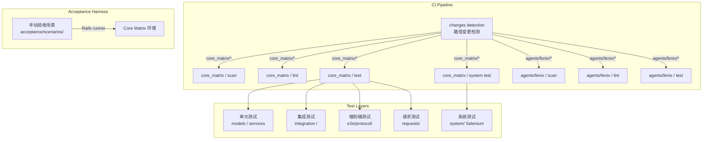
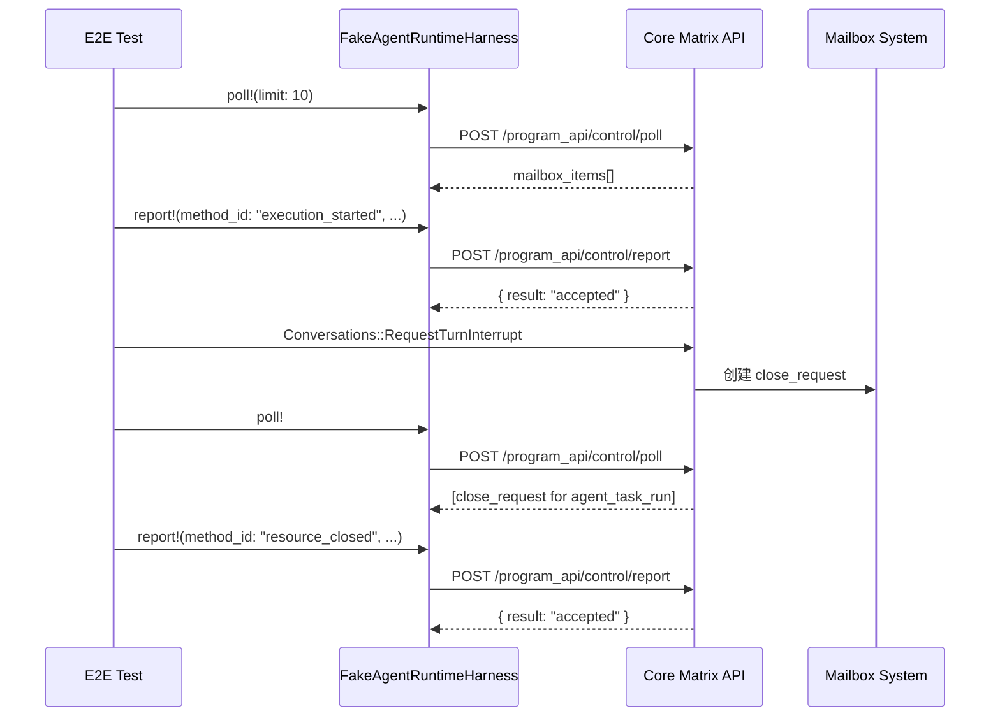

Cybros 的测试体系围绕两个独立的 Rails 应用——**Core Matrix**（平台内核）与 **Fenix**（代理程序）——构建了一套分层严谨、关注点明确的四层测试金字塔。整个体系从单元模型验证出发，经过集成流程测试和端到端协议验证，最终通过独立仓库级的验收场景（acceptance scenarios）实现全栈系统验证。测试框架统一采用 Rails 默认的 **Minitest**，所有测试并行执行，配合 SimpleCov 覆盖率收集。本文将逐一拆解每层测试的目录结构、核心模式与设计意图，帮助你理解「在哪里写什么测试」以及「各层测试如何协同保证系统正确性」。

## 测试金字塔总览

整个仓库的测试文件按关注点分布如下：

| 层级 | Core Matrix | Fenix | 验收层 | 核心关注点 |
|------|-------------|-------|--------|-----------|
| **单元测试** | 37 models + 201 services | 35 services | — | 单一模型/服务的逻辑正确性 |
| **集成测试** | 37 flows | 12 flows | — | 跨服务、跨模型的业务流程 |
| **端到端测试** | 5 protocol E2E | — | — | 跨系统的协议语义验证 |
| **请求测试** | 25 request tests | — | — | HTTP API 契约验证 |
| **验收场景** | — | — | 12 scenarios | 全栈真实运行时验证 |
| **支持模块** | 15 helpers | — | 3 libs | 测试基础设施与夹具构建器 |

Sources: [test directory](https://github.com/jasl/cybros.new/blob/main/core_matrix/test/) [fenix test directory](https://github.com/jasl/cybros.new/blob/main/agents/fenix/test/) [acceptance scenarios](https://github.com/jasl/cybros.new/blob/main/acceptance/scenarios/)

整体测试执行流程可通过以下架构图理解：



CI 流水线首先通过 `paths-ignore` 和变更检测矩阵决定触发哪些作业——每个子项目独立运行 scan（Brakeman + bundler-audit）、lint（RuboCop）和测试。Core Matrix 额外分离出系统测试作业以支持 Selenium/Chrome 环境配置。

Sources: [ci.yml](https://github.com/jasl/cybros.new/blob/main/.github/workflows/ci.yml#L1-L361)

## 测试基础设施：test_helper 与全局配置

### Core Matrix test_helper

Core Matrix 的 [test_helper.rb](https://github.com/jasl/cybros.new/blob/main/core_matrix/test/test_helper.rb#L1-L1229) 是整个测试套件的基石，它完成了以下关键配置：

**并行化与覆盖率**：测试按处理器核数并行执行，每个 worker 独立初始化 SimpleCov 状态。Coverage 数据在 fork 后清空并重启，避免父进程覆盖率表的污染。

**Provider Catalog 桩化**：默认情况下，所有测试自动替换 `ProviderCatalog::Load` 和 `ProviderCatalog::Registry` 为基于 [test/fixtures/files/llm_catalog.yml](https://github.com/jasl/cybros.new/blob/main/core_matrix/test/fixtures/files/llm_catalog.yml) 构建的测试目录。需要真实目录的测试可声明 `uses_real_provider_catalog` 跳过桩化。

**工厂方法体系**：test_helper 提供了约 40 个 `create_*!` 和 `build_*!` 方法作为轻量级测试工厂，覆盖从 `Installation`、`User` 到 `WorkflowRun`、`AgentControlMailboxItem` 的完整领域对象谱系。每个方法内部通过 `next_test_sequence` 生成唯一序列号，确保并行测试间不会冲突。

Sources: [test_helper.rb](https://github.com/jasl/cybros.new/blob/main/core_matrix/test/test_helper.rb#L1-L36) [simplecov_helper.rb](https://github.com/jasl/cybros.new/blob/main/core_matrix/test/simplecov_helper.rb#L1-L88) [llm_catalog.yml](https://github.com/jasl/cybros.new/blob/main/core_matrix/test/fixtures/files/llm_catalog.yml#L1-L200)

### Fenix test_helper

Fenix 的 [test_helper.rb](https://github.com/jasl/cybros.new/blob/main/agents/fenix/test/test_helper.rb#L1-L200) 采用了不同的隔离策略。核心设计是 **`RuntimeControlClientDouble`**——一个结构体替代真实的控制平面客户端，模拟了 `poll`、`report!`、`create_tool_invocation!`、`create_command_run!`、`create_process_run!` 等完整的 Program API 调用面。每个 setup 块重置工作区目录、代理路由注册表和控制平面客户端，teardown 块负责清理。

Fenix 测试通过 `shared_contract_fixture` 方法加载 [shared/fixtures/contracts/](https://github.com/jasl/cybros.new/blob/main/shared/fixtures/contracts/) 中的 JSON 文件，实现与 Core Matrix 之间的契约一致性验证。

Sources: [test_helper.rb](https://github.com/jasl/cybros.new/blob/main/agents/fenix/test/test_helper.rb#L1-L200)

### NonTransactionalConcurrencyTestCase

对于需要测试真实并发行为的场景（如租约竞争、行锁），系统提供了 [NonTransactionalConcurrencyTestCase](https://github.com/jasl/cybros.new/blob/main/core_matrix/test/support/non_transactional_concurrency_test_case.rb#L1-L9)。它关闭事务性测试，在每个 setup/teardown 周期通过 `truncate_all_tables!` 清理数据，确保并发测试在干净的数据库状态下运行。

Sources: [non_transactional_concurrency_test_case.rb](https://github.com/jasl/cybros.new/blob/main/core_matrix/test/support/non_transactional_concurrency_test_case.rb#L1-L9)

## 单元测试：模型与服务层

### 模型测试（70 个文件）

模型测试位于 `core_matrix/test/models/`，验证 ActiveRecord 模型的核心不变量：验证规则、关联关系、public_id 生成、状态机转换等。以 [conversation_test.rb](https://github.com/jasl/cybros.new/blob/main/core_matrix/test/models/conversation_test.rb#L1-L64) 为例，它验证了 `Conversation` 模型的 public_id 自动生成与查找能力，以及会话直接绑定 `AgentProgram` 而非 `AgentProgramVersion` 的设计约束。

模型测试的典型模式是直接使用 `create_*!` 工厂方法构建最小化的领域对象图，然后对特定属性或行为进行断言。`concerns/` 子目录专门测试 `HasPublicId` 等 concern 模块。

Sources: [conversation_test.rb](https://github.com/jasl/cybros.new/blob/main/core_matrix/test/models/conversation_test.rb#L1-L64)

### 服务测试（201 个文件）

服务测试是 Core Matrix 测试体系中**规模最大**的层级，覆盖了 `app/services/` 下完整的命令服务谱系。每个测试文件对应一个服务模块的一个或多个操作。以工作流执行为例：

- [provider_execution_test_support.rb](https://github.com/jasl/cybros.new/blob/main/core_matrix/test/support/provider_execution_test_support.rb#L1-L322) 提供了 `FakeChatCompletionsAdapter`、`FakeStreamingChatCompletionsAdapter`、`FakeQueuedChatCompletionsAdapter`、`FakeResponsesAdapter` 等适配器替身，让服务测试可以精确控制 LLM 调用的返回值。
- [provider_backed_turn_execution_test.rb](https://github.com/jasl/cybros.new/blob/main/core_matrix/test/integration/provider_backed_turn_execution_test.rb#L1-L106) 虽然位于 integration 目录，但其内部使用的 `FakeChatCompletionsAdapter` 同样源自服务层测试模式——通过注入假适配器来测试完整的轮次执行链路。

服务测试的组织遵循领域边界：`conversations/`、`workflows/`、`turns/`、`agent_program_versions/`、`provider_execution/`、`human_interactions/` 等目录直接映射限界上下文。

Sources: [provider_execution_test_support.rb](https://github.com/jasl/cybros.new/blob/main/core_matrix/test/support/provider_execution_test_support.rb#L1-L322) [provider_backed_turn_execution_test.rb](https://github.com/jasl/cybros.new/blob/main/core_matrix/test/integration/provider_backed_turn_execution_test.rb#L1-L106)

### Fenix 服务测试（35 个文件）

Fenix 的服务测试位于 `agents/fenix/test/services/fenix/`，覆盖了运行时的各个子系统：`runtime/`（控制循环、邮箱工作器、轮次准备）、`skills/`（技能加载与安装）、`plugins/`（插件注册表）、`processes/`（进程管理与代理注册）、`workspace/`（工作区引导）、`web/`（网页抓取与搜索）、`browser/`（浏览器会话管理）、`hooks/`（执行钩子）、`operator/`（算子目录与快照）、`prompts/`（提示词组装）。

Sources: [fenix services test directory](https://github.com/jasl/cybros.new/blob/main/agents/fenix/test/services/fenix/)

## 集成测试：跨服务的业务流程

集成测试位于 `core_matrix/test/integration/`（37 个文件），验证**跨多个服务和模型的端到端业务流程**。与 E2E 测试的区别在于：集成测试仍然在 Rails 进程内运行，不涉及真实的 HTTP 网络调用（除非使用 FakeAdapter）。

核心集成测试场景包括：

| 测试文件 | 验证场景 |
|----------|---------|
| `agent_registration_contract_test` | 代理注册契约流程 |
| `provider_backed_turn_execution_test` | Provider 驱动的轮次执行完整链路 |
| `streamable_http_mcp_flow_test` | MCP Streamable HTTP 工具调用流程 |
| `workflow_scheduler_flow_test` | 工作流 DAG 调度器流转 |
| `human_interaction_flow_test` | 人类交互请求全生命周期 |
| `conversation_lineage_store_branch_flow_test` | 对话世系存储与分支流转 |
| `agent_recovery_flow_test` | 代理故障恢复流程 |

以 [streamable_http_mcp_flow_test.rb](https://github.com/jasl/cybros.new/blob/main/core_matrix/test/integration/streamable_http_mcp_flow_test.rb#L1-L43) 为例，它启动一个真实的 `FakeStreamableHttpMcpServer`（TCP 服务器），验证工具绑定模型在会话丢失后能自动恢复，且整个调用过程正确记录 tool invocation 状态变迁。

Sources: [streamable_http_mcp_flow_test.rb](https://github.com/jasl/cybros.new/blob/main/core_matrix/test/integration/streamable_http_mcp_flow_test.rb#L1-L43) [integration directory](https://github.com/jasl/cybros.new/blob/main/core_matrix/test/integration/)

Fenix 的集成测试（12 个文件）则验证代理程序内部的子系统协作：`runtime_flow_test` 验证邮箱工作器的完整执行循环，`skills_flow_test` 验证技能安装与调用，`browser_tools_flow_test`、`web_tools_flow_test`、`process_tools_flow_test`、`workspace_flow_test` 分别验证各类工具的端到端执行。

Sources: [runtime_flow_test.rb](https://github.com/jasl/cybros.new/blob/main/agents/fenix/test/integration/runtime_flow_test.rb#L1-L200)

## 端到端测试：协议语义验证

端到端测试位于 `core_matrix/test/e2e/protocol/`（5 个文件），是测试金字塔中**最高层的自动化测试**。它们通过 `FakeAgentRuntimeHarness` 模拟真实的代理程序行为，验证 Core Matrix 与代理程序之间的协议语义。



五个协议测试覆盖的关键语义：

- **[conversation_close_e2e_test.rb](https://github.com/jasl/cybros.new/blob/main/core_matrix/test/e2e/protocol/conversation_close_e2e_test.rb#L1-L262)**：验证轮次中断只清理主线工作而保留后台服务；强制归档在残留资源降级关闭后完成；删除操作的分阶段状态机转换。
- **[mailbox_delivery_e2e_test.rb](https://github.com/jasl/cybros.new/blob/main/core_matrix/test/e2e/protocol/mailbox_delivery_e2e_test.rb#L1-L220)**：验证轮询投递、WebSocket 推送与轮询降级的信封一致性、重复报告的幂等性。
- **[retry_semantics_e2e_test.rb](https://github.com/jasl/cybros.new/blob/main/core_matrix/test/e2e/protocol/retry_semantics_e2e_test.rb#L1-L172)**：验证可重试失败进入 `retryable_failure` 状态、步骤重试创建新尝试、轮次中断正确隔离排队中的重试工作。
- **[process_close_escalation_e2e_test.rb**：验证进程关闭的升级语义。
- **[turn_interrupt_e2e_test.rb**：验证轮次中断的竞态条件处理。

`FakeAgentRuntimeHarness` 是 E2E 测试的核心工具类。它封装了 Program API 和 Execution API 的 HTTP 调用（通过 `post_and_parse`），同时支持 WebSocket 连接管理（通过 `AgentControl::RealtimeLinks`），让测试代码可以用自然的方式模拟代理程序的完整交互序列。

Sources: [conversation_close_e2e_test.rb](https://github.com/jasl/cybros.new/blob/main/core_matrix/test/e2e/protocol/conversation_close_e2e_test.rb#L1-L62) [mailbox_delivery_e2e_test.rb](https://github.com/jasl/cybros.new/blob/main/core_matrix/test/e2e/protocol/mailbox_delivery_e2e_test.rb#L1-L134) [retry_semantics_e2e_test.rb](https://github.com/jasl/cybros.new/blob/main/core_matrix/test/e2e/protocol/retry_semantics_e2e_test.rb#L1-L172) [fake_agent_runtime_harness.rb](https://github.com/jasl/cybros.new/blob/main/core_matrix/test/support/fake_agent_runtime_harness.rb#L1-L119)

## 请求测试：HTTP API 契约验证

请求测试位于 `core_matrix/test/requests/`（25 个文件），按 API 接口面组织为三个子目录：

| 子目录 | 覆盖范围 |
|--------|---------|
| `program_api/` | 代理程序机器对机器接口（注册、心跳、能力握手、控制轮询、工具调用、进程运行等） |
| `execution_api/` | 执行运行时资源控制接口（附件、控制轮询） |
| `app_api/` | 应用层接口（对话诊断、导出、导入、转录） |
| `mock_llm/` | 开发用 Mock LLM 端点验证 |

请求测试继承 `ActionDispatch::IntegrationTest`，通过 `program_api_headers`、`execution_api_headers` 等辅助方法注入机器凭证，验证 HTTP 状态码、响应结构和错误语义。

Sources: [requests directory](https://github.com/jasl/cybros.new/blob/main/core_matrix/test/requests/)

## 其他测试层级

### 投影与查询测试

- **投影测试**（3 个文件）：验证读侧投影的正确性——对话转录分页投影、发布实时投影、工作流可视化投影。
- **查询测试**（16 个文件）：验证 CQRS 读侧查询对象——工作流导出查询、使用量窗口查询、世系存储查询、工作区变量查询等。
- **解析器测试**（1 个文件）：验证对话变量可见性解析逻辑。

Sources: [projections directory](https://github.com/jasl/cybros.new/blob/main/core_matrix/test/projections/) [queries directory](https://github.com/jasl/cybros.new/blob/main/core_matrix/test/queries/) [resolvers directory](https://github.com/jasl/cybros.new/blob/main/core_matrix/test/resolvers/)

### Job 测试

Job 测试（7 个文件）覆盖 Solid Queue 后台任务的执行逻辑：工作流节点执行、阻塞步骤恢复、对话导出/过期、对话调试导出、对话包导入。

Sources: [jobs directory](https://github.com/jasl/cybros.new/blob/main/core_matrix/test/jobs/)

### 系统测试

系统测试通过 [ApplicationSystemTestCase](https://github.com/jasl/cybros.new/blob/main/core_matrix/test/application_system_test_case.rb#L1-L15) 配置，支持远程 Selenium（Docker 环境）或本地 headless Chrome 两种模式。CI 中作为独立作业运行，失败时自动上传截图。

Sources: [application_system_test_case.rb](https://github.com/jasl/cybros.new/blob/main/core_matrix/test/application_system_test_case.rb#L1-L15) [ci.yml system test job](https://github.com/jasl/cybros.new/blob/main/.github/workflows/ci.yml#L284-L336)

## 测试支持模块：共享基础设施

`core_matrix/test/support/` 下的 15 个支持模块是测试体系的基础设施层：

| 支持模块 | 职责 |
|---------|------|
| `concurrent_allocation_helpers.rb` | 并行线程执行、表截断、结果断言 |
| `fake_agent_runtime_harness.rb` | E2E 测试的代理运行时模拟器 |
| `fake_streamable_http_mcp_server.rb` | 真实 TCP 级别的 MCP 服务器替身 |
| `mailbox_scenario_builder.rb` | 邮箱场景构建器（执行分配、关闭请求、程序请求） |
| `provider_execution_test_support.rb` | LLM 适配器替身和 Mock 目录构建 |
| `mcp_test_support.rb` | MCP 工具目录和上下文构建 |
| `tool_governance_test_support.rb` | 工具治理目录和上下文构建 |
| `controllable_clock.rb` | 可控时间推进 |
| `non_transactional_concurrency_test_case.rb` | 非事务性并发测试基类 |
| `environment_overrides.rb` | 环境变量临时覆盖 |
| `seed_script_runner.rb` | 种子脚本执行 |
| `append_only_test_namespace.rb` | 追加分配测试命名空间 |
| `agent_program_version_recovery_test_support.rb` | 代理版本恢复测试支持 |
| `workflow_proof_export_test_support.rb` | 工作流证明导出测试支持 |
| `workflow_wait_transition_test_support.rb` | 工作流等待状态转换测试支持 |

[ConcurrentAllocationHelpers](https://github.com/jasl/cybros.new/blob/main/core_matrix/test/support/concurrent_allocation_helpers.rb#L1-L89) 提供了 `run_in_parallel` 和 `run_parallel_operations` 方法，使用线程 + Queue 屏障模式实现真正的并行数据库操作，配合超时和线程清理保证测试稳定性。

Sources: [concurrent_allocation_helpers.rb](https://github.com/jasl/cybros.new/blob/main/core_matrix/test/support/concurrent_allocation_helpers.rb#L1-L89) [mailbox_scenario_builder.rb](https://github.com/jasl/cybros.new/blob/main/core_matrix/test/support/mailbox_scenario_builder.rb#L1-L57) [fake_streamable_http_mcp_server.rb](https://github.com/jasl/cybros.new/blob/main/core_matrix/test/support/fake_streamable_http_mcp_server.rb#L1-L200)

## 契约测试：Core Matrix 与 Fenix 的接口保证

Core Matrix 与 Fenix 之间的接口契约通过 [shared/fixtures/contracts/](https://github.com/jasl/cybros.new/blob/main/shared/fixtures/contracts/) 中的 JSON 文件保证。这些文件冻结了邮箱消息的精确结构：

| 契约文件 | 用途 |
|---------|------|
| `core_matrix_fenix_execution_assignment.json` | Core Matrix 发出的执行分配消息 |
| `core_matrix_fenix_prepare_round_mailbox_item.json` | Core Matrix 发出的轮次准备消息 |
| `core_matrix_fenix_execute_program_tool_mailbox_item.json` | Core Matrix 发出的程序工具执行消息 |
| `fenix_prepare_round_report.json` | Fenix 返回的轮次准备报告 |
| `fenix_execute_program_tool_report.json` | Fenix 返回的程序工具执行报告 |

Fenix 侧的 [runtime_program_contract_test.rb](https://github.com/jasl/cybros.new/blob/main/agents/fenix/test/integration/runtime_program_contract_test.rb#L1-L77) 加载这些契约文件，验证 Fenix 的 `MailboxWorker` 处理冻结消息后产生的报告结构与预期一致。这种「共享契约 fixture + 双侧验证」的模式确保了两个独立应用之间的 API 兼容性。

Sources: [runtime_program_contract_test.rb](https://github.com/jasl/cybros.new/blob/main/agents/fenix/test/integration/runtime_program_contract_test.rb#L1-L77) [agent_api_coverage_contract_test.rb](https://github.com/jasl/cybros.new/blob/main/agents/fenix/test/integration/agent_api_coverage_contract_test.rb#L1-L43)

## 验收测试：全栈系统验证

验收测试位于 `acceptance/` 目录，是整个测试体系的**最高层**。与自动化测试不同，验收场景需要完整的运行时栈（Core Matrix + Fenix + 数据库 + 可能的 LLM Provider），在真实或近乎真实的环境中验证端到端行为。

### 目录结构

```
acceptance/
├── bin/          # Shell 编排脚本（fresh_start_stack.sh 等）
├── lib/          # 支持代码（boot.rb、governed_validation_support.rb）
└── scenarios/    # 12 个验收场景
```

### 关键场景

| 场景文件 | 验证内容 |
|---------|---------|
| `provider_backed_turn_validation.rb` | Provider 驱动的真实轮次执行（需要真实 LLM API） |
| `governed_tool_validation.rb` | 工具治理下的子代理生成与调用 |
| `governed_mcp_validation.rb` | MCP Streamable HTTP 端到端验证 |
| `fenix_skills_validation.rb` | Fenix 技能安装与执行 |
| `human_interaction_wait_resume_validation.rb` | 人类交互的等待与恢复 |
| `subagent_wait_all_validation.rb` | 子代理并发等待语义 |
| `process_run_close_validation.rb` | 进程运行关闭与资源回收 |
| `external_fenix_validation.rb` | 外部 Fenix 配对验证 |
| `fenix_capstone_app_api_roundtrip_validation.rb` | App API 全链路往返验证 |

### 执行模式

验收场景通过 Core Matrix 的 Rails runner 执行：`cd core_matrix && bin/rails runner ../acceptance/scenarios/<scenario>.rb`。每个场景自行引导安装、注册运行时、创建对话并执行工作流，最终通过 `ManualAcceptanceSupport.write_json` 输出结构化的验证结果，包含预期的 DAG 形状、对话状态和观测值的对比。

Sources: [acceptance README](https://github.com/jasl/cybros.new/blob/main/acceptance/README.md#L1-L30) [governed_tool_validation.rb](https://github.com/jasl/cybros.new/blob/main/acceptance/scenarios/governed_tool_validation.rb#L1-L107) [provider_backed_turn_validation.rb](https://github.com/jasl/cybros.new/blob/main/acceptance/scenarios/provider_backed_turn_validation.rb#L1-L77) [governed_validation_support.rb](https://github.com/jasl/cybros.new/blob/main/acceptance/lib/governed_validation_support.rb#L1-L241)

## 测试设计原则与模式总结

通过对整个测试体系的考古分析，可以提炼出以下设计原则：

**1. 层次化隔离**：单元测试使用事务回滚、集成测试使用 FakeAdapter、E2E 测试使用 `FakeAgentRuntimeHarness`、验收测试使用完整栈——每一层都有明确的环境隔离边界。

**2. Provider Catalog 全局桩化**：通过在 `ActiveSupport::TestCase#run` 中拦截测试执行并注入测试目录，绝大多数测试不需要关心 LLM Provider 配置，只有显式声明 `uses_real_provider_catalog` 的测试才使用真实配置。

**3. 工厂方法优于 Fixture YAML**：除了 `llm_catalog.yml` 外，系统几乎不使用传统的 YAML fixture。所有测试数据通过 `create_*!` 工厂方法按需构建，每个工厂内部使用 `next_test_sequence` 保证唯一性。

**4. 并发安全的测试基类**：`NonTransactionalConcurrencyTestCase` 提供了绕过事务隔离的并发测试能力，配合 `ConcurrentAllocationHelpers` 的线程屏障模式，可以安全地测试租约竞争、行锁争用等真实并发场景。

**5. 跨应用契约冻结**：通过 `shared/fixtures/contracts/` 中的 JSON 文件，Core Matrix 和 Fenix 的接口兼容性在双侧同时验证——Core Matrix 的集成测试生成这些结构，Fenix 的契约测试消费这些结构。

**6. 场景构建器模式**：`MailboxScenarioBuilder`、`GovernedValidationSupport`、`ToolGovernanceTestSupport` 等模块封装了常见的测试场景搭建逻辑，让测试代码专注于断言而非数据准备。

Sources: [test_helper.rb](https://github.com/jasl/cybros.new/blob/main/core_matrix/test/test_helper.rb#L30-L36) [non_transactional_concurrency_test_case.rb](https://github.com/jasl/cybros.new/blob/main/core_matrix/test/support/non_transactional_concurrency_test_case.rb#L1-L9) [concurrent_allocation_helpers.rb](https://github.com/jasl/cybros.new/blob/main/core_matrix/test/support/concurrent_allocation_helpers.rb#L1-L89)

## 延伸阅读

- 了解验收测试的具体场景与手动验证清单，参见 [验收测试场景与手动验证清单](https://github.com/jasl/cybros.new/blob/main/28-yan-shou-ce-shi-chang-jing-yu-shou-dong-yan-zheng-qing-dan)
- 了解 CI 流水线如何编排这些测试层级，参见 [CI 流水线与代码质量工具链](https://github.com/jasl/cybros.new/blob/main/29-ci-liu-shui-xian-yu-dai-ma-zhi-liang-gong-ju-lian)
- 了解代理控制协议的邮箱投递机制（E2E 测试的核心验证对象），参见 [邮箱控制平面：消息投递、租赁与实时推送](https://github.com/jasl/cybros.new/blob/main/10-you-xiang-kong-zhi-ping-mian-xiao-xi-tou-di-zu-ren-yu-shi-shi-tui-song)
- 了解 Provider 执行循环的完整流程（集成测试的重点覆盖区域），参见 [Provider 执行循环：轮次请求、工具调用与结果持久化](https://github.com/jasl/cybros.new/blob/main/9-provider-zhi-xing-xun-huan-lun-ci-qing-qiu-gong-ju-diao-yong-yu-jie-guo-chi-jiu-hua)