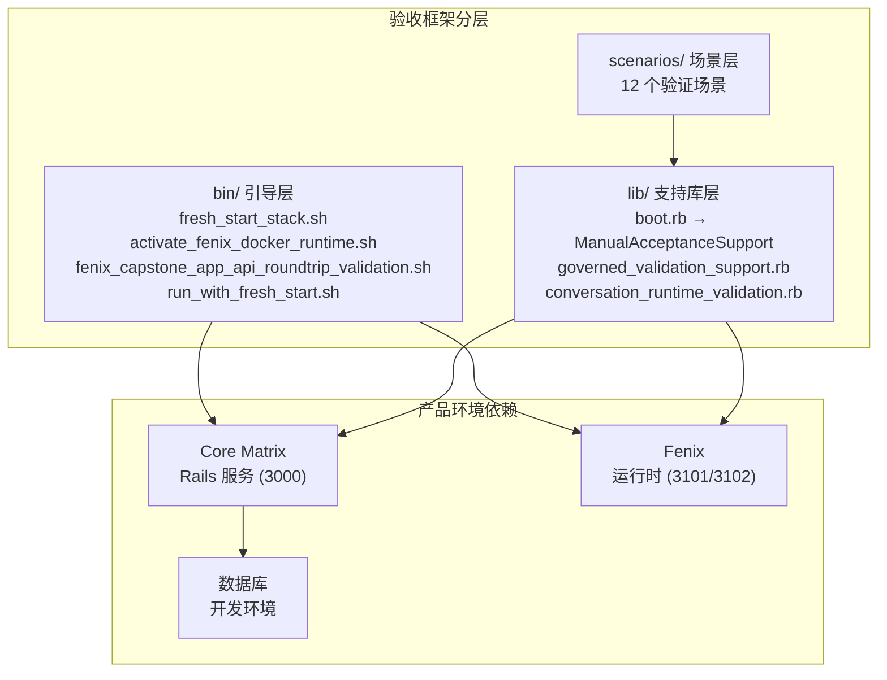
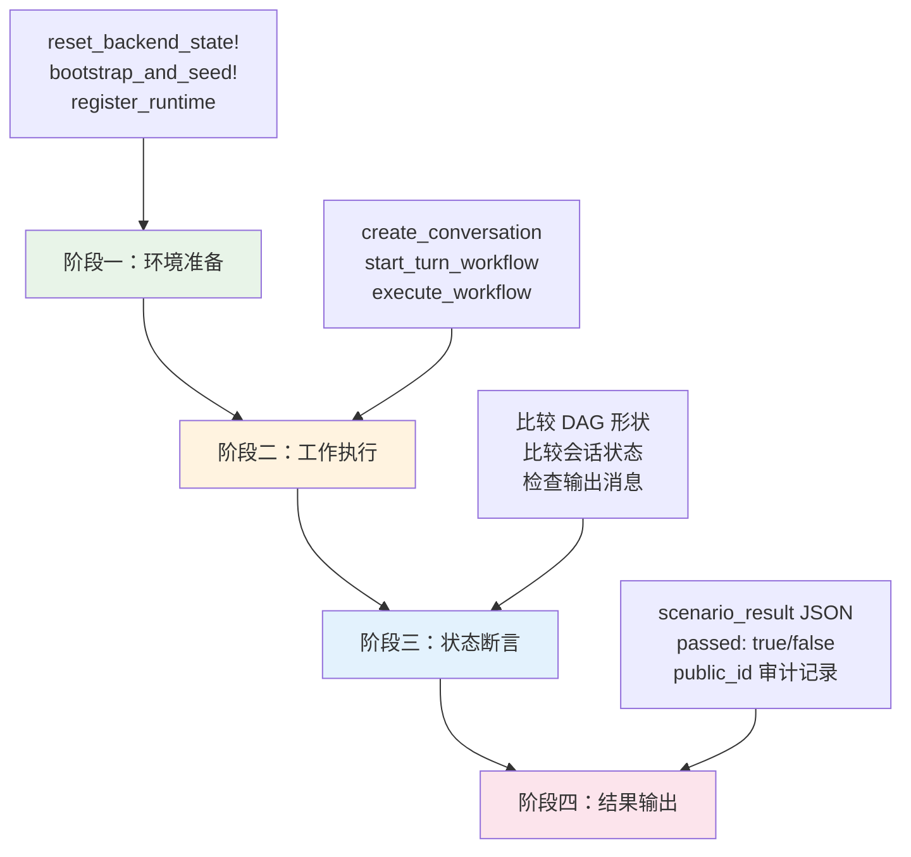
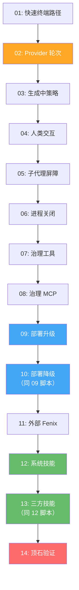

Cybros 的验收测试体系是一套**面向产品行为的端到端验证框架**，它从底层基础设施引导、经过代理控制平面协议交互、一直到最终人工产品验证，构成了完整的验收置信度链条。与自动化单元测试和集成测试不同，验收场景的核心目标是**证明系统作为整体在真实运行时环境中的行为符合产品契约**——不仅仅是"代码可以编译"或"单元覆盖通过"，而是"真实用户通过真实对话创建的真实应用，可以被真实人类操作和验证"。

这套体系的架构设计遵循一个关键原则：**Core Matrix 和 Fenix 作为独立产品代码库保持正交性**。顶层 `acceptance/` 目录专门容纳验收自动化代码，确保两个子产品不会互相污染验收逻辑。所有场景脚本都通过 Core Matrix 的 Rails 环境执行，Fenix 则作为外部或捆绑运行时实例独立运行。

Sources: [README.md](https://github.com/jasl/cybros.new/blob/main/acceptance/README.md#L1-L30), [2026-03-24-core-matrix-kernel-manual-validation.md](https://github.com/jasl/cybros.new/blob/main/docs/checklists/2026-03-24-core-matrix-kernel-manual-validation.md#L1-L52)

## 验收框架架构

验收测试框架由三层核心组件构成：基础设施引导层、支持库层和场景层。引导层（`bin/`）负责编排全新环境启动；支持库层（`lib/`）提供 HTTP 客户端、状态断言和运行时注册等可复用原语；场景层（`scenarios/`）实现具体的验收逻辑。



每个场景脚本遵循**统一的执行模式**：重置后端状态 → 引导种子数据 → 注册运行时 → 创建会话和轮次 → 执行工作流 → 比较期望与观察状态 → 输出 JSON 结果。这种模式确保了验收结果的可重复性和可审计性。

Sources: [boot.rb](https://github.com/jasl/cybros.new/blob/main/acceptance/lib/boot.rb#L1-L20), [manual_acceptance_support.rb](https://github.com/jasl/cybros.new/blob/main/core_matrix/script/manual/manual_acceptance_support.rb#L68-L90)

## ManualAcceptanceSupport 核心支持库

`ManualAcceptanceSupport` 模块是验收场景的**中央工具箱**，它承载了从数据库重置到 HTTP 请求、从工作流创建到状态轮询的全部基础设施。该模块以 Ruby `module_function` 方式组织，所有方法均为模块级函数，场景脚本可以直接顶层调用。

**状态重置机制**是验收场景可重复性的基石。`reset_backend_state!` 方法按照外键依赖顺序删除所有模型数据，从最外层的诊断快照一直到最内层的安装记录，确保每次验收运行从完全干净的状态开始。`RESET_MODELS` 常量列出了完整的 66 个模型清理序列。

Sources: [manual_acceptance_support.rb](https://github.com/jasl/cybros.new/blob/main/core_matrix/script/manual/manual_acceptance_support.rb#L14-L74)

**HTTP 客户端封装**提供了对 Core Matrix Program API、Execution API 和 App API 的统一访问。核心方法包括：

| 方法 | 用途 | 目标 API |
|------|------|----------|
| `http_get_json` | GET 请求并解析 JSON | 通用 |
| `http_post_json` | POST 请求发送 JSON 载荷 | 通用 |
| `http_post_multipart_json` | 多部分表单上传（导入包） | App API |
| `app_api_get_json` | 带 Token 认证的 GET | App API |
| `app_api_post_json` | 带 Token 认证的 POST | App API |
| `app_api_download!` | 下载文件到本地路径 | App API |
| `app_api_export_conversation!` | 完整导出流程（创建→等待→下载） | App API |

Sources: [manual_acceptance_support.rb](https://github.com/jasl/cybros.new/blob/main/core_matrix/script/manual/manual_acceptance_support.rb#L102-L200)

**运行时注册与代理任务执行**方法是验收场景中最复杂的部分，它们封装了注册捆绑/外部运行时、启动工作流、执行 Fenix 邮箱泵以及等待任务终端状态等操作。关键方法包括：

- `register_bundled_runtime_from_manifest!` — 从运行时清单注册捆绑代理程序
- `register_external_runtime!` — 通过注册令牌注册外部代理程序
- `run_fenix_mailbox_task!` — 完整的邮箱任务生命周期（创建会话→启动轮次→邮箱泵→等待完成）
- `execute_provider_workflow!` — 执行 Provider 支持的工作流
- `with_fenix_control_worker!` — 在持久控制工作器环境下执行代码块

Sources: [manual_acceptance_support.rb](https://github.com/jasl/cybros.new/blob/main/core_matrix/script/manual/manual_acceptance_support.rb#L580-L781)

## GovernedValidationSupport 治理验证支持

`GovernedValidationSupport` 模块为**工具治理和 MCP 验证场景**提供专门的支持。与 `ManualAcceptanceSupport` 的通用 HTTP 和运行时编排不同，这个模块专注于创建带有工具绑定和调用记录的完整任务上下文。

其 `bootstrap_runtime!` 方法一步完成安装引导、运行时注册、用户绑定启用和 Provider 配额创建。`create_task_context!` 方法则构建了从会话到代理任务运行的完整执行上下文，包括工作流 DAG 的根节点和业务节点、以及可绑定工具的代理任务运行记录。

Sources: [governed_validation_support.rb](https://github.com/jasl/cybros.new/blob/main/acceptance/lib/governed_validation_support.rb#L1-L112)

## 14 个验收场景总览

验收场景按照**依赖复杂度递增**的顺序排列，从不需要真实 Provider 的确定性工具路径一直到需要完整 Docker 环境和真实 LLM 调用的顶石验证。下表列出了全部 14 个场景及其核心验证目标：

| 序号 | 场景名称 | 验证目标 | 需要 Provider | 需要 Docker |
|------|---------|---------|:-------------:|:-----------:|
| 01 | `bundled_fast_terminal_validation` | 捆绑运行时快速终端路径 | ✗ | ✗ |
| 02 | `provider_backed_turn_validation` | 真实 Provider 支持的轮次执行 | ✓ | ✗ |
| 03 | `during_generation_steering_validation` | 生成中的拒绝/重启/排队策略 | ✗ | ✗ |
| 04 | `human_interaction_wait_resume_validation` | 人类交互等待与恢复 | ✗ | ✗ |
| 05 | `subagent_wait_all_validation` | 子代理并行生成与屏障等待 | ✗ | ✗ |
| 06 | `process_run_close_validation` | 进程运行启动与优雅关闭 | ✗ | ✗ |
| 07 | `governed_tool_validation` | 治理工具调用完整流程 | ✗ | ✗ |
| 08 | `governed_mcp_validation` | Streamable HTTP MCP 调用与恢复 | ✗ | ✗ |
| 09 | `bundled_rotation_validation` | 部署轮转升级 | ✗ | ✗ |
| 10 | `bundled_rotation_validation`（降级） | 部署轮转降级 | ✗ | ✗ |
| 11 | `external_fenix_validation` | 独立外部 Fenix 配对验证 | ✗ | ✗ |
| 12 | `fenix_skills_validation`（系统技能） | 内置系统技能部署流程 | ✗ | ✗ |
| 13 | `fenix_skills_validation`（三方技能） | 第三方技能安装与激活 | ✗ | ✗ |
| 14 | `fenix_capstone_app_api_roundtrip` | 完整顶石 App API 往返验证 | ✓ | ✓ |

Sources: [2026-03-24-core-matrix-kernel-manual-validation.md](https://github.com/jasl/cybros.new/blob/main/docs/checklists/2026-03-24-core-matrix-kernel-manual-validation.md#L54-L101)

## 场景执行模式与结果验证

每个验收场景遵循**统一的四阶段执行模式**，这套模式保证了验收结果的结构化和可比较性：



**结果验证的核心是两个比较维度**：DAG 形状（`expected_dag_shape` vs `observed_dag_shape`）和会话状态（`expected_conversation_state` vs `observed_conversation_state`）。DAG 形状是工作流节点键名的有序数组，如 `["agent_turn_step"]` 或 `["turn_step"]`；会话状态是包含会话生命周期、工作流等待状态和轮次状态的结构化哈希。

`scenario_result` 辅助方法封装了比较逻辑：

```ruby
# 核心比较逻辑
{
  "passed" => expected_dag_shape == observed_dag_shape &&
    expected_conversation_state.all { |key, value| observed_conversation_state[key] == value },
  "expected_dag_shape" => expected_dag_shape,
  "observed_dag_shape" => observed_dag_shape,
  "expected_conversation_state" => expected_conversation_state,
  "observed_conversation_state" => observed_conversation_state,
}.merge(extra)
```

Sources: [manual_acceptance_support.rb](https://github.com/jasl/cybros.new/blob/main/core_matrix/script/manual/manual_acceptance_support.rb#L782-L824)

## 场景 01：捆绑运行时快速终端路径

**验证目标**：证明默认捆绑运行时可以在当前内核下完成一次快速终端轮次。这是所有验收场景的基础——如果这个场景不通过，后续所有依赖 Fenix 运行时的场景都无法执行。

**执行流程**：重置后端 → 引导种子 → 从运行时清单注册捆绑 Fenix → 通过 `run_fenix_mailbox_task!` 执行一次确定性工具调用（`7 + 5`） → 比较状态。

**关键断言**：

| 字段 | 期望值 |
|------|--------|
| `expected_dag_shape` | `["agent_turn_step"]` |
| `workflow_lifecycle_state` | `"completed"` |
| `workflow_wait_state` | `"ready"` |
| `turn_lifecycle_state` | `"active"` |
| `agent_task_run_state` | `"completed"` |
| `runtime_execution_status` | `"completed"` |
| `runtime_output` | `"The calculator returned 12."` |

注意此场景的轮次生命周期状态为 `"active"` 而非 `"completed"`——这是因为捆绑运行时在邮箱控制平面上执行任务，运行时输出在任务/运行时层面完成，但**不会被投影到 `turn.selected_output_message`** 中。

**运行命令**：
```bash
cd core_matrix
FENIX_RUNTIME_BASE_URL=http://127.0.0.1:3101 \
  bin/rails runner ../acceptance/scenarios/bundled_fast_terminal_validation.rb
```

Sources: [bundled_fast_terminal_validation.rb](https://github.com/jasl/cybros.new/blob/main/acceptance/scenarios/bundled_fast_terminal_validation.rb#L1-L66), [2026-03-24-core-matrix-kernel-manual-validation.md](https://github.com/jasl/cybros.new/blob/main/docs/checklists/2026-03-24-core-matrix-kernel-manual-validation.md#L108-L151)

## 场景 02：真实 Provider 支持的轮次执行

**验证目标**：证明一次真实的 Provider 支持的顶层轮次可以成功完成。与场景 01 不同，这里使用真实的 LLM Provider（如 OpenRouter），而非确定性工具模拟。这是 Core Matrix 的 **Provider 执行循环**（参见 [Provider 执行循环：轮次请求、工具调用与结果持久化](https://github.com/jasl/cybros.new/blob/main/9-provider-zhi-xing-xun-huan-lun-ci-qing-qiu-gong-ju-diao-yong-yu-jie-guo-chi-jiu-hua)）在验收层面的首次完整验证。

**执行流程**：重置后端 → 引导种子（含 `db:seed` 以物化 Provider 凭证）→ 注册捆绑运行时 → 创建会话 → 启动轮次工作流（使用真实选择器如 `candidate:openrouter/openai-gpt-5.4`）→ 执行 Provider 工作流 → 验证选中输出消息。

**与场景 01 的核心区别**：
- DAG 形状为 `["turn_step"]`（非 `["agent_turn_step"]`），因为这是 Core Matrix 直接拥有的 Provider 执行路径
- `turn_lifecycle_state` 为 `"completed"`（非 `"active"`），因为 Provider 完成后会将输出存储到 `turn.selected_output_message`
- `selected_output_content` 应包含 `"ACCEPTED-PHASE2"`（测试提示词要求模型精确回复此字符串）

Sources: [provider_backed_turn_validation.rb](https://github.com/jasl/cybros.new/blob/main/acceptance/scenarios/provider_backed_turn_validation.rb#L1-L77)

## 场景 03：生成中的拒绝/重启/排队策略

**验证目标**：验证三种生成中的输入策略行为（`reject`、`restart`、`queue`），以及特性禁用拒绝和过期工作围栏。这是会话策略执行的**精确认证**，确保系统在活跃生成期间对不同输入策略的反应符合设计规范。

该场景在一个脚本中验证**五个独立子场景**：

| 子场景 | 策略 | 期望行为 |
|--------|------|---------|
| `reject` | `during_generation_input_policy: "reject"` | 拒绝新输入，错误消息包含特定文本 |
| `restart` | `"restart"` | 工作流进入 `waiting` 状态，`wait_reason_kind: "policy_gate"` |
| `queue` | `"queue"` | 创建排队的后续轮次，前驱轮次保持活跃 |
| `feature_disabled` | 禁用 `conversation_branching` | `CreateBranch` 失败并返回 `feature_not_enabled` |
| `stale_work` | 替换输入消息 | 执行围栏拒绝过期工作并抛出 `StaleExecutionError` |

**通过条件**（全部 AND 组合）：
```
reject.error.messages 包含特定拒绝文本
AND reject.queued_turn_count == 0
AND restart.wait_state == "waiting" AND restart.wait_reason_kind == "policy_gate"
AND queue.workflow_wait_state == "ready" AND queue.queued_turn_lifecycle_state == "queued"
AND feature_disabled.error == "feature_not_enabled"
AND stale_work.error_class == "StaleExecutionError"
AND stale_work.selected_output_message_id == null
```

Sources: [during_generation_steering_validation.rb](https://github.com/jasl/cybros.new/blob/main/acceptance/scenarios/during_generation_steering_validation.rb#L1-L347)

## 场景 04：人类交互等待与恢复

**验证目标**：证明代理执行过程中产出的人类交互请求可以正确地成为工作流拥有的等待状态，并在操作员响应后正确恢复执行。这是 [人类交互原语：审批、表单与任务请求](https://github.com/jasl/cybros.new/blob/main/13-ren-lei-jiao-hu-yuan-yu-shen-pi-biao-dan-yu-ren-wu-qing-qiu) 在验收层面的端到端验证。

**执行流程**使用 Rails runner 驱动的代理控制报告（而非真实 Fenix 二进制），以隔离验证控制平面逻辑：

1. 创建捆绑运行时、会话和带策略围栏的工作流 DAG
2. 代理报告 `execution_complete`，请求中包含 `wait_transition_requested` 批次清单
3. 批次清单中包含一个 `human_interaction_request` 意图
4. **验证前状态**：DAG 边包含 `agent_turn_step->human_gate`，工作流 `wait_state: "waiting"`，`wait_reason_kind: "human_interaction"`
5. 操作员解决人类任务请求
6. **验证后状态**：新增 `human_gate->agent_step_2` 边，工作流恢复到 `ready`，后续任务进入 `queued` 状态

Sources: [human_interaction_wait_resume_validation.rb](https://github.com/jasl/cybros.new/blob/main/acceptance/scenarios/human_interaction_wait_resume_validation.rb#L1-L256)

## 场景 05：子代理并行生成与 wait_all 屏障

**验证目标**：证明有界并行子代理生成、屏障等待和父级恢复进展。该场景验证了 [子代理会话、执行租约与可关闭资源路由](https://github.com/jasl/cybros.new/blob/main/14-zi-dai-li-hui-hua-zhi-xing-zu-yue-yu-ke-guan-bi-zi-yuan-lu-you) 的核心编排能力。

**执行流程**：

1. 代理报告完成，请求中包含两个子代理意图（`subagent_alpha` 和 `subagent_beta`），完成屏障为 `wait_all`
2. **验证前状态**：DAG 包含两条并行边 `agent_turn_step->subagent_alpha` 和 `agent_turn_step->subagent_beta`，`wait_reason_kind: "subagent_barrier"`
3. 第一个子代理完成——屏障仍然等待
4. 第二个子代理完成——屏障解除，新增两条汇聚边 `subagent_alpha->agent_step_2` 和 `subagent_beta->agent_step_2`，后续任务 `queued`

Sources: [subagent_wait_all_validation.rb](https://github.com/jasl/cybros.new/blob/main/acceptance/scenarios/subagent_wait_all_validation.rb#L1-L200)

## 场景 06：进程运行启动与优雅关闭

**验证目标**：证明一次真实循环可以执行分离式 `process_exec` 启动以及邮箱关闭路径上的持久 `ProcessRun`。这是验收体系中**唯一验证可关闭资源生命周期**的场景。

**关键设计特点**：该场景在脚本内部生成一个持久 `runtime:control_loop_forever` 工作器，因为一次性邮箱任务无法在后续关闭请求中保持长寿命的本地进程句柄。

**执行流程**：

1. 在 `with_fenix_control_worker!` 块中：创建会话 → 启动确定性工具任务（`process_exec` 模式，命令为 `trap 'exit 0' TERM; while :; do sleep 1; done`）→ 等待 `ProcessRun` 进入 `running` 状态
2. 创建资源关闭请求（`graceful` 严格性，30 秒优雅期限）
3. 等待进程进入 `stopped`/`closed` 状态
4. 验证 `close_outcome_kind: "graceful"`，工作流节点事件状态为 `["starting", "running"]`

Sources: [process_run_close_validation.rb](https://github.com/jasl/cybros.new/blob/main/acceptance/scenarios/process_run_close_validation.rb#L1-L143)

## 场景 07-08：治理工具与 MCP 调用

**场景 07 验证目标**：证明一次真实工具调用可以流经持久绑定和调用模型。该场景验证工具绑定（`ToolBinding`）和工具调用（`ToolInvocation`）的完整生命周期。

**场景 08 验证目标**：证明 Streamable HTTP MCP 能力在同一治理调用模型下正常工作，并验证传输失败后的恢复行为。该场景使用测试用假 MCP 服务器，故意在第二次调用时触发 `session_not_found` 失败，验证系统在第三次调用时成功恢复。

**MCP 验证的关键断言**：
- 三次调用的状态序列：`["succeeded", "failed", "succeeded"]`
- 失败分类：`failure_classification: "transport"`，`failure_code: "session_not_found"`
- 会话恢复：`issued_session_ids` 包含至少两个不同的会话 ID
- 绑定载荷中 `mcp.session_state: "open"`

Sources: [governed_tool_validation.rb](https://github.com/jasl/cybros.new/blob/main/acceptance/scenarios/governed_tool_validation.rb#L1-L107), [governed_mcp_validation.rb](https://github.com/jasl/cybros.new/blob/main/acceptance/scenarios/governed_mcp_validation.rb#L1-L125)

## 场景 09-10：部署轮转升级与降级

**验证目标**：证明同一安装下的部署轮转可以在升级和降级路径上正确工作。两个场景共享同一个脚本 `bundled_rotation_validation.rb`，在一个线性运行中产生升级和降级两份证据。

**执行流程**：

1. **基线**：注册 v1（`fenix-0.1.0`）→ 创建会话 → 执行一次 Provider 轮次作为基线
2. **升级**：注册 v2（`fenix-0.2.0`）→ 切换会话的代理程序版本 → 执行升级后的轮次 → 验证 v1 进入 `superseded` 状态
3. **降级**：注册 v0（`fenix-0.0.9`）→ 切换会话的代理程序版本 → 执行降级后的轮次 → 验证 v2 进入 `superseded` 状态
4. **最终断言**：当前会话的代理程序版本标识等于降级后的部署标识

**核心证据**：共享会话 `public_id` 贯穿三个版本，证明**会话连续性**在部署轮转中被正确保持。

Sources: [bundled_rotation_validation.rb](https://github.com/jasl/cybros.new/blob/main/acceptance/scenarios/bundled_rotation_validation.rb#L1-L158)

## 场景 11：独立外部 Fenix 验证

**验证目标**：证明外部 Fenix 配对在捆绑运行时路径之外正常工作。与场景 01 的关键区别在于：此场景使用**外部注册流程**（创建外部代理程序 → 发放注册令牌 → 通过 Program API 注册 → 心跳），而非捆绑运行时的自动注册。

**注册流程的关键步骤**：
1. `create_external_agent_program!` — 创建外部代理程序并获取注册令牌
2. `register_external_runtime!` — 获取运行时清单 → POST `/program_api/registrations` → POST `/program_api/heartbeats`
3. 获取机器凭证和执行凭证
4. 使用外部凭证执行邮箱任务

Sources: [external_fenix_validation.rb](https://github.com/jasl/cybros.new/blob/main/acceptance/scenarios/external_fenix_validation.rb#L1-L74)

## 场景 12-13：技能系统验证

**场景 12 验证目标**：证明内置系统技能（`deploy-agent`）可以被列表、加载和读取。

**场景 13 验证目标**：证明第三方技能可以安装、晋升并在下一个顶层轮次激活。

两个场景共享 `fenix_skills_validation.rb` 脚本，使用专用运行时端口（`3102`）以隔离技能根目录。场景 13 的关键断言包括：安装后 `activation_state: "next_top_level_turn"`，证明技能激活被正确延迟到下一轮次。

Sources: [fenix_skills_validation.rb](https://github.com/jasl/cybros.new/blob/main/acceptance/scenarios/fenix_skills_validation.rb#L1-L194)

## 场景 14：顶石 App API 往返验证

**验证目标**：这是整个验收体系的**终极集成场景**。它证明的不仅仅是各个子系统独立工作，而是整个产品链条作为一个整体可以端到端地完成一个真实的编码任务。

该场景验证的维度包括：

1. **栈部署**：Core Matrix + Dockerized Fenix 完整启动
2. **技能安装**：从 GitHub 安装 `using-superpowers` 和 `find-skills` 技能
3. **真实编码任务**：通过真实对话和轮次序列，让 Fenix 构建一个可玩的浏览器端 React 2048 游戏
4. **浏览器验证**：使用 Playwright 自动化验证游戏可玩性
5. **App API 往返**：对话诊断 → 用户导出 → 调试导出 → 导入回系统 → 验证转录一致性
6. **主机端验证**：从宿主机提供 `dist/` 产物并验证可玩性
7. **证明包生成**：生成完整的 `turns.md`、`conversation-transcript.md`、`collaboration-notes.md`、`runtime-and-bindings.md`、`workspace-artifacts.md`、`playability-verification.md`、`export-roundtrip.md`、`agent-evaluation.md`

**执行入口**：
```bash
bash acceptance/bin/fenix_capstone_app_api_roundtrip_validation.sh
```

该 Shell 脚本编排三步流程：
1. `fresh_start_stack.sh` — 全新启动 Core Matrix 和 Fenix 服务栈
2. `CAPSTONE_PHASE=bootstrap` — 引导运行时并保存凭证
3. `activate_fenix_docker_runtime.sh` — 启动 Dockerized Fenix 运行时工作器
4. `CAPSTONE_PHASE=execute` — 执行完整的 2048 编码任务和 App API 往返验证

Sources: [fenix_capstone_app_api_roundtrip_validation.sh](https://github.com/jasl/cybros.new/blob/main/acceptance/bin/fenix_capstone_app_api_roundtrip_validation.sh#L1-L37), [fenix_capstone_app_api_roundtrip_validation.rb](https://github.com/jasl/cybros.new/blob/main/acceptance/scenarios/fenix_capstone_app_api_roundtrip_validation.rb#L1-L76)

## ConversationRuntimeValidation：对话运行时验证

`ManualAcceptance::ConversationRuntimeValidation` 模块专门为顶石场景提供**运行时构建产物验证**。它分析工具调用记录，从中提取构建成功、测试通过、开发服务器就绪和浏览器内容等信号。

```ruby
# 验证维度
{
  "runtime_test_passed" => test_success,          # 测试输出包含 "Tests ... passed"
  "runtime_build_passed" => build_success,        # 构建输出包含 "built in" 和 "dist/"
  "runtime_dev_server_ready" => dev_server_ready, # Vite 预览服务器就绪
  "runtime_browser_loaded" => browser_content.present?,
  "runtime_browser_mentions_2048" => /2048/i.match?(browser_content),
}
```

该模块通过分析不同工具名称（`command_run_wait`、`write_stdin`、`exec_command`、`browser_open`、`browser_navigate`、`browser_get_content`）的输出来推断运行时状态，为顶石场景的自动化验证提供了关键的**构建-测试-预览-浏览器**四层信号。

Sources: [conversation_runtime_validation.rb](https://github.com/jasl/cybros.new/blob/main/core_matrix/lib/manual_acceptance/conversation_runtime_validation.rb#L1-L64)

## 运行环境与前置条件

### 基础环境要求

| 组件 | 要求 | 用途 |
|------|------|------|
| Ruby | 通过 rbenv 管理 | Core Matrix Rails 环境 |
| Docker | 可用守护进程 | Fenix 容器化运行（场景 14） |
| Python 3 | 系统安装 | URL 解析、进程匹配等 Shell 工具 |
| Node.js | 系统安装 | 2048 应用构建（场景 14） |
| curl | 系统安装 | HTTP 就绪探测 |
| lsof | 系统安装 | 端口占用检测 |
| jq | 系统安装 | JSON 结果检查 |

### 场景运行方法

**方法一：单场景直接运行**（适用于场景 01-13）
```bash
cd core_matrix
bin/rails runner ../acceptance/scenarios/<scenario>.rb
```

**方法二：全新启动后运行**（适用于需要干净环境的场景）
```bash
bash acceptance/bin/run_with_fresh_start.sh \
  acceptance/scenarios/bundled_fast_terminal_validation.rb
```

**方法三：顶石完整验证**（场景 14）
```bash
bash acceptance/bin/fenix_capstone_app_api_roundtrip_validation.sh
```

### 环境变量参考

| 变量 | 默认值 | 说明 |
|------|--------|------|
| `FENIX_RUNTIME_BASE_URL` | `http://127.0.0.1:3101` | Fenix 运行时端点 |
| `FENIX_DELIVERY_MODE` | `realtime` | 消息投递模式 |
| `FENIX_RUNTIME_MODE` | `host`（单场景）/ `docker`（顶石） | 运行时模式 |
| `FENIX_DOCKER_CONTAINER` | `fenix-capstone` | Docker 容器名 |
| `FENIX_DOCKER_IMAGE` | `fenix-capstone-image` | Docker 镜像名 |
| `CORE_MATRIX_BASE_URL` | `http://127.0.0.1:3000` | Core Matrix 端点 |
| `PHASE2_PROVIDER_SELECTOR` | `candidate:openrouter/openai-gpt-5.4` | Provider 模型选择器 |
| `OPENROUTER_API_KEY` | — | OpenRouter API 密钥（场景 02、14 必需） |

Sources: [fresh_start_stack.sh](https://github.com/jasl/cybros.new/blob/main/acceptance/bin/fresh_start_stack.sh#L1-L50), [activate_fenix_docker_runtime.sh](https://github.com/jasl/cybros.new/blob/main/acceptance/bin/activate_fenix_docker_runtime.sh#L1-L35)

## 证明包与工作流可视化

### WorkflowProofExport 工具

`workflow_proof_export.rb` 是独立的命令行工具，用于从任意工作流运行生成 Mermaid DAG 可视化和 Markdown 证明记录。

```bash
bundle exec ruby script/manual/workflow_proof_export.rb export \
  --workflow-run-id=<public_id> \
  --scenario="场景标题" \
  --out=../docs/reports/phase-2/<output-dir> \
  --force \
  --date=2026-03-30 \
  --operator=操作员名 \
  --expected-dag='["turn_step"]' \
  --observed-dag='["turn_step"]'
```

生成的证明包包含：
- `proof.md` — 结构化证明记录，包含 DAG 形状、会话状态和操作员注释
- `run-<workflow-run-id>.mmd` — Mermaid DAG 可视化文件

Sources: [workflow_proof_export.rb](https://github.com/jasl/cybros.new/blob/main/core_matrix/script/manual/workflow_proof_export.rb#L1-L162)

### DummyAgentRuntime 工具

`dummy_agent_runtime.rb` 是轻量级命令行工具，用于手动验证代理程序注册、心跳、能力握手和健康检查等 Program API 操作（参见 [Program API：代理程序机器对机器接口](https://github.com/jasl/cybros.new/blob/main/24-program-api-dai-li-cheng-xu-ji-qi-dui-ji-qi-jie-kou)）。

```bash
# 注册外部运行时
CORE_MATRIX_ENROLLMENT_TOKEN=<token> \
  ruby script/manual/dummy_agent_runtime.rb register

# 发送心跳
CORE_MATRIX_MACHINE_CREDENTIAL=<credential> \
  ruby script/manual/dummy_agent_runtime.rb heartbeat

# 能力更新
CORE_MATRIX_MACHINE_CREDENTIAL=<credential> \
  ruby script/manual/dummy_agent_runtime.rb capabilities

# 健康检查
CORE_MATRIX_MACHINE_CREDENTIAL=<credential> \
  ruby script/manual/dummy_agent_runtime.rb health
```

Sources: [dummy_agent_runtime.rb](https://github.com/jasl/cybros.new/blob/main/core_matrix/script/manual/dummy_agent_runtime.rb#L1-L191)

## 顶石验收评审标准

顶石场景（场景 14）的验收评审不仅关注功能是否通过，还要求对**代理行为质量**进行结构化评审。评审维度如下：

| 维度 | 评审内容 | 评分范围 |
|------|---------|---------|
| `result_quality` | 游戏正确性、构建/测试结果、浏览器可玩性、导出导入一致性 | `strong` / `acceptable` / `weak` / `fail` |
| `runtime_health` | Provider 成功率、重试频率、工具失败率、资源可检查性 | `strong` / `acceptable` / `weak` / `fail` |
| `convergence` | Provider 轮次数量、重复命令模式、测试/构建/预览循环 | `strong` / `acceptable` / `weak` / `fail` |
| `cost_efficiency` | Token 总量、工具调用数量、命令/进程循环 | `strong` / `acceptable` / `weak` / `fail` |

**通过条件（全部 AND）**：栈部署成功 → 技能安装可用 → 通过真实对话和轮次路径完成任务 → 每 轮次 DAG 和状态记录完整 → 最终应用存在于工作区 → 游戏可被人类操作 → 证明包完整 → 用户导出/调试导出/导入往返成功 → 调试包足以评估 Provider/模型/Token 使用量/工具组合。

**阻塞失败示例**：仅通过确定性测试模式成功、绕过正常对话和轮次流程、技能安装但不可用、子代理能力仅存在于元数据中、最终应用是静态 UI 而非可玩的 2048。

Sources: [2026-03-31-fenix-provider-backed-agent-capstone-acceptance.md](https://github.com/jasl/cybros.new/blob/main/docs/checklists/2026-03-31-fenix-provider-backed-agent-capstone-acceptance.md#L258-L358)

## 手动验证清单

### 每轮次记录要求

对于每个验收场景的每个轮次，必须记录以下字段：

- 场景日期和操作员
- 会话 `public_id`
- 轮次 `public_id`
- 工作流运行 `public_id`
- 代理程序版本标识符、执行运行时标识符和运行时模式
- Provider 句柄、模型引用和 API 模型（如适用）
- 期望 DAG 形状
- 观察 DAG 形状
- 期望会话状态
- 观察会话状态
- 是否期望子代理工作
- 是否观察到子代理工作
- 证明产物路径（如适用）
- 通过、失败或阻塞结果

**重要规则**：仅记录 `public_id` 值，不记录内部数字 ID。

Sources: [2026-03-24-core-matrix-kernel-manual-validation.md](https://github.com/jasl/cybros.new/blob/main/docs/checklists/2026-03-24-core-matrix-kernel-manual-validation.md#L60-L85)

### 顶石可玩性验证清单

对 2048 游戏的最低手动验证：

- [ ] 从宿主机启动导出的 `dist/` 产物
- [ ] 在浏览器中打开游戏
- [ ] 使用键盘输入至少玩一局真实游戏
- [ ] 验证四个方向的方块移动
- [ ] 验证相等相邻方块的合并行为
- [ ] 验证每次有效移动后出现新方块
- [ ] 验证合并发生时分数变化
- [ ] 验证游戏结束行为
- [ ] 验证重新开始/新游戏行为

**不接受的验证方式**：仅静态模型截图；使用 `web_fetch` 验证本地开发 URL（本地地址被网络工具运行时阻止）。

Sources: [2026-03-31-fenix-provider-backed-agent-capstone-acceptance.md](https://github.com/jasl/cybros.new/blob/main/docs/checklists/2026-03-31-fenix-provider-backed-agent-capstone-acceptance.md#L196-L241)

## 执行顺序与依赖关系

验收场景的执行**必须按顺序进行**，不能跳过前面的场景。每个场景依赖前序场景建立的状态和置信度：



Sources: [2026-03-24-core-matrix-kernel-manual-validation.md](https://github.com/jasl/cybros.new/blob/main/docs/checklists/2026-03-24-core-matrix-kernel-manual-validation.md#L54-L101)

## 延伸阅读

- [测试体系：单元、集成、端到端与系统测试](https://github.com/jasl/cybros.new/blob/main/27-ce-shi-ti-xi-dan-yuan-ji-cheng-duan-dao-duan-yu-xi-tong-ce-shi) — 验收场景在整个测试金字塔中的位置
- [Provider 执行循环：轮次请求、工具调用与结果持久化](https://github.com/jasl/cybros.new/blob/main/9-provider-zhi-xing-xun-huan-lun-ci-qing-qiu-gong-ju-diao-yong-yu-jie-guo-chi-jiu-hua) — 场景 02 和 14 的底层机制
- [Program API：代理程序机器对机器接口](https://github.com/jasl/cybros.new/blob/main/24-program-api-dai-li-cheng-xu-ji-qi-dui-ji-qi-jie-kou) — 外部运行时注册和心跳的 API 契约
- [App API：对话诊断、导出与导入接口](https://github.com/jasl/cybros.new/blob/main/26-app-api-dui-hua-zhen-duan-dao-chu-yu-dao-ru-jie-kou) — 场景 14 的 App API 往返验证基础
- [CI 流水线与代码质量工具链](https://github.com/jasl/cybros.new/blob/main/29-ci-liu-shui-xian-yu-dai-ma-zhi-liang-gong-ju-lian) — 自动化 CI 与手动验收的关系