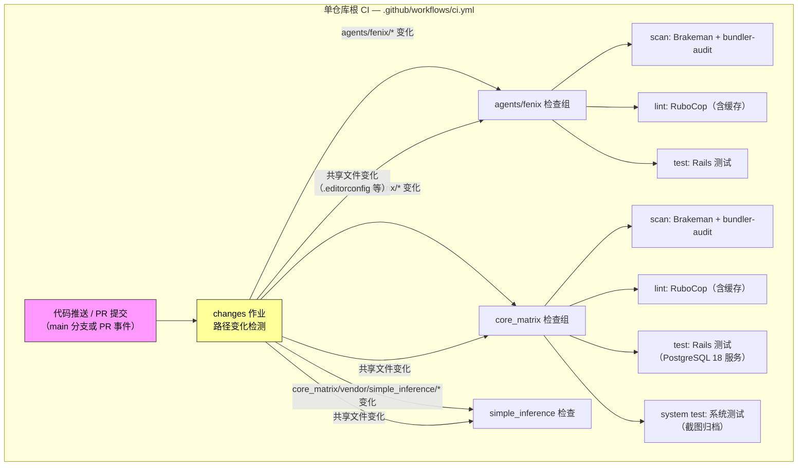
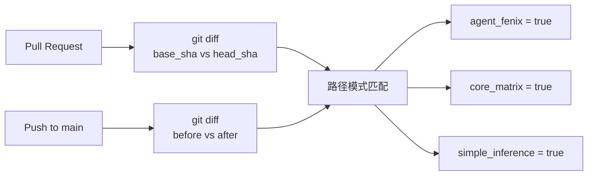
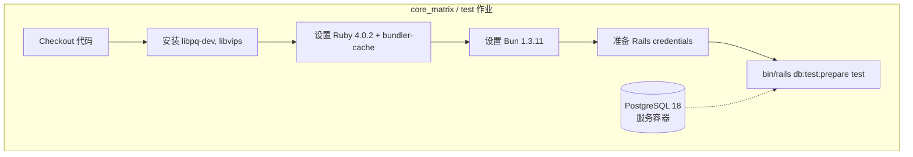

本页全面介绍 Cybros 单仓库中 **持续集成（CI）流水线** 和 **代码质量工具链** 的完整架构。无论你是第一次提交代码的新贡献者，还是想理解"为什么 PR 被标记为失败"的开发者，都能在这里找到答案。我们将从宏观的流水线触发机制讲起，逐一拆解安全扫描、代码风格检查、测试执行和依赖更新等各个环节，帮助你建立起对项目工程质量的系统性理解。

Sources: [.github/workflows/ci.yml](https://github.com/jasl/cybros.new/blob/main/.github/workflows/ci.yml#L1-L361), [core_matrix/.github/workflows/ci.yml](https://github.com/jasl/cybros.new/blob/main/core_matrix/.github/workflows/ci.yml#L1-L155)

---

## 整体架构：三层 CI 体系

Cybros 项目采用了 **三层 CI 体系**——单仓库根目录的统一编排流水线、`core_matrix` 子项目的独立流水线、以及 `agents/fenix` 子项目的独立流水线。这种设计既保证了跨项目的统一触发入口，又允许每个子项目拥有独立的工具版本和服务依赖。

下方的流程图展示了当你在 GitHub 上提交代码时，整个 CI 系统如何被激活并分发到各个检查作业：



**关键设计理念**：单仓库根 CI 通过 `changes` 作业实现 **路径感知的增量执行**——只有当特定子项目的文件发生变更时，才会触发对应的检查作业。这大幅节省了 CI 计算资源，尤其在频繁迭代单个子项目时效果显著。

Sources: [.github/workflows/ci.yml](https://github.com/jasl/cybros.new/blob/main/.github/workflows/ci.yml#L1-L361)

---

## 路径变化检测：智能跳过未变更的模块

单仓库根 CI 的第一个作业 `changes` 是整个流水线的 **调度中枢**。它通过 Git diff 分析本次提交涉及的文件路径，输出三个布尔标记：

| 输出变量 | 触发路径 | 对应子项目 |
|---|---|---|
| `agent_fenix` | `agents/fenix/*` | Fenix 代理程序 |
| `core_matrix` | `core_matrix/*` | Core Matrix 内核 |
| `simple_inference` | `core_matrix/vendor/simple_inference/*` | Simple Inference 引擎 |

对于 **共享配置文件**（如 `.editorconfig`、`.gitattributes`、`.github/workflows/*`），所有三个标记都会被设为 `true`，确保全局配置变更时全量检查。路径匹配使用 shell `case` 语句的模式匹配实现，简洁且高效。



**对新手的意义**：如果你只修改了 `core_matrix/app/services/` 下的文件，Fenix 的测试作业会被完全跳过，CI 运行时间显著缩短。

Sources: [.github/workflows/ci.yml](https://github.com/jasl/cybros.new/blob/main/.github/workflows/ci.yml#L17-L86)

---

## 安全扫描：双重防线守护代码安全

每个子项目的 CI 都包含两个安全扫描步骤，形成 **静态分析 + 依赖审计** 的双重防线：

### Brakeman — Rails 静态安全分析

**Brakeman** 是专为 Rails 应用设计的静态安全扫描器，能检测 SQL 注入、跨站脚本（XSS）、不安全的重定向、权限绕过等常见 Web 安全漏洞。它在 CI 中以 `--no-pager` 模式运行，适合非交互环境。

| 配置项 | 说明 |
|---|---|
| 执行命令 | `bin/brakeman --no-pager` |
| 忽略规则文件 | `config/brakeman.ignore`（JSON 格式，当前为空列表） |
| 运行环境 | `development`/`test` 组中通过 Gemfile 引入 |

`bin/brakeman` 脚本内部会自动追加 `--ensure-latest` 参数，确保始终使用最新版本的规则库，不会遗漏新发现的安全漏洞。

Sources: [core_matrix/bin/brakeman](https://github.com/jasl/cybros.new/blob/main/core_matrix/bin/brakeman#L1-L6), [core_matrix/config/brakeman.ignore](https://github.com/jasl/cybros.new/blob/main/core_matrix/config/brakeman.ignore#L1-L4), [core_matrix/Gemfile](https://github.com/jasl/cybros.new/blob/main/core_matrix/Gemfile#L71-L72)

### bundler-audit — 依赖漏洞审计

**bundler-audit** 检查 Gemfile 中所有 gem 的已知安全漏洞（基于 Ruby Advisory Database）。`bin/bundler-audit` 脚本会自动执行 `--update`（更新漏洞数据库）和 `--config config/bundler-audit.yml`（加载忽略配置）。

```yaml
# config/bundler-audit.yml 示例
ignore:
  - CVE-THAT-DOES-NOT-APPLY  # 占位：替换为实际不适用的 CVE 编号
```

**新手提示**：如果 bundler-audit 报告了某个 CVE 但你确认该漏洞不影响你的使用场景（例如仅影响特定操作系统），可以在 `config/bundler-audit.yml` 的 `ignore` 列表中添加对应的 CVE 编号来豁免。

Sources: [core_matrix/bin/bundler-audit](https://github.com/jasl/cybros.new/blob/main/core_matrix/bin/bundler-audit#L1-L5), [core_matrix/config/bundler-audit.yml](https://github.com/jasl/cybros.new/blob/main/core_matrix/config/bundler-audit.yml#L1-L6), [core_matrix/Gemfile](https://github.com/jasl/cybros.new/blob/main/core_matrix/Gemfile#L69-L70)

---

## 代码风格检查：RuboCop + ESLint 双语言覆盖

### RuboCop — Ruby 代码风格统一

项目使用 **rubocop-rails-omakase** 作为基础规则集，这是 Rails 官方推荐的"开箱即用"风格配置。两个子项目（`core_matrix` 和 `agents/fenix`）共享相同的自定义规则，确保全仓库 Ruby 代码风格一致。

| 自定义规则 | 效果 |
|---|---|
| `Layout/SpaceInsideArrayLiteralBrackets` | 数组方括号内无空格：`[a, b]` 而非 `[ a, b ]` |
| `Style/TrailingCommaInArrayLiteral` | 多行数组末尾不加逗号（`diff_comma`） |
| `Style/TrailingCommaInHashLiteral` | 多行哈希末尾不加逗号 |
| `Layout/EmptyLinesAroundAccessModifier` | `private`/`protected` 前后空行 |
| `Layout/TrailingEmptyLines` | 文件末尾只保留一个换行符 |
| `Style/StringLiterals` | 强制双引号：`"hello"` |
| `Style/FrozenStringLiteralComment` | 不要求 `frozen_string_literal: true` 注释 |

CI 中 RuboCop 以 `-f github` 格式运行，这意味着检查结果会以 **GitHub PR 内联批注** 的形式直接显示在代码变更行上，方便你在 Review 时快速定位问题。

**缓存机制**：RuboCop 使用 GitHub Actions Cache 进行结果缓存，缓存键基于 `.ruby-version`、`.rubocop.yml`、`.rubocop_todo.yml` 和 `Gemfile.lock` 的哈希值生成。在 main 分支上会持续更新缓存，其他分支优先复用缓存，大幅缩短后续运行的耗时。

Sources: [core_matrix/.rubocop.yml](https://github.com/jasl/cybros.new/blob/main/core_matrix/.rubocop.yml#L1-L48), [agents/fenix/.rubocop.yml](https://github.com/jasl/cybros.new/blob/main/agents/fenix/.rubocop.yml#L1-L48), [.github/workflows/ci.yml](https://github.com/jasl/cybros.new/blob/main/.github/workflows/ci.yml#L225-L236)

### ESLint — JavaScript 代码检查

`core_matrix` 的前端 JavaScript 代码使用 **ESLint** 进行检查，配置文件为 `eslint.config.mjs`（ESLint 扁平配置格式）：

| 配置维度 | 设定值 |
|---|---|
| 基础规则集 | `@eslint/js` 的 `recommended` 配置 |
| 扫描范围 | `app/javascript/**/*.js` 和 `test/js/**/*.js` |
| 忽略目录 | `app/assets/builds`、`coverage`、`vendor`、`tmp` 等 |
| ECMA 版本 | `latest`（支持最新语法） |
| 未使用变量 | 允许以 `_` 开头的变量/参数/异常 |
| 空 catch 块 | 允许 |

本地运行命令：`bun run lint:js`（在 `core_matrix` 目录下）。

Sources: [core_matrix/eslint.config.mjs](https://github.com/jasl/cybros.new/blob/main/core_matrix/eslint.config.mjs#L1-L40), [core_matrix/package.json](https://github.com/jasl/cybros.new/blob/main/core_matrix/package.json#L8-L9)

---

## 测试执行：从单元到系统测试的完整覆盖

### 单仓库根 CI 中的测试矩阵

单仓库根 CI 为每个子项目配置了独立的测试作业，各自拥有不同的服务依赖：

| 测试作业 | 子项目 | 数据库 | 其他服务 | 运行命令 |
|---|---|---|---|---|
| `core_matrix_test` | Core Matrix | PostgreSQL 18 | libvips | `bin/rails db:test:prepare test` |
| `core_matrix_system_test` | Core Matrix | PostgreSQL 18 | libvips | `bin/rails db:test:prepare test:system` |
| `agent_fenix_test` | Fenix | SQLite3（内置） | 无 | `bin/rails db:test:prepare test` |
| `simple_inference` | Simple Inference | 无 | 无 | `bundle exec rake` |

**测试失败时的诊断支持**：Core Matrix 的系统测试作业配置了截图归档——当测试失败时，`tmp/screenshots` 目录中的截图会被上传为 GitHub Artifact，你可以在 Actions 页面下载查看浏览器在失败瞬间的画面。



Sources: [.github/workflows/ci.yml](https://github.com/jasl/cybros.new/blob/main/.github/workflows/ci.yml#L238-L336), [core_matrix/.github/workflows/ci.yml](https://github.com/jasl/cybros.new/blob/main/core_matrix/.github/workflows/ci.yml#L56-L154)

### SimpleCov 代码覆盖率

Core Matrix 集成了 **SimpleCov** 进行代码覆盖率追踪。配置文件 `test/simplecov_helper.rb` 定义了专门的覆盖率收集策略：

| 配置维度 | 说明 |
|---|---|
| 覆盖率框架 | SimpleCov（rails 模式） |
| 并行工作器支持 | `enable_for_subprocesses` + `at_fork` 钩子 |
| 过滤目录 | `/vendor/`、`/script/` |
| 分组报告 | Services、Queries、Resolvers、Projections |
| 结果归一化 | 自定义 `ResultNormalization` 模块处理未加载文件的覆盖率 |

测试默认以 **并行模式** 运行（`parallelize(workers: :number_of_processors)`），每个并行工作器都有独立的 SimpleCov 配置，确保覆盖率数据准确合并。

Sources: [core_matrix/test/simplecov_helper.rb](https://github.com/jasl/cybros.new/blob/main/core_matrix/test/simplecov_helper.rb#L1-L88), [core_matrix/test/test_helper.rb](https://github.com/jasl/cybros.new/blob/main/core_matrix/test/test_helper.rb#L1-L22)

### 本地 CI 脚本

Core Matrix 提供了 `bin/ci` 脚本，基于 `ActiveSupport::ContinuousIntegration` 实现本地一键运行全套检查。配置文件 `config/ci.rb` 定义了如下步骤：

```
Setup → bin/setup --skip-server
├── Style: Ruby → bin/rubocop
├── Security: Gem audit → bin/bundler-audit
├── Security: Brakeman → bin/brakeman --quiet --no-pager --exit-on-warn --exit-on-error
├── Tests: Rails → bin/rails test
└── Tests: Seeds → env RAILS_ENV=test bin/rails db:seed:replant
```

**新手建议**：在本地提交前运行 `bin/ci` 可以提前发现大多数 CI 失败问题，避免反复推送修复。

Sources: [core_matrix/config/ci.rb](https://github.com/jasl/cybros.new/blob/main/core_matrix/config/ci.rb#L1-L28), [core_matrix/bin/ci](https://github.com/jasl/cybros.new/blob/main/core_matrix/bin/ci#L1-L4)

---

## 依赖管理：Dependabot 自动更新

项目配置了 **Dependabot** 进行自动化依赖更新，覆盖多个生态系统：

### 单仓库根 Dependabot 配置

| 生态系统 | 目录 | 更新频率 | PR 数上限 |
|---|---|---|---|
| GitHub Actions | `/` | 每周 | 10 |

Sources: [.github/dependabot.yml](https://github.com/jasl/cybros.new/blob/main/.github/dependabot.yml#L1-L8)

### Core Matrix 子项目 Dependabot 配置

| 生态系统 | 目录 | 更新频率 | PR 数上限 |
|---|---|---|---|
| Bundler（Ruby gems） | `/` | 每周 | 10 |
| GitHub Actions | `/` | 每周 | 10 |

Sources: [core_matrix/.github/dependabot.yml](https://github.com/jasl/cybros.new/blob/main/core_matrix/.github/dependabot.yml#L1-L13)

**工作机制**：Dependabot 每周扫描一次依赖，发现新版本后自动创建 Pull Request。这些 PR 会经过完整的 CI 检查流程（因为 `.github/workflows/*` 文件变更会触发全量检查）。你只需 Review 并合并即可保持依赖更新。

---

## 编辑器一致性：EditorConfig 与 Git 属性

### EditorConfig — 跨编辑器格式统一

根目录的 `.editorconfig` 文件确保所有开发者无论使用何种编辑器，都能保持一致的格式规范：

| 文件类型 | 缩进风格 | 缩进大小 |
|---|---|---|
| 全局默认 | — | — |
| `*.md` | Space | 2 |
| `*.rb, *.rake, *.gemspec, *.ru` | Space | 2 |
| `*.yml, *.yaml` | Space | 2 |
| `*.js, *.ts, *.json, *.css, *.html, *.erb` | Space | 2 |
| `*.go` | Tab | — |
| `Makefile` | Tab | — |
| `*.sh` | Space | 2 |

全局规则要求：UTF-8 编码、去除行末空白、文件末尾保留换行符、统一使用 LF 行尾。

Sources: [.editorconfig](https://github.com/jasl/cybros.new/blob/main/.editorconfig#L1-L36)

### Git Attributes — 行尾与合并策略

`.gitattributes` 文件在 Git 层面强制所有文本文件使用 LF 行尾（`* text=auto eol=lf`），并定义了合并策略：`Gemfile.lock` 使用 `union` 合并策略减少冲突，`bun.lock` 和 `*.lockb` 标记为二进制文件避免错误的文本合并。

Sources: [.gitattributes](https://github.com/jasl/cybros.new/blob/main/.gitattributes#L1-L40)

---

## 工具链全景速查表

以下是整个项目代码质量工具链的完整速查表，方便你快速定位工具名称、配置文件和本地运行命令：

| 工具 | 语言 | 目的 | 配置文件 | 本地命令 |
|---|---|---|---|---|
| **Brakeman** | Ruby | Rails 安全静态分析 | `config/brakeman.ignore` | `bin/brakeman` |
| **bundler-audit** | Ruby | Gem 依赖漏洞审计 | `config/bundler-audit.yml` | `bin/bundler-audit` |
| **RuboCop** | Ruby | 代码风格检查 | `.rubocop.yml` | `bin/rubocop` |
| **ESLint** | JavaScript | JS 代码质量检查 | `eslint.config.mjs` | `bun run lint:js` |
| **SimpleCov** | Ruby | 测试覆盖率追踪 | `test/simplecov_helper.rb` | 随测试自动运行 |
| **Dependabot** | 多语言 | 自动依赖更新 | `.github/dependabot.yml` | 自动触发 |
| **EditorConfig** | 多语言 | 编辑器格式统一 | `.editorconfig` | 编辑器自动加载 |
| **bin/ci** | Ruby | 本地一键全量检查 | `config/ci.rb` | `bin/ci` |

---

## 新手常见问题与排错指南

| 问题 | 可能原因 | 解决方案 |
|---|---|---|
| PR 上 RuboCop 失败 | 代码风格不符合规则 | 本地运行 `bin/rubocop` 查看详细报告，或运行 `bin/rubocop -a` 自动修复 |
| bundler-audit 报告 CVE | 某个 gem 存在已知漏洞 | 运行 `bundle update <gem名>` 升级，或在 `config/bundler-audit.yml` 中豁免 |
| Brakeman 报告安全警告 | 检测到潜在安全漏洞 | 修复代码或评估后在 `config/brakeman.ignore` 中豁免 |
| 系统测试失败 | 浏览器交互不符合预期 | 下载 CI Artifact 中的截图进行诊断 |
| ESLint 报错 | JS 代码有未声明变量等问题 | 运行 `bun run lint:js` 查看详细错误 |
| CI 跳过了我的子项目 | 修改的文件不在检测路径内 | 检查 `changes` 作业的路径匹配逻辑是否覆盖你的文件 |

---

## 从本页继续探索

理解 CI 和代码质量工具链后，推荐按以下路径深入：

- **了解测试策略的全貌**：[测试体系：单元、集成、端到端与系统测试](https://github.com/jasl/cybros.new/blob/main/27-ce-shi-ti-xi-dan-yuan-ji-cheng-duan-dao-duan-yu-xi-tong-ce-shi) 解释了 CI 中运行的测试是如何组织的
- **理解验收标准**：[验收测试场景与手动验证清单](https://github.com/jasl/cybros.new/blob/main/28-yan-shou-ce-shi-chang-jing-yu-shou-dong-yan-zheng-qing-dan) 展示了测试通过后的人工确认环节
- **回到开发环境**：[环境搭建与本地开发启动指南](https://github.com/jasl/cybros.new/blob/main/2-huan-jing-da-jian-yu-ben-di-kai-fa-qi-dong-zhi-nan) 帮助你在本地配置好运行这些工具的环境