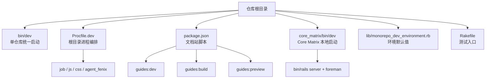
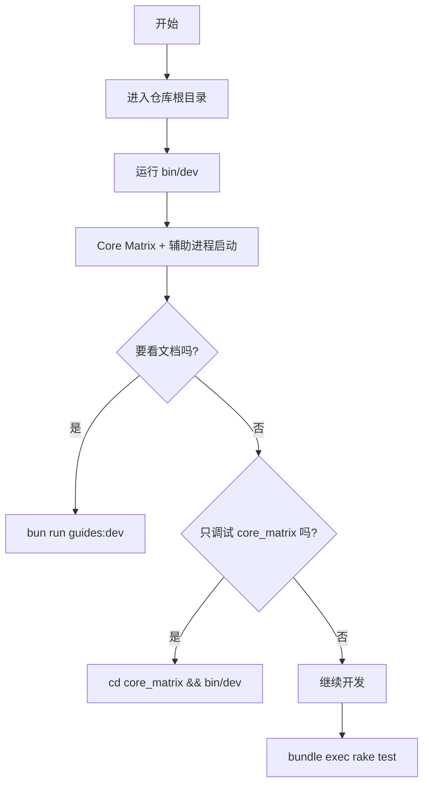

本页只讲一件事：**这个单仓库怎么启动、有哪些常用命令、环境变量怎么默认设置**。如果你刚进入仓库，先把这里的入口记住，再继续读 [项目边界与主要角色](https://github.com/jasl/cybros.new/blob/main/4-xiang-mu-bian-jie-yu-zhu-yao-jiao-se) 和 [文档生命周期与阅读路线](https://github.com/jasl/cybros.new/blob/main/5-wen-dang-sheng-ming-zhou-qi-yu-yue-du-lu-xian)，这样你会更容易把命令和仓库结构对上号。Sources: [README.md](https://github.com/jasl/cybros.new/blob/main/README.md#L3-L13); [README.md](https://github.com/jasl/cybros.new/blob/main/README.md#L15-L28); [README.md](https://github.com/jasl/cybros.new/blob/main/README.md#L38-L46)

## 仓库里哪些入口和这个页面有关

这个仓库是一个 monorepo，核心产品是 `Core Matrix`，配套代理程序是 `Fenix`；对初学者来说，最重要的不是先记住所有目录，而是先知道**根目录启动脚本、应用目录启动脚本、文档站脚本**分别负责什么。下面的结构图只保留和本页直接相关的顶层入口，帮助你先建立“命令 -> 启动对象”的映射。Sources: [README.md](https://github.com/jasl/cybros.new/blob/main/README.md#L3-L13); [README.md](https://github.com/jasl/cybros.new/blob/main/README.md#L30-L46); [package.json](https://github.com/jasl/cybros.new/blob/main/package.json#L7-L11)

从这张图可以先记住三件事：第一，根目录的 `bin/dev` 是这个仓库最常用的开发入口；第二，`Procfile.dev` 定义了要一起跑起来的辅助进程；第三，文档站不是跟应用一起启动的，而是通过 `package.json` 里的 `guides:*` 脚本单独管理。Sources: [bin/dev](https://github.com/jasl/cybros.new/blob/main/bin/dev#L11-L54); [Procfile.dev](https://github.com/jasl/cybros.new/blob/main/Procfile.dev#L1-L5); [package.json](https://github.com/jasl/cybros.new/blob/main/package.json#L7-L11)

## 最常用的命令

下面这张表把初学者最容易碰到的命令放在一起，重点看“它启动什么”和“什么时候用它”。根目录 `bin/dev` 负责把应用主进程和辅助进程一起拉起来；`core_matrix/bin/dev` 则是应用目录自己的本地启动方式；`bun run guides:*` 管文档站；`bundle exec rake test` 走仓库的 Minitest 测试任务。Sources: [bin/dev](https://github.com/jasl/cybros.new/blob/main/bin/dev#L11-L54); [core_matrix/bin/dev](https://github.com/jasl/cybros.new/blob/main/core_matrix/bin/dev#L3-L41); [package.json](https://github.com/jasl/cybros.new/blob/main/package.json#L7-L11); [Rakefile](https://github.com/jasl/cybros.new/blob/main/Rakefile#L1-L5)

| 命令 | 作用 | 适合场景 |
| --- | --- | --- |
| `bin/dev` | 在仓库根目录启动开发环境，先注入默认环境变量，再用 `foreman` 拉起 `Procfile.dev` 中的辅助进程，同时再启动 `core_matrix` 的 Rails server。 | 你想一次性看到核心应用和代理相关进程一起跑起来。 |
| `cd core_matrix && bin/dev` | 进入 `core_matrix` 后启动其自身开发环境，默认 `PORT=3000`，并通过本地 `Procfile.dev` 和单独的 Rails server 组合运行。 | 你只想调试 `core_matrix` 本体。 |
| `bun run guides:dev` | 启动 VitePress 文档站开发服务。 | 你想预览 `guides/` 下的文档。 |
| `bun run guides:build` | 构建文档站静态产物。 | 你要检查文档是否能正常构建。 |
| `bun run guides:preview` | 预览已构建的文档站。 | 你要模拟发布后的文档效果。 |
| `bundle exec rake test` | 执行仓库的 Minitest 测试任务。 | 你想跑最基础的自动化验证。 |

如果你只记一个命令，就先记 `bin/dev`；如果你只想看文档，就记 `bun run guides:dev`；如果你要确认这个仓库的最基础健康状态，就记 `bundle exec rake test`。Sources: [bin/dev](https://github.com/jasl/cybros.new/blob/main/bin/dev#L22-L54); [package.json](https://github.com/jasl/cybros.new/blob/main/package.json#L7-L11); [Rakefile](https://github.com/jasl/cybros.new/blob/main/Rakefile#L1-L5)

## `bin/dev` 到底做了什么

根目录的 `bin/dev` 先通过 `MonorepoDevEnvironment.defaults` 补齐环境变量，然后检查根目录是否存在 `Procfile.dev`；只要这个文件存在，它就会安装并使用 `foreman` 来启动多进程开发环境，并在退出时负责清理这些子进程。对初学者来说，这意味着你不需要手动一个个打开进程，`bin/dev` 已经把“主服务 + 辅助服务”的组合打包好了。Sources: [bin/dev](https://github.com/jasl/cybros.new/blob/main/bin/dev#L4-L19); [bin/dev](https://github.com/jasl/cybros.new/blob/main/bin/dev#L22-L54); [lib/monorepo_dev_environment.rb](https://github.com/jasl/cybros.new/blob/main/lib/monorepo_dev_environment.rb#L3-L19)

`Procfile.dev` 里定义了四个进程名称：`job`、`js`、`css` 和 `agent_fenix`。其中前三个都在 `core_matrix` 目录内执行，`agent_fenix` 则会切到 `agents/fenix`，并把 `PORT` 设置为 `AGENT_FENIX_PORT`。这说明根目录的开发模式不是“单一 Rails 服务”，而是一个**由 Core Matrix、前端资源构建和 Fenix 代理程序共同组成的协作启动面**。Sources: [Procfile.dev](https://github.com/jasl/cybros.new/blob/main/Procfile.dev#L1-L5); [bin/dev](https://github.com/jasl/cybros.new/blob/main/bin/dev#L29-L40)

## 环境变量和端口默认值

这个仓库把开发环境的默认端口和代理地址集中在 `lib/monorepo_dev_environment.rb` 里，逻辑很简单：`CORE_MATRIX_PORT` 默认是 `3000`，`AGENT_FENIX_PORT` 默认是 `36173`，`AGENT_FENIX_BASE_URL` 默认指向 `http://127.0.0.1:<AGENT_FENIX_PORT>`。如果你已经手动设置了 `AGENT_FENIX_BASE_URL`，脚本不会覆盖它；如果你只改了 `AGENT_FENIX_PORT`，`BASE_URL` 会跟着新端口重新计算。Sources: [lib/monorepo_dev_environment.rb](https://github.com/jasl/cybros.new/blob/main/lib/monorepo_dev_environment.rb#L3-L19); [test/monorepo_dev_environment_test.rb](https://github.com/jasl/cybros.new/blob/main/test/monorepo_dev_environment_test.rb#L4-L28)

| 变量 | 默认值 | 含义 |
| --- | --- | --- |
| `PORT` | `3000` 或继承自 `CORE_MATRIX_PORT` | 主应用监听端口。 |
| `CORE_MATRIX_PORT` | `3000` | Core Matrix 的开发端口。 |
| `AGENT_FENIX_PORT` | `36173` | Fenix 代理程序端口。 |
| `AGENT_FENIX_BASE_URL` | `http://127.0.0.1:36173` | Fenix 的本地访问地址。 |

你可以把这组变量理解成“根目录开发环境的统一约定”：主应用默认走 3000，代理程序默认走 36173，而 `BASE_URL` 会自动拼好，减少初学者手动配置出错的概率。Sources: [lib/monorepo_dev_environment.rb](https://github.com/jasl/cybros.new/blob/main/lib/monorepo_dev_environment.rb#L4-L19); [test/monorepo_dev_environment_test.rb](https://github.com/jasl/cybros.new/blob/main/test/monorepo_dev_environment_test.rb#L5-L28)

## 一步一步怎么启动

如果你是第一次在本地跑这个仓库，可以把启动流程简化成四步：进入仓库根目录，执行 `bin/dev`，看到服务起来后再按需打开文档站或单独的 `core_matrix` 开发模式，最后用 `bundle exec rake test` 做一次最基本的验证。这个流程和仓库根目录的验证要求一致，因为项目明确把 `bin/dev` 视为真实验证的一部分，而不是只靠自动化测试。Sources: [README.md](https://github.com/jasl/cybros.new/blob/main/README.md#L38-L46); [bin/dev](https://github.com/jasl/cybros.new/blob/main/bin/dev#L11-L54); [package.json](https://github.com/jasl/cybros.new/blob/main/package.json#L7-L11); [Rakefile](https://github.com/jasl/cybros.new/blob/main/Rakefile#L1-L5)

这张流程图的核心意思是：**`bin/dev` 是默认入口，`guides:*` 是文档入口，`core_matrix/bin/dev` 是局部调试入口，`rake test` 是基础验证入口**。先把这四个入口分清楚，后面的页面就会更好读。Sources: [bin/dev](https://github.com/jasl/cybros.new/blob/main/bin/dev#L11-L54); [core_matrix/bin/dev](https://github.com/jasl/cybros.new/blob/main/core_matrix/bin/dev#L3-L41); [package.json](https://github.com/jasl/cybros.new/blob/main/package.json#L7-L11); [Rakefile](https://github.com/jasl/cybros.new/blob/main/Rakefile#L1-L5)

## 建议的下一步阅读顺序

如果你已经能分辨“根目录启动”和“应用目录启动”的差别，下一步建议先读 [项目边界与主要角色](https://github.com/jasl/cybros.new/blob/main/4-xiang-mu-bian-jie-yu-zhu-yao-jiao-se)，再读 [文档生命周期与阅读路线](https://github.com/jasl/cybros.new/blob/main/5-wen-dang-sheng-ming-zhou-qi-yu-yue-du-lu-xian)，然后再进入 [内核职责：会话、工作流与治理](https://github.com/jasl/cybros.new/blob/main/6-nei-he-zhi-ze-hui-hua-gong-zuo-liu-yu-zhi-li)；这样你会先建立仓库边界，再理解文档怎么推进，最后进入核心实现。Sources: [README.md](https://github.com/jasl/cybros.new/blob/main/README.md#L3-L13); [README.md](https://github.com/jasl/cybros.new/blob/main/README.md#L15-L28); [README.md](https://github.com/jasl/cybros.new/blob/main/README.md#L30-L46)