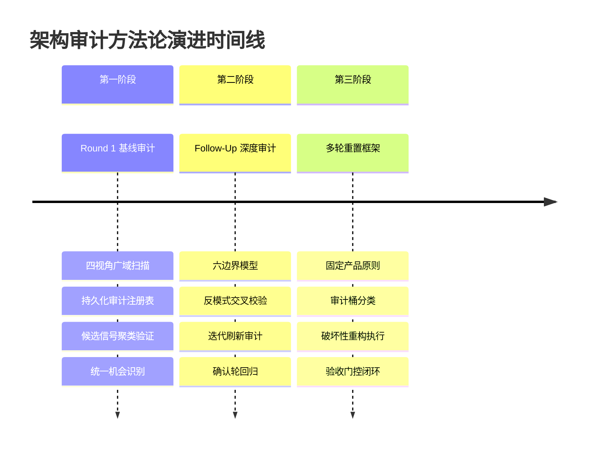
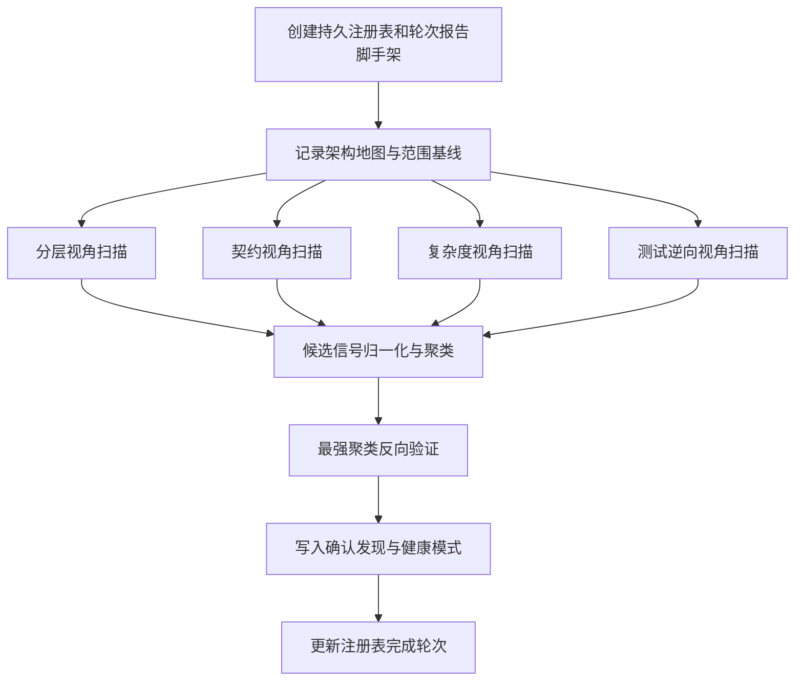
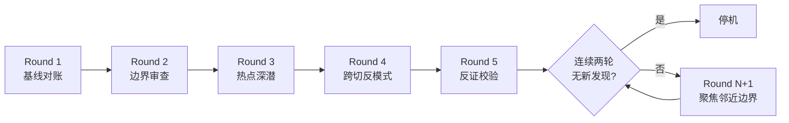
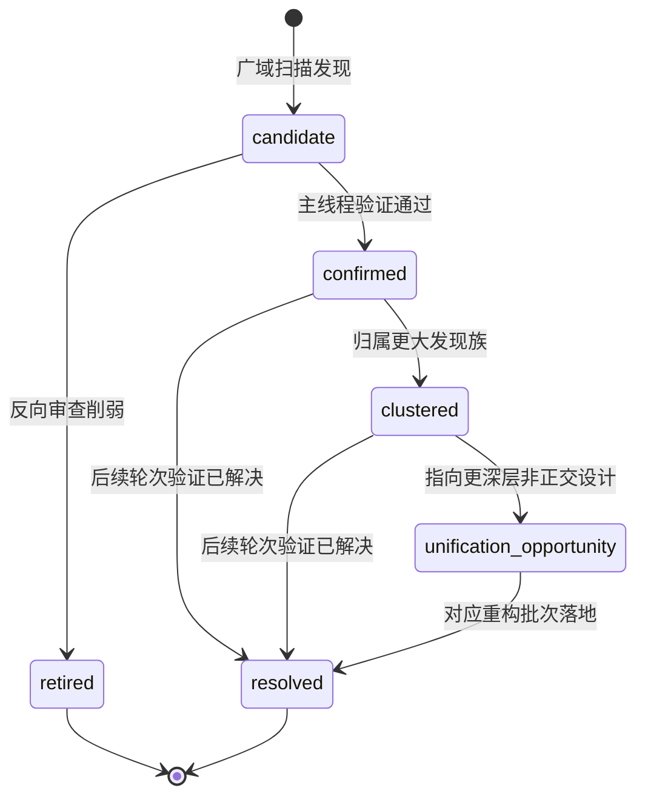
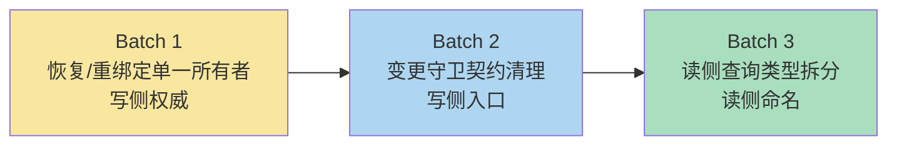
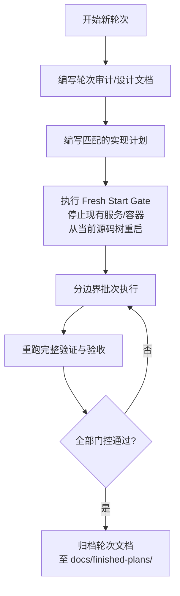

本文档系统性阐述 Cybros 项目中 Core Matrix 内核的架构健康审计方法论——从审计设计、扫描模型、证据门控到迭代重构执行框架的全链路实践。这套方法论并非理论预设，而是从 2026 年 3 月至 4 月间多轮真实架构审计与重构中提炼的可复现工程流程，覆盖从初始健康诊断到多轮破坏性重置的完整生命周期。

Sources: [docs/reports/2026-03-27-core-matrix-architecture-health-audit-round-1.md](https://github.com/jasl/cybros.new/blob/main/docs/reports/2026-03-27-core-matrix-architecture-health-audit-round-1.md#L1-L66), [docs/plans/2026-04-03-multi-round-architecture-audit-and-reset-framework.md](https://github.com/jasl/cybros.new/blob/main/docs/plans/2026-04-03-multi-round-architecture-audit-and-reset-framework.md#L1-L197)

## 方法论演进：从单轮审计到多轮重置框架

Cybros 的架构健康审计经历了三个明确的演进阶段，每个阶段解决上一阶段暴露的方法论局限：

Sources: [docs/finished-plans/2026-03-28-core-matrix-phase-2-architecture-health-audit-follow-up-design.md](https://github.com/jasl/cybros.new/blob/main/docs/finished-plans/2026-03-28-core-matrix-phase-2-architecture-health-audit-follow-up-design.md#L1-L62), [docs/plans/2026-04-03-multi-round-architecture-audit-and-reset-framework.md](https://github.com/jasl/cybros.new/blob/main/docs/plans/2026-04-03-multi-round-architecture-audit-and-reset-framework.md#L26-L37)



| 阶段 | 核心文档 | 审计模型 | 输出形态 | 关键创新 |
|------|---------|---------|---------|---------|
| **Round 1 基线审计** | `docs/reports/2026-03-27-...-round-1.md` | 四视角广域扫描 | 持久注册表 + 轮次报告 | 候选信号 → 确认发现 → 统一机会的三级漏斗 |
| **Follow-Up 深度审计** | `docs/finished-plans/2026-03-28-...-follow-up-findings.md` | 六边界 + 反模式交叉校验 | 单一可操作发现文档 | 边界优先审查模型 |
| **迭代刷新审计** | `docs/finished-plans/2026-03-28-...-refresh-findings.md` | 混合刷新 + 迭代扫描轮 | 确认发现 + 风险嗅探 | 五轮最小扫描 + 连续两轮无新发现停机规则 |
| **确认轮** | `docs/finished-plans/2026-03-29-...-confirmation-round-findings.md` | 归档基线 + 定向确认 | 新发现或无新发现判定 | 增量验证而非全量重扫 |
| **多轮重置框架** | `docs/plans/2026-04-03-...-framework.md` | 九桶分类 + 三轮序列 | 审计报告 + 重置候选 + 实现计划 + 轮后评审 | 每轮完整验收门控 |

Sources: [docs/reports/core-matrix-architecture-health-audit-register.md](https://github.com/jasl/cybros.new/blob/main/docs/reports/core-matrix-architecture-health-audit-register.md#L1-L203), [docs/finished-plans/2026-03-28-core-matrix-phase-2-iterative-architecture-health-refresh-findings.md](https://github.com/jasl/cybros.new/blob/main/docs/finished-plans/2026-03-28-core-matrix-phase-2-iterative-architecture-health-refresh-findings.md#L1-L29), [docs/finished-plans/2026-03-29-core-matrix-phase-2-architecture-health-confirmation-round-findings.md](https://github.com/jasl/cybros.new/blob/main/docs/finished-plans/2026-03-29-core-matrix-phase-2-architecture-health-confirmation-round-findings.md#L1-L35)

## 审计设计：四个核心审查视角

Round 1 基线审计确立了四个固定的广域扫描视角，作为每次架构审查的切入基准。这四个视角的选择并非任意——它们覆盖了从宏观架构到微观实现的完整纵切面。

Sources: [docs/finished-plans/2026-03-27-core-matrix-architecture-health-audit-round-1-plan.md](https://github.com/jasl/cybros.new/blob/main/docs/finished-plans/2026-03-27-core-matrix-architecture-health-audit-round-1-plan.md#L154-L200)

### 分层视角（Layering）

**审查问题**：一个模型或服务是否承载了超出其核心职责的架构角色？

分层视角检查的是**职责归属的正交性**。在 Core Matrix 的实践中，最典型的分层问题是聚合根同时扮演投影引擎、快照门面和运行时契约访问点的多重角色。例如 Round 1 发现 `Conversation` 模型不仅是持久化聚合根，还同时承担转录投影引擎、血缘遍历器、可见性覆盖解析器和历史锚验证器等职责。

Sources: [docs/reports/2026-03-27-core-matrix-architecture-health-audit-round-1.md](https://github.com/jasl/cybros.new/blob/main/docs/reports/2026-03-27-core-matrix-architecture-health-audit-round-1.md#L259-L274), [docs/reports/2026-03-27-core-matrix-architecture-health-audit-round-1.md](https://github.com/jasl/cybros.new/blob/main/docs/reports/2026-03-27-core-matrix-architecture-health-audit-round-1.md#L92-L119)

### 契约视角（Contracts）

**审查问题**：相邻服务之间的所有权边界是否清晰且无重复权威？

契约视角关注**同一逻辑契约是否被多个实现者分散持有**。典型案例包括 `ManualResume` 和 `ManualRetry` 重复了暂停恢复管线的大部分准备步骤，以及锁与新鲜度契约在多个包装器中以微妙不同的形态重复实现。

Sources: [docs/reports/2026-03-27-core-matrix-architecture-health-audit-round-1.md](https://github.com/jasl/cybros.new/blob/main/docs/reports/2026-03-27-core-matrix-architecture-health-audit-round-1.md#L295-L323), [docs/reports/2026-03-27-core-matrix-architecture-health-audit-round-1.md](https://github.com/jasl/cybros.new/blob/main/docs/reports/2026-03-27-core-matrix-architecture-health-audit-round-1.md#L395-L413)

### 复杂度视角（Complexity）

**审查问题**：某个实现是否正在演变为一个局部框架而非业务组件？

复杂度视角识别**偶然复杂度的积累趋势**。`ProviderCatalog::Validate` 就是典型案例——它包含格式规则、类型规则、默认行为、枚举约束和嵌套形状验证，实际上已经是一个本地图谱引擎。类似的还有 `PurgeDeleted` 和 `PurgePlan` 构建的手工所有权图谱引擎。

Sources: [docs/reports/2026-03-27-core-matrix-architecture-health-audit-round-1.md](https://github.com/jasl/cybros.new/blob/main/docs/reports/2026-03-27-core-matrix-architecture-health-audit-round-1.md#L342-L375)

### 测试逆向视角（Test Reverse View）

**审查问题**：测试结构是在强化生产边界还是在补偿薄弱的架构？

测试逆向视角是一种**元诊断手段**——通过检查测试辅助设施的复杂度来推断生产代码的结构问题。当测试需要大量上下文构建器、场景编排器和 DSL 才能表达普通行为时，这通常意味着生产边界本身缺乏清晰的入口契约。Round 1 发现测试上下文构建器正在成为一种"平行架构语言"。

Sources: [docs/reports/2026-03-27-core-matrix-architecture-health-audit-round-1.md](https://github.com/jasl/cybros.new/blob/main/docs/reports/2026-03-27-core-matrix-architecture-health-audit-round-1.md#L377-L393)

## 审计模型：三种递进审查策略

### 模型一：四视角广域扫描 + 聚类验证

Round 1 采用的基准审计模型。流程如下：



**关键约束**：后置任务依赖前置证据，不可跳步执行。每个候选信号必须包含六个要素——分类、可疑原因、证据、可能影响、反面论据和建议方向。

Sources: [docs/finished-plans/2026-03-27-core-matrix-architecture-health-audit-round-1-plan.md](https://github.com/jasl/cybros.new/blob/main/docs/finished-plans/2026-03-27-core-matrix-architecture-health-audit-round-1-plan.md#L17-L29), [docs/finished-plans/2026-03-27-core-matrix-architecture-health-audit-round-1-plan.md](https://github.com/jasl/cybros.new/blob/main/docs/finished-plans/2026-03-27-core-matrix-architecture-health-audit-round-1-plan.md#L186-L200)

### 模型二：六边界审查 + 反模式交叉校验

Follow-Up 审计引入的增强模型。它不再按目录树审查，而是按架构边界审查，将 `core_matrix` 视为六个交互边界：

| 边界 | 核心关注点 | 典型审查问题 |
|------|-----------|-------------|
| **对话与生命周期** | `Conversation`、`Turn`、归档/删除/关闭/血缘/变更契约 | 谁拥有运行时身份？谁拥有生命周期推进？ |
| **工作流与执行图** | `WorkflowRun`、图变更、调度器、等待状态 | 哪里是提供者决策的终点和执行的起点？ |
| **运行时控制平面** | `agent_control`、邮箱投递、报告摄入、新鲜度 | 读侧投影在哪里停止、领域变更从哪里开始？ |
| **运行时绑定与部署** | `ExecutionEnvironment`、`AgentDeployment`、恢复/轮转 | 兄弟流程是否复用同一契约还是手工复制？ |
| **提供者与治理** | 提供者目录、凭证/配额/策略治理、提供者执行 | 测试形态是在强化边界还是在补偿薄弱之处？ |
| **读侧与投影** | 查询、运行时资源 API、发布和操作面投影 | — |

两遍执行设计：**第一遍**按六个边界逐一审查，识别权威漂移、分裂的生命周期写入者、概念重叠和局部重新发明；**第二遍**以反模式为线索重新扫描，检查重复的守卫族、锁和事务模式、原始 Hash 契约扩散、包装器/适配器层重复以及编排热点。

Sources: [docs/finished-plans/2026-03-28-core-matrix-phase-2-architecture-health-audit-follow-up-design.md](https://github.com/jasl/cybros.new/blob/main/docs/finished-plans/2026-03-28-core-matrix-phase-2-architecture-health-audit-follow-up-design.md#L88-L200)

### 模型三：混合刷新 + 迭代扫描轮

迭代刷新审计引入的最严格审计模型。它的核心创新是**五轮最小扫描结构**和**连续两轮无新发现停机规则**：



每轮的聚焦领域：

- **Round 1 — 基线对账**：捕获当前架构地图，将现有代码与早期审计和跟进计划比对，标记早期问题为已解决/残留/不确定
- **Round 2 — 边界审查**：按对话/生命周期、工作流/执行图、运行时控制平面、运行时绑定/部署、提供者/治理、读侧/投影六大边界重新扫描
- **Round 3 — 热点深潜**：深度阅读最新且最敏感的面——`SubagentSession`、运行时能力组合、关闭/对账流、执行快照、Core Matrix ↔ Fenix 责任边界
- **Round 4 — 跨切反模式**：按守卫族重复、锁和事务重复、原始 Hash 契约扩散、包装器/适配器层重复、编排热点、命名/概念漂移等模式重新扫描
- **Round 5 — 反证校验**：使用测试、文档和兄弟实现挑战候选发现，移除看起来像有意设计或已解决结构的条目

Sources: [docs/finished-plans/2026-03-28-core-matrix-phase-2-iterative-architecture-health-refresh-design.md](https://github.com/jasl/cybros.new/blob/main/docs/finished-plans/2026-03-28-core-matrix-phase-2-iterative-architecture-health-refresh-design.md#L186-L260)

## 证据门控：从候选信号到确认发现

所有审计模型共享一套严格的证据门控标准。没有任何条目可以绕过这些门控进入最终报告。

### 候选信号的标准形态

每个候选信号必须包含以下完整结构：

```
### Candidate: [短标题]
- Category: [layering | contracts | complexity | test-reverse-view]
- Why suspicious: [为何可疑]
- Evidence: [具体文件路径]
- Possible impact: [可能影响]
- Counterpoint: [反面论据]
- Suggested direction: [建议方向]
- Related concepts: [相关概念]
```

反面论据（Counterpoint）的存在是这套方法论的标志性特征。它强制审计者在提出问题的同时主动寻找**为何当前设计可能是有意为之的理由**。

Sources: [docs/finished-plans/2026-03-27-core-matrix-architecture-health-audit-round-1-plan.md](https://github.com/jasl/cybros.new/blob/main/docs/finished-plans/2026-03-27-core-matrix-architecture-health-audit-round-1-plan.md#L186-L200), [docs/reports/2026-03-27-core-matrix-architecture-health-audit-round-1.md](https://github.com/jasl/cybros.new/blob/main/docs/reports/2026-03-27-core-matrix-architecture-health-audit-round-1.md#L254-L274)

### 确认发现的准入门槛

进入确认发现需要同时满足五个条件：

1. **指向具体文件、类、方法或调用路径**
2. **问题是结构性的，而非仅仅是风格偏好**
3. **命名了具体成本**——推理漂移、重复权威、不必要的编排增长、泄漏的契约、测试脆弱性或边界混淆
4. **经受至少一次反向校验**——对照邻近代码、测试或行为文档进行交叉检查
5. **包含行动方向**——如删除、合并、集中、拆分、契约化或强化

Sources: [docs/finished-plans/2026-03-28-core-matrix-phase-2-iterative-architecture-health-refresh-design.md](https://github.com/jasl/cybros.new/blob/main/docs/finished-plans/2026-03-28-core-matrix-phase-2-iterative-architecture-health-refresh-design.md#L146-L170), [docs/finished-plans/2026-03-28-core-matrix-phase-2-architecture-health-audit-follow-up-design.md](https://github.com/jasl/cybros.new/blob/main/docs/finished-plans/2026-03-28-core-matrix-phase-2-architecture-health-audit-follow-up-design.md#L189-L200)

### 注册表状态模型

持久化审计注册表使用以下状态机管理发现条目的生命周期：



| 状态 | 含义 | 典型转化条件 |
|------|------|-------------|
| `candidate` | 已观察但未通过主线程审查的信号 | — |
| `confirmed` | 带有证据和纠正方向的已验证问题 | 证据充分 + 反面论据不足以推翻 |
| `clustered` | 属于更大相关发现族的确认条目 | 与其他确认发现共享根本原因 |
| `unification-opportunity` | 指示更深层非正交设计的相关发现 | 多个确认发现指向同一架构缺陷 |
| `resolved` | 后续轮次验证为已解决的真实问题 | 对应重构批次已落地 |
| `retired` | 未能通过审查的信号 | 反向审查削弱、行为文档交叉验证不通过 |

Sources: [docs/reports/core-matrix-architecture-health-audit-register.md](https://github.com/jasl/cybros.new/blob/main/docs/reports/core-matrix-architecture-health-audit-register.md#L11-L21), [docs/reports/core-matrix-architecture-health-audit-register.md](https://github.com/jasl/cybros.new/blob/main/docs/reports/core-matrix-architecture-health-audit-register.md#L140-L203)

## 健康模式识别：值得保留的设计

架构审计不仅识别问题，也**显式记录值得保留的健康模式**。Round 1 识别了以下 Core Matrix 中的健康模式：

- **控制器和查询层保持相对纤薄**——`AgentAPI` 控制器主要做认证、通过 `public_id` 定位持久化资源，然后将实际工作委托给服务层
- **关闭生命周期状态仍通过显式对账器汇聚**——`Conversations::ReconcileCloseOperation` 是关闭推进的唯一生命周期状态写入者，即使许多服务向其输送事实
- **机器面和快照面的 `public_id` 纪律**——在机器对机器接口和快照相关边界上一致地使用 `public_id` 而非内部 `bigint` 键
- **清除图谱的显式失败关闭设计**——purge 的显式所有权图谱虽然沉重，但在拥有血缘和运行时状态的内核中比宽泛级联删除更安全

Sources: [docs/reports/2026-03-27-core-matrix-architecture-health-audit-round-1.md](https://github.com/jasl/cybros.new/blob/main/docs/reports/2026-03-27-core-matrix-architecture-health-audit-round-1.md#L471-L486), [docs/reports/2026-03-27-core-matrix-architecture-health-audit-round-1.md](https://github.com/jasl/cybros.new/blob/main/docs/reports/2026-03-27-core-matrix-architecture-health-audit-round-1.md#L47-L65)

## 重构执行：破坏性正交性重构设计

审计发现如何转化为可执行的破坏性重构？Cybros 项目确立了**三批次有序重构**模型：

### 批次排序原则

三个主题虽然相关，但性质不同，必须按序执行：

1. **恢复/重绑定单一所有者**（写侧权威问题）— 先统一写侧所有权
2. **变更守卫契约清理**（写侧入口和命名问题）— 再简化写侧入口面
3. **读侧查询类型拆分**（读侧类型和命名问题）— 最后处理依赖写侧契约的读侧对象



### 破坏性约束

每个批次必须遵守以下硬约束：

- **批次间允许破坏性变更**
- 每个批次必须以稳定状态结束——更新测试和行为文档
- **不保留兼容性垫片、遗留别名或重复所有者**
- 如需模型或字段变更，重写原始迁移、重新生成 `db/schema.rb`、重置数据库基线
- 不遗留指向已删除概念的旧生产调用路径或测试
- 每个批次结束时执行代码+文档清扫，**证明旧形态已真正消失**

Sources: [docs/finished-plans/2026-03-29-core-matrix-phase-2-destructive-orthogonality-refactor-design.md](https://github.com/jasl/cybros.new/blob/main/docs/finished-plans/2026-03-29-core-matrix-phase-2-destructive-orthogonality-refactor-design.md#L16-L49), [docs/finished-plans/2026-03-29-core-matrix-phase-2-destructive-orthogonality-refactor-design.md](https://github.com/jasl/cybros.new/blob/main/docs/finished-plans/2026-03-29-core-matrix-phase-2-destructive-orthogonality-refactor-design.md#L52-L70)

### 批次确认清单

每个批次关闭前必须通过显式确认清单。以 Batch 1（恢复/重绑定）为例：

- 恢复目标契约之外的生产代码不再手工解析暂停恢复兼容性
- 重绑定变更契约之外的生产代码不再手工重写 turn 部署固定和执行快照
- `BuildRecoveryPlan`、`ApplyRecoveryPlan` 和 `Workflows::ManualResume` 仅描述编排逻辑
- `Workflows::ManualRetry` 复用暂停工作恢复目标解析契约，而非临时解析兼容性
- `Conversations::ValidateAgentDeploymentTarget` 不再携带仅属于恢复的暂停工作语义
- 新的恢复目标所有者和重绑定所有者各有直接单元测试

Sources: [docs/finished-plans/2026-03-29-core-matrix-phase-2-destructive-orthogonality-refactor-design.md](https://github.com/jasl/cybros.new/blob/main/docs/finished-plans/2026-03-29-core-matrix-phase-2-destructive-orthogonality-refactor-design.md#L152-L172)

## 多轮重置框架：可复现的审计-重构循环

2026 年 4 月的多轮重置框架将上述实践总结为一套可复现的循环协议。

### 固定产品原则

每个重置轮次必须遵守这些不可协商的产品级约束：

- 所有用户可见的代理循环推进由 Core Matrix 拥有
- Core Matrix Workflow 是唯一的编排真理
- Fenix 可以拥有程序行为和执行运行时行为，但不成为工作流调度器
- 每个完成的轮次必须通过相同的验收标准，尤其是 provider-backed 2048 顶点清单
- 允许破坏性 schema 和协议变更——当它们改善正确性、模块性和长期可维护性时

Sources: [docs/plans/2026-04-03-multi-round-architecture-audit-and-reset-framework.md](https://github.com/jasl/cybros.new/blob/main/docs/plans/2026-04-03-multi-round-architecture-audit-and-reset-framework.md#L14-L26)

### 九桶分类体系

每个轮次将发现分类到九个审计桶中：

| 桶 | 关注维度 | 典型发现示例 |
|----|---------|-------------|
| Core Matrix 分层与模块边界 | 职责归属、命名漂移 | 聚合根承载过多架构角色 |
| Fenix 分层与模块边界 | 程序内部分层 | 单一运行时服务混合调度/报告/取消 |
| 跨项目责任归属 | Core Matrix ↔ Fenix 边界 | 执行信封在持久层/邮箱/运行时层重复 |
| Schema 与聚合边界 | 数据模型冗余 | WorkflowRun 和 AgentTaskRun 存储重复所有权事实 |
| 数据流与写放大 | 不必要的数据复制 | Fenix 持久化完整邮箱载荷副本 |
| 协议与载荷冗余 | 遗留兼容性 | 邮箱 `target_ref`、`target_kind` 和遗留运行时平面别名 |
| 热路径性能 | 关键路径效率 | 上下文构建在三个独立位置重复 |
| 死代码与重复实现 | 已废弃路径 | 伪执行平面赋值测试 |
| 验证质量与文档入口 | 测试覆盖有效性 | 测试仅证明记录已创建而非行为正确 |

Sources: [docs/plans/2026-04-03-multi-round-architecture-audit-and-reset-framework.md](https://github.com/jasl/cybros.new/blob/main/docs/plans/2026-04-03-multi-round-architecture-audit-and-reset-framework.md#L64-L78)

### 优先级规则

| 优先级 | 触发条件 | 行动要求 |
|--------|---------|---------|
| **P0** | 违反固定产品原则、创建冲突的真理源、工作流所有权或编排边界错误 | 立即修复 |
| **P1** | 产生持续维护成本、bug 风险、schema 锁定或实质性性能浪费 | 驱动轮次重置 |
| **P2** | 有价值的局部清理——仅在附属于更高价值变更时执行 | 不独立驱动重置 |

**关键原则**：代码风格本身不是轮次驱动器。Schema 结构和命名可以是。

Sources: [docs/plans/2026-04-03-multi-round-architecture-audit-and-reset-framework.md](https://github.com/jasl/cybros.new/blob/main/docs/plans/2026-04-03-multi-round-architecture-audit-and-reset-framework.md#L80-L98)

### 每轮必需输出

每个轮次必须产生四件制品：

1. **审计报告**——高风险区域、P0/P1/P2 发现、具体证据路径
2. **重置候选清单**——必须做 / 应该做 / 可选 / 暂不做的分级列表
3. **轮次特定实现计划**——精确文件、精确验证命令、显式删除目标
4. **轮后评审备忘**——改善了什么、暴露了什么新问题、什么应滚入下一轮

Sources: [docs/plans/2026-04-03-multi-round-architecture-audit-and-reset-framework.md](https://github.com/jasl/cybros.new/blob/main/docs/plans/2026-04-03-multi-round-architecture-audit-and-reset-framework.md#L100-L121)

### 轮次完成门控



完整的轮次完成门控要求：

- `core_matrix` 和 `agents/fenix` 的验证命令通过
- `core_matrix/vendor/simple_inference` 验证通过（当涉及时）
- 仓库级死名称和已删除概念扫描在活动实现面上干净
- Provider-backed 2048 顶点验收在当前产品契约下通过
- **Fresh Start Gate**：不依赖长期运行的 Rails 服务器、旧运行时清单或之前启动的容器工作者来判断当前行为

Sources: [docs/plans/2026-04-03-multi-round-architecture-audit-and-reset-framework.md](https://github.com/jasl/cybros.new/blob/main/docs/plans/2026-04-03-multi-round-architecture-audit-and-reset-framework.md#L122-L196)

## 决策规则：何时重构、何时延迟

多轮重置框架为每个候选变更提供了明确的决策准则：

**优先变更**的情况：

- 移除错误边界而非包装它
- 删除重复的状态、载荷或编排逻辑
- 简化 Core Matrix ↔ Fenix 契约
- 减少写放大或重复转换工作
- 使验收路径更短或更可靠
- 产出更易于用模块所有权解释的代码库

**延迟变更**的情况：

- 主要是风格性的
- 增加抽象而不删除复杂度
- 在无证据表明路径重要时优化路径
- 扩大产品范围而非收紧当前设计

Sources: [docs/plans/2026-04-03-multi-round-architecture-audit-and-reset-framework.md](https://github.com/jasl/cybros.new/blob/main/docs/plans/2026-04-03-multi-round-architecture-audit-and-reset-framework.md#L167-L183)

## 实践案例：Round 1 发现的演进轨迹

以下是 Round 1 基线审计中关键发现的完整演进轨迹，展示了从发现到解决的全过程：

| 注册表 ID | 发现标题 | Round 1 状态 | 最终状态 | 解决方式 |
|-----------|---------|-------------|---------|---------|
| AH-001 | Conversation/Turn 承载过多读侧和快照职责 | confirmed → clustered | **resolved** | Phase 2 执行快照/聚合边界统一批次 |
| AH-002 | AgentControl::Report 成为多协议汇聚点 | confirmed | **resolved** | Phase 2 控制平面路由和生命周期所有权统一批次 |
| AH-003 | ProviderExecution::ExecuteTurnStep 跨越过多边界 | confirmed | active (P1) | 待进一步拆分为窄协作器 |
| AH-004 | ManualResume/ManualRetry 重复暂停恢复管线 | confirmed | active (P1) | 待提取共享恢复目标准备层 |
| AH-005 | Scheduler 命名空间混合图调度与 turn 变更策略 | candidate | active (P2) | 待观察是否持续漂移 |
| AH-006 | PurgeDeleted/PurgePlan 手工所有权图谱引擎 | candidate | active (P1) | 待声明式建模自有资源族 |
| AH-010 | 运行时快照形态无单一明显所有者 | confirmed → clustered | **resolved** | 引入 `TurnExecutionSnapshot` 契约族 |
| AH-013 | 执行快照与聚合边界所有权统一 | unification-opportunity | **resolved** | 统一目标已落地为代码和文档 |
| AH-014 | 控制平面路由与生命周期所有权统一 | unification-opportunity | **resolved** | 路由语义归属持久邮箱字段 + `ResolveTargetRuntime` |

Sources: [docs/reports/core-matrix-architecture-health-audit-register.md](https://github.com/jasl/cybros.new/blob/main/docs/reports/core-matrix-architecture-health-audit-register.md#L39-L203), [docs/reports/2026-03-27-core-matrix-architecture-health-audit-round-1.md](https://github.com/jasl/cybros.new/blob/main/docs/reports/2026-03-27-core-matrix-architecture-health-audit-round-1.md#L67-L91)

## 测试审计与边界覆盖战役

架构审计方法论还延伸到测试质量治理。测试套件审计设计确立了三级质量分类法：

| 分类 | 判定信号 | 行动 |
|------|---------|------|
| **保留并强化** | 验证追加-only/血缘不变量、状态转换语义、失败模式、代理面/集成面契约 | 补充更强断言和缺失的反向用例 |
| **重写或降级** | 主要证明记录已创建而非为何正确；断言内部辅助结构而非稳定行为；与邻近集成/服务测试重复 | 降低到正确的测试层或重写断言 |
| **删除** | 仅重复框架默认值无产品特定规则；依赖大量 setup 但弱断言不编码不变量；在更嘈杂的层重复相同行为 | 直接删除 |

边界覆盖战役采用四波策略：先写侧状态机 → 控制平面与恢复 → 读侧与外部契约 → 模型与极端约束。每波遵循扫描→测试→修 bug→验证→全量回归的循环。

Sources: [docs/finished-plans/2026-03-29-core-matrix-test-suite-audit-design.md](https://github.com/jasl/cybros.new/blob/main/docs/finished-plans/2026-03-29-core-matrix-test-suite-audit-design.md#L39-L100), [docs/finished-plans/2026-03-29-core-matrix-boundary-coverage-campaign-design.md](https://github.com/jasl/cybros.new/blob/main/docs/finished-plans/2026-03-29-core-matrix-boundary-coverage-campaign-design.md#L1-L178)

## 方法论总结与核心原则

将上述所有实践提炼为**五条核心方法论原则**：

1. **证据先行，非印象驱动**——每条发现必须指向具体文件、具体调用路径、具体结构成本。低置信度嗅探不进入最终报告。

2. **反面论据强制要求**——提出问题的同时必须主动寻找"为何当前设计可能是有意为之"的理由。Round 1 中多条候选信号被反向审查削弱（如清除图谱的显式性、关闭对账器的单一写入者属性），这正是反面论据的价值所在。

3. **迭代扫描而非线性阅读**——五轮最小扫描结构确保系统被从多个角度重复审视。连续两轮无新发现才允许停机，避免过早终止。

4. **批次有序、破坏性允许**——写侧权威问题先于写侧入口问题，写侧入口问题先于读侧命名问题。批次间允许破坏性变更，但不保留兼容性垫片。

5. **每轮必须回归验收基线**——无论多少结构改进，每个轮次结束时必须通过相同的验收标准。结构健康不能以功能退化为代价。

Sources: [docs/finished-plans/2026-03-28-core-matrix-phase-2-architecture-health-audit-follow-up-design.md](https://github.com/jasl/cybros.new/blob/main/docs/finished-plans/2026-03-28-core-matrix-phase-2-architecture-health-audit-follow-up-design.md#L200-L265), [docs/plans/2026-04-03-multi-round-architecture-audit-and-reset-framework.md](https://github.com/jasl/cybros.new/blob/main/docs/plans/2026-04-03-multi-round-architecture-audit-and-reset-framework.md#L122-L197)

## 延伸阅读

- [测试体系：单元、集成、端到端与系统测试](https://github.com/jasl/cybros.new/blob/main/27-ce-shi-ti-xi-dan-yuan-ji-cheng-duan-dao-duan-yu-xi-tong-ce-shi)——审计发现的测试质量分类法在此页面有更详细的实施指导
- [验收测试场景与手动验证清单](https://github.com/jasl/cybros.new/blob/main/28-yan-shou-ce-shi-chang-jing-yu-shou-dong-yan-zheng-qing-dan)——每轮重置的完成门控依赖的顶点验收清单
- [CI 流水线与代码质量工具链](https://github.com/jasl/cybros.new/blob/main/29-ci-liu-shui-xian-yu-dai-ma-zhi-liang-gong-ju-lian)——自动化验证命令在轮次门控中的角色
- [文档生命周期：从提案设计到归档计划](https://github.com/jasl/cybros.new/blob/main/31-wen-dang-sheng-ming-zhou-qi-cong-ti-an-she-ji-dao-gui-dang-ji-hua)——审计文档和重构计划如何从 `docs/plans/` 流转至 `docs/finished-plans/`