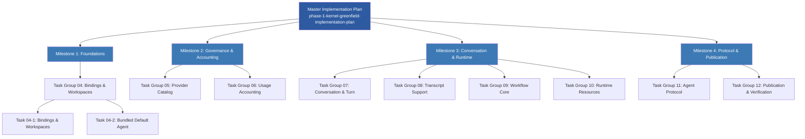

Cybros 项目采用一套严格的、基于目录状态机的文档治理体系。这套体系不是事后补写的规范说明——它是在项目启动之初就嵌入到执行流程中的第一等工程约束。每一个设计草案、每一条执行计划、每一份验收清单都必须遵循明确的路径，从 `proposed-designs` 起步，经审批、执行、验证，最终抵达 `finished-plans` 或 `archived-plans`。目录结构本身就是项目决策历史的可审计轨迹。

Sources: [docs/README.md](https://github.com/jasl/cybros.new/blob/main/docs/README.md#L1-L59)

## 主干生命周期管道

文档在目录树中的流转遵循一条严格线性路径。主 `docs/README.md` 用一行公式精确表述了这条管道：

```
docs/proposed-designs → docs/proposed-plans → docs/future-plans → docs/plans → docs/finished-plans → docs/archived-plans
```

这条管道的每个阶段有明确的放置条件和迁移条件。**不存在"跳级"**——一份文档如果不满足前置阶段的退出标准，就不能进入下一阶段。与之并行的三个持久化目录（`design`、`research-notes`、`reports`）不参与这条管道的流转，而是作为跨阶段的参考资料库长期存在。

Sources: [docs/README.md](https://github.com/jasl/cybros.new/blob/main/docs/README.md#L35-L48)

### 管道阶段详解

下表列出了每个目录的精确语义边界、放置条件和迁移出口：

| 目录 | 语义角色 | 放置条件 | 迁移出口 |
|---|---|---|---|
| `proposed-designs` | 设计草案讨论区 | 设计方向正在探索中、术语/边界尚未稳定、未来阶段需要成型 | 审批通过 → `design`；接受但推迟 → `future-plans` |
| `proposed-plans` | 早期计划草案 | 未来阶段有粗略里程碑但设计问题尚未解决 | 接受但推迟 → `future-plans`；激活执行 → `plans` |
| `future-plans` | 已接受但延后的工作 | 工作被接受但当前无执行时间表 | 激活 → `plans` |
| `plans` | 活跃执行文档 | 当前正在执行、尚未通过验证关卡 | 完成并通过验证 → `finished-plans` |
| `finished-plans` | 已完成并验证的计划 | 工作已完成并通过阶段级验收检查 | 被替代或过时 → `archived-plans` |
| `archived-plans` | 已归档的历史材料 | 被替代、撤回或不再活跃但需保留可追溯性 | 终点站——仅保留 |

Sources: [docs/proposed-designs/README.md](https://github.com/jasl/cybros.new/blob/main/docs/proposed-designs/README.md#L1-L17), [docs/proposed-plans/README.md](https://github.com/jasl/cybros.new/blob/main/docs/proposed-plans/README.md#L1-L16), [docs/future-plans/README.md](https://github.com/jasl/cybros.new/blob/main/docs/future-plans/README.md#L1-L23), [docs/plans/README.md](https://github.com/jasl/cybros.new/blob/main/docs/plans/README.md#L1-L39), [docs/finished-plans/README.md](https://github.com/jasl/cybros.new/blob/main/docs/finished-plans/README.md#L1-L7), [docs/archived-plans/README.md](https://github.com/jasl/cybros.new/blob/main/docs/archived-plans/README.md#L1-L6)

## 并行持久化目录

除了主生命周期管道，Cybros 维护四个不参与阶段流转但为整个系统提供长期参考价值的持久化目录：

| 目录 | 职责 | 关键治理规则 |
|---|---|---|
| `design` | 已审批的持久设计基线 | 定义 `core_matrix` 的耐久设计基线；不是逐任务的执行计划；早期记录可能保留 2026 年 4 月重置前的旧命名 |
| `research-notes` | 技术调查与结论归档 | 结论、权衡和重新评估触发条件必须直接写入文档本身；不依赖 `references/` 或外部分支的可访问性 |
| `reports` | 架构审计等正式报告 | 是撰写时的快照，保留当时术语；运行时验收产物归属顶层 `acceptance/` 而非此处 |
| `checklists` | 手动验证与验收清单 | 验收清单与验收测试场景配合使用，是计划完成前必须通过的最后关卡 |
| `operations` | 运行时拓扑与运维指南 | 队列拓扑、扩缩容参数和持久化 Provider 准入控制的权威来源 |

`research-notes` 的治理规则尤其值得注意。它强制要求"将持久结论写入文档本身"——这是一个刻意反脆弱的设计决策：外部仓库可能移动或消失，本地文档必须在没有上游材料的情况下仍然可以被理解。

Sources: [docs/design/README.md](https://github.com/jasl/cybros.new/blob/main/docs/design/README.md#L1-L24), [docs/research-notes/README.md](https://github.com/jasl/cybros.new/blob/main/docs/research-notes/README.md#L1-L34), [docs/reports/README.md](https://github.com/jasl/cybros.new/blob/main/docs/reports/README.md#L1-L19), [docs/checklists/README.md](https://github.com/jasl/cybros.new/blob/main/docs/checklists/README.md#L1-L14), [docs/operations/queue-topology-and-provider-governor.md](https://github.com/jasl/cybros.new/blob/main/docs/operations/queue-topology-and-provider-governor.md#L1-L19)

## 文件命名契约

所有文档遵循统一的 ISO 日期前缀命名规则，格式为 `YYYY-MM-DD-<scope>-<type>.md`。这一命名约定将时间信息、作用域和文档类型编码到文件名本身，使得仅通过目录列表即可快速定位目标文档。

### 命名模式分解

```
2026-03-24-core-matrix-phase-1-task-09-1-workflow-graph-foundations.md
│         │            │          │    │       │
│         │            │          │    │       └── 主题描述
│         │            │          │    └── 子任务序号
│         │            │          └── 任务类型+编号
│         │            └── 阶段标识 (phase-1 / phase-2)
│         └── 作用域 (core-matrix / fenix)
└── ISO 日期前缀
```

### 类型后缀对照

| 后缀 | 语义 | 出现目录 |
|---|---|---|
| `-design` | 设计文档 | `design/`, `finished-plans/`, `plans/` |
| `-implementation-plan` | 主执行计划 | `finished-plans/` |
| `-milestone-N-<name>` | 里程碑计划 | `finished-plans/` |
| `-task-group-NN-<name>` | 任务组（多个相关任务的聚合） | `finished-plans/` |
| `-task-NN-N-<name>` | 单个执行任务 | `finished-plans/` |
| `-plan-<name>` | 执行批次计划 | `finished-plans/` |
| `-findings` | 审计发现记录 | `finished-plans/` |
| `-campaign` / `-ledger` | 工作活动记录 | `finished-plans/` |
| `-follow-up` | 延后的后续工作 | `future-plans/` |
| `-research-note` | 技术调查笔记 | `research-notes/` |
| `-acceptance` | 验收清单 | `checklists/` |
| `-audit-round-N` | 审计轮次报告 | `reports/` |

Sources: [docs/finished-plans/README.md](https://github.com/jasl/cybros.new/blob/main/docs/finished-plans/README.md#L59-L118), [docs/future-plans/README.md](https://github.com/jasl/cybros.new/blob/main/docs/future-plans/README.md#L12-L23), [docs/research-notes/README.md](https://github.com/jasl/cybros.new/blob/main/docs/research-notes/README.md#L27-L34)

## 设计-实现配对模式

Cybros 的核心工作单元遵循一种严格的**设计-实现配对（Design-Implementation Pair）**模式。对于每一个重要的架构变更，都存在两份文档：一份以 `-design` 结尾的设计文档描述"做什么"和"为什么"，一份不带后缀或以其他方式命名的实现文档描述"怎么做"和"验证结果"。

实际存在的配对包括：

| 设计文档 | 实现文档 |
|---|---|
| `2026-03-31-core-matrix-loop-fenix-program-design` | `2026-03-31-core-matrix-loop-fenix-program` |
| `2026-03-31-core-matrix-parallel-tool-execution-design` | `2026-03-31-core-matrix-parallel-tool-execution` |
| `2026-04-02-conversation-export-import-and-debug-bundles-design` | `2026-04-02-conversation-export-import-and-debug-bundles` |
| `2026-04-03-agent-program-execution-runtime-reset-design` | `2026-04-03-agent-program-execution-runtime-reset` |
| `2026-03-30-websocket-first-runtime-mailbox-control-design` | `2026-03-30-websocket-first-runtime-mailbox-control` |

这种配对模式确保了设计决策的可追溯性。在回溯某个架构变更的动机时，可以先阅读设计文档理解上下文和权衡，然后查阅实现文档了解具体的落地方案和验证结果。

Sources: [docs/finished-plans/README.md](https://github.com/jasl/cybros.new/blob/main/docs/finished-plans/README.md#L13-L24)

## 层级化执行文档体系

执行计划采用严格的四层嵌套结构，从总计划到具体任务形成一棵清晰的分解树。以 Phase 1 为例，其完整层级结构如下：



每一层文档都定义了**源文档（Source Documents）**集合。执行单位在实施期间只加载当前任务文档及其明确命名的伴生文档，避免被无关上下文污染。主实现计划明确声明了这一规则：

> "Each execution-unit document narrows this source set. During implementation, load only the active execution-unit document and the companion documents it names."

Sources: [docs/finished-plans/2026-03-24-core-matrix-phase-1-kernel-greenfield-implementation-plan.md](https://github.com/jasl/cybros.new/blob/main/docs/finished-plans/2026-03-24-core-matrix-phase-1-kernel-greenfield-implementation-plan.md#L1-L30)

## 执行中对齐规则

Cybros 的文档治理不仅管"文档放在哪个目录"，还深入到执行过程中的三个强制对齐规则。这些规则嵌入在主实现计划中，作为执行期间不可绕过的约束：

**文档对齐规则（Documentation Alignment Rule）**：在实施过程中，代码、测试和计划文档必须在同一个检查点保持对齐。如果发现局部任务文档中的错误、遗漏或过时信息，必须在继续之前修复。但如果问题涉及已审批架构或产品语义的重大变更，必须停止并上报讨论——不得留下已知的文档-代码不一致。

**行为文档规则（Behavior Documentation Rule）**：每个已实现的模块或内聚子系统都必须维护行为文档（位于 `core_matrix/docs/behavior/` 或 `agents/fenix/docs/behavior/`），描述可观察行为、不变量、输入输出、副作用、生命周期状态转换、失败模式和集成边界。行为文档是事实性的审查输入，不是可选的后期润色。

**完成记录规则（Completion Record Rule）**：当执行单位完成后，任务文档必须附加 `Completion Record` 节，记录完成状态、完成日期、落地提交哈希和实际落地范围。如果实际落地的文件或支持文档与原始任务文件不同，必须明确记录差异。这使得任务文档成为可用作历史调试记录的工件，而非过时的待办清单。

Sources: [docs/finished-plans/2026-03-24-core-matrix-phase-1-kernel-greenfield-implementation-plan.md](https://github.com/jasl/cybros.new/blob/main/docs/finished-plans/2026-03-24-core-matrix-phase-1-kernel-greenfield-implementation-plan.md#L35-L60)

## 引用处理策略

`docs/README.md` 中定义的引用处理策略体现了 Cybros 文档治理的核心原则——**本地自包含**：

- `references/` 和外部仓库仅作为支撑材料，不作为持久文档的一部分
- 当设计、计划、研究笔记或完成记录使用参考项目进行合理性检查时，必须将保留的结论、权衡或观察到的行为直接写入本地文档
- 如果本地文档保留了参考路径或上游 URL，即使上游材料后来移动或消失，文档仍必须保持可理解性

这一策略在 `research-notes/README.md` 中有更细致的操作指南：将相关模式或行为总结在笔记本身中，将任何本地引用路径保留在一个小的索引节中，并将这些路径视为非权威且可能随时间不稳定的。

Sources: [docs/README.md](https://github.com/jasl/cybros.new/blob/main/docs/README.md#L50-L59), [docs/research-notes/README.md](https://github.com/jasl/cybros.new/blob/main/docs/research-notes/README.md#L16-L26)

## 完整生命周期流程图

以下 Mermaid 状态图展示了文档从创建到归档的完整生命周期，包括所有可能的转换路径：

```mermaid
stateDiagram-v2
    state "并行持久化目录" as persistent {
        design: design/\n已审批设计基线
        research: research-notes/\n技术调查归档
        reports: reports/\n审计报告快照
        ops: operations/\n运维指南
    }
    
    state "验收支撑" as acceptance {
        checklists: checklists/\n手动验证清单
    }

    [*] --> proposed_designs: 创建设计草案
    proposed_designs: proposed-designs/\n设计草案讨论区
    
    proposed_designs --> design: 审批通过
    proposed_designs --> future_plans: 接受但推迟
    
    [*] --> proposed_plans: 创建计划草案
    proposed_plans: proposed-plans/\n早期计划草案
    
    proposed_plans --> future_plans: 接受但推迟
    proposed_plans --> plans: 激活执行
    
    future_plans: future-plans/\n已接受延后工作
    future_plans --> plans: 激活
    
    plans: plans/\n活跃执行文档
    plans --> finished_plans: 完成并通过验证
    
    finished_plans: finished-plans/\n已完成计划
    finished_plans --> archived_plans: 被替代或过时
    
    archived_plans: archived-plans/\n历史归档
    archived_plans --> [*]: 终点
    
    design -.-> plans: 被引用为源文档
    research -.-> plans: 提供技术背景
    reports -.-> plans: 输入审计发现
    checklists -.-> finished_plans: 验收关卡
```

Sources: [docs/README.md](https://github.com/jasl/cybros.new/blob/main/docs/README.md#L35-L48), [docs/proposed-designs/README.md](https://github.com/jasl/cybros.new/blob/main/docs/proposed-designs/README.md#L1-L17), [docs/proposed-plans/README.md](https://github.com/jasl/cybros.new/blob/main/docs/proposed-plans/README.md#L1-L16)

## 跨项目契约与共享测试工件

文档生命周期不仅覆盖纯文档类工件，还延伸到跨项目边界契约的测试固化。`shared/fixtures/contracts/` 目录存放了 Core Matrix 与 Fenix 之间通信载荷的冻结快照：

| 契约文件 | 方向 | 语义 |
|---|---|---|
| `core_matrix_fenix_execution_assignment.json` | Matrix → Fenix | 执行分配信封 |
| `core_matrix_fenix_prepare_round_mailbox_item.json` | Matrix → Fenix | 准备轮次邮箱项 |
| `core_matrix_fenix_execute_program_tool_mailbox_item.json` | Matrix → Fenix | 程序工具执行邮箱项 |
| `fenix_prepare_round_report.json` | Fenix → Matrix | 准备轮次报告 |
| `fenix_execute_program_tool_report.json` | Fenix → Matrix | 程序工具执行报告 |

这些契约遵循严格的治理规则：它们是测试工件而非运行时真相来源；当契约载荷发生变更时，必须在同一变更中更新生产者侧和消费者侧的测试。

Sources: [shared/fixtures/README.md](https://github.com/jasl/cybros.new/blob/main/shared/fixtures/README.md#L1-L18)

## 行为文档：代码旁边的持久事实层

`core_matrix/docs/behavior/` 目录包含 30 个行为文档，覆盖从安装基线到工作流调度器的每一个已实现子系统。这些文档不是计划文档的附属品——它们是由行为文档规则强制要求维护的第一等工程产物，与代码和测试享有同等地位。

行为文档的职责包括：记录可观察行为、不变量、输入输出、副作用、生命周期状态转换、失败模式和集成边界。当执行单位完成后，任务文档、行为文档、代码和测试四者必须一致——缺少任何一个的对齐都不算完成。

Sources: [core_matrix/docs](https://github.com/jasl/cybros.new/blob/main/core_matrix/docs), [docs/finished-plans/2026-03-24-core-matrix-phase-1-kernel-greenfield-implementation-plan.md](https://github.com/jasl/cybros.new/blob/main/docs/finished-plans/2026-03-24-core-matrix-phase-1-kernel-greenfield-implementation-plan.md#L43-L50)

## 审计与迭代重构的文档支撑

Cybros 的架构健康审计体系通过 `reports/` 和 `finished-plans/` 中的专用文档类型得到完整支撑。审计注册表（`core-matrix-architecture-health-audit-register.md`）维护了一个条目索引（`AH-001` 到 `AH-014`），每个条目有明确的状态模型：

| 状态 | 含义 |
|---|---|
| `candidate` | 观察到的信号，尚未通过主线程审查 |
| `confirmed` | 已验证的问题，有证据和纠正方向 |
| `clustered` | 属于更大相关发现族的已确认条目 |
| `unification-opportunity` | 指示更深层非正交设计的相关发现 |
| `resolved` | 后续轮次验证为已解决的真实问题 |
| `retired` | 未通过审查或反映必要复杂性的信号 |

这一状态模型与主文档生命周期管道正交互操作：审计发现可能催生新的设计文档进入 `proposed-designs`，经过审批后变为执行计划进入 `plans`，最终作为已验证的修复归入 `finished-plans`。

Sources: [docs/reports/core-matrix-architecture-health-audit-register.md](https://github.com/jasl/cybros.new/blob/main/docs/reports/core-matrix-architecture-health-audit-register.md#L1-L38)

## 文档数量分布与项目节奏

截至当前快照，`docs/` 目录下的文档数量分布清晰反映了项目的历史节奏：

| 目录 | 非README文档数 | 解读 |
|---|---|---|
| `finished-plans/` | 133 | 项目核心产出库——Phase 1 和 Phase 2 的完整执行历史 |
| `design/` | 12 | 持久设计基线，数量有限表明设计稳定性高 |
| `future-plans/` | 9 | 已接受但延后的工作项，包括 Phase 4-7 规划 |
| `plans/` | 5 | 当前活跃执行——多轮审计与重置框架 |
| `research-notes/` | 5 | 技术调查归档，涵盖 JSON 契约、API 传输、运行时循环等 |
| `checklists/` | 2 | 内核验证 + 顶石验收 |
| `reports/` | 2 | 架构健康审计注册表与第一轮审计报告 |
| `operations/` | 1 | 队列拓扑与 Provider 治理器 |
| `proposed-designs/` | 0 | 当前无待审设计草案 |
| `proposed-plans/` | 0 | 当前无待审计划草案 |
| `archived-plans/` | 0 | 已过时材料尚未需要正式归档（暂保留在 `finished-plans` 中标记为"superseded"） |

`finished-plans/` 中 133 份文档的日期跨度从 `2026-03-24` 到 `2026-04-03`——仅 11 天的密集产出。完成记录中的验证证据（例如 Phase 1 完成时的 `243 runs, 1266 assertions, 0 failures, 0 errors, 0 skips`）证实了高产出并非以牺牲质量为代价。

Sources: [docs/finished-plans/README.md](https://github.com/jasl/cybros.new/blob/main/docs/finished-plans/README.md#L59-L118), [docs/finished-plans/2026-03-24-core-matrix-phase-1-kernel-greenfield-implementation-plan.md](https://github.com/jasl/cybros.new/blob/main/docs/finished-plans/2026-03-24-core-matrix-phase-1-kernel-greenfield-implementation-plan.md#L269-L302)

## 子项目文档归属

在单仓库架构下，Cybros 对文档归属有清晰的分层规则。`agents/fenix` 作为独立产品拥有自己的 `docs/plans/` 目录和 `docs/behavior/` 目录，但其已完成的计划归档到顶层 `docs/finished-plans/fenix/` 子目录中——这是为了保持顶层文档索引的完整可追溯性。

`acceptance/` 目录位于仓库根层级，刻意与两个产品代码库分离。它包含验收自动化脚本、场景定义和支撑库，其生成的日志和工件目录被 gitignore 排除。验收测试通过 `core_matrix/bin/rails runner` 执行，复用产品 Rails 环境。

Sources: [docs/finished-plans/fenix/README.md](https://github.com/jasl/cybros.new/blob/main/docs/finished-plans/fenix/README.md#L1-L12), [acceptance/README.md](https://github.com/jasl/cybros.new/blob/main/acceptance/README.md#L1-L30)

## 2026 年 4 月重置的文档影响

项目在 2026 年 4 月经历了一次重要的命名和边界重置。多个目录的 README 都以不同方式标记了这一事实：

- `docs/design/README.md` 声明"某些记录早于 2026 年 4 月的命名和边界重置"
- `docs/future-plans/README.md` 声明"这些记录不需要与最新代码逐行匹配"
- `docs/reports/README.md` 声明"早期报告可能因此保留过时命名和重置前假设"
- `docs/research-notes/README.md` 声明"研究笔记在意图上是历史性的，可能保留撰写时的术语"

当前代码库使用的标准命名是 `AgentProgram`、`AgentProgramVersion`、`AgentSession`、`ExecutionRuntime` 和 `ExecutionSession`。文档治理不要求修正历史记录中的旧命名——而是通过显式标注让读者意识到时间维度的差异。这是一种务实的历史感知策略：不擦除过去，但清楚地标记边界。

Sources: [docs/design/README.md](https://github.com/jasl/cybros.new/blob/main/docs/design/README.md#L6-L12), [docs/future-plans/README.md](https://github.com/jasl/cybros.new/blob/main/docs/future-plans/README.md#L8-L11), [docs/reports/README.md](https://github.com/jasl/cybros.new/blob/main/docs/reports/README.md#L6-L9), [docs/README.md](https://github.com/jasl/cybros.new/blob/main/docs/README.md#L29-L34)

## 实践指引：创建新文档的检查清单

当你需要为 Cybros 项目创建新文档时，遵循以下决策流程：

1. **确定文档类型**：这是设计探讨、执行计划、技术调查、还是验收清单？
2. **选择正确目录**：参考上面的管道阶段表，选择第一个匹配的目录
3. **遵守命名规则**：`YYYY-MM-DD-<scope>-<type-suffix>-<descriptive-name>.md`
4. **声明源文档**：在文档开头列出所有前置文档，形成可追溯的引用链
5. **编写自包含内容**：如果引用了外部材料，将关键结论直接写入文档
6. **完成后更新 README**：每个目录的 `README.md` 是该目录的索引，新文件必须被注册
7. **迁移时保留历史**：移动文档到下一阶段时，确保完成记录节已填写
8. **标记与当前代码的偏差**：如果文档保留重置前的旧术语，显式标注

Sources: [docs/README.md](https://github.com/jasl/cybros.new/blob/main/docs/README.md#L35-L59), [docs/proposed-designs/README.md](https://github.com/jasl/cybros.new/blob/main/docs/proposed-designs/README.md#L1-L17)

## 延伸阅读

理解文档生命周期后，以下页面提供了与之紧密关联的补充视角：

- [架构健康审计与迭代重构方法论](https://github.com/jasl/cybros.new/blob/main/30-jia-gou-jian-kang-shen-ji-yu-die-dai-zhong-gou-fang-fa-lun)：审计发现如何催生新的设计文档进入生命周期
- [验收测试场景与手动验证清单](https://github.com/jasl/cybros.new/blob/main/28-yan-shou-ce-shi-chang-jing-yu-shou-dong-yan-zheng-qing-dan)：`checklists/` 中的清单如何作为文档生命周期中的验证关卡
- [测试体系：单元、集成、端到端与系统测试](https://github.com/jasl/cybros.new/blob/main/27-ce-shi-ti-xi-dan-yuan-ji-cheng-duan-dao-duan-yu-xi-tong-ce-shi)：测试验证与完成记录的配合关系
- [CI 流水线与代码质量工具链](https://github.com/jasl/cybros.new/blob/main/29-ci-liu-shui-xian-yu-dai-ma-zhi-liang-gong-ju-lian)：自动化验证如何与文档对齐规则联动