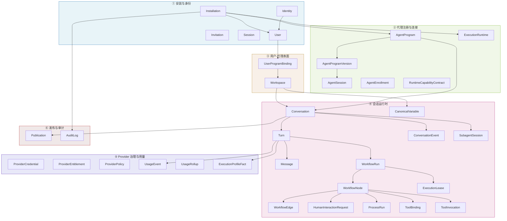
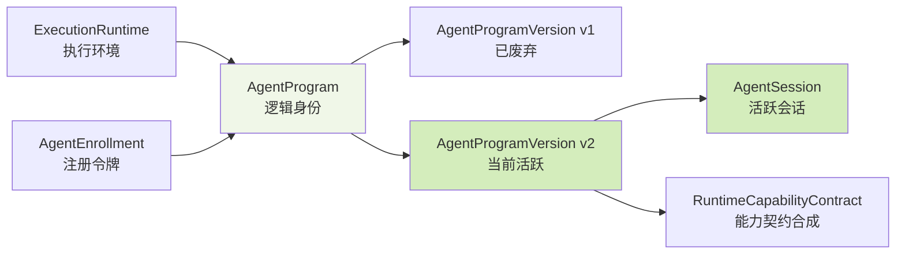
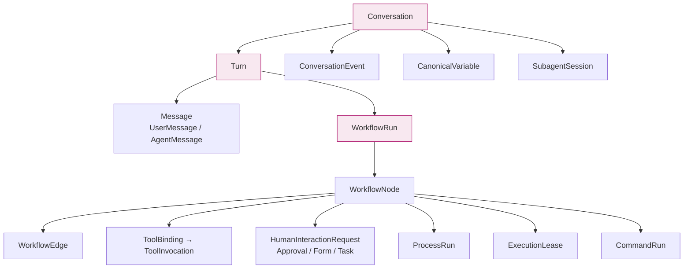
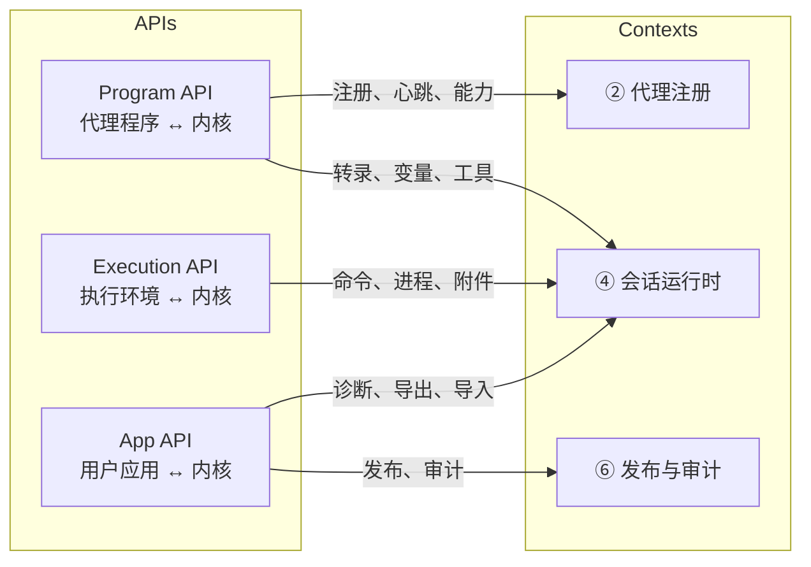

Core Matrix 是一个**单安装、单租户的代理平台内核**，面向个人、家庭和小团队场景。它不是业务代理本身，而是用户可见的控制平面、运行时治理器、审计权威和执行编排器——其角色类似 JVM 之于 Java 程序：提供共享基础设施，将业务行为完全留给代理程序。

本文档从领域驱动设计（DDD）的视角，系统梳理 Core Matrix 内核的**六大限界上下文**（Bounded Context）及其核心领域模型。每个上下文拥有独立的聚合根、清晰的职责边界和明确定义的不变量规则。理解这六个上下文的划分逻辑，是掌握整个系统架构的第一步。

Sources: [2026-03-24-core-matrix-kernel-greenfield-design.md](https://github.com/jasl/cybros.new/blob/main/docs/design/2026-03-24-core-matrix-kernel-greenfield-design.md#L1-L25)

## 架构全景：六大限界上下文总览图

在深入每个上下文之前，先建立整体鸟瞰视图。下图展示了六大上下文之间的核心依赖关系和数据流向：

上图中的箭头表示**所有权方向**（ownership direction），而非简单的关联关系。Core Matrix 遵循严格的 **installation 一致性约束**——所有模型都通过 `installation_id` 外键锚定到唯一的安装实例，确保单租户隔离的完整性。

Sources: [2026-03-24-core-matrix-kernel-greenfield-design.md](https://github.com/jasl/cybros.new/blob/main/docs/design/2026-03-24-core-matrix-kernel-greenfield-design.md#L112-L272)

## 上下文 ①：安装与身份（Installation And Identity）

这是整个平台的**根上下文**。它定义了安装实例本身以及谁有权进入这个安装。

**核心聚合根与职责**：

| 模型 | 角色 | 关键约束 |
|------|------|----------|
| `Installation` | 全局单例，平台根 | 单行约束，`bootstrap_state` 仅允许 `pending` / `bootstrapped` |
| `Identity` | 认证身份 | 持有 email、密码摘要、`disabled_at`；与 `User` 一对一分离 |
| `User` | 产品用户实体 | 持有 `display_name`、`role`（member/admin）、`preferences` |
| `Invitation` | 邀请加入机制 | 一次性 token、过期时间、消费时间戳 |
| `Session` | 会话管理 | 绑定 `Identity` 的登录会话 |

**设计原则**：认证生命周期（`Identity`）与产品所有权生命周期（`User`）明确分离。登录方式变更不会导致产品资源的重写，未来扩展 passkey 等认证方式也不会影响所有权模型。

**关键不变量**：安装必须始终保留至少一个活跃的管理员用户，撤销最后一个管理员是被禁止的。`Installation` 通过 `single_row_installation` 验证确保全局单例特性。

Sources: [installation.rb](https://github.com/jasl/cybros.new/blob/main/core_matrix/app/models/installation.rb#L1-L35), [identity.rb](https://github.com/jasl/cybros.new/blob/main/core_matrix/app/models/identity.rb#L1-L23), [user.rb](https://github.com/jasl/cybros.new/blob/main/core_matrix/app/models/user.rb#L1-L39), [invitation.rb](https://github.com/jasl/cybros.new/blob/main/core_matrix/app/models/invitation.rb#L1-L61), [2026-03-24-core-matrix-kernel-greenfield-design.md](https://github.com/jasl/cybros.new/blob/main/docs/design/2026-03-24-core-matrix-kernel-greenfield-design.md#L116-L147)

## 上下文 ②：代理注册与连接（Agent Registry And Connectivity）

这个上下文定义了**什么是代理程序**、**它如何连接**以及**哪个运行时实例当前在线**。Core Matrix 不将代理身份绑定到特定实现语言、仓库布局或部署工具链。

**核心聚合根与职责**：

| 模型 | 角色 | 关键特性 |
|------|------|----------|
| `AgentProgram` | 逻辑代理身份 | `key`（安装内唯一）、`visibility`（personal/global）、`lifecycle_state`（active/retired） |
| `AgentProgramVersion` | 能力快照版本 | 不可变（`readonly?`），存储协议方法、工具目录、配置 schema、profile 目录 |
| `AgentSession` | 活跃连接会话 | 每个代理程序仅允许一个活跃会话，管理心跳和健康状态 |
| `ExecutionRuntime` | 执行环境 | 独立于代理部署的运行时资源属主，支持 local/container/remote 三种类型 |
| `AgentEnrollment` | 注册令牌 | 一次性 token 交换机制，用于机器对机器的安全注册 |
| `RuntimeCapabilityContract` | 能力契约 | 组合代理版本和执行环境的能力，生成有效的工具目录 |

**版本不可变性**是此上下文的核心设计决策。`AgentProgramVersion` 一旦持久化即不可修改（`readonly?` 返回 `true`），这确保了任何历史执行都能精确回溯到当时的能力快照。每次代理重新部署并报告新的能力集时，系统会创建新的版本记录，而非原地更新。

**API 入口**：此上下文的操作通过 `ProgramAPI` 命名空间暴露，包括注册（`registrations#create`）、心跳（`heartbeats#create`）、能力握手（`capabilities#create/show`）等机器对机器接口。

Sources: [agent_program.rb](https://github.com/jasl/cybros.new/blob/main/core_matrix/app/models/agent_program.rb#L1-L51), [agent_program_version.rb](https://github.com/jasl/cybros.new/blob/main/core_matrix/app/models/agent_program_version.rb#L1-L120), [agent_session.rb](https://github.com/jasl/cybros.new/blob/main/core_matrix/app/models/agent_session.rb#L1-L99), [execution_runtime.rb](https://github.com/jasl/cybros.new/blob/main/core_matrix/app/models/execution_runtime.rb#L1-L57), [agent_enrollment.rb](https://github.com/jasl/cybros.new/blob/main/core_matrix/app/models/agent_enrollment.rb#L1-L65), [runtime_capability_contract.rb](https://github.com/jasl/cybros.new/blob/main/core_matrix/app/models/runtime_capability_contract.rb#L1-L57), [routes.rb](https://github.com/jasl/cybros.new/blob/main/core_matrix/config/routes.rb#L16-L45)

## 上下文 ③：用户-代理表面（User Agent Surface）

这个上下文定义了**用户如何在安装内使用一个逻辑代理**。它是用户所有权模型与代理身份模型之间的桥梁层。

**核心聚合根与职责**：

| 模型 | 角色 | 关键约束 |
|------|------|----------|
| `UserProgramBinding` | 用户-代理绑定 | 每对 `(user_id, agent_program_id)` 唯一；`personal` 代理仅拥有者可绑定 |
| `Workspace` | 用户工作区 | 始终 `private`，属于一个绑定；每个绑定最多一个默认工作区 |

**所有权链条**遵循严格层级：`Installation → User → UserProgramBinding → Workspace → Conversation → Turn → WorkflowRun`。这个链条中，Workspace 是用户隐私的边界——工作区永远不共享、不协作编辑，唯一的分享途径是通过上下文 ⑥ 的 Publication 只读发布。

**可见性规则**：`AgentProgram` 的 `visibility` 字段决定了哪些用户可以绑定。`global` 代理对安装内所有用户可见；`personal` 代理仅对拥有者可见。`personal_agent_ownership` 验证确保了这一约束在数据层面强制执行。

Sources: [user_program_binding.rb](https://github.com/jasl/cybros.new/blob/main/core_matrix/app/models/user_program_binding.rb#L1-L42), [workspace.rb](https://github.com/jasl/cybros.new/blob/main/core_matrix/app/models/workspace.rb#L1-L53), [2026-03-24-core-matrix-kernel-greenfield-design.md](https://github.com/jasl/cybros.new/blob/main/docs/design/2026-03-24-core-matrix-kernel-greenfield-design.md#L176-L199)

## 上下文 ④：会话运行时（Conversation Runtime）

这是**最复杂的限界上下文**，拥有最多的领域模型和最丰富的行为语义。它拥有实际的交互历史和执行过程，是整个平台的运行时心脏。

### 核心聚合根层级

### Conversation：对话树与生命周期

`Conversation` 不仅仅是线性聊天记录，而是一个**可分支的树形结构**：

| 枚举维度 | 可选值 | 语义 |
|----------|--------|------|
| `kind` | `root`, `branch`, `fork`, `checkpoint` | 对话在树中的位置角色 |
| `purpose` | `interactive`, `automation` | 交互式 vs 自动化执行 |
| `lifecycle_state` | `active`, `archived` | 生命周期状态，与 kind 正交 |
| `deletion_state` | `retained`, `pending_delete`, `deleted` | 删除流程状态 |
| `addressability` | `owner_addressable`, `agent_addressable` | 谁可以主动发起交互 |
| `interactive_selector_mode` | `auto`, `explicit_candidate` | 模型选择策略 |

对话的**特性策略**（Feature Policy）通过 `enabled_feature_ids` 和 `during_generation_input_policy` 在对话创建时快照，并传递到每个 `Turn` 上冻结。`automation` 类型的对话自动禁用 `human_interaction` 特性。

### Turn：执行单元与来源追踪

`Turn` 是一次完整的用户-代理交互循环。它持有：

- **来源追踪**：`origin_kind`（`manual_user` / `automation_schedule` / `automation_webhook` / `system_internal`）配以结构化的 `origin_payload`
- **运行时钉扎**：`agent_program_version_id` 和 `pinned_program_version_fingerprint` 将执行锁定到特定的代理版本，部署漂移必须安全失败
- **消息选择指针**：`selected_input_message` 和 `selected_output_message` 指向当前有效的输入/输出变体
- **执行快照**：`execution_snapshot_payload`、`resolved_config_snapshot`、`resolved_model_selection_snapshot`、`feature_policy_snapshot` 全部冻结

### WorkflowRun：轮次级 DAG 执行引擎

每个 `Turn` 恰好拥有一个 `WorkflowRun`。工作流是一个**轮次作用域的动态 DAG**，可以在运行时追加节点和边，但每一步都必须保持无环。`WorkflowRun` 的等待状态机制（`wait_state` / `wait_reason_kind`）提供了结构化的阻塞原因追踪：

| `wait_reason_kind` | 语义 |
|---------------------|------|
| `human_interaction` | 等待人类审批/表单/任务 |
| `subagent_barrier` | 等待子代理完成 barrier join |
| `agent_unavailable` | 代理程序不可用 |
| `manual_recovery_required` | 需要人工恢复 |
| `policy_gate` | 策略门限阻塞 |
| `retryable_failure` | 可重试的失败 |
| `external_dependency_blocked` | 外部依赖阻塞 |

### Message：不可变转录与变体系统

`Message` 采用 STI（单表继承），仅允许 `UserMessage` 和 `AgentMessage` 两种转录承载子类。消息的 `variant_index` 支持编辑、重试、重新运行和滑动选择等多变体场景，但**永远不会原地修改历史行**。分叉点消息（fork point）受到保护，禁止改写和软删除。

### ConversationEvent：非转录投影

`ConversationEvent` 是追加写入的运行时投影层，用于表达不参与转录的事件（如人类交互状态更新、变量提升通知、流式文本进度等）。它通过 `stream_key` / `stream_revision` 支持可替换的实时投影流——存储层始终追加写入，渲染层折叠为最新版本。

Sources: [conversation.rb](https://github.com/jasl/cybros.new/blob/main/core_matrix/app/models/conversation.rb#L1-L200), [turn.rb](https://github.com/jasl/cybros.new/blob/main/core_matrix/app/models/turn.rb#L1-L200), [message.rb](https://github.com/jasl/cybros.new/blob/main/core_matrix/app/models/message.rb#L1-L106), [workflow_run.rb](https://github.com/jasl/cybros.new/blob/main/core_matrix/app/models/workflow_run.rb#L1-L205), [workflow_node.rb](https://github.com/jasl/cybros.new/blob/main/core_matrix/app/models/workflow_node.rb#L1-L177), [conversation_event.rb](https://github.com/jasl/cybros.new/blob/main/core_matrix/app/models/conversation_event.rb#L1-L90), [human_interaction_request.rb](https://github.com/jasl/cybros.new/blob/main/core_matrix/app/models/human_interaction_request.rb#L1-L143), [subagent_session.rb](https://github.com/jasl/cybros.new/blob/main/core_matrix/app/models/subagent_session.rb#L1-L128), [canonical_variable.rb](https://github.com/jasl/cybros.new/blob/main/core_matrix/app/models/canonical_variable.rb#L1-L114), [tool_binding.rb](https://github.com/jasl/cybros.new/blob/main/core_matrix/app/models/tool_binding.rb#L1-L110), [execution_lease.rb](https://github.com/jasl/cybros.new/blob/main/core_matrix/app/models/execution_lease.rb#L1-L153), [2026-03-24-core-matrix-kernel-greenfield-design.md](https://github.com/jasl/cybros.new/blob/main/docs/design/2026-03-24-core-matrix-kernel-greenfield-design.md#L193-L236)

## 上下文 ⑤：Provider 治理与用量（Provider Governance And Usage）

这个上下文管理**共享 AI 资源的治理和计费**。它维护全局的 Provider 凭证、配额策略，并收集详细的逐用户使用量。

**核心聚合根与职责**：

| 模型 | 角色 | 关键特性 |
|------|------|----------|
| Provider 目录（配置文件） | 模型目录声明 | `config/llm_catalog.yml` 定义 provider、模型、能力和准入控制 |
| `ProviderCredential` | API 凭证 | `secret` 字段加密存储，按 `(provider_handle, credential_kind)` 唯一 |
| `ProviderEntitlement` | 配额管理 | 按 `(provider_handle, entitlement_key)` 唯一，支持 `unlimited` / `rolling_five_hours` / `calendar_day` / `calendar_month` 窗口 |
| `ProviderPolicy` | 选择策略 | 按 `(installation_id, provider_handle)` 唯一，存储模型选择默认值 |
| `UsageEvent` | 使用量事件 | 按 provider/model/user/agent 维度记录 token 用量、延迟和估算成本 |
| `UsageRollup` | 汇总统计 | 按 `bucket_kind`（hour/day/rolling_window）和 10 维度键聚合 |
| `ExecutionProfileFact` | 执行画像 | 追踪 provider_request、tool_call、subagent_outcome、approval_wait、process_failure 五类性能事实 |

Provider 目录通过 YAML 配置（`llm_catalog.yml`）声明可用模型，而非存储在数据库中。这种设计将静态目录（哪些模型可用、各自的能力参数）与动态治理（谁用了多少、花了多少钱）清晰分离。当前配置支持 Codex Subscription、OpenAI、OpenRouter 等 provider，每个 provider 声明了传输协议（`wire_api: responses` 或 `chat_completions`）、准入控制参数（并发请求限制、冷却间隔）以及模型能力矩阵。

Sources: [provider_credential.rb](https://github.com/jasl/cybros.new/blob/main/core_matrix/app/models/provider_credential.rb#L1-L17), [provider_entitlement.rb](https://github.com/jasl/cybros.new/blob/main/core_matrix/app/models/provider_entitlement.rb#L1-L34), [provider_policy.rb](https://github.com/jasl/cybros.new/blob/main/core_matrix/app/models/provider_policy.rb#L1-L12), [usage_event.rb](https://github.com/jasl/cybros.new/blob/main/core_matrix/app/models/usage_event.rb#L1-L69), [usage_rollup.rb](https://github.com/jasl/cybros.new/blob/main/core_matrix/app/models/usage_rollup.rb#L1-L80), [execution_profile_fact.rb](https://github.com/jasl/cybros.new/blob/main/core_matrix/app/models/execution_profile_fact.rb#L1-L46), [llm_catalog.yml](https://github.com/jasl/cybros.new/blob/main/core_matrix/config/llm_catalog.yml#L1-L89), [2026-03-24-core-matrix-kernel-greenfield-design.md](https://github.com/jasl/cybros.new/blob/main/docs/design/2026-03-24-core-matrix-kernel-greenfield-design.md#L237-L257)

## 上下文 ⑥：发布与审计（Publication And Audit）

这个上下文定义了**只读暴露和全局可追溯性**，是所有敏感操作的观察层。

**核心聚合根与职责**：

| 模型 | 角色 | 关键特性 |
|------|------|----------|
| `Publication` | 对话只读发布 | 支持 `disabled` / `internal_public` / `external_public` 三种可见性；slug + access_token 双令牌机制 |
| `AuditLog` | 操作审计日志 | 多态 `actor` 和 `subject`，结构化 `metadata`，按 `(installation_id, action)` 索引 |

`Publication` 的设计确保了发布与对话所有权分离——发布不改变所有权，且管理员不能通过发布读取个人对话内容。访问令牌采用 SHA256 摘要存储，与注册令牌机制一致。

`AuditLog` 通过 `record!` 类方法提供便捷的审计记录接口，支持多态的 `actor`（谁触发了操作）和 `subject`（操作作用在什么对象上），为控制平面和运行时的敏感操作提供全局可追溯性。

Sources: [publication.rb](https://github.com/jasl/cybros.new/blob/main/core_matrix/app/models/publication.rb#L1-L91), [audit_log.rb](https://github.com/jasl/cybros.new/blob/main/core_matrix/app/models/audit_log.rb#L1-L40), [2026-03-24-core-matrix-kernel-greenfield-design.md](https://github.com/jasl/cybros.new/blob/main/docs/design/2026-03-24-core-matrix-kernel-greenfield-design.md#L258-L271)

## 跨上下文协作模式：邮箱控制平面

除了六个核心限界上下文外，系统还引入了**邮箱控制平面**（Mailbox Control Plane）作为跨上下文的协作基础设施。`AgentControlMailboxItem` 实现了内核与代理程序之间的**异步消息投递**模型：

| 邮箱项类型 | 语义 |
|-----------|------|
| `execution_assignment` | 执行任务分配 |
| `agent_program_request` | 代理程序请求 |
| `resource_close_request` | 资源关闭请求 |
| `capabilities_refresh_request` | 能力刷新请求 |
| `recovery_notice` | 恢复通知 |

邮箱项通过 `runtime_plane`（program / execution）区分目标平面，支持优先级排序、租赁超时和重试机制。投递索引按 `(target_agent_program_id, runtime_plane, status, priority, available_at)` 优化查询性能。`AgentControlReportReceipt` 记录代理程序的回报确认，形成完整的请求-响应追踪链。

Sources: [agent_control_mailbox_item.rb](https://github.com/jasl/cybros.new/blob/main/core_matrix/app/models/agent_control_mailbox_item.rb#L1-L30), [agent_control_report_receipt.rb](https://github.com/jasl/cybros.new/blob/main/core_matrix/app/models/agent_control_report_receipt.rb#L1-L18)

## 领域模型全量清单

下表按限界上下文分组，列出所有领域模型及其在系统中的角色定位：

| 上下文 | 模型 | 聚合根 | 核心枚举/约束 |
|--------|------|--------|--------------|
| ① 安装与身份 | `Installation` | ✅ | 单行约束，`pending`/`bootstrapped` |
| | `Identity` | ✅ | `has_secure_password`，email 唯一 |
| | `User` | ✅ | `member`/`admin` 角色 |
| | `Invitation` | | 一次性 token，过期机制 |
| | `Session` | | 绑定 Identity 的会话 |
| ② 代理注册 | `AgentProgram` | ✅ | `personal`/`global`，`active`/`retired` |
| | `AgentProgramVersion` | ✅ | 不可变，能力快照 |
| | `AgentSession` | | 每代理单活跃会话 |
| | `ExecutionRuntime` | ✅ | `local`/`container`/`remote` |
| | `AgentEnrollment` | | 一次性注册令牌 |
| | `RuntimeCapabilityContract` | | 能力合成（非 AR） |
| ③ 用户表面 | `UserProgramBinding` | ✅ | `(user, program)` 唯一 |
| | `Workspace` | ✅ | 始终 `private` |
| ④ 会话运行时 | `Conversation` | ✅ | 6 维枚举 + 特性策略 |
| | `Turn` | ✅ | 6 种生命周期 + 来源追踪 |
| | `Message` (STI) | | `UserMessage`/`AgentMessage` |
| | `WorkflowRun` | ✅ | 等待状态机 |
| | `WorkflowNode` | | 7 种状态 + DAG 节点 |
| | `WorkflowEdge` | | DAG 边 |
| | `WorkflowArtifact` | | 工作流产物 |
| | `ConversationEvent` | | 实时投影 + 流折叠 |
| | `HumanInteractionRequest` (STI) | | `Approval`/`Form`/`Task` |
| | `SubagentSession` | | 嵌套子代理 + 深度追踪 |
| | `ProcessRun` | | `turn_command`/`background_service` |
| | `CommandRun` | | 短命令执行 |
| | `ToolBinding` | | 工具定义绑定到节点 |
| | `ToolDefinition` | | `reserved`/`whitelist_only`/`replaceable` |
| | `ToolImplementation` | | 工具实现源 |
| | `ToolInvocation` | | 工具调用记录 |
| | `ExecutionLease` | | 心跳超时 + 资源独占 |
| | `CanonicalVariable` | | 工作区变量 + 超替链 |
| | `ConversationImport` | | 对话导入引用 |
| | `ConversationClosure` | | 祖先-后代闭包表 |
| | `ConversationCloseOperation` | | 关闭流程 |
| | `ConversationSummarySegment` | | 上下文压缩段 |
| | `ConversationMessageVisibility` | | 可见性覆盖 |
| | `MessageAttachment` | | 消息附件 |
| | `ConversationDiagnosticsSnapshot` | | 诊断快照 |
| | `ConversationBlockerSnapshot` | | 阻塞快照 |
| | `TurnDiagnosticsSnapshot` | | 轮次诊断 |
| | `TurnExecutionSnapshot` | | 轮次执行快照 |
| | `WorkflowNodeEvent` | | 节点事件流 |
| | `WorkflowWaitSnapshot` | | 等待快照 |
| | `LineageStore` 系列 | | 变更谱系追踪 |
| | `AgentTaskRun` | | 代理任务运行 |
| ⑤ Provider | `ProviderCredential` | ✅ | 加密 secret |
| | `ProviderEntitlement` | | 4 种配额窗口 |
| | `ProviderPolicy` | | 模型选择策略 |
| | `UsageEvent` | | 7 种操作类型 |
| | `UsageRollup` | | 3 种桶 + 10 维度聚合 |
| | `ExecutionProfileFact` | | 5 类性能事实 |
| | `ProviderLoopPolicy` | | 循环策略 |
| | `ProviderRequestContext` | | 请求上下文 |
| | `ProviderRequestControl` | | 请求控制 |
| | `ProviderRequestLease` | | 请求租赁 |
| | `ProviderRequestSettingsSchema` | | 请求设置 schema |
| ⑥ 发布审计 | `Publication` | ✅ | 3 种可见性 + 令牌 |
| | `AuditLog` | ✅ | 多态 actor/subject |
| | `PublicationAccessEvent` | | 发布访问日志 |
| 跨上下文 | `AgentControlMailboxItem` | ✅ | 5 种消息类型 |
| | `AgentControlReportReceipt` | | 回执追踪 |
| | `AgentControlReportReceipt` | | 报告回执 |

Sources: [schema.rb](https://github.com/jasl/cybros.new/blob/main/core_matrix/db/schema.rb#L13-L1635), [2026-03-24-core-matrix-kernel-greenfield-design.md](https://github.com/jasl/cybros.new/blob/main/docs/design/2026-03-24-core-matrix-kernel-greenfield-design.md#L112-L272)

## 三层 API 接口与限界上下文的映射

Core Matrix 通过三个命名空间隔离不同的调用方角色，每个命名空间操作特定上下文的模型：

| API 命名空间 | 调用方 | 操作范围 |
|-------------|--------|---------|
| `ProgramAPI` | 代理程序（机器对机器） | 注册、心跳、能力握手、转录读取、变量读写、工具调用、人类交互请求 |
| `ExecutionAPI` | 执行环境（机器对机器） | 命令运行、进程运行、附件管理、控制轮询与回报 |
| `AppAPI` | 用户应用（人对机器） | 对话诊断、调试导出、对话导出/导入 |

Sources: [routes.rb](https://github.com/jasl/cybros.new/blob/main/core_matrix/config/routes.rb#L16-L80)

## 设计原则总结

贯穿六大限界上下文的设计原则可以归纳为以下几条：

**1. Installation 一致性约束**：所有模型都携带 `installation_id`，并通过验证回调确保引用完整性在安装作用域内闭合。这不是可选的软约束——每个模型的验证列表中都有对应的 `_installation_match` 校验。

**2. 不可变历史与快照冻结**：`AgentProgramVersion` 一旦创建即不可修改；`Turn` 冻结特性策略、配置快照和模型选择；消息永远不原地修改。这是"**冻结运行时快照用于历史，永远不从当前配置重新解释历史**"原则的体现。

**3. 内核作为最终副作用权威**：代理程序可以声明意图（`effect_intent`），但所有影响用户资源、系统状态或外部系统的副作用都必须由内核物化和执行。工具调用的 `kernel_primitive` / `agent_observation` / `effect_intent` 三类分治体现了这一原则。

**4. 两个资源作用域**：仅 `personal` 和 `global` 两种作用域。管理员管理安装级对象，但不读取个人对话内容。这是信任边界的核心设计决策。

**5. 转录与投影分离**：`Message` 专用于转录承载的轮次输入/输出；非转录的可见运行时状态通过 `ConversationEvent` 投影，二者在语义上严格区分。

Sources: [2026-03-24-core-matrix-kernel-greenfield-design.md](https://github.com/jasl/cybros.new/blob/main/docs/design/2026-03-24-core-matrix-kernel-greenfield-design.md#L100-L111), [2026-03-24-core-matrix-kernel-greenfield-design.md](https://github.com/jasl/cybros.new/blob/main/docs/design/2026-03-24-core-matrix-kernel-greenfield-design.md#L543-L593)

## 建议阅读路径

掌握了六大限界上下文的全景视图后，建议按以下顺序深入每个上下文的实现细节：

1. **[安装、身份与用户模型](https://github.com/jasl/cybros.new/blob/main/5-an-zhuang-shen-fen-yu-yong-hu-mo-xing)** — 理解平台根基和认证/授权分离
2. **[代理注册、能力握手与部署生命周期](https://github.com/jasl/cybros.new/blob/main/6-dai-li-zhu-ce-neng-li-wo-shou-yu-bu-shu-sheng-ming-zhou-qi)** — 深入版本不可变性和能力契约
3. **[会话、轮次与对话树结构](https://github.com/jasl/cybros.new/blob/main/7-hui-hua-lun-ci-yu-dui-hua-shu-jie-gou)** — 上下文 ④ 的上半部分
4. **[工作流 DAG 执行引擎与调度器](https://github.com/jasl/cybros.new/blob/main/8-gong-zuo-liu-dag-zhi-xing-yin-qing-yu-diao-du-qi)** — 上下文 ④ 的下半部分
5. **[Provider 执行循环：轮次请求、工具调用与结果持久化](https://github.com/jasl/cybros.new/blob/main/9-provider-zhi-xing-xun-huan-lun-ci-qing-qiu-gong-ju-diao-yong-yu-jie-guo-chi-jiu-hua)** — 上下文 ④⑤ 交叉
6. **[LLM Provider 目录与模型选择解析](https://github.com/jasl/cybros.new/blob/main/11-llm-provider-mu-lu-yu-mo-xing-xuan-ze-jie-xi)** — 上下文 ⑤ 的完整展开