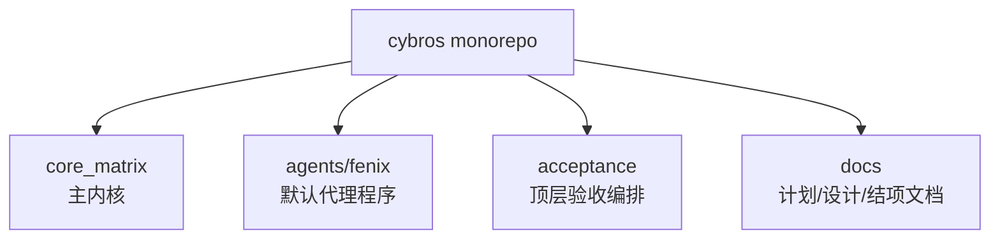

你当前位于入门路径中的这一页，目标不是学习某个具体功能，而是先建立一个清晰的心智模型：**这个仓库里谁负责内核、谁负责默认代理、谁负责验收编排、谁负责文档沉淀**。把这四个角色分清楚之后，再去读 [单仓库开发环境与关键命令](https://github.com/jasl/cybros.new/blob/main/3-dan-cang-ku-kai-fa-huan-jing-yu-guan-jian-ming-ling)、[内核职责：会话、工作流与治理](https://github.com/jasl/cybros.new/blob/main/6-nei-he-zhi-ze-hui-hua-gong-zuo-liu-yu-zhi-li) 和 [默认代理程序的定位与产品边界](https://github.com/jasl/cybros.new/blob/main/9-mo-ren-dai-li-cheng-xu-de-ding-wei-yu-chan-pin-bian-jie) 会更容易把内容放回正确的位置。 Sources: [README.md](https://github.com/jasl/cybros.new/blob/main/README.md#L3-L13) [docs/README.md](https://github.com/jasl/cybros.new/blob/main/docs/README.md#L16-L34)

## 一眼看懂仓库边界

`cybros` 是一个 monorepo，但它不是“一个大项目塞所有东西”的结构；它把产品代码、验收编排和文档资产拆成了不同层。根目录说明了两个产品主角：`core_matrix` 是内核产品，`agents/fenix` 是默认代理程序；而 `acceptance/` 和 `docs/` 则分别承担验收与文档生命周期管理。 Sources: [README.md](https://github.com/jasl/cybros.new/blob/main/README.md#L3-L13) [AGENTS.md](https://github.com/jasl/cybros.new/blob/main/AGENTS.md#L5-L14) [acceptance/README.md](https://github.com/jasl/cybros.new/blob/main/acceptance/README.md#L3-L10) [docs/README.md](https://github.com/jasl/cybros.new/blob/main/docs/README.md#L16-L34)

上面的图只表达“归属关系”，不展开实现细节：**core_matrix 负责平台能力，Fenix 负责具体代理产品，acceptance 负责跨项目验证，docs 负责把决策和状态沉淀下来**。这样分层的好处是，新手在读代码时不会把“运行时逻辑”“验证脚本”“文档记录”混为一谈。 Sources: [core_matrix/README.md](https://github.com/jasl/cybros.new/blob/main/core_matrix/README.md#L3-L13) [agents/fenix/README.md](https://github.com/jasl/cybros.new/blob/main/agents/fenix/README.md#L3-L9) [acceptance/README.md](https://github.com/jasl/cybros.new/blob/main/acceptance/README.md#L3-L10) [docs/README.md](https://github.com/jasl/cybros.new/blob/main/docs/README.md#L35-L58)

## 主要角色对照

下面这张表把最容易混淆的四个角色放在一起看。它只回答三个问题：**它是什么、负责什么、不负责什么**。 Sources: [core_matrix/README.md](https://github.com/jasl/cybros.new/blob/main/core_matrix/README.md#L46-L60) [agents/fenix/README.md](https://github.com/jasl/cybros.new/blob/main/agents/fenix/README.md#L22-L39) [acceptance/README.md](https://github.com/jasl/cybros.new/blob/main/acceptance/README.md#L3-L10) [docs/README.md](https://github.com/jasl/cybros.new/blob/main/docs/README.md#L35-L58)

| 角色 | 定位 | 主要职责 | 明确边界 |
|---|---|---|---|
| `core_matrix` | 核心内核产品 | 会话、工作流、运行时监督、治理、审计与平台能力 | 不是业务代理本身，也不是“所有能力的默认容器” |
| `agents/fenix` | 默认开箱即用的代理程序 | 既作为可用助手产品，也作为 Core Matrix 的首个真实验证程序 | 不是内核，不是未来所有产品形态的统一承载体 |
| `acceptance/` | 顶层验收编排 | 承载 shell 编排、Ruby 场景和支撑代码，用于跨产品验证 | 不是产品代码本身 |
| `docs/` | 文档生命周期与事实记录 | 管理提案、设计、计划、结项与归档材料 | 不是运行时逻辑，也不是 CI 的输入源 |

从新手视角看，这四者对应的是两条主线：**产品边界要清晰**，**验证和文档要独立于产品代码演进**。只要记住这两点，你就不容易把“代码该放哪”“验证该跑哪”“决策该记哪”混在一起。 Sources: [README.md](https://github.com/jasl/cybros.new/blob/main/README.md#L15-L36) [AGENTS.md](https://github.com/jasl/cybros.new/blob/main/AGENTS.md#L17-L31) [docs/finished-plans/README.md](https://github.com/jasl/cybros.new/blob/main/docs/finished-plans/README.md#L3-L11) [docs/plans/README.md](https://github.com/jasl/cybros.new/blob/main/docs/plans/README.md#L7-L23)

## 建议的阅读顺序

如果你是第一次进入这个仓库，建议按下面顺序读：先看开发环境，再看边界，再看文档生命周期，然后进入内核职责、默认代理和验收流程。这个顺序是按“从外到内、从稳定到变化”的方式组织的。 Sources: [docs/README.md](https://github.com/jasl/cybros.new/blob/main/docs/README.md#L16-L40) [docs/plans/README.md](https://github.com/jasl/cybros.new/blob/main/docs/plans/README.md#L7-L23) [docs/finished-plans/README.md](https://github.com/jasl/cybros.new/blob/main/docs/finished-plans/README.md#L3-L11)

| 顺序 | 页面 | 作用 |
|---|---|---|
| 1 | [单仓库开发环境与关键命令](https://github.com/jasl/cybros.new/blob/main/3-dan-cang-ku-kai-fa-huan-jing-yu-guan-jian-ming-ling) | 先把本地开发方式和常用命令搞清楚 |
| 2 | [项目边界与主要角色](https://github.com/jasl/cybros.new/blob/main/4-xiang-mu-bian-jie-yu-zhu-yao-jiao-se) | 先分清仓库里的四类角色 |
| 3 | [文档生命周期与阅读路线](https://github.com/jasl/cybros.new/blob/main/5-wen-dang-sheng-ming-zhou-qi-yu-yue-du-lu-xian) | 理解文档如何从提案走到结项 |
| 4 | [内核职责：会话、工作流与治理](https://github.com/jasl/cybros.new/blob/main/6-nei-he-zhi-ze-hui-hua-gong-zuo-liu-yu-zhi-li) | 进入 Core Matrix 的职责范围 |
| 5 | [默认代理程序的定位与产品边界](https://github.com/jasl/cybros.new/blob/main/9-mo-ren-dai-li-cheng-xu-de-ding-wei-yu-chan-pin-bian-jie) | 理解 Fenix 为什么存在、又不负责什么 |
| 6 | [接受性测试与手工回归流程](https://github.com/jasl/cybros.new/blob/main/12-jie-shou-xing-ce-shi-yu-shou-gong-hui-gui-liu-cheng) | 看验证如何把产品行为固定下来 |

把这条路线走完后，你就能把后续内容放进正确的“盒子”里：哪些属于内核，哪些属于代理程序，哪些属于验收，哪些只是文档记录。 Sources: [README.md](https://github.com/jasl/cybros.new/blob/main/README.md#L15-L47) [docs/README.md](https://github.com/jasl/cybros.new/blob/main/docs/README.md#L29-L59) [acceptance/README.md](https://github.com/jasl/cybros.new/blob/main/acceptance/README.md#L12-L29) [core_matrix/README.md](https://github.com/jasl/cybros.new/blob/main/core_matrix/README.md#L14-L45) [agents/fenix/README.md](https://github.com/jasl/cybros.new/blob/main/agents/fenix/README.md#L33-L39)