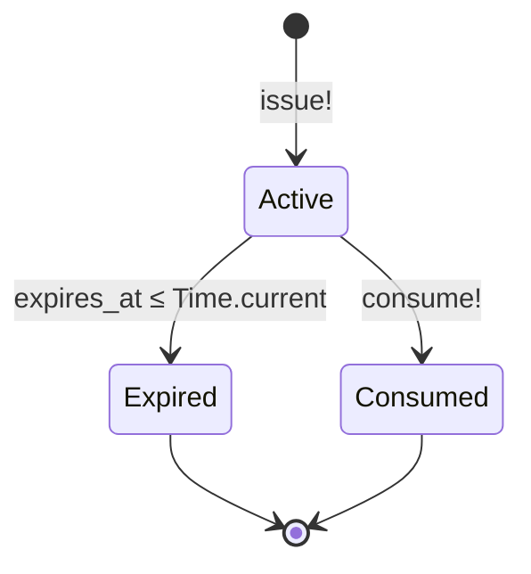
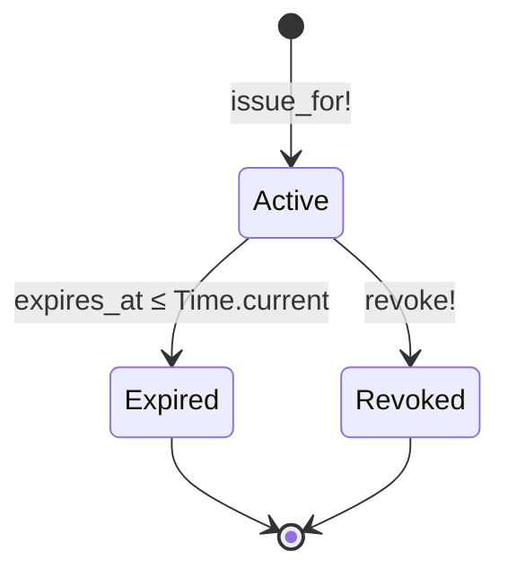
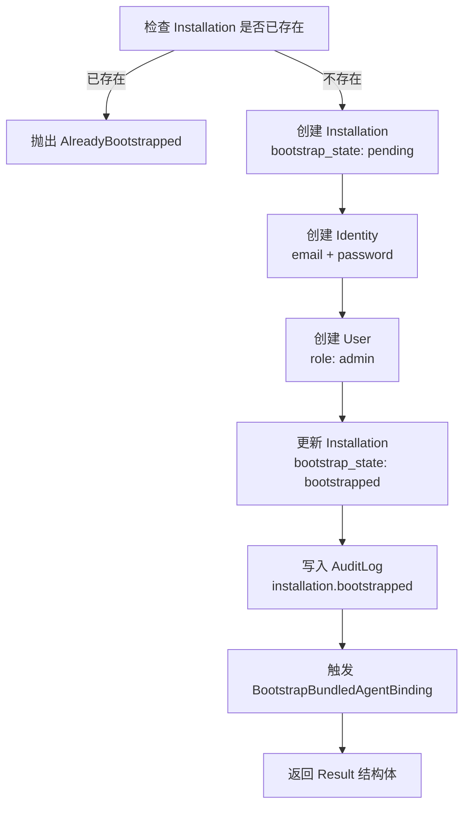
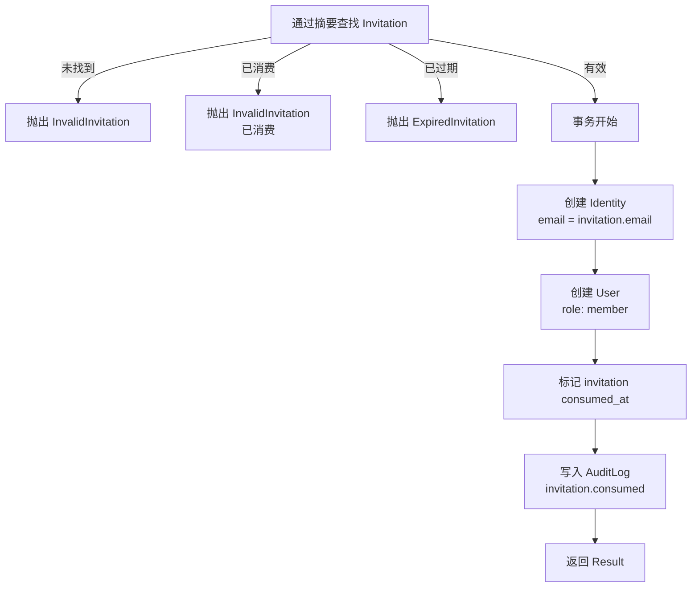
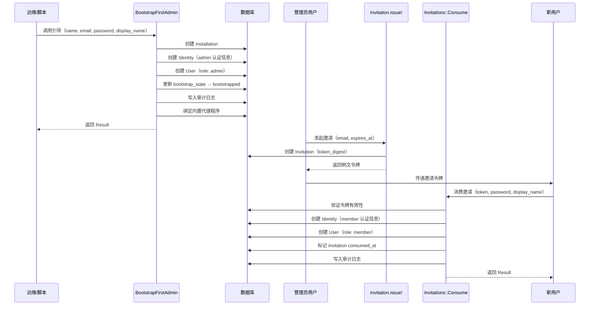

Core Matrix 的身份与安装子系统是整个平台的信任根基。它定义了一个**单行安装（single-row installation）**边界，在此边界内管理认证身份（Identity）、产品用户（User）、邀请流程（Invitation）、会话令牌（Session）以及安装级审计日志（AuditLog）。这些模型共同构成了一个**关注点分离**的身份架构：认证凭据与产品角色解耦、令牌以摘要形式存储、服务层（而非回调）驱动所有副作用。本文将系统性地剖析这六个核心模型、四个关键服务、两个可复用 Concern，以及从首次引导到日常用户管理的完整生命周期。

Sources: [installation-identity-and-audit-foundations.md](https://github.com/jasl/cybros.new/blob/main/core_matrix/docs/behavior/installation-identity-and-audit-foundations.md#L1-L94)

## 架构总览：六模型关系图

在深入每个模型之前，先从全局视角理解它们之间的关系。下图展示了从安装引导到日常会话管理的完整实体依赖链：

```mermaid
erDiagram
    Installation ||--o{ User : "has many"
    Installation ||--o{ Invitation : "has many"
    Installation ||--o{ AuditLog : "has many"
    Installation ||--o{ AgentProgram : "has many"
    Identity ||--o| User : "has one"
    Identity ||--o{ Session : "has many"
    User ||--o{ Invitation : "issued invitations"
    User ||--o{ Session : "has many"
    User ||--o{ UserProgramBinding : "has many"
    UserProgramBinding ||--o| Workspace : "default workspace"

    Installation {
        bigint id PK
        string name
        string bootstrap_state
        jsonb global_settings
    }
    Identity {
        bigint id PK
        string email UK
        string password_digest
        jsonb auth_metadata
        datetime disabled_at
    }
    User {
        bigint id PK
        uuid public_id UK
        bigint installation_id FK
        bigint identity_id FK UK
        string role
        string display_name
        jsonb preferences
    }
    Invitation {
        bigint id PK
        uuid public_id UK
        bigint installation_id FK
        bigint inviter_id FK
        string token_digest UK
        string email
        datetime expires_at
        datetime consumed_at
    }
    Session {
        bigint id PK
        uuid public_id UK
        bigint identity_id FK
        bigint user_id FK
        string token_digest UK
        datetime expires_at
        datetime revoked_at
        jsonb metadata
    }
    AuditLog {
        bigint id PK
        bigint installation_id FK
        string actor_type
        bigint actor_id
        string action
        string subject_type
        bigint subject_id
        jsonb metadata
    }
```

这个关系图揭示了三条核心设计线索：**Installation 是所有数据的租户边界**；**Identity 与 User 的 1:1 分离将认证关注点与产品关注点隔离**；**Invitation 和 Session 各自通过 SHA-256 摘要管理令牌，明文令牌仅在创建瞬间存在于内存中**。

Sources: [schema.rb](https://github.com/jasl/cybros.new/blob/main/core_matrix/db/schema.rb#L237-L250), [schema.rb](https://github.com/jasl/cybros.new/blob/main/core_matrix/db/schema.rb#L662-L708), [schema.rb](https://github.com/jasl/cybros.new/blob/main/core_matrix/db/schema.rb#L959-L974), [schema.rb](https://github.com/jasl/cybros.new/blob/main/core_matrix/db/schema.rb#L1249-L1262)

## Installation：单行安装边界

**Installation** 是 Core Matrix 的租户根聚合。整个系统在设计上只允许存在**唯一一行**安装记录，这条规则通过模型层的 `single_row_installation` 验证强制执行——在创建时检查是否已存在其他行，若存在则拒绝。

| 字段 | 类型 | 约束 | 说明 |
|------|------|------|------|
| `name` | `string` | NOT NULL | 安装显示名称 |
| `bootstrap_state` | `string` | NOT NULL, 默认 `"pending"` | 引导状态：`pending` → `bootstrapped` |
| `global_settings` | `jsonb` | NOT NULL, 默认 `{}` | 全局配置键值对 |

`bootstrap_state` 是一个仅迁移一次的状态机：从 `pending` 开始，在 `BootstrapFirstAdmin` 服务成功创建首个管理员后跃迁至 `bootstrapped`。这个状态不是可逆的——没有从 `bootstrapped` 回退到 `pending` 的路径。`global_settings` 目前作为扩展预留位，以空 JSON 对象初始化，供未来平台级配置使用。

Installation 模型通过 `has_many` 关联了几乎所有顶级资源：`users`、`invitations`、`audit_logs`、`agent_programs`、`execution_runtimes`、`agent_enrollments`、`agent_program_versions`、`agent_sessions`、`execution_sessions`、`user_program_bindings`、`workspaces`，所有关联都设置了 `dependent: :destroy`，意味着删除安装会级联清除所有租户数据。

Sources: [installation.rb](https://github.com/jasl/cybros.new/blob/main/core_matrix/app/models/installation.rb#L1-L35), [20260324090000_create_installations.rb](https://github.com/jasl/cybros.new/blob/main/core_matrix/db/migrate/20260324090000_create_installations.rb#L1-L12)

## Identity：认证关注点的独立聚合

**Identity** 封装了纯粹的认证信息，与产品层面的用户概念彻底分离。这种分离的设计意图是：认证机制（密码、OAuth、SSO）可能独立演进，而产品用户模型保持稳定。

| 字段 | 类型 | 约束 | 说明 |
|------|------|------|------|
| `email` | `string` | NOT NULL, UNIQUE | 经过 normalize 的邮箱地址 |
| `password_digest` | `string` | NOT NULL | bcrypt 密码哈希 |
| `auth_metadata` | `jsonb` | NOT NULL, 默认 `{}` | 认证扩展元数据 |
| `disabled_at` | `datetime` | nullable | 禁用时间戳，null 表示启用 |

关键行为细节：

- **邮箱规范化**：通过 `normalizes :email, with: ->(value) { value.to_s.strip.downcase }` 实现。存入数据库前自动去除首尾空白并转为小写，确保 `" ADMIN@example.COM "` 和 `"admin@example.com"` 指向同一条记录。
- **密码管理**：使用 Rails 内置的 `has_secure_password`（带 `reset_token: false`），底层依赖 bcrypt 生成 `password_digest`。创建时必须提供 `password` 和 `password_confirmation`。
- **禁用语义**：`disabled_at` 是一个时间戳而非布尔值。`disabled?` 检查 `disabled_at.present?`，`enabled?` 是其否定。这个设计使得禁用操作具备时间审计能力——不仅知道"被禁用了"，还知道"何时被禁用"。`scope :enabled` 过滤出 `disabled_at` 为 nil 的记录。
- **与 User 的关系**：`has_one :user, dependent: :destroy` 表示每个 Identity 最多对应一个产品用户。禁用 Identity 会级联删除关联的 User。

Sources: [identity.rb](https://github.com/jasl/cybros.new/blob/main/core_matrix/app/models/identity.rb#L1-L24), [20260324090001_create_identities.rb](https://github.com/jasl/cybros.new/blob/main/core_matrix/db/migrate/20260324090001_create_identities.rb#L1-L15)

## User：产品用户与角色模型

**User** 是产品层面的用户表示，承载安装归属、显示名称、角色和偏好设置。它与 Identity 通过 1:1 外键关联（`identity_id` 上有唯一索引），但两者的职责边界清晰：Identity 管"你是谁（认证）"，User 管"你能做什么（授权）"。

| 字段 | 类型 | 约束 | 说明 |
|------|------|------|------|
| `installation_id` | `bigint` | NOT NULL, FK | 所属安装 |
| `identity_id` | `bigint` | NOT NULL, FK, UNIQUE | 关联的身份记录 |
| `public_id` | `uuid` | NOT NULL, UNIQUE, 默认 `uuidv7()` | 外部可见标识符 |
| `role` | `string` | NOT NULL, 默认 `"member"` | 角色：`member` 或 `admin` |
| `display_name` | `string` | NOT NULL | 用户显示名称 |
| `preferences` | `jsonb` | NOT NULL, 默认 `{}` | 用户偏好设置 |

**角色系统**采用简单的二级模型：

- `member`（默认）：普通成员
- `admin`：管理员，可以邀请用户、授予/撤销管理员角色

角色操作通过 `admin!` 和 `member!` 方法直接更新，并由 `Users::GrantAdmin` 和 `Users::RevokeAdmin` 服务包装，确保审计日志的写入。`active_admins` scope 通过 `joins(:identity).merge(Identity.enabled)` 实现"活跃管理员"的精确语义——只有 identity 未被禁用的 admin 才被计入。这个定义对"最后管理员保护"至关重要。

User 通过 `HasPublicId` concern 获得 UUIDv7 外部标识符，可通过 `User.find_by_public_id!(public_id)` 进行外部查找。`issued_invitations` 关联使用 `dependent: :restrict_with_exception`，意味着如果用户 issued 了邀请，直接删除用户会抛出异常而非级联删除。

Sources: [user.rb](https://github.com/jasl/cybros.new/blob/main/core_matrix/app/models/user.rb#L1-L40), [20260324090002_create_users.rb](https://github.com/jasl/cybros.new/blob/main/core_matrix/db/migrate/20260324090002_create_users.rb#L1-L18)

## Invitation：基于摘要令牌的邀请流程

**Invitation** 实现了一次性、可过期的邀请令牌机制。其核心安全特征是：**令牌以 SHA-256 摘要形式存储，明文令牌仅在创建瞬间通过 `HasPlaintextToken` concern 保留在内存中**。

| 字段 | 类型 | 约束 | 说明 |
|------|------|------|------|
| `installation_id` | `bigint` | NOT NULL, FK | 所属安装 |
| `inviter_id` | `bigint` | NOT NULL, FK → users | 邀请发起人 |
| `public_id` | `uuid` | NOT NULL, UNIQUE | 外部标识符 |
| `token_digest` | `string` | NOT NULL, UNIQUE | SHA-256 令牌摘要 |
| `email` | `string` | NOT NULL | 被邀请人邮箱 |
| `expires_at` | `datetime` | NOT NULL | 过期时间 |
| `consumed_at` | `datetime` | nullable | 消费时间 |

邀请的生命周期通过三个状态谓词表达：



- `active?`：未消费且未过期（`!consumed? && !expired?`）
- `expired?`：`expires_at <= Time.current`
- `consumed?`：`consumed_at.present?`

令牌生成采用碰撞避免循环：`SecureRandom.hex(32)` 生成 64 字符十六进制字符串，计算 SHA-256 摘要后检查唯一性，若碰撞则重新生成。`Invitation.issue!` 工厂方法封装了完整的创建流程，返回的对象通过 `attach_plaintext_token` 挂载明文令牌，调用方应在此瞬间将令牌传递给邀请渠道（邮件、链接等），之后明文令牌即不可恢复。

Sources: [invitation.rb](https://github.com/jasl/cybros.new/blob/main/core_matrix/app/models/invitation.rb#L1-L61), [20260324090003_create_invitations.rb](https://github.com/jasl/cybros.new/blob/main/core_matrix/db/migrate/20260324090003_create_invitations.rb#L1-L20)

## Session：会话令牌与生命周期

**Session** 管理用户会话的令牌认证。与 Invitation 共享相同的令牌安全模式（SHA-256 摘要存储 + `HasPlaintextToken` 内存挂载），但生命周期状态机有所不同：

| 字段 | 类型 | 约束 | 说明 |
|------|------|------|------|
| `identity_id` | `bigint` | NOT NULL, FK | 关联的身份记录 |
| `user_id` | `bigint` | NOT NULL, FK | 关联的用户记录 |
| `public_id` | `uuid` | NOT NULL, UNIQUE | 外部标识符 |
| `token_digest` | `string` | NOT NULL, UNIQUE | SHA-256 会话令牌摘要 |
| `expires_at` | `datetime` | NOT NULL | 过期时间 |
| `revoked_at` | `datetime` | nullable | 撤销时间 |
| `metadata` | `jsonb` | NOT NULL, 默认 `{}` | 会话元数据（如 IP 地址） |



Session 同时关联 `identity` 和 `user`，这是有意为之的设计：即使 Identity 被禁用，历史会话记录仍保留完整的用户上下文。`metadata` 字段允许存储请求级别的上下文信息（如客户端 IP、User-Agent 等），为安全审计提供线索。

`Session.issue_for!` 是会话签发的工厂方法，接受 `identity`、`user`、`expires_at` 和可选的 `metadata`，返回挂载了明文令牌的 Session 实例。

Sources: [session.rb](https://github.com/jasl/cybros.new/blob/main/core_matrix/app/models/session.rb#L1-L59), [20260324090004_create_sessions.rb](https://github.com/jasl/cybros.new/blob/main/core_matrix/db/migrate/20260324090004_create_sessions.rb#L1-L20)

## AuditLog：安装级审计追踪

**AuditLog** 提供了安装范围内的不可变操作日志。每条审计记录关联到一个安装，并使用多态引用追踪操作的发起者（actor）和作用对象（subject）。

| 字段 | 类型 | 约束 | 说明 |
|------|------|------|------|
| `installation_id` | `bigint` | NOT NULL, FK | 所属安装 |
| `actor_type` / `actor_id` | polymorphic | nullable | 操作发起者 |
| `action` | `string` | NOT NULL | 操作标识符 |
| `subject_type` / `subject_id` | polymorphic | nullable | 操作对象 |
| `metadata` | `jsonb` | NOT NULL, 默认 `{}` | 结构化附加信息 |

**多态配对验证**是 AuditLog 的关键约束：`actor_type` 和 `actor_id` 必须同时出现或同时为空，`subject_type` 和 `subject_id` 同理。这种"要么完整要么空缺"的规则避免了半填充的多态引用导致的查询歧义。索引 `(installation_id, action)` 支持按安装和操作类型高效检索审计记录。

在身份子系统的上下文中，AuditLog 记录以下关键操作：

| action 字符串 | 触发服务 | actor | subject |
|---------------|----------|-------|---------|
| `installation.bootstrapped` | `BootstrapFirstAdmin` | 首个 admin User | Installation |
| `invitation.consumed` | `Invitations::Consume` | 新创建的 User | Invitation |
| `user.admin_granted` | `Users::GrantAdmin` | 执行授权的 admin User | 被授权的 User |
| `user.admin_revoked` | `Users::RevokeAdmin` | 执行撤销的 admin User | 被撤销的 User |

Sources: [audit_log.rb](https://github.com/jasl/cybros.new/blob/main/core_matrix/app/models/audit_log.rb#L1-L41), [20260324090005_create_audit_logs.rb](https://github.com/jasl/cybros.new/blob/main/core_matrix/db/migrate/20260324090005_create_audit_logs.rb#L1-L16)

## 服务层：业务编排的四个关键服务

Core Matrix 的身份子系统遵循一个严格的设计约束：**模型层不使用回调（callbacks）驱动副作用，所有业务编排都由服务层负责**。以下是四个核心服务的详细剖析。

### BootstrapFirstAdmin：首次引导

这是系统从零到一的服务。它在一个事务中完成以下操作：



服务接受 `name`、`email`、`password`、`password_confirmation`、`display_name` 和可选的 `bundled_agent_configuration` 参数。`AlreadyBootstrapped` 异常是幂等性保护——即使被意外多次调用也不会产生重复数据。返回的 `Result` 结构体包含 `installation`、`identity`、`user` 三个已持久化的对象。

在创建首个管理员之后，服务会自动调用 `BootstrapBundledAgentBinding`，尝试为用户绑定系统内置的代理程序（如 Fenix）。如果内置代理配置中 `enabled: false`，此步骤会被静默跳过。

Sources: [bootstrap_first_admin.rb](https://github.com/jasl/cybros.new/blob/main/core_matrix/app/services/installations/bootstrap_first_admin.rb#L1-L60)

### Invitations::Consume：邀请消费

此服务将一次性邀请令牌转化为一个新的安装成员：



三个验证关口确保安全性：令牌必须能解析到有效邀请（`InvalidInvitation`）、邀请未被消费（`InvalidInvitation`）、邀请未过期（`ExpiredInvitation`）。新用户始终以 `member` 角色创建——管理员身份的授予是后续的独立操作。

Sources: [consume.rb](https://github.com/jasl/cybros.new/blob/main/core_matrix/app/services/invitations/consume.rb#L1-L53)

### Users::GrantAdmin 与 RevokeAdmin：角色管理

这两个服务构成管理员角色的双向操作：

| 维度 | GrantAdmin | RevokeAdmin |
|------|------------|-------------|
| 安全校验 | 同安装验证 | 同安装验证 + 最后管理员保护 |
| 幂等性 | 已是 admin 时直接返回 | 已是 member 时直接返回 |
| 审计动作 | `user.admin_granted` | `user.admin_revoked` |
| 异常 | `ArgumentError`（跨安装） | `LastAdminError`（最后活跃管理员） |

**最后管理员保护**是 `RevokeAdmin` 的核心安全机制。它不仅检查是否是最后一个 `role: "admin"` 的用户，还进一步验证该用户的 Identity 是否仍然启用（`identity.enabled?`）。这意味着一个被禁用 Identity 的 admin 不被视为"活跃管理员"，不会阻止对其他 admin 的降级操作。

Sources: [grant_admin.rb](https://github.com/jasl/cybros.new/blob/main/core_matrix/app/services/users/grant_admin.rb#L1-L39), [revoke_admin.rb](https://github.com/jasl/cybros.new/blob/main/core_matrix/app/services/users/revoke_admin.rb#L1-L49)

## 可复用 Concern：HasPublicId 与 HasPlaintextToken

两个轻量级 Concern 为多个模型提供横切关注点的统一实现。

### HasPublicId

为模型提供 UUIDv7 外部标识符的查找能力。数据库层通过 `default: -> { "uuidv7()" }` 自动生成，Concern 层添加 `uniqueness` 验证和 `find_by_public_id!` 类方法。User、Invitation、Session 等所有需要暴露给外部的模型都包含此 Concern。

Sources: [has_public_id.rb](https://github.com/jasl/cybros.new/blob/main/core_matrix/app/models/concerns/has_public_id.rb#L1-L14)

### HasPlaintextToken

解决了一个微妙的安全问题：**令牌摘要必须存储在数据库中，但明文令牌需要在创建瞬间返回给调用方**。Concern 通过 `attr_reader :plaintext_token` 和 `attach_plaintext_token(token)` 方法实现：明文令牌仅作为实例变量存在于内存中，不持久化到数据库。调用方在 `issue!` 或 `issue_for!` 返回后应立即读取并分发明文令牌，因为一旦对象被回收，令牌即不可恢复。

Sources: [has_plaintext_token.rb](https://github.com/jasl/cybros.new/blob/main/core_matrix/app/models/concerns/has_plaintext_token.rb#L1-L13)

## 完整生命周期流程

将以上所有模型和服务组合在一起，从系统初始化到日常操作的完整流程如下：



Sources: [installation_bootstrap_flow_test.rb](https://github.com/jasl/cybros.new/blob/main/core_matrix/test/integration/installation_bootstrap_flow_test.rb#L1-L54)

## 从用户到代理：UserProgramBinding 与 Workspace

虽然 UserProgramBinding 和 Workspace 的完整语义将在 [代理注册、能力握手与部署生命周期](https://github.com/jasl/cybros.new/blob/main/6-dai-li-zhu-ce-neng-li-wo-shou-yu-bu-shu-sheng-ming-zhou-qi) 中详细展开，但它们与用户模型的连接关系在此需要理解：

**UserProgramBinding** 是用户与代理程序之间的多对多关联表，携带 `installation_id`、`user_id`、`agent_program_id` 和 `preferences` jsonb。它执行三个关键的安装一致性验证：用户必须属于同一安装、代理程序必须属于同一安装、个人代理（`personal?`）只能被其所有者绑定。

**Workspace** 是绑定下的私有工作空间，每个 UserProgramBinding 拥有恰好一个 `is_default: true` 的默认工作空间（通过部分唯一索引 `WHERE is_default` 强制）。`UserProgramBindings::Enable` 服务在绑定创建后自动调用 `Workspaces::CreateDefault`，确保每个用户-代理组合都有一个可用的工作空间。

Sources: [user_program_binding.rb](https://github.com/jasl/cybros.new/blob/main/core_matrix/app/models/user_program_binding.rb#L1-L43), [workspace.rb](https://github.com/jasl/cybros.new/blob/main/core_matrix/app/models/workspace.rb#L1-L54), [enable.rb](https://github.com/jasl/cybros.new/blob/main/core_matrix/app/services/user_program_bindings/enable.rb#L1-L49)

## 设计不变量与故障模式总结

| 不变量 | 强制机制 |
|--------|----------|
| 安装为单行 | `Installation` 模型的 `single_row_installation` 验证 |
| Identity 与 User 1:1 分离 | `identity_id` 上的唯一索引 + `has_one` 关联 |
| 令牌不以明文持久化 | SHA-256 摘要存储 + `HasPlaintextToken` 仅内存挂载 |
| 活跃管理员始终 ≥ 1 | `RevokeAdmin` 的 `LastAdminError` 保护 |
| 审计日志覆盖所有身份操作 | 服务层显式写入，不依赖回调 |
| 跨安装操作被禁止 | 服务层的 `installation_id` 一致性校验 |

| 故障模式 | 异常类型 |
|----------|----------|
| 重复引导 | `AlreadyBootstrapped` |
| 无效/已消费邀请 | `InvalidInvitation` |
| 过期邀请 | `ExpiredInvitation` |
| 跨安装角色操作 | `ArgumentError` |
| 撤销最后活跃管理员 | `LastAdminError` |
| 绑定非所属个人代理 | `AccessDenied` |

Sources: [installation-identity-and-audit-foundations.md](https://github.com/jasl/cybros.new/blob/main/core_matrix/docs/behavior/installation-identity-and-audit-foundations.md#L78-L94)

## 阅读进阶

本文覆盖了身份子系统的模型层、服务层和安全机制。以下是建议的后续阅读路径：

- **[代理注册、能力握手与部署生命周期](https://github.com/jasl/cybros.new/blob/main/6-dai-li-zhu-ce-neng-li-wo-shou-yu-bu-shu-sheng-ming-zhou-qi)**：了解 UserProgramBinding 如何将用户连接到代理程序，以及 AgentProgram 的注册与版本管理机制
- **[会话、轮次与对话树结构](https://github.com/jasl/cybros.new/blob/main/7-hui-hua-lun-ci-yu-dui-hua-shu-jie-gou)**：用户与代理程序的交互以 Conversation 为载体，此文详解其数据结构
- **[使用量计费、执行画像与审计日志](https://github.com/jasl/cybros.new/blob/main/15-shi-yong-liang-ji-fei-zhi-xing-hua-xiang-yu-shen-ji-ri-zhi)**：AuditLog 在更广泛的计费与合规上下文中的角色
- **[标识符策略：public_id 与 bigint 内部键的边界规则](https://github.com/jasl/cybros.new/blob/main/17-biao-shi-fu-ce-lue-public_id-yu-bigint-nei-bu-jian-de-bian-jie-gui-ze)**：理解 `HasPublicId` 背后的 UUIDv7 策略与内外边界规则