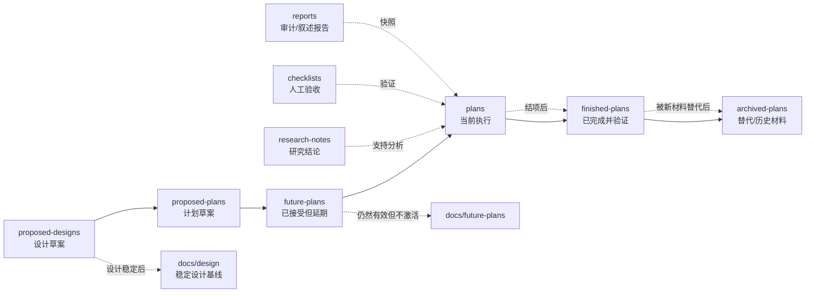

本页的作用，是把仓库里的文档分层、流转顺序和新手阅读路线讲清楚：你先要知道**文档应该放在哪里**，再知道**遇到当前状态时先看哪些文档**，最后才进入更深的架构与验证页面。你当前位于入门路径中的这一页，属于“从仓库入口过渡到深度阅读”的位置。Sources: [docs/README.md](https://github.com/jasl/cybros.new/blob/main/docs/README.md#L16-L58)

## 先建立一张生命周期地图

仓库把文档按“从草案到归档”的顺序组织：先是设计草案与计划草案，再是可延期的未来工作，然后进入正在执行的计划，完成并验证后进入结项区，最后把被替代或历史化的材料放入归档区。`docs/design`、`docs/research-notes`、`docs/checklists` 和 `docs/reports` 这几类目录不是执行主线的一部分，而是分别承载稳定设计、研究结论、人工验证和报告快照。Sources: [docs/README.md](https://github.com/jasl/cybros.new/blob/main/docs/README.md#L35-L58) [docs/proposed-designs/README.md](https://github.com/jasl/cybros.new/blob/main/docs/proposed-designs/README.md#L3-L16) [docs/proposed-plans/README.md](https://github.com/jasl/cybros.new/blob/main/docs/proposed-plans/README.md#L3-L15) [docs/future-plans/README.md](https://github.com/jasl/cybros.new/blob/main/docs/future-plans/README.md#L3-L25) [docs/research-notes/README.md](https://github.com/jasl/cybros.new/blob/main/docs/research-notes/README.md#L3-L25) [docs/checklists/README.md](https://github.com/jasl/cybros.new/blob/main/docs/checklists/README.md#L3-L13) [docs/reports/README.md](https://github.com/jasl/cybros.new/blob/main/docs/reports/README.md#L3-L18)

这个图的核心不是“谁更重要”，而是“**每类文档承担的时间角色不同**”：草案解决方向问题，计划解决执行问题，完成记录解决追溯问题，归档解决历史保留问题。Sources: [docs/README.md](https://github.com/jasl/cybros.new/blob/main/docs/README.md#L35-L58) [docs/finished-plans/README.md](https://github.com/jasl/cybros.new/blob/main/docs/finished-plans/README.md#L3-L11) [docs/archived-plans/README.md](https://github.com/jasl/cybros.new/blob/main/docs/archived-plans/README.md#L1-L6)

## 目录该怎么选

下面这张表可以直接当作“放哪儿”的判断表：如果你手里的是还没定型的方向，就放草案区；如果已经接受但暂时不执行，就放未来计划；如果正在做，就放计划区；如果做完并验证过，就放结项区；如果已经被替换，只保留历史追溯，就放归档区。Sources: [docs/proposed-designs/README.md](https://github.com/jasl/cybros.new/blob/main/docs/proposed-designs/README.md#L3-L16) [docs/proposed-plans/README.md](https://github.com/jasl/cybros.new/blob/main/docs/proposed-plans/README.md#L3-L15) [docs/future-plans/README.md](https://github.com/jasl/cybros.new/blob/main/docs/future-plans/README.md#L3-L25) [docs/plans/README.md](https://github.com/jasl/cybros.new/blob/main/docs/plans/README.md#L1-L39) [docs/finished-plans/README.md](https://github.com/jasl/cybros.new/blob/main/docs/finished-plans/README.md#L3-L11) [docs/archived-plans/README.md](https://github.com/jasl/cybros.new/blob/main/docs/archived-plans/README.md#L1-L6)

| 目录 | 作用 | 适合放什么 | 不适合放什么 |
|---|---|---|---|
| `docs/proposed-designs` | 设计草案 | 仍在讨论的设计方向 | 已确认的稳定基线 |
| `docs/proposed-plans` | 计划草案 | 还没准备进入执行队列的早期计划 | 当前执行计划、已延期但已接受的工作 |
| `docs/design` | 稳定设计基线 | 长期有效的设计说明 | 逐任务执行记录 |
| `docs/future-plans` | 延期但已接受的工作 | 后续阶段、暂不激活的路线图 | 当前执行中的工作 |
| `docs/plans` | 当前执行计划 | 现在要做的计划、设计或实现文档 | 已完成或已归档材料 |
| `docs/finished-plans` | 已完成结项记录 | 已完成、已验证的计划和里程碑 | 进行中的执行文档 |
| `docs/archived-plans` | 历史归档 | 被替代、撤回、失活的材料 | 当前活跃工作 |
| `docs/research-notes` | 研究记录 | 技术调研、方案比较、 retained conclusions | 作为当前产品契约的唯一依据 |
| `docs/checklists` | 人工验证 | 验收和回归清单 | 运行时生成的产物 |
| `docs/reports` | 报告快照 | 审计、叙述型报告 | 运行日志、证据包、截图导出 |

表里最重要的判断标准只有一个：**文档是否还在“推动当前工作”**。如果是，就留在计划或相关草案区；如果已经完成并验证，就转入结项；如果只是为了保留历史，就进入归档。Sources: [docs/README.md](https://github.com/jasl/cybros.new/blob/main/docs/README.md#L37-L58) [docs/plans/README.md](https://github.com/jasl/cybros.new/blob/main/docs/plans/README.md#L15-L38) [docs/finished-plans/README.md](https://github.com/jasl/cybros.new/blob/main/docs/finished-plans/README.md#L8-L11)

## 新手应该按什么顺序读

如果你是初学者，建议先从“仓库怎么用”开始，再看“项目边界”，然后才进入“文档生命周期”本页。接着看当前状态的计划与结项记录，最后再进入内核、运行时和验证页面，这样不会一开始就被大量历史文档淹没。Sources: [docs/README.md](https://github.com/jasl/cybros.new/blob/main/docs/README.md#L16-L58) [docs/plans/README.md](https://github.com/jasl/cybros.new/blob/main/docs/plans/README.md#L5-L38) [docs/finished-plans/README.md](https://github.com/jasl/cybros.new/blob/main/docs/finished-plans/README.md#L13-L57)

推荐阅读顺序如下：

1. [Overview](https://github.com/jasl/cybros.new/blob/main/1-overview)
2. [Quick Start](https://github.com/jasl/cybros.new/blob/main/2-quick-start)
3. [单仓库开发环境与关键命令](https://github.com/jasl/cybros.new/blob/main/3-dan-cang-ku-kai-fa-huan-jing-yu-guan-jian-ming-ling)
4. [项目边界与主要角色](https://github.com/jasl/cybros.new/blob/main/4-xiang-mu-bian-jie-yu-zhu-yao-jiao-se)
5. [文档生命周期与阅读路线](https://github.com/jasl/cybros.new/blob/main/5-wen-dang-sheng-ming-zhou-qi-yu-yue-du-lu-xian)
6. [内核职责：会话、工作流与治理](https://github.com/jasl/cybros.new/blob/main/6-nei-he-zhi-ze-hui-hua-gong-zuo-liu-yu-zhi-li)
7. [运行时模型：控制平面、Mailbox 与协作机制](https://github.com/jasl/cybros.new/blob/main/7-yun-xing-shi-mo-xing-kong-zhi-ping-mian-mailbox-yu-xie-zuo-ji-zhi)
8. [队列拓扑与提供方准入控制](https://github.com/jasl/cybros.new/blob/main/8-dui-lie-tuo-bu-yu-ti-gong-fang-zhun-ru-kong-zhi)
9. [接受性测试与手工回归流程](https://github.com/jasl/cybros.new/blob/main/12-jie-shou-xing-ce-shi-yu-shou-gong-hui-gui-liu-cheng)
10. [计划、设计与结项文档的协作方式](https://github.com/jasl/cybros.new/blob/main/13-ji-hua-she-ji-yu-jie-xiang-wen-dang-de-xie-zuo-fang-shi)
11. [运维参数：数据库池、队列与单机部署基线](https://github.com/jasl/cybros.new/blob/main/14-yun-wei-can-shu-shu-ju-ku-chi-dui-lie-yu-dan-ji-bu-shu-ji-xian)

这条路线的逻辑是：先理解仓库入口和当前状态，再看文档分层，之后再进入架构、运行时、验证和运维。这样你每读下一页，都能知道它在整个文档体系里扮演什么角色。Sources: [docs/README.md](https://github.com/jasl/cybros.new/blob/main/docs/README.md#L16-L58) [docs/design/README.md](https://github.com/jasl/cybros.new/blob/main/docs/design/README.md#L1-L24) [docs/checklists/README.md](https://github.com/jasl/cybros.new/blob/main/docs/checklists/README.md#L3-L13) [acceptance/README.md](https://github.com/jasl/cybros.new/blob/main/acceptance/README.md#L1-L30)

## 如果你只想找“当前真相”

当前实现状态优先看 `docs/plans`，因为那里放的是正在执行的工作；如果你想确认已经完成并验证过的变化，就看 `docs/finished-plans`；如果你在找当前的产品验收，就看 `docs/checklists` 和顶层 acceptance harness，而不是旧的历史路径。Sources: [docs/plans/README.md](https://github.com/jasl/cybros.new/blob/main/docs/plans/README.md#L5-L38) [docs/finished-plans/README.md](https://github.com/jasl/cybros.new/blob/main/docs/finished-plans/README.md#L3-L57) [docs/checklists/README.md](https://github.com/jasl/cybros.new/blob/main/docs/checklists/README.md#L3-L13) [acceptance/README.md](https://github.com/jasl/cybros.new/blob/main/acceptance/README.md#L3-L29)

## 读到这里以后怎么行动

如果你只是想沿着文档继续前进，就按上面的顺序读下去；如果你正在写新文档，就先判断它属于“草案、计划、执行、结项还是归档”，再决定放进哪个目录。只要先把位置放对，后面的协作和检索成本都会明显下降。Sources: [docs/README.md](https://github.com/jasl/cybros.new/blob/main/docs/README.md#L35-L58) [docs/proposed-designs/README.md](https://github.com/jasl/cybros.new/blob/main/docs/proposed-designs/README.md#L3-L16) [docs/proposed-plans/README.md](https://github.com/jasl/cybros.new/blob/main/docs/proposed-plans/README.md#L3-L15) [docs/finished-plans/README.md](https://github.com/jasl/cybros.new/blob/main/docs/finished-plans/README.md#L3-L11)