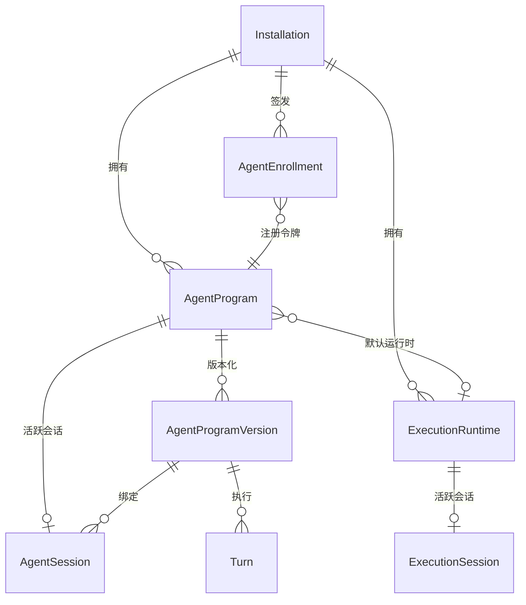
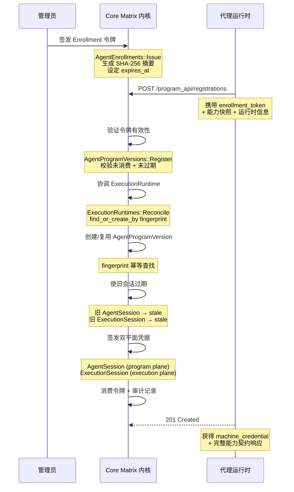
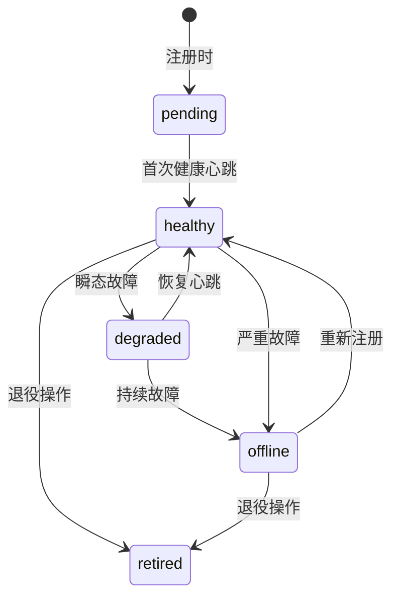
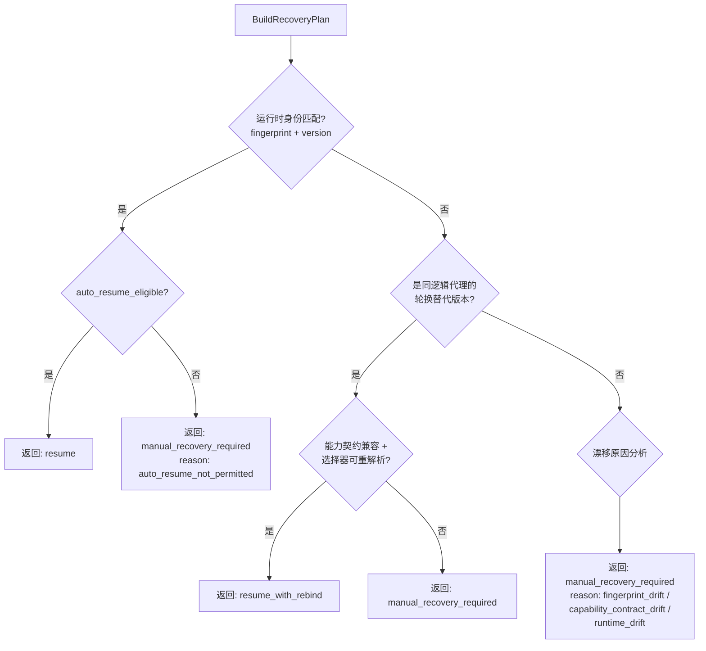

Core Matrix 的代理协议层（Agent Protocol Layer）是内核与外部代理运行时之间的**唯一信任边界**。这一层完成三个核心使命：通过一次性令牌交换建立持久身份、在每次能力变更时执行契约化握手、以及在整个部署生命周期中维护健康感知与故障恢复。本文将从领域模型、注册协议、能力契约、凭据安全、引导流程、故障检测与自动恢复七个维度，系统性地剖析这一子系统的架构设计与实现机制。

Sources: [agent-registration-and-capability-handshake.md](https://github.com/jasl/cybros.new/blob/main/core_matrix/docs/behavior/agent-registration-and-capability-handshake.md)

## 领域模型与核心实体关系

代理协议层涉及六个核心模型，它们围绕 `Installation` 边界组织成一个严格的有向无环依赖图。理解这些模型之间的身份委托关系，是掌握整个注册与握手流程的前提。



**AgentProgram** 是代理的逻辑身份。它通过 `key`（安装作用域内唯一）和 `visibility`（`personal` 或 `global`）确定一个代理的归属与可见范围。每个 `AgentProgram` 可选地关联一个 `default_execution_runtime`，指向其偏好的执行环境。模型通过 `lifecycle_state` 枚举（`active` / `retired`）控制逻辑层面的存续状态。[agent_program.rb](https://github.com/jasl/cybros.new/blob/main/core_matrix/app/models/agent_program.rb#L1-L51)

**AgentProgramVersion** 是代理的不可变能力快照。每次代理程序以新的 `fingerprint` 注册时，内核创建一条新的版本记录，冻结当时的 `protocol_methods`、`tool_catalog`、`profile_catalog`、`config_schema_snapshot`、`conversation_override_schema_snapshot` 和 `default_config_snapshot`。该模型一旦持久化即为只读（`readonly?` 在 `persisted?` 时返回 `true`），确保历史能力契约不可篡改。[agent_program_version.rb](https://github.com/jasl/cybros.new/blob/main/core_matrix/app/models/agent_program_version.rb#L1-L31)

**AgentSession** 是活跃连接的身份会话。它持有 `session_credential_digest` 和 `session_token_digest` 两个独立的凭据摘要，以及 `health_status`（`pending` → `healthy` → `degraded` → `offline` → `retired`）和 `lifecycle_state`（`active` → `stale` → `closed`）两个状态机。数据库层面通过部分唯一索引确保每个 `AgentProgram` 最多只有一个 `active` 会话。[agent_session.rb](https://github.com/jasl/cybros.new/blob/main/core_matrix/app/models/agent_session.rb#L1-L99)

**ExecutionRuntime** 代表执行环境（`local` / `container` / `remote`），拥有自己的 `capability_payload` 和 `tool_catalog`，并与 `AgentProgram` 处于正交维度——运行时能力独立于代理程序能力。[execution_runtime.rb](https://github.com/jasl/cybros.new/blob/main/core_matrix/app/models/execution_runtime.rb#L1-L57)

**ExecutionSession** 是运行时层面的身份会话，结构与 `AgentSession` 对称，但绑定到 `ExecutionRuntime` 而非 `AgentProgram`。[schema.rb](https://github.com/jasl/cybros.new/blob/main/core_matrix/db/schema.rb#L615-L631)

**AgentEnrollment** 是一次性注册令牌，用于在注册交换中将外部代理引导为受信的持久会话。它通过 SHA-256 摘要存储令牌，一次性消费后即标记 `consumed_at`。[agent_enrollment.rb](https://github.com/jasl/cybros.new/blob/main/core_matrix/app/models/agent_enrollment.rb#L1-L65)

Sources: [agent_program.rb](https://github.com/jasl/cybros.new/blob/main/core_matrix/app/models/agent_program.rb#L1-L51), [agent_program_version.rb](https://github.com/jasl/cybros.new/blob/main/core_matrix/app/models/agent_program_version.rb#L1-L31), [agent_session.rb](https://github.com/jasl/cybros.new/blob/main/core_matrix/app/models/agent_session.rb#L1-L99), [execution_runtime.rb](https://github.com/jasl/cybros.new/blob/main/core_matrix/app/models/execution_runtime.rb#L1-L57), [agent_enrollment.rb](https://github.com/jasl/cybros.new/blob/main/core_matrix/app/models/agent_enrollment.rb#L1-L65)

## 注册协议：从令牌到持久会话

注册是代理进入 Core Matrix 控制平面的**唯一入口**。整个流程遵循一次性令牌交换（Enrollment Token Exchange）模式：管理员预先签发一个 `AgentEnrollment`，代理运行时持有该令牌发起注册请求，内核验证后销毁令牌、创建持久凭据。



### 注册请求载荷

`ProgramAPI::RegistrationsController` 是整个 Program API 中**唯一不需要认证**的端点。注册请求必须包含以下关键载荷：

| 载荷字段 | 必需 | 用途 |
|---|---|---|
| `enrollment_token` | ✓ | 一次性注册令牌明文 |
| `fingerprint` | ✓ | 代理版本不可变指纹 |
| `protocol_version` | ✓ | 协议版本标识 |
| `sdk_version` | ✓ | SDK 版本标识 |
| `protocol_methods` | ✓ | 协议方法声明数组 |
| `tool_catalog` | ✓ | 工具目录声明数组 |
| `runtime_fingerprint` | ✗ | 执行环境指纹 |
| `runtime_kind` | ✗ | 运行时类型（默认 `local`） |
| `execution_capability_payload` | ✗ | 执行平面能力载荷 |
| `execution_tool_catalog` | ✗ | 执行平面工具目录 |

[registrations_controller.rb](https://github.com/jasl/cybros.new/blob/main/core_matrix/app/controllers/program_api/registrations_controller.rb#L1-L45)

### 注册服务的事务性保证

`AgentProgramVersions::Register` 在一个数据库事务中完成全部副作用操作。事务内部执行以下关键步骤：

1. **令牌验证**：通过 SHA-256 摘要查找 `AgentEnrollment`，校验未消费且未过期
2. **运行时协调**：若提供 `runtime_fingerprint`，调用 `ExecutionRuntimes::Reconcile` 执行 find-or-create，然后通过 `ExecutionRuntimes::RecordCapabilities` 更新能力载荷
3. **版本幂等创建**：按 `installation_id + fingerprint` 查找已有版本，若不存在则创建新的不可变快照
4. **旧会话过期**：将同一 `AgentProgram` 下所有 `active` 的 `AgentSession` 批量更新为 `stale`；将同一 `ExecutionRuntime` 下所有 `active` 的 `ExecutionSession` 批量更新为 `stale`
5. **凭据签发**：生成 `session_credential`（用于 Program API）和可选的 `execution_session_credential`（用于 Execution API）
6. **令牌消费**：将 `consumed_at` 设为当前时间，使令牌不可重放
7. **审计记录**：记录 `agent_session.registered` 审计事件

[register.rb](https://github.com/jasl/cybros.new/blob/main/core_matrix/app/services/agent_program_versions/register.rb#L57-L105)

### 内置代理的快捷路径

对于随 Core Matrix 一起部署的内置代理（如 Fenix），系统提供 `Installations::RegisterBundledAgentRuntime` 服务。该服务绕过令牌交换，直接在事务中协调 `ExecutionRuntime`、`AgentProgram`、`AgentProgramVersion`、`AgentSession` 和 `ExecutionSession` 的创建或刷新。如果已有活跃会话且绑定到同一版本，则刷新该会话（包括可选的预设凭据），否则使旧会话过期并创建新会话。[register_bundled_agent_runtime.rb](https://github.com/jasl/cybros.new/blob/main/core_matrix/app/services/installations/register_bundled_agent_runtime.rb#L55-L90)

Sources: [registrations_controller.rb](https://github.com/jasl/cybros.new/blob/main/core_matrix/app/controllers/program_api/registrations_controller.rb#L1-L45), [register.rb](https://github.com/jasl/cybros.new/blob/main/core_matrix/app/services/agent_program_versions/register.rb#L57-L105), [register_bundled_agent_runtime.rb](https://github.com/jasl/cybros.new/blob/main/core_matrix/app/services/installations/register_bundled_agent_runtime.rb#L55-L90)

## 能力契约：双平面快照与握手验证

Core Matrix 的能力契约（Capability Contract）采用**双平面架构**：程序平面（Program Plane）承载代理程序自身的能力声明，执行平面（Execution Plane）承载运行时环境的能力声明。两者的交集构成有效工具目录（Effective Tool Catalog）。

### RuntimeCapabilityContract 结构

`RuntimeCapabilityContract` 是能力契约的核心值对象，它将来自 `AgentProgramVersion` 和 `ExecutionRuntime` 的六维快照统一为一个标准化载荷：

| 维度 | 来源平面 | 描述 |
|---|---|---|
| `protocol_methods` | Program | 代理支持的协议方法 ID 列表 |
| `tool_catalog` | Program | 代理暴露的工具目录 |
| `profile_catalog` | Program | 配置文件目录（如子代理策略） |
| `config_schema_snapshot` | Program | 配置 JSON Schema 快照 |
| `conversation_override_schema_snapshot` | Program | 会话级覆盖 Schema 快照 |
| `default_config_snapshot` | Program | 默认配置值快照 |
| `execution_capability_payload` | Execution | 运行时能力元数据 |
| `execution_tool_catalog` | Execution | 运行时提供的工具目录 |

[runtime_capability_contract.rb](https://github.com/jasl/cybros.new/blob/main/core_matrix/app/models/runtime_capability_contract.rb#L16-L57)

### 有效工具目录的优先级合并

`effective_tool_catalog` 的合并遵循三层优先级，按 **Core Matrix 内核 → 执行运行时 → 代理程序** 的顺序首次出现胜出。保留前缀 `core_matrix__` 的系统工具和子代理工具（`subagent_spawn` 等）从普通合并路径中分离，确保系统工具不被覆盖。[runtime_capability_contract.rb](https://github.com/jasl/cybros.new/blob/main/core_matrix/app/models/runtime_capability_contract.rb#L116-L149)

### 能力握手机制

`ProgramAPI::CapabilitiesController` 提供两个端点：

- **`GET /program_api/capabilities`**（`method_id: "capabilities_refresh"`）：返回当前已认证会话的完整能力契约，无副作用
- **`POST /program_api/capabilities`**（`method_id: "capabilities_handshake"`）：执行能力握手，代理提交新的能力声明

握手的核心逻辑在 `AgentProgramVersions::Handshake` 中实现。它首先验证提交的 `fingerprint` 与已认证的 `AgentProgramVersion` 指纹匹配，然后构建一个候选版本对象进行校验（排除 `fingerprint` 唯一性冲突），如果执行运行时存在且提交了新的能力载荷则更新运行时能力，最后通过 `ToolBindings::ProjectCapabilitySnapshot` 投影持久的工具治理行。[handshake.rb](https://github.com/jasl/cybros.new/blob/main/core_matrix/app/services/agent_program_versions/handshake.rb#L52-L95)

### 能力契约比较与不可变性保证

`AgentProgramVersion` 提供 `matches_runtime_capability_contract?` 方法，用于在恢复时比较两个版本的能力契约是否一致。`comparable_contract_payload` 生成一个标准化哈希，包含六个维度字段用于精确比较。这种不可变快照 + 精确比较的设计是自动恢复安全性的基石——它确保只有在能力契约完全一致时，暂停的工作流才能被自动恢复。[agent_program_version.rb](https://github.com/jasl/cybros.new/blob/main/core_matrix/app/models/agent_program_version.rb#L120-L181)

Sources: [runtime_capability_contract.rb](https://github.com/jasl/cybros.new/blob/main/core_matrix/app/models/runtime_capability_contract.rb#L16-L149), [handshake.rb](https://github.com/jasl/cybros.new/blob/main/core_matrix/app/services/agent_program_versions/handshake.rb#L52-L95), [capabilities_controller.rb](https://github.com/jasl/cybros.new/blob/main/core_matrix/app/controllers/program_api/capabilities_controller.rb#L1-L57)

## 认证模型：摘要凭据与双平面隔离

Core Matrix 的认证模型遵循**摘要存储、明文不可逆**的原则。凭据在签发瞬间以 SHA-256 摘要形式持久化，明文仅返回一次，之后所有认证均通过摘要比对完成。

### 双平面凭据隔离

系统维护两套独立的凭据体系：

| 凭据类型 | 绑定实体 | 用途 | 认证方式 |
|---|---|---|---|
| `session_credential` | `AgentSession` | Program API 认证 | HTTP Token Auth |
| `session_token` | `AgentSession` | 预留令牌通道 | 未使用 |
| `execution_session_credential` | `ExecutionSession` | Execution API 认证 | HTTP Token Auth |
| `execution_session_token` | `ExecutionSession` | 预留令牌通道 | 未使用 |

`ProgramAPI::BaseController` 通过 `authenticate_agent_session!` 方法实现认证：从 HTTP `Authorization` 头部提取 Bearer Token，通过 `AgentSession.find_by_plaintext_session_credential` 查找匹配的会话。该查找执行 `SHA-256(plaintext) → digest → DB lookup` 三步操作，不存储明文。[base_controller.rb](https://github.com/jasl/cybros.new/blob/main/core_matrix/app/controllers/program_api/base_controller.rb#L18-L27)

### 单活跃会话约束

数据库层面通过 PostgreSQL 部分唯一索引实现"每个程序/运行时最多一个活跃会话"的约束：

```sql
-- agent_sessions 表
CREATE UNIQUE INDEX idx_agent_sessions_agent_program_active 
  ON agent_sessions (agent_program_id) 
  WHERE lifecycle_state = 'active';

-- execution_sessions 表
CREATE UNIQUE INDEX idx_execution_sessions_runtime_active 
  ON execution_sessions (execution_runtime_id) 
  WHERE lifecycle_state = 'active';
```

[schema.rb](https://github.com/jasl/cybros.new/blob/main/core_matrix/db/schema.rb#L184), [schema.rb](https://github.com/jasl/cybros.new/blob/main/core_matrix/db/schema.rb#L626)

Sources: [base_controller.rb](https://github.com/jasl/cybros.new/blob/main/core_matrix/app/controllers/program_api/base_controller.rb#L18-L27), [agent_session.rb](https://github.com/jasl/cybros.new/blob/main/core_matrix/app/models/agent_session.rb#L29-L49), [schema.rb](https://github.com/jasl/cybros.new/blob/main/core_matrix/db/schema.rb#L184-L190)

## 部署凭据生命周期

部署凭据生命周期由三个核心操作组成：**轮换**（Rotation）、**吊销**（Revocation）和**退役**（Retirement）。三者共享相同的安全原则——所有操作都是原子的、可审计的、不可逆的。

| 操作 | 服务 | 健康状态影响 | `auto_resume_eligible` | 审计动作 |
|---|---|---|---|---|
| 轮换 | `RotateMachineCredential` | 不变 | 不变 | `machine_credential_rotated` |
| 吊销 | `RevokeMachineCredential` | → `offline` | → `false` | `machine_credential_revoked` |
| 退役 | `Retire` | → `retired` | → `false` | `retired` |

**轮换**在事务内生成新的 `session_credential`，替换摘要，旧凭据立即失效。操作者获得新的明文凭据用于后续认证。[rotate_machine_credential.rb](https://github.com/jasl/cybros.new/blob/main/core_matrix/app/services/agent_program_versions/rotate_machine_credential.rb#L16-L32)

**吊销**不仅替换摘要（用一个不可达的随机值），还将 `health_status` 设为 `offline`、`auto_resume_eligible` 设为 `false`，并记录 `unavailability_reason = "machine_credential_revoked"`。这确保即使旧凭据泄露，也无法用于任何后续操作。[revoke_machine_credential.rb](https://github.com/jasl/cybros.new/blob/main/core_matrix/app/services/agent_program_versions/revoke_machine_credential.rb#L15-L37)

**退役**将活跃会话的 `lifecycle_state` 设为 `closed`、`health_status` 设为 `retired`，同时关闭控制活动状态。退役后的版本仍可作为历史行存在，但通过 `eligible_for_scheduling?`（要求 `active? && healthy?`）永久阻止新的工作流调度。[retire.rb](https://github.com/jasl/cybros.new/blob/main/core_matrix/app/services/agent_program_versions/retire.rb#L13-L33)

Sources: [rotate_machine_credential.rb](https://github.com/jasl/cybros.new/blob/main/core_matrix/app/services/agent_program_versions/rotate_machine_credential.rb#L16-L32), [revoke_machine_credential.rb](https://github.com/jasl/cybros.new/blob/main/core_matrix/app/services/agent_program_versions/revoke_machine_credential.rb#L15-L37), [retire.rb](https://github.com/jasl/cybros.new/blob/main/core_matrix/app/services/agent_program_versions/retire.rb#L13-L33)

## 引导流程：部署即工作流

`AgentProgramVersions::Bootstrap` 将部署引导实现为**标准自动化工作流**，而非隐藏的行更新。引导过程在事务中创建三个对象：

1. **自动化根会话**（`Conversations::CreateAutomationRoot`）：一个关联到指定工作区和代理程序的自动化对话
2. **系统内部轮次**（`Turns::StartAutomationTurn`）：使用 `origin_kind = "system_internal"`，`source_ref_type = "AgentProgramVersion"`，`source_ref_id` 为部署的 `public_id`
3. **引导工作流**（`Workflows::CreateForTurn`）：根节点为 `deployment_bootstrap` 类型

引导清单快照（`manifest_snapshot`）同时冻结在轮次的 `origin_payload` 和工作流节点的 `metadata` 中，确保引导意图可追溯。该设计意味着引导流程与普通工作流共享完全相同的调度、执行和监控基础设施。[bootstrap.rb](https://github.com/jasl/cybros.new/blob/main/core_matrix/app/services/agent_program_versions/bootstrap.rb#L17-L62)

Sources: [bootstrap.rb](https://github.com/jasl/cybros.new/blob/main/core_matrix/app/services/agent_program_versions/bootstrap.rb#L17-L62)

## 健康监测与故障检测

### 心跳与健康上报

代理运行时通过 `POST /program_api/heartbeats` 定期上报健康状态。`AgentProgramVersions::RecordHeartbeat` 服务更新 `AgentSession` 的 `health_status`、`health_metadata`、`auto_resume_eligible`、`unavailability_reason` 和时间戳。健康状态枚举为：



[agent_session.rb](https://github.com/jasl/cybros.new/blob/main/core_matrix/app/models/agent_session.rb#L5-L13), [record_heartbeat.rb](https://github.com/jasl/cybros.new/blob/main/core_matrix/app/services/agent_program_versions/record_heartbeat.rb#L17-L29)

### 故障标记与等待状态

`AgentProgramVersions::MarkUnavailable` 是控制平面感知代理不可用的入口服务。它根据严重程度（`severity`）分为两条路径：

**瞬态故障**（`severity = "transient"`）：
- 部署降级为 `degraded`
- 活跃工作流进入 `wait_state = "waiting"`，`wait_reason_kind = "agent_unavailable"`
- 恢复状态标记为 `transient_outage`
- 保留 `auto_resume_eligible` 原值
- 审计动作：`agent_program_version.degraded`

**持续故障**（其他严重程度）：
- 部署标记为 `offline`
- `auto_resume_eligible = false`
- 工作流升级为 `wait_reason_kind = "manual_recovery_required"`，恢复状态 `paused_agent_unavailable`
- 审计动作：`agent_program_version.paused_agent_unavailable`

`UnavailablePauseState` 模块负责构建等待状态载荷，包括冻结当前部署指纹、能力版本和任何已有阻塞器快照（通过 `WorkflowWaitSnapshot`），确保恢复时可以精确还原等待现场。[mark_unavailable.rb](https://github.com/jasl/cybros.new/blob/main/core_matrix/app/services/agent_program_versions/mark_unavailable.rb#L16-L47), [unavailable_pause_state.rb](https://github.com/jasl/cybros.new/blob/main/core_matrix/app/services/agent_program_versions/unavailable_pause_state.rb#L1-L54)

Sources: [record_heartbeat.rb](https://github.com/jasl/cybros.new/blob/main/core_matrix/app/services/agent_program_versions/record_heartbeat.rb#L17-L29), [mark_unavailable.rb](https://github.com/jasl/cybros.new/blob/main/core_matrix/app/services/agent_program_versions/mark_unavailable.rb#L16-L47), [unavailable_pause_state.rb](https://github.com/jasl/cybros.new/blob/main/core_matrix/app/services/agent_program_versions/unavailable_pause_state.rb#L1-L54)

## 自动恢复与漂移安全

自动恢复是部署生命周期中最精密的部分。它的核心原则是**漂移阻止静默继续**——只有在运行时身份和能力契约完全一致时，暂停的工作流才能被自动恢复。

### 恢复计划构建

`AgentProgramVersions::BuildRecoveryPlan` 是恢复决策的核心。它对当前暂停的工作流进行四层检查，返回三种可能的恢复动作之一：



[build_recovery_plan.rb](https://github.com/jasl/cybros.new/blob/main/core_matrix/app/services/agent_program_versions/build_recovery_plan.rb#L13-L20)

### 恢复目标验证

`AgentProgramVersions::ResolveRecoveryTarget` 是暂停工作目标解析的**统一契约**。它执行六项验证：

1. **安装一致性**：候选版本必须属于同一安装
2. **调度资格**：候选版本必须 `eligible_for_scheduling?`（活跃 + 健康）
3. **自动恢复资格**：若要求自动恢复，候选版本必须 `auto_resume_eligible?`
4. **执行环境一致性**：候选版本的默认运行时必须与暂停时冻结的运行时一致
5. **逻辑代理一致性**：候选版本必须属于同一 `AgentProgram`
6. **能力契约兼容性**：候选版本在暂停轮次上的工具表面必须与暂停时一致

通过全部验证后，服务在候选部署上重新解析模型选择器，返回 `AgentProgramVersionRecoveryTarget`。[resolve_recovery_target.rb](https://github.com/jasl/cybros.new/blob/main/core_matrix/app/services/agent_program_versions/resolve_recovery_target.rb#L44-L58)

### 轮次重绑定

当恢复目标是一个轮换后的替代版本时，`AgentProgramVersions::RebindTurn` 负责重写暂停轮次的绑定关系：

- 更新 `turn.agent_program_version` 指向替代版本
- 更新 `turn.pinned_program_version_fingerprint` 为替代版本的指纹
- 替换冻结的模型选择快照
- 重建轮次执行快照（通过 `Workflows::BuildExecutionSnapshot`）

[rebind_turn.rb](https://github.com/jasl/cybros.new/blob/main/core_matrix/app/services/agent_program_versions/rebind_turn.rb#L13-L29)

### 自动恢复执行流程

`AgentProgramVersions::AutoResumeWorkflows` 的执行前提是部署同时满足 `healthy?` 和 `auto_resume_eligible?`。它发现所有等待 `agent_unavailable` 的活跃工作流，对每个构建恢复计划，成功的恢复通过 `ApplyRecoveryPlan` 原子执行，失败的升级为 `manual_recovery_required`。[auto_resume_workflows.rb](https://github.com/jasl/cybros.new/blob/main/core_matrix/app/services/agent_program_versions/auto_resume_workflows.rb#L11-L29)

Sources: [build_recovery_plan.rb](https://github.com/jasl/cybros.new/blob/main/core_matrix/app/services/agent_program_versions/build_recovery_plan.rb#L13-L20), [resolve_recovery_target.rb](https://github.com/jasl/cybros.new/blob/main/core_matrix/app/services/agent_program_versions/resolve_recovery_target.rb#L44-L58), [rebind_turn.rb](https://github.com/jasl/cybros.new/blob/main/core_matrix/app/services/agent_program_versions/rebind_turn.rb#L13-L29), [auto_resume_workflows.rb](https://github.com/jasl/cybros.new/blob/main/core_matrix/app/services/agent_program_versions/auto_resume_workflows.rb#L11-L29)

## 配置协调：跨版本保留运行时拥有的值

`AgentProgramVersions::ReconcileConfig` 处理能力快照更新时的配置兼容性。它识别出运行时拥有的配置键（`interactive`、`model_slots`、`model_roles`、`subagents`），在新版本的 `default_config_snapshot` 中保留这些键的已有值——仅当新 Schema 仍然暴露这些属性时。协调结果报告 `status` 为 `exact`（无变更）或 `reconciled`（有保留键）。[reconcile_config.rb](https://github.com/jasl/cybros.new/blob/main/core_matrix/app/services/agent_program_versions/reconcile_config.rb#L17-L38)

Sources: [reconcile_config.rb](https://github.com/jasl/cybros.new/blob/main/core_matrix/app/services/agent_program_versions/reconcile_config.rb#L17-L38)

## Program API 端点总览

| HTTP 方法 | 路径 | 认证 | `method_id` | 功能 |
|---|---|---|---|---|
| `POST` | `/program_api/registrations` | ✗ | `program_registration` | 令牌交换注册 |
| `POST` | `/program_api/heartbeats` | ✓ | `agent_health` | 健康上报 |
| `GET` | `/program_api/health` | ✓ | `agent_health` | 健康查询 |
| `GET` | `/program_api/capabilities` | ✓ | `capabilities_refresh` | 能力刷新 |
| `POST` | `/program_api/capabilities` | ✓ | `capabilities_handshake` | 能力握手 |
| `POST` | `/program_api/control/poll` | ✓ | — | 控制邮箱轮询 |
| `POST` | `/program_api/control/report` | ✓ | — | 控制报告上报 |

[routes.rb](https://github.com/jasl/cybros.new/blob/main/core_matrix/config/routes.rb#L16-L45)

Sources: [routes.rb](https://github.com/jasl/cybros.new/blob/main/core_matrix/config/routes.rb#L16-L45)

## 架构设计原则总结

| 原则 | 体现 |
|---|---|
| **内核权威** | 凭据签发、调度资格、恢复决策全部由内核决定，代理运行时仅声明意图 |
| **不可变快照** | `AgentProgramVersion` 持久化后只读，历史能力契约不可篡改 |
| **摘要存储** | 所有凭据以 SHA-256 摘要存储，明文仅在签发时返回一次 |
| **漂移阻止静默继续** | 自动恢复要求指纹、能力版本、执行环境三者完全一致 |
| **显式恢复** | 漂移场景强制升级为 `manual_recovery_required`，不允许静默跳过 |
| **审计完整性** | 注册、心跳、轮换、吊销、退役、降级、恢复均写入审计日志 |
| **双平面隔离** | Program Plane 和 Execution Plane 拥有独立的凭据、会话和能力声明 |
| **单活跃约束** | 数据库部分唯一索引保证每个程序/运行时最多一个活跃会话 |

Sources: [agent-registration-and-capability-handshake.md](https://github.com/jasl/cybros.new/blob/main/core_matrix/docs/behavior/agent-registration-and-capability-handshake.md), [deployment-credential-lifecycle-controls.md](https://github.com/jasl/cybros.new/blob/main/core_matrix/docs/behavior/deployment-credential-lifecycle-controls.md), [deployment-bootstrap-and-recovery-flows.md](https://github.com/jasl/cybros.new/blob/main/core_matrix/docs/behavior/deployment-bootstrap-and-recovery-flows.md)

---

**继续阅读**：本文描述的代理会话在注册后被用于驱动会话中的轮次执行。理解会话如何消费代理能力，请参阅 [会话、轮次与对话树结构](https://github.com/jasl/cybros.new/blob/main/7-hui-hua-lun-ci-yu-dui-hua-shu-jie-gou)。若需了解代理运行时如何与邮箱控制平面交互以接收调度指令，请参阅 [邮箱控制平面：消息投递、租赁与实时推送](https://github.com/jasl/cybros.new/blob/main/10-you-xiang-kong-zhi-ping-mian-xiao-xi-tou-di-zu-ren-yu-shi-shi-tui-song)。关于工具如何被治理和绑定到具体部署，请参阅 [工具治理、绑定与 MCP Streamable HTTP 传输](https://github.com/jasl/cybros.new/blob/main/12-gong-ju-zhi-li-bang-ding-yu-mcp-streamable-http-chuan-shu)。