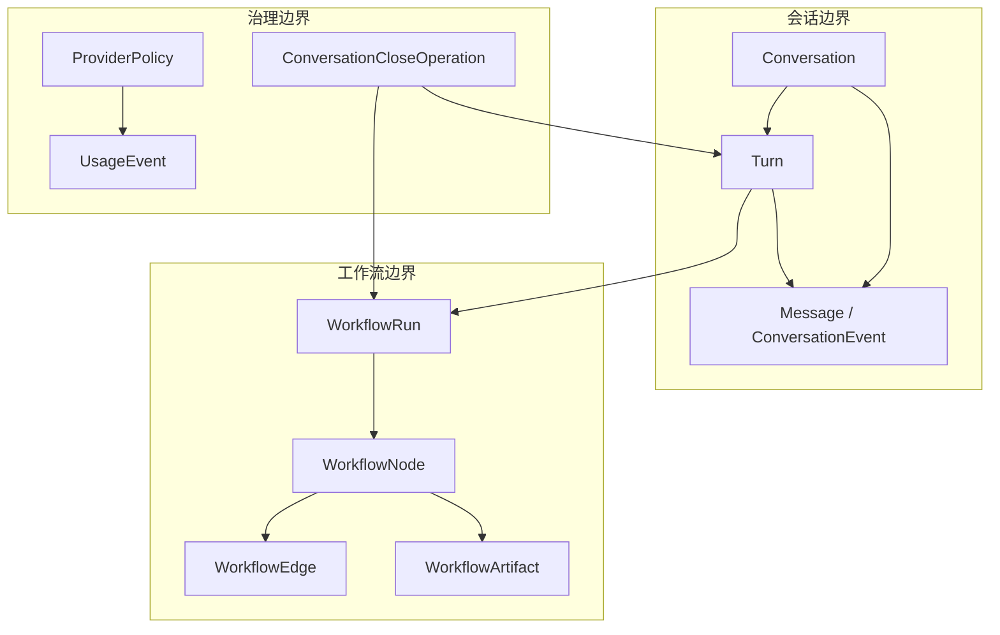

你当前位于“Deep Dive / 核心内核”下的本页，本页只解释 Core Matrix 内核如何把**会话历史**、**工作流执行**与**治理控制**收束到同一个安装级控制平面中；设计文档把内核明确定位为 user-facing control plane、runtime governor、audit authority 与 execution orchestrator，而仓库中的 `Conversation` / `Turn`、`WorkflowRun` / `WorkflowNode`、`ProviderPolicy` / `UsageEvent` 与关停服务正好构成这三条职责线。Sources: [docs/design/2026-03-24-core-matrix-kernel-greenfield-design.md](https://github.com/jasl/cybros.new/blob/main/docs/design/2026-03-24-core-matrix-kernel-greenfield-design.md#L11-L25), [docs/design/2026-03-24-core-matrix-kernel-greenfield-design.md](https://github.com/jasl/cybros.new/blob/main/docs/design/2026-03-24-core-matrix-kernel-greenfield-design.md#L56-L78), [docs/design/2026-03-24-core-matrix-kernel-greenfield-design.md](https://github.com/jasl/cybros.new/blob/main/docs/design/2026-03-24-core-matrix-kernel-greenfield-design.md#L193-L257)

下面这张图先看边界，再看协作：会话层负责内容与生命周期，工作流层负责把一次 turn 变成可调度、可等待、可终止的执行结构，治理层负责把 provider 选择、用量记账与关闭语义固定在内核里。Sources: [docs/design/2026-03-24-core-matrix-kernel-phase-shaping-design.md](https://github.com/jasl/cybros.new/blob/main/docs/design/2026-03-24-core-matrix-kernel-phase-shaping-design.md#L22-L29), [docs/design/2026-03-24-core-matrix-kernel-phase-shaping-design.md](https://github.com/jasl/cybros.new/blob/main/docs/design/2026-03-24-core-matrix-kernel-phase-shaping-design.md#L40-L55), [docs/design/2026-03-24-core-matrix-conversation-close-and-mailbox-control-protocol-design.md](https://github.com/jasl/cybros.new/blob/main/docs/design/2026-03-26-core-matrix-conversation-close-and-mailbox-control-protocol-design.md#L15-L41)

这张图对应的是仓库里已经落地的三组边界：会话对象及其状态、工作流运行与节点、以及提供方治理与用量记账。来源不是抽象设想，而是 `Conversation`、`Turn`、`WorkflowRun`、`WorkflowNode`、`ProviderPolicy`、`UsageEvent` 与关闭服务的实际约束。Sources: [core_matrix/app/models/conversation.rb](https://github.com/jasl/cybros.new/blob/main/core_matrix/app/models/conversation.rb#L1-L111), [core_matrix/app/models/turn.rb](https://github.com/jasl/cybros.new/blob/main/core_matrix/app/models/turn.rb#L1-L107), [core_matrix/app/models/workflow_run.rb](https://github.com/jasl/cybros.new/blob/main/core_matrix/app/models/workflow_run.rb#L1-L103), [core_matrix/app/models/workflow_node.rb](https://github.com/jasl/cybros.new/blob/main/core_matrix/app/models/workflow_node.rb#L1-L85), [core_matrix/app/models/provider_policy.rb](https://github.com/jasl/cybros.new/blob/main/core_matrix/app/models/provider_policy.rb#L1-L11), [core_matrix/app/models/usage_event.rb](https://github.com/jasl/cybros.new/blob/main/core_matrix/app/models/usage_event.rb#L1-L32)

## 会话：把历史、选择与生命周期固定下来

`Conversation` 是会话容器，持有 `installation`、`workspace`、`agent_program` 以及父子会话关系，并把 `messages`、`turns`、`conversation_events`、`workflow_runs`、`conversation_close_operations` 等历史挂在同一个根上；它还显式区分了 `kind`、`purpose`、`addressability`、`lifecycle_state` 和 `deletion_state`，同时维护特性开关快照与“是否正在关闭”的查询。`Turn` 则把一次执行固定为一组不可混淆的快照：它归属于同一 `installation` 与 `conversation`，绑定 `agent_program_version` 与可选 `execution_runtime`，并保存 `resolved_model_selection_snapshot`、`resolved_config_snapshot`、`execution_snapshot_payload`、`feature_policy_snapshot` 以及选中的输入/输出消息指针。Sources: [core_matrix/app/models/conversation.rb](https://github.com/jasl/cybros.new/blob/main/core_matrix/app/models/conversation.rb#L13-L111), [core_matrix/app/models/conversation.rb](https://github.com/jasl/cybros.new/blob/main/core_matrix/app/models/conversation.rb#L116-L200), [core_matrix/app/models/turn.rb](https://github.com/jasl/cybros.new/blob/main/core_matrix/app/models/turn.rb#L4-L57), [core_matrix/app/models/turn.rb](https://github.com/jasl/cybros.new/blob/main/core_matrix/app/models/turn.rb#L60-L107), [docs/design/2026-03-24-core-matrix-kernel-greenfield-design.md](https://github.com/jasl/cybros.new/blob/main/docs/design/2026-03-24-core-matrix-kernel-greenfield-design.md#L193-L235)

这里的关键不是“消息很多”，而是**会话状态是可验证的**：`Conversation` 负责树形结构、归档与删除语义，`Turn` 负责把一次生成/执行固定到特定的模型选择、配置与运行快照上；因此后续任何工作流或治理动作都能回到这组持久事实，而不是重新解释当前配置。Sources: [core_matrix/app/models/conversation.rb](https://github.com/jasl/cybros.new/blob/main/core_matrix/app/models/conversation.rb#L98-L146), [core_matrix/app/models/turn.rb](https://github.com/jasl/cybros.new/blob/main/core_matrix/app/models/turn.rb#L42-L56), [core_matrix/app/models/turn.rb](https://github.com/jasl/cybros.new/blob/main/core_matrix/app/models/turn.rb#L80-L99), [docs/design/2026-03-24-core-matrix-kernel-greenfield-design.md](https://github.com/jasl/cybros.new/blob/main/docs/design/2026-03-24-core-matrix-kernel-greenfield-design.md#L100-L111)

## 工作流：把一次 turn 变成可调度、可等待、可恢复的结构

`WorkflowRun` 是 turn 的执行实例，生命周期只区分 `active`、`completed`、`failed`、`canceled`，等待态则单独通过 `wait_state` 与 `wait_reason_kind` 表达；它把 `turn`、`conversation`、`installation` 绑在一起，并要求同一 conversation 只能有一个 active workflow。`WorkflowNode` 再把执行切成节点级事实：它有 `node_key`、`node_type`、`ordinal`、`decision_source`、`presentation_policy` 与节点生命周期状态，并把 `workspace`、`conversation`、`turn` 作为投影字段冻结在节点上。Sources: [core_matrix/app/models/workflow_run.rb](https://github.com/jasl/cybros.new/blob/main/core_matrix/app/models/workflow_run.rb#L4-L40), [core_matrix/app/models/workflow_run.rb](https://github.com/jasl/cybros.new/blob/main/core_matrix/app/models/workflow_run.rb#L42-L103), [core_matrix/app/models/workflow_run.rb](https://github.com/jasl/cybros.new/blob/main/core_matrix/app/models/workflow_run.rb#L105-L205), [core_matrix/app/models/workflow_node.rb](https://github.com/jasl/cybros.new/blob/main/core_matrix/app/models/workflow_node.rb#L6-L31), [core_matrix/app/models/workflow_node.rb](https://github.com/jasl/cybros.new/blob/main/core_matrix/app/models/workflow_node.rb#L33-L85), [core_matrix/app/models/workflow_node.rb](https://github.com/jasl/cybros.new/blob/main/core_matrix/app/models/workflow_node.rb#L86-L176)

`Workflows::CreateForTurn` 展示了会话如何进入工作流：它先解析模型选择器并构建执行快照，然后创建 `WorkflowRun`、根 `WorkflowNode`，最后按需创建初始 `AgentTaskRun` 并发出执行分配；`Workflows::Scheduler` 则只从 `active` 且非 `waiting` 的运行中挑选 `pending` 节点，并依据入边是否完成、是否 `required` 来判断节点是否可执行。换句话说，工作流不是“顺手执行一些事”，而是一个明确的、按节点推进的调度系统。Sources: [core_matrix/app/services/workflows/create_for_turn.rb](https://github.com/jasl/cybros.new/blob/main/core_matrix/app/services/workflows/create_for_turn.rb#L25-L102), [core_matrix/app/services/workflows/scheduler.rb](https://github.com/jasl/cybros.new/blob/main/core_matrix/app/services/workflows/scheduler.rb#L20-L52), [core_matrix/app/services/workflows/scheduler.rb](https://github.com/jasl/cybros.new/blob/main/core_matrix/app/services/workflows/scheduler.rb#L54-L116), [docs/design/2026-03-25-core-matrix-workflow-yield-and-intent-batch-design.md](https://github.com/jasl/cybros.new/blob/main/docs/design/2026-03-25-core-matrix-workflow-yield-and-intent-batch-design.md#L24-L61), [docs/design/2026-03-25-core-matrix-workflow-yield-and-intent-batch-design.md](https://github.com/jasl/cybros.new/blob/main/docs/design/2026-03-25-core-matrix-workflow-yield-and-intent-batch-design.md#L214-L280)

## 治理：把 provider、用量与关闭语义放在内核里

`ProviderPolicy` 的形状很小，但边界很硬：它只按 `installation` + `provider_handle` 存储 `selection_defaults`，说明 provider 选择默认值是安装级治理事实，而不是散落在运行时调用里的临时参数。`UsageEvent` 同样把治理放回安装边界：它记录 provider、模型、发生时间与 token/cost/latency 等计量，并校验 `user`、`workspace`、`agent_program`、`agent_program_version` 都必须属于同一 installation。Sources: [core_matrix/app/models/provider_policy.rb](https://github.com/jasl/cybros.new/blob/main/core_matrix/app/models/provider_policy.rb#L1-L11), [core_matrix/app/models/usage_event.rb](https://github.com/jasl/cybros.new/blob/main/core_matrix/app/models/usage_event.rb#L1-L32), [core_matrix/app/models/usage_event.rb](https://github.com/jasl/cybros.new/blob/main/core_matrix/app/models/usage_event.rb#L34-L68), [docs/design/2026-03-24-core-matrix-kernel-greenfield-design.md](https://github.com/jasl/cybros.new/blob/main/docs/design/2026-03-24-core-matrix-kernel-greenfield-design.md#L237-L257)

关闭语义也不是挂在 UI 上的边角流程，而是内核控制面的一部分：`Conversations::RequestClose` 会先建立或复用 `ConversationCloseOperation`，再按 `archive` 或 `delete` 语义处理会话状态，取消 queued turns，对 active turns 发起 `RequestTurnInterrupt`，并向 owned subagent sessions 与 background process runs 发起资源关闭请求；设计文档进一步把它概括为 mailbox/lease/deadline 驱动的控制平面，其中 `turn_interrupt` 是 kernel primitive，`close` 永远高于 `retry`。Sources: [core_matrix/app/services/conversations/request_close.rb](https://github.com/jasl/cybros.new/blob/main/core_matrix/app/services/conversations/request_close.rb#L20-L55), [core_matrix/app/services/conversations/request_close.rb](https://github.com/jasl/cybros.new/blob/main/core_matrix/app/services/conversations/request_close.rb#L63-L156), [docs/design/2026-03-26-core-matrix-conversation-close-and-mailbox-control-protocol-design.md](https://github.com/jasl/cybros.new/blob/main/docs/design/2026-03-26-core-matrix-conversation-close-and-mailbox-control-protocol-design.md#L15-L41), [docs/design/2026-03-26-core-matrix-conversation-close-and-mailbox-control-protocol-design.md](https://github.com/jasl/cybros.new/blob/main/docs/design/2026-03-26-core-matrix-conversation-close-and-mailbox-control-protocol-design.md#L192-L215)

## 这三条职责如何合成一个内核

把上面的事实连起来，内核的职责就很清楚：**Conversation** 保存“发生了什么”，**Turn/WorkflowRun/WorkflowNode** 决定“现在怎么执行”，**ProviderPolicy/UsageEvent/Close Operation** 决定“能不能执行、花了多少、什么时候必须停”。这也是为什么设计文档反复强调：内核是控制平面，而不是业务 agent 本身；它要对可持久化副作用、审计、调度与关闭负责，agent 程序只在这个边界之内表达业务意图。Sources: [docs/design/2026-03-24-core-matrix-kernel-greenfield-design.md](https://github.com/jasl/cybros.new/blob/main/docs/design/2026-03-24-core-matrix-kernel-greenfield-design.md#L56-L78), [docs/design/2026-03-24-core-matrix-kernel-greenfield-design.md](https://github.com/jasl/cybros.new/blob/main/docs/design/2026-03-24-core-matrix-kernel-greenfield-design.md#L80-L111), [docs/design/2026-03-24-core-matrix-kernel-greenfield-design.md](https://github.com/jasl/cybros.new/blob/main/docs/design/2026-03-24-core-matrix-kernel-greenfield-design.md#L193-L257)

如果你要继续读，最自然的顺序是先看 [运行时模型：控制平面、Mailbox 与协作机制](https://github.com/jasl/cybros.new/blob/main/7-yun-xing-shi-mo-xing-kong-zhi-ping-mian-mailbox-yu-xie-zuo-ji-zhi)，再看 [队列拓扑与提供方准入控制](https://github.com/jasl/cybros.new/blob/main/8-dui-lie-tuo-bu-yu-ti-gong-fang-zhun-ru-kong-zhi)；如果你更关心验证与落地，再接着看 [接受性测试与手工回归流程](https://github.com/jasl/cybros.new/blob/main/12-jie-shou-xing-ce-shi-yu-shou-gong-hui-gui-liu-cheng)。Sources: [docs/design/2026-03-24-core-matrix-kernel-phase-shaping-design.md](https://github.com/jasl/cybros.new/blob/main/docs/design/2026-03-24-core-matrix-kernel-phase-shaping-design.md#L22-L29), [docs/design/2026-03-26-core-matrix-conversation-close-and-mailbox-control-protocol-design.md](https://github.com/jasl/cybros.new/blob/main/docs/design/2026-03-26-core-matrix-conversation-close-and-mailbox-control-protocol-design.md#L27-L41), [docs/design/2026-03-25-core-matrix-workflow-yield-and-intent-batch-design.md](https://github.com/jasl/cybros.new/blob/main/docs/design/2026-03-25-core-matrix-workflow-yield-and-intent-batch-design.md#L244-L280)