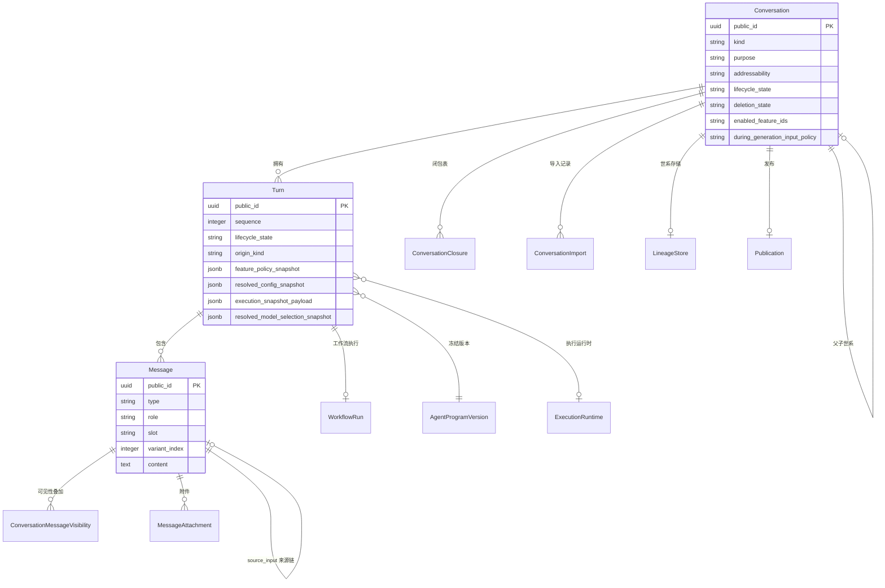
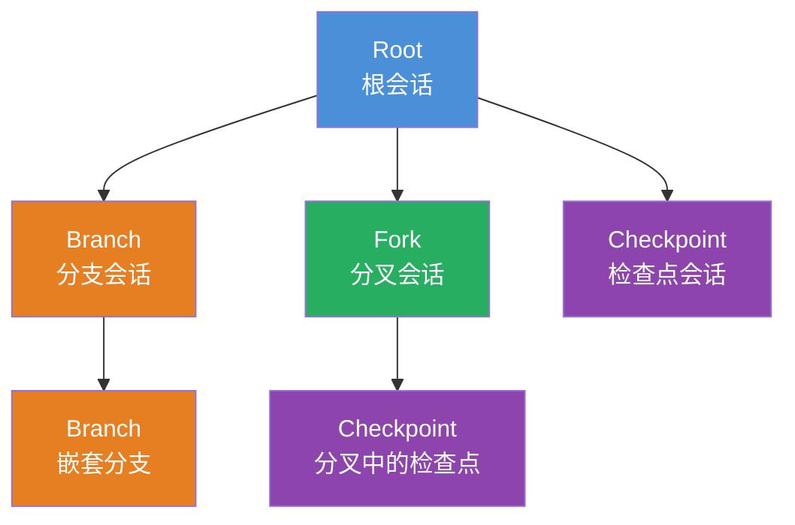
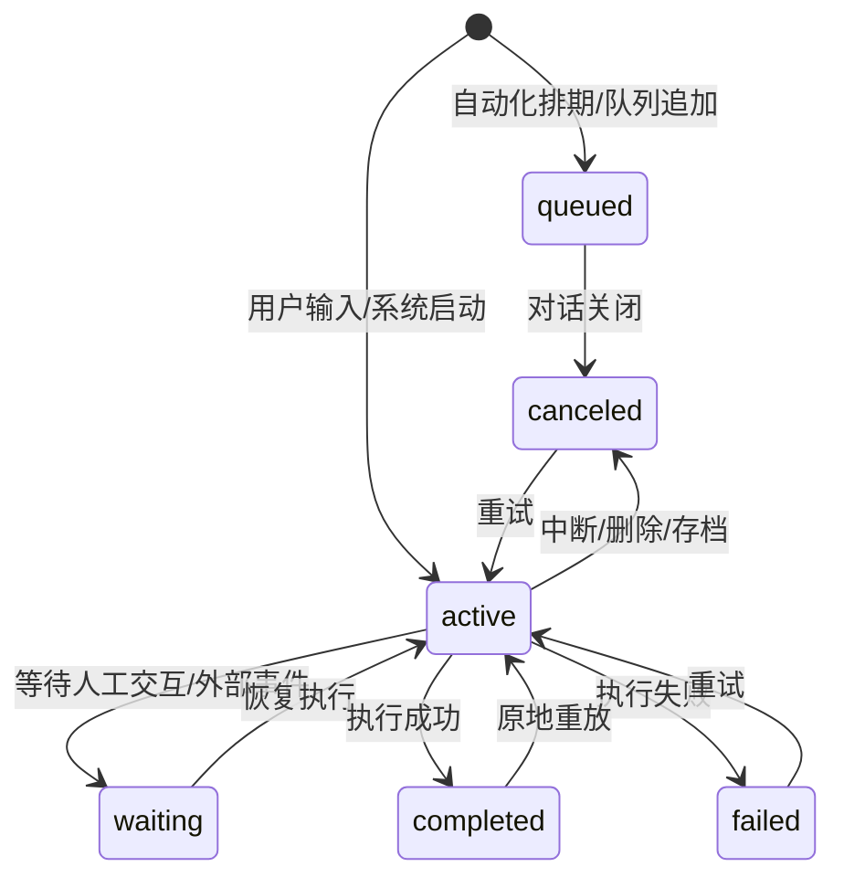
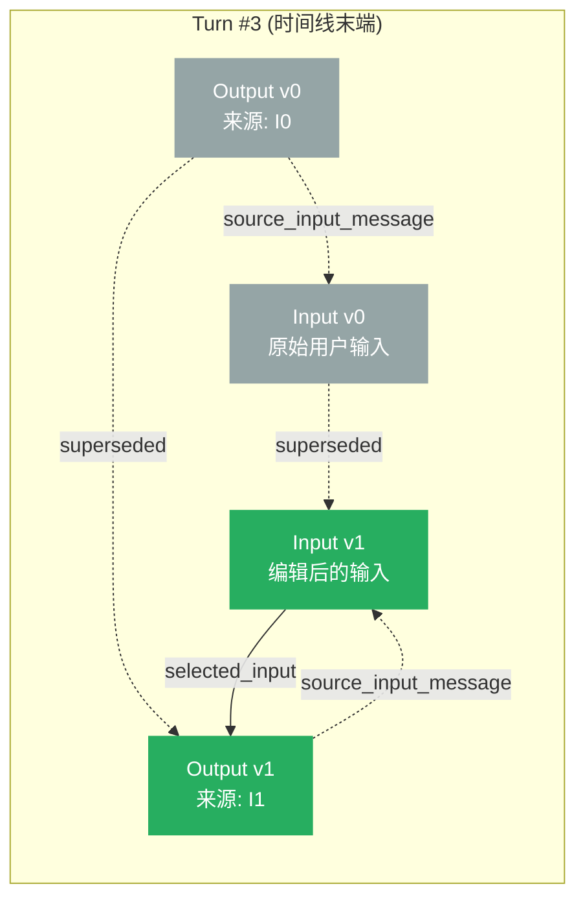
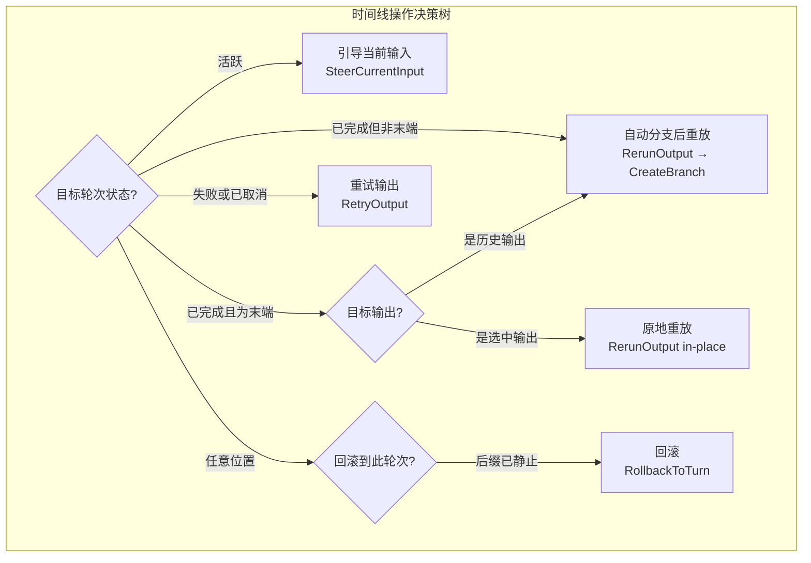
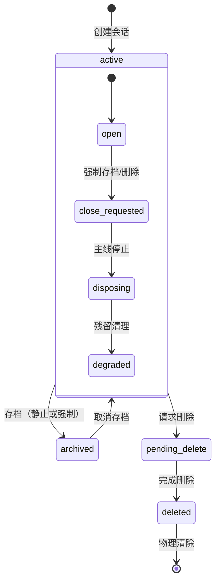

本文档深入解析 Core Matrix 内核中会话（Conversation）、轮次（Turn）与消息（Message）三大核心实体的领域模型设计、状态机语义与树形对话结构。这三个层次共同构成了 Cybros 平台对话持久化的骨干——会话是对话树的容器节点，轮次是时间线上的原子执行单元，消息则是以仅追加（append-only）方式组织的不可变转录记录。理解它们的交互方式是掌握后续 Provider 执行循环、工作流调度与子代理会话等高级特性的前提。

Sources: [conversation.rb](https://github.com/jasl/cybros.new/blob/main/core_matrix/app/models/conversation.rb#L1-L277), [turn.rb](https://github.com/jasl/cybros.new/blob/main/core_matrix/app/models/turn.rb#L1-L201), [message.rb](https://github.com/jasl/cybros.new/blob/main/core_matrix/app/models/message.rb#L1-L107)

## 领域模型总览

Core Matrix 的会话体系遵循一个严格分层的领域模型。每一层都有明确的所有权边界和不变量约束，确保对话数据在并发写入和长时间运行场景下的完整性。

上图展示了三大实体及其核心关联关系。值得注意的是，Conversation 之间通过 `ConversationClosure` 闭包表实现高效的树形世系查询，而 Turn 通过 `selected_input_message` 和 `selected_output_message` 两个显式指针追踪当前活跃的转录路径。

Sources: [conversation.rb](https://github.com/jasl/cybros.new/blob/main/core_matrix/app/models/conversation.rb#L53-L97), [turn.rb](https://github.com/jasl/cybros.new/blob/main/core_matrix/app/models/turn.rb#L30-L41), [message.rb](https://github.com/jasl/cybros.new/blob/main/core_matrix/app/models/message.rb#L8-L36)

## 会话实体：六轴状态模型

会话是整个对话树的根容器。它的设计核心在于将关注点分离为**六个相互独立的状态轴**，避免将所有语义塞进一个 overloaded 的状态字段。

| 状态轴 | 枚举值 | 语义说明 |
|--------|--------|----------|
| **kind**（世系形态） | `root` / `branch` / `fork` / `checkpoint` | 描述会话在对话树中的结构位置 |
| **purpose**（用途） | `interactive` / `automation` | 区分人工交互会话与自动化会话 |
| **addressability**（可达性） | `owner_addressable` / `agent_addressable` | 控制谁可以向此会话投递轮次 |
| **lifecycle_state**（生命周期） | `active` / `archived` | 用户可见的存档状态 |
| **deletion_state**（删除状态） | `retained` / `pending_delete` / `deleted` | 安全删除流程的进度追踪 |
| **feature policy**（特性策略） | `enabled_feature_ids` + `during_generation_input_policy` | 会话级特性开关与生成中输入策略 |

这种六轴分离设计意味着一个会话可以同时是 `agent_addressable`（代理可达）且 `active`（活跃），或者是 `owner_addressable`（用户可达）且 `archived`（已存档），甚至是 `active`（生命周期仍活跃）但 `pending_delete`（正在等待安全删除清理完成）。每个轴的变化都有独立的守卫条件和状态转换服务。

Sources: [conversation.rb](https://github.com/jasl/cybros.new/blob/main/core_matrix/app/models/conversation.rb#L4-L51), [conversation-structure-and-lineage.md](https://github.com/jasl/cybros.new/blob/main/core_matrix/docs/behavior/conversation-structure-and-lineage.md#L17-L58), [schema.rb](https://github.com/jasl/cybros.new/blob/main/core_matrix/db/schema.rb) (conversations 表)

### 特性策略与冻结语义

特性策略（Feature Policy）是会话级持久化状态，不是 UI 提示信息，也不是在请求参数中动态重建的计算值。它包含两部分：`enabled_feature_ids` 控制哪些内核特性在此会话中可用（如 `human_interaction`、`tool_invocation`、`conversation_branching` 等），`during_generation_input_policy` 则定义当模型正在生成输出时新到达的用户输入应该如何处理（`reject` / `restart` / `queue`）。

关键的冻结语义在于：**当轮次被创建时，它会对当时的特性策略拍一个快照（`feature_policy_snapshot`）**。后续对会话级策略的修改只影响新创建的轮次，不会追溯修改正在执行中的轮次的策略行为。这确保了在策略变更期间已有工作的审计一致性和执行确定性。

Sources: [conversation.rb](https://github.com/jasl/cybros.new/blob/main/core_matrix/app/models/conversation.rb#L137-L169), [turn.rb](https://github.com/jasl/cybros.new/blob/main/core_matrix/app/models/turn.rb#L92-L99), [turn-entry-and-selector-state.md](https://github.com/jasl/cybros.new/blob/main/core_matrix/docs/behavior/turn-entry-and-selector-state.md#L71-L78)

### 可变性守卫

所有对会话的"活跃写入"操作（创建轮次、分支、导入、可见性更新、覆盖设置变更等）都必须通过统一的可变性守卫链。这套守卫以意图驱动而非命名空间别名的方式组织：

- **`ValidateMutableState`** — 验证但不加锁，适合只读预检
- **`WithMutableStateLock`** — 加行锁并验证，是最通用的写入守卫
- **`WithConversationEntryLock`** — 封装了 `WithMutableStateLock` 的简化入口
- **`WithRetainedStateLock`** / **`WithRetainedLifecycleLock`** — 针对存档和删除流的专用守卫

每个守卫都会检查三个核心条件：会话必须是 `retained`（未进入删除流程）、必须是 `active`（未存档）、且没有未完成的关闭操作（`ConversationCloseOperation`）。这确保了并发存档请求或删除请求不会在竞态条件下漏过新的写入操作。

Sources: [validate_mutable_state.rb](https://github.com/jasl/cybros.new/blob/main/core_matrix/app/services/conversations/validate_mutable_state.rb#L1-L62), [with_mutable_state_lock.rb](https://github.com/jasl/cybros.new/blob/main/core_matrix/app/services/conversations/with_mutable_state_lock.rb#L1-L44), [with_conversation_entry_lock.rb](https://github.com/jasl/cybros.new/blob/main/core_matrix/app/services/conversations/with_conversation_entry_lock.rb#L1-L28), [conversation-structure-and-lineage.md](https://github.com/jasl/cybros.new/blob/main/core_matrix/docs/behavior/conversation-structure-and-lineage.md#L270-L284)

## 对话树结构：闭包表世系与四种形态

Core Matrix 使用**闭包表（Closure Table）**模式来管理对话树的世系关系。这是比邻接表（Adjacency List）或物化路径（Materialized Path）更高效的选择，特别是当需要查询任意深度的祖先或后代时。

### 四种会话形态

| 形态 | 父会话 | 历史锚点 | 转录继承 | 典型用途 |
|------|--------|----------|----------|----------|
| **Root** | ❌ 必须为空 | ❌ 必须为空 | 无（起点） | 新对话、自动化会话 |
| **Branch** | ✅ 必须 | ✅ 必须 | 锚点之前的父会话转录 | 重放历史输出、探索替代方案 |
| **Fork** | ✅ 必须 | 可选 | 父会话完整转录 | 子代理会话、并行对话 |
| **Checkpoint** | ✅ 必须 | ✅ 必须 | 锚点之前的父会话转录 | 保存时间线快照 |

**Branch（分支）** 在某个历史消息处从父会话"分叉"出来。它继承父会话转录直到锚点消息（`historical_anchor_message`），之后拥有自己独立的轮次时间线。Branch 创建时还会自动创建一条 `branch_prefix` 类型的 `ConversationImport` 记录来追踪前缀来源。

**Fork（分叉）** 继承父会话的**完整**转录历史并在此基础上追加自己的轮次。它不要求指定锚点（但可选记录一个用于溯源）。Fork 的典型应用场景是子代理会话（`SubagentSession`），子代理在自己的 fork 中执行任务，拥有独立的轮次时间线但能看到父会话的完整上下文。

**Checkpoint（检查点）** 与 Branch 类似，也需要锚点消息。它表示对时间线某个位置的显式命名快照，用于后续可能的时间线恢复或审计回溯。

Sources: [conversation.rb](https://github.com/jasl/cybros.new/blob/main/core_matrix/app/models/conversation.rb#L13-L20), [create_branch.rb](https://github.com/jasl/cybros.new/blob/main/core_matrix/app/services/conversations/create_branch.rb#L1-L59), [create_fork.rb](https://github.com/jasl/cybros.new/blob/main/core_matrix/app/services/conversations/create_fork.rb#L1-L52), [create_checkpoint.rb](https://github.com/jasl/cybros.new/blob/main/core_matrix/app/services/conversations/create_checkpoint.rb#L1-L50), [conversation-structure-and-lineage.md](https://github.com/jasl/cybros.new/blob/main/core_matrix/docs/behavior/conversation-structure-and-lineage.md#L82-L99)

### 闭包表世系

`ConversationClosure` 表存储了每对祖先-后代关系及其深度值。每个会话创建时都会生成一条自引用闭包行（`depth = 0`），子会话则继承父会话的所有祖先闭包并将深度加一。

这种设计使得查询任意会话的所有后代变得高效——只需一次索引查询 `WHERE ancestor_conversation_id = ?`，而无需递归遍历 `parent_conversation_id` 链。创建子会话时的闭包继承逻辑在 `CreationSupport` 模块中实现：遍历父会话的所有祖先闭包，为每个祖先创建一条指向新会话的闭包行（深度 +1），最后添加自引用闭包。

Sources: [conversation_closure.rb](https://github.com/jasl/cybros.new/blob/main/core_matrix/app/models/conversation_closure.rb#L1-L33), [creation_support.rb](https://github.com/jasl/cybros.new/blob/main/core_matrix/app/services/conversations/creation_support.rb#L51-L72), [create_conversation_closures.rb](https://github.com/jasl/cybros.new/blob/main/core_matrix/db/migrate/20260324090020_create_conversation_closures.rb#L1-L18)

### 转录投影与历史锚点验证

**转录投影（Transcript Projection）** 是构建对话完整可见转录路径的核心机制。它递归地沿 `parent_conversation` 链向上组装消息序列：

- **Root 会话**：直接按轮次序列号排序，收集每个轮次的 `selected_input_message` 和 `selected_output_message`
- **Fork 会话**：先递归获取父会话的完整转录，再追加自己的轮次消息
- **Branch / Checkpoint 会话**：先递归获取父会话到历史锚点为止的转录前缀（通过 `HistoricalAnchorProjection`），再追加自己的轮次消息

**历史锚点验证**确保锚点消息确实属于父会话的可访问转录历史。验证逻辑不仅检查消息是否存在于父会话中，还支持锚定到父会话中非选中状态的历史变体（variant）——这意味着即使父会话后来选择了不同的输出变体，子会话仍然能正确追溯到自己分支时的那个具体输出。

Sources: [transcript_projection.rb](https://github.com/jasl/cybros.new/blob/main/core_matrix/app/services/conversations/transcript_projection.rb#L1-L88), [historical_anchor_projection.rb](https://github.com/jasl/cybros.new/blob/main/core_matrix/app/services/conversations/historical_anchor_projection.rb#L1-L80), [context_projection.rb](https://github.com/jasl/cybros.new/blob/main/core_matrix/app/services/conversations/context_projection.rb#L1-L79)

## 轮次实体：时间线上的执行单元

轮次（Turn）是会话时间线上的原子执行单元，承载了与 LLM 交互的完整生命周期。每个轮次冻结了当时的代理程序版本、特性策略和模型选择快照，形成了一个自包含的执行上下文。

### 生命周期状态机

| 状态 | 含义 | 允许的操作 |
|------|------|------------|
| `queued` | 已排队等待执行，尚无活跃工作 | 取消 |
| `active` | 正在执行中，有活跃的工作流运行 | 引导输入、中断 |
| `waiting` | 等待外部条件（人工交互、子代理等） | 恢复、中断 |
| `completed` | 执行完成，产出已持久化 | 原地重放、分支重放 |
| `failed` | 执行失败 | 重试 |
| `canceled` | 被显式取消 | 重试 |

`Turn.terminal?` 方法将 `completed`、`failed`、`canceled` 三个状态统一识别为终态。`Turn.tail_in_active_timeline?` 方法则判断该轮次是否在当前活跃时间线的最末端——这是一个关键的判断条件，因为许多写入操作（如编辑尾部输入、选择输出变体）只允许作用于时间线末端的轮次。

Sources: [turn.rb](https://github.com/jasl/cybros.new/blob/main/core_matrix/app/models/turn.rb#L4-L62), [turn-entry-and-selector-state.md](https://github.com/jasl/cybros.new/blob/main/core_matrix/docs/behavior/turn-entry-and-selector-state.md#L48-L82)

### 轮次来源类型

轮次的来源（`origin_kind`）记录了它是如何被创建的：

| 来源类型 | 说明 | 典型场景 |
|----------|------|----------|
| `manual_user` | 用户手动发起 | 用户在 UI 中输入消息 |
| `automation_schedule` | 自动化定时触发 | Cron 调度 |
| `automation_webhook` | 自动化 Webhook 触发 | 外部系统集成 |
| `system_internal` | 系统内部操作 | 部署引导、恢复操作、代理投递 |

每种来源类型都会在轮次上记录 `origin_payload`（结构化元数据）、`source_ref_type` / `source_ref_id`（引用来源实体）、以及可选的 `idempotency_key` 和 `external_event_key`（用于幂等和去重）。

Sources: [turn.rb](https://github.com/jasl/cybros.new/blob/main/core_matrix/app/models/turn.rb#L14-L21), [start_user_turn.rb](https://github.com/jasl/cybros.new/blob/main/core_matrix/app/services/turns/start_user_turn.rb#L35-L49), [start_automation_turn.rb](https://github.com/jasl/cybros.new/blob/main/core_matrix/app/services/turns/start_automation_turn.rb#L35-L52)

### 轮次创建的守卫流程

创建用户轮次（`Turns::StartUserTurn`）的流程展示了会话级守卫如何与轮次级操作协作：

1. 获取会话级可变性锁（`WithConversationEntryLock`）
2. 验证会话 `purpose = interactive`
3. 验证会话 `addressability = owner_addressable`
4. 冻结代理程序版本（`FreezeProgramVersion`）—— 查找活跃的 `AgentSession` 并获取其 `AgentProgramVersion`
5. 选择执行运行时（`SelectExecutionRuntime`）—— 优先使用指定的运行时，其次沿用上一个轮次的运行时，最后回退到代理程序的默认运行时
6. 创建 Turn 记录，序列号自增
7. 创建 UserMessage 记录
8. 设置 `selected_input_message` 指针

自动化轮次（`Turns::StartAutomationTurn`）的流程类似但不创建 `UserMessage`，且要求 `purpose = automation`。代理投递轮次（`Turns::StartAgentTurn`）则面向子代理或系统向交互式会话投递消息的场景。

Sources: [start_user_turn.rb](https://github.com/jasl/cybros.new/blob/main/core_matrix/app/services/turns/start_user_turn.rb#L1-L74), [start_automation_turn.rb](https://github.com/jasl/cybros.new/blob/main/core_matrix/app/services/turns/start_automation_turn.rb#L1-L63), [start_agent_turn.rb](https://github.com/jasl/cybros.new/blob/main/core_matrix/app/services/turns/start_agent_turn.rb#L1-L112), [freeze_program_version.rb](https://github.com/jasl/cybros.new/blob/main/core_matrix/app/services/turns/freeze_program_version.rb#L1-L20), [select_execution_runtime.rb](https://github.com/jasl/cybros.new/blob/main/core_matrix/app/services/turns/select_execution_runtime.rb#L1-L29)

## 消息实体：仅追加变体模型

消息（Message）是会话转录中的原子记录。它采用 STI（Single Table Inheritance）设计，仅允许两种持久化子类：`UserMessage`（`role = user`, `slot = input`）和 `AgentMessage`（`role = agent`, `slot = output`）。这个约束由模型级验证严格保证。

### 变体索引与来源链

消息的核心设计是**仅追加变体模型**。在同一个轮次和同一个 slot 内，消息通过 `variant_index` 进行有序排列。每次重写操作（编辑输入、重试输出、重放输出）都只是在同一 slot 内追加一个新的变体行，然后移动轮次上的选中指针。

上图展示了变体模型的工作方式：轮次通过 `selected_input_message` 和 `selected_output_message` 两个显式指针追踪当前活跃的转录路径。每个 `AgentMessage` 还通过 `source_input_message` 记录产生它的那个输入消息，形成**来源链（Source Input Provenance）**——这是输出变体溯源和分支重放的关键依赖。

Sources: [message.rb](https://github.com/jasl/cybros.new/blob/main/core_matrix/app/models/message.rb#L1-L107), [user_message.rb](https://github.com/jasl/cybros.new/blob/main/core_matrix/app/models/user_message.rb#L1-L11), [agent_message.rb](https://github.com/jasl/cybros.new/blob/main/core_matrix/app/models/agent_message.rb#L1-L11), [create_output_variant.rb](https://github.com/jasl/cybros.new/blob/main/core_matrix/app/services/turns/create_output_variant.rb#L1-L44)

### 分叉点保护

当一条消息被用作子会话的历史锚点时，它就成为一个**分叉点（Fork Point）**。分叉点消息受到特殊保护：

- 不能通过可见性叠加（Visibility Overlay）隐藏或从上下文中排除
- 不能作为尾部重写操作的目标（编辑输入、重试输出、原地重放输出、选择不同输出变体）

分叉点保护确保了子会话所依赖的转录历史不会被意外修改。如果需要在分叉点之后探索替代路径，系统会自动创建一个 Branch 会话而不是原地修改，从而保留已锚定的历史完整性。

Sources: [message.rb](https://github.com/jasl/cybros.new/blob/main/core_matrix/app/models/message.rb#L47-L66), [turn-rewrite-and-variant-operations.md](https://github.com/jasl/cybros.new/blob/main/core_matrix/docs/behavior/turn-rewrite-and-variant-operations.md#L38-L50), [transcript-imports-and-summary-segments.md](https://github.com/jasl/cybros.new/blob/main/core_matrix/docs/behavior/transcript-imports-and-summary-segments.md#L74-L88)

## 时间线操作：编辑、重试、重放与回滚

Core Matrix 提供了四种核心的时间线操作，每种操作都遵循仅追加语义——旧的历史行永远不会被删除或原地修改，只有新的变体行被追加，然后选中指针被移动。

### 编辑尾部输入（EditTailInput）

`Turns::EditTailInput` 只能作用于时间线末端的轮次。它在同一轮次内创建一个新的 `UserMessage` 变体，将 `selected_input_message` 指向新消息，同时清除 `selected_output_message` 指针——这表示输出需要重新生成。如果当前选中的输入消息已经是一个分叉点，操作会被拒绝。

Sources: [edit_tail_input.rb](https://github.com/jasl/cybros.new/blob/main/core_matrix/app/services/turns/edit_tail_input.rb#L1-L50), [turn-rewrite-and-variant-operations.md](https://github.com/jasl/cybros.new/blob/main/core_matrix/docs/behavior/turn-rewrite-and-variant-operations.md#L20-L28)

### 引导当前输入（SteerCurrentInput）

`Turns::SteerCurrentInput` 是在模型正在生成输出时处理新到达用户输入的机制。它在活跃轮次上创建新的输入变体并移动选中指针。但关键的是，一旦轮次已经越过了**副作用边界**（已有选中输出或工作流中存在已提交转录副作用的节点），引导操作就会委托给 `during_generation_input_policy`（`reject` / `restart` / `queue`）来决定如何处理。暂停中的轮次（`paused_turn`）则绕过策略检查直接接受引导输入。

Sources: [steer_current_input.rb](https://github.com/jasl/cybros.new/blob/main/core_matrix/app/services/turns/steer_current_input.rb#L1-L87), [turn-entry-and-selector-state.md](https://github.com/jasl/cybros.new/blob/main/core_matrix/docs/behavior/turn-entry-and-selector-state.md#L117-L142)

### 重试与重放

**重试（RetryOutput）** 针对失败或已取消的输出。它在同一轮次内创建新的输出变体并重新激活轮次。**重放（RerunOutput）** 针对已完成的输出，有两种路径：如果目标是时间线末端轮次的当前选中输出，则原地创建新变体；如果不是（历史输出或非末端轮次），则自动创建一个 Branch 会话并在其中重放。两种操作都要求目标输出有有效的 `source_input_message` 来源链。

Sources: [retry_output.rb](https://github.com/jasl/cybros.new/blob/main/core_matrix/app/services/turns/retry_output.rb#L1-L51), [rerun_output.rb](https://github.com/jasl/cybros.new/blob/main/core_matrix/app/services/turns/rerun_output.rb#L1-L90), [turn-rewrite-and-variant-operations.md](https://github.com/jasl/cybros.new/blob/main/core_matrix/docs/behavior/turn-rewrite-and-variant-operations.md#L30-L50)

### 回滚（RollbackToTurn）

`Conversations::RollbackToTurn` 是最激进的时间线操作——它将指定轮次之后的所有轮次标记为 `canceled`。但这不是直接执行的：首先必须通过 `ValidateTimelineSuffixSupersession` 验证后缀中没有任何活跃的运行时工作（排队中的轮次、活跃的工作流、运行中的代理任务、开放的人工交互、运行中的进程或子代理、活跃的执行租约）。回滚还会清理后缀范围内的摘要段落和导入记录。

Sources: [rollback_to_turn.rb](https://github.com/jasl/cybros.new/blob/main/core_matrix/app/services/conversations/rollback_to_turn.rb#L1-L84), [validate_timeline_suffix_supersession.rb](https://github.com/jasl/cybros.new/blob/main/core_matrix/app/services/conversations/validate_timeline_suffix_supersession.rb#L1-L46), [turn-rewrite-and-variant-operations.md](https://github.com/jasl/cybros.new/blob/main/core_matrix/docs/behavior/turn-rewrite-and-variant-operations.md#L10-L21)

## 辅助结构：导入、摘要、可见性与事件

除了三大核心实体外，会话体系还依赖几个辅助结构来支持完整的对话功能。

### 对话导入（ConversationImport）

`ConversationImport` 是只读支持行，记录目标会话的转录来源。三种导入类型各有不同的用途：

| 导入类型 | 必需字段 | 语义 |
|----------|----------|------|
| `branch_prefix` | 源会话 + 源消息 | Branch 创建时自动生成，描述从父会话继承的前缀历史 |
| `merge_summary` | 摘要段落 | 导入来自其他会话的摘要上下文 |
| `quoted_context` | 源消息或摘要段落 | 引用外部会话的消息或摘要 |

Branch prefix 导入是 Branch 独有的且每个 Branch 最多一条。重要的是，导入通过引用追踪来源而非复制父会话的消息行——Branch 的 `messages` 表在创建时是空的，直到有新的分支本地轮次被提交。

Sources: [conversation_import.rb](https://github.com/jasl/cybros.new/blob/main/core_matrix/app/models/conversation_import.rb#L1-L97), [transcript-imports-and-summary-segments.md](https://github.com/jasl/cybros.new/blob/main/core_matrix/docs/behavior/transcript-imports-and-summary-segments.md#L12-L39)

### 摘要段落（ConversationSummarySegment）

`ConversationSummarySegment` 对会话转录中一段连续消息的范围生成摘要文本。它通过 `start_message` 和 `end_message` 界定范围，通过 `superseded_by` 实现只追加替换——较新的摘要不会删除旧的，只是标记旧摘要已被取代。回滚操作会清理描述回滚点之后状态的摘要段落，并在被取代的旧摘要清除 `superseded_by` 指针使其重新生效。

Sources: [conversation_summary_segment.rb](https://github.com/jasl/cybros.new/blob/main/core_matrix/app/models/conversation_summary_segment.rb#L1-L55), [transcript-imports-and-summary-segments.md](https://github.com/jasl/cybros.new/blob/main/core_matrix/docs/behavior/transcript-imports-and-summary-segments.md#L43-L72)

### 可见性叠加（ConversationMessageVisibility）

`ConversationMessageVisibility` 实现了在不修改不可变 `Message` 行的前提下控制消息在特定会话投影中的可见性。两个叠加标志——`hidden`（隐藏）和 `excluded_from_context`（从上下文中排除）——是独立控制的。`hidden` 消息不会出现在转录投影中，`excluded_from_context` 消息在转录投影中可见但在上下文投影（发送给 LLM 的消息集）中被排除。可见性叠加沿对话世系继承：祖先会话中的隐藏设置会影响后代会话的投影。

Sources: [conversation_message_visibility.rb](https://github.com/jasl/cybros.new/blob/main/core_matrix/app/models/conversation_message_visibility.rb#L1-L33), [transcript-visibility-and-attachments.md](https://github.com/jasl/cybros.new/blob/main/core_matrix/docs/behavior/transcript-visibility-and-attachments.md#L16-L47), [update_visibility.rb](https://github.com/jasl/cybros.new/blob/main/core_matrix/app/services/messages/update_visibility.rb#L1-L65)

### 对话事件（ConversationEvent）

`ConversationEvent` 是会话上的结构化事件流，支持实时投影和发布/订阅场景。每个事件有 `event_kind`、`projection_sequence`（会话内递增序列号）、可选的 `stream_key` / `stream_revision`（用于同流事件的后写覆盖），以及多态 `source` 关联。`live_projection` 类方法实现了基于流的投影逻辑——同一 `stream_key` 的后续事件会替换前一个事件的投影位置。

Sources: [conversation_event.rb](https://github.com/jasl/cybros.new/blob/main/core_matrix/app/models/conversation_event.rb#L1-L90)

## 关闭流程：存档与删除

会话的关闭（Close）操作通过 `ConversationCloseOperation` 进行状态机式的编排，确保所有运行时工作在会话状态变更前被正确清理。

存档是**保留生命周期转换**，不是删除路径。强制存档会创建一个 `ConversationCloseOperation(intent_kind = "archive")`，立即阻止新的轮次创建，并通过轮次中断机制标记活跃工作。当所有主线上运行时工作清理完毕后，会话才真正过渡到 `archived` 状态。

删除走独立的删除状态轴。请求删除时会立即将会话标记为 `pending_delete` 并记录 `deleted_at`，然后同样通过关闭操作编排清理流程。`deleted` 状态的会话行作为**墓碑外壳**保留，直到所有后代世系依赖都消失后才允许物理清除。

Sources: [request_close.rb](https://github.com/jasl/cybros.new/blob/main/core_matrix/app/services/conversations/request_close.rb#L1-L156), [conversation-structure-and-lineage.md](https://github.com/jasl/cybros.new/blob/main/core_matrix/docs/behavior/conversation-structure-and-lineage.md#L133-L238)

## 不变量总结

以下是会话、轮次与对话树结构中最核心的设计不变量：

1. **转录历史仅追加**：`Message` 行一旦创建就不会被删除或原地修改
2. **六轴状态独立**：世系形态、用途、可达性、生命周期、删除状态、特性策略互不耦合
3. **自动化会话仅限根节点**：`automation` 用途的会话必须是 `root` 类型
4. **子会话继承闭包**：创建子会话时在同一事务内完成所有闭包行的继承
5. **轮次冻结执行上下文**：每个轮次独立冻结代理程序版本、特性策略和模型选择
6. **分叉点不可变**：被子会话锚定的消息不能被隐藏、排除或原地重写
7. **关闭期间禁止写入**：未完成的关闭操作阻止所有活跃写入操作
8. **删除不级联**：删除父会话不会自动删除保留状态的子会话

Sources: [conversation-structure-and-lineage.md](https://github.com/jasl/cybros.new/blob/main/core_matrix/docs/behavior/conversation-structure-and-lineage.md#L286-L299), [turn-entry-and-selector-state.md](https://github.com/jasl/cybros.new/blob/main/core_matrix/docs/behavior/turn-entry-and-selector-state.md#L143-L156), [turn-rewrite-and-variant-operations.md](https://github.com/jasl/cybros.new/blob/main/core_matrix/docs/behavior/turn-rewrite-and-variant-operations.md#L62-L75)

## 延伸阅读

理解了会话、轮次与对话树结构后，以下页面可以帮助你继续深入：

- [工作流 DAG 执行引擎与调度器](https://github.com/jasl/cybros.new/blob/main/8-gong-zuo-liu-dag-zhi-xing-yin-qing-yu-diao-du-qi) — 了解轮次内的工作流如何编排执行
- [Provider 执行循环：轮次请求、工具调用与结果持久化](https://github.com/jasl/cybros.new/blob/main/9-provider-zhi-xing-xun-huan-lun-ci-qing-qiu-gong-ju-diao-yong-yu-jie-guo-chi-jiu-hua) — 了解轮次如何与 LLM Provider 交互
- [子代理会话、执行租约与可关闭资源路由](https://github.com/jasl/cybros.new/blob/main/14-zi-dai-li-hui-hua-zhi-xing-zu-yue-yu-ke-guan-bi-zi-yuan-lu-you) — 了解 Fork 会话在子代理中的使用
- [发布、实时投影与对话导出/导入](https://github.com/jasl/cybros.new/blob/main/16-fa-bu-shi-shi-tou-ying-yu-dui-hua-dao-chu-dao-ru) — 了解对话事件流和导出机制