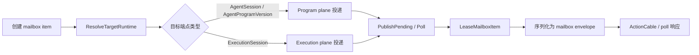
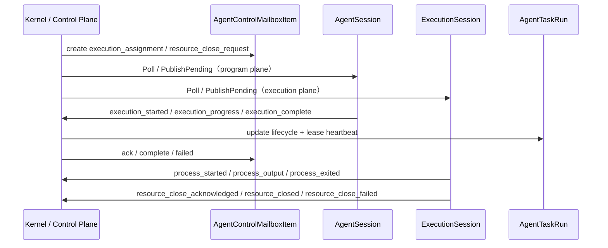
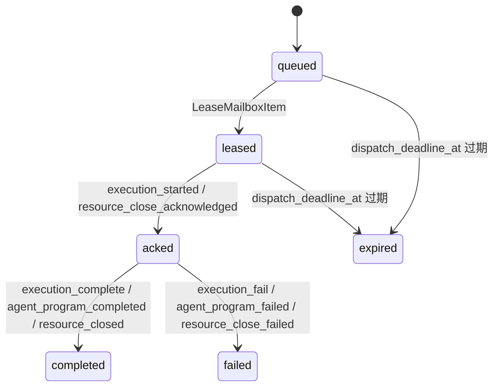

本页位于 Deep Dive / 核心内核之下，当前只解释 **控制平面如何通过 mailbox 协作**：mailbox row 如何承载目标、租约、状态和幂等报告，poll / report 如何形成闭环，以及程序平面与执行平面如何在同一协议下协作；不展开 Fenix 运行时契约本身，也不展开队列拓扑与准入治理的策略细节，后两者分别承接到 [队列拓扑与提供方准入控制](https://github.com/jasl/cybros.new/blob/main/8-dui-lie-tuo-bu-yu-ti-gong-fang-zhun-ru-kong-zhi) 和 [运行时契约：注册、配对与控制循环](https://github.com/jasl/cybros.new/blob/main/10-yun-xing-shi-qi-yue-zhu-ce-pei-dui-yu-kong-zhi-xun-huan)。Sources: [core_matrix/app/models/agent_control_mailbox_item.rb](https://github.com/jasl/cybros.new/blob/main/core_matrix/app/models/agent_control_mailbox_item.rb#L1-L170) [docs/design/2026-03-26-core-matrix-conversation-close-and-mailbox-control-protocol-design.md](https://github.com/jasl/cybros.new/blob/main/docs/design/2026-03-26-core-matrix-conversation-close-and-mailbox-control-protocol-design.md#L58-L75)

## 控制平面的抽象边界

控制平面不是通用消息总线，而是一个**面向目标的持久 mailbox**。实现里，`AgentControlMailboxItem` 明确区分 `program` 与 `execution` 两个 runtime plane，记录 `item_type`、`logical_work_id`、`attempt_no`、`delivery_no`、`priority`、`status`、`available_at`、`dispatch_deadline_at` 与可选租约/硬截止字段，并对安装、目标程序、目标运行时、任务运行与租约持有者做一致性校验。Sources: [core_matrix/app/models/agent_control_mailbox_item.rb](https://github.com/jasl/cybros.new/blob/main/core_matrix/app/models/agent_control_mailbox_item.rb#L1-L170) [docs/design/2026-03-26-core-matrix-conversation-close-and-mailbox-control-protocol-design.md](https://github.com/jasl/cybros.new/blob/main/docs/design/2026-03-26-core-matrix-conversation-close-and-mailbox-control-protocol-design.md#L109-L151)

mailbox 的可观测出入口也很直接：`SerializeMailboxItem` 只暴露 envelope 级字段，而不是把持久化内部结构原样泄漏给客户端；这与设计文档要求的“同一 mailbox item envelope 贯穿 poll、WebSocket 与 piggyback”一致。Sources: [core_matrix/app/services/agent_control/serialize_mailbox_item.rb](https://github.com/jasl/cybros.new/blob/main/core_matrix/app/services/agent_control/serialize_mailbox_item.rb#L1-L24) [docs/finished-plans/2026-03-26-core-matrix-phase-2-task-mailbox-control-and-resource-close-contract.md](https://github.com/jasl/cybros.new/blob/main/docs/finished-plans/2026-03-26-core-matrix-phase-2-task-mailbox-control-and-resource-close-contract.md#L83-L96)

下面这张表把两个 runtime plane 的差异压缩成一个视图：关键不是“谁发消息”，而是**谁是可路由的目标端点**。Sources: [core_matrix/app/services/agent_control/resolve_target_runtime.rb](https://github.com/jasl/cybros.new/blob/main/core_matrix/app/services/agent_control/resolve_target_runtime.rb#L42-L103) [core_matrix/app/services/agent_control/poll.rb](https://github.com/jasl/cybros.new/blob/main/core_matrix/app/services/agent_control/poll.rb#L17-L124) [docs/design/2026-03-26-core-matrix-conversation-close-and-mailbox-control-protocol-design.md](https://github.com/jasl/cybros.new/blob/main/docs/design/2026-03-26-core-matrix-conversation-close-and-mailbox-control-protocol-design.md#L153-L166)

| 维度 | program plane | execution plane |
| --- | --- | --- |
| 目标解析 | 以 `AgentSession` 或 `AgentProgramVersion` 作为投递端点 | 以 `ExecutionSession` 作为投递端点 |
| 候选集过滤 | 通过 `target_agent_program_version_id` 或 `target_agent_program_id` 选中 | 通过 `target_execution_runtime_id` 选中 |
| 典型 item 族 | `execution_assignment`、`resource_close_request`、`capabilities_refresh_request`、`recovery_notice` | `execution_assignment` 的执行投递、`resource_close_request` 的执行投递 |
| 入口控制器 | `ProgramAPI::ControlController#poll` / `#report` | `ExecutionAPI::ControlController#poll` / `#report` |

这张表只是在实现与控制语义之间做对照；真正的协作发生在 mailbox 行、租约与报告处理器之中，队列配置只是后台调度承载。Sources: [core_matrix/app/controllers/program_api/control_controller.rb](https://github.com/jasl/cybros.new/blob/main/core_matrix/app/controllers/program_api/control_controller.rb#L1-L29) [core_matrix/app/controllers/execution_api/control_controller.rb](https://github.com/jasl/cybros.new/blob/main/core_matrix/app/controllers/execution_api/control_controller.rb#L1-L68) [core_matrix/config/runtime_topology.yml](https://github.com/jasl/cybros.new/blob/main/core_matrix/config/runtime_topology.yml#L1-L66)

## 投递链路：poll、实时推送与租约

下面这张图只看 **mailbox 投递链路**：`Poll` / `PublishPending` 先通过 `ResolveTargetRuntime` 计算目标，再由 `LeaseMailboxItem` 抢占或续用租约，最后把序列化后的 item 交给控制端；`StreamName.for_deployment` 决定实时推送的频道命名。Sources: [core_matrix/app/services/agent_control/poll.rb](https://github.com/jasl/cybros.new/blob/main/core_matrix/app/services/agent_control/poll.rb#L17-L124) [core_matrix/app/services/agent_control/publish_pending.rb](https://github.com/jasl/cybros.new/blob/main/core_matrix/app/services/agent_control/publish_pending.rb#L15-L72) [core_matrix/app/services/agent_control/resolve_target_runtime.rb](https://github.com/jasl/cybros.new/blob/main/core_matrix/app/services/agent_control/resolve_target_runtime.rb#L42-L103) [core_matrix/app/services/agent_control/lease_mailbox_item.rb](https://github.com/jasl/cybros.new/blob/main/core_matrix/app/services/agent_control/lease_mailbox_item.rb#L13-L74) [core_matrix/app/services/agent_control/stream_name.rb](https://github.com/jasl/cybros.new/blob/main/core_matrix/app/services/agent_control/stream_name.rb#L1-L8)

`Poll` 的行为不是“扫表后直接返回”，而是先刷新控制活动，再优先推进待处理的 close 请求，然后对候选项做目标解析与租约判定：若当前持有者仍然有效，则直接返回已租约项；若没有有效租约，则通过 `LeaseMailboxItem` 在事务锁内完成状态推进、`delivery_no` 增量与 `lease_expires_at` 计算。Sources: [core_matrix/app/services/agent_control/poll.rb](https://github.com/jasl/cybros.new/blob/main/core_matrix/app/services/agent_control/poll.rb#L17-L124) [core_matrix/app/services/agent_control/lease_mailbox_item.rb](https://github.com/jasl/cybros.new/blob/main/core_matrix/app/services/agent_control/lease_mailbox_item.rb#L13-L74)

`PublishPending` 走的是同一套路由语义，只是它把“可立即投递的项”通过实时通道广播出去；如果目标端点没有实时连接，它仍然保留 poll 作为完整 fallback，因此控制平面不会绑定到单一传输。Sources: [core_matrix/app/services/agent_control/publish_pending.rb](https://github.com/jasl/cybros.new/blob/main/core_matrix/app/services/agent_control/publish_pending.rb#L15-L72) [docs/design/2026-03-26-core-matrix-conversation-close-and-mailbox-control-protocol-design.md](https://github.com/jasl/cybros.new/blob/main/docs/design/2026-03-26-core-matrix-conversation-close-and-mailbox-control-protocol-design.md#L67-L75) [docs/design/2026-03-26-core-matrix-conversation-close-and-mailbox-control-protocol-design.md](https://github.com/jasl/cybros.new/blob/main/docs/design/2026-03-26-core-matrix-conversation-close-and-mailbox-control-protocol-design.md#L104-L108)

## 报告回流：幂等入口、分发与新鲜度检查

控制平面的另一半是 **report 回流**。`AgentControl::Report` 只负责入口统一、重复报文判定、receipt 记录与 handler 选择；真正的业务状态变更由 `HandleExecutionReport`、`HandleRuntimeResourceReport`、`HandleCloseReport`、`HandleAgentProgramReport` 和 `HandleHealthReport` 分担。Sources: [core_matrix/app/services/agent_control/report.rb](https://github.com/jasl/cybros.new/blob/main/core_matrix/app/services/agent_control/report.rb#L22-L50) [core_matrix/app/services/agent_control/report_dispatch.rb](https://github.com/jasl/cybros.new/blob/main/core_matrix/app/services/agent_control/report_dispatch.rb#L39-L60)

下面这张表把 report 家族和它们的责任边界直接对齐。Sources: [core_matrix/app/services/agent_control/handle_execution_report.rb](https://github.com/jasl/cybros.new/blob/main/core_matrix/app/services/agent_control/handle_execution_report.rb#L25-L134) [core_matrix/app/services/agent_control/handle_runtime_resource_report.rb](https://github.com/jasl/cybros.new/blob/main/core_matrix/app/services/agent_control/handle_runtime_resource_report.rb#L20-L170) [core_matrix/app/services/agent_control/handle_close_report.rb](https://github.com/jasl/cybros.new/blob/main/core_matrix/app/services/agent_control/handle_close_report.rb#L20-L95) [core_matrix/app/services/agent_control/handle_agent_program_report.rb](https://github.com/jasl/cybros.new/blob/main/core_matrix/app/services/agent_control/handle_agent_program_report.rb#L22-L56) [core_matrix/app/services/agent_control/handle_health_report.rb](https://github.com/jasl/cybros.new/blob/main/core_matrix/app/services/agent_control/handle_health_report.rb#L18-L35) [core_matrix/app/models/agent_control_report_receipt.rb](https://github.com/jasl/cybros.new/blob/main/core_matrix/app/models/agent_control_report_receipt.rb#L1-L18)

| method family | 处理器 | 结果 |
| --- | --- | --- |
| `execution_started` / `execution_progress` / `execution_complete` / `execution_fail` / `execution_interrupted` | `HandleExecutionReport` | 更新 `AgentTaskRun`、`WorkflowNode`、执行租约与运行时事件广播 |
| `process_started` / `process_output` / `process_exited` | `HandleRuntimeResourceReport` | 激活、输出广播、退出收口，并在必要时推动 close 协调 |
| `resource_close_acknowledged` / `resource_closed` / `resource_close_failed` | `HandleCloseReport` | 更新可关闭资源的 close 状态与 close outcome |
| `agent_program_completed` / `agent_program_failed` | `HandleAgentProgramReport` | 终结对应 mailbox item |
| `deployment_health_report` | `HandleHealthReport` | 刷新 agent session 的健康与心跳字段 |

`Report` 的幂等语义落在 `AgentControlReportReceipt` 上：相同 `protocol_message_id` 在同一 installation 内只会形成一条 receipt，重复提交会返回既有结果而不是重新执行 handler；若报告已经过期，入口会回到 `stale` 分支并以冲突语义结束。Sources: [core_matrix/app/services/agent_control/report.rb](https://github.com/jasl/cybros.new/blob/main/core_matrix/app/services/agent_control/report.rb#L22-L50) [core_matrix/app/services/agent_control/report.rb](https://github.com/jasl/cybros.new/blob/main/core_matrix/app/services/agent_control/report.rb#L54-L113) [core_matrix/app/models/agent_control_report_receipt.rb](https://github.com/jasl/cybros.new/blob/main/core_matrix/app/models/agent_control_report_receipt.rb#L1-L18)

在执行报告路径里，`HandleExecutionReport` 先做 freshness 校验，再把 `execution_started` 映射成 `AgentTaskRun` 与 `WorkflowNode` 的 running 状态，把 `execution_progress` 映射成进度广播，把 terminal method 映射成 completed / failed / interrupted，并同步处理任务租约、命令运行收口与后续 workflow follow-up。Sources: [core_matrix/app/services/agent_control/handle_execution_report.rb](https://github.com/jasl/cybros.new/blob/main/core_matrix/app/services/agent_control/handle_execution_report.rb#L25-L134) [core_matrix/app/services/agent_control/handle_execution_report.rb](https://github.com/jasl/cybros.new/blob/main/core_matrix/app/services/agent_control/handle_execution_report.rb#L200-L235)

`HandleRuntimeResourceReport` 与 `HandleCloseReport` 体现了“资源报告”和“关闭协议”是两条不同但可协作的通道：前者围绕 `ProcessRun` 的启动、输出与退出做心跳与状态推进，后者围绕可关闭资源的 ack / closed / failed 做 close 生命周期收口。Sources: [core_matrix/app/services/agent_control/handle_runtime_resource_report.rb](https://github.com/jasl/cybros.new/blob/main/core_matrix/app/services/agent_control/handle_runtime_resource_report.rb#L20-L170) [core_matrix/app/services/agent_control/handle_close_report.rb](https://github.com/jasl/cybros.new/blob/main/core_matrix/app/services/agent_control/handle_close_report.rb#L20-L95)

`HandleAgentProgramReport` 和 `HandleHealthReport` 则分别负责“程序完成/失败”与“健康心跳”；这说明控制平面的关心对象不只是工作项本身，还包括 deployment 的活性与可恢复性。Sources: [core_matrix/app/services/agent_control/handle_agent_program_report.rb](https://github.com/jasl/cybros.new/blob/main/core_matrix/app/services/agent_control/handle_agent_program_report.rb#L22-L56) [core_matrix/app/services/agent_control/handle_health_report.rb](https://github.com/jasl/cybros.new/blob/main/core_matrix/app/services/agent_control/handle_health_report.rb#L18-L35)

`ReportDispatch` 的存在意味着入口与业务处理已经解耦：它不解释业务含义，只按 method family 把请求交给对应处理器，这让控制平面具备更清晰的扩展点，也让 freshness / lease / close 这几类校验保持在各自的责任域内。Sources: [core_matrix/app/services/agent_control/report_dispatch.rb](https://github.com/jasl/cybros.new/blob/main/core_matrix/app/services/agent_control/report_dispatch.rb#L39-L60) [docs/finished-plans/2026-03-27-core-matrix-phase-2-plan-control-plane-routing-and-lifecycle-ownership-unification.md](https://github.com/jasl/cybros.new/blob/main/docs/finished-plans/2026-03-27-core-matrix-phase-2-plan-control-plane-routing-and-lifecycle-ownership-unification.md#L24-L33)

## 协作机制：创建、接受、回流、终结

`CreateExecutionAssignment` 把一次执行机会固化为 mailbox item：它写入 `execution_assignment`、`program` plane、`logical_work_id`、`attempt_no`、`dispatch_deadline_at`、`lease_timeout_seconds` 与执行硬截止，并把与任务相关的投递内容封装进 envelope，然后由 `PublishPending` 立即尝试投递。Sources: [core_matrix/app/services/agent_control/create_execution_assignment.rb](https://github.com/jasl/cybros.new/blob/main/core_matrix/app/services/agent_control/create_execution_assignment.rb#L31-L59) [core_matrix/app/services/agent_control/create_execution_assignment.rb](https://github.com/jasl/cybros.new/blob/main/core_matrix/app/services/agent_control/create_execution_assignment.rb#L63-L125)

`CreateResourceCloseRequest` 做的是相同层级的另一类工作：把关闭请求写成持久 mailbox item，设置 `priority: 0`、目标运行时或目标程序、关闭原因、宽限与强制截止，并把 close_request_id 回填到 payload 中，确保关闭请求能够被后续 report 与清理逻辑稳定识别。Sources: [core_matrix/app/services/agent_control/create_resource_close_request.rb](https://github.com/jasl/cybros.new/blob/main/core_matrix/app/services/agent_control/create_resource_close_request.rb#L20-L84)

下面这张时序图只描述当前页可验证的协作闭环：**先投递，再接受，再回流，再终结**。Sources: [core_matrix/app/services/agent_control/create_execution_assignment.rb](https://github.com/jasl/cybros.new/blob/main/core_matrix/app/services/agent_control/create_execution_assignment.rb#L31-L59) [core_matrix/app/services/agent_control/handle_execution_report.rb](https://github.com/jasl/cybros.new/blob/main/core_matrix/app/services/agent_control/handle_execution_report.rb#L25-L134) [core_matrix/app/services/agent_control/create_resource_close_request.rb](https://github.com/jasl/cybros.new/blob/main/core_matrix/app/services/agent_control/create_resource_close_request.rb#L20-L84) [core_matrix/app/services/agent_control/handle_close_report.rb](https://github.com/jasl/cybros.new/blob/main/core_matrix/app/services/agent_control/handle_close_report.rb#L20-L95)

从状态角度看，当前实现能够直接验证的 mailbox 轨迹是 `queued -> leased -> acked -> completed/failed`，以及租约过期导致的 `expired`；这些转换分散在 `LeaseMailboxItem`、`HandleExecutionReport`、`HandleAgentProgramReport`、`HandleCloseReport` 与 `Report` 的重复 / 过期处理里。Sources: [core_matrix/app/services/agent_control/lease_mailbox_item.rb](https://github.com/jasl/cybros.new/blob/main/core_matrix/app/services/agent_control/lease_mailbox_item.rb#L13-L74) [core_matrix/app/services/agent_control/handle_execution_report.rb](https://github.com/jasl/cybros.new/blob/main/core_matrix/app/services/agent_control/handle_execution_report.rb#L50-L134) [core_matrix/app/services/agent_control/handle_agent_program_report.rb](https://github.com/jasl/cybros.new/blob/main/core_matrix/app/services/agent_control/handle_agent_program_report.rb#L22-L56) [core_matrix/app/services/agent_control/handle_close_report.rb](https://github.com/jasl/cybros.new/blob/main/core_matrix/app/services/agent_control/handle_close_report.rb#L20-L95) [core_matrix/app/services/agent_control/report.rb](https://github.com/jasl/cybros.new/blob/main/core_matrix/app/services/agent_control/report.rb#L22-L50)

## 运行时队列：调度承载而非控制语义本体

`runtime_topology.yml` 说明运行时队列只是承载层：有一个 dispatcher 基线配置，以及两组队列——`llm_queues` 与 `shared_queues`。其中 `llm_*` 队列对应不同 provider / 环境，`shared_*` 队列承载 `tool_calls`、`workflow_default` 与 `maintenance` 这类共享工作。Sources: [core_matrix/config/runtime_topology.yml](https://github.com/jasl/cybros.new/blob/main/core_matrix/config/runtime_topology.yml#L1-L66)

| 分组 | 队列 | 线程 / 进程配置 | 轮询间隔 |
| --- | --- | --- | --- |
| dispatcher | 全局 dispatchers | `batch_size: 500` | `polling_interval: 1` |
| llm | `codex_subscription` / `openai` / `openrouter` / `dev` / `local` | 线程数分别为 2 / 3 / 2 / 1 / 1，进程数均为 1 | 均为 `0.1` |
| shared | `tool_calls` / `workflow_default` / `maintenance` | 线程数分别为 6 / 3 / 1，进程数均为 1 | 均为 `0.1` |

这张表的意义不是定义 mailbox 协作，而是说明控制平面运行时的背景调度约束；真正的投递目标、租约和状态仍然由 mailbox 行本身决定。Sources: [core_matrix/config/runtime_topology.yml](https://github.com/jasl/cybros.new/blob/main/core_matrix/config/runtime_topology.yml#L1-L66) [core_matrix/app/models/agent_control_mailbox_item.rb](https://github.com/jasl/cybros.new/blob/main/core_matrix/app/models/agent_control_mailbox_item.rb#L1-L170)

## 读法收束

如果你要继续把这条链路往外串，下一步建议阅读 [队列拓扑与提供方准入控制](https://github.com/jasl/cybros.new/blob/main/8-dui-lie-tuo-bu-yu-ti-gong-fang-zhun-ru-kong-zhi) 来看承载队列如何影响投递，再到 [运行时契约：注册、配对与控制循环](https://github.com/jasl/cybros.new/blob/main/10-yun-xing-shi-qi-yue-zhu-ce-pei-dui-yu-kong-zhi-xun-huan) 看配对、注册和控制循环如何与本页的 mailbox 语义合拢。Sources: [docs/design/2026-03-26-core-matrix-conversation-close-and-mailbox-control-protocol-design.md](https://github.com/jasl/cybros.new/blob/main/docs/design/2026-03-26-core-matrix-conversation-close-and-mailbox-control-protocol-design.md#L192-L214) [core_matrix/app/services/agent_control/poll.rb](https://github.com/jasl/cybros.new/blob/main/core_matrix/app/services/agent_control/poll.rb#L17-L124) [core_matrix/app/services/agent_control/report.rb](https://github.com/jasl/cybros.new/blob/main/core_matrix/app/services/agent_control/report.rb#L22-L50)