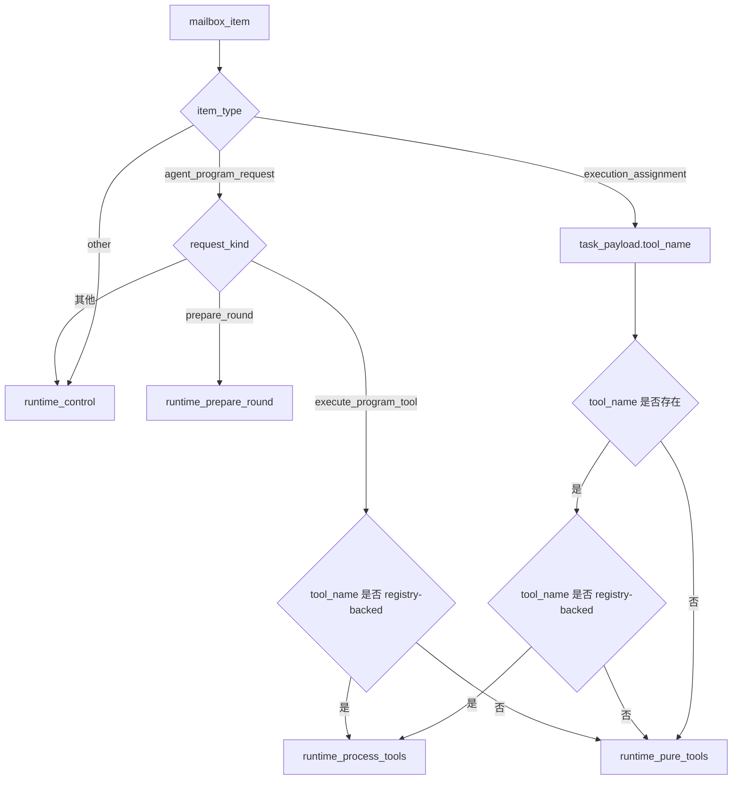
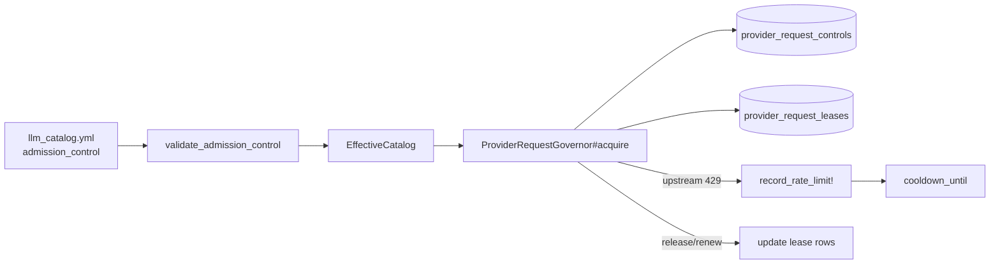

你当前位于「Deep Dive / 核心内核 / 队列拓扑与提供方准入控制」这一页；本文只回答两个问题：Core Matrix 与 Fenix 的队列是如何分层、分流与定额的，以及 provider 侧如何通过 `admission_control`、租约表和冷却窗口做准入控制。现有文档已经明确，这套设计不再依赖过渡期的 `llm_requests` 路径。Sources: [docs/operations/queue-topology-and-provider-governor.md](https://github.com/jasl/cybros.new/blob/main/docs/operations/queue-topology-and-provider-governor.md#L1-L9)

## 架构总览

从第一原理看，这里有两条彼此独立、但会在执行链路上相遇的治理面：一条是 Solid Queue 的队列拓扑，决定任务进入哪个 worker 池；另一条是 provider admission control，决定某个 provider 当前能否接收新请求。Core Matrix 用 `runtime_topology.yml` 描述队列族并渲染到 `queue.yml`，Fenix 则用自己的 `config/queue.yml` 和 `ExecutionTopology` 把 mailbox item 映射到 runtime 队列。Sources: [docs/operations/queue-topology-and-provider-governor.md](https://github.com/jasl/cybros.new/blob/main/docs/operations/queue-topology-and-provider-governor.md#L21-L40) [docs/operations/queue-topology-and-provider-governor.md](https://github.com/jasl/cybros.new/blob/main/docs/operations/queue-topology-and-provider-governor.md#L42-L68) [docs/operations/queue-topology-and-provider-governor.md](https://github.com/jasl/cybros.new/blob/main/docs/operations/queue-topology-and-provider-governor.md#L77-L126) [core_matrix/config/runtime_topology.yml](https://github.com/jasl/cybros.new/blob/main/core_matrix/config/runtime_topology.yml#L3-L66) [core_matrix/config/queue.yml](https://github.com/jasl/cybros.new/blob/main/core_matrix/config/queue.yml#L1-L47) [agents/fenix/app/services/fenix/runtime/execution_topology.rb](https://github.com/jasl/cybros.new/blob/main/agents/fenix/app/services/fenix/runtime/execution_topology.rb#L3-L82)

```mermaid
flowchart LR
  subgraph CM[Core Matrix]
    RTY[config/runtime_topology.yml]
    QY[config/queue.yml\n(ERB 渲染)]
    LLM[config/llm_catalog.yml\nadmission_control]
    GOV[ProviderRequestGovernor]
    PRC[(provider_request_controls)]
    PRL[(provider_request_leases)]
    RTY --> QY
    LLM --> GOV
    GOV --> PRC
    GOV --> PRL
    QY --> CMQ[llm_* / tool_calls /\nworkflow_default / maintenance]
  end

  subgraph FX[Fenix]
    FQY[config/queue.yml]
    ET[Fenix::Runtime::ExecutionTopology]
    FQ[runtime_prepare_round /\nruntime_pure_tools /\nruntime_process_tools /\nruntime_control /\nmaintenance]
    RJ[RuntimeExecutionJob]
    ET --> FQ
    ET --> RJ
    FQY --> FQ
  end
```

上图最关键的边界是：`queue.yml` 只负责 worker 配置，`llm_catalog.yml` 只负责 provider 的准入默认值，真正的并发限制由 `ProviderRequestGovernor` 在带行锁的数据库控制行上执行。这样做把调度、配额和限流拆成了三层，而不是混在一个 policy 对象里。Sources: [core_matrix/app/services/provider_catalog/effective_catalog.rb](https://github.com/jasl/cybros.new/blob/main/core_matrix/app/services/provider_catalog/effective_catalog.rb#L44-L53) [core_matrix/app/services/provider_execution/provider_request_governor.rb](https://github.com/jasl/cybros.new/blob/main/core_matrix/app/services/provider_execution/provider_request_governor.rb#L73-L113) [core_matrix/app/services/provider_execution/provider_request_governor.rb](https://github.com/jasl/cybros.new/blob/main/core_matrix/app/services/provider_execution/provider_request_governor.rb#L140-L149) [core_matrix/db/migrate/20260401090000_create_provider_request_controls_and_leases.rb](https://github.com/jasl/cybros.new/blob/main/core_matrix/db/migrate/20260401090000_create_provider_request_controls_and_leases.rb#L3-L34)

## Core Matrix 队列拓扑

Core Matrix 的队列拓扑以 `core_matrix/config/runtime_topology.yml` 为源，`core_matrix/config/queue.yml` 只是 ERB 渲染结果；测试会校验渲染出的队列顺序与默认线程数，避免拓扑漂移。Sources: [core_matrix/config/runtime_topology.yml](https://github.com/jasl/cybros.new/blob/main/core_matrix/config/runtime_topology.yml#L3-L66) [core_matrix/config/queue.yml](https://github.com/jasl/cybros.new/blob/main/core_matrix/config/queue.yml#L1-L47) [agents/fenix/test/config/queue_configuration_test.rb](https://github.com/jasl/cybros.new/blob/main/agents/fenix/test/config/queue_configuration_test.rb#L6-L37)

| 队列 | 默认线程 | 默认进程 | 归属 |
|---|---:|---:|---|
| `llm_codex_subscription` | 2 | 1 | LLM 族 |
| `llm_openai` | 3 | 1 | LLM 族 |
| `llm_openrouter` | 2 | 1 | LLM 族 |
| `llm_dev` | 1 | 1 | LLM 族 |
| `llm_local` | 1 | 1 | LLM 族 |
| `tool_calls` | 6 | 1 | 共享队列 |
| `workflow_default` | 3 | 1 | 共享队列 |
| `maintenance` | 1 | 1 | 共享队列 |

上表对应 Core Matrix 的 checked-in 拓扑：`runtime_topology.yml` 定义 worker 族，`queue.yml` 把它展开成 dispatcher 与 worker 配置，渲染测试则锁定了队列名和默认线程数。Sources: [core_matrix/config/runtime_topology.yml](https://github.com/jasl/cybros.new/blob/main/core_matrix/config/runtime_topology.yml#L3-L66) [core_matrix/config/queue.yml](https://github.com/jasl/cybros.new/blob/main/core_matrix/config/queue.yml#L1-L47) [agents/fenix/test/config/queue_configuration_test.rb](https://github.com/jasl/cybros.new/blob/main/agents/fenix/test/config/queue_configuration_test.rb#L6-L37)

Core Matrix 的路由规则是显式的：`turn_step` 节点进入 `llm_<resolved_provider_handle>`，`tool_call` 进入 `tool_calls`，工作流协调进入 `workflow_default`，维护工作进入 `maintenance`。Sources: [docs/operations/queue-topology-and-provider-governor.md](https://github.com/jasl/cybros.new/blob/main/docs/operations/queue-topology-and-provider-governor.md#L35-L40) [core_matrix/config/runtime_topology.yml](https://github.com/jasl/cybros.new/blob/main/core_matrix/config/runtime_topology.yml#L3-L66)

## Fenix 队列拓扑

Fenix 的队列拓扑是另一套独立定义：`agents/fenix/config/queue.yml` 声明 runtime 侧 worker 池，而 `Fenix::Runtime::ExecutionTopology` 决定 mailbox item 应该落到 `runtime_prepare_round`、`runtime_pure_tools`、`runtime_process_tools` 还是 `runtime_control`。`RuntimeExecutionJob` 的默认队列是 `runtime_control`，但 mailbox worker 会在入队时把不同请求分发到更细的队列。Sources: [agents/fenix/config/queue.yml](https://github.com/jasl/cybros.new/blob/main/agents/fenix/config/queue.yml#L1-L35) [agents/fenix/app/services/fenix/runtime/execution_topology.rb](https://github.com/jasl/cybros.new/blob/main/agents/fenix/app/services/fenix/runtime/execution_topology.rb#L3-L82) [agents/fenix/app/jobs/runtime_execution_job.rb](https://github.com/jasl/cybros.new/blob/main/agents/fenix/app/jobs/runtime_execution_job.rb#L1-L30) [agents/fenix/test/services/fenix/runtime/mailbox_worker_test.rb](https://github.com/jasl/cybros.new/blob/main/agents/fenix/test/services/fenix/runtime/mailbox_worker_test.rb#L5-L61)



Fenix 的 checked-in `queue.yml` 目前把 `runtime_process_tools` 的默认线程写成 3；仓库里的配置测试也锁定为 3。需要注意的是，`docs/operations/queue-topology-and-provider-governor.md` 的现存正文仍保留了 2 线程的写法，因此本文的 Fenix 表格以配置与测试为准。Sources: [agents/fenix/config/queue.yml](https://github.com/jasl/cybros.new/blob/main/agents/fenix/config/queue.yml#L1-L35) [agents/fenix/test/config/queue_configuration_test.rb](https://github.com/jasl/cybros.new/blob/main/agents/fenix/test/config/queue_configuration_test.rb#L16-L24) [docs/operations/queue-topology-and-provider-governor.md](https://github.com/jasl/cybros.new/blob/main/docs/operations/queue-topology-and-provider-governor.md#L91-L97)

| 队列 | 默认线程 | 默认进程 | 路由入口 |
|---|---:|---:|---|
| `runtime_prepare_round` | 3 | 1 | prepare-round 类请求 |
| `runtime_pure_tools` | 8 | 1 | 非 registry-backed 的确定性工具 |
| `runtime_process_tools` | 3 | 1 | registry-backed 工具、进程与浏览器会话 |
| `runtime_control` | 2 | 1 | 兜底控制工作 |
| `maintenance` | 1 | 1 | 维护任务 |

Fenix 在部署上不是无状态水平 worker 池；当它作为外部 runtime 运行时，控制循环和 job worker 必须共享同一 `CORE_MATRIX_BASE_URL` 与机器凭证。默认单服务模式下，Puma 会嵌入 Solid Queue supervisor；一旦切换到 `STANDALONE_SOLID_QUEUE=true`，就必须额外启动 `bin/jobs start`，并与 `bin/rails runtime:control_loop_forever` 配套运行。Sources: [docs/operations/queue-topology-and-provider-governor.md](https://github.com/jasl/cybros.new/blob/main/docs/operations/queue-topology-and-provider-governor.md#L106-L126) [agents/fenix/README.md](https://github.com/jasl/cybros.new/blob/main/agents/fenix/README.md#L103-L132)

## 提供方准入控制

Provider 准入控制的配置入口是 `llm_catalog.yml` 中的 `admission_control` 块；验证层只允许正数，并把它们规整成 `max_concurrent_requests` 与 `cooldown_seconds`。`EffectiveCatalog` 只暴露这两个字段，`ProviderPolicy` 不再携带并发或 throttle 信息。Sources: [core_matrix/config/llm_catalog.yml](https://github.com/jasl/cybros.new/blob/main/core_matrix/config/llm_catalog.yml#L1-L24) [core_matrix/config/llm_catalog.yml](https://github.com/jasl/cybros.new/blob/main/core_matrix/config/llm_catalog.yml#L90-L110) [core_matrix/config/llm_catalog.yml](https://github.com/jasl/cybros.new/blob/main/core_matrix/config/llm_catalog.yml#L153-L173) [core_matrix/app/services/provider_catalog/validate.rb](https://github.com/jasl/cybros.new/blob/main/core_matrix/app/services/provider_catalog/validate.rb#L131-L146) [core_matrix/app/services/provider_catalog/effective_catalog.rb](https://github.com/jasl/cybros.new/blob/main/core_matrix/app/services/provider_catalog/effective_catalog.rb#L44-L53)



| 维度 | 规则 | 实现位置 |
|---|---|---|
| `max_concurrent_requests` | installation 级硬上限；活跃租约数达到上限时阻止新请求 | `ProviderRequestGovernor#acquire` |
| `cooldown_seconds` | `Retry-After` 不存在或不可解析时的默认冷却时长 | `ProviderRequestGovernor#default_cooldown_seconds` |
| `Retry-After` | 先尝试按整数解析，再尝试按 HTTP date 解析 | `ProviderRequestGovernor#normalize_retry_after` |
| 持久化状态 | 冷却与租约状态落库，不依赖 cache | `provider_request_controls` / `provider_request_leases` |
| `ProviderPolicy` | 不再承担并发或 throttle 字段 | `ProviderCatalog::EffectiveCatalog` |

实现上，`ProviderRequestGovernor#acquire` 会先清理过期租约，再在 `provider_request_controls` 这行上加锁，检查 cooldown 和活跃租约数，最后创建 `provider_request_leases`；`record_rate_limit!` 则把 `Retry-After` 解析后的时长合并进 `cooldown_until`。`release` 和 `renew` 只更新同一套持久化租约，不依赖临时内存状态。Sources: [core_matrix/app/services/provider_execution/provider_request_governor.rb](https://github.com/jasl/cybros.new/blob/main/core_matrix/app/services/provider_execution/provider_request_governor.rb#L73-L113) [core_matrix/app/services/provider_execution/provider_request_governor.rb](https://github.com/jasl/cybros.new/blob/main/core_matrix/app/services/provider_execution/provider_request_governor.rb#L116-L149) [core_matrix/app/services/provider_execution/provider_request_governor.rb](https://github.com/jasl/cybros.new/blob/main/core_matrix/app/services/provider_execution/provider_request_governor.rb#L159-L233) [core_matrix/db/migrate/20260401090000_create_provider_request_controls_and_leases.rb](https://github.com/jasl/cybros.new/blob/main/core_matrix/db/migrate/20260401090000_create_provider_request_controls_and_leases.rb#L3-L34)

这里的持久化设计有两个直接后果：第一，`provider_request_controls` 以 `(installation_id, provider_handle)` 做唯一约束，保证同一安装的同一 provider 只有一条控制记录；第二，`provider_request_leases` 既有 `lease_token` 唯一索引，也有按 scope 与 expiry 排列的索引，便于按 provider、按过期时间清理与查询。Sources: [core_matrix/db/migrate/20260401090000_create_provider_request_controls_and_leases.rb](https://github.com/jasl/cybros.new/blob/main/core_matrix/db/migrate/20260401090000_create_provider_request_controls_and_leases.rb#L3-L34)

`core_matrix/vendor/simple_inference` 仍然使用持久 HTTPX session；这带来连接复用和 fiber 兼容的 transport 行为，但运行模型依旧是“一次 outbound request 对应一个 ActiveJob 执行单元”，不应把它理解成额外的吞吐层。Sources: [docs/operations/queue-topology-and-provider-governor.md](https://github.com/jasl/cybros.new/blob/main/docs/operations/queue-topology-and-provider-governor.md#L70-L75)

## 推荐阅读顺序

如果你要把这页和更大的运行时图谱拼起来，下一步应当先读 [运行时模型：控制平面、Mailbox 与协作机制](https://github.com/jasl/cybros.new/blob/main/7-yun-xing-shi-mo-xing-kong-zhi-ping-mian-mailbox-yu-xie-zuo-ji-zhi) 理解 mailbox 与控制平面如何调度，再读 [运行时契约：注册、配对与控制循环](https://github.com/jasl/cybros.new/blob/main/10-yun-xing-shi-qi-yue-zhu-ce-pei-dui-yu-kong-zhi-xun-huan) 复核 Fenix 的控制循环与注册契约，最后回到 [运维参数：数据库池、队列与单机部署基线](https://github.com/jasl/cybros.new/blob/main/14-yun-wei-can-shu-shu-ju-ku-chi-dui-lie-yu-dan-ji-bu-shu-ji-xian) 对照线程、进程池和单机部署参数。Sources: [docs/operations/queue-topology-and-provider-governor.md](https://github.com/jasl/cybros.new/blob/main/docs/operations/queue-topology-and-provider-governor.md#L21-L40) [docs/operations/queue-topology-and-provider-governor.md](https://github.com/jasl/cybros.new/blob/main/docs/operations/queue-topology-and-provider-governor.md#L77-L136) [agents/fenix/README.md](https://github.com/jasl/cybros.new/blob/main/agents/fenix/README.md#L103-L132)