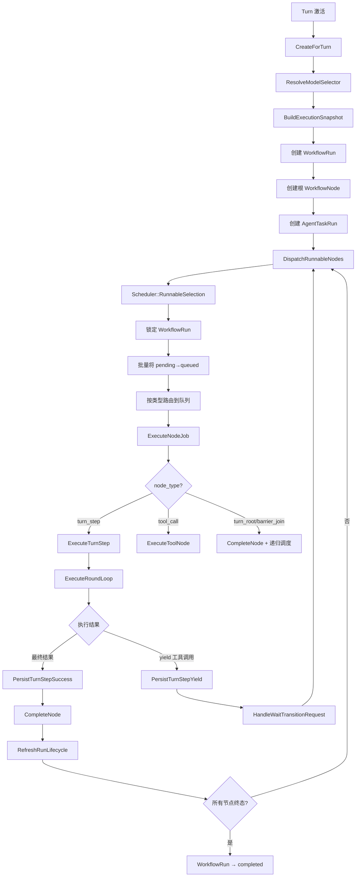
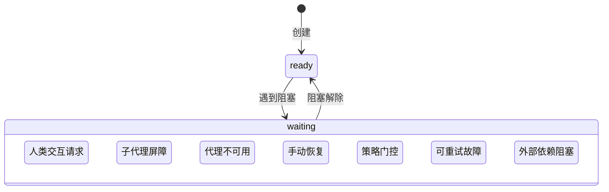

Core Matrix 的工作流 DAG 执行引擎是整个系统的运行时心脏——它将一次对话轮次（Turn）的执行需求，建模为一棵有向无环图（DAG），通过拓扑排序驱动节点逐层执行，并在遇到人类交互、子代理屏障、可重试故障等场景时，精确地将运行挂起到可恢复的等待状态。引擎的设计遵循**单一活跃工作流**约束（每个对话最多一个 `active` 工作流），通过 `WorkflowRun` → `WorkflowNode` → `WorkflowEdge` 三层模型实现状态机的严格驱动，同时借助 PostgreSQL 行锁和 `WithLockedWorkflowContext` 保证并发安全。

Sources: [workflow_run.rb](https://github.com/jasl/cybros.new/blob/main/core_matrix/app/models/workflow_run.rb#L1-L205), [workflow_node.rb](https://github.com/jasl/cybros.new/blob/main/core_matrix/app/models/workflow_node.rb#L1-L178), [workflow_edge.rb](https://github.com/jasl/cybros.new/blob/main/core_matrix/app/models/workflow_edge.rb#L1-L61)

---

## 领域模型：DAG 的三层结构

工作流引擎的核心数据模型由三个紧耦合的实体组成：**WorkflowRun**（运行实例）、**WorkflowNode**（节点）、**WorkflowEdge**（有向边）。每个 `WorkflowRun` 严格绑定到一个 `Turn`，且同一会话中最多只能存在一个处于 `active` 状态的工作流运行。

Sources: [workflow_run.rb](https://github.com/jasl/cybros.new/blob/main/core_matrix/app/models/workflow_run.rb#L42-L55), [schema.rb](https://github.com/jasl/cybros.new/blob/main/core_matrix/db/schema.rb#L1374-L1400)

### WorkflowRun：运行实例的生命周期

`WorkflowRun` 承载两套正交的状态维度：

| 维度 | 枚举字段 | 值域 | 语义 |
|------|----------|------|------|
| **生命周期** | `lifecycle_state` | `active`, `completed`, `failed`, `canceled` | 工作流的终态判断 |
| **等待状态** | `wait_state` | `ready`, `waiting` | 引擎是否暂停执行 |
| **等待原因** | `wait_reason_kind` | `human_interaction`, `subagent_barrier`, `agent_unavailable`, `manual_recovery_required`, `policy_gate`, `retryable_failure`, `external_dependency_blocked` | 为什么暂停 |

模型通过 `wait_state_consistency` 验证器强制约束：当 `wait_state` 为 `ready` 时，所有等待相关字段必须为空；当 `waiting` 时，`wait_reason_kind` 和 `waiting_since_at` 必须存在。此外，`blocking_resource_type` 和 `blocking_resource_id` 必须成对出现，指向具体阻塞资源（如 `WorkflowNode`、`AgentTaskRun`、`SubagentBarrier`）。

Sources: [workflow_run.rb](https://github.com/jasl/cybros.new/blob/main/core_matrix/app/models/workflow_run.rb#L1-L98), [schema.rb](https://github.com/jasl/cybros.new/blob/main/core_matrix/db/schema.rb#L1374-L1400)

### WorkflowNode：执行节点状态机

每个节点拥有独立的七态生命周期：

```
pending → queued → running → completed
                   ↓              ↗
                waiting ──────────┘
                   ↓
                failed
                   ↓
              canceled
```

| 状态 | 含义 | 时间戳约束 |
|------|------|-----------|
| `pending` | 初始态，等待调度 | `started_at`, `finished_at` 均为空 |
| `queued` | 已被 DispatchRunnableNodes 锁定 | 同上 |
| `running` | Provider 正在执行 | `started_at` 存在，`finished_at` 为空 |
| `waiting` | 等待外部事件 | `started_at` 存在，`finished_at` 为空 |
| `completed` | 成功完成 | `started_at` 和 `finished_at` 均存在 |
| `failed` | 终态失败 | `started_at` 和 `finished_at` 均存在 |
| `canceled` | 被取消 | `finished_at` 存在 |

节点通过 `node_type` 区分功能类型：`turn_step`（LLM 轮次执行）、`tool_call`（工具调用）、`turn_root`/`barrier_join`（协调节点）。`decision_source` 字段记录节点创建者身份（`llm`、`agent_program`、`system`、`user`），`presentation_policy` 控制可见性层级（`internal_only`、`ops_trackable`、`user_projectable`）。

Sources: [workflow_node.rb](https://github.com/jasl/cybros.new/blob/main/core_matrix/app/models/workflow_node.rb#L1-L88), [schema.rb](https://github.com/jasl/cybros.new/blob/main/core_matrix/db/schema.rb#L1337-L1372)

### WorkflowEdge：依赖关系与条件边

`WorkflowEdge` 的 `requirement` 字段定义了两类依赖语义：

- **`required`**（默认）：前置节点必须 `completed`，后继才可被调度
- **`optional`**：前置节点 `completed` 是充分但非必要条件——只要存在至少一个 `completed` 的前驱，且所有 `required` 边的前驱均已完成，节点即满足调度条件

边的唯一性由 `(workflow_run_id, from_node_id, to_node_id)` 复合索引保证，同时模型层禁止自环边。

Sources: [workflow_edge.rb](https://github.com/jasl/cybros.new/blob/main/core_matrix/app/models/workflow_edge.rb#L1-L61)

---

## 执行流水线：从创建到完成

下面的 Mermaid 图展示了工作流从创建到节点执行完成的核心流水线。**前置知识**：`Turn` 是会话中的对话轮次，每个活跃的 Turn 恰好对应一个 WorkflowRun。



Sources: [create_for_turn.rb](https://github.com/jasl/cybros.new/blob/main/core_matrix/app/services/workflows/create_for_turn.rb#L25-L62), [dispatch_runnable_nodes.rb](https://github.com/jasl/cybros.new/blob/main/core_matrix/app/services/workflows/dispatch_runnable_nodes.rb#L12-L39), [execute_node.rb](https://github.com/jasl/cybros.new/blob/main/core_matrix/app/services/workflows/execute_node.rb#L14-L51), [execute_node_job.rb](https://github.com/jasl/cybros.new/blob/main/core_matrix/app/jobs/workflows/execute_node_job.rb#L1-L12)

### 创建阶段：CreateForTurn

`Workflows::CreateForTurn` 是工作流的入口服务。它在一次事务中完成以下操作：

1. 调用 `ResolveModelSelector` 从 Provider 目录解析有效的模型选择
2. 调用 `BuildExecutionSnapshot` 组装执行上下文快照（身份、消息投影、能力投影、Provider 上下文、运行时上下文等）
3. 创建 `WorkflowRun` 实例（`lifecycle_state: "active"`）
4. 创建根 `WorkflowNode`（`ordinal: 0`，由调用方指定 `node_key` 和 `node_type`）
5. 如果指定了 `initial_kind`，创建初始 `AgentTaskRun` 并通过 `AgentControl::CreateExecutionAssignment` 分配到代理程序执行队列

Sources: [create_for_turn.rb](https://github.com/jasl/cybros.new/blob/main/core_matrix/app/services/workflows/create_for_turn.rb#L25-L103)

### 调度阶段：Scheduler 与 DispatchRunnableNodes

**`Workflows::Scheduler`** 是引擎的拓扑排序核心。其内部类 `RunnableSelection` 的算法如下：

1. 如果 `WorkflowRun` 处于 `waiting` 或非 `active` 状态，直接返回空集
2. 加载该 Run 下所有 `WorkflowNode`，按 `ordinal` 排序
3. 加载所有 `WorkflowEdge`，按 `to_node_id` 分组构建入边索引
4. 对每个 `pending` 节点判断：无入边（根节点），或至少一个前驱 `completed` 且所有 `required` 边的前驱均 `completed`

**`DispatchRunnableNodes`** 封装了调度协议：在 `workflow_run` 行锁内逐节点获取锁并转移 `pending → queued`，事务提交后按节点类型路由到对应的 Solid Queue 队列。路由策略通过 `RuntimeTopology::CoreMatrix` 实现：

| 节点类型 | 队列路由 |
|----------|---------|
| `turn_step` | 按 Provider handle 映射的 LLM 队列 |
| `tool_call` | 共享 `tool_calls` 队列 |
| 其他 | 共享 `workflow_default` 队列 |

Sources: [scheduler.rb](https://github.com/jasl/cybros.new/blob/main/core_matrix/app/services/workflows/scheduler.rb#L15-L52), [dispatch_runnable_nodes.rb](https://github.com/jasl/cybros.new/blob/main/core_matrix/app/services/workflows/dispatch_runnable_nodes.rb#L1-L61)

### 执行阶段：ExecuteNode 与 ExecuteNodeJob

`ExecuteNodeJob` 是 Solid Queue 的工作单元。它从数据库重新加载节点，跳过终态或已运行节点，委托给 `ExecuteNode` 服务。`ExecuteNode` 按 `node_type` 分派：

- **`turn_step`** → `ProviderExecution::ExecuteTurnStep`：执行完整的 Provider 请求循环（包括多轮工具调用），最终产生成功、失败或 yield
- **`tool_call`** → `ProviderExecution::ExecuteToolNode`：执行单个工具调用
- **`turn_root` / `barrier_join`** → 直接完成协调节点，触发 `RefreshRunLifecycle` 和下一轮调度

`ExecuteTurnStep` 内部通过 `claim_running!` 在行锁内原子地将节点状态从 `queued` 转移到 `running`，然后进入 `ExecuteRoundLoop`。如果循环返回最终结果（`final?`），调用 `PersistTurnStepSuccess` 写入输出消息并完成节点；如果循环产生了工具调用 yield（非最终），调用 `PersistTurnStepYield` 记录工具绑定，随后进入 `HandleWaitTransitionRequest` 的意图批处理流程。

Sources: [execute_node.rb](https://github.com/jasl/cybros.new/blob/main/core_matrix/app/services/workflows/execute_node.rb#L14-L51), [execute_node_job.rb](https://github.com/jasl/cybros.new/blob/main/core_matrix/app/jobs/workflows/execute_node_job.rb#L1-L12), [execute_turn_step.rb](https://github.com/jasl/cybros.new/blob/main/core_matrix/app/services/provider_execution/execute_turn_step.rb#L27-L141)

### 完成阶段：CompleteNode 与 RefreshRunLifecycle

`CompleteNode` 在行锁内将节点标记为 `completed`，写入 `WorkflowNodeEvent`（`event_kind: "status"`），同时记录时间戳。`RefreshRunLifecycle` 检查是否仍有活跃节点（`pending`、`queued`、`running`、`waiting`）：若全部终态，则自动将 `WorkflowRun` 转移到 `completed`。

Sources: [complete_node.rb](https://github.com/jasl/cybros.new/blob/main/core_matrix/app/services/workflows/complete_node.rb#L13-L41), [refresh_run_lifecycle.rb](https://github.com/jasl/cybros.new/blob/main/core_matrix/app/services/workflows/refresh_run_lifecycle.rb#L14-L34)

---

## DAG 变异：动态扩展与无环保证

`Workflows::Mutate` 是 DAG 的结构变异服务，允许在运行时向现有 `WorkflowRun` 追加节点和边。它在 `workflow_run` 行锁内操作：

1. **追加节点**：按序分配 `ordinal`，支持指定 `yielding_workflow_node` 关联（记录产生者）
2. **追加边**：按 `from_node_id` 分组分配 `ordinal`，支持指定 `requirement`（默认 `required`）
3. **无环验证**：通过 DFS 检测——构建邻接表后，用 `visiting`/`visited` 双标记集检测回边

如果检测到环，事务回滚并抛出 `ActiveRecord::RecordInvalid`。这确保了 DAG 的核心不变量在任何变异操作后始终成立。

Sources: [mutate.rb](https://github.com/jasl/cybros.new/blob/main/core_matrix/app/services/workflows/mutate.rb#L13-L131)

---

## 等待状态与恢复机制

等待状态机制是工作流引擎处理异步协作的核心抽象。当执行遇到需要外部参与的场景时，引擎将 `WorkflowRun` 推入 `waiting` 状态，冻结调度循环，直到外部事件触发恢复。



Sources: [wait_state.rb](https://github.com/jasl/cybros.new/blob/main/core_matrix/app/services/workflows/wait_state.rb#L1-L15), [workflow_run.rb](https://github.com/jasl/cybros.new/blob/main/core_matrix/app/models/workflow_run.rb#L12-L28)

### WorkflowWaitSnapshot：等待状态的快照与还原

`WorkflowWaitSnapshot` 是一个值对象，封装了等待状态的完整上下文。它提供两种构建方式：

- **`capture`**：从当前 `WorkflowRun` 捕获等待状态（排除 `agent_unavailable` 和 `manual_recovery_required` 这类由运行时管理的状态）
- **`from_workflow_run`**：从 `wait_reason_payload` 中提取之前保存的快照

其核心方法 `resolved_for?` 实现了按 `wait_reason_kind` 分发的阻塞解除检测逻辑：

| `wait_reason_kind` | 解除条件 |
|---------------------|---------|
| `human_interaction` | 阻塞的 `HumanInteractionRequest` 不再处于 `open` + `blocking` 状态 |
| `subagent_barrier` | 所有引用的 `SubagentSession` 均达到终态 |
| `policy_gate` | 引用的排队 Turn 不再存在 |
| `retryable_failure` | 阻塞的 `AgentTaskRun` 或 `WorkflowNode` 不再处于失败/等待状态 |
| `external_dependency_blocked` | 阻塞的 `WorkflowNode` 不再处于等待状态 |

Sources: [workflow_wait_snapshot.rb](https://github.com/jasl/cybros.new/blob/main/core_matrix/app/models/workflow_wait_snapshot.rb#L1-L149)

### ResumeAfterWaitResolution：通用恢复入口

`ResumeAfterWaitResolution` 是恢复机制的统一入口。它在 `WithMutableWorkflowContext` 锁保护下执行：

1. 构建 `WorkflowWaitSnapshot`，调用 `resolved_for?` 判断阻塞是否已解除
2. 如果未解除，静默返回（保持等待）
3. 如果已解除，收集前驱节点，重置 `WorkflowRun` 到 `ready` 状态
4. 调用 `ReEnterAgent` 创建后续节点和任务

Sources: [resume_after_wait_resolution.rb](https://github.com/jasl/cybros.new/blob/main/core_matrix/app/services/workflows/resume_after_wait_resolution.rb#L11-L65)

---

## 意图批处理：Yield-Materialize 模式

当代理程序在执行过程中需要并行发起多个子任务（如同时请求审批、生成子代理、调用工具），引擎通过 **Yield-Materialize** 模式实现：

1. 代理程序通过 `wait_transition_requested` 在 `terminal_payload` 中提交一个批处理清单（`batch_manifest`）
2. `HandleWaitTransitionRequest` 接收清单，委托给 `IntentBatchMaterialization`
3. `IntentBatchMaterialization` 将清单按 stage 分组，区分 `accepted` 和 `rejected` 意图
4. 被接受的意图被物化为新的 `WorkflowNode` + `WorkflowEdge`（通过 `Mutate`），并记录 `WorkflowArtifact` 作为持久化清单
5. 按 stage 顺序处理：对人类交互节点创建 `HumanInteractionRequest`，对子代理生成节点创建 `SubagentSession`

每个 stage 可以声明 `completion_barrier`：当设为 `wait_all` 时，引擎在生成所有子代理后立即挂起工作流（`wait_reason_kind: "subagent_barrier"`），等待所有子代理完成后才继续下一 stage。

Sources: [handle_wait_transition_request.rb](https://github.com/jasl/cybros.new/blob/main/core_matrix/app/services/workflows/handle_wait_transition_request.rb#L15-L120), [intent_batch_materialization.rb](https://github.com/jasl/cybros.new/blob/main/core_matrix/app/services/workflows/intent_batch_materialization.rb#L22-L200)

---

## 故障处理与重试策略

`BlockNodeForFailure` 是引擎的统一故障处理入口。它通过 `failure_category` 将故障分为两类：

- **`implementation_error`**：终端故障，直接将节点、Turn 和 WorkflowRun 标记为 `failed`
- **其他类别**（`contract_error`、`external_dependency_blocked` 等）：可重试故障，将节点转入 `waiting` 状态

### 自动重试的延迟策略

`DEFAULT_AUTOMATIC_RETRY_DELAYS` 定义了按 `failure_kind` 分类的基准延迟，重试间隔随尝试次数线性增长（`base_delay × attempt_no`）：

| 故障类型 | 基准延迟 |
|---------|---------|
| `provider_overloaded` / `provider_unreachable` | 30 秒 |
| `provider_rate_limited` | 15 秒 |
| `program_transport_failed` / `tool_transport_failed` 等 | 10 秒 |
| `invalid_program_response_contract` 等 | 5 秒 |

当尝试次数超过 `max_auto_retries` 时，策略自动从 `automatic` 降级为 `manual`，需要人工介入。调度通过 `ResumeBlockedStepJob.set(wait_until: next_retry_at)` 实现延迟调度。

Sources: [block_node_for_failure.rb](https://github.com/jasl/cybros.new/blob/main/core_matrix/app/services/workflows/block_node_for_failure.rb#L1-L253)

### StepRetry 与 ResumeBlockedStep

两种恢复路径对应不同的阻塞资源类型：

- **`StepRetry`**：当阻塞在 `AgentTaskRun` 上时，创建新的 `AgentTaskRun`（`attempt_no + 1`），重新入队执行
- **`ResumeBlockedStep`**：当阻塞在 `WorkflowNode` 上时，直接将节点重置为 `pending`，触发重新调度

Sources: [step_retry.rb](https://github.com/jasl/cybros.new/blob/main/core_matrix/app/services/workflows/step_retry.rb#L1-L117), [resume_blocked_step.rb](https://github.com/jasl/cybros.new/blob/main/core_matrix/app/services/workflows/resume_blocked_step.rb#L1-L47)

---

## 暂停/恢复：TurnPauseState

`TurnPauseState` 实现了工作流的暂停/恢复协议，分为三个阶段：

1. **`pause_requested`**：代理程序请求暂停，记录当前活跃的 `AgentTaskRun` 信息
2. **`paused_turn`**：暂停已确认，等待外部恢复指令
3. **恢复**：`resume_attributes` 从快照中还原之前的等待状态（如果存在），或直接回到 `ready`

关键设计：暂停前会通过 `WorkflowWaitSnapshot.capture` 保存当前的等待上下文到 `wait_reason_payload` 的 `paused_wait_snapshot` 键中，确保恢复时能正确还原到暂停前的等待状态。

`ResumePausedTurn` 是恢复操作的服务层，它创建新的 `AgentTaskRun`（携带 `paused_progress_payload` 和 `paused_terminal_payload`），允许代理程序从暂停点继续。`RetryPausedTurn` 继承自 `ResumePausedTurn`，仅改变 `delivery_kind` 为 `"paused_retry"`。

Sources: [turn_pause_state.rb](https://github.com/jasl/cybros.new/blob/main/core_matrix/app/services/workflows/turn_pause_state.rb#L1-L94), [resume_paused_turn.rb](https://github.com/jasl/cybros.new/blob/main/core_matrix/app/services/workflows/resume_paused_turn.rb#L1-L115), [retry_paused_turn.rb](https://github.com/jasl/cybros.new/blob/main/core_matrix/app/services/workflows/retry_paused_turn.rb#L1-L7)

---

## During-Generation 策略：生成中输入处理

当用户在代理程序正在生成内容时发送新消息，`Scheduler::DuringGenerationPolicy` 定义了三种处理策略：

| 策略 | 行为 |
|------|------|
| `reject` | 直接拒绝新输入，抛出验证错误 |
| `queue` | 取消现有排队 Turn，创建新的排队 Turn，不暂停当前工作流 |
| `restart` | 同 `queue`，额外将当前 WorkflowRun 挂起（`policy_gate`），等待排队 Turn 执行 |

`ExpectedTailGuard` 是 `restart` 策略的安全网：当排队 Turn 即将被执行时，它检查前驱 Turn 的输出消息是否仍是期望的版本。如果前驱输出生变化（例如被回滚或编辑），排队 Turn 被自动取消，相关的 `policy_gate` 等待状态被释放。

Sources: [scheduler.rb](https://github.com/jasl/cybros.new/blob/main/core_matrix/app/services/workflows/scheduler.rb#L54-L185)

---

## 并发控制：锁层次结构

引擎通过多层锁保证并发安全。`WithMutableWorkflowContext` 是所有写操作的统一入口，它嵌套了两层锁：

```
Conversations::WithMutableStateLock (对话可变状态锁)
  └── Workflows::WithLockedWorkflowContext (工作流上下文锁)
        ├── Turn 行锁
        └── WorkflowRun 行锁
```

锁的获取顺序严格遵循 `Turn → WorkflowRun` 的层级，与中断处理的锁顺序一致，避免死锁。`BlockNodeForFailure` 进一步扩展到 `Turn → WorkflowRun → WorkflowNode` 三层嵌套锁。

`Conversations::WithMutableStateLock` 本身验证对话的 `deletion_state`（必须为 `retained`）、`lifecycle_state`（必须为 `active`）、以及不在关闭过程中。

Sources: [with_mutable_workflow_context.rb](https://github.com/jasl/cybros.new/blob/main/core_matrix/app/services/workflows/with_mutable_workflow_context.rb#L1-L35), [with_locked_workflow_context.rb](https://github.com/jasl/cybros.new/blob/main/core_matrix/app/services/workflows/with_locked_workflow_context.rb#L1-L30)

---

## 代理程序自动恢复

当代理程序部署（`AgentProgramVersion`）从不可用状态恢复为健康状态时，`AgentProgramVersions::AutoResumeWorkflows` 自动扫描所有因 `agent_unavailable` 而等待的 `WorkflowRun`，通过 `BuildRecoveryPlan` 判断恢复策略。如果可以恢复，调用 `ApplyRecoveryPlan`；如果无法自动恢复，则升级为手动恢复需求。

Sources: [auto_resume_workflows.rb](https://github.com/jasl/cybros.new/blob/main/core_matrix/app/services/agent_program_versions/auto_resume_workflows.rb#L1-L64)

---

## 可视化与证明记录

`Workflows::Visualization` 模块提供两种输出：

- **`MermaidExporter`**：将 DAG 导出为 Mermaid `flowchart LR` 格式，在边上标注 yield batch 和 barrier 信息，在节点上标注类型、状态、策略
- **`ProofRecordRenderer`**：生成 Markdown 格式的验证记录，包含预期/实际 DAG 形状、对话状态、操作者笔记等，用于手动验收场景

Sources: [mermaid_exporter.rb](https://github.com/jasl/cybros.new/blob/main/core_matrix/app/services/workflows/visualization/mermaid_exporter.rb#L1-L76), [proof_record_renderer.rb](https://github.com/jasl/cybros.new/blob/main/core_matrix/app/services/workflows/visualization/proof_record_renderer.rb#L1-L76)

---

## 服务清单与职责矩阵

| 服务 | 职责 | 入口触发 |
|------|------|---------|
| `CreateForTurn` | 创建工作流运行 + 根节点 + 初始任务 | Turn 激活 |
| `Scheduler::RunnableSelection` | 拓扑排序，返回可调度节点 | 调度循环 |
| `DispatchRunnableNodes` | 锁定节点 + 路由到队列 | 调度循环 |
| `ExecuteNode` | 按节点类型分派执行 | ExecuteNodeJob |
| `ExecuteNodeJob` | Solid Queue 工作单元 | 异步队列 |
| `CompleteNode` | 标记节点完成 + 写事件 | 执行成功 |
| `RefreshRunLifecycle` | 检查并终结工作流 | 节点完成后 |
| `Mutate` | 追加节点/边 + 无环验证 | 意图物化、ReEnterAgent |
| `BlockNodeForFailure` | 故障分类 + 等待/终态处理 | 执行异常 |
| `StepRetry` | 步骤级重试 | 自动/手动重试 |
| `ResumeBlockedStep` | 阻塞节点恢复 | ResumeBlockedStepJob |
| `ResumeAfterWaitResolution` | 通用等待解除恢复 | 外部事件 |
| `HandleWaitTransitionRequest` | Yield-Materialize 批处理 | 代理程序 yield |
| `IntentBatchMaterialization` | 意图解析 + DAG 扩展 | HandleWaitTransitionRequest |
| `ReEnterAgent` | 创建后继节点 + 任务 | 恢复流程 |
| `TurnPauseState` | 暂停/恢复状态管理 | 暂停请求 |
| `ResumePausedTurn` | 暂停后恢复执行 | 手动恢复 |
| `ManualResume` | 手动恢复不可用代理 | 操作者 |
| `ManualRetry` | 手动重试（创建新 Turn） | 操作者 |
| `Scheduler::DuringGenerationPolicy` | 生成中输入策略 | 用户输入 |
| `Scheduler::ExpectedTailGuard` | 排队 Turn 安全检查 | Turn 激活前 |
| `BuildExecutionSnapshot` | 组装执行上下文快照 | CreateForTurn |
| `ResolveModelSelector` | Provider 目录模型解析 | CreateForTurn |
| `WaitState` | ready 属性工厂 | 多处 |
| `WithMutableWorkflowContext` | 并发安全锁入口 | 所有写操作 |
| `ResumeBlockedStepJob` | 延迟重试调度 | BlockNodeForFailure |

Sources: [workflows/](https://github.com/jasl/cybros.new/blob/main/core_matrix/app/services/workflows/)

---

## 延伸阅读

- [会话、轮次与对话树结构](https://github.com/jasl/cybros.new/blob/main/7-hui-hua-lun-ci-yu-dui-hua-shu-jie-gou) — 理解 Turn 的生命周期与 WorkflowRun 的绑定关系
- [Provider 执行循环：轮次请求、工具调用与结果持久化](https://github.com/jasl/cybros.new/blob/main/9-provider-zhi-xing-xun-huan-lun-ci-qing-qiu-gong-ju-diao-yong-yu-jie-guo-chi-jiu-hua) — ExecuteTurnStep 和 ExecuteRoundLoop 的完整细节
- [LLM Provider 目录与模型选择解析](https://github.com/jasl/cybros.new/blob/main/11-llm-provider-mu-lu-yu-mo-xing-xuan-ze-jie-xi) — ResolveModelSelector 的目录解析逻辑
- [人类交互原语：审批、表单与任务请求](https://github.com/jasl/cybros.new/blob/main/13-ren-lei-jiao-hu-yuan-yu-shen-pi-biao-dan-yu-ren-wu-qing-qiu) — human_interaction 等待状态的交互端
- [子代理会话、执行租约与可关闭资源路由](https://github.com/jasl/cybros.new/blob/main/14-zi-dai-li-hui-hua-zhi-xing-zu-yue-yu-ke-guan-bi-zi-yuan-lu-you) — subagent_barrier 等待与 SubagentSession 的生命周期
- [运行时拓扑与 Solid Queue 队列配置](https://github.com/jasl/cybros.new/blob/main/18-yun-xing-shi-tuo-bu-yu-solid-queue-dui-lie-pei-zhi) — 队列路由策略的配置细节