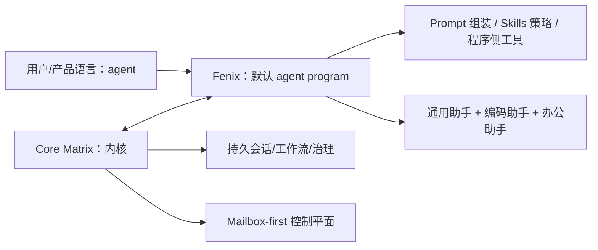

你当前所在的页面是 **Deep Dive / Fenix 代理程序** 下的中级条目，目录索引把它标记为 `9-mo-ren-dai-li-cheng-xu-de-ding-wei-yu-chan-pin-bian-jie`，而文档索引的当前实现状态也明确把 `Fenix` 放在“默认开箱即用的 agent program”这一层级上；因此，这一页的任务不是重新定义内核，而是把 `Fenix` 的产品角色、边界和下一步阅读路径说清楚。Sources: [wiki.json](https://github.com/jasl/cybros.new/blob/main/.zread/wiki/drafts/wiki.json#L69-L75) [docs/README.md](https://github.com/jasl/cybros.new/blob/main/docs/README.md#L16-L33) [agents/fenix/README.md](https://github.com/jasl/cybros.new/blob/main/agents/fenix/README.md#L1-L9)

## Fenix 是什么

`Fenix` 的产品定义是一个**实用型默认助手**：它同时吸收通用助手、编码助手和办公助手的行为特征，并且允许自己定义 agent 专属工具、确定性程序逻辑以及类似 slash command 的 composer 完成项；这也意味着它不要求每一次交互都必须由 LLM 驱动。Sources: [agents/fenix/README.md](https://github.com/jasl/cybros.new/blob/main/agents/fenix/README.md#L10-L20)

## 它为什么是“默认”，但不是“唯一”

`Fenix` 的边界写得很直接：它不是内核本身，不是未来所有产品形态的收容器，也不是要吞掉后续实验的“通用代理”；当 Core Matrix 需要验证明显不同的产品形状时，文档要求把这些形状放到**独立的 agent program** 里，而不是强行塞进 Fenix。Sources: [agents/fenix/README.md](https://github.com/jasl/cybros.new/blob/main/agents/fenix/README.md#L22-L39)

下面这张图只表达本页最核心的关系：**Core Matrix 负责通用内核与持久状态，Fenix 负责默认产品形态与程序侧行为**。Sources: [docs/design/2026-04-01-agent-program-runtime-contract.md](https://github.com/jasl/cybros.new/blob/main/docs/design/2026-04-01-agent-program-runtime-contract.md#L24-L35) [docs/design/2026-04-01-agent-program-runtime-contract.md](https://github.com/jasl/cybros.new/blob/main/docs/design/2026-04-01-agent-program-runtime-contract.md#L38-L57) [docs/finished-plans/2026-03-31-core-matrix-loop-fenix-program-design.md](https://github.com/jasl/cybros.new/blob/main/docs/finished-plans/2026-03-31-core-matrix-loop-fenix-program-design.md#L44-L72)

从设计约束看，`Core Matrix` 负责的是**持久、通用、可治理**的部分：会话、转轮、工作流、资源真值、审计和上下文投影；`Fenix` 则负责**程序行为**：prompt 组装、上下文压缩策略、记忆策略、领域工具塑形、子代理策略和输出整理。这个划分的关键点是：内核发送投影，代理程序返回意图和报告，而不是让代理程序直接改写内核真值。Sources: [docs/design/2026-04-01-agent-program-runtime-contract.md](https://github.com/jasl/cybros.new/blob/main/docs/design/2026-04-01-agent-program-runtime-contract.md#L24-L35) [docs/design/2026-04-01-agent-program-runtime-contract.md](https://github.com/jasl/cybros.new/blob/main/docs/design/2026-04-01-agent-program-runtime-contract.md#L38-L57) [docs/design/2026-04-01-agent-program-runtime-contract.md](https://github.com/jasl/cybros.new/blob/main/docs/design/2026-04-01-agent-program-runtime-contract.md#L120-L170) [docs/design/2026-04-01-agent-program-runtime-contract.md](https://github.com/jasl/cybros.new/blob/main/docs/design/2026-04-01-agent-program-runtime-contract.md#L173-L185)

## 边界清单：Fenix 负责什么，不负责什么

下表只归纳本页已经明确写出的职责边界，便于你把“默认代理程序”与“内核”分开理解。Sources: [agents/fenix/README.md](https://github.com/jasl/cybros.new/blob/main/agents/fenix/README.md#L12-L20) [agents/fenix/README.md](https://github.com/jasl/cybros.new/blob/main/agents/fenix/README.md#L22-L39) [docs/design/2026-04-01-agent-program-runtime-contract.md](https://github.com/jasl/cybros.new/blob/main/docs/design/2026-04-01-agent-program-runtime-contract.md#L120-L170)

| 维度 | Fenix 负责 | Fenix 不负责 |
|---|---|---|
| 产品角色 | 默认开箱即用的 agent program，兼顾通用助手、编码助手、办公助手 | 内核本身 |
| 能力形态 | agent 专属工具、确定性程序逻辑、composer 完成项 | 把所有未来产品形态都收进一个壳里 |
| 行为所有权 | prompt 组装、skills 策略、上下文塑形、输出整理 | 持久会话真值、工作流真值、治理真值 |
| 对内边界 | 作为 agent program 与 Core Matrix 协作 | 直接改写内核资源 |
| 产品策略 | 作为首个可验证的完整 Web 产品与运行时验证程序 | 作为“通用代理”吞并所有实验 |

这个边界在后续的运行时重置设计里进一步被收紧：`Conversation` 只绑定逻辑 agent 身份，`Turn` 才冻结具体程序版本与可选执行运行时；同时，Fenix 即使在同一个 appliance 里同时承担 program-plane 和 execution-plane，也只是实现上的合并，**不改变产品模型上“程序”和“执行运行时”是不同对象**这一前提。Sources: [docs/finished-plans/2026-04-03-agent-program-execution-runtime-reset-design.md](https://github.com/jasl/cybros.new/blob/main/docs/finished-plans/2026-04-03-agent-program-execution-runtime-reset-design.md#L59-L81) [docs/finished-plans/2026-04-03-agent-program-execution-runtime-reset-design.md](https://github.com/jasl/cybros.new/blob/main/docs/finished-plans/2026-04-03-agent-program-execution-runtime-reset-design.md#L85-L115)

## Fenix 的对外面：注册与控制，而不是直接执行回调

`Fenix` 的机器对接面不是“内核直接回调它去执行每一步”，而是以 `GET /runtime/manifest` 作为注册和能力公告入口，并通过 mailbox-first 的控制平面配合 `Core Matrix`；文档明确说，正常执行和 close control 不再走 runtime callback endpoint，而是走 `/cable`、`POST /program_api/control/poll` 和 `POST /program_api/control/report` 这类控制面路径。Sources: [agents/fenix/README.md](https://github.com/jasl/cybros.new/blob/main/agents/fenix/README.md#L40-L104)

如果你要继续顺着这条边界往下看，建议按这个顺序读：先看 [运行时契约：注册、配对与控制循环](https://github.com/jasl/cybros.new/blob/main/10-yun-xing-shi-qi-yue-zhu-ce-pei-dui-yu-kong-zhi-xun-huan) 理解 `Fenix` 如何被注册和配对，再看 [工具能力：网页、浏览器与长生命周期进程](https://github.com/jasl/cybros.new/blob/main/11-gong-ju-neng-li-wang-ye-liu-lan-qi-yu-chang-sheng-ming-zhou-qi-jin-cheng) 理解它实际暴露了哪些程序侧能力，最后回到 [接受性测试与手工回归流程](https://github.com/jasl/cybros.new/blob/main/12-jie-shou-xing-ce-shi-yu-shou-gong-hui-gui-liu-cheng) 看这套边界如何被验证。Sources: [wiki.json](https://github.com/jasl/cybros.new/blob/main/.zread/wiki/drafts/wiki.json#L77-L99) [docs/README.md](https://github.com/jasl/cybros.new/blob/main/docs/README.md#L37-L48)

## 一句话结论

`Fenix` 是 **Core Matrix 上第一个被产品化、可验证、可扩展的默认 agent program**；它负责“怎么表现”和“怎么做程序侧动作”，而 **Core Matrix** 负责“什么是真值”和“怎么维持系统边界”。Sources: [agents/fenix/README.md](https://github.com/jasl/cybros.new/blob/main/agents/fenix/README.md#L1-L9) [agents/fenix/README.md](https://github.com/jasl/cybros.new/blob/main/agents/fenix/README.md#L22-L39) [docs/design/2026-04-01-agent-program-runtime-contract.md](https://github.com/jasl/cybros.new/blob/main/docs/design/2026-04-01-agent-program-runtime-contract.md#L38-L57) [docs/finished-plans/2026-03-31-core-matrix-loop-fenix-program-design.md](https://github.com/jasl/cybros.new/blob/main/docs/finished-plans/2026-03-31-core-matrix-loop-fenix-program-design.md#L127-L150)