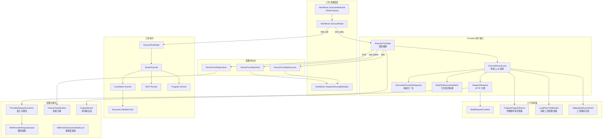
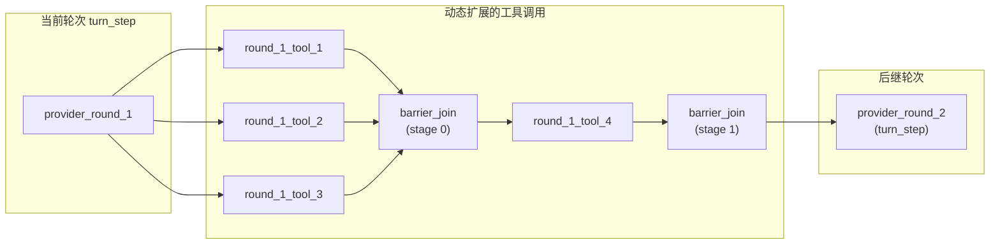
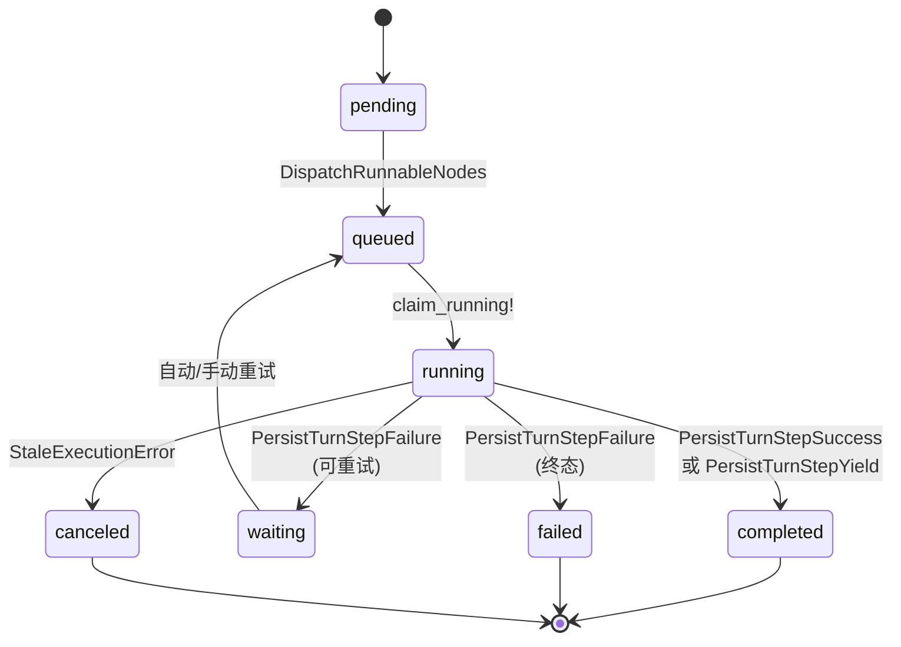

本文档深入解析 Core Matrix 的 **Provider 执行循环**——系统如何向 LLM Provider 发起轮次请求、处理模型返回的工具调用、执行工具并将结果持久化回工作流 DAG。这是整个 [工作流 DAG 执行引擎](https://github.com/jasl/cybros.new/blob/main/8-gong-zuo-liu-dag-zhi-xing-yin-qing-yu-diao-du-qi) 中最核心的运行时子系统，承担了"LLM 推理 → 工具调用 → LLM 继续推理"的循环编排职责。

---

## 架构总览

Provider 执行循环运行在 `ProviderExecution` 模块命名空间下，由 **22 个服务对象**协同完成，围绕 `WorkflowNode`（类型为 `turn_step` 或 `tool_call`）展开。每次轮次请求对应一次完整的 LLM API 调用，而工具调用则通过 DAG 动态扩展机制在运行时注入新节点。



Sources: [execute_node.rb](https://github.com/jasl/cybros.new/blob/main/core_matrix/app/services/workflows/execute_node.rb#L1-L51), [execute_turn_step.rb](https://github.com/jasl/cybros.new/blob/main/core_matrix/app/services/provider_execution/execute_turn_step.rb#L1-L141), [execute_round_loop.rb](https://github.com/jasl/cybros.new/blob/main/core_matrix/app/services/provider_execution/execute_round_loop.rb#L1-L154)

---

## 执行入口：ExecuteNode 与节点类型分派

工作流节点的执行入口是 `Workflows::ExecuteNode`，它根据 `WorkflowNode` 的 `node_type` 字段执行分派：

| `node_type` | 分派目标 | 职责 |
|---|---|---|
| `turn_step` | `ProviderExecution::ExecuteTurnStep` | 向 LLM 发起推理请求，处理文本输出或工具调用 |
| `tool_call` | `ProviderExecution::ExecuteToolNode` | 执行单个工具调用（子代理、MCP、内核工具等） |
| `barrier_join` | `Workflows::CompleteNode` | 阶段性同步屏障，等待同阶段并行工具全部完成 |
| `turn_root` | `Workflows::CompleteNode` | 轮次根节点，直接完成并调度后继 |

`Workflows::DispatchRunnableNodes` 负责调度器的输出转化为后台作业。它先在事务中将 `pending` 节点标记为 `queued`，然后按节点类型选择不同的 Solid Queue 队列：`turn_step` 使用 LLM 专属队列（按 provider 区分），`tool_call` 使用共享 `tool_calls` 队列。

Sources: [execute_node.rb](https://github.com/jasl/cybros.new/blob/main/core_matrix/app/services/workflows/execute_node.rb#L14-L36), [dispatch_runnable_nodes.rb](https://github.com/jasl/cybros.new/blob/main/core_matrix/app/services/workflows/dispatch_runnable_nodes.rb#L12-L59)

---

## 轮次执行编排：ExecuteTurnStep

`ExecuteTurnStep` 是 Provider 执行的顶层编排器。它对 `turn_step` 类型的工作流节点执行完整的生命周期管理，包括前置校验、状态声明、LLM 请求分发和三种终止路径的持久化。

### 前置校验与状态声明

`ExecuteTurnStep` 在执行前执行严格的断言链：

1. **节点类型**必须为 `turn_step`
2. **WorkflowRun** 必须处于 `active` 且 `ready`（无等待状态阻塞）
3. **Turn** 必须处于 `active` 状态
4. 必须提供至少一条 provider message
5. 节点不得已有终态（`completed`/`failed`/`canceled`）
6. 节点必须处于 `pending` 或 `queued` 状态

校验通过后，`claim_running!` 方法在 `with_lock` 保护下将节点原子性地更新为 `running`，并创建一条 `WorkflowNodeEvent`（`event_kind: "status"`）记录状态变更。

Sources: [execute_turn_step.rb](https://github.com/jasl/cybros.new/blob/main/core_matrix/app/services/provider_execution/execute_turn_step.rb#L27-L186)

### 三种终止路径

`ExecuteRoundLoop` 返回的 `Result` 携带 `kind` 字段标识该轮次的结局：

| `kind` | 含义 | 持久化服务 | 后续动作 |
|---|---|---|---|
| `final` | 模型返回纯文本输出，无工具调用 | `PersistTurnStepSuccess` | 创建输出变体、记录使用量、完成轮次 |
| `tool_batch` | 模型请求工具调用 | `PersistTurnStepYield` | 动态扩展 DAG、创建工具节点和屏障节点 |
| 异常 | 请求失败、限流或超限 | `PersistTurnStepFailure` | 分类失败、标记节点等待/终态 |

当 `kind` 为 `final` 时，`ExecuteTurnStep` 会额外启动 **OutputStream** 实时推送输出增量（delta），通过 `ConversationRuntime::Broadcast` 向会话的 Action Cable 订阅者广播 `runtime.assistant_output.delta`、`runtime.assistant_output.completed` 等事件。

Sources: [execute_turn_step.rb](https://github.com/jasl/cybros.new/blob/main/core_matrix/app/services/provider_execution/execute_turn_step.rb#L40-L141), [output_stream.rb](https://github.com/jasl/cybros.new/blob/main/core_matrix/app/services/provider_execution/output_stream.rb#L1-L95)

---

## 单轮请求循环：ExecuteRoundLoop

`ExecuteRoundLoop` 封装了**一次完整的 LLM 轮次请求**，其默认最大轮次为 **64 轮**（由 `DEFAULT_MAX_ROUNDS` 常量和 `loop_policy.max_rounds` 配置控制）。该服务的执行流程如下：

### 1. 上下文组装

通过 `BuildRequestContext` 从 `TurnExecutionSnapshot` 提取冻结的模型上下文，构建 `ProviderRequestContext` 对象。该对象包含：

- **provider_handle / model_ref / api_model**：目标 Provider 和模型标识
- **wire_api**：协议类型（`chat_completions` 或 `responses`）
- **execution_settings**：执行参数（temperature 等）
- **hard_limits**：硬性限制（max_output_tokens 等）
- **advisory_hints**：建议性提示（含压缩阈值）

Sources: [build_request_context.rb](https://github.com/jasl/cybros.new/blob/main/core_matrix/app/services/provider_execution/build_request_context.rb#L1-L57), [provider_request_context.rb](https://github.com/jasl/cybros.new/blob/main/core_matrix/app/models/provider_request_context.rb#L1-L62)

### 2. 代理程序轮次准备

`PrepareProgramRound` 通过 `ProgramMailboxExchange` 向代理程序（Fenix）发起 `prepare_round` 请求，让代理程序有机会：

- **修改消息列表**：注入系统提示、压缩历史、添加上下文
- **声明工具表面**：指定本轮需要暴露给 LLM 的工具集

该请求遵循 `agent-program/2026-04-01` 协议版本，传递完整的会话投影（`conversation_projection`）和能力投影（`capability_projection`）。代理程序返回的 `messages` 和 `tool_surface` 必须存在，否则触发 `ProtocolError`。

Sources: [prepare_program_round.rb](https://github.com/jasl/cybros.new/blob/main/core_matrix/app/services/provider_execution/prepare_program_round.rb#L1-L53)

### 3. 工具绑定冻结

`MaterializeRoundTools`（委托给 `ToolBindings::FreezeForWorkflowNode`）将代理程序声明的工具表面与 `execution_snapshot` 中的可见工具目录交叉比对，为匹配的工具创建或复用 `ToolBinding` 记录，将其冻结到当前工作流节点上。

同时，`visible_core_matrix_binding_ids` 查找已冻结在节点上的所有 `core_matrix` 源工具绑定（如 `subagent_spawn`、`subagent_send` 等），确保这些内核工具始终可用。

Sources: [materialize_round_tools.rb](https://github.com/jasl/cybros.new/blob/main/core_matrix/app/services/provider_execution/materialize_round_tools.rb#L1-L19), [execute_round_loop.rb](https://github.com/jasl/cybros.new/blob/main/core_matrix/app/services/provider_execution/execute_round_loop.rb#L69-L83), [execute_round_loop.rb](https://github.com/jasl/cybros.new/blob/main/core_matrix/app/services/provider_execution/execute_round_loop.rb#L276-L293)

### 4. 前轮工具结果注入

`LoadPriorToolResults` 从工作流 DAG 中提取前序轮次产生的工具调用结果。它按照 `metadata["prior_tool_node_keys"]` 中的有序列表查找对应的 `WorkflowNode`，从其 `ToolInvocation` 中提取成功或失败的响应载荷。

这些结果通过 `protocol_continuation_entries` 方法转换为协议特定的续接消息格式：

| 协议 | 助手消息 | 工具结果消息 |
|---|---|---|
| `chat_completions` | `{ role: "assistant", tool_calls: [...] }` | `{ role: "tool", tool_call_id: ..., content: ... }` |
| `responses` | `{ type: "function_call", call_id: ..., ... }` | `{ type: "function_call_output", call_id: ..., output: ... }` |

Sources: [load_prior_tool_results.rb](https://github.com/jasl/cybros.new/blob/main/core_matrix/app/services/provider_execution/load_prior_tool_results.rb#L1-L44), [execute_round_loop.rb](https://github.com/jasl/cybros.new/blob/main/core_matrix/app/services/provider_execution/execute_round_loop.rb#L199-L263)

### 5. HTTP 请求分发

`DispatchRequest` 负责 LLM API 的实际 HTTP 调用。它根据 `wire_api` 选择协议客户端：

- **`chat_completions`** → `SimpleInference::Client`（OpenAI 兼容接口）
- **`responses`** → `SimpleInference::Protocols::OpenAIResponses`（OpenAI Responses API）

请求支持**流式传输**（当提供 `on_delta` 回调时启用），并且实现了**瞬态重试**：对 `TimeoutError` 和 `ConnectionError` 最多重试 2 次，但若已收到增量数据则不再重试（避免重复输出）。

Sources: [dispatch_request.rb](https://github.com/jasl/cybros.new/blob/main/core_matrix/app/services/provider_execution/dispatch_request.rb#L1-L284)

### 6. 响应归一化

`NormalizeProviderResponse` 将两种协议的响应统一为内部格式：

```ruby
{
  "output_text" => "...",       # 模型文本输出
  "tool_calls" => [...],        # 归一化后的工具调用列表
  "usage" => {...},             # token 使用量
}
```

每个工具调用被归一化包含 `call_id`、`tool_name`、`arguments`（已解析为 Hash）、`provider_format` 字段。参数必须是合法的 JSON 对象，否则抛出 `SimpleInference::DecodeError`。

若 `tool_calls` 为空，`ExecuteRoundLoop` 返回 `kind: "final"`；否则进入工具批次构建阶段。

Sources: [normalize_provider_response.rb](https://github.com/jasl/cybros.new/blob/main/core_matrix/app/services/provider_execution/normalize_provider_response.rb#L1-L88)

---

## 准入控制与请求租约

### ProviderRequestGovernor

`ProviderRequestGovernor` 实现了基于数据库的 Provider 请求准入控制，防止并发请求过多导致上游限流。其准入逻辑：

1. 检查 `ProviderRequestControl` 上的 `cooldown_until`——若处于冷却期则拒绝
2. 检查活跃租约数是否超过 `max_concurrent_requests` 配额——超限则等待最早租约过期
3. 通过检查后创建 `ProviderRequestLease` 记录，包含自动过期时间

当检测到 HTTP 429 响应时，`record_rate_limit!` 会更新冷却期至 `Retry-After` 头指定的时间。

Sources: [provider_request_governor.rb](https://github.com/jasl/cybros.new/blob/main/core_matrix/app/services/provider_execution/provider_request_governor.rb#L1-L236)

### WithProviderRequestLease

`WithProviderRequestLease` 在 Provider 请求期间维护租约的生命周期。它启动一个**后台线程**定期续约（默认每 60 秒），确保长时间推理不会因租约过期而被误判为失效。请求完成或异常时，后台线程被优雅停止，租约被释放。

Sources: [with_provider_request_lease.rb](https://github.com/jasl/cybros.new/blob/main/core_matrix/app/services/provider_execution/with_provider_request_lease.rb#L1-L121)

---

## 工具批次构建与 DAG 动态扩展

### BuildToolExecutionBatch

当 LLM 返回工具调用时，`BuildToolExecutionBatch` 将调用列表组织为执行批次：

1. **匹配绑定**：每个工具调用通过 `tool_name` 查找对应的 `ToolBinding`
2. **并行安全分组**：检查绑定的 `execution_policy.parallel_safe` 标记，将连续的可并行工具打包为 `parallel_safe_group`，不可并行的归为 `serial_group`
3. **构建阶段**：每个分组成为一个 `stage`，包含 `dispatch_mode`（`parallel` 或 `serial`）和 `completion_barrier`（`wait_all`）
4. **声明后继节点**：构建下一轮 `turn_step` 节点的元数据（含 `provider_round_index` 递增、`prior_tool_node_keys` 累积）

Sources: [build_tool_execution_batch.rb](https://github.com/jasl/cybros.new/blob/main/core_matrix/app/services/provider_execution/build_tool_execution_batch.rb#L1-L113)

### PersistTurnStepYield：DAG 动态扩展

`PersistTurnStepYield` 是 Provider 执行循环中最复杂的持久化操作。它在事务内完成以下工作：



具体步骤：

1. **记录使用量**：调用 `ProviderUsage::RecordEvent` 创建 `UsageEvent` 并触发滚动聚合
2. **记录执行画像**：调用 `ExecutionProfiling::RecordFact` 记录 token 用量和压缩阈值评估
3. **物化 DAG 节点和边**：通过 `Workflows::Mutate` 创建 `tool_call` 节点、`barrier_join` 节点和连接边
4. **克隆工具绑定**：将源工具绑定复制到新的 `tool_call` 节点上，附带来源溯源信息
5. **持久化制品**：创建 `WorkflowArtifact`，包括工具批次清单（`provider_tool_batch_manifest`）和每阶段的意图批屏障（`intent_batch_barrier`）
6. **标记当前节点完成**：将 `turn_step` 节点更新为 `completed`
7. **调度可运行节点**：触发 `RefreshRunLifecycle` + `DispatchRunnableNodes`

Sources: [persist_turn_step_yield.rb](https://github.com/jasl/cybros.new/blob/main/core_matrix/app/services/provider_execution/persist_turn_step_yield.rb#L1-L317)

---

## 工具执行路由与运行器

### RouteToolCall

`RouteToolCall` 根据 `ToolBinding` 关联的 `implementation_source.source_kind` 将工具调用路由到对应的运行器：

| `source_kind` | 运行器 | 执行环境 |
|---|---|---|
| `core_matrix` | `CoreMatrix` | Core Matrix 内核工具（子代理操作） |
| `mcp` | `MCP` | MCP Streamable HTTP 外部工具 |
| `agent` / `kernel` / `execution_runtime` | `Program` | 代理程序（Fenix）工具 |

Sources: [route_tool_call.rb](https://github.com/jasl/cybros.new/blob/main/core_matrix/app/services/provider_execution/route_tool_call.rb#L1-L35), [tool_call_runners.rb](https://github.com/jasl/cybros.new/blob/main/core_matrix/app/services/provider_execution/tool_call_runners.rb#L1-L19)

### CoreMatrix 运行器

处理 Core Matrix 内置工具（`subagent_spawn`、`subagent_send`、`subagent_wait`、`subagent_close`、`subagent_list`）。通过幂等键（`call_id`）创建 `ToolInvocation`，执行后标记为 `succeeded` 或 `failed`。

Sources: [core_matrix.rb](https://github.com/jasl/cybros.new/blob/main/core_matrix/app/services/provider_execution/tool_call_runners/core_matrix.rb#L1-L84), [execute_core_matrix_tool.rb](https://github.com/jasl/cybros.new/blob/main/core_matrix/app/services/provider_execution/execute_core_matrix_tool.rb#L1-L78)

### MCP 运行器

委托给 `MCP::InvokeTool`，通过 Streamable HTTP 传输调用外部 MCP 工具服务器。工具调用的成功/失败状态直接从返回的 `ToolInvocation` 中读取。

Sources: [mcp.rb](https://github.com/jasl/cybros.new/blob/main/core_matrix/app/services/provider_execution/tool_call_runners/mcp.rb#L1-L31)

### Program 运行器

最复杂的运行器，负责将工具调用委托给代理程序（Fenix）执行。它通过 `ProgramMailboxExchange.execute_program_tool` 向代理程序发送请求，并管理**运行时资源**的生命周期：

- **CommandRun**：`exec_command` 工具创建命令运行实例，支持后续的 `command_run_wait`、`command_run_read_output`、`write_stdin`、`command_run_terminate` 操作
- **ProcessRun**：`process_exec` 工具创建进程运行实例，支持 `process_proxy_info`、`process_read_output` 操作

代理程序返回后，Program 运行器根据响应中的 `lifecycle_state` 字段协调资源的激活、终态化或失败处理。

Sources: [program.rb](https://github.com/jasl/cybros.new/blob/main/core_matrix/app/services/provider_execution/tool_call_runners/program.rb#L1-L342)

### ProgramMailboxExchange

`ProgramMailboxExchange` 实现了 Core Matrix 与代理程序之间的**同步请求-响应协议**。其工作机制：

1. 通过 `AgentControl::CreateAgentProgramRequest` 创建邮箱项
2. 轮询等待代理程序报告回执（`AgentControlReportReceipt`）
3. 支持超时控制：`prepare_round` 默认 30 秒，`execute_program_tool` 默认 5 分钟（可被工具参数 `timeout_seconds` 扩展）

Sources: [program_mailbox_exchange.rb](https://github.com/jasl/cybros.new/blob/main/core_matrix/app/services/provider_execution/program_mailbox_exchange.rb#L1-L146)

---

## 成功路径持久化

`PersistTurnStepSuccess` 在 `WithFreshExecutionStateLock`（三层行级锁：Turn → WorkflowRun → WorkflowNode）保护下完成：

1. **创建输出变体**：通过 `Turns::CreateOutputVariant` 创建 `Message` 记录作为模型输出
2. **记录使用量事件**：创建 `UsageEvent`，包含 input_tokens、output_tokens、延迟等
3. **记录执行画像**：创建 `ExecutionProfileFact`，包含完整的 provider 上下文和压缩阈值评估
4. **更新轮次状态**：将 Turn 标记为 `completed`，设置 `selected_output_message`
5. **更新节点状态**：将 WorkflowNode 标记为 `completed`，记录时间戳
6. **创建状态事件**：记录 `WorkflowNodeEvent` 携带 `output_message_id`、`provider_request_id`、`usage_event_id`

`WithFreshExecutionStateLock` 确保在持久化时执行上下文未被并发修改——它校验 Turn 仍然活跃、WorkflowRun 仍然就绪、输入消息和模型选择与快照一致。

Sources: [persist_turn_step_success.rb](https://github.com/jasl/cybros.new/blob/main/core_matrix/app/services/provider_execution/persist_turn_step_success.rb#L1-L165), [with_fresh_execution_state_lock.rb](https://github.com/jasl/cybros.new/blob/main/core_matrix/app/services/provider_execution/with_fresh_execution_state_lock.rb#L1-L59)

---

## 失败分类与恢复策略

### FailureClassification

`FailureClassification` 将异常映射为结构化的失败结果，驱动后续的恢复策略：

| 错误类型 | failure_category | failure_kind | retry_strategy | max_auto_retries |
|---|---|---|---|---|
| `AdmissionRefused` | external_dependency_blocked | provider_rate_limited | automatic | 2 |
| HTTP 429 | external_dependency_blocked | provider_rate_limited | automatic | 2 |
| HTTP 401/403 | external_dependency_blocked | provider_auth_expired | manual | 0 |
| HTTP 402 / credits exhausted | external_dependency_blocked | provider_credits_exhausted | manual | 0 |
| HTTP 5xx | external_dependency_blocked | provider_overloaded | automatic | 2 |
| Timeout / Connection | external_dependency_blocked | provider_unreachable | automatic | 2 |
| ProtocolError | contract_error | invalid_program_response_contract | automatic | 1 |
| RecordNotFound | contract_error | unknown_tool_reference | automatic | 1 |
| RecordInvalid | contract_error | invalid_tool_arguments | automatic | 1 |
| RoundLimitExceeded | contract_error | provider_round_limit_exceeded | automatic | 1 |
| 其他未预期错误 | implementation_error | internal_unexpected_error | nil (terminal) | 0 |

`retry_strategy` 为 `automatic` 时由系统自动重试；为 `manual` 时需要人工干预。`terminal: true` 的失败会终止整个节点。

Sources: [failure_classification.rb](https://github.com/jasl/cybros.new/blob/main/core_matrix/app/services/provider_execution/failure_classification.rb#L1-L146)

### PersistTurnStepFailure

失败路径的持久化通过 `Workflows::BlockNodeForFailure` 将节点标记为 `waiting`（可重试）或 `failed`（终态），同时记录 `execution_profile_fact` 用于诊断。`ExecuteTurnStep` 的异常处理会区分 `AdmissionRefused`（可能因工作流已取消导致）、`RoundRequestFailed`、`RoundLimitExceeded` 和 `StaleExecutionError` 四种情况分别处理。

Sources: [persist_turn_step_failure.rb](https://github.com/jasl/cybros.new/blob/main/core_matrix/app/services/provider_execution/persist_turn_step_failure.rb#L1-L73), [execute_turn_step.rb](https://github.com/jasl/cybros.new/blob/main/core_matrix/app/services/provider_execution/execute_turn_step.rb#L89-L141)

---

## 实时输出流

`OutputStream` 封装了模型输出的增量推送机制。它在三种事件间切换：

- **`runtime.assistant_output.started`**：流开始
- **`runtime.assistant_output.delta`**：增量文本（默认 64 字节缓冲，遇换行符立即刷新）
- **`runtime.assistant_output.completed`**：流完成，携带完整消息 ID 和内容
- **`runtime.assistant_output.failed`**：流失败，携带错误码和消息

所有事件通过 `ConversationRuntime::Broadcast` 发送到会话专属的 Action Cable 频道。

Sources: [output_stream.rb](https://github.com/jasl/cybros.new/blob/main/core_matrix/app/services/provider_execution/output_stream.rb#L1-L95)

---

## WorkflowNode 生命周期状态机

Provider 执行循环中 `WorkflowNode` 的状态流转遵循严格的状态机：



模型层通过 `execution_timestamps_consistency` 校验器确保时间戳与状态一致：`pending`/`queued` 不得有时间戳，`running`/`waiting` 必须有 `started_at`，终态必须有 `finished_at`。

Sources: [workflow_node.rb](https://github.com/jasl/cybros.new/blob/main/core_matrix/app/models/workflow_node.rb#L14-L88)

---

## 关键数据模型关系

Provider 执行循环涉及的核心模型及其关系：

| 模型 | 在执行循环中的角色 |
|---|---|
| `WorkflowNode` | 执行载体，承载 `turn_step` 和 `tool_call` 两种类型 |
| `ToolBinding` | 冻结在节点上的工具声明，含执行策略 |
| `ToolInvocation` | 工具调用的幂等执行记录（status: running → succeeded/failed） |
| `ProviderRequestContext` | 冻结的 LLM 请求上下文（provider、model、settings） |
| `ProviderRequestLease` | 并发控制租约，防止过载 |
| `ProviderRequestControl` | 每个 provider 的准入控制状态（冷却期等） |
| `UsageEvent` | 每次 LLM 调用的 token 计费记录 |
| `ExecutionProfileFact` | 执行画像事实，用于诊断和阈值评估 |
| `WorkflowArtifact` | 工具批次清单、屏障制品等结构化数据 |
| `WorkflowNodeEvent` | 节点状态变更和业务事件的有序日志 |

Sources: [workflow_node.rb](https://github.com/jasl/cybros.new/blob/main/core_matrix/app/models/workflow_node.rb#L1-L178), [tool_invocation.rb](https://github.com/jasl/cybros.new/blob/main/core_matrix/app/models/tool_invocation.rb#L1-L121), [provider_request_context.rb](https://github.com/jasl/cybros.new/blob/main/core_matrix/app/models/provider_request_context.rb#L1-L62), [workflow_artifact.rb](https://github.com/jasl/cybros.new/blob/main/core_matrix/app/models/workflow_artifact.rb#L1-L106)

---

## 相关主题

- **工作流 DAG 调度器**：理解节点如何被调度为可执行状态，参见 [工作流 DAG 执行引擎与调度器](https://github.com/jasl/cybros.new/blob/main/8-gong-zuo-liu-dag-zhi-xing-yin-qing-yu-diao-du-qi)
- **LLM Provider 目录**：了解 Provider 定义、模型选择和准入控制配置，参见 [LLM Provider 目录与模型选择解析](https://github.com/jasl/cybros.new/blob/main/11-llm-provider-mu-lu-yu-mo-xing-xuan-ze-jie-xi)
- **工具治理**：工具绑定的冻结策略和 MCP 传输，参见 [工具治理、绑定与 MCP Streamable HTTP 传输](https://github.com/jasl/cybros.new/blob/main/12-gong-ju-zhi-li-bang-ding-yu-mcp-streamable-http-chuan-shu)
- **子代理工具**：CoreMatrix 运行器处理的子代理操作，参见 [子代理会话、执行租约与可关闭资源路由](https://github.com/jasl/cybros.new/blob/main/14-zi-dai-li-hui-hua-zhi-xing-zu-yue-yu-ke-guan-bi-zi-yuan-lu-you)
- **使用量计费**：UsageEvent 的记录和聚合机制，参见 [使用量计费、执行画像与审计日志](https://github.com/jasl/cybros.new/blob/main/15-shi-yong-liang-ji-fei-zhi-xing-hua-xiang-yu-shen-ji-ri-zhi)
- **Fenix 控制循环**：代理程序如何接收和响应 `prepare_round` / `execute_program_tool` 请求，参见 [控制循环、邮箱工作器与实时会话](https://github.com/jasl/cybros.new/blob/main/20-kong-zhi-xun-huan-you-xiang-gong-zuo-qi-yu-shi-shi-hui-hua)