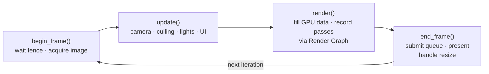

**Himalaya** is a real-time renderer built on **Vulkan 1.4**, designed as a layered system for learning and practicing modern graphics engineering. It currently implements a full rasterization pipeline with PBR shading, cascaded shadow maps, screen-space ambient occlusion, and an experimental path-tracing reference view — all orchestrated through a declarative render graph with automatic barrier insertion.

This page provides a high-level map of the project: what it is, how the code is organized, what rendering features are implemented, and where to go next depending on your interest.

Sources: [CLAUDE.md](https://github.com/1PercentSync/himalaya/blob/main/CLAUDE.md#L1-L10), [CMakeLists.txt](https://github.com/1PercentSync/himalaya/blob/main/CMakeLists.txt#L1-L11)

---

## What Is Himalaya?

Himalaya is a **personal, long-term rendering project** targeting mid-range desktop GPUs. It is not a game engine — there is no scripting system, no entity-component architecture, no asset pipeline beyond loading glTF scenes. The entire focus is on the rendering pipeline itself: how geometry flows from disk to GPU, how passes communicate through resources, and how visual quality scales with increasingly sophisticated techniques.

The project follows a **progressive enhancement** philosophy: every rendering feature starts as the simplest working version and evolves through incremental upgrades. For example, shadows begin as a basic shadow map, then gain cascading (CSM), then PCF filtering, then PCSS contact-hardening soft shadows — each step building on the last without tearing down what came before.

Sources: [requirements-and-philosophy.md](https://github.com/1PercentSync/himalaya/blob/main/docs/project/requirements-and-philosophy.md#L1-L30)

---

## Architecture at a Glance

The codebase is organized as **four strictly layered static libraries**, compiled with a one-way dependency rule. Layer 0 never includes headers from Layer 1, Layer 1 never includes Layer 2, and Layer 2 passes never include each other. The application layer (Layer 3) sits on top, owning all subsystems and filling per-frame data.

```mermaid
graph TB
    subgraph "Layer 3 — Application (himalaya::app)"
        APP["Application<br/>window · frame loop · input"]
        REN["Renderer<br/>pass orchestration · GPU data fill"]
        SL["SceneLoader<br/>glTF → meshes · textures · materials"]
        DUI["DebugUI<br/>ImGui panels · runtime tuning"]
        CFG["Config<br/>JSON persistence"]
    end

    subgraph "Layer 2 — Render Passes (himalaya::passes)"
        DP["DepthPrepass"]
        FP["ForwardPass"]
        SP["ShadowPass"]
        GTAO["GTAOPass"]
        AOS["AOSpatialPass"]
        AOT["AOTemporalPass"]
        CS["ContactShadowsPass"]
        SB["SkyboxPass"]
        TM["TonemappingPass"]
        RV["ReferenceViewPass<br/>(path tracing)"]
    end

    subgraph "Layer 1 — Framework (himalaya::framework)"
        RG["RenderGraph<br/>barrier insertion · pass orchestration"]
        MS["MaterialSystem<br/>GPU material SSBO"]
        MESH["Mesh Management<br/>unified vertex format"]
        TEX["Texture<br/>loading · BC compression · upload"]
        IBL["IBL<br/>irradiance · prefilter · BRDF LUT"]
        CULL["Frustum Culling<br/>AABB test · draw groups"]
        SHADOW["Shadow Utilities<br/>CSM cascade computation"]
        SAS["SceneASBuilder<br/>BLAS/TLAS for RT"]
    end

    subgraph "Layer 0 — RHI (himalaya::rhi)"
        CTX["Context<br/>instance · device · queues · allocator"]
        RES["ResourceManager<br/>generation-based handles"]
        DM["DescriptorManager<br/>3-set layout · bindless textures"]
        CMD["CommandBuffer<br/>recording wrappers"]
        PIPE["Pipeline<br/>graphics · compute · RT"]
        SHD["ShaderCompiler<br/>GLSL → SPIR-V · hot reload"]
        SWP["Swapchain<br/>surface · present"]
        AS["AccelerationStructure<br/>BLAS/TLAS build"]
    end

    APP --> REN
    APP --> SL
    APP --> DUI
    REN --> DP & FP & SP & GTAO & AOS & AOT & CS & SB & TM & RV
    DP & FP & SP & GTAO & AOS & AOT & CS & SB & TM & RV --> RG
    RG --> RES & DM
    REN & SL --> MS & MESH & TEX & IBL & SHADOW & SAS
    APP --> CTX & SWP
    RG --> CMD
    REN --> PIPE & SHD
    SAS --> AS
```

The arrows represent compile-time `#include` dependencies, which flow strictly downward. Each layer only knows about the layer directly beneath it — passes never reference each other's headers, and the RHI contains zero rendering logic.

Sources: [architecture.md](https://github.com/1PercentSync/himalaya/blob/main/docs/project/architecture.md#L90-L200), [CLAUDE.md](https://github.com/1PercentSync/himalaya/blob/main/CLAUDE.md#L97-L137)

---

## Project Structure

The repository root contains four source directories (one per layer), a `shaders/` directory of GLSL files, `assets/` with sample glTF scenes and HDR environments, and a `docs/` tree of design documentation:

| Directory | Static Library | Purpose |
|-----------|---------------|---------|
| `rhi/` | `himalaya_rhi` | Vulkan abstraction — device, resources, descriptors, pipelines, shaders, swapchain, acceleration structures |
| `framework/` | `himalaya_framework` | Rendering infrastructure — render graph, materials, meshes, textures, IBL, culling, shadows, scene AS builder |
| `passes/` | `himalaya_passes` | Individual render passes — depth prepass, forward, shadow, GTAO, contact shadows, skybox, tonemapping, PT reference |
| `app/` | `himalaya_app` (executable) | Application — main loop, scene loading, camera controller, debug UI, renderer orchestration |
| `shaders/` | *(compiled at runtime)* | GLSL 460 shaders — vertex, fragment, compute, and ray tracing stages |
| `assets/` | *(loaded at runtime)* | Sample scenes (DamagedHelmet, Sponza) and HDR environment maps |
| `docs/` | — | Design decisions, milestone plans, roadmap |
| `third_party/` | — | Vendored libraries (bc7enc ISPC compression, OIDN denoiser headers) |

The dependency chain is enforced at the CMake level: `himalaya_rhi` has no target dependencies, `himalaya_framework` links `himalaya_rhi`, `himalaya_passes` links `himalaya_framework`, and `himalaya_app` links all three.

Sources: [CMakeLists.txt](https://github.com/1PercentSync/himalaya/blob/main/CMakeLists.txt#L1-L11), [CLAUDE.md](https://github.com/1PercentSync/himalaya/blob/main/CLAUDE.md#L97-L137)

---

## Implemented Rendering Features

The following table summarizes the rendering techniques currently in the codebase, organized by feature area. Each entry shows which layer owns the implementation and which shader stages are involved.

| Feature | Layer | Key Files | Shader Stages |
|---------|-------|-----------|---------------|
| **Cook-Torrance PBR** (GGX + Smith + Schlick) | 2 | [forward_pass.cpp](https://github.com/1PercentSync/himalaya/blob/main/passes/src/forward_pass.cpp), [forward.frag](https://github.com/1PercentSync/himalaya/blob/main/shaders/forward.frag) | vert + frag |
| **IBL Split-Sum** (irradiance + prefilter + BRDF LUT) | 1 | [ibl.cpp](https://github.com/1PercentSync/himalaya/blob/main/framework/src/ibl.cpp), [ibl_compute.cpp](https://github.com/1PercentSync/himalaya/blob/main/framework/src/ibl_compute.cpp) | compute |
| **Depth Prepass** (Z-fill, masked alpha test) | 2 | [depth_prepass.cpp](https://github.com/1PercentSync/himalaya/blob/main/passes/src/depth_prepass.cpp), [depth_prepass.vert](https://github.com/1PercentSync/himalaya/blob/main/shaders/depth_prepass.vert) | vert + frag |
| **Cascaded Shadow Maps** (PSSM splits, texel snapping) | 2 | [shadow_pass.cpp](https://github.com/1PercentSync/himalaya/blob/main/passes/src/shadow_pass.cpp), [shadow.vert](https://github.com/1PercentSync/himalaya/blob/main/shaders/shadow.vert) | vert + frag |
| **PCF + PCSS Soft Shadows** | 2 | [shadow.glsl](https://github.com/1PercentSync/himalaya/blob/main/shaders/common/shadow.glsl) | frag (forward) |
| **GTAO** (horizon-based AO) | 2 | [gtao_pass.cpp](https://github.com/1PercentSync/himalaya/blob/main/passes/src/gtao_pass.cpp), [gtao.comp](https://github.com/1PercentSync/himalaya/blob/main/shaders/gtao.comp) | compute |
| **AO Spatial + Temporal Denoising** | 2 | [ao_spatial_pass.cpp](https://github.com/1PercentSync/himalaya/blob/main/passes/src/ao_spatial_pass.cpp), [ao_temporal_pass.cpp](https://github.com/1PercentSync/himalaya/blob/main/passes/src/ao_temporal_pass.cpp) | compute |
| **Contact Shadows** (screen-space ray march) | 2 | [contact_shadows_pass.cpp](https://github.com/1PercentSync/himalaya/blob/main/passes/src/contact_shadows_pass.cpp), [contact_shadows.comp](https://github.com/1PercentSync/himalaya/blob/main/shaders/contact_shadows.comp) | compute |
| **Specular Occlusion** (GTSO / Lagarde) | 2 | [forward.frag](https://github.com/1PercentSync/himalaya/blob/main/shaders/forward.frag) | frag |
| **Skybox** (IBL cubemap) | 2 | [skybox_pass.cpp](https://github.com/1PercentSync/himalaya/blob/main/passes/src/skybox_pass.cpp), [skybox.frag](https://github.com/1PercentSync/himalaya/blob/main/shaders/skybox.frag) | vert + frag |
| **Tonemapping** (ACES fitted curve) | 2 | [tonemapping_pass.cpp](https://github.com/1PercentSync/himalaya/blob/main/passes/src/tonemapping_pass.cpp), [tonemapping.frag](https://github.com/1PercentSync/himalaya/blob/main/shaders/tonemapping.frag) | vert + frag |
| **Path Tracing Reference View** | 2 | [reference_view_pass.cpp](https://github.com/1PercentSync/himalaya/blob/main/passes/src/reference_view_pass.cpp), [reference_view.rgen](https://github.com/1PercentSync/himalaya/blob/main/shaders/rt/reference_view.rgen) | RT raygen/closesthit/miss/anyhit |
| **OIDN Denoising** | 1 | [denoiser.cpp](https://github.com/1PercentSync/himalaya/blob/main/framework/src/denoiser.cpp) | CPU + GPU |
| **BC Texture Compression** | 1 | [texture.cpp](https://github.com/1PercentSync/himalaya/blob/main/framework/src/texture.cpp), [ibl_compress.cpp](https://github.com/1PercentSync/himalaya/blob/main/framework/src/ibl_compress.cpp) | compute (BC6H) |
| **Frustum Culling** | 1 | [culling.cpp](https://github.com/1PercentSync/himalaya/blob/main/framework/src/culling.cpp) | CPU |
| **Bindless Descriptors** | 0 | [descriptors.cpp](https://github.com/1PercentSync/himalaya/blob/main/rhi/src/descriptors.cpp) | — |
| **Runtime Shader Compilation** | 0 | [shader.cpp](https://github.com/1PercentSync/himalaya/blob/main/rhi/src/shader.cpp) | — |
| **Generation-Based Resource Handles** | 0 | [resources.cpp](https://github.com/1PercentSync/himalaya/blob/main/rhi/src/resources.cpp) | — |

Sources: [scene_data.h](https://github.com/1PercentSync/himalaya/blob/main/framework/include/himalaya/framework/scene_data.h#L264-L399), [bindings.glsl](https://github.com/1PercentSync/himalaya/blob/main/shaders/common/bindings.glsl#L1-L190)

---

## Frame Lifecycle

Every frame follows the same lifecycle managed by the `Application` class. The loop decomposes into four phases: **begin** (GPU sync + swapchain acquire), **update** (camera, culling, UI), **render** (command buffer recording via render graph), and **end** (submit + present + resize handling).

Within the `render()` phase, the `Renderer` fills GPU uniform/storage buffers from the current frame's scene data, then rebuilds the render graph each frame: imported resources are declared, passes are registered with their resource dependencies, `compile()` computes image layout transitions, and `execute()` records commands with automatic barrier insertion.

Sources: [application.cpp](https://github.com/1PercentSync/himalaya/blob/main/app/src/application.cpp#L239-L258), [renderer.h](https://github.com/1PercentSync/himalaya/blob/main/app/include/himalaya/app/renderer.h#L62-L88)

---

## Current Development Phase

Himalaya is currently in **Milestone 1, Phase 6** — adding real-time ray tracing infrastructure and a path-traced reference view. The rasterization pipeline (depth prepass → shadow pass → GTAO → contact shadows → forward PBR → skybox → tonemapping) is feature-complete for M1. The ongoing RT work introduces:

- **RHI-level acceleration structure abstraction** (BLAS/TLAS creation, building, destruction)
- **RT pipeline and shader binding table** (raygen, closest-hit, miss, any-hit shaders)
- **Scene AS builder** (per-mesh-group BLAS, scene TLAS, Geometry Info SSBO)
- **Path-tracing reference view** with accumulation, OIDN viewport denoising, and importance sampling

The project uses **2 frames in flight** with explicit `init()/destroy()` lifetime management — no RAII destructors for GPU resources. All Vulkan API calls are checked via the `VK_CHECK` macro, and validation layers are always enabled during development.

Sources: [current-phase.md](https://github.com/1PercentSync/himalaya/blob/main/docs/current-phase.md#L1-L50), [context.h](https://github.com/1PercentSync/himalaya/blob/main/rhi/include/himalaya/rhi/context.h#L32-L46)

---

## Technical Foundation

The renderer is built on a consistent set of Vulkan conventions and design choices that permeate every layer:

| Convention | Choice | Rationale |
|-----------|--------|-----------|
| Vulkan version | **1.4** (core features: Dynamic Rendering, Synchronization2, Extended Dynamic State, Descriptor Indexing) | Eliminates render pass/framebuffer boilerplate; enables bindless textures |
| Depth strategy | **Reverse-Z** (near=1, far=0, compare `GREATER`) | Superior depth precision distribution for large view distances |
| Depth format | **D32Sfloat** (no stencil) | Floating-point depth + reverse-Z = optimal precision |
| Descriptor layout | **3-set design**: Set 0 (global UBO + SSBOs), Set 1 (bindless textures + cubemaps), Set 2 (render targets, partially bound) | Clean separation of update frequency; bindless enables unlimited textures |
| Resource handles | **Generation-based** (index + generation counter) | Detects use-after-free without double-free risk |
| Resource lifetime | **Explicit `destroy()`** (no RAII for GPU objects) | Deterministic destruction order; deference via deletion queue |
| Shader model | **GLSL 460**, compiled to SPIR-V at runtime via shaderc | Hot reload during development; shaderc 1.4 target |
| Color space | **sRGB linear** working space, R11G11B10F / R16G16B16A16F for HDR intermediates | Standard PBR pipeline |
| C++ standard | **C++20**, MSVC compiler | Modern language features; project builds on Windows with CLion |

Sources: [CLAUDE.md](https://github.com/1PercentSync/himalaya/blob/main/CLAUDE.md#L140-L203), [types.h](https://github.com/1PercentSync/himalaya/blob/main/rhi/include/himalaya/rhi/types.h#L13-L73)

---

## By the Numbers

| Metric | Value |
|--------|-------|
| C++ source files (excluding third_party) | ~45 `.cpp` files |
| Total C++ lines of code | ~14,900 |
| GLSL shader files | 35 files, ~4,500 lines |
| Render passes | 10 (depth prepass, forward, shadow, GTAO, AO spatial, AO temporal, contact shadows, skybox, tonemapping, PT reference view) |
| Architecture layers | 4 (RHI → Framework → Passes → App) |
| Frames in flight | 2 |
| Maximum shadow cascades | 4 |
| Bindless texture slots | 4,096 (2D) + 256 (cubemaps) |
| Third-party dependencies | 14 libraries (VMA, GLFW, GLM, spdlog, shaderc, ImGui, fastgltf, stb_image, nlohmann/json, xxHash, bc7e.ispc, rgbcx, OIDN) |

Sources: [descriptors.h](https://github.com/1PercentSync/himalaya/blob/main/rhi/include/himalaya/rhi/descriptors.h#L19-L23), [CLAUDE.md](https://github.com/1PercentSync/himalaya/blob/main/CLAUDE.md#L207-L225)

---

## Reading Guide

The documentation is organized into two sections. **Get Started** covers practical setup and conventions; **Deep Dive** explores each layer and subsystem in detail. The recommended reading order follows the catalog sequence:

### Get Started

1. **[Quick Start — Build Environment and Dependencies](https://github.com/1PercentSync/himalaya/blob/main/2-quick-start-build-environment-and-dependencies)** — How to set up the build environment, install vcpkg dependencies, and compile the project
2. **[Coding Conventions and Naming Standards](https://github.com/1PercentSync/himalaya/blob/main/3-coding-conventions-and-naming-standards)** — Naming rules, namespace conventions, documentation format, and control flow standards
3. **[Project Structure and Layered Architecture](https://github.com/1PercentSync/himalaya/blob/main/4-project-structure-and-layered-architecture)** — Detailed module breakdown, dependency rules, and how the four layers interact

### Deep Dive

The deep dive follows the dependency order — start from the lowest abstraction layer and work upward:

- **Layer 0 (RHI):** [GPU Context Lifecycle](https://github.com/1PercentSync/himalaya/blob/main/5-gpu-context-lifecycle-instance-device-queues-and-memory) → [Resource Management](https://github.com/1PercentSync/himalaya/blob/main/6-resource-management-generation-based-handles-buffers-images-and-samplers) → [Bindless Descriptors](https://github.com/1PercentSync/himalaya/blob/main/7-bindless-descriptor-architecture-three-set-layout-and-texture-registration) → [Shader Compilation](https://github.com/1PercentSync/himalaya/blob/main/8-shader-compilation-pipeline-runtime-glsl-to-spir-v-and-hot-reload)
- **Layer 1 (Framework):** [Render Graph](https://github.com/1PercentSync/himalaya/blob/main/9-render-graph-automatic-barrier-insertion-and-pass-orchestration) → [Material System](https://github.com/1PercentSync/himalaya/blob/main/10-material-system-gpu-data-layout-and-bindless-texture-indexing) → [Mesh Management](https://github.com/1PercentSync/himalaya/blob/main/11-mesh-management-unified-vertex-format-and-gpu-upload) → [IBL](https://github.com/1PercentSync/himalaya/blob/main/12-image-based-lighting-hdr-environment-to-irradiance-prefilter-and-brdf-lut) → [Scene Data Contract](https://github.com/1PercentSync/himalaya/blob/main/13-scene-data-contract-application-to-renderer-interface-and-culling) → [Frustum Culling](https://github.com/1PercentSync/himalaya/blob/main/14-frustum-culling-and-instanced-draw-group-construction) → [Shadow Cascades](https://github.com/1PercentSync/himalaya/blob/main/15-shadow-cascade-computation-csm-split-strategies-and-texel-snapping)
- **Layer 2 (Passes):** [Depth Prepass](https://github.com/1PercentSync/himalaya/blob/main/16-depth-prepass-z-fill-for-zero-overdraw-forward-rendering) → [Forward Pass](https://github.com/1PercentSync/himalaya/blob/main/17-forward-pass-cook-torrance-pbr-ibl-split-sum-and-multi-bounce-ao) → [Shadow Pass](https://github.com/1PercentSync/himalaya/blob/main/18-shadow-pass-csm-rendering-pcf-and-pcss-contact-hardening-soft-shadows) → [GTAO](https://github.com/1PercentSync/himalaya/blob/main/19-gtao-pass-horizon-based-ambient-occlusion-with-spatial-and-temporal-denoising) → [Contact Shadows](https://github.com/1PercentSync/himalaya/blob/main/20-contact-shadows-pass-screen-space-per-pixel-ray-marching) → [Skybox & Tonemapping](https://github.com/1PercentSync/himalaya/blob/main/21-skybox-and-tonemapping-passes)
- **Layer 3 (Application):** [Renderer Core](https://github.com/1PercentSync/himalaya/blob/main/22-renderer-core-frame-dispatch-gpu-data-fill-and-rasterization-vs-path-tracing) → [Scene Loader](https://github.com/1PercentSync/himalaya/blob/main/23-scene-loader-gltf-loading-texture-processing-and-bc-compression) → [Debug UI](https://github.com/1PercentSync/himalaya/blob/main/24-debug-ui-imgui-panels-and-runtime-parameter-tuning)
- **Shader System:** [GLSL Architecture](https://github.com/1PercentSync/himalaya/blob/main/25-glsl-shader-architecture-shared-bindings-brdf-library-and-feature-flags) → [Path Tracing Shaders](https://github.com/1PercentSync/himalaya/blob/main/26-path-tracing-shaders-ray-generation-closest-hit-and-miss-shaders)
- **Design & Roadmap:** [Design Principles](https://github.com/1PercentSync/himalaya/blob/main/27-design-principles-tradeoffs-progressive-enhancement-and-sweet-spot-engineering) → [Milestone Roadmap](https://github.com/1PercentSync/himalaya/blob/main/28-milestone-roadmap-from-static-scene-demo-to-real-time-path-tracing)

If you are new to the project, start with [Project Structure and Layered Architecture](https://github.com/1PercentSync/himalaya/blob/main/4-project-structure-and-layered-architecture) to understand how the four layers divide responsibility, then pick any deep-dive page that matches your area of interest.