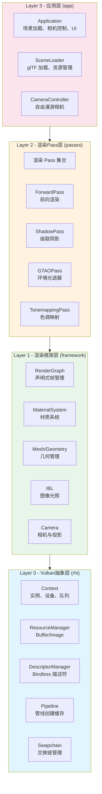

**Himalaya** 是一个基于 **Vulkan 1.4** 的现代实时渲染器，以光栅化渲染为起点，面向学习目的而设计。项目采用渐进式开发模式，从基础的前向渲染起步，逐步演进至混合管线（光栅化+光追）乃至纯路径追踪模式。对于初学者而言，这个项目提供了一个完整的现代图形渲染学习路径——从底层 Vulkan API 封装到高层渲染效果实现，每一层都有清晰的职责边界和模块化设计。

Sources: [CLAUDE.md](https://github.com/1PercentSync/himalaya/blob/main/CLAUDE.md#L1-L20), [docs/project/requirements-and-philosophy.md](https://github.com/1PercentSync/himalaya/blob/main/docs/project/requirements-and-philosophy.md#L1-L30)

---

## 项目定位与设计哲学

Himalaya 是一个**个人长期学习项目**，没有严格的开发周期限制，追求代码质量与技术深度的平衡。项目设计遵循以下核心理念：

| 原则 | 说明 |
|------|------|
| **渐进式实现** | 先能用、再好用、再优秀，每个模块按 Pass 1/2/3 分阶段迭代 |
| **业界验证技术** | 采用已被行业广泛采用、资料丰富的成熟方案，不做实验性探索 |
| **性能性价比** | 追求画质与性能的最佳平衡，同等画质选更快方案，同等性能选更好画质 |
| **AI辅助开发** | 充分利用 AI 提升开发效率，将人力集中在架构审查与决策层面 |
| **模块化可插拔** | 每个渲染 Pass 独立成模块，通过 Render Graph 声明式连接，禁用/启用互不影响 |

**目标平台**定位在中端桌面游戏渲染与高端 PCVR 设备，追求当前硬件技术下的"甜蜜点"——不过度为低端设备妥协，也不追求仅高端设备才能运行的特效。

Sources: [docs/project/requirements-and-philosophy.md](https://github.com/1PercentSync/himalaya/blob/main/docs/project/requirements-and-philosophy.md#L1-L50)

---

## 核心技术特性

### 渲染管线

- **Forward+ 光照**：前向渲染结合 Tiled Light Culling，相比 Deferred 方案更适合 MSAA 与复杂材质
- **PBR 材质系统**：标准 Metallic-Roughness 工作流，支持法线贴图、BRDF 拆分求和近似
- **阴影系统**：级联阴影映射（CSM）+ 百分比渐近软阴影（PCSS）+ 屏幕空间接触阴影（Contact Shadows）
- **环境光遮蔽**：GTAO（Ground Truth Ambient Occlusion）算法配合时域降噪
- **图像光照（IBL）**：基于 HDR 环境贴图，预计算漫反射辐照度与镜面反射预过滤环境贴图

### 光线追踪基础设施

- **RT Pipeline 抽象**：完整的 Vulkan Ray Tracing 扩展封装
- **加速结构管理**：BLAS（底层加速结构）与 TLAS（顶层加速结构）自动构建
- **GPU 路径追踪烘焙器**：用于离线烘焙 Lightmap 与 Reflection Probes
- **PT 参考视图**：实时路径追踪模式，支持 accumulation 与 OIDN 降噪

### 后处理管线

- **Bloom**：多级降采样与升采样链
- **色调映射**：ACES 拟合曲线
- **自动曝光**：基于亮度的时域平滑 EV 计算
- **抗锯齿**：MSAA（光栅化模式）+ FSR SDK（计划）

Sources: [CLAUDE.md](https://github.com/1PercentSync/himalaya/blob/main/CLAUDE.md#L100-L150), [docs/milestone-1/milestone-1.md](https://github.com/1PercentSync/himalaya/blob/main/docs/milestone-1/milestone-1.md#L50-L100)

---

## 四层架构设计

项目采用**严格单向依赖**的四层架构，每层作为独立 CMake 静态库，编译期强制依赖方向：`rhi ← framework ← passes ← app`。这种分层设计确保了代码的清晰边界和可维护性。



### 各层职责详解

| 层级 | 命名空间 | 核心职责 | 关键技术组件 |
|------|----------|----------|--------------|
| **Layer 0 - RHI** | `himalaya::rhi` | Vulkan API 薄封装，资源生命周期管理 | Context、Swapchain、ResourceManager、DescriptorManager、Pipeline |
| **Layer 1 - Framework** | `himalaya::framework` | 渲染基础设施，不涉及具体效果 | RenderGraph、MaterialSystem、Camera、Mesh、Texture、IBL |
| **Layer 2 - Passes** | `himalaya::passes` | 具体渲染效果实现 | ForwardPass、ShadowPass、GTAOPass、SkyboxPass 等 |
| **Layer 3 - App** | `himalaya::app` | 场景与交互逻辑 | Application、SceneLoader、CameraController、DebugUI |

Sources: [CLAUDE.md](https://github.com/1PercentSync/himalaya/blob/main/CLAUDE.md#L70-L100), [docs/project/architecture.md](https://github.com/1PercentSync/himalaya/blob/main/docs/project/architecture.md#L150-L200)

---

## 项目目录结构

```
himalaya/
├── CMakeLists.txt          # 根构建配置
├── vcpkg.json              # 第三方依赖清单
├── CLAUDE.md               # 项目规范与开发指南
│
├── rhi/                    # Layer 0 - Vulkan抽象层
│   ├── include/himalaya/rhi/
│   │   ├── context.h       # Vulkan实例、设备、队列
│   │   ├── resources.h     # Buffer/Image创建与管理
│   │   ├── descriptors.h   # 描述符集与Bindless
│   │   ├── pipeline.h      # 图形管线创建
│   │   ├── rt_pipeline.h   # 光追管线封装
│   │   └── swapchain.h     # 交换链管理
│   └── src/
│       ├── context.cpp     # Instance/Device初始化
│       ├── resources.cpp   # GPU资源分配(VMA)
│       ├── descriptors.cpp # 描述符管理
│       ├── pipeline.cpp    # 管线缓存
│       ├── rt_pipeline.cpp # RT管线抽象
│       └── swapchain.cpp   # 呈现表面管理
│
├── framework/              # Layer 1 - 渲染框架层
│   ├── include/himalaya/framework/
│   │   ├── render_graph.h  # 声明式渲染图
│   │   ├── material_system.h # 材质模板与实例
│   │   ├── mesh.h          # 几何数据管理
│   │   ├── camera.h        # 相机参数与矩阵
│   │   ├── shadow.h        # 阴影数据结构
│   │   └── ibl.h           # 图像光照处理
│   └── src/
│       ├── render_graph.cpp    # 帧编排与屏障管理
│       ├── material_system.cpp # 材质系统实现
│       ├── mesh.cpp            # 顶点/索引缓冲
│       ├── camera.cpp          # 投影与视图矩阵
│       ├── shadow.cpp          # CSM分割与计算
│       ├── ibl.cpp             # 环境贴图处理
│       └── culling.cpp         # 视锥剔除
│
├── passes/                 # Layer 2 - 渲染Pass层
│   ├── include/himalaya/passes/
│   └── src/
│       ├── forward_pass.cpp      # 前向渲染
│       ├── depth_prepass.cpp     # 深度预渲染
│       ├── shadow_pass.cpp       # 级联阴影
│       ├── gtao_pass.cpp         # GTAO环境遮蔽
│       ├── ao_spatial_pass.cpp   # AO空间滤波
│       ├── ao_temporal_pass.cpp  # AO时域降噪
│       ├── contact_shadows_pass.cpp # 接触阴影
│       ├── skybox_pass.cpp       # 天空盒
│       ├── tonemapping_pass.cpp  # 色调映射
│       └── reference_view_pass.cpp # PT参考视图
│
├── app/                    # Layer 3 - 应用层
│   ├── include/himalaya/app/
│   │   ├── application.h   # 主应用类
│   │   ├── renderer.h        # 渲染器协调
│   │   ├── scene_loader.h    # glTF场景加载
│   │   ├── camera_controller.h # 相机控制
│   │   └── debug_ui.h        # ImGui调试面板
│   └── src/
│       ├── main.cpp          # 程序入口
│       ├── application.cpp   # 初始化与帧循环
│       ├── renderer.cpp      # 渲染流程编排
│       ├── scene_loader.cpp  # 资源加载
│       ├── camera_controller.cpp # 输入处理
│       └── debug_ui.cpp      # 调试UI
│
├── shaders/                # GLSL着色器源码
│   ├── common/             # 公共工具库
│   │   ├── brdf.glsl       # BRDF计算
│   │   ├── shadow.glsl     # 阴影采样
│   │   └── transform.glsl  # 坐标变换
│   ├── forward.vert/.frag  # 前向渲染着色器
│   ├── shadow.vert/.frag   # 阴影渲染着色器
│   ├── gtao.comp           # GTAO计算着色器
│   ├── rt/                 # 光追着色器
│   │   ├── reference_view.rgen   # PT光线生成
│   │   ├── closesthit.rchit    # 最近命中
│   │   └── miss.rmiss          # 未命中
│   └── ...
│
├── docs/                   # 项目文档
│   ├── project/            # 架构与设计文档
│   ├── milestone-1/        # M1详细文档
│   ├── roadmap/            # 路线图
│   └── current-phase.md    # 当前阶段任务
│
├── tasks/                  # 任务清单
├── assets/                 # 示例场景与资源
│   ├── Sponza/             # Sponza场景(glTF)
│   └── DamagedHelmet/      # 头盔示例
│
└── third_party/            # 少量非vcpkg依赖
    ├── bc7enc/             # BC7纹理压缩
    └── oidn/               # Intel Open Image Denoise
```

Sources: [CLAUDE.md](https://github.com/1PercentSync/himalaya/blob/main/CLAUDE.md#L70-L90)

---

## 技术栈概览

### 核心依赖（vcpkg管理）

| 库 | 版本 | 用途 |
|----|------|------|
| **GLFW** | 3.4 | 窗口创建与输入处理 |
| **GLM** | 1.0.3 | 数学库（向量、矩阵、四元数） |
| **Vulkan Memory Allocator** | 3.3.0 | GPU内存分配管理 |
| **shaderc** | 2025.2 | 运行时 GLSL → SPIR-V 编译 |
| **spdlog** | 1.17.0 | 日志系统 |
| **Dear ImGui** | 1.91.9 | 调试UI与参数调节 |
| **fastgltf** | 0.9.0 | glTF 2.0 场景加载 |
| **stb** | 2024-07 | 图像解码（JPEG/PNG） |
| **nlohmann-json** | 3.12.0 | 配置持久化 |
| **xxHash** | 0.8.3 | 内容哈希（缓存key） |

### 开发环境要求

| 项 | 要求 |
|----|------|
| 操作系统 | Windows 11（开发）/ Linux（WSL编辑） |
| IDE | CLion（推荐） |
| 编译器 | MSVC + ISPC 1.30 |
| CMake | 4.1+ |
| C++ 标准 | C++20 |
| Vulkan SDK | 1.4+ |
| GPU | 支持 Vulkan 1.4 的独立显卡（推荐 RTX 系列用于光追功能） |

Sources: [CLAUDE.md](https://github.com/1PercentSync/himalaya/blob/main/CLAUDE.md#L20-L40), [vcpkg.json](https://github.com/1PercentSync/himalaya/blob/main/vcpkg.json)

---

## 开发路线图

项目采用**里程碑（Milestone）驱动**的开发模式，每个里程碑有明确的画面质量目标和功能边界。

| 里程碑 | 目标 | 核心特性 | 预期效果 |
|--------|------|----------|----------|
| **Milestone 1** | 静态场景演示 | Forward+、PBR、CSM+PCSS、GTAO、烘焙 Lightmap、PT 烘焙器、PT 参考视图 | 静态场景自由漫游，光照写实 |
| **Milestone 2** | 画质全面提升 | Bruneton大气、SSR、SSGI、Tiled Forward、多套 Lightmap blend、实时 PT 模式 | 动态天空、精确反射、实时路径追踪 |
| **Milestone 3** | 动态物体与性能 | 动态物体阴影、动画支持、遮挡剔除、LOD、粒子系统 | 完全动态场景、性能优化 |
| **Milestone Future** | 远期规划 | GI方案演进、体积云、程序化生成、VR优化 | 生产级渲染器 |

Sources: [docs/milestone-1/milestone-1.md](https://github.com/1PercentSync/himalaya/blob/main/docs/milestone-1/milestone-1.md), [docs/roadmap/milestone-2.md](https://github.com/1PercentSync/himalaya/blob/main/docs/roadmap/milestone-2.md)

---

## 初学者学习路径

如果你是图形渲染初学者，建议按以下顺序探索本项目：

1. **[快速开始](https://github.com/1PercentSync/himalaya/blob/main/2-kuai-su-kai-shi)** — 先运行起来，直观感受渲染效果
2. **[编译与构建流程](https://github.com/1PercentSync/himalaya/blob/main/3-bian-yi-yu-gou-jian-liu-cheng)** — 理解构建系统和依赖管理
3. **[四层架构设计](https://github.com/1PercentSync/himalaya/blob/main/7-si-ceng-jia-gou-she-ji)** — 深入理解架构分层思想
4. **[RHI层 - Vulkan抽象层](https://github.com/1PercentSync/himalaya/blob/main/8-rhiceng-vulkanchou-xiang-ceng)** — 学习 Vulkan API 封装模式
5. **[渲染框架层 - 资源与图管理](https://github.com/1PercentSync/himalaya/blob/main/9-xuan-ran-kuang-jia-ceng-zi-yuan-yu-tu-guan-li)** — 理解 Render Graph 声明式渲染管理
6. **[Pass系统概述](https://github.com/1PercentSync/himalaya/blob/main/16-passxi-tong-gai-shu)** — 探索具体渲染效果的实现方式

**推荐的学习方法**：
- 从 `app/src/main.cpp` 入口开始跟踪一帧的完整流程
- 挑选一个感兴趣的渲染效果（如阴影或AO），从 Pass 层向下追溯至 RHI 层
- 对照 `docs/project/architecture.md` 理解设计决策背后的权衡