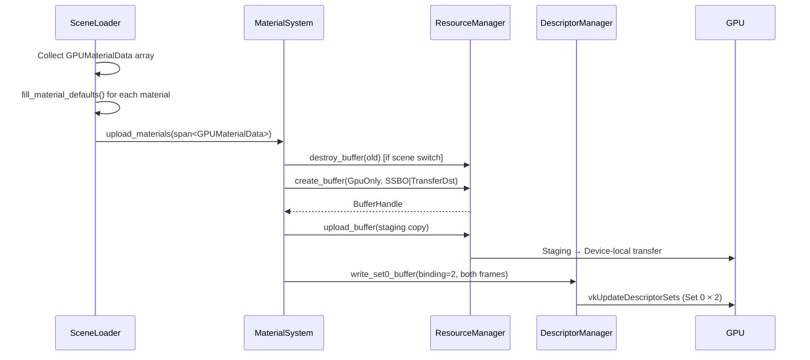

The material system is the bridge between glTF's artist-authored PBR parameters and the GPU's raw memory layout. It solves a fundamental tension: glTF materials are heterogeneous (some have normal maps, some don't; some are alpha-masked, some are opaque), but GPU shaders need **uniform access patterns** — every material must have the same shape so the shader can index into a flat array without branching. The system resolves this by normalizing every material into a fixed 80-byte GPU struct with bindless texture indices that always point to valid textures, even when the glTF source omits a texture slot. This design enables a single SSBO to hold all materials, shared across both the rasterization forward pass and the path tracing closest-hit shader, with zero per-material descriptor set overhead.

Sources: [material_system.h](https://github.com/1PercentSync/himalaya/blob/main/framework/include/himalaya/framework/material_system.h#L1-L160), [material_system.cpp](https://github.com/1PercentSync/himalaya/blob/main/framework/src/material_system.cpp#L1-L89)

## GPUMaterialData — The 80-Byte Contract

The **`GPUMaterialData`** struct is the single source of truth for material parameters on the GPU. Declared in C++ with `alignas(16)` and mirrored exactly in GLSL, it uses std430 layout rules to produce a deterministic 80-byte element that both sides agree on at compile time via `static_assert`.

```
┌──────────────────────────────────────────────────────────────────┐
│  GPUMaterialData (80 bytes, std430, alignas(16))                 │
├──────────┬───────────┬───────────────────────────────────────────┤
│ Offset   │ Size      │ Field                                    │
├──────────┼───────────┼───────────────────────────────────────────┤
│  0       │ 16 bytes  │ base_color_factor  (vec4, RGBA)          │
│ 16       │ 16 bytes  │ emissive_factor    (vec4, xyz + w pad)   │
├──────────┼───────────┼───────────────────────────────────────────┤
│ 32       │  4 bytes  │ metallic_factor     (float)              │
│ 36       │  4 bytes  │ roughness_factor    (float)              │
│ 40       │  4 bytes  │ normal_scale        (float)              │
│ 44       │  4 bytes  │ occlusion_strength  (float)              │
├──────────┼───────────┼───────────────────────────────────────────┤
│ 48       │  4 bytes  │ base_color_tex      (uint, bindless idx) │
│ 52       │  4 bytes  │ emissive_tex        (uint, bindless idx) │
│ 56       │  4 bytes  │ metallic_roughness_tex (uint, bindless)  │
│ 60       │  4 bytes  │ normal_tex          (uint, bindless idx) │
├──────────┼───────────┼───────────────────────────────────────────┤
│ 64       │  4 bytes  │ occlusion_tex       (uint, bindless idx) │
│ 68       │  4 bytes  │ alpha_cutoff        (float)              │
│ 72       │  4 bytes  │ alpha_mode          (uint: 0/1/2)        │
│ 76       │  4 bytes  │ _padding            (uint)               │
└──────────┴───────────┴───────────────────────────────────────────┘
```

The struct is organized into three logical groups: **factor scalars** (offsets 0–44) carry the numeric PBR parameters directly from glTF's JSON; **bindless texture indices** (offsets 48–64) are uint32 handles into the global texture array at Set 1 Binding 0; and **alpha control fields** (offsets 68–72) determine pass routing and fragment discard behavior. The 4-byte tail padding ensures each element is a multiple of 16 bytes, which guarantees correct alignment when the struct is arrayed in an SSBO.

Sources: [material_system.h](https://github.com/1PercentSync/himalaya/blob/main/framework/include/himalaya/framework/material_system.h#L39-L59), [bindings.glsl](https://github.com/1PercentSync/himalaya/blob/main/shaders/common/bindings.glsl#L36-L54)

## Alpha Mode — Pass Routing and Fragment Discard

The `alpha_mode` field maps directly to glTF's `alphaMode` enumeration and controls two distinct behaviors: **CPU-side draw call routing** and **GPU-side fragment discard**. The three modes and their effects are:

| Alpha Mode | Value | CPU Routing | GPU Behavior |
|:-----------|:------|:------------|:-------------|
| `Opaque`   | 0     | Depth prepass + Forward (opaque draw groups) | No alpha test; alpha channel ignored |
| `Mask`     | 1     | Depth prepass (masked pipeline) + Forward (mask draw groups) | `discard` if `alpha < alpha_cutoff` |
| `Blend`    | 2     | Forward only (transparent, back-to-front sorted) | No discard; alpha passed through to output |

The distinction matters for performance: opaque materials get a dedicated depth prepass with guaranteed early-Z, while masked materials use a separate depth prepass pipeline that contains a `discard` instruction (which may disable early-Z on some drivers). This is why the draw group builder sorts instances by `(mesh_id, alpha_mode, double_sided)` — grouping by alpha mode allows the renderer to batch opaque draws separately from masked draws, each with its own pipeline variant.

Sources: [material_system.h](https://github.com/1PercentSync/himalaya/blob/main/framework/include/himalaya/framework/material_system.h#L26-L30), [renderer_rasterization.cpp](https://github.com/1PercentSync/himalaya/blob/main/app/src/renderer_rasterization.cpp#L41-L53), [depth_prepass_masked.frag](https://github.com/1PercentSync/himalaya/blob/main/shaders/depth_prepass_masked.frag#L29-L37), [forward.frag](https://github.com/1PercentSync/himalaya/blob/main/shaders/forward.frag#L108-L111)

## Bindless Texture Indexing — From Material to Texel

The texture index fields in `GPUMaterialData` are not Vulkan descriptor handles — they are **plain uint32 indices** into the bindless `sampler2D textures[]` array declared at Set 1, Binding 0. This is the key architectural simplification: instead of per-material descriptor sets (which would explode in count and require complex binding logic), every material simply stores five integers that directly index the global texture array.

The GLSL access pattern is uniform across all shaders:

```glsl
// Fetch material data from the SSBO
GPUMaterialData mat = materials[frag_material_index];

// Sample via bindless index — nonuniformEXT is required for dynamic indexing
vec4 base_color = texture(textures[nonuniformEXT(mat.base_color_tex)], frag_uv0)
                  * mat.base_color_factor;
```

The `nonuniformEXT` qualifier is essential here: since `mat.base_color_tex` can differ between fragments (different materials), the GPU cannot guarantee that all invocations in a subgroup access the same texture descriptor. `GL_EXT_nonuniform_qualifier` tells the driver to handle this divergence, typically by serializing texture fetches across the subgroup or using independent descriptor fetches.

Sources: [bindings.glsl](https://github.com/1PercentSync/himalaya/blob/main/shaders/common/bindings.glsl#L141-L143), [bindings.glsl](https://github.com/1PercentSync/himalaya/blob/main/shaders/common/bindings.glsl#L174-L175), [forward.frag](https://github.com/1PercentSync/himalaya/blob/main/shaders/forward.frag#L102-L106)

## Default Textures — Eliminating Null Checks

A critical design decision: **every texture field always contains a valid bindless index**. There is no "no texture" sentinel on the GPU side. When a glTF material omits a texture (e.g., no normal map), the system substitutes one of three 1x1 default textures during loading:

| Default Texture | Pixel Value | Purpose | Substituted For |
|:----------------|:------------|:--------|:----------------|
| **White** `(1,1,1,1)` | `RGBA = (255,255,255,255)` | Neutral multiplier | `base_color_tex`, `metallic_roughness_tex`, `occlusion_tex` |
| **Flat Normal** `(0.5,0.5,1,1)` | `RGBA = (128,128,255,255)` | Tangent-space Z-up, no perturbation | `normal_tex` |
| **Black** `(0,0,0,1)` | `RGBA = (0,0,0,255)` | Zero emission | `emissive_tex` |

The substitution happens in `fill_material_defaults()`, which patches any field still set to `UINT32_MAX` (the pre-fill sentinel) with the appropriate default bindless index. These 1x1 textures use `R8G8B8A8_UNORM` format because at these pixel extremes (0 or 255), SRGB and linear interpretations produce identical values, so the same texture works for both color and linear roles.

This approach eliminates GPU-side branching: the shader always samples all five textures unconditionally, and a missing texture naturally produces a neutral result (white multiplies as identity, flat normal produces Z-up, black emission adds zero light).

Sources: [material_system.h](https://github.com/1PercentSync/himalaya/blob/main/framework/include/himalaya/framework/material_system.h#L82-L98), [material_system.cpp](https://github.com/1PercentSync/himalaya/blob/main/framework/src/material_system.cpp#L18-L37), [texture.h](https://github.com/1PercentSync/himalaya/blob/main/framework/include/himalaya/framework/texture.h#L186-L199), [texture.cpp](https://github.com/1PercentSync/himalaya/blob/main/framework/src/texture.cpp#L465-L484)

## Material SSBO — Upload and Descriptor Binding

The `MaterialSystem` class manages the lifecycle of a single GPU buffer — the **Material SSBO** bound at Set 0, Binding 2. This buffer holds a contiguous array of `GPUMaterialData` elements, one per glTF material, sized exactly to the loaded scene's material count with no over-allocation.



The upload flow follows a strict ordering: (1) destroy any previous material buffer (supporting scene switching), (2) create a new `GpuOnly` SSBO, (3) upload via staging buffer within an immediate command scope, and (4) write the descriptor to both per-frame Set 0 instances (since the material buffer is frame-invariant, both frames in flight share the same buffer). The SSBO is declared `readonly` in GLSL, matching its upload-once-read-many usage pattern.

Sources: [material_system.h](https://github.com/1PercentSync/himalaya/blob/main/framework/include/himalaya/framework/material_system.h#L100-L158), [material_system.cpp](https://github.com/1PercentSync/himalaya/blob/main/framework/src/material_system.cpp#L44-L89), [bindings.glsl](https://github.com/1PercentSync/himalaya/blob/main/shaders/common/bindings.glsl#L141-L143)

## Material Index Propagation — Instance to Fragment

Materials are not bound per-draw-call — they are **indexed per-instance** through the InstanceBuffer SSBO. The chain from scene load to fragment shader follows this path:

```mermaid
flowchart LR
    A[SceneLoader<br>load_materials] -->|buffer_offset| B[MaterialInstance<br>per glTF material]
    C[MeshInstance<br>per scene node] -->|material_id| D[GPUInstanceData<br>.material_index]
    D -->|SSBO index| E[Forward Vert<br>flat out material_index]
    E -->|flat interpolation| F[Forward Frag<br>materials&#91;idx&#93;]
    G[GeometryInfo<br>.material_buffer_offset] -->|RT path| H[Closest Hit<br>materials&#91;offset&#93;]
```



**Rasterization path**: The draw group builder in `render_rasterization()` writes `materials[inst.material_id].buffer_offset` into `GPUInstanceData::material_index` for each instance. The vertex shader reads `instances[gl_InstanceIndex].material_index` and passes it as a `flat` output (no interpolation — integer values must not be blended). The fragment shader then indexes `materials[frag_material_index]` to fetch the `GPUMaterialData`.

**Path tracing path**: Each BLAS geometry stores a `material_buffer_offset` in the `GeometryInfo` struct (Set 0, Binding 5). The closest-hit shader reads `geometry_infos[gl_InstanceCustomIndexEXT + gl_GeometryIndexEXT].material_buffer_offset` and indexes directly into the same Material SSBO. Both paths converge on the same buffer — there is no duplication of material data.

Sources: [renderer_rasterization.cpp](https://github.com/1PercentSync/himalaya/blob/main/app/src/renderer_rasterization.cpp#L99-L110), [forward.vert](https://github.com/1PercentSync/himalaya/blob/main/shaders/forward.vert#L37-L54), [forward.frag](https://github.com/1PercentSync/himalaya/blob/main/shaders/forward.frag#L102-L106), [closesthit.rchit](https://github.com/1PercentSync/himalaya/blob/main/shaders/rt/closesthit.rchit#L49-L78), [bindings.glsl](https://github.com/1PercentSync/himalaya/blob/main/shaders/common/bindings.glsl#L156-L162)

## MaterialInstance — CPU-Side Metadata

While `GPUMaterialData` lives entirely on the GPU, the **`MaterialInstance`** struct is CPU-only metadata that the renderer uses for draw call organization:

| Field | Type | Purpose |
|:------|:-----|:--------|
| `template_id` | `uint32_t` | Shading model identifier (always 0 = standard PBR in Milestone 1) |
| `buffer_offset` | `uint32_t` | Index into the Material SSBO array — the GPU material index |
| `alpha_mode` | `AlphaMode` | Determines pass routing (opaque/mask/transparent draw groups) |
| `double_sided` | `bool` | Disables back-face culling for this material |

The `buffer_offset` field is the critical link: when building draw groups, the renderer writes `materials[instance.material_id].buffer_offset` into each `GPUInstanceData`, ensuring the fragment shader can look up the correct material. This indirection exists because the material array index in the SSBO may not match the glTF material index (e.g., if materials were reordered or filtered).

Sources: [material_system.h](https://github.com/1PercentSync/himalaya/blob/main/framework/include/himalaya/framework/material_system.h#L62-L80), [scene_loader.cpp](https://github.com/1PercentSync/himalaya/blob/main/app/src/scene_loader.cpp#L606-L612)

## Texture Role and BC Compression Pipeline

When the scene loader resolves glTF texture references into bindless indices, each texture is tagged with a **`TextureRole`** that determines its GPU compression format:

| Role | BC Format | Use Case | Shader Interpretation |
|:-----|:----------|:---------|:----------------------|
| `Color` | BC7_SRGB | Base color, emissive | Gamma-correct sampling (SRGB→linear) |
| `Linear` | BC7_UNORM | Metallic-roughness, occlusion | Raw values, no gamma conversion |
| `Normal` | BC5_UNORM | Tangent-space normals (RG only) | Z reconstructed in shader: `Z = sqrt(1 - R² - G²)` |

The loading pipeline is three-phase: (1) **collect** unique `(texture_index, role)` pairs across all materials to avoid redundant processing, (2) **compress** in parallel using OpenMP — CPU mip generation + BC7/BC5 encoding with disk caching via KTX2, and (3) **finalize** serially on the GPU — create the image, upload all mip levels via staging, and register into the bindless array. The deduplication step is essential because the same glTF texture image may appear in both a `Color` role (base color) and a `Linear` role (occlusion), requiring separate compression passes with different formats.

Sources: [texture.h](https://github.com/1PercentSync/himalaya/blob/main/framework/include/himalaya/framework/texture.h#L28-L32), [scene_loader.cpp](https://github.com/1PercentSync/himalaya/blob/main/app/src/scene_loader.cpp#L459-L537), [texture.cpp](https://github.com/1PercentSync/himalaya/blob/main/framework/src/texture.cpp#L381-L416)

## Descriptor Layout — Material Buffer in Context

The Material SSBO sits at **Set 0, Binding 2** within the three-set descriptor architecture:

| Set | Binding | Resource | Update Frequency |
|:----|:--------|:---------|:-----------------|
| 0 | 0 | `GlobalUBO` | Per-frame (uniform buffer) |
| 0 | 1 | `LightBuffer` | Per-frame (SSBO) |
| 0 | **2** | **`MaterialBuffer`** | **Per-scene-load (SSBO, frame-invariant)** |
| 0 | 3 | `InstanceBuffer` | Per-frame (SSBO) |
| 0 | 4 | TLAS | Per-scene-load (RT only) |
| 0 | 5 | `GeometryInfoBuffer` | Per-scene-load (RT only) |
| 1 | 0 | `textures[]` (bindless 2D) | On texture registration |
| 1 | 1 | `cubemaps[]` (bindless cube) | On cubemap registration |
| 2 | 0–7 | Render target intermediates | On resize / MSAA switch |

The MaterialBuffer is written once during scene load via `write_set0_buffer(binding=2, ...)` which updates **both** per-frame Set 0 instances simultaneously. This means both frames in flight see the same material data — correct because materials don't change between frames. The SSBO can hold up to 4096 bindless texture indices (limited by `kMaxBindlessTextures`) and 256 bindless cubemaps, though the actual material count is limited only by GPU memory.

Sources: [bindings.glsl](https://github.com/1PercentSync/himalaya/blob/main/shaders/common/bindings.glsl#L86-L147), [descriptors.h](https://github.com/1PercentSync/himalaya/blob/main/rhi/include/himalaya/rhi/descriptors.h#L20-L27), [descriptors.h](https://github.com/1PercentSync/himalaya/blob/main/rhi/include/himalaya/rhi/descriptors.h#L218-L224), [material_system.cpp](https://github.com/1PercentSync/himalaya/blob/main/framework/src/material_system.cpp#L76-L77)

## Scene Switch — Material Buffer Replacement

The material system supports full scene replacement without restarting the renderer. When `upload_materials()` is called a second time (new scene), it destroys the previous GPU buffer before creating a new one. The `MaterialSystem::destroy()` method is similarly safe — it checks `material_buffer_.valid()` before destroying, so calling destroy without ever uploading is a no-op.

The scene loader's `destroy()` method handles the full cleanup chain in reverse order: unregister bindless texture indices → destroy texture images → destroy samplers → destroy vertex/index buffers → clear all CPU-side arrays. Critically, it does **not** destroy the `MaterialSystem`'s SSBO — that is owned by `MaterialSystem` itself and must be destroyed separately by the renderer. This ownership split ensures that the material buffer's descriptor writes remain valid until explicitly torn down.

Sources: [material_system.cpp](https://github.com/1PercentSync/himalaya/blob/main/framework/src/material_system.cpp#L44-L51), [material_system.cpp](https://github.com/1PercentSync/himalaya/blob/main/framework/src/material_system.cpp#L54-L80), [scene_loader.cpp](https://github.com/1PercentSync/himalaya/blob/main/app/src/scene_loader.cpp#L684-L720)

## C++/GLSL Layout Verification

The most dangerous bug in a material system is a C++/GLSL struct layout mismatch — it silently corrupts GPU reads without any runtime error. The codebase prevents this with **compile-time assertions** on both size and field offsets:

```cpp
// C++ side (material_system.h:59)
static_assert(sizeof(GPUMaterialData) == 80, "GPUMaterialData must be 80 bytes (std430)");

// C++ side (scene_data.h:429-431) — GPUInstanceData that carries the material index
static_assert(sizeof(GPUInstanceData) == 128, "GPUInstanceData must be 128 bytes (std430)");
static_assert(offsetof(GPUInstanceData, material_index) == 112);
```

The GLSL side mirrors the C++ layout exactly in `bindings.glsl`, with explicit offset comments marking each field's byte position. Any addition or removal of fields will trigger a compilation failure on the C++ side, forcing the developer to update the GLSL definition in lockstep. This dual-language contract is the reason the struct uses explicit padding (`_padding` at offset 76) rather than relying on compiler-inserted padding — it makes the layout self-documenting and resistant to different compiler alignment behaviors.

Sources: [material_system.h](https://github.com/1PercentSync/himalaya/blob/main/framework/include/himalaya/framework/material_system.h#L59), [scene_data.h](https://github.com/1PercentSync/himalaya/blob/main/framework/include/himalaya/framework/scene_data.h#L393-L431), [bindings.glsl](https://github.com/1PercentSync/himalaya/blob/main/shaders/common/bindings.glsl#L36-L54)

## Next Steps

- [Forward Pass — Cook-Torrance PBR, IBL Split-Sum, and Multi-Bounce AO](https://github.com/1PercentSync/himalaya/blob/main/17-forward-pass-cook-torrance-pbr-ibl-split-sum-and-multi-bounce-ao) — how all five material textures are sampled and combined in the lighting equation
- [Depth Prepass — Z-Fill for Zero-Overdraw Forward Rendering](https://github.com/1PercentSync/himalaya/blob/main/16-depth-prepass-z-fill-for-zero-overdraw-forward-rendering) — how alpha mode separates opaque and masked depth pipelines
- [Bindless Descriptor Architecture — Three-Set Layout and Texture Registration](https://github.com/1PercentSync/himalaya/blob/main/7-bindless-descriptor-architecture-three-set-layout-and-texture-registration) — the underlying descriptor infrastructure that makes bindless texture indexing work
- [Scene Loader — glTF Loading, Texture Processing, and BC Compression](https://github.com/1PercentSync/himalaya/blob/main/23-scene-loader-gltf-loading-texture-processing-and-bc-compression) — the full loading pipeline that produces `GPUMaterialData` from glTF files