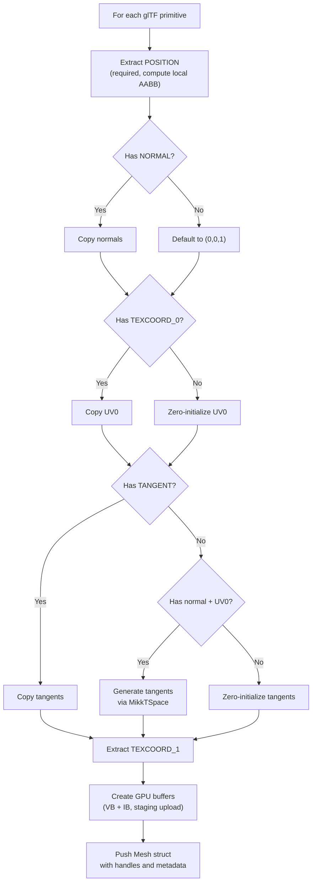

The mesh management layer is the bridge between arbitrary glTF geometry data and the GPU's rigid vertex input pipeline. It solves a fundamental tension: glTF meshes can carry wildly varying attribute sets (position-only, with tangents, with secondary UVs, or any combination), but the GPU rendering pipeline demands a single, fixed vertex layout shared across all draw calls. Himalaya resolves this by defining a **unified `Vertex` struct** that normalizes all source data at load time, generating missing attributes like tangents through the MikkTSpace algorithm before uploading to GPU-only buffers via a staging transfer path. The same vertex and index buffers serve both the rasterization pipeline (bound as traditional vertex inputs) and the ray tracing pipeline (accessed via buffer device addresses), making the mesh layer a truly dual-purpose foundation.

Sources: [mesh.h](https://github.com/1PercentSync/himalaya/blob/main/framework/include/himalaya/framework/mesh.h#L1-L91), [scene_loader.cpp](https://github.com/1PercentSync/himalaya/blob/main/app/src/scene_loader.cpp#L272-L437)

## The Unified Vertex Format

The `Vertex` struct in the framework layer defines a single, fixed memory layout for all mesh primitives. Every glTF primitive — regardless of which attributes its source data provides — is expanded into this format during scene loading. Missing attributes receive sensible defaults: normals default to +Z, tangents are generated via MikkTSpace when sufficient data exists, and UV coordinates are zero-initialized.

```cpp
struct Vertex {
    glm::vec3 position;   // 12 bytes — world-space position
    glm::vec3 normal;     // 12 bytes — surface normal (normalized)
    glm::vec2 uv0;        //  8 bytes — primary texture coordinates
    glm::vec4 tangent;    // 16 bytes — tangent with handedness in w (MikkTSpace)
    glm::vec2 uv1;        //  8 bytes — secondary texture coordinates (glTF TEXCOORD_1)
};                        // 56 bytes total
```

The total struct size is **56 bytes** with natural alignment. The `tangent.w` component stores the **bitangent handedness sign** following the MikkTSpace convention, which the vertex shader uses to reconstruct the bitangent as `cross(normal, tangent.xyz) * tangent.w`. This single-float encoding avoids storing a full fourth attribute vector, saving 12 bytes per vertex compared to a separate bitangent field.

Sources: [mesh.h](https://github.com/1PercentSync/himalaya/blob/main/framework/include/himalaya/framework/mesh.h#L23-L44), [forward.vert](https://github.com/1PercentSync/himalaya/blob/main/shaders/forward.vert#L17-L23)

## Vulkan Vertex Input Description

The `Vertex` struct exposes two static factory methods that produce the Vulkan input assembly configuration. Every graphics pipeline in the engine — forward, depth prepass, shadow, and skybox — uses the same vertex input state derived from these methods, ensuring consistent attribute binding across all render passes.

The binding description declares a **single binding at index 0** with per-vertex input rate and a stride of `sizeof(Vertex)` (56 bytes). The attribute description array specifies five input locations:

| Location | Format                 | Offset | Field      | Shader Usage                     |
|----------|------------------------|--------|------------|----------------------------------|
| 0        | `R32G32B32_SFLOAT`     | 0      | position   | `in_position` — model transform  |
| 1        | `R32G32B32_SFLOAT`     | 12     | normal     | `in_normal` — normal matrix      |
| 2        | `R32G32_SFLOAT`        | 24     | uv0        | `in_uv0` — material sampling     |
| 3        | `R32G32B32A32_SFLOAT`  | 32     | tangent    | `in_tangent` — TBN construction  |
| 4        | `R32G32_SFLOAT`        | 48     | uv1        | `in_uv1` — secondary UVs (M2+)  |

The shadow pass vertex shader only reads `in_position` (location 0) and `in_uv0` (location 2), but the full binding is still configured — Vulkan allows shaders to ignore unused locations without error, and maintaining a consistent pipeline layout simplifies pipeline creation and state management.

Sources: [mesh.cpp](https://github.com/1PercentSync/himalaya/blob/main/framework/src/mesh.cpp#L59-L92), [shadow.vert](https://github.com/1PercentSync/himalaya/blob/main/shaders/shadow.vert#L24-L25)

## GPU-Resident Mesh Data

The `Mesh` struct holds the GPU-side representation of a loaded mesh primitive. It stores only **handles and counts** — no CPU-side vertex data is retained after upload. Buffer handles are generation-based (see [Resource Management](https://github.com/1PercentSync/himalaya/blob/main/6-resource-management-generation-based-handles-buffers-images-and-samplers)), so the `Mesh` struct is safe to hold across frames without dangling references.

```cpp
struct Mesh {
    rhi::BufferHandle vertex_buffer;  // Handle to GPU Vertex[] buffer
    rhi::BufferHandle index_buffer;   // Handle to GPU uint32_t[] buffer
    uint32_t vertex_count = 0;
    uint32_t index_count = 0;
    uint32_t group_id = 0;            // glTF mesh index — BLAS grouping key
    uint32_t material_id = 0;         // Index into material_instances array
};
```

The `group_id` field is critical for **ray tracing acceleration structure construction**. All primitives originating from the same glTF mesh share the same `group_id` and are merged into a single multi-geometry BLAS. This grouping reduces TLAS instance count and ensures that a single TLAS instance can reference multiple geometries (e.g., a character mesh with separate body, face, and hair primitives). The `material_id` enables alpha-mode queries during BLAS build — opaque primitives enable `VK_GEOMETRY_OPAQUE_BIT_KHR` for correct anyhit behavior, while alpha-masked primitives disable it so the anyhit shader can perform alpha testing.

Sources: [mesh.h](https://github.com/1PercentSync/himalaya/blob/main/framework/include/himalaya/framework/mesh.h#L53-L82), [scene_as_builder.cpp](https://github.com/1PercentSync/himalaya/blob/main/framework/src/scene_as_builder.cpp#L68-L99)

## Loading Pipeline: glTF to GPU

The mesh loading pipeline in `SceneLoader::load_meshes()` processes each glTF primitive through a fixed sequence of attribute extraction, tangent generation, and GPU upload. The flow follows a strict ordering constraint: tangent generation via MikkTSpace requires valid normals and UVs, so it must occur before `TEXCOORD_1` extraction (which must not interfere with the MikkTSpace callback's UV reads).



Each primitive receives independent vertex and index buffers. Non-indexed glTF primitives (rare but valid) receive a sequentially-generated index buffer `[0, 1, 2, ...]` to maintain a consistent triangle-list topology for the GPU. The local AABB is computed during the position extraction pass — the minimum and maximum corners across all positions — and later transformed to world space during scene graph traversal.

Sources: [scene_loader.cpp](https://github.com/1PercentSync/himalaya/blob/main/app/src/scene_loader.cpp#L272-L437)

## Staging Upload Path

Mesh vertex and index data follows a **staging buffer transfer path** to reach GPU-only memory. The `ResourceManager::upload_buffer()` method creates a temporary CPU-visible staging buffer, copies the source data into it via `memcpy`, records a `vkCmdCopyBuffer` command into the active immediate command buffer, and registers the staging buffer for deferred cleanup. All mesh uploads must occur within a `Context::begin_immediate()` / `end_immediate()` scope, which provides a dedicated command buffer and synchronization point.

The GPU-side buffers are allocated with `MemoryUsage::GpuOnly` (device-local memory), which maximizes bandwidth for both vertex fetch during rasterization and buffer reference access during ray tracing. The upload path adds `BufferUsage::TransferDst` to both vertex and index buffers to enable the staging copy. When ray tracing is supported (`rt_supported_`), additional usage flags are OR-ed in:

| Flag                              | Purpose                                                      |
|-----------------------------------|--------------------------------------------------------------|
| `VertexBuffer \| TransferDst`     | Base rasterization usage                                     |
| `IndexBuffer \| TransferDst`      | Base rasterization usage                                     |
| `+ ShaderDeviceAddress`           | Buffer reference access in RT closesthit shader              |
| `+ AccelStructBuildInput`         | BLAS geometry input during acceleration structure build      |

The `ShaderDeviceAddress` flag enables `vkGetBufferDeviceAddress()` on the buffer, returning a 64-bit GPU virtual address that the RT shader uses via `GL_EXT_buffer_reference` to directly fetch vertex and index data without descriptor bindings.

Sources: [scene_loader.cpp](https://github.com/1PercentSync/himalaya/blob/main/app/src/scene_loader.cpp#L378-L406), [resources.cpp](https://github.com/1PercentSync/himalaya/blob/main/rhi/src/resources.cpp#L483-L536)

## Dual Consumption: Rasterization and Ray Tracing

The unified vertex format enables a **single set of buffers** to serve both rendering paths without duplication. This design avoids doubling memory usage for scenes like Sponza that contain hundreds of thousands of vertices.

**Rasterization path**: Render passes bind vertex and index buffers through the traditional Vulkan input assembly pipeline. The `ForwardPass`, `DepthPrePass`, and `ShadowPass` all call `cmd.bind_vertex_buffer()` and `cmd.bind_index_buffer()` with the `VkBuffer` handles extracted from the `Mesh` struct via `ResourceManager::get_buffer()`. Instanced draw calls use `vkCmdDrawIndexed` with `firstInstance` offset into the `InstanceBuffer` SSBO. The vertex shader reads attributes at locations 0–4, matching the `Vertex` struct layout exactly.

**Ray tracing path**: The `SceneASBuilder` groups meshes by `group_id` into multi-geometry BLAS, where each geometry references the vertex and index buffer device addresses. During BLAS build, the acceleration structure stores triangle references that map `gl_PrimitiveID` + buffer addresses to raw triangle data. In the closesthit shader, the `interpolate_hit()` function fetches the `GeometryInfo` for the current instance + geometry, then uses `GL_EXT_buffer_reference` to read vertex positions, normals, UVs, and tangents directly from the same buffers — performing manual barycentric interpolation on the raw vertex data.

The `VertexBuffer` buffer reference in the RT shader mirrors the C++ `Vertex` struct layout exactly with a stride of 56 bytes:

```glsl
layout(buffer_reference, scalar, buffer_reference_align = 4) readonly buffer VertexBuffer {
    vec3 position;    // offset  0
    vec3 normal;      // offset 12
    vec2 uv0;         // offset 24
    vec4 tangent;     // offset 32
    vec2 uv1;         // offset 48
};                    // stride 56
```

Sources: [forward_pass.cpp](https://github.com/1PercentSync/himalaya/blob/main/passes/src/forward_pass.cpp#L182-L197), [pt_common.glsl](https://github.com/1PercentSync/himalaya/blob/main/shaders/rt/pt_common.glsl#L45-L112), [scene_as_builder.cpp](https://github.com/1PercentSync/himalaya/blob/main/framework/src/scene_as_builder.cpp#L88-L95)

## Tangent Generation via MikkTSpace

When a glTF primitive lacks authored tangent vectors (the `TANGENT` attribute is optional in glTF), the loader invokes `framework::generate_tangents()` to compute them using the **MikkTSpace** algorithm. MikkTSpace is the industry-standard tangent space generation library that produces consistent, shared-vertex tangent frames by analyzing the UV mapping derivatives across connected triangles. The implementation wraps MikkTSpace's callback-based API through an anonymous namespace `MikkUserData` struct that bridges between the C callback interface and the C++ `std::span<Vertex>` / `std::span<const uint32_t>` data.

The generation requires three prerequisites: valid positions, normals, and primary UV coordinates (`uv0`). If any of these are missing, tangent generation is skipped and the tangent field remains zero-initialized. The `set_tspace_basic` callback writes both the tangent vector and the handedness sign directly into `Vertex::tangent` — the `.w` component receives the sign value that the vertex shader uses to reconstruct the bitangent direction.

Sources: [mesh.cpp](https://github.com/1PercentSync/himalaya/blob/main/framework/src/mesh.cpp#L8-L111), [scene_loader.cpp](https://github.com/1PercentSync/himalaya/blob/main/app/src/scene_loader.cpp#L362-L365)

## Draw Group Binding and Instancing

At render time, the mesh data is consumed through **instanced draw groups**. After frustum culling produces a list of visible instance indices, the renderer sorts them by `(mesh_id, alpha_mode, double_sided)` and groups consecutive instances sharing the same mesh and material properties into `MeshDrawGroup` entries. Each group specifies which mesh resource to bind and which range of the `InstanceBuffer` SSBO contains its transform data:

```cpp
struct MeshDrawGroup {
    uint32_t mesh_id;          // Index into meshes[] — selects VB/IB pair
    uint32_t first_instance;   // Offset into InstanceBuffer SSBO
    uint32_t instance_count;   // Number of instances in this group
    bool double_sided;         // Controls VK_CULL_MODE for this group
};
```

Inside the draw loop, each group triggers: (1) a face-culling mode change based on `double_sided`, (2) a vertex buffer bind of `meshes[group.mesh_id].vertex_buffer`, (3) an index buffer bind of `meshes[group.mesh_id].index_buffer`, and (4) a single `vkCmdDrawIndexed` call with `instance_count` instances starting at `first_instance`. This batching strategy minimizes state changes — consecutive groups with the same mesh and culling mode require only a draw call with updated instance parameters.

Sources: [scene_data.h](https://github.com/1PercentSync/himalaya/blob/main/framework/include/himalaya/framework/scene_data.h#L386-L391), [forward_pass.cpp](https://github.com/1PercentSync/himalaya/blob/main/passes/src/forward_pass.cpp#L182-L197), [renderer_rasterization.cpp](https://github.com/1PercentSync/himalaya/blob/main/app/src/renderer_rasterization.cpp#L58-L128)

## Resource Lifecycle and Cleanup

The `SceneLoader` owns all mesh GPU resources and manages their lifecycle explicitly. Vertex and index buffer handles are tracked in a flat `buffers_` vector (every primitive contributes two entries: VB then IB). On scene destruction — either through `destroy()` or a failed `load()` — the cleanup sequence unregisters bindless textures first (to release descriptor array slots), then destroys all images, samplers, and finally all vertex/index buffers through the `ResourceManager`. The generation-based handle system in the RHI layer detects use-after-free: if a render pass holds a stale `Mesh` reference after scene destruction, the handle's generation counter will mismatch the slot's incremented counter, triggering an assertion failure rather than silent GPU corruption.

Sources: [scene_loader.cpp](https://github.com/1PercentSync/himalaya/blob/main/app/src/scene_loader.cpp#L684-L720), [scene_loader.h](https://github.com/1PercentSync/himalaya/blob/main/app/include/himalaya/app/scene_loader.h#L130-L141)

## Related Pages

- [Resource Management — Generation-Based Handles, Buffers, Images, and Samplers](https://github.com/1PercentSync/himalaya/blob/main/6-resource-management-generation-based-handles-buffers-images-and-samplers) — the RHI buffer/image infrastructure that mesh resources are built on
- [Material System — GPU Data Layout and Bindless Texture Indexing](https://github.com/1PercentSync/himalaya/blob/main/10-material-system-gpu-data-layout-and-bindless-texture-indexing) — the `material_id` reference chain from Mesh to GPU SSBO
- [Scene Data Contract — Application-to-Renderer Interface and Culling](https://github.com/1PercentSync/himalaya/blob/main/13-scene-data-contract-application-to-renderer-interface-and-culling) — how `MeshInstance` references `Mesh` resources and feeds into the rendering pipeline
- [Scene Loader — glTF Loading, Texture Processing, and BC Compression](https://github.com/1PercentSync/himalaya/blob/main/23-scene-loader-gltf-loading-texture-processing-and-bc-compression) — the complete loading orchestration that produces mesh data
- [Path Tracing Shaders — Ray Generation, Closest Hit, and Miss Shaders](https://github.com/1PercentSync/himalaya/blob/main/26-path-tracing-shaders-ray-generation-closest-hit-and-miss-shaders) — the RT shader consumption of vertex data via buffer references