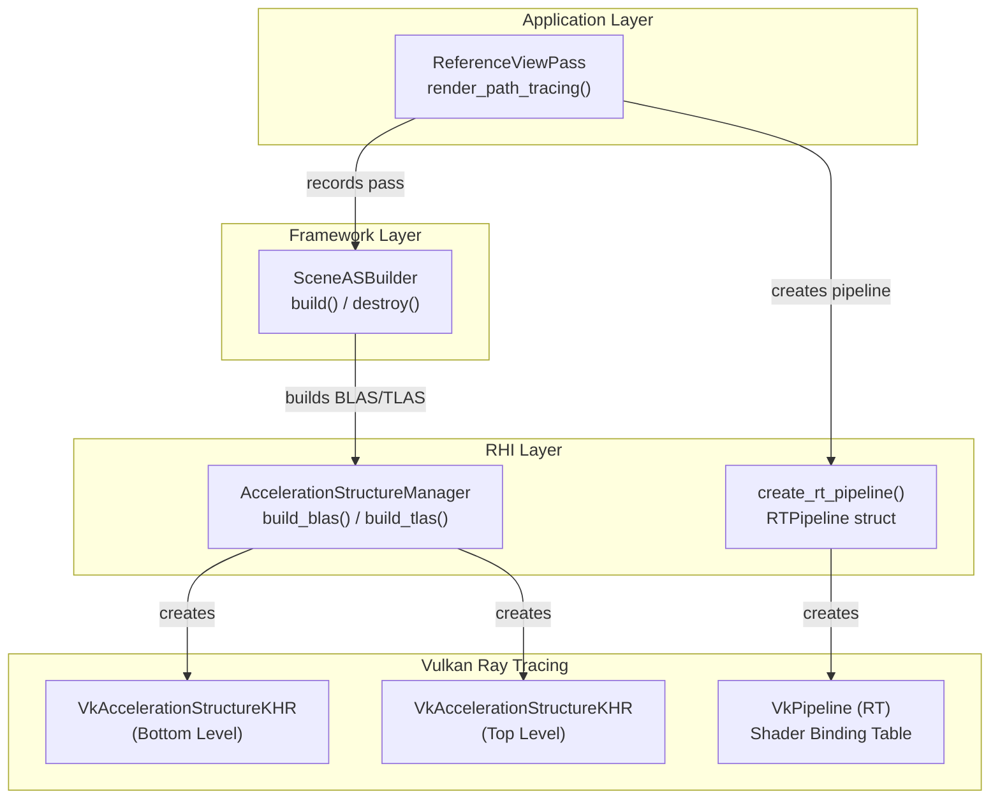
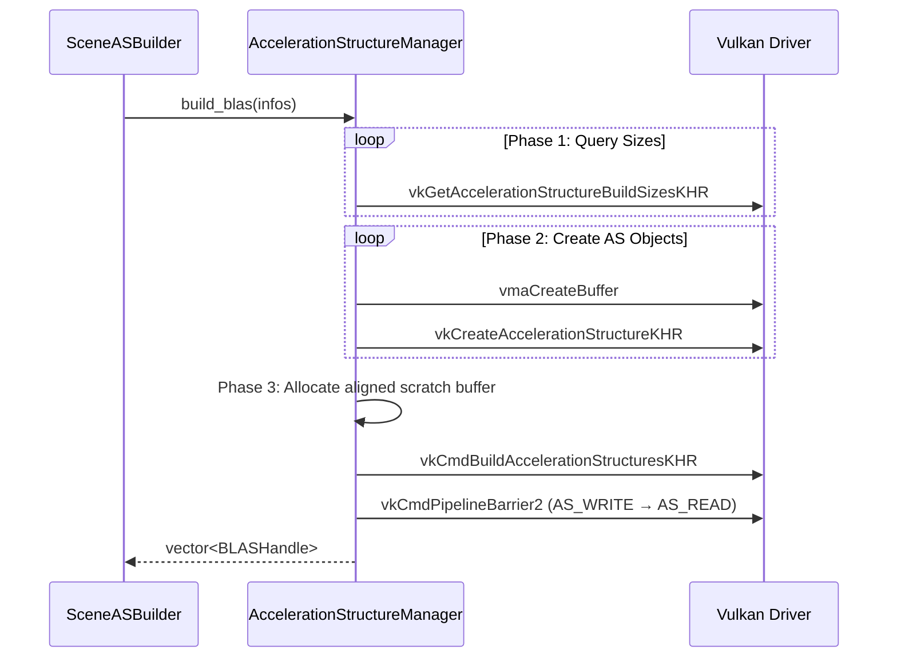

Himalaya's ray tracing infrastructure provides a hardware-accelerated foundation for path tracing through Vulkan's ray tracing extensions. The system is architected around two core abstractions: **Acceleration Structure Management** for spatial hierarchy construction, and **Ray Tracing Pipeline Management** for shader orchestration and execution. This infrastructure enables the reference path tracing view while maintaining clean separation between RHI-level primitives and higher-level scene integration.

## Architectural Overview

The ray tracing subsystem follows a layered architecture where the RHI provides low-level Vulkan abstractions, the framework layer handles scene-specific AS construction, and render passes orchestrate the actual ray tracing dispatches. This separation allows the RHI to remain agnostic of scene semantics while providing all necessary primitives for hardware ray tracing.

Sources: [acceleration_structure.h](https://github.com/1PercentSync/himalaya/blob/main/rhi/include/himalaya/rhi/acceleration_structure.h#L1-L161), [rt_pipeline.h](https://github.com/1PercentSync/himalaya/blob/main/rhi/include/himalaya/rhi/rt_pipeline.h#L1-L110), [scene_as_builder.cpp](https://github.com/1PercentSync/himalaya/blob/main/framework/src/scene_as_builder.cpp#L1-L100)

## Acceleration Structure Management

The `AccelerationStructureManager` class encapsulates all BLAS (Bottom Level Acceleration Structure) and TLAS (Top Level Acceleration Structure) operations. It provides batch build capabilities for efficient static scene construction and handles the complex Vulkan synchronization requirements internally.

### BLAS Construction

BLAS construction operates on triangle geometry data through the `BLASGeometry` descriptor, which specifies vertex/index buffer device addresses, counts, and opacity flags. The system supports multi-geometry BLAS where a single BLAS contains multiple triangle sets—typically used to merge all primitives of a single glTF mesh into one acceleration structure for memory efficiency.

The build process follows a four-phase approach: first, geometry descriptors are populated and build sizes are queried from the driver; second, backing buffers and AS objects are created; third, a unified scratch buffer is allocated with proper alignment for all BLAS in the batch; finally, the build command is recorded with appropriate synchronization barriers. The batch approach enables parallel GPU construction of multiple BLAS while minimizing scratch memory fragmentation.

Sources: [acceleration_structure.cpp](https://github.com/1PercentSync/himalaya/blob/main/rhi/src/acceleration_structure.cpp#L1-L100), [acceleration_structure.cpp](https://github.com/1PercentSync/himalaya/blob/main/rhi/src/acceleration_structure.cpp#L200-L250)

### TLAS Construction

The TLAS build consumes an array of `VkAccelerationStructureInstanceKHR` structures, each referencing a BLAS by device address and specifying transform matrices, custom indices, and visibility masks. The implementation uploads instance data to a temporary GPU-visible buffer, queries build sizes, creates the TLAS object, and records the build command. Both instance and scratch buffers are automatically cleaned up when the immediate command scope ends.

The custom index field (`instanceCustomIndex`) is particularly significant as it encodes the starting offset into the Geometry Info SSBO, enabling shader-side geometry attribute lookup during ray traversal. This design allows the TLAS to remain compact while supporting complex material and geometry metadata lookups.

Sources: [acceleration_structure.cpp](https://github.com/1PercentSync/himalaya/blob/main/rhi/src/acceleration_structure.cpp#L150-L250), [acceleration_structure.h](https://github.com/1PercentSync/himalaya/blob/main/rhi/include/himalaya/rhi/acceleration_structure.h#L100-L140)

### Geometry Opacity and Any-Hit Optimization

The BLAS geometry flags control any-hit shader invocation behavior. Opaque geometry sets `VK_GEOMETRY_OPAQUE_BIT_KHR`, causing hardware to skip any-hit shaders entirely—critical for performance with fully opaque meshes. Non-opaque geometry uses `VK_GEOMETRY_NO_DUPLICATE_ANY_HIT_INVOCATION_BIT_KHR`, which guarantees at most one any-hit invocation per primitive for alpha testing and stochastic transparency. This distinction is determined per-geometry at build time based on material alpha mode.

Sources: [acceleration_structure.cpp](https://github.com/1PercentSync/himalaya/blob/main/rhi/src/acceleration_structure.cpp#L40-L50), [acceleration_structure.h](https://github.com/1PercentSync/himalaya/blob/main/rhi/include/himalaya/rhi/acceleration_structure.h#L60-L80)

## Ray Tracing Pipeline and SBT Management

The `create_rt_pipeline()` function and `RTPipeline` structure manage the complete ray tracing pipeline lifecycle including shader stage creation, shader group configuration, pipeline layout construction, and Shader Binding Table (SBT) generation.

### Shader Group Architecture

The pipeline implements a fixed four-group SBT layout optimized for path tracing:

| Group Index | Type | Purpose | Shader Stages |
|-------------|------|---------|---------------|
| 0 | General | Ray Generation | raygen |
| 1 | General | Environment Miss | miss |
| 2 | General | Shadow Miss | shadow_miss |
| 3 | Triangles Hit Group | Surface Shading | closesthit + optional anyhit |

This layout supports primary path tracing with direct lighting (environment miss for sky, shadow miss for visibility) and a single hit group that handles all surface interactions including alpha testing. The any-hit shader is optional—when not provided, the hit group contains only closest-hit.

Sources: [rt_pipeline.h](https://github.com/1PercentSync/himalaya/blob/main/rhi/include/himalaya/rhi/rt_pipeline.h#L20-L50), [rt_pipeline.cpp](https://github.com/1PercentSync/himalaya/blob/main/rhi/src/rt_pipeline.cpp#L30-L80)

### SBT Construction

The SBT is constructed by querying shader group handles from the pipeline, then writing them into a host-visible buffer with proper alignment. The implementation handles three distinct alignment requirements: `shaderGroupHandleSize` for individual handles, `shaderGroupHandleAlignment` for entries within regions, and `shaderGroupBaseAlignment` for region start addresses. The resulting buffer regions are pre-computed as `VkStridedDeviceAddressRegionKHR` structures for direct use with `vkCmdTraceRaysKHR`.

The SBT layout places raygen first (single entry), followed by two miss entries (environment and shadow), then one hit group entry. Each region is sized and aligned independently, with strides set appropriately for multi-entry regions (miss uses `handle_size_aligned` as stride to allow shader index calculation).

Sources: [rt_pipeline.cpp](https://github.com/1PercentSync/himalaya/blob/main/rhi/src/rt_pipeline.cpp#L100-L180), [rt_pipeline.h](https://github.com/1PercentSync/himalaya/blob/main/rhi/include/himalaya/rhi/rt_pipeline.h#L60-L90)

## Scene Integration

The `SceneASBuilder` in the framework layer bridges raw mesh data to RHI acceleration structures. It implements a grouping strategy where meshes sharing the same `group_id` are merged into multi-geometry BLAS, then deduplicates TLAS instances by transform to minimize redundant ray traversal.

### Build Pipeline

The scene build process executes in five phases: first, meshes are grouped by `group_id` and `BLASGeometry` descriptors are populated with buffer device addresses and material-derived opacity flags; second, BLAS are batch-built via `AccelerationStructureManager`; third, a Geometry Info SSBO is constructed mapping geometry indices to vertex/index addresses and material offsets; fourth, mesh instances are deduplicated into TLAS instances with proper custom indices; finally, the TLAS is built.

The Geometry Info buffer is crucial for shader-side geometry lookup—each TLAS instance's custom index encodes the base offset into this buffer, and `gl_GeometryIndexEXT` provides the per-geometry offset within the BLAS. This enables O(1) geometry metadata access during ray traversal without CPU-side tracking.

Sources: [scene_as_builder.cpp](https://github.com/1PercentSync/himalaya/blob/main/framework/src/scene_as_builder.cpp#L1-L150), [scene_as_builder.cpp](https://github.com/1PercentSync/himalaya/blob/main/framework/src/scene_as_builder.cpp#L200-L249)

## Ray Tracing Shaders

The shader infrastructure leverages GL_EXT_ray_tracing and GL_EXT_buffer_reference for direct GPU-side geometry access. The system uses two ray payloads: `PrimaryPayload` for path tracing state (radiance, throughput, next ray, hit distance) and `ShadowPayload` for binary visibility testing.

### Shader Stage Responsibilities

The **raygen shader** (`reference_view.rgen`) implements the primary path tracing loop including subpixel jitter via Sobol sampling, camera ray generation, bounce iteration with Russian Roulette, and running-average accumulation. It dispatches `traceRayEXT` calls for both primary and bounce rays, using payload location 0.

The **closest-hit shader** (`closesthit.rchit`) performs full surface shading: vertex interpolation via buffer references, normal mapping, material sampling, Next Event Estimation (NEE) for directional lights and environment, multi-lobe BRDF sampling (diffuse + GGX specular), and OIDN auxiliary output on bounce 0. It writes the `PrimaryPayload` for the next bounce or path termination.

The **any-hit shader** (`anyhit.rahit`) handles alpha testing for masked materials and stochastic transparency for blended materials using PCG hash randomization. It is only invoked for non-opaque geometry due to BLAS geometry flags.

The **miss shaders** (`miss.rmiss` for environment, `shadow_miss.rmiss` for visibility) handle ray misses—environment sampling for primary rays and visibility confirmation for shadow rays.

Sources: [reference_view.rgen](https://github.com/1PercentSync/himalaya/blob/main/shaders/rt/reference_view.rgen#L1-L100), [closesthit.rchit](https://github.com/1PercentSync/himalaya/blob/main/shaders/rt/closesthit.rchit#L1-L100), [anyhit.rahit](https://github.com/1PercentSync/himalaya/blob/main/shaders/rt/anyhit.rahit#L1-L50), [miss.rmiss](https://github.com/1PercentSync/himalaya/blob/main/shaders/rt/miss.rmiss#L1-L32), [shadow_miss.rmiss](https://github.com/1PercentSync/himalaya/blob/main/shaders/rt/shadow_miss.rmiss#L1-L21)

### Buffer References and Vertex Access

Shaders access vertex and index data via buffer references (physical storage buffer addresses) rather than traditional vertex attributes. The `VertexBuffer` and `IndexBuffer` buffer references provide direct memory access to geometry data using the device addresses stored in the Geometry Info SSBO. This approach decouples ray tracing from the graphics pipeline's vertex input state and enables arbitrary geometry access during traversal.

The `interpolate_hit()` function in `pt_common.glsl` performs barycentric interpolation of vertex attributes using `gl_PrimitiveID` and hit attributes, fetching data via calculated byte offsets into the buffer references.

Sources: [pt_common.glsl](https://github.com/1PercentSync/himalaya/blob/main/shaders/rt/pt_common.glsl#L50-L150), [pt_common.glsl](https://github.com/1PercentSync/himalaya/blob/main/shaders/rt/pt_common.glsl#L250-L300)

## Context Integration and Feature Detection

The `Context` class manages ray tracing capability detection and function pointer loading. Ray tracing support is determined by checking for required extensions (`VK_KHR_acceleration_structure`, `VK_KHR_ray_tracing_pipeline`) and querying properties including shader group handle sizes, maximum recursion depth, and scratch alignment requirements. Function pointers for all RT extension commands are loaded via `vkGetDeviceProcAddr` and stored in the context for use by AS and pipeline operations.

Sources: [context.h](https://github.com/1PercentSync/himalaya/blob/main/rhi/include/himalaya/rhi/context.h#L60-L100), [context.h](https://github.com/1PercentSync/himalaya/blob/main/rhi/include/himalaya/rhi/context.h#L140-L170)

## Related Documentation

- For render graph integration and pass recording, see [Render Graph System](https://github.com/1PercentSync/himalaya/blob/main/12-render-graph-system)
- For the complete path tracing implementation, see [Path Tracing Reference View](https://github.com/1PercentSync/himalaya/blob/main/21-path-tracing-reference-view)
- For shader programming details, see [Ray Tracing Shaders](https://github.com/1PercentSync/himalaya/blob/main/30-ray-tracing-shaders)
- For command buffer and synchronization primitives, see [Command Buffer and Synchronization](https://github.com/1PercentSync/himalaya/blob/main/10-command-buffer-and-synchronization)