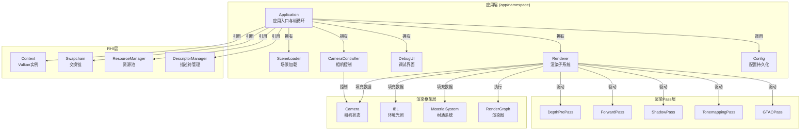
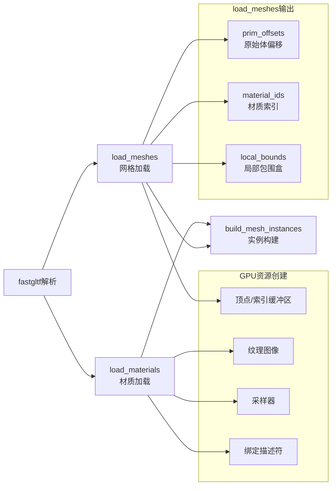

应用层是 Himalaya 渲染器与用户的直接交互界面，承担着窗口管理、场景加载、相机控制、调试界面以及渲染流程协调的核心职责。该层通过清晰的职责分离，将初始化序列、帧循环、输入处理、UI交互和渲染调度组织成一套完整的应用运行时框架。

应用层的设计遵循**分层初始化**与**显式生命周期管理**原则——每个子系统在明确的阶段完成创建和销毁，避免隐式依赖导致的资源泄漏或时序错误。与下层的 [RHI层 - Vulkan抽象层](https://github.com/1PercentSync/himalaya/blob/main/8-rhiceng-vulkanchou-xiang-ceng)、[渲染框架层 - 资源与图管理](https://github.com/1PercentSync/himalaya/blob/main/9-xuan-ran-kuang-jia-ceng-zi-yuan-yu-tu-guan-li) 和 [渲染Pass层 - 效果实现](https://github.com/1PercentSync/himalaya/blob/main/10-xuan-ran-passceng-xiao-guo-shi-xian) 通过非拥有型引用建立松耦合关系，确保架构的可测试性和可维护性。

## 应用层架构概览

应用层由六大核心组件构成，通过 `Application` 类作为中央协调器统一管理：



**架构设计原则**：

- **显式生命周期**：`init()` → `run()` → `destroy()` 三阶段明确划分，资源按反向顺序销毁
- **帧循环分解**：`begin_frame()` → `update()` → `render()` → `end_frame()` 四阶段分离，支持精确的性能分析和故障定位
- **配置持久化**：场景路径、环境贴图路径、HDR太阳坐标等用户偏好自动保存至 `%LOCALAPPDATA%\himalaya\config.json`
- **运行时切换**：支持不重启应用的情况下切换场景文件和环境贴图，自动重建相关GPU资源

## Application 类：中央协调器

`Application` 是应用层的核心类，负责子系统的初始化和帧循环的执行。其设计采用**组合优于继承**的策略，通过成员变量直接拥有关键组件。

### 初始化序列

初始化遵循严格的依赖顺序——每个阶段必须等待前置阶段完成后才能开始：

| 阶段 | 职责 | 依赖 |
|------|------|------|
| 配置加载 | 从磁盘读取 `config.json`，确定初始场景和环境 | 无 |
| GLFW初始化 | 创建窗口，设置事件回调 | 配置加载完成 |
| RHI基础设施 | 初始化 `Context`、`Swapchain` | GLFW窗口就绪 |
| 资源管理层 | 创建 `ResourceManager`、`DescriptorManager` | RHI设备就绪 |
| ImGui后端 | 初始化 ImGui 渲染后端 | 帧缓冲回调设置 |
| 相机系统 | 初始化相机状态和控制 | 窗口尺寸已知 |
| 渲染器 | 创建管线、默认纹理、采样器 | 资源管理器就绪 |
| 场景加载 | 解析 glTF，上传 GPU 资源 | 渲染器默认资源就绪 |
| 加速结构 | 构建 BLAS/TLAS（RT支持时） | 场景网格就绪 |

```cpp
void Application::init() {
    // 日志级别初始为info，确保配置加载诊断可见
    spdlog::set_level(spdlog::level::info);
    
    // 从磁盘加载持久化配置
    config_ = load_config();
    spdlog::set_level(/* 应用配置的日志级别 */);

    // 窗口创建（GLFW_NO_API 表示不由GLFW管理图形API）
    glfwInit();
    glfwWindowHint(GLFW_CLIENT_API, GLFW_NO_API);
    window_ = glfwCreateWindow(kInitialWidth, kInitialHeight, kWindowTitle, nullptr, nullptr);

    // RHI基础设施——严格顺序：Context → Swapchain
    context_.init(window_);
    swapchain_.init(context_, window_);

    // 资源管理层
    resource_manager_.init(&context_);
    descriptor_manager_.init(&context_, &resource_manager_);

    // 相机系统
    camera_.aspect = /* 从交换链尺寸计算 */;
    camera_controller_.init(window_, &camera_);

    // 渲染器初始化——拥有管线、默认纹理、采样器
    renderer_.init(context_, swapchain_, resource_manager_, 
                   descriptor_manager_, imgui_backend_, config_.env_path);

    // 场景加载——必须在immediate context中执行
    context_.begin_immediate();
    scene_loader_.load(config_.scene_path, /* ... */);
    if (context_.rt_supported) {
        renderer_.build_scene_as(/* 场景数据 */);
    }
    context_.end_immediate();

    // 根据场景内容自动配置
    auto_position_camera();           // 将相机定位到场景上方
    update_shadow_config_from_scene(); // 调整阴影最大距离
}
```

### 帧循环分解

帧循环被分解为四个独立的私有方法，每个方法职责单一，便于性能分析和调试：

```cpp
void Application::run() {
    while (!glfwWindowShouldClose(window_)) {
        glfwPollEvents();

        // 窗口最小化时暂停渲染
        int fb_width = 0, fb_height = 0;
        glfwGetFramebufferSize(window_, &fb_width, &fb_height);
        while ((fb_width == 0 || fb_height == 0) && !glfwWindowShouldClose(window_)) {
            glfwWaitEvents();
            glfwGetFramebufferSize(window_, &fb_width, &fb_height);
        }

        if (!begin_frame()) continue;  // 获取交换链图像
        update();                         // 处理输入、更新场景
        render();                         // 提交渲染命令
        end_frame();                      // 呈现并处理调整大小
    }
}
```

**begin_frame()** 阶段：
- 等待当前帧的围栏（`vkWaitForFences`），确保 GPU 已完成前一帧对此帧资源的使用
- 刷新延迟删除队列（`deletion_queue.flush()`），安全释放上一帧标记销毁的资源
- 获取下一交换链图像（`vkAcquireNextImageKHR`），处理 `OUT_OF_DATE` 错误触发重建
- 重置围栏并启动 ImGui 帧

**update()** 阶段是应用层的核心逻辑集中地：

```cpp
void Application::update() {
    const float delta_time = ImGui::GetIO().DeltaTime;

    // 相机更新
    camera_.aspect = /* 重新计算宽高比 */;
    camera_controller_.update(delta_time);

    // 光源构建——根据当前模式选择光源
    switch (light_source_mode_) {
        case LightSourceMode::Scene:   /* 使用glTF场景光源 */ break;
        case LightSourceMode::Fallback: /* 构建用户控制光源 */ break;
        case LightSourceMode::HdrSun:   /* 从HDR像素坐标推导光源方向 */ break;
        case LightSourceMode::None:      /* 仅IBL */ break;
    }

    // 场景数据准备
    scene_render_data_.mesh_instances = scene_loader_.mesh_instances();
    scene_render_data_.directional_lights = lights;
    scene_render_data_.camera = camera_;

    // 视锥剔除 + 材质分桶
    perform_camera_culling();

    // 调试UI——所有运行时控制入口
    DebugUIContext ui_ctx{ /* ... 填充所有数据 ... */ };
    const auto actions = debug_ui_.draw(ui_ctx);

    // 处理UI触发的动作
    if (actions.scene_load_requested) switch_scene(actions.new_scene_path);
    if (actions.env_load_requested) switch_environment(actions.new_env_path);
    // ... 其他动作处理
}
```

**render()** 阶段将渲染委托给 `Renderer` 子系统：

```cpp
void Application::render() {
    const auto &frame = context_.current_frame();
    rhi::CommandBuffer cmd(frame.command_buffer);
    cmd.begin();

    // 填充渲染输入结构体——Renderer与Application之间的契约
    const RenderInput input{
        .image_index = image_index_,
        .frame_index = context_.frame_index,
        .render_mode = render_mode_,
        .camera = camera_,
        .lights = scene_render_data_.directional_lights,
        .cull_result = cull_result_,
        // ... 其他字段
    };

    // 提交给渲染子系统执行
    renderer_.render(cmd, input);

    cmd.end();
    // 提交到图形队列...
}
```

**end_frame()** 阶段：
- 调用 `vkQueuePresentKHR` 呈现渲染结果
- 处理呈现失败（`OUT_OF_DATE`、`SUBOPTIMAL`）或窗口大小变化
- 推进帧索引（`context_.advance_frame()`），切换到下一帧飞行中的资源集

Sources: [application.cpp](https://github.com/1PercentSync/himalaya/blob/main/app/src/application.cpp#L1-L100), [application.h](https://github.com/1PercentSync/himalaya/blob/main/app/include/himalaya/app/application.h#L1-L100)

## SceneLoader 类：场景资源管理

`SceneLoader` 负责 glTF 场景的解析和 GPU 资源的生命周期管理。它将 glTF 的层级结构（node → mesh → primitive）展平为渲染友好的实例列表，每个 primitive 对应一个独立的 `MeshInstance`。

### glTF 加载管线

场景加载分为三个阶段，通过私有方法实现职责分离：



**MeshLoadResult 结构**用于在阶段间传递中间数据：

```cpp
struct MeshLoadResult {
    std::vector<uint32_t> prim_offsets;  // glTF mesh索引 → meshes_起始位置
    std::vector<uint32_t> material_ids;  // 每个primitive的材质索引
    std::vector<framework::AABB> local_bounds;  // 局部空间包围盒
};
```

### 资源去重与缓存

`SceneLoader` 实现了多重去重机制以优化 GPU 内存：

- **采样器去重**：glTF 按索引引用采样器，天然实现去重
- **纹理内容哈希**：通过 `hash_gltf_image()` 计算纹理原始字节（JPEG/PNG）的内容哈希，重复纹理只创建一次 GPU 图像
- **缓冲区合并**：每个 primitive 拥有独立的顶点/索引缓冲区，便于 frustum culling 的粒度控制

### 场景切换支持

应用支持运行时切换场景而不重启——通过 `switch_scene()` 方法实现：

```cpp
void Application::switch_scene(const std::string &path) {
    // 确保GPU空闲——安全销毁资源的前提
    vkQueueWaitIdle(context_.graphics_queue);
    
    // 销毁当前场景的所有资源
    scene_loader_.destroy();
    
    // 加载新场景（在immediate context中执行）
    context_.begin_immediate();
    const bool ok = scene_loader_.load(path, /* ... */);
    if (ok && context_.rt_supported) {
        renderer_.build_scene_as(/* 新场景数据 */);
    }
    context_.end_immediate();
    
    // 更新派生配置（阴影距离、相机位置）
    update_shadow_config_from_scene();
    auto_position_camera();
    
    // 持久化新场景路径
    config_.scene_path = path;
    save_config(config_);
}
```

Sources: [scene_loader.cpp](https://github.com/1PercentSync/himalaya/blob/main/app/src/scene_loader.cpp#L1-L200), [scene_loader.h](https://github.com/1PercentSync/himalaya/blob/main/app/include/himalaya/app/scene_loader.h#L1-L100)

## CameraController 类：自由漫游相机

`CameraController` 实现了第一人称风格的相机控制系统，整合鼠标视角旋转和键盘 WASD 移动。

### 输入处理设计

输入处理遵循**ImGui 优先**原则——当 ImGui 需要捕获输入时（如用户在调试面板编辑数值），相机控制自动暂停：

```cpp
void CameraController::update(const float delta_time) {
    const ImGuiIO &io = ImGui::GetIO();

    // 鼠标旋转——仅在右键按住且ImGui不捕获鼠标时
    const bool right_pressed = !io.WantCaptureMouse &&
                               glfwGetMouseButton(window_, GLFW_MOUSE_BUTTON_RIGHT) == GLFW_PRESS;
    
    // 键盘移动——仅在ImGui不需要文本输入时
    if (!io.WantTextInput) {
        // WASD + Space/Ctrl 移动逻辑
    }
}
```

### 控制功能

| 输入 | 功能 |
|------|------|
| 右键按住 + 移动鼠标 | 旋转视角（偏航/俯仰），光标隐藏实现无限旋转 |
| WASD | 沿相机前/右方向移动 |
| Space / Ctrl | 垂直上升/下降 |
| Shift（按住） | 冲刺加速（3倍速度） |
| F键 | 将相机移动到场景的聚焦位置（保持当前朝向） |

**F键聚焦**功能通过 `compute_focus_position()` 计算场景包围盒的最佳观察位置：

```cpp
// Camera 类方法
glm::vec3 Camera::compute_focus_position(const framework::AABB &bounds) const {
    const float diagonal = glm::length(bounds.max - bounds.min);
    const float distance = diagonal / (2.0f * std::tan(fov * 0.5f));
    const glm::vec3 center = (bounds.min + bounds.max) * 0.5f;
    return center - forward() * distance * 1.2f;  // 1.2x 边距
}
```

Sources: [camera_controller.cpp](https://github.com/1PercentSync/himalaya/blob/main/app/src/camera_controller.cpp#L1-L99), [camera_controller.h](https://github.com/1PercentSync/himalaya/blob/main/app/include/himalaya/app/camera_controller.h#L1-L73)

## DebugUI 类：调试与运行时控制

`DebugUI` 基于 ImGui 构建了完整的运行时调试面板，提供性能统计、GPU信息、场景控制和渲染参数调整功能。

### 架构模式：数据流入/动作流出

为避免 UI 类与应用状态产生紧耦合，`DebugUI` 采用**纯函数式**设计模式：

```cpp
// 每帧传入所有需要的数据（包括可变引用供UI直接修改）
struct DebugUIContext {
    float delta_time;
    rhi::Context& context;              // GPU信息查询
    rhi::Swapchain& swapchain;          // VSync状态（ImGui直接修改）
    framework::Camera& camera;          // 相机参数显示
    LightSourceMode &light_source_mode; // 光源模式（下拉框修改）
    // ... 其他字段
};

// UI操作以动作结构体返回，由Application执行
struct DebugUIActions {
    bool vsync_toggled = false;           // 需要重建交换链
    bool scene_load_requested = false;    // 需要切换场景
    std::string new_scene_path;           // 新场景路径
    // ... 其他动作
};

// 使用方式
DebugUIActions DebugUI::draw(DebugUIContext& ctx);
```

这种设计的优势在于**可测试性**——UI逻辑可以在不创建完整应用实例的情况下进行单元测试。

### 帧统计系统

`DebugUI` 内置 `FrameStats` 子系统，实现低开销的性能监控：

```cpp
struct FrameStats {
    float avg_fps = 0.0f;
    float avg_frame_time_ms = 0.0f;
    float low1_fps = 0.0f;              // 1%低帧率（卡顿指标）
    float low1_frame_time_ms = 0.0f;
    
    void push(float delta_time);         // 每帧调用
    void compute();                      // 每秒更新一次统计
};
```

统计更新间隔为1秒，避免数值闪烁；1%低帧率通过排序采样并平均最差1%的帧时间计算，反映卡顿严重程度。

### 延迟输入控件

为避免数值编辑过程中的闪烁（如用户在输入框中键入"1.234"时，中间状态"1."被解析为1.0导致视觉跳动），`DebugUI` 实现了延迟应用机制：

```cpp
bool slider_float_deferred(const char *label, float *v, 
                           float v_min, float v_max, 
                           const char *format, ImGuiSliderFlags flags) {
    const float original = *v;
    ImGui::SliderFloat(label, v, v_min, v_max, format, flags);

    // 文本输入期间保持原值，仅在实际修改时应用
    if (ImGui::IsItemActive() && ImGui::GetIO().WantTextInput) {
        *v = original;
        return false;  // 未实际修改
    }
    return *v != original;
}
```

Sources: [debug_ui.cpp](https://github.com/1PercentSync/himalaya/blob/main/app/src/debug_ui.cpp#L1-L200), [debug_ui.h](https://github.com/1PercentSync/himalaya/blob/main/app/include/himalaya/app/debug_ui.h#L1-L200)

## Renderer 类：渲染协调器

`Renderer` 将渲染相关的复杂性从 `Application` 中分离，专注于 Pass 编排、GPU 数据填充和资源管理。

### 渲染模式支持

`Renderer` 支持两种渲染模式，在 `render()` 方法中自动选择：

```cpp
void Renderer::render(rhi::CommandBuffer &cmd, const RenderInput &input) {
    fill_common_gpu_data(input);  // 填充UBO/SSBO（两种模式共享）

    // 检查PT可行性：RT支持 + 有效TLAS
    const bool can_path_trace = input.render_mode == framework::RenderMode::PathTracing
                                && scene_as_builder_.tlas_handle().as != VK_NULL_HANDLE;

    if (can_path_trace) {
        render_path_tracing(cmd, input);
    } else {
        update_hdr_color_descriptor();  // 确保Set2描述符最新
        render_rasterization(cmd, input);
    }

    // 缓存当前VP矩阵供下一帧时序反投影使用
    prev_view_projection_ = input.camera.view_projection;
    ++frame_counter_;
}
```

### 渲染图驱动架构

`Renderer` 使用 [Render Graph资源管理](https://github.com/1PercentSync/himalaya/blob/main/12-render-graphzi-yuan-guan-li) 驱动所有 Pass 的执行。每个 Pass 在初始化时声明其资源依赖，渲染图自动处理同步屏障和资源生命周期：

```cpp
// Renderer 拥有的 Pass 实例
passes::DepthPrePass depth_prepass_;
passes::ForwardPass forward_pass_;
passes::ShadowPass shadow_pass_;
passes::GTAOPass gtao_pass_;
// ... 其他 Pass

// 渲染图执行时，每个 Pass 的 render() 方法被调用
// Pass 内部通过 RenderGraphBuilder 声明读写资源
```

### 动态分辨率资源

`Renderer` 通过 `RGManagedHandle` 管理分辨率相关的渲染目标，支持窗口大小变化时的自动重建：

| 资源 | 格式 | 用途 |
|------|------|------|
| `managed_hdr_color_` | R16G16B16A16F | HDR颜色缓冲 |
| `managed_depth_` | D32Sfloat | 深度缓冲 |
| `managed_msaa_color_` | R16G16B16A16F (Nx) | MSAA颜色（可动态切换） |
| `managed_normal_` | R10G10B10A2 | 法线缓冲（GTAO/接触阴影） |
| `managed_ao_filtered_` | RG8 | AO时域过滤结果 |
| `managed_contact_shadow_mask_` | R8 | 接触阴影遮罩 |

当窗口大小变化时，`Application` 调用 `on_swapchain_invalidated()` 和 `on_swapchain_recreated()`，触发这些资源的重建。

Sources: [renderer.cpp](https://github.com/1PercentSync/himalaya/blob/main/app/src/renderer.cpp#L1-L202), [renderer.h](https://github.com/1PercentSync/himalaya/blob/main/app/include/himalaya/app/renderer.h#L1-L200)

## Config 系统：用户偏好持久化

配置系统使用 nlohmann/json 库实现简单的 JSON 持久化，存储位置遵循平台惯例：

| 平台 | 配置路径 |
|------|----------|
| Windows | `%LOCALAPPDATA%\himalaya\config.json` |
| 其他 | `./himalaya_config/config.json` |

### 持久化数据结构

```cpp
struct AppConfig {
    std::string scene_path;          // 上次加载的场景
    std::string env_path;            // 上次加载的环境贴图
    std::unordered_map<std::string, std::pair<int, int>> hdr_sun_coords; // 每HDR太阳坐标
    std::string log_level;           // 日志级别偏好
};
```

**HDR太阳坐标**的持久化是Himalaya的特色功能——用户在不同环境贴图中标记的太阳位置会被记忆，下次加载同一HDR时自动恢复。

### 原子写入

配置保存采用**写临时文件+原子重命名**策略，避免写入过程中断导致配置文件损坏：

```cpp
void save_config(const AppConfig& config) {
    const auto path = config_file_path();
    const auto tmp = path.parent_path() / "config.json.tmp";

    // 先写入临时文件
    std::ofstream file(tmp);
    file << json.dump(2);

    // 原子替换
    std::filesystem::rename(tmp, path);  // NTFS上为原子操作
}
```

Sources: [config.cpp](https://github.com/1PercentSync/himalaya/blob/main/app/src/config.cpp#L1-L136), [config.h](https://github.com/1PercentSync/himalaya/blob/main/app/include/himalaya/app/config.h#L1-L69)

## 应用层与其他层的交互

应用层作为顶层协调者，与下层组件建立非拥有型引用关系：

### 与 RHI 层的交互

```cpp
// Application 拥有 RHI 基础设施
rhi::Context context_;              // Vulkan实例、设备、队列
rhi::Swapchain swapchain_;          // 交换链
rhi::ResourceManager resource_manager_;    // 缓冲/图像/采样器池
rhi::DescriptorManager descriptor_manager_; // 描述符集管理
```

这些 RHI 对象在 `Application::init()` 中创建，按反向顺序在 `destroy()` 中销毁。

### 与渲染框架层的交互

```cpp
// Application 拥有框架组件
framework::ImGuiBackend imgui_backend_;  // ImGui渲染集成
framework::Camera camera_;                 // 相机状态
framework::SceneRenderData scene_render_data_;  // 每帧场景数据
```

### 与渲染 Pass 层的交互

应用层不直接与 Pass 层交互——所有 Pass 的调用通过 `Renderer` 子系统代理：

```cpp
// Renderer 拥有所有 Pass 实例
passes::DepthPrePass depth_prepass_;
passes::ForwardPass forward_pass_;
// ... 其他 Pass
```

这种设计遵循**迪米特法则**——`Application` 只需知道 `Renderer` 的接口，无需了解具体 Pass 的存在。

## 运行时场景与光照切换

Himalaya 支持完整的运行时场景切换能力，包括场景文件、环境贴图和光源模式的动态调整。

### 光源模式选择逻辑

应用根据当前场景内容自动选择最合适的光源模式：

```cpp
// 场景加载后的自动选择
if (!scene_loader_.directional_lights().empty()) {
    light_source_mode_ = LightSourceMode::Scene;      // 使用glTF光源
} else if (renderer_.ibl().equirect_width() > 0) {
    light_source_mode_ = LightSourceMode::HdrSun;     // 从HDR推导
} else {
    light_source_mode_ = LightSourceMode::Fallback;   // 用户控制光源
}
```

### HDR Sun 光照计算

当选择 `HdrSun` 模式时，光源方向从 HDR 环境贴图的像素坐标推导，支持用户通过左键拖动微调：

```cpp
// 将像素坐标转换为球坐标，再转为世界空间方向
const float phi = (hdr_sun_x_ / eq_w - 0.5f) * 2π;      // 经度
const float theta = (0.5f - hdr_sun_y_ / eq_h) * π;      // 纬度
glm::vec3 sun_dir = {
    std::cos(theta) * std::cos(phi),
    std::sin(theta),
    std::cos(theta) * std::sin(phi)
};
// 应用IBL旋转
const glm::vec3 rotated_sun = /* rotate_y(-ibl_yaw_) */;
```

Sources: [application.cpp](https://github.com/1PercentSync/himalaya/blob/main/app/src/application.cpp#L250-L350), [debug_ui.h](https://github.com/1PercentSync/himalaya/blob/main/app/include/himalaya/app/debug_ui.h#L50-L80)

## 总结

应用层通过清晰的组件分离和显式生命周期管理，为 Himalaya 渲染器提供了稳定的运行时框架。其核心设计决策包括：

- **Application 作为协调者**：不直接处理渲染细节，委托给 `Renderer` 子系统
- **SceneLoader 的资源所有权**：清晰管理 glTF 加载的 GPU 资源生命周期
- **CameraController 的输入隔离**：正确处理与 ImGui 的输入优先级
- **DebugUI 的动作模式**：通过 `DebugUIContext`/`DebugUIActions` 实现松耦合
- **配置持久化**：自动记忆用户偏好，包括每HDR的太阳位置

理解应用层的设计有助于扩展新的交互功能或集成到其他工具链中。如需深入了解渲染实现细节，请继续阅读 [渲染Pass层 - 效果实现](https://github.com/1PercentSync/himalaya/blob/main/10-xuan-ran-passceng-xiao-guo-shi-xian) 和 [路径追踪参考视图](https://github.com/1PercentSync/himalaya/blob/main/26-lu-jing-zhui-zong-can-kao-shi-tu)。