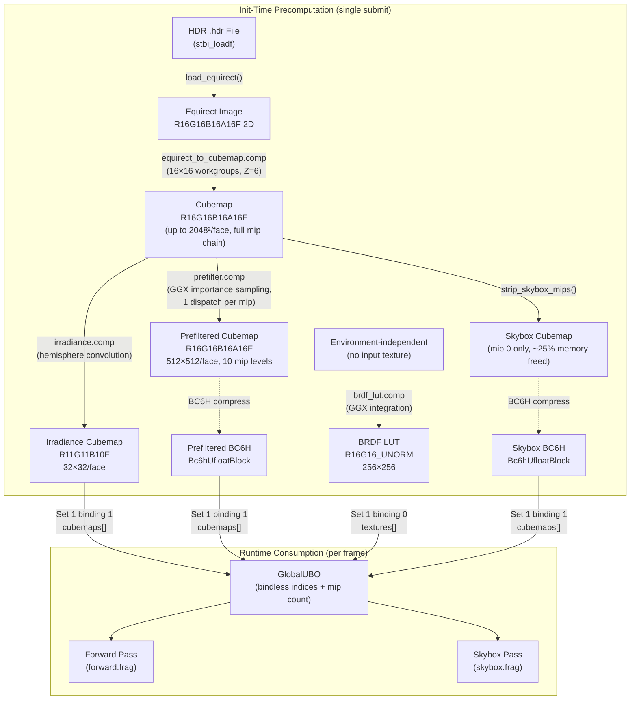

The **IBL module** transforms a single equirectangular HDR photograph into a complete environment lighting pipeline: a diffuse irradiance map for Lambertian surfaces, a mip-mapped prefiltered specular map for glossy reflections, and a BRDF integration LUT that decouples the Fresnel term from the environment. Together, these three textures implement the **Epic Split-Sum approximation** — factoring the rendering equation's integral into an environment-dependent prefilter and an environment-independent BRDF integral — enabling real-time PBR environment lighting with zero per-frame cost beyond three texture lookups.

Sources: [ibl.h](https://github.com/1PercentSync/himalaya/blob/main/framework/include/himalaya/framework/ibl.h#L1-L286), [ibl.cpp](https://github.com/1PercentSync/himalaya/blob/main/framework/src/ibl.cpp#L1-L629)

## Architecture Overview

The IBL system lives in **Layer 1 — Rendering Framework** and bridges two concerns: offline precomputation at initialization time, and runtime consumption by the forward rendering pass. The `IBL` class owns all GPU resources, orchestrates the multi-stage compute pipeline, registers products into the bindless descriptor arrays, and exposes only bindless indices to the rest of the renderer.



The entire precomputation pipeline executes within a **single immediate command buffer scope** (`begin_immediate()` / `end_immediate()`), ensuring all GPU work completes before the first render frame. Transient resources — compute pipelines, descriptor set layouts, temporary samplers, and image views — are collected into a deferred cleanup list and destroyed only after `end_immediate()` returns, guaranteeing GPU completion.

Sources: [ibl.cpp init()](https://github.com/1PercentSync/himalaya/blob/main/framework/src/ibl.cpp#L246-L382), [ibl.h class declaration](https://github.com/1PercentSync/himalaya/blob/main/framework/include/himalaya/framework/ibl.h#L39-L284)

## Pipeline Stages

### Stage 1 — HDR Loading and Equirect Upload

The pipeline begins with `load_equirect()`, which uses **stbi_loadf** to decode the `.hdr` file into RGB float32 pixels. Three transformations occur before GPU upload: an **RGB→RGBA channel expansion** (sampler2D requires 4 components), a **float32→float16 conversion** via `glm::packHalf1x16`, and a **HDR clamp** to 65504.0 (the float16 maximum) to prevent Inf/NaN from extreme radiance values like the sun disk. The resulting R16G16B16A16F 2D image is uploaded via a staging buffer with a compute-shader-visible layout transition.

Sources: [ibl.cpp load_equirect()](https://github.com/1PercentSync/himalaya/blob/main/framework/src/ibl.cpp#L388-L431)

### Stage 2 — Equirectangular to Cubemap Conversion

The `equirect_to_cubemap.comp` shader converts the 2:1 equirectangular projection into a six-face cubemap. Each invocation maps a cubemap texel coordinate to a 3D direction via `cube_dir()`, then converts that direction to equirectangular UV using inverse spherical mapping (`atan` for longitude, `asin` for latitude), and samples the equirect texture. The dispatch dimensions are `(ceil(face_size/16), ceil(face_size/16), 6)` — the Z dimension directly maps to cubemap face index.

**Face size derivation**: `min(bit_ceil(equirect_width / 4), 2048)`. Since an equirectangular map covers 360° horizontally and a cubemap face covers 90°, dividing by 4 yields the angular-equivalent resolution. `bit_ceil` rounds up to a power of 2 for GPU efficiency, capped at 2048 to limit memory. After the conversion dispatch, `generate_mips()` builds a complete mip chain via image blits — this chain is essential for the prefiltered environment map's filtered importance sampling.

Sources: [ibl_compute.cpp convert_equirect_to_cubemap()](https://github.com/1PercentSync/himalaya/blob/main/framework/src/ibl_compute.cpp#L23-L226), [equirect_to_cubemap.comp](https://github.com/1PercentSync/himalaya/blob/main/shaders/ibl/equirect_to_cubemap.comp#L1-L51), [ibl_common.glsl cube_dir()](https://github.com/1PercentSync/himalaya/blob/main/shaders/ibl/ibl_common.glsl#L18-L30)

### Stage 3 — Diffuse Irradiance Convolution

The irradiance map stores the **cosine-weighted hemisphere integral** of the environment for every direction, enabling constant-time diffuse environment lighting. The `irradiance.comp` shader performs this integration using **uniform angular stepping** in spherical coordinates with a step size of 0.01 radians, accumulating `L(ω) × cos(θ) × sin(θ)` per sample — where `sin(θ)` is the spherical Jacobian and `cos(θ)` is the Lambert weighting. The final sum is multiplied by `π / sample_count` for proper normalization.

The output format is **R11G11B10F** (`B10G11R11UfloatPack32`), an unsigned float format with no alpha channel — perfect for irradiance, which never needs alpha and benefits from the 32-bit texel footprint. At **32×32 per face** (6,144 total texels), the irradiance map is extremely low-resolution, which is appropriate since diffuse irradiance varies slowly across directions.

A firefly rejection threshold of 1000.0 prevents extreme HDR values from polluting the integration — a single sun texel at float16 max (65504) would otherwise dominate and corrupt the hemisphere average.

Sources: [ibl_compute.cpp compute_irradiance()](https://github.com/1PercentSync/himalaya/blob/main/framework/src/ibl_compute.cpp#L232-L420), [irradiance.comp](https://github.com/1PercentSync/himalaya/blob/main/shaders/ibl/irradiance.comp#L1-L72)

### Stage 4 — Prefiltered Specular Environment Map

The prefiltered cubemap encodes the **specular BRDF × environment** convolution at increasing roughness levels. Each mip level corresponds to a roughness value: mip 0 = mirror reflection (roughness 0), mip N = maximally blurred (roughness 1). The `prefilter.comp` shader uses **GGX importance sampling** with 1024 Hammersley quasi-random samples per texel.

**Filtered importance sampling** is the key quality technique: rather than sampling the cubemap at full resolution (which produces noise at high roughness), the shader computes the **PDF-based mip level** for each sample. The solid angle of each importance-sampled direction (`1 / (sample_count × PDF)`) is compared against the solid angle of a cubemap texel (`4π / (6 × resolution²)`), and the log₂ ratio selects the mip level at which to sample the environment. This eliminates high-frequency noise while preserving specular highlights.

The `Split-Sum` assumption (V = R = N) simplifies the integration: the reflection direction equals the normal, which means the prefiltered map can be looked up at runtime using just the reflection vector and roughness-derived mip level.

| Property | Value |
|---|---|
| Face resolution | 512×512 |
| Mip levels | 10 (derived from `floor(log2(512)) + 1`) |
| Format | R16G16B16A16F |
| Samples per texel | 1024 (Hammersley + GGX) |
| Roughness per mip | `mip / (mip_count - 1)` via push constant |
| Dispatch | One per mip level, `(ceil(mip_size/16), ceil(mip_size/16), 6)` |

Sources: [ibl_compute.cpp compute_prefiltered()](https://github.com/1PercentSync/himalaya/blob/main/framework/src/ibl_compute.cpp#L426-L632), [prefilter.comp](https://github.com/1PercentSync/himalaya/blob/main/shaders/ibl/prefilter.comp#L1-L80)

### Stage 5 — BRDF Integration LUT

The BRDF LUT is the **environment-independent** component of the Split-Sum approximation. For each `(NdotV, roughness)` pair, `brdf_lut.comp` integrates the GGX BRDF over the hemisphere to produce a **(scale, bias)** pair that reconstructs the Fresnel term:

```
F_integrated = F0 × scale + F0_remapped × bias
             = F0 × scale + (1 - F0) × bias
```

The shader uses the **IBL remapped geometry function** where `k = roughness² / 2` (compared to the analytic BRDF's `k = (roughness + 1)² / 8`), reducing occlusion for rougher surfaces since the environment's angular coverage provides natural occlusion compensation. The Smith geometry function splits into per-direction Schlick-GGX terms, and the integration accumulates `(1 - Fc) × G_Vis` into scale and `Fc × G_Vis` into bias, where `Fc = (1 - VdotH)⁵` is the Fresnel cofactor.

This LUT is computed **once** and cached with a fixed key `"brdf_lut"` — it never changes between environments. At 256×256 R16G16_UNORM, it occupies only 128 KB of GPU memory.

Sources: [ibl_compute.cpp compute_brdf_lut()](https://github.com/1PercentSync/himalaya/blob/main/framework/src/ibl_compute.cpp#L754-L883), [brdf_lut.comp](https://github.com/1PercentSync/himalaya/blob/main/shaders/ibl/brdf_lut.comp#L1-L92)

## Post-Processing Optimization — Mip Stripping and BC6H Compression

After prefiltering completes, the intermediate cubemap's mip chain (levels 1 through N) is no longer needed — mip 0 suffices for skybox rendering. `strip_skybox_mips()` creates a **1-mip copy** via `vkCmdCopyImage2` and swaps the handle, freeing approximately **25% of cubemap memory** (for a 2048² cubemap, this recovers ~64 MB).

Both the skybox cubemap and the prefiltered cubemap then undergo **GPU BC6H compression**. The `compress_cubemaps_bc6h()` method dispatches `bc6h.comp` for every face×mip combination, producing Bc6hUfloatBlock compressed data that is written to a staging SSBO and copied into new BC6H cubemap images. BC6H provides **6:1 compression** for HDR data (128 bits per 4×4 block vs. 64 bits per texel for RGBA16F) with minimal quality loss, making it the standard format for HDR cubemaps in real-time rendering. The compressor includes **least-squares endpoint refinement** (3 iterations) and evaluates **33 encoding modes** (mode 11 + 32 two-subset partition patterns) per block for high quality.

Sources: [ibl_compute.cpp strip_skybox_mips()](https://github.com/1PercentSync/himalaya/blob/main/framework/src/ibl_compute.cpp#L638-L748), [ibl_compress.cpp compress_cubemaps_bc6h()](https://github.com/1PercentSync/himalaya/blob/main/framework/src/ibl_compress.cpp#L23-L332), [bc6h.comp](https://github.com/1PercentSync/himalaya/blob/main/shaders/compress/bc6h.comp#L1-L28)

## Disk Caching — KTX2 Roundtrip

All IBL products are cached to **KTX2 files** in the system temp directory, keyed by the HDR file's content hash. On subsequent runs, if all three cubemap cache files plus the BRDF LUT cache exist, the entire compute pipeline is bypassed — cached images are uploaded directly via staging buffers. The caching strategy:

| Product | Cache Key | Format |
|---|---|---|
| Skybox cubemap | `{hdr_hash}_skybox.ktx2` | BC6H (compressed) |
| Irradiance cubemap | `{hdr_hash}_irradiance.ktx2` | R11G11B10F |
| Prefiltered cubemap | `{hdr_hash}_prefiltered.ktx2` | BC6H (compressed) |
| BRDF LUT | `brdf_lut.ktx2` (fixed key) | R16G16_UNORM |

After GPU computation, products are read back via GPU→CPU staging buffers (`vkCmdCopyImageToBuffer2`) and written as KTX2 files. Readback buffers survive `end_immediate()` to ensure CPU-side data is valid. Cache writes occur **after** `end_immediate()` returns, avoiding any GPU synchronization concerns.

Sources: [ibl.cpp init() cache logic](https://github.com/1PercentSync/himalaya/blob/main/framework/src/ibl.cpp#L263-L371), [ibl.cpp readback_image()](https://github.com/1PercentSync/himalaya/blob/main/framework/src/ibl.cpp#L44-L171), [ibl.cpp write_readback_cache()](https://github.com/1PercentSync/himalaya/blob/main/framework/src/ibl.cpp#L179-L204), [cache.h](https://github.com/1PercentSync/himalaya/blob/main/framework/include/himalaya/framework/cache.h#L1-L59)

## Fallback — Neutral Gray Cubemaps

When HDR loading fails (missing file, corrupt data), `create_fallback_cubemaps()` generates **1×1 neutral gray cubemaps** (0.1, 0.1, 0.1, 1.0) for all three cubemap products. The rendering pipeline operates identically — same bindless indices, same shader code, no conditional branches. The dim environment simply produces minimal ambient lighting and an invisible skybox, gracefully degrading rather than crashing.

Sources: [ibl.cpp create_fallback_cubemaps()](https://github.com/1PercentSync/himalaya/blob/main/framework/src/ibl.cpp#L437-L543)

## Bindless Registration and Runtime Consumption

After all compute stages complete, `register_bindless_resources()` creates a **shared linear-mipmap sampler** and registers four bindless entries:

- **Skybox cubemap** → Set 1, binding 1 (`cubemaps[]`) — consumed by the skybox pass
- **Irradiance cubemap** → Set 1, binding 1 (`cubemaps[]`) — consumed by forward.frag
- **Prefiltered cubemap** → Set 1, binding 1 (`cubemaps[]`) — consumed by forward.frag
- **BRDF LUT** → Set 1, binding 0 (`textures[]`) — consumed by forward.frag

The renderer copies these indices into `GlobalUBO` each frame, making them accessible to all shaders. The forward pass applies the **Split-Sum approximation** in three texture lookups:

```glsl
// Diffuse IBL (irradiance × Lambertian albedo)
vec3 irradiance  = texture(cubemaps[nonuniformEXT(global.irradiance_cubemap_index)], rotated_N).rgb;
vec3 ibl_diffuse = irradiance * diffuse_color;

// Specular IBL (prefiltered environment × BRDF LUT Fresnel reconstruction)
float mip        = roughness * float(global.prefiltered_mip_count - 1u);
vec3 prefiltered = textureLod(cubemaps[nonuniformEXT(global.prefiltered_cubemap_index)], rotated_R, mip).rgb;
vec2 brdf_lut    = texture(textures[nonuniformEXT(global.brdf_lut_index)], vec2(NdotV, roughness)).rg;
vec3 ibl_specular = prefiltered * (F0 * brdf_lut.x + brdf_lut.y);
```

The `ibl_rotation_sin` / `ibl_rotation_cos` fields in GlobalUBO enable **runtime environment rotation** via a Y-axis rotation applied to normal and reflection vectors before cubemap sampling — allowing the user to spin the environment without recomputing any IBL products.

Sources: [ibl.cpp register_bindless_resources()](https://github.com/1PercentSync/himalaya/blob/main/framework/src/ibl.cpp#L549-L576), [forward.frag IBL section](https://github.com/1PercentSync/himalaya/blob/main/shaders/forward.frag#L239-L249), [bindings.glsl GlobalUBO](https://github.com/1PercentSync/himalaya/blob/main/shaders/common/bindings.glsl#L88-L135)

## GPU Resource Summary

| Product | Dimensions | Format | Channels | Approx. Size |
|---|---|---|---|---|
| Skybox cubemap (BC6H) | up to 2048² × 6 faces, 1 mip | Bc6hUfloatBlock | RGB HDR | ~8 MB |
| Irradiance cubemap | 32² × 6 faces, 1 mip | R11G11B10F | RGB HDR | ~24 KB |
| Prefiltered cubemap (BC6H) | 512² × 6 faces, 10 mips | Bc6hUfloatBlock | RGB HDR | ~1.5 MB |
| BRDF LUT | 256² × 1 layer, 1 mip | R16G16_UNORM | Scale + Bias | ~128 KB |
| Shared IBL sampler | — | Linear/Linear, ClampToEdge | — | Negligible |

Sources: [ibl.h member declarations](https://github.com/1PercentSync/himalaya/blob/main/framework/include/himalaya/framework/ibl.h#L259-L283)

## Compute Shader Shared Utilities

All IBL compute shaders share [ibl_common.glsl](https://github.com/1PercentSync/himalaya/blob/main/shaders/ibl/ibl_common.glsl#L1-L87), which provides three core functions:

- **`cube_dir(face, uv)`** — Maps a cubemap face index (0–5) and normalized UV coordinate to a 3D world-space direction, matching Vulkan's cubemap face layout (+X, -X, +Y, -Y, +Z, -Z).
- **`radical_inverse_vdc(bits)`** — Van der Corput radical inverse (bit reversal) for quasi-random sequence generation.
- **`hammersley(i, n)`** — Returns the i-th point of the 2D Hammersley sequence, providing low-discrepancy sampling over [0,1)² for Monte Carlo integration.

The `importance_sample_ggx(xi, N, roughness)` function generates microfacet half-vectors proportional to the GGX NDF by converting quasi-random samples to tangent-space spherical coordinates using the inverse CDF of the GGX distribution, then transforming to world space via a tangent frame constructed around the surface normal.

Sources: [ibl_common.glsl](https://github.com/1PercentSync/himalaya/blob/main/shaders/ibl/ibl_common.glsl#L1-L87)

## Lifecycle and Ownership

The `IBL` class follows a simple init/destroy lifecycle. `init()` performs all GPU work and must be called before rendering begins. `destroy()` unregisters bindless entries (returning slots to the free lists) and destroys owned images and the sampler. The equirect input image is explicitly destroyed within `init()` before it returns — it never outlives the init scope. All pipeline objects, descriptor layouts, temporary samplers, and image views are captured in a `DeferredCleanup` vector and destroyed as a batch after `end_immediate()`, preventing premature destruction while the GPU may still be reading them.

Sources: [ibl.cpp init()](https://github.com/1PercentSync/himalaya/blob/main/framework/src/ibl.cpp#L246-L382), [ibl.cpp destroy()](https://github.com/1PercentSync/himalaya/blob/main/framework/src/ibl.cpp#L582-L598)

## What to Read Next

- [Forward Pass — Cook-Torrance PBR, IBL Split-Sum, and Multi-Bounce AO](https://github.com/1PercentSync/himalaya/blob/main/17-forward-pass-cook-torrance-pbr-ibl-split-sum-and-multi-bounce-ao) — how the precomputed IBL products are consumed at runtime for final pixel shading
- [Skybox and Tonemapping Passes](https://github.com/1PercentSync/himalaya/blob/main/21-skybox-and-tonemapping-passes) — how the skybox cubemap is rendered as background
- [Bindless Descriptor Architecture — Three-Set Layout and Texture Registration](https://github.com/1PercentSync/himalaya/blob/main/7-bindless-descriptor-architecture-three-set-layout-and-texture-registration) — how the bindless indices enable zero-overhead texture access
- [GLSL Shader Architecture — Shared Bindings, BRDF Library, and Feature Flags](https://github.com/1PercentSync/himalaya/blob/main/25-glsl-shader-architecture-shared-bindings-brdf-library-and-feature-flags) — the shader-side binding layout and BRDF utility functions